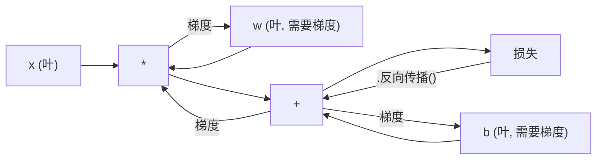
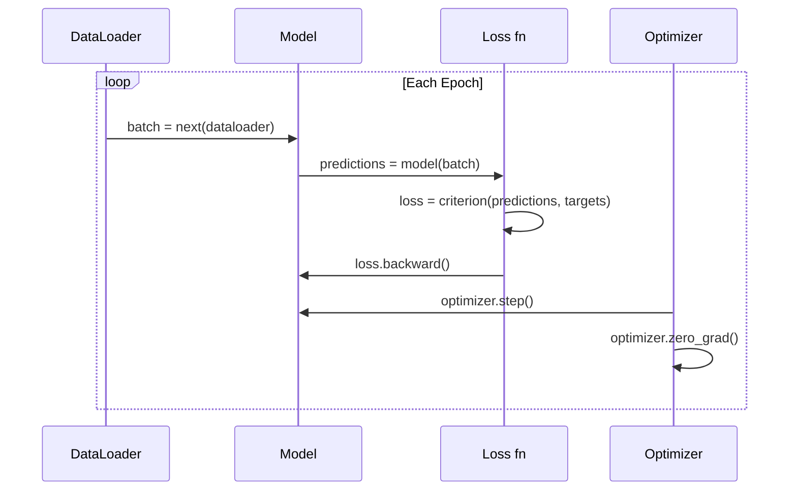

# PyTorch 入门

> 你已用活塞和曲轴造出了发动机；现在来学习所有人真正驾驶的那一台。

**类型：** 构建  
**学习实现：** Python  
**前置课程：** 第 03.10 课（构建自己的迷你框架）  
**预计时间：** 约 75 分钟

## 学习目标

- 使用 PyTorch 的 nn.Module、nn.Sequential 和 autograd 构建并训练神经网络。
- 使用 PyTorch tensor、GPU 加速和标准训练循环（zero_grad、forward、loss、backward、step）。
- 将从零构建的迷你框架组件转换为对应的 PyTorch 组件。
- 在同一任务上分析并比较纯 Python 框架与 PyTorch 的训练速度。

## 问题

你已有可工作的迷你框架：线性层、ReLU、dropout、批归一化、Adam、DataLoader 和训练循环，它能用纯 Python 在圆形分类问题上训练四层网络。

但同一问题上，它也比 PyTorch 慢 500 倍。

迷你框架一次处理一个样本，内部嵌套 Python 循环；PyTorch 将相同操作调度给在 GPU 上运行的优化 C++/CUDA kernel。单张 NVIDIA A100 上，PyTorch 可在约 6 小时内用 ImageNet（128 万张图像）训练 ResNet-50（2560 万参数）；你的框架在同任务上约需 3000 小时——前提是它没有先耗尽内存。

速度并非唯一差距。框架没有 GPU 支持、没有自动微分（每个模块的 backward() 都手写）、没有序列化、没有分布式训练、没有混合精度，也无法在不靠 print 的情况下调试梯度流。

PyTorch 填补了每一项空白，同时保留你已建立的完全相同心智模型：Module、forward()、parameters()、backward()、optimizer.step()。概念一一迁移，语法几乎相同；差异是 PyTorch 在你从零设计的相同接口后封装了十年的系统工程。

## 概念

### PyTorch 为什么胜出

2015 年，TensorFlow 要求在运行任何内容前定义静态计算图：构图、编译，再送入数据；调试意味着盯着图可视化，改架构意味着从头重建图。

PyTorch 在 2017 年以不同理念推出：即时执行（eager execution）。你写 Python，它立即执行。`y = model(x)` 会现在就计算 y，而不是“向稍后计算 y 的图添加节点”。因此标准 Python 调试工具都能用：print() 能用，pdb 能用，forward 中的 if/else 能用。

到 2020 年，市场已给出答案：PyTorch 在 ML 研究论文中的份额从 2017 年的 7% 增至 2022 年的 75% 以上。Meta、Google DeepMind、OpenAI、Anthropic 和 Hugging Face 都将它作为主要框架；TensorFlow 2.x 随后采用即时执行，也从侧面承认了 PyTorch 设计正确。

教训是开发者体验会累积：慢 10% 但调试快 50% 的框架每次都会胜出。

### Tensor <!-- learning-atlas: tensors -->

Tensor 是多维数组，具有三个关键属性：shape、dtype 和 device。

```python
import torch

x = torch.zeros(3, 4)           # shape: (3, 4), dtype: float32, device: cpu
x = torch.randn(2, 3, 224, 224) # batch of 2 RGB images, 224x224
x = torch.tensor([1, 2, 3])     # from a Python list
```

**Shape** 是维度：标量形状为 ()，向量为 (n,)，矩阵为 (m, n)，一批图像为 (batch, channels, height, width)。

**Dtype** 控制精度与内存。

| dtype | 位数 | 范围 | 用例 |
|-------|------|------|------|
| float32 | 32 | 约 7 位十进制数字 | 默认训练 |
| float16 | 16 | 约 3.3 位十进制数字 | 混合精度 |
| bfloat16 | 16 | 与 float32 相同范围、精度更低 | LLM 训练 |
| int8 | 8 | -128 到 127 | 量化推理 |

**Device** 决定计算在哪里发生。

```python
device = torch.device("cuda" if torch.cuda.is_available() else "cpu")
x = torch.randn(3, 4, device=device)
x = x.to("cuda")
x = x.cpu()
```

每项运算都要求所有 tensor 位于同一设备。这是初学者最常遇到的 PyTorch 错误：`RuntimeError: Expected all tensors to be on the same device`。计算前把所有内容移动到同一设备即可修复。

**重塑**是常数时间操作：它改变元数据而非数据。

```python
x = torch.randn(2, 3, 4)
x.view(2, 12)      # reshape to (2, 12) -- must be contiguous
x.reshape(6, 4)    # reshape to (6, 4) -- works always
x.permute(2, 0, 1) # reorder dimensions
x.unsqueeze(0)     # add dimension: (1, 2, 3, 4)
x.squeeze()        # remove size-1 dimensions
```

### Autograd

迷你框架要求为每个模块实现 backward()；PyTorch 不需要。它将 tensor 上的每项操作记录到有向无环图（计算图）中，再反向遍历该图自动计算梯度。



与迷你框架的关键差异是 PyTorch 使用基于 tape 的自动微分。每次前向操作都会追加到“tape”，调用 `.backward()` 会反向重放它。

```python
x = torch.randn(3, requires_grad=True)
y = x ** 2 + 3 * x
z = y.sum()
z.backward()
print(x.grad)  # dz/dx = 2x + 3
```

Autograd 的三条规则：

1. 只有 `requires_grad=True` 的叶 tensor 会累积梯度。
2. 梯度默认累积——每次反向传播前调用 `optimizer.zero_grad()`。
3. `torch.no_grad()` 禁用梯度跟踪（评估时使用）。

### nn.Module

`nn.Module` 是 PyTorch 中每个神经网络组件的基类；第 10 课已构建过这个抽象。PyTorch 的版本增加自动参数注册、递归模块发现、设备管理和 state dict 序列化。

```python
import torch.nn as nn

class MLP(nn.Module):
    def __init__(self, input_dim, hidden_dim, output_dim):
        super().__init__()
        self.layer1 = nn.Linear(input_dim, hidden_dim)
        self.relu = nn.ReLU()
        self.layer2 = nn.Linear(hidden_dim, output_dim)

    def forward(self, x):
        x = self.layer1(x)
        x = self.relu(x)
        x = self.layer2(x)
        return x
```

在 `__init__` 中把 `nn.Module` 或 `nn.Parameter` 赋为属性时，PyTorch 会自动注册它。`model.parameters()` 递归收集所有注册参数，因此无需像迷你框架那样手动收集权重。

关键构件：

| 模块 | 功能 | 参数 |
|------|------|------|
| nn.Linear(in, out) | Wx + b | in*out + out |
| nn.Conv2d(in_ch, out_ch, k) | 二维卷积 | in_ch*out_ch*k*k + out_ch |
| nn.BatchNorm1d(features) | 归一化激活 | 2 * features |
| nn.Dropout(p) | 随机置零 | 0 |
| nn.ReLU() | max(0, x) | 0 |
| nn.GELU() | 高斯误差线性 | 0 |
| nn.Embedding(vocab, dim) | 查找表 | vocab * dim |
| nn.LayerNorm(dim) | 按样本归一化 | 2 * dim |

### 损失函数与优化器

PyTorch 为你构建的全部功能提供生产级版本。

**损失函数**（来自 `torch.nn`）：

| 损失 | 任务 | 输入 |
|------|------|------|
| nn.MSELoss() | 回归 | 任意形状 |
| nn.CrossEntropyLoss() | 多类分类 | logits（不是 softmax） |
| nn.BCEWithLogitsLoss() | 二元分类 | logits（不是 sigmoid） |
| nn.L1Loss() | 回归（稳健） | 任意形状 |
| nn.CTCLoss() | 序列对齐 | 对数概率 |

注意：`CrossEntropyLoss` 内部组合了 `LogSoftmax` + `NLLLoss`，应传入原始 logits 而不是 softmax 输出。这个常见错误会悄悄产生错误梯度。

**优化器**（来自 `torch.optim`）：

| 优化器 | 适用时机 | 典型 LR |
|--------|----------|---------|
| SGD(params, lr, momentum) | CNN、调优完善的管线 | 0.01--0.1 |
| Adam(params, lr) | 默认起点 | 1e-3 |
| AdamW(params, lr, weight_decay) | Transformer、微调 | 1e-4--1e-3 |
| LBFGS(params) | 小规模、二阶 | 1.0 |

### 训练循环

每个 PyTorch 训练循环都遵循相同的五步模式，第 10 课你已经学过。



标准模式：

```python
for epoch in range(num_epochs):
    model.train()
    for inputs, targets in train_loader:
        inputs, targets = inputs.to(device), targets.to(device)
        optimizer.zero_grad()
        outputs = model(inputs)
        loss = criterion(outputs, targets)
        loss.backward()
        optimizer.step()
```

批循环内五行代码，就是训练 GPT-4、Stable Diffusion 和 LLaMA 的五行。架构会变，数据会变，这五行不会。

### Dataset 和 DataLoader

PyTorch 的 `Dataset` 是具有 `__len__` 与 `__getitem__` 两个方法的抽象类；`DataLoader` 在此基础上提供分批、打乱和多进程加载。

```python
from torch.utils.data import Dataset, DataLoader

class MNISTDataset(Dataset):
    def __init__(self, images, labels):
        self.images = images
        self.labels = labels

    def __len__(self):
        return len(self.labels)

    def __getitem__(self, idx):
        return self.images[idx], self.labels[idx]

loader = DataLoader(dataset, batch_size=64, shuffle=True, num_workers=4)
```

`num_workers=4` 会启动 4 个进程，在 GPU 训练当前批时并行加载数据。磁盘受限的工作负载（大图像、音频）中，这一点单独就能使训练速度翻倍。

### GPU 训练

把模型移动到 GPU：

```python
device = torch.device("cuda" if torch.cuda.is_available() else "cpu")
model = model.to(device)
```

这会递归地将每个参数与缓冲区移至 GPU；然后在训练时移动每批数据：

```python
inputs, targets = inputs.to(device), targets.to(device)
```

**混合精度**：在现代 GPU（A100、H100、RTX 4090）上以 float16 运行前向/反向、以 float32 保留主权重，可使内存用量减半、吞吐量翻倍。

```python
from torch.amp import autocast, GradScaler

scaler = GradScaler()
for inputs, targets in loader:
    with autocast(device_type="cuda"):
        outputs = model(inputs)
        loss = criterion(outputs, targets)
    scaler.scale(loss).backward()
    scaler.step(optimizer)
    scaler.update()
    optimizer.zero_grad()
```

### 对比：迷你框架、PyTorch 与 JAX

| 特性 | 迷你框架（L10） | PyTorch | JAX |
|------|-----------------|---------|-----|
| 自动微分 | 手动 backward() | 基于 tape 的 autograd | 函数式变换 |
| 执行 | 即时（Python 循环） | 即时（C++ kernel） | 跟踪 + JIT 编译 |
| GPU 支持 | 无 | 是（CUDA、ROCm、MPS） | 是（CUDA、TPU） |
| 速度（MNIST MLP） | 约 300 秒/epoch | 约 0.5 秒/epoch | 约 0.3 秒/epoch |
| 模块系统 | 自定义 Module | nn.Module | 无状态函数（Flax/Equinox） |
| 调试 | print() | print()、pdb、breakpoint() | 较难（JIT 跟踪破坏 print） |
| 生态 | 无 | Hugging Face、Lightning、timm | Flax、Optax、Orbax |
| 学习曲线 | 你已构建 | 中等 | 陡峭（函数式范式） |
| 生产使用 | 玩具问题 | Meta、OpenAI、Anthropic、HF | Google DeepMind、Midjourney |

```figure
dropout-mask
```

## 构建实现

只用 PyTorch 原语在 MNIST 上训练三层 MLP：不使用高层包装器，也不用 `torchvision.datasets`；自行下载并解析原始数据。

### 步骤 1：从原始文件加载 MNIST

MNIST 有四个 gzip 文件：训练图像（60,000 x 28 x 28）、训练标签、测试图像（10,000 x 28 x 28）、测试标签。下载并解析二进制格式。

```python
import torch
import torch.nn as nn
import struct
import gzip
import urllib.request
import os

def download_mnist(path="./mnist_data"):
    base_url = "https://storage.googleapis.com/cvdf-datasets/mnist/"
    files = [
        "train-images-idx3-ubyte.gz",
        "train-labels-idx1-ubyte.gz",
        "t10k-images-idx3-ubyte.gz",
        "t10k-labels-idx1-ubyte.gz",
    ]
    os.makedirs(path, exist_ok=True)
    for f in files:
        filepath = os.path.join(path, f)
        if not os.path.exists(filepath):
            urllib.request.urlretrieve(base_url + f, filepath)

def load_images(filepath):
    with gzip.open(filepath, "rb") as f:
        magic, num, rows, cols = struct.unpack(">IIII", f.read(16))
        data = f.read()
        images = torch.frombuffer(bytearray(data), dtype=torch.uint8)
        images = images.reshape(num, rows * cols).float() / 255.0
    return images

def load_labels(filepath):
    with gzip.open(filepath, "rb") as f:
        magic, num = struct.unpack(">II", f.read(8))
        data = f.read()
        labels = torch.frombuffer(bytearray(data), dtype=torch.uint8).long()
    return labels
```

### 步骤 2：定义模型

三层 MLP：784 -> 256 -> 128 -> 10，使用 ReLU，使用 dropout 正则化。为保持简单，不使用批归一化。

```python
class MNISTModel(nn.Module):
    def __init__(self):
        super().__init__()
        self.net = nn.Sequential(
            nn.Linear(784, 256),
            nn.ReLU(),
            nn.Dropout(0.2),
            nn.Linear(256, 128),
            nn.ReLU(),
            nn.Dropout(0.2),
            nn.Linear(128, 10),
        )

    def forward(self, x):
        return self.net(x)
```

输出层产生 10 个原始 logits（每个数字一个），没有 softmax——`CrossEntropyLoss` 会在内部处理。

参数数：784*256 + 256 + 256*128 + 128 + 128*10 + 10 = 235,146。以现代标准看很小，GPT-2 small 有 124M；它只需数秒即可训练。

### 步骤 3：训练循环

标准的前向—损失—反向—更新模式。

```python
def train_one_epoch(model, loader, criterion, optimizer, device):
    model.train()
    total_loss = 0
    correct = 0
    total = 0
    for images, labels in loader:
        images, labels = images.to(device), labels.to(device)
        optimizer.zero_grad()
        outputs = model(images)
        loss = criterion(outputs, labels)
        loss.backward()
        optimizer.step()
        total_loss += loss.item() * images.size(0)
        _, predicted = outputs.max(1)
        correct += predicted.eq(labels).sum().item()
        total += labels.size(0)
    return total_loss / total, correct / total


def evaluate(model, loader, criterion, device):
    model.eval()
    total_loss = 0
    correct = 0
    total = 0
    with torch.no_grad():
        for images, labels in loader:
            images, labels = images.to(device), labels.to(device)
            outputs = model(images)
            loss = criterion(outputs, labels)
            total_loss += loss.item() * images.size(0)
            _, predicted = outputs.max(1)
            correct += predicted.eq(labels).sum().item()
            total += labels.size(0)
    return total_loss / total, correct / total
```

注意评估期间的 `torch.no_grad()`：它禁用 autograd，减少内存并加速推理；没有它，PyTorch 会构建永远不会使用的计算图。

### 步骤 4：连接所有部分

```python
def main():
    device = torch.device("cuda" if torch.cuda.is_available() else "cpu")

    download_mnist()
    train_images = load_images("./mnist_data/train-images-idx3-ubyte.gz")
    train_labels = load_labels("./mnist_data/train-labels-idx1-ubyte.gz")
    test_images = load_images("./mnist_data/t10k-images-idx3-ubyte.gz")
    test_labels = load_labels("./mnist_data/t10k-labels-idx1-ubyte.gz")

    train_dataset = torch.utils.data.TensorDataset(train_images, train_labels)
    test_dataset = torch.utils.data.TensorDataset(test_images, test_labels)
    train_loader = torch.utils.data.DataLoader(
        train_dataset, batch_size=64, shuffle=True
    )
    test_loader = torch.utils.data.DataLoader(
        test_dataset, batch_size=256, shuffle=False
    )

    model = MNISTModel().to(device)
    criterion = nn.CrossEntropyLoss()
    optimizer = torch.optim.Adam(model.parameters(), lr=1e-3)

    num_params = sum(p.numel() for p in model.parameters())
    print(f"Device: {device}")
    print(f"Parameters: {num_params:,}")
    print(f"Train samples: {len(train_dataset):,}")
    print(f"Test samples: {len(test_dataset):,}")
    print()

    for epoch in range(10):
        train_loss, train_acc = train_one_epoch(
            model, train_loader, criterion, optimizer, device
        )
        test_loss, test_acc = evaluate(
            model, test_loader, criterion, device
        )
        print(
            f"Epoch {epoch+1:2d} | "
            f"Train Loss: {train_loss:.4f} | Train Acc: {train_acc:.4f} | "
            f"Test Loss: {test_loss:.4f} | Test Acc: {test_acc:.4f}"
        )

    torch.save(model.state_dict(), "mnist_mlp.pt")
    print(f"\nModel saved to mnist_mlp.pt")
    print(f"Final test accuracy: {test_acc:.4f}")
```

10 个 epoch 后的预期输出：测试准确率约 97.8%。CPU 训练约 30 秒，GPU 约 5 秒；使用同一架构的迷你框架约需 45 分钟。

## 应用

### 快速比较：迷你框架与 PyTorch

| 迷你框架（第 10 课） | PyTorch |
|----------------------|---------|
| `model = Sequential(Linear(784, 256), ReLU(), ...)` | `model = nn.Sequential(nn.Linear(784, 256), nn.ReLU(), ...)` |
| `pred = model.forward(x)` | `pred = model(x)` |
| `optimizer.zero_grad()` | `optimizer.zero_grad()` |
| `grad = criterion.backward()` 后接 `model.backward(grad)` | `loss.backward()` |
| `optimizer.step()` | `optimizer.step()` |
| 无 GPU | `model.to("cuda")` |
| 每个模块手动 backward | Autograd 处理全部 |

接口几乎相同，差别在所有底层实现。

### 保存与加载模型

```python
torch.save(model.state_dict(), "model.pt")

model = MNISTModel()
model.load_state_dict(torch.load("model.pt", weights_only=True))
model.eval()
```

始终保存 `state_dict()`（参数字典），而不是模型对象。保存模型对象使用 pickle，重构代码时会失效；state dict 可移植。

### 学习率调度

```python
scheduler = torch.optim.lr_scheduler.CosineAnnealingLR(
    optimizer, T_max=10
)
for epoch in range(10):
    train_one_epoch(model, train_loader, criterion, optimizer, device)
    scheduler.step()
```

PyTorch 提供 15+ 种调度器：StepLR、ExponentialLR、CosineAnnealingLR、OneCycleLR、ReduceLROnPlateau，全部插入同一个优化器接口。

## 交付物

本课产出两个工件：

- `outputs/prompt-pytorch-debugger.md`——诊断常见 PyTorch 训练失败的提示词。
- `outputs/skill-pytorch-patterns.md`——PyTorch 训练模式的技能参考。

## 练习

1. **添加批归一化。** 在每个线性层后、激活前插入 `nn.BatchNorm1d`。比较测试准确率、训练速度与仅 dropout 版本的差异；批归一化应以更少 epoch 达到 98% 以上。
2. **实现学习率查找器。** 用指数增长的学习率（从 1e-7 到 1.0）训练一 epoch，绘制损失与 LR；最优 LR 在损失开始上升前。用它为 MNIST 模型选择更好的 LR。
3. **以混合精度迁移到 GPU。** 向训练循环添加 `torch.amp.autocast` 和 `GradScaler`，在 GPU 上比较有无混合精度的吞吐量（样本/秒）；A100 上应约快 2 倍。
4. **构建自定义 Dataset。** 下载 Fashion-MNIST（格式与 MNIST 相同但为服装），实现带 `__getitem__`、`__len__` 的 `FashionMNISTDataset(Dataset)`，训练同一 MLP 并比较准确率；Fashion-MNIST 更难，预期约 88% 对 98%。
5. **用带动量 SGD 替换 Adam。** 用 `SGD(params, lr=0.01, momentum=0.9)` 训练，比较收敛曲线；再加 `CosineAnnealingLR`，查看第 10 个 epoch 时 SGD 是否追上 Adam。

## 关键术语

| 术语 | 常见说法 | 实际含义 |
|------|----------|----------|
| Tensor | “多维数组” | 类型化、感知设备且每项操作内建自动微分支持的数组 |
| Autograd | “自动反向传播” | 前向时记录操作、反向重放以精确计算梯度的基于 tape 系统 |
| nn.Module | “一层” | 可微计算块的基类：注册参数、支持嵌套、处理训练/评估模式 |
| state_dict | “模型权重” | 将参数名映射到 tensor 的 OrderedDict，是训练模型可移植、可序列化的表示 |
| .backward() | “计算梯度” | 反向遍历计算图，为每个 requires_grad=True 的叶 tensor 计算并累积梯度 |
| .to(device) | “移动到 GPU” | 递归传输所有参数和缓冲区到指定设备（CPU、CUDA、MPS） |
| DataLoader | “数据管线” | 从 Dataset 分批、打乱且可并行加载数据的迭代器 |
| 混合精度 | “使用 float16” | 以 float16 进行前向/反向以提速，同时保留 float32 主权重以维持数值稳定 |
| 即时执行 | “现在就运行” | 调用即执行，而非延迟到后续编译；PyTorch 与 TF 1.x 的核心设计差异 |
| zero_grad | “重置梯度” | 下一次反向传播前将所有参数梯度设为零，因为 PyTorch 默认累积梯度 |

## 延伸阅读

- Paszke 等，《PyTorch: An Imperative Style, High-Performance Deep Learning Library》（2019）——解释 PyTorch 设计取舍的原始论文。
- PyTorch 教程《Learning PyTorch with Examples》（https://pytorch.org/tutorials/beginner/pytorch_with_examples.html）——从 tensor 到 nn.Module 的官方路径。
- PyTorch Performance Tuning Guide（https://pytorch.org/tutorials/recipes/recipes/tuning_guide.html）——混合精度、DataLoader workers、固定内存等生产优化。
- Horace He，《Making Deep Learning Go Brrrr》（https://horace.io/brrr_intro.html）——解释 GPU 训练为何迅速及 PyTorch 专属优化策略。
