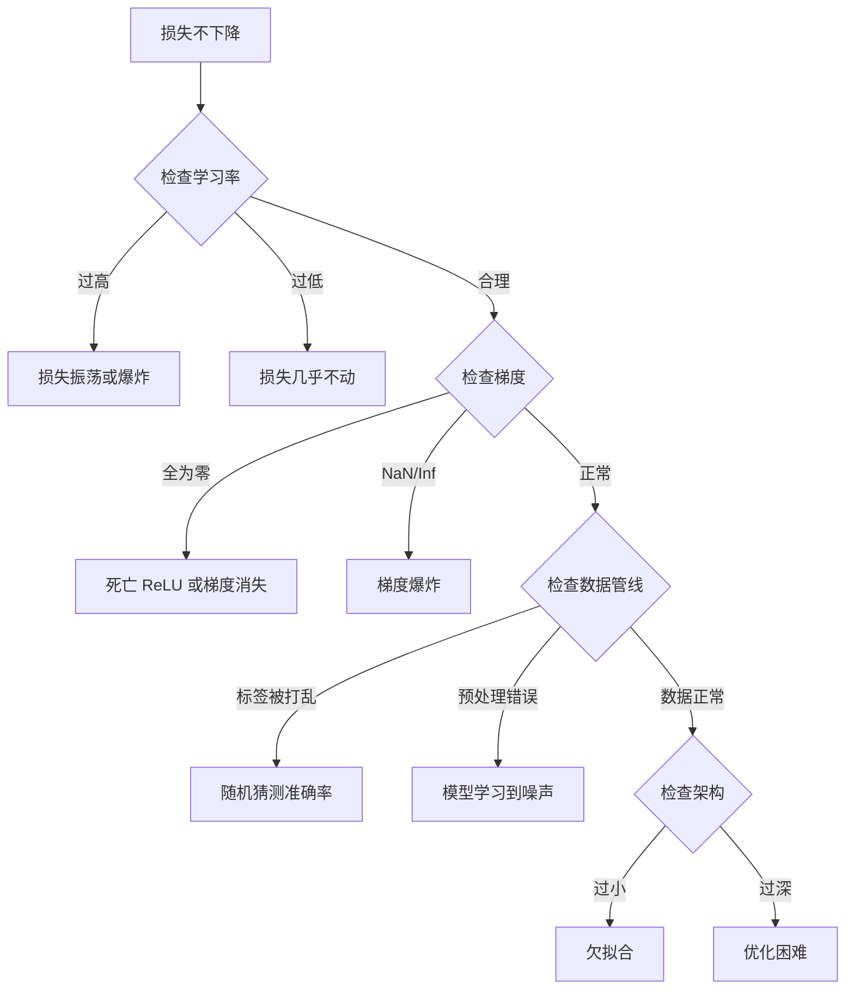
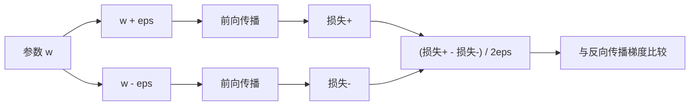
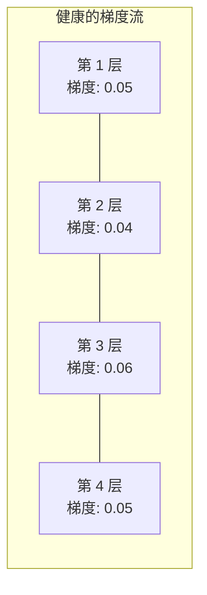
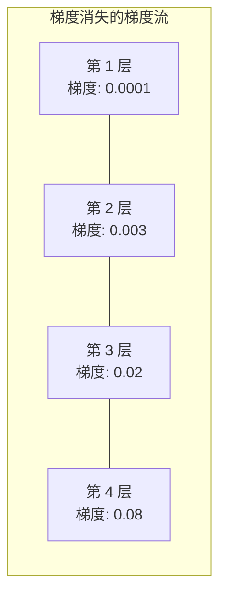
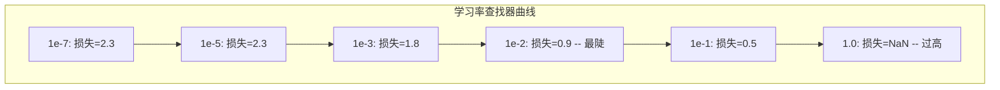

# 调试神经网络

> 网络编译了、运行了、产生了数值；数值却是错的，而且没有任何崩溃。欢迎来到最难的调试：没有错误消息的那一种。

**类型：** 构建  
**学习实现：** Python、PyTorch  
**前置课程：** Phase 03 第 01–10 课（尤其是反向传播、损失函数、优化器）  
**预计时间：** 约 90 分钟

## 学习目标

- 用系统调试策略诊断常见神经网络失败（NaN 损失、平坦损失曲线、过拟合、振荡）。
- 应用“过拟合一个批次”技术，验证模型架构和训练循环正确。
- 检查梯度大小、激活分布、权重范数，发现梯度消失/爆炸问题。
- 构建覆盖数据管线、模型架构、损失函数、优化器和学习率问题的调试清单。

## 问题

传统软件坏了通常会崩溃：空指针抛异常，类型不匹配在编译时报错，off-by-one 会产生明显错误输出。

神经网络没有这种便利。

损坏的神经网络仍可完整运行、打印损失值、输出预测；损失也许下降，预测看起来也许合理，但模型可能静默地学习捷径、记忆噪声，或收敛到无用局部极小值。Google 研究人员估计，ML 调试时间的 60–70% 花在不报错却降低模型质量的“静默” bug 上。

工作模型和损坏模型之间往往只差一行：漏掉 `zero_grad()`、维度转置、学习率相差 10 倍。“Recipe for Training Neural Networks”（2019）开篇就说：“最常见的神经网络错误是不崩溃的 bug。”

本课教你找到它们。

## 概念

### 调试心态

忘记“print 祈祷式”调试。神经网络调试需要系统方法：反馈环很慢（每次训练运行需数分钟到数小时），症状又含糊（坏损失可能有 20 种原因）。

黄金法则：**从简单开始，一次添加一个复杂部件，并独立验证每个部件。**



### 症状 1：损失不下降

这是最常见抱怨：训练循环运行、epoch 推进，损失却保持平坦或剧烈振荡。

**学习率错误。** 过高时损失振荡或跳为 NaN；过低时下降慢到看似不动。Adam 从 1e-3 开始，SGD 从 1e-1 或 1e-2 开始。在认定其他错误前，总要先尝试跨度各为 10 倍的三个学习率（如 1e-2、1e-3、1e-4）。

**死亡 ReLU。** ReLU 神经元收到大的负输入时输出 0、梯度也为 0，此后永远无法激活。若死掉足够多神经元，网络无法学习。检查方法：在每个 ReLU 后打印恰为 0 的激活比例；若 >50% 死亡，切换 LeakyReLU 或降低学习率。

**梯度消失。** 带 sigmoid/tanh 的深层网络中，梯度反向传播时指数缩小；到第一层时接近 0，前层停止学习。修复：ReLU/GELU、残差连接或批归一化。

**梯度爆炸。** 相反，梯度指数增长，在 RNN 和极深网络中常见，损失跳到 NaN。修复：梯度裁剪（`torch.nn.utils.clip_grad_norm_`）、降低学习率或加归一化。

### 症状 2：损失下降但模型很差

损失降低、训练准确率到 99%，测试准确率却只有 55%；或模型面对真实数据产生无意义输出。

**过拟合。** 模型记住训练数据而非学习模式，训练—验证损失差距会随时间增长。修复：更多数据、dropout、权重衰减、早停、数据增强。

**数据泄漏。** 测试数据泄入训练，准确率异常高。常见原因：划分前打乱、使用全数据集统计量预处理、划分间存在重复样本。修复：先划分后预处理，并检查重复。

**标签错误。** 多数真实数据集有 5–10% 错标（Northcutt 等，2021），模型会学习噪声。修复：用 confident learning 定位并修复错标，或用损失截断忽略高损失样本。

### 症状 3：损失为 NaN 或 Inf

损失变为 `nan` 或 `inf`，训练已经死亡。

**学习率太高。** 梯度更新过冲，使权重爆炸；降低 10 倍。

**log(0) 或 log(负数)。** 交叉熵计算 `log(p)`；若模型输出恰为 0 或负概率，log 爆炸。将预测截断到 `[eps, 1-eps]`，`eps=1e-7`。

**除以零。** 批归一化除以标准差，常数值批次的 std=0。分母加入 epsilon（PyTorch 默认做，但自定义实现可能没有）。

**数值溢出。** 大激活传入 `exp()` 产生 Inf，softmax 尤其易受影响。指数化前减去最大值（log-sum-exp 技巧）。

### 技术 1：梯度检查

将解析梯度（反向传播）与数值梯度（有限差分）比较；若不一致，backward 有 bug。

参数 `w` 的数值梯度：

```
grad_numerical = (loss(w + eps) - loss(w - eps)) / (2 * eps)
```

一致性指标（相对差）：

```
rel_diff = |grad_analytical - grad_numerical| / max(|grad_analytical|, |grad_numerical|, 1e-8)
```

若 `rel_diff < 1e-5`，正确；若 `rel_diff > 1e-3`，几乎肯定有 bug。



### 技术 2：激活统计量

训练时监控每层后激活的均值与标准差。健康网络会使激活均值接近 0、标准差接近 1（归一化后），或至少保持有界。

| 健康指标 | 均值 | 标准差 | 诊断 |
|----------|------|--------|------|
| 健康 | ~0 | ~1 | 网络正常学习 |
| 饱和 | >>0 或 <<0 | ~0 | 激活卡在极端值 |
| 死亡 | 0 | 0 | 神经元死亡（全为零） |
| 爆炸 | >>10 | >>10 | 激活无界增长 |

### 技术 3：梯度流可视化 <!-- learning-atlas: technique-3-gradient-flow-visualization -->

绘制每层平均梯度大小。健康网络中，各层梯度大小应大致相似；若早层梯度比后层小 1000 倍，就有梯度消失。





### 技术 4：过拟合一个批次测试

这是深度学习最重要的调试技术。

取一个小批次（8–32 样本），在它上面训练 100 次以上。损失应接近零、训练准确率应达到 100%；否则模型或训练循环有根本 bug——不要继续完整训练。

该测试可发现：

- 损坏的损失函数。
- 损坏的反向传播。
- 架构过小，无法表示数据。
- 优化器没有连接到模型参数。
- 数据与标签未对齐。

运行只需 30 秒，却能节省数小时的完整训练调试。

### 技术 5：学习率查找器

Leslie Smith（2017）提出在一个 epoch 内把学习率从极小（1e-7）扫到极大（10），同时记录损失。绘制损失—学习率曲线；最佳学习率大约比损失下降最快处小 10 倍。



此例最佳 LR 为约 1e-3（陡峭点前一个数量级）。

### 常见 PyTorch Bug

这些 bug 浪费了 PyTorch 社区最多总时间：

| Bug | 症状 | 修复 |
|-----|------|------|
| 忘记 `optimizer.zero_grad()` | 梯度跨批累积，损失振荡 | 在 `loss.backward()` 前加入 `optimizer.zero_grad()` |
| 测试时忘记 `model.eval()` | dropout/batch norm 行为不同，测试准确率跨次运行变化 | 加入 `model.eval()` 与 `torch.no_grad()` |
| tensor 形状错误 | 静默广播产生错误结果，不报错 | 调试时每次操作后打印形状 |
| CPU/GPU 不匹配 | `RuntimeError: expected CUDA tensor` | 对模型**和**数据使用 `.to(device)` |
| 未 detach tensor | 计算图无止境增长、OOM | 用 `.detach()` 或 `with torch.no_grad()` |
| 原地操作破坏 autograd | `RuntimeError: modified by in-place operation` | 用 `x = x + 1` 替代 `x += 1` |
| 数据未归一化 | 损失停在随机猜测水平 | 将输入归一化为 mean=0、std=1 |
| 标签 dtype 错误 | 交叉熵期待 `Long`，却收到 `Float` | 转换：`labels.long()` |

### 总调试表

| 症状 | 可能原因 | 第一件事 |
|------|----------|----------|
| 损失卡在 -log(1/num_classes) | 模型预测均匀分布 | 检查数据管线，确认标签匹配输入 |
| 几步后损失 NaN | 学习率太高 | LR 降低 10 倍 |
| 立即 NaN | log(0) 或除零 | 向 log/除法加入 epsilon |
| 损失剧烈振荡 | LR 太高或批量太小 | 降低 LR、增大批量 |
| 损失下降后平台 | 微调阶段 LR 太高 | 加 LR 调度（余弦或阶梯衰减） |
| 训练准高、测试准低 | 过拟合 | dropout、权重衰减、更多数据 |
| 训练准 = 测试准 = 随机 | 模型完全没学到 | 运行过拟合一个批次测试 |
| 训练准 = 测试准但都低 | 欠拟合 | 更大模型、更多层、更多特征 |
| 梯度全零 | 死亡 ReLU 或计算图已 detach | 切换 LeakyReLU、检查 `.requires_grad` |
| 训练 OOM | 批量太大或图未释放 | 减小批量，评估用 `torch.no_grad()` |

```figure
learning-curves
```

## 构建实现

一个诊断工具包，监控激活、梯度与损失曲线。你会故意破坏网络，再用工具包诊断每个问题。

### 步骤 1：NetworkDebugger 类

将 hook 接到 PyTorch 模型，以逐层记录激活与梯度统计量。

```python
import torch
import torch.nn as nn
import math


class NetworkDebugger:
    def __init__(self, model):
        self.model = model
        self.activation_stats = {}
        self.gradient_stats = {}
        self.loss_history = []
        self.lr_losses = []
        self.hooks = []
        self._register_hooks()

    def _register_hooks(self):
        for name, module in self.model.named_modules():
            if isinstance(module, (nn.Linear, nn.Conv2d, nn.ReLU, nn.LeakyReLU)):
                hook = module.register_forward_hook(self._make_activation_hook(name))
                self.hooks.append(hook)
                hook = module.register_full_backward_hook(self._make_gradient_hook(name))
                self.hooks.append(hook)

    def _make_activation_hook(self, name):
        def hook(module, input, output):
            with torch.no_grad():
                out = output.detach().float()
                self.activation_stats[name] = {
                    "mean": out.mean().item(),
                    "std": out.std().item(),
                    "fraction_zero": (out == 0).float().mean().item(),
                    "min": out.min().item(),
                    "max": out.max().item(),
                }
        return hook

    def _make_gradient_hook(self, name):
        def hook(module, grad_input, grad_output):
            if grad_output[0] is not None:
                with torch.no_grad():
                    grad = grad_output[0].detach().float()
                    self.gradient_stats[name] = {
                        "mean": grad.mean().item(),
                        "std": grad.std().item(),
                        "abs_mean": grad.abs().mean().item(),
                        "max": grad.abs().max().item(),
                    }
        return hook

    def record_loss(self, loss_value):
        self.loss_history.append(loss_value)

    def check_loss_health(self):
        if len(self.loss_history) < 2:
            return "NOT_ENOUGH_DATA"
        recent = self.loss_history[-10:]
        if any(math.isnan(v) or math.isinf(v) for v in recent):
            return "NAN_OR_INF"
        if len(self.loss_history) >= 20:
            first_half = sum(self.loss_history[:10]) / 10
            second_half = sum(self.loss_history[-10:]) / 10
            if second_half >= first_half * 0.99:
                return "NOT_DECREASING"
        if len(recent) >= 5:
            diffs = [recent[i+1] - recent[i] for i in range(len(recent)-1)]
            if max(diffs) - min(diffs) > 2 * abs(sum(diffs) / len(diffs)):
                return "OSCILLATING"
        return "HEALTHY"

    def check_activations(self):
        issues = []
        for name, stats in self.activation_stats.items():
            if stats["fraction_zero"] > 0.5:
                issues.append(f"DEAD_NEURONS: {name} has {stats['fraction_zero']:.0%} zero activations")
            if abs(stats["mean"]) > 10:
                issues.append(f"EXPLODING_ACTIVATIONS: {name} mean={stats['mean']:.2f}")
            if stats["std"] < 1e-6:
                issues.append(f"COLLAPSED_ACTIVATIONS: {name} std={stats['std']:.2e}")
        return issues if issues else ["HEALTHY"]

    def check_gradients(self):
        issues = []
        grad_magnitudes = []
        for name, stats in self.gradient_stats.items():
            grad_magnitudes.append((name, stats["abs_mean"]))
            if stats["abs_mean"] < 1e-7:
                issues.append(f"VANISHING_GRADIENT: {name} abs_mean={stats['abs_mean']:.2e}")
            if stats["abs_mean"] > 100:
                issues.append(f"EXPLODING_GRADIENT: {name} abs_mean={stats['abs_mean']:.2e}")
        if len(grad_magnitudes) >= 2:
            first_mag = grad_magnitudes[0][1]
            last_mag = grad_magnitudes[-1][1]
            if last_mag > 0 and first_mag / last_mag > 100:
                issues.append(f"GRADIENT_RATIO: first/last = {first_mag/last_mag:.0f}x (vanishing)")
        return issues if issues else ["HEALTHY"]

    def print_report(self):
        print("\n=== NETWORK DEBUGGER REPORT ===")
        print(f"\nLoss health: {self.check_loss_health()}")
        if self.loss_history:
            print(f"  Last 5 losses: {[f'{v:.4f}' for v in self.loss_history[-5:]]}")
        print("\nActivation diagnostics:")
        for item in self.check_activations():
            print(f"  {item}")
        print("\nGradient diagnostics:")
        for item in self.check_gradients():
            print(f"  {item}")
        print("\nPer-layer activation stats:")
        for name, stats in self.activation_stats.items():
            print(f"  {name}: mean={stats['mean']:.4f} std={stats['std']:.4f} zero={stats['fraction_zero']:.1%}")
        print("\nPer-layer gradient stats:")
        for name, stats in self.gradient_stats.items():
            print(f"  {name}: abs_mean={stats['abs_mean']:.2e} max={stats['max']:.2e}")

    def remove_hooks(self):
        for hook in self.hooks:
            hook.remove()
        self.hooks.clear()
```

### 步骤 2：过拟合一个批次测试

```python
def overfit_one_batch(model, x_batch, y_batch, criterion, lr=0.01, steps=200):
    optimizer = torch.optim.Adam(model.parameters(), lr=lr)
    model.train()
    print("\n=== OVERFIT ONE BATCH TEST ===")
    print(f"Batch size: {x_batch.shape[0]}, Steps: {steps}")

    for step in range(steps):
        optimizer.zero_grad()
        output = model(x_batch)
        loss = criterion(output, y_batch)
        loss.backward()
        optimizer.step()

        if step % 50 == 0 or step == steps - 1:
            with torch.no_grad():
                preds = (output > 0).float() if output.shape[-1] == 1 else output.argmax(dim=1)
                targets = y_batch if y_batch.dim() == 1 else y_batch.squeeze()
                acc = (preds.squeeze() == targets).float().mean().item()
            print(f"  Step {step:3d} | Loss: {loss.item():.6f} | Accuracy: {acc:.1%}")

    final_loss = loss.item()
    if final_loss > 0.1:
        print(f"\n  FAIL: Loss did not converge ({final_loss:.4f}). Model or training loop is broken.")
        return False
    print(f"\n  PASS: Loss converged to {final_loss:.6f}")
    return True
```

### 步骤 3：学习率查找器

```python
def find_learning_rate(model, x_data, y_data, criterion, start_lr=1e-7, end_lr=10, steps=100):
    import copy
    original_state = copy.deepcopy(model.state_dict())
    optimizer = torch.optim.SGD(model.parameters(), lr=start_lr)
    lr_mult = (end_lr / start_lr) ** (1 / steps)

    model.train()
    results = []
    best_loss = float("inf")
    current_lr = start_lr

    print("\n=== LEARNING RATE FINDER ===")

    for step in range(steps):
        optimizer.zero_grad()
        output = model(x_data)
        loss = criterion(output, y_data)

        if math.isnan(loss.item()) or loss.item() > best_loss * 10:
            break

        best_loss = min(best_loss, loss.item())
        results.append((current_lr, loss.item()))

        loss.backward()
        optimizer.step()

        current_lr *= lr_mult
        for param_group in optimizer.param_groups:
            param_group["lr"] = current_lr

    model.load_state_dict(original_state)

    if len(results) < 10:
        print("  Could not complete LR sweep -- loss diverged too quickly")
        return results

    min_loss_idx = min(range(len(results)), key=lambda i: results[i][1])
    suggested_lr = results[max(0, min_loss_idx - 10)][0]

    print(f"  Swept {len(results)} steps from {start_lr:.0e} to {results[-1][0]:.0e}")
    print(f"  Minimum loss {results[min_loss_idx][1]:.4f} at lr={results[min_loss_idx][0]:.2e}")
    print(f"  Suggested learning rate: {suggested_lr:.2e}")

    return results
```

### 步骤 4：梯度检查器

```python
def _flat_to_multi_index(flat_idx, shape):
    multi_idx = []
    remaining = flat_idx
    for dim in reversed(shape):
        multi_idx.insert(0, remaining % dim)
        remaining //= dim
    return tuple(multi_idx)


def gradient_check(model, x, y, criterion, eps=1e-4):
    model.train()
    x_double = x.double()
    y_double = y.double()
    model_double = model.double()

    print("\n=== GRADIENT CHECK ===")
    overall_max_diff = 0
    checked = 0

    for name, param in model_double.named_parameters():
        if not param.requires_grad:
            continue

        layer_max_diff = 0

        model_double.zero_grad()
        output = model_double(x_double)
        loss = criterion(output, y_double)
        loss.backward()
        analytical_grad = param.grad.clone()

        num_checks = min(5, param.numel())
        for i in range(num_checks):
            idx = _flat_to_multi_index(i, param.shape)
            original = param.data[idx].item()

            param.data[idx] = original + eps
            with torch.no_grad():
                loss_plus = criterion(model_double(x_double), y_double).item()

            param.data[idx] = original - eps
            with torch.no_grad():
                loss_minus = criterion(model_double(x_double), y_double).item()

            param.data[idx] = original

            numerical = (loss_plus - loss_minus) / (2 * eps)
            analytical = analytical_grad[idx].item()

            denom = max(abs(numerical), abs(analytical), 1e-8)
            rel_diff = abs(numerical - analytical) / denom

            layer_max_diff = max(layer_max_diff, rel_diff)
            checked += 1

        overall_max_diff = max(overall_max_diff, layer_max_diff)
        status = "OK" if layer_max_diff < 1e-5 else "MISMATCH"
        print(f"  {name}: max_rel_diff={layer_max_diff:.2e} [{status}]")

    model.float()

    print(f"\n  Checked {checked} parameters")
    if overall_max_diff < 1e-5:
        print("  PASS: Gradients match (rel_diff < 1e-5)")
    elif overall_max_diff < 1e-3:
        print("  WARN: Small differences (1e-5 < rel_diff < 1e-3)")
    else:
        print("  FAIL: Gradient mismatch detected (rel_diff > 1e-3)")
    return overall_max_diff
```

### 步骤 5：故意损坏网络

现在对损坏的网络使用工具包，并诊断每个问题。

```python
def demo_broken_networks():
    torch.manual_seed(42)
    x = torch.randn(64, 10)
    y = (x[:, 0] > 0).long()

    print("\n" + "=" * 60)
    print("BUG 1: Learning rate too high (lr=10)")
    print("=" * 60)
    model1 = nn.Sequential(nn.Linear(10, 32), nn.ReLU(), nn.Linear(32, 2))
    debugger1 = NetworkDebugger(model1)
    optimizer1 = torch.optim.SGD(model1.parameters(), lr=10.0)
    criterion = nn.CrossEntropyLoss()
    for step in range(20):
        optimizer1.zero_grad()
        out = model1(x)
        loss = criterion(out, y)
        debugger1.record_loss(loss.item())
        loss.backward()
        optimizer1.step()
    debugger1.print_report()
    debugger1.remove_hooks()

    print("\n" + "=" * 60)
    print("BUG 2: Dead ReLUs from bad initialization")
    print("=" * 60)
    model2 = nn.Sequential(nn.Linear(10, 32), nn.ReLU(), nn.Linear(32, 32), nn.ReLU(), nn.Linear(32, 2))
    with torch.no_grad():
        for m in model2.modules():
            if isinstance(m, nn.Linear):
                m.weight.fill_(-1.0)
                m.bias.fill_(-5.0)
    debugger2 = NetworkDebugger(model2)
    optimizer2 = torch.optim.Adam(model2.parameters(), lr=1e-3)
    for step in range(50):
        optimizer2.zero_grad()
        out = model2(x)
        loss = criterion(out, y)
        debugger2.record_loss(loss.item())
        loss.backward()
        optimizer2.step()
    debugger2.print_report()
    debugger2.remove_hooks()

    print("\n" + "=" * 60)
    print("BUG 3: Missing zero_grad (gradients accumulate)")
    print("=" * 60)
    model3 = nn.Sequential(nn.Linear(10, 32), nn.ReLU(), nn.Linear(32, 2))
    debugger3 = NetworkDebugger(model3)
    optimizer3 = torch.optim.SGD(model3.parameters(), lr=0.01)
    for step in range(50):
        out = model3(x)
        loss = criterion(out, y)
        debugger3.record_loss(loss.item())
        loss.backward()
        optimizer3.step()
    debugger3.print_report()
    debugger3.remove_hooks()

    print("\n" + "=" * 60)
    print("HEALTHY NETWORK: Correct setup for comparison")
    print("=" * 60)
    model_good = nn.Sequential(nn.Linear(10, 32), nn.ReLU(), nn.Linear(32, 2))
    debugger_good = NetworkDebugger(model_good)
    optimizer_good = torch.optim.Adam(model_good.parameters(), lr=1e-3)
    for step in range(50):
        optimizer_good.zero_grad()
        out = model_good(x)
        loss = criterion(out, y)
        debugger_good.record_loss(loss.item())
        loss.backward()
        optimizer_good.step()
    debugger_good.print_report()
    debugger_good.remove_hooks()

    print("\n" + "=" * 60)
    print("OVERFIT-ONE-BATCH TEST (healthy model)")
    print("=" * 60)
    model_test = nn.Sequential(nn.Linear(10, 32), nn.ReLU(), nn.Linear(32, 2))
    overfit_one_batch(model_test, x[:8], y[:8], criterion)

    print("\n" + "=" * 60)
    print("LEARNING RATE FINDER")
    print("=" * 60)
    model_lr = nn.Sequential(nn.Linear(10, 32), nn.ReLU(), nn.Linear(32, 2))
    find_learning_rate(model_lr, x, y, criterion)

    print("\n" + "=" * 60)
    print("GRADIENT CHECK")
    print("=" * 60)
    model_grad = nn.Sequential(nn.Linear(10, 8), nn.ReLU(), nn.Linear(8, 2))
    gradient_check(model_grad, x[:4], y[:4], criterion)
```

## 应用

### PyTorch 内置工具

```python
import torch
import torch.nn as nn

model = nn.Sequential(
    nn.Linear(768, 256),
    nn.ReLU(),
    nn.Linear(256, 10),
)

with torch.autograd.detect_anomaly():
    output = model(input_tensor)
    loss = criterion(output, target)
    loss.backward()

for name, param in model.named_parameters():
    if param.grad is not None:
        print(f"{name}: grad_mean={param.grad.abs().mean():.2e}")
```

### Weights & Biases 集成

```python
import wandb

wandb.init(project="debug-training")

for epoch in range(100):
    loss = train_one_epoch()
    wandb.log({
        "loss": loss,
        "lr": optimizer.param_groups[0]["lr"],
        "grad_norm": torch.nn.utils.clip_grad_norm_(model.parameters(), float("inf")),
    })

    for name, param in model.named_parameters():
        if param.grad is not None:
            wandb.log({f"grad/{name}": wandb.Histogram(param.grad.cpu().numpy())})
```

### TensorBoard

```python
from torch.utils.tensorboard import SummaryWriter

writer = SummaryWriter("runs/debug_experiment")

for epoch in range(100):
    loss = train_one_epoch()
    writer.add_scalar("Loss/train", loss, epoch)

    for name, param in model.named_parameters():
        writer.add_histogram(f"weights/{name}", param, epoch)
        if param.grad is not None:
            writer.add_histogram(f"gradients/{name}", param.grad, epoch)
```

### 调试清单（完整训练前）

1. 运行过拟合一个批次测试；若失败就停止。
2. 打印模型摘要，确认参数量合理。
3. 用随机数据跑一次前向，检查输出形状。
4. 训练 5 个 epoch，确认损失下降。
5. 检查激活统计量：没有死亡层，也没有爆炸。
6. 检查梯度流：没有消失，也没有爆炸。
7. 验证数据管线：打印 5 个随机样本及标签。

## 交付物

本课产出：

- `outputs/prompt-nn-debugger.md`——诊断神经网络训练失败的提示词。
- `outputs/skill-debug-checklist.md`——调试训练问题的决策树清单。

用于调试的关键部署模式：

- 向生产训练脚本加入监控 hook。
- 每 N 步将激活与梯度统计记录到 W&B 或 TensorBoard。
- 对 NaN 损失、死亡神经元（>80% 为零）或梯度爆炸实现自动告警。
- 更换架构或数据管线时始终运行过拟合一个批次测试。

## 练习

1. **加入梯度爆炸检测器。** 修改 `NetworkDebugger`，在梯度超过阈值时检测并自动建议梯度裁剪值；在没有归一化的 20 层网络上测试。
2. **构建死亡神经元复活器。** 编写函数找出始终输出 0 的死亡 ReLU 神经元，并用 Kaiming 初始化其入边权重。展示它可恢复死亡率 >70% 的网络。
3. **实现带绘图的学习率查找器。** 扩展 `find_learning_rate`，将结果保存 CSV，再写独立脚本读 CSV、用 matplotlib 显示 LR—损失曲线。在 CIFAR-10 上找出 ResNet-18 的最优 LR。
4. **创建数据管线验证器。** 检查：训练/测试划分间重复样本、标签分布失衡（>10:1）、输入归一化（均值近 0、std 近 1）、数据中 NaN/Inf。在故意损坏的数据集上运行。
5. **调试真实失败。** 取第 10 课迷你框架，引入细微 bug（如在 backward 中转置权重矩阵），用梯度检查精确定位哪个参数梯度错误，记录调试过程。

## 关键术语

| 术语 | 常见说法 | 实际含义 |
|------|----------|----------|
| 静默 bug | “能运行但结果很差” | 不产生错误却降低模型质量的 bug，是 ML 的主要失败模式 |
| 死亡 ReLU | “神经元死了” | 输入始终为负、故输出 0 且永久收到 0 梯度的 ReLU 神经元 |
| 梯度消失 | “早期层停止学习” | 梯度穿层指数缩小，使早期层权重实际上被冻结 |
| 梯度爆炸 | “损失变 NaN” | 梯度穿层指数增长，权重更新过大而溢出 |
| 梯度检查 | “验证反向传播正确” | 将反向传播解析梯度与有限差分数值梯度比较 |
| 过拟合一个批次 | “最重要的调试测试” | 在单个小批次训练以验证模型**能**学习；若不能，必有根本问题 |
| LR 查找器 | “扫描以找正确学习率” | 在一个 epoch 内指数增加学习率，选择损失发散前的学习率 |
| 数据泄漏 | “测试数据泄进训练” | 测试集信息污染训练，从而产生人为偏高的准确率 |
| 激活统计量 | “监控层健康” | 跟踪每层输出的均值、std、零比例，检测死亡、饱和或爆炸神经元 |
| 梯度裁剪 | “限制梯度大小” | 当梯度范数超过阈值时缩小梯度，防止爆炸更新 |

## 延伸阅读

- Smith，《Cyclical Learning Rates for Training Neural Networks》（2017）——提出学习率范围测试（LR finder）的论文。
- Northcutt 等，《Pervasive Label Errors in Test Sets Destabilize Machine Learning Benchmarks》（2021）——证明 ImageNet、CIFAR-10 等主要基准有 3–6% 标签错误。
- Zhang 等，《Understanding Deep Learning Requires Rethinking Generalization》（2017）——表明神经网络可以记忆随机标签，这也是过拟合一个批次测试有效的原因。
- PyTorch 关于 `torch.autograd.detect_anomaly` 与 `torch.autograd.set_detect_anomaly` 的文档，提供内置 NaN/Inf 检测。
