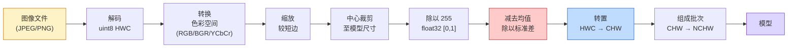
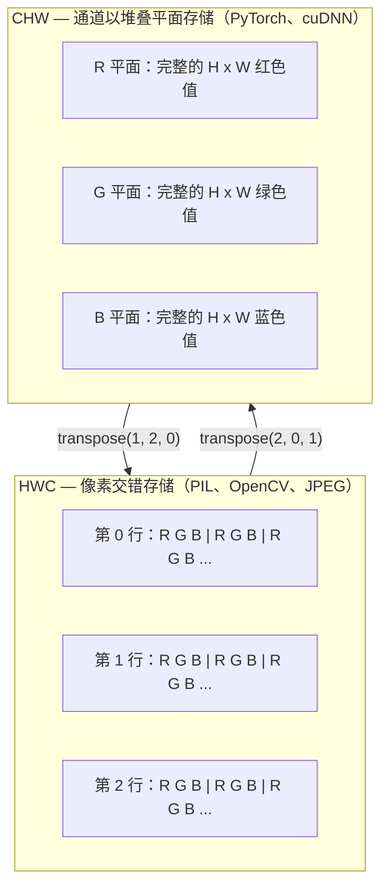

# 图像基础：像素、通道与色彩空间

> 图像是光照样本构成的张量。你将来使用的每一个视觉模型，都从这个事实开始。

**类型：** 构建  
**学习实现：** Python  
**前置课程：** Phase 1 第 12 课（张量运算）、Phase 3 第 11 课（PyTorch 入门）  
**预计时间：** 约 45 分钟

## 学习目标

- 解释连续场景如何被离散为像素，以及采样和量化决策为何决定所有下游模型的性能上限。
- 将图像作为 NumPy 数组读取、切片和检查，并能熟练地在 HWC 与 CHW 布局之间转换。
- 在 RGB、灰度、HSV 和 YCbCr 之间转换，并说明每种色彩空间存在的理由。
- 精确应用预训练 PyTorch 视觉模型所要求的像素级预处理：归一化、标准化、缩放和通道前置。

## 问题

你读到的每篇论文、下载的每组预训练权重、调用的每个视觉 API，都假定输入采用特定编码。模型想要 `float32` 时你传入 `uint8` 图像，它仍会运行——并悄悄产出垃圾结果。给在 RGB 上训练的网络输入 BGR，准确率会骤降十个百分点。模型需要通道在前的输入时却给它通道在后，第一层卷积会把高度当作特征通道。这里没有任何一个问题会抛出错误；它们只会毁掉你的指标，让你花一周追查其实藏在文件加载方式里的 bug。

一旦理解卷积究竟在什么东西上滑动，它并不复杂。难点在于：对相机、JPEG 解码器、PIL、OpenCV、torchvision 和 CUDA 内核而言，“一张图像”意味着不同的东西。每个技术栈都有自己的轴顺序、字节范围和通道约定。分不清这些约定的视觉工程师，会交付损坏的流水线。

本课打牢这一基础，供本阶段后续内容继续构建。学完后，你会知道像素是什么、为什么每个像素通常有三个数而不是一个、“用 ImageNet 统计量归一化”究竟做了什么，以及如何在本阶段其他课程都会假定的两三种布局之间切换。

## 概念

### 先总览完整预处理流水线

每个生产级视觉系统都是一串可逆变换。任一步骤出错，模型看到的输入就与训练时不同。



红色和蓝色的两个方框是 80% 静默失败的发生处：遗漏标准化，以及布局错误。

### 像素是一个样本，不是一个小方格

相机传感器计算落在微小探测器网格上的光子。每个探测器在一小段时间内累积光线，并输出一个与接收光子数成比例的电压。传感器随后将该电压离散为整数；一个探测器就成为一个像素。

```
连续场景                         传感器网格                       数字图像
（无限细节）                      （H x W 个探测器）              （H x W 个整数）

    ~~~~~                        +--+--+--+--+--+                 210 198 180 155 120
   ~   ~   ~                     |  |  |  |  |  |                 205 195 178 152 118
  ~ 光线 ~       ---->           +--+--+--+--+--+     ---->       200 190 175 150 115
   ~~~~~                         |  |  |  |  |  |                 195 185 170 148 112
                                 +--+--+--+--+--+                 188 180 165 145 108
```

此处有两个选择，它们决定一切下游处理的上限：

- **空间采样（spatial sampling）**决定场景每个视角单位有多少探测器。太少，边缘会变锯齿（混叠，aliasing）；太多，存储和计算成本会激增。
- **强度量化（intensity quantization）**决定电压被分到多精细的桶中。8 位给出 256 个等级，是显示的标准；10、12、16 位提供更平滑的渐变，在医学影像、HDR 和原始传感器流水线中很重要。

像素记录一次单独测量，而不是有面积的彩色小方块。缩放或旋转图像时，你是在重新采样这个测量网格。

### 为什么有三个通道

一个探测器统计整个可见光谱上的光子，这个数值形成灰度。为获得颜色，传感器用红、绿、蓝滤镜马赛克覆盖网格。去马赛克后，每个空间位置都有三个整数：附近经过红、绿、蓝滤镜的探测器各自的响应。这三个整数构成一个像素的 RGB 三元组。

```
内存中的一个像素：

    (R, G, B) = (210, 140, 30)   <- 偏红的橙色

一张 H x W 的 RGB 图像：

    shape (H, W, 3)     存储为     H 行、每行 W 个像素、每个像素 3 个值
                                      对于 uint8，每个值都在 [0, 255]
```

三个通道并非魔法。深度相机加入 Z 通道；卫星图像加入红外和紫外波段；医学扫描通常有一个通道（X 光、CT）或许多通道（高光谱）。通道数位于最后一个轴；卷积层学习跨通道混合它们。

### 两种布局约定：HWC 与 CHW

同一个张量，两种排序；每个库选择其中一种。

```
HWC（高度、宽度、通道）                 CHW（通道、高度、宽度）

   W ->                                    H ->
  +-----+-----+-----+                     +-----+-----+
H |R G B|R G B|R G B|                   C |R R R R R R|
| +-----+-----+-----+                   | +-----+-----+
v |R G B|R G B|R G B|                   v |G G G G G G|
  +-----+-----+-----+                     +-----+-----+
                                          |B B B B B B|
                                          +-----+-----+

   PIL、OpenCV、matplotlib、             PyTorch、多数深度学习
   几乎所有磁盘上的图像文件               框架和 cuDNN 内核
```

CHW 存在是因为卷积核沿 H 和 W 滑动。通道轴置前后，每个卷积核可看到每个通道连续的二维平面，便于向量化；磁盘格式保留 HWC，则因为它匹配传感器扫描线的输出方式。

你将输入上千次的一行转换：

```
img_chw = img_hwc.transpose(2, 0, 1)      # NumPy
img_chw = img_hwc.permute(2, 0, 1)        # PyTorch tensor
```

内存布局如下图所示：



### 字节范围与 dtype

三种约定占主导地位：

| 约定 | dtype | 范围 | 常见位置 |
|------|-------|------|----------|
| 原始 | `uint8` | [0, 255] | 磁盘文件、PIL、OpenCV 输出 |
| 已归一化 | `float32` | [0.0, 1.0] | `img.astype('float32') / 255` 之后 |
| 已标准化 | `float32` | 大致 [-2, +2] | 减去均值、再除以标准差之后 |

卷积网络在标准化输入上训练。ImageNet 统计量 `mean=[0.485, 0.456, 0.406]`、`std=[0.229, 0.224, 0.225]` 是完整 ImageNet 训练集上三个通道的算术均值和标准差，计算对象为 `[0, 1]` 范围内已归一化的像素。给期待标准化浮点数的模型输入原始 `uint8`，是应用视觉中最常见的静默失败。

### 色彩空间及其存在的理由

RGB 是捕获格式，但并非总是模型最有用的表示。

```
 RGB               HSV                       YCbCr / YUV

 R 红色             H 色相（角度 0-360）       Y 亮度（明暗）
 G 绿色             S 饱和度（0-1）            Cb 蓝黄色度
 B 蓝色             V 明度/亮度（0-1）         Cr 红绿色度

 与传感器输出线性     将颜色与亮度分开。          将亮度与颜色分开。
 对应                 适用于颜色阈值化、          JPEG 和多数视频编解码器
                      UI 滑块和简单滤镜           会更强地压缩色度通道，
                                                因为人眼对色度细节不如
                                                对 Y 细节敏感。
```

对多数现代 CNN，你输入 RGB。遇到其他空间的情形包括：

- **HSV** —— 经典计算机视觉代码、基于颜色的分割、白平衡。
- **YCbCr** —— 读取 JPEG 内部表示、视频流水线、仅在 Y 上工作的超分辨率模型。
- **灰度（grayscale）** —— OCR、文档模型，以及颜色是干扰变量而不是信号的任何场景。

RGB 转灰度是加权和而不是平均值，因为人眼对绿色比对红色或蓝色更敏感：

```
Y = 0.299 R + 0.587 G + 0.114 B       （ITU-R BT.601，经典权重）
```

### 宽高比、缩放与插值

每个模型都有固定输入尺寸（大多数 ImageNet 分类器为 224x224，现代检测器常为 384x384 或 512x512）。你的图像很少刚好匹配。三种重要的缩放选择是：

- **缩放较短边，再中心裁剪** —— 标准的 ImageNet 配方。保持宽高比，但会丢弃边缘的一条像素带。
- **缩放并填充** —— 保持宽高比和全部像素，但会加入黑边。检测和 OCR 的标准做法。
- **直接缩放到目标尺寸** —— 拉伸图像。成本低，会扭曲几何形状；对许多分类任务足够好。

当新网格与旧网格不对齐时，插值方法决定中间像素如何计算：

```
最近邻（nearest neighbour）  最快、块状；对掩码/标签是唯一选择
双线性（bilinear）           快且平滑；大多数图像缩放的默认选择
双三次（bicubic）            更慢；放大时更锐利
Lanczos                       最慢、质量最好；用于最终显示
```

经验法则：训练用双线性；你要观看的素材用双三次或 lanczos；任何包含整数类别 ID 的内容都用最近邻。

```figure
conv-output-size
```

## 动手实现

### 步骤 1：构建图像张量并检查形状

先构建一张确定性的合成图像，让第一次实验只依赖 NumPy、可以离线运行。文件解码是另一个边界：JPEG 或 PNG 解码器返回 RGB 字节后，下面的张量运算完全相同。

```python
import numpy as np

def synthetic_rgb(h=128, w=192, seed=0):
    rng = np.random.default_rng(seed)
    yy, xx = np.meshgrid(np.linspace(0, 1, h), np.linspace(0, 1, w), indexing="ij")
    r = (np.sin(xx * 6) * 0.5 + 0.5) * 255
    g = yy * 255
    b = (1 - yy) * xx * 255
    rgb = np.stack([r, g, b], axis=-1) + rng.normal(0, 6, (h, w, 3))
    return np.clip(rgb, 0, 255).astype(np.uint8)

arr = synthetic_rgb()

print(f"type:   {type(arr).__name__}")
print(f"dtype:  {arr.dtype}")
print(f"shape:  {arr.shape}     # (H, W, C)")
print(f"min:    {arr.min()}")
print(f"max:    {arr.max()}")
print(f"pixel at (0, 0): {arr[0, 0]}")
```

预期输出为：`shape: (H, W, 3)`、`dtype: uint8`、范围 `[0, 255]`。无论字节来自相机、图像解码器还是这里的合成生成器，这都是标准的解码表示。

### 步骤 2：分离通道并重新排列布局

分别取出 R、G、B，然后为 PyTorch 从 HWC 转换为 CHW。

```python
R = arr[:, :, 0]
G = arr[:, :, 1]
B = arr[:, :, 2]
print(f"R shape: {R.shape}, mean: {R.mean():.1f}")
print(f"G shape: {G.shape}, mean: {G.mean():.1f}")
print(f"B shape: {B.shape}, mean: {B.mean():.1f}")

arr_chw = arr.transpose(2, 0, 1)
print(f"\nHWC shape: {arr.shape}")
print(f"CHW shape: {arr_chw.shape}")
```

得到三个灰度平面，每个通道一个。CHW 只是重新排列轴；当内存布局允许时，严格来说不需要复制数据。

### 步骤 3：灰度与 HSV 转换

先做加权和灰度转换，再手动实现 RGB 到 HSV。

```python
def rgb_to_grayscale(rgb):
    weights = np.array([0.299, 0.587, 0.114], dtype=np.float32)
    return (rgb.astype(np.float32) @ weights).astype(np.uint8)

def rgb_to_hsv(rgb):
    rgb_f = rgb.astype(np.float32) / 255.0
    r, g, b = rgb_f[..., 0], rgb_f[..., 1], rgb_f[..., 2]
    cmax = np.max(rgb_f, axis=-1)
    cmin = np.min(rgb_f, axis=-1)
    delta = cmax - cmin

    h = np.zeros_like(cmax)
    mask = delta > 0
    argmax = np.argmax(rgb_f, axis=-1)
    rmax = mask & (argmax == 0)
    gmax = mask & (argmax == 1)
    bmax = mask & (argmax == 2)
    h[rmax] = ((g[rmax] - b[rmax]) / delta[rmax]) % 6
    h[gmax] = ((b[gmax] - r[gmax]) / delta[gmax]) + 2
    h[bmax] = ((r[bmax] - g[bmax]) / delta[bmax]) + 4
    h = h * 60.0

    s = np.divide(delta, cmax, out=np.zeros_like(delta), where=cmax > 0)
    v = cmax
    return np.stack([h, s, v], axis=-1)

gray = rgb_to_grayscale(arr)
hsv = rgb_to_hsv(arr)
print(f"gray shape: {gray.shape}, range: [{gray.min()}, {gray.max()}]")
print(f"hsv   shape: {hsv.shape}")
print(f"hue range: [{hsv[..., 0].min():.1f}, {hsv[..., 0].max():.1f}] degrees")
print(f"sat range: [{hsv[..., 1].min():.2f}, {hsv[..., 1].max():.2f}]")
print(f"val range: [{hsv[..., 2].min():.2f}, {hsv[..., 2].max():.2f}]")
```

色相以角度输出，饱和度和明度位于 `[0, 1]`。这与 OpenCV 的 `hsv_full` 约定一致。

### 步骤 4：归一化、标准化与逆变换

从原始字节得到预训练 ImageNet 模型期待的精确张量，然后再还原回来。

```python
mean = np.array([0.485, 0.456, 0.406], dtype=np.float32)
std = np.array([0.229, 0.224, 0.225], dtype=np.float32)

def preprocess_imagenet(rgb_uint8):
    x = rgb_uint8.astype(np.float32) / 255.0
    x = (x - mean) / std
    x = x.transpose(2, 0, 1)
    return x

def deprocess_imagenet(chw_float32):
    x = chw_float32.transpose(1, 2, 0)
    x = x * std + mean
    x = np.clip(x * 255.0, 0, 255).astype(np.uint8)
    return x

x = preprocess_imagenet(arr)
print(f"preprocessed shape: {x.shape}     # (C, H, W)")
print(f"preprocessed dtype: {x.dtype}")
print(f"preprocessed mean per channel:  {x.mean(axis=(1, 2)).round(3)}")
print(f"preprocessed std  per channel:  {x.std(axis=(1, 2)).round(3)}")

roundtrip = deprocess_imagenet(x)
max_diff = np.abs(roundtrip.astype(int) - arr.astype(int)).max()
print(f"roundtrip max pixel diff: {max_diff}    # should be 0 or 1")
```

逐通道均值应接近零，标准差应接近一。这个 preprocess/deprocess 对，正是每次调用 torchvision `transforms.Normalize` 时在底层所做的事。

### 步骤 5：从零实现缩放

最近邻把每个输出坐标舍入到一个源像素。双线性插值找到四个相邻像素，按距离混合它们。下面两种实现都使用端点对齐坐标，因此第一个和最后一个源像素保持不变。

```python
def resize_coordinates(source_length, target_length):
    if target_length == 1:
        return np.zeros(1, dtype=np.float32)
    return np.linspace(0, source_length - 1, target_length, dtype=np.float32)

def nearest_resize(image, target_height, target_width):
    y = np.rint(resize_coordinates(image.shape[0], target_height)).astype(int)
    x = np.rint(resize_coordinates(image.shape[1], target_width)).astype(int)
    return image[y[:, None], x[None, :]]

def bilinear_resize(image, target_height, target_width):
    y = resize_coordinates(image.shape[0], target_height)
    x = resize_coordinates(image.shape[1], target_width)
    y0 = np.floor(y).astype(int)
    x0 = np.floor(x).astype(int)
    y1 = np.minimum(y0 + 1, image.shape[0] - 1)
    x1 = np.minimum(x0 + 1, image.shape[1] - 1)
    wy = (y - y0)[:, None, None]
    wx = (x - x0)[None, :, None]

    source = image.astype(np.float32)
    top = source[y0[:, None], x0[None, :]] * (1 - wx)
    top += source[y0[:, None], x1[None, :]] * wx
    bottom = source[y1[:, None], x0[None, :]] * (1 - wx)
    bottom += source[y1[:, None], x1[None, :]] * wx
    result = top * (1 - wy) + bottom * wy
    return np.clip(np.rint(result), 0, 255).astype(image.dtype)

target_height = arr.shape[0] * 3
target_width = arr.shape[1] * 3
nearest = nearest_resize(arr, target_height, target_width)
bilinear = bilinear_resize(arr, target_height, target_width)

def local_roughness(x):
    gy = np.diff(x.astype(float), axis=0)
    gx = np.diff(x.astype(float), axis=1)
    return float(np.abs(gy).mean() + np.abs(gx).mean())

for name, out in [("nearest", nearest), ("bilinear", bilinear)]:
    print(f"{name:>8}  shape={out.shape}  roughness={local_roughness(out):6.2f}")
```

最近邻的粗糙度最高，因为它保留硬边缘；双线性更平滑，因为每个新像素都在两个轴上混合位置。配套实现还用 Catmull–Rom 三次核把同样的可分离思路扩展到每个轴的四个邻点，并且无需图像库即可打印三种结果。

## 使用现成工具

PyTorch 会在批量、支持设备的张量上执行同样的操作。下面的代码把较短边缩放后中心裁剪，逐通道标准化，生成预训练模型所需的 NCHW 张量。

```python
import torch
import torch.nn.functional as F

image_hwc = torch.from_numpy(synthetic_rgb(256, 320))
batch = image_hwc.permute(2, 0, 1).unsqueeze(0).float() / 255.0

height, width = batch.shape[-2:]
scale = 256 / min(height, width)
resized_height = round(height * scale)
resized_width = round(width * scale)
batch = F.interpolate(
    batch,
    size=(resized_height, resized_width),
    mode="bilinear",
    align_corners=False,
    antialias=True,
)

top = (resized_height - 224) // 2
left = (resized_width - 224) // 2
batch = batch[:, :, top:top + 224, left:left + 224]

mean = torch.tensor([0.485, 0.456, 0.406]).view(1, 3, 1, 1)
std = torch.tensor([0.229, 0.224, 0.225]).view(1, 3, 1, 1)
batch = (batch - mean) / std

print(f"tensor dtype: {batch.dtype}")
print(f"batched shape: {tuple(batch.shape)}")
print(f"per-channel mean: {batch.mean(dim=(0, 2, 3)).tolist()}")
print(f"per-channel std:  {batch.std(dim=(0, 2, 3)).tolist()}")
```

四个步骤，且顺序必须完全一致：把字节转成浮点并将 HWC 换为 NCHW，将较短边缩放到 256，中心裁剪到 224x224，最后减去 ImageNet 均值并除以标准差。颠倒顺序会悄悄改变到达模型的内容。

## 交付产物

本课产出：

- `outputs/prompt-vision-preprocessing-audit.md` —— 一个提示词，可将任意模型卡或数据集卡转为团队必须遵守的精确预处理不变量清单。
- `outputs/skill-image-tensor-inspector.md` —— 一个技能：给定任何图像形状的张量或数组，报告其 dtype、布局、范围，以及它看起来是原始、已归一化还是已标准化。

## 练习

1. **（简单）** 创建一个包含四种不同颜色的 2x2 RGB `uint8` 数组。将 HWC 转为 CHW 再转回，打印两种形状，并证明往返转换保留每个值。
2. **（中等）** 编写 `standardize(img, mean, std)` 及其逆函数，使二者在任何 uint8 图像上共同通过 `roundtrip_max_diff <= 1` 测试。函数必须同一调用方式支持单张 HWC 图像和 NCHW 批次。
3. **（困难）** 取一个三通道、经 ImageNet 标准化的张量，让它经过一个学习 RGB 加权混合为单灰度通道的 1x1 卷积。将权重初始化为 `[0.299, 0.587, 0.114]` 并冻结；验证输出与手写的 `rgb_to_grayscale` 在浮点误差范围内相同。还有哪些经典色彩空间变换可以写成 1x1 卷积？

## 关键术语

| 术语 | 常见说法 | 实际含义 |
|------|----------|----------|
| 像素（Pixel） | “一个彩色小方块” | 一个网格位置上的光强样本；彩色为三个数，灰度为一个 |
| 通道（Channel） | “颜色” | 堆叠进图像张量的并行空间网格之一；HWC 的最后一轴，CHW 的第一轴 |
| HWC / CHW | “图像形状” | 图像张量的轴顺序；磁盘和 PIL 使用 HWC，PyTorch 和 cuDNN 使用 CHW |
| 归一化（Normalize） | “缩放图像” | 除以 255，使像素落在 [0, 1]；这是必要但不充分的步骤 |
| 标准化（Standardize） | “零中心化” | 对每个通道减去均值、除以标准差，使输入分布匹配模型训练时所见分布 |
| 灰度转换（Grayscale conversion） | “通道取平均” | 使用 0.299/0.587/0.114 系数的加权和，匹配人类亮度感知 |
| 插值（Interpolation） | “缩放时怎样选像素” | 新网格与旧网格不对齐时决定输出值的规则；标签用最近邻、训练用双线性、显示用双三次 |
| 宽高比（Aspect ratio） | “宽除以高” | 区分“缩放并填充”与“缩放并拉伸”的比例 |

## 延伸阅读

- [Charles Poynton — A Guided Tour of Color Space](https://poynton.ca/PDFs/Guided_tour.pdf) —— 最清晰的技术讲解：为什么有这么多色彩空间，以及每种何时重要。
- [PyTorch Vision Transforms Docs](https://pytorch.org/vision/stable/transforms.html) —— 生产中实际会组合使用的完整变换流水线。
- [How JPEG Works (Colt McAnlis)](https://www.youtube.com/watch?v=F1kYBnY6mwg) —— 对色度子采样、DCT 以及 JPEG 为什么编码 YCbCr 而非 RGB 的精炼可视化讲解。
- [ImageNet Preprocessing Conventions (torchvision models)](https://pytorch.org/vision/stable/models.html) —— `mean=[0.485, 0.456, 0.406]` 的权威来源，以及模型库中每个模型为何都期待这一约定。
