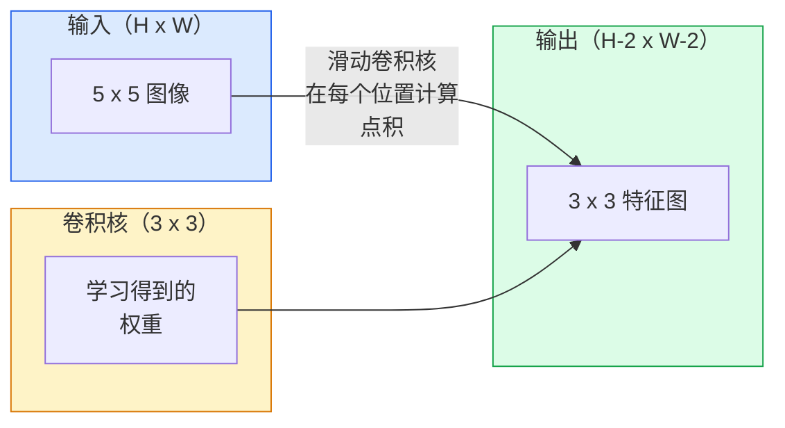
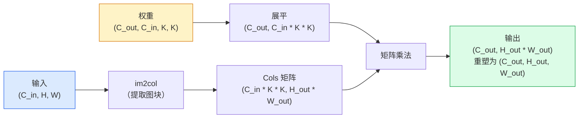

# 从零实现卷积

> 卷积是一个微型全连接层：你把它在图像上滑动，并在每个位置共享同一组权重。

**类型：** 构建  
**学习实现：** Python  
**前置课程：** Phase 3（深度学习核心）、Phase 4 第 01 课（图像基础）  
**预计时间：** 约 75 分钟

## 学习目标

- 仅用 NumPy 从零实现二维卷积，包括嵌套循环版本和向量化的 `im2col` 版本。
- 对任意输入尺寸、卷积核尺寸、填充和步幅组合计算输出空间尺寸，并说明 `(H - K + 2P) / S + 1` 公式的理由。
- 手工设计卷积核（边缘、模糊、锐化、Sobel），并解释每种卷积核为何产生相应的激活模式。
- 将卷积堆叠成特征提取器，并将堆叠深度联系到感受野尺寸。

## 问题

一张 224x224 的 RGB 图像接入全连接层时，每个神经元需要 `224 * 224 * 3 = 150,528` 个输入权重。仅含 1,000 个单元的单隐藏层，在学到任何有用内容前就已有 1.5 亿参数。更糟的是，该层不理解左上角的一只狗和右下角的一只狗是同一种模式；它把每个像素位置视为独立，而这对图像恰恰是错误的：将一只猫平移三个像素，不应迫使网络重新学习“猫”这一概念。

图像模型需要两个性质：**平移等变性（translation equivariance）**——输入平移时输出随之平移；以及**参数共享（parameter sharing）**——同一个特征检测器在所有位置运行。全连接层不具备这两项性质，卷积则同时具备。

卷积并非为深度学习而发明。JPEG 压缩、Photoshop 中的高斯模糊、工业视觉的边缘检测以及许多音频滤波器，都使用同一种操作。CNN 在 2012 至 2020 年主导 ImageNet，原因是卷积对“邻近值相关、同一模式可出现于任意位置”的数据具有合适的先验。

## 概念

### 一个卷积核，持续滑动

二维卷积取一个称为卷积核（kernel）或滤波器（filter）的小权重矩阵，在输入上滑动；每个位置计算逐元素乘积之和，该和成为一个输出像素。



在 5x5 输入上使用具体 3x3 的示例（无填充、步幅为 1）：

```
输入 X（5 x 5）：                 卷积核 W（3 x 3）：

  1  2  0  1  2                   1  0 -1
  0  1  3  1  0                   2  0 -2
  2  1  0  2  1                   1  0 -1
  1  0  2  1  3
  2  1  1  0  1

卷积核划过每一个有效的 3 x 3 窗口；输出 Y 为 3 x 3：

 Y[0,0] = sum( W * X[0:3, 0:3] )
 Y[0,1] = sum( W * X[0:3, 1:4] )
 Y[0,2] = sum( W * X[0:3, 2:5] )
 Y[1,0] = sum( W * X[1:4, 0:3] )
 ……其余位置同理
```

这一个公式——**共享权重、局部性、滑动窗口**——就是全部思想；其余都是记账工作。

### 输出尺寸公式

给定输入空间尺寸 `H`、卷积核尺寸 `K`、填充 `P`、步幅 `S`：

```
H_out = floor( (H - K + 2P) / S ) + 1
```

记住它；每个架构中你都会计算数十次。

| 场景 | H | K | P | S | H_out |
|------|---|---|---|---|-------|
| 有效卷积，无填充 | 32 | 3 | 0 | 1 | 30 |
| Same 卷积（保持尺寸） | 32 | 3 | 1 | 1 | 32 |
| 按 2 下采样 | 32 | 3 | 1 | 2 | 16 |
| 2x2 池化 | 32 | 2 | 0 | 2 | 16 |
| 大感受野 | 32 | 7 | 3 | 2 | 16 |

“Same 填充”指在 `S == 1` 时选择 `P`，使 `H_out == H`。对于奇数 `K`，有 `P = (K - 1) / 2`。这正是 3x3 卷积核占主导的原因：它是仍有中心点的最小奇数卷积核。

### 填充

没有填充时，每次卷积都会缩小特征图。堆叠 20 层后，224x224 图像会变为 184x184，这既浪费边界处的计算，也会让需要匹配形状的残差连接变得复杂。

```
在 5 x 5 输入上做零填充（P = 1）：

  0  0  0  0  0  0  0
  0  1  2  0  1  2  0
  0  0  1  3  1  0  0
  0  2  1  0  2  1  0       现在卷积核可将中心放在像素
  0  1  0  2  1  3  0       (0, 0) 上，仍有三行和三列
  0  2  1  1  0  1  0       数值可供相乘。
  0  0  0  0  0  0  0
```

实践中会遇到的模式：`zero`（最常见）、`reflect`（镜像边缘，在生成模型中避免硬边界）、`replicate`（复制边缘）、`circular`（环绕，适用于环面问题）。

### 步幅

步幅是每次滑动的步长，`stride=1` 为默认值。`stride=2` 将空间维度减半，是 CNN 内部不通过单独池化层下采样的经典方式——每种现代架构（ResNet、ConvNeXt、MobileNet）都会在某处用带步幅的卷积替代最大池化。

```
5 x 5 输入、3 x 3 卷积核上的步幅 1：

  起点：(0,0) (0,1) (0,2)        -> 输出第 0 行
        (1,0) (1,1) (1,2)        -> 输出第 1 行
        (2,0) (2,1) (2,2)        -> 输出第 2 行

  输出：3 x 3

同一输入上的步幅 2：

  起点：(0,0) (0,2)              -> 输出第 0 行
        (2,0) (2,2)              -> 输出第 1 行

  输出：2 x 2
```

### 多个输入通道

真实图像有三个通道。对 RGB 输入的 3x3 卷积核是一个 3x3x3 的张量：每个输入通道各有一片 3x3。每个空间位置上，对三片分别相乘、求和，再加偏置。

```
输入：      (C_in,  H,  W)        3 x 5 x 5
卷积核：    (C_in,  K,  K)        3 x 3 x 3（一个卷积核）
输出：      (1,     H', W')       二维特征图

对于输出 C_out 个通道的一层，堆叠 C_out 个卷积核：

权重：      (C_out, C_in, K, K)   例如 64 x 3 x 3 x 3
输出：      (C_out, H', W')       64 x 3 x 3

参数量：C_out * C_in * K * K + C_out   （+ C_out 是偏置）
```

最后一行是规划模型时会计算的内容。3 通道输入上的 64 通道 3x3 卷积有 `64 * 3 * 3 * 3 + 64 = 1,792` 个参数，很便宜。

### im2col 技巧

嵌套循环易读但很慢。GPU 适合执行大矩阵乘法；把输入的每个感受野窗口展平为大矩阵的一列，再把卷积核展平为一行，整个卷积便成为单次矩阵乘法。



许多生产级卷积实现会采用这种变换或相关优化，再结合缓存分块技巧（直接卷积、Winograd、大卷积核的 FFT 卷积）。im2col 展示了将卷积转为矩阵乘法的关键思路。

### 感受野

单个 3x3 卷积看到 9 个输入像素；堆叠两个 3x3 卷积时，第二层的一个神经元可看到 5x5 输入像素；三个 3x3 得到 7x7。一般而言：

```
堆叠 L 个 K x K 卷积（步幅 1）后的 RF = 1 + L * (K - 1)

存在步幅时：RF 会随每层的步幅成倍增长。
```

“一路 3x3”可行（VGG、ResNet、ConvNeXt）的全部原因是：两个 3x3 卷积看到的输入区域与一个 5x5 卷积相同，却使用更少参数，且中间多出一个非线性。

```figure
convolution-kernel
```

## 动手实现

### 步骤 1：填充数组

从最小原语开始：一个在 H x W 数组周围零填充的函数。

```python
import numpy as np

def pad2d(x, p):
    if p == 0:
        return x
    h, w = x.shape[-2:]
    out = np.zeros(x.shape[:-2] + (h + 2 * p, w + 2 * p), dtype=x.dtype)
    out[..., p:p + h, p:p + w] = x
    return out

x = np.arange(9).reshape(3, 3)
print(x)
print()
print(pad2d(x, 1))
```

末尾轴技巧 `x.shape[:-2]` 表示同一个函数无需修改即可处理 `(H, W)`、`(C, H, W)` 或 `(N, C, H, W)`。

### 步骤 2：用嵌套循环实现二维卷积

下面的参考实现速度较慢，但明确展示了 `torch.nn.functional.conv2d` 的基本计算过程。

```python
def conv2d_naive(x, w, b=None, stride=1, padding=0):
    c_in, h, w_in = x.shape
    c_out, c_in_w, kh, kw = w.shape
    assert c_in == c_in_w

    x_pad = pad2d(x, padding)
    h_out = (h + 2 * padding - kh) // stride + 1
    w_out = (w_in + 2 * padding - kw) // stride + 1

    out = np.zeros((c_out, h_out, w_out), dtype=np.float32)
    for oc in range(c_out):
        for i in range(h_out):
            for j in range(w_out):
                hs = i * stride
                ws = j * stride
                patch = x_pad[:, hs:hs + kh, ws:ws + kw]
                out[oc, i, j] = np.sum(patch * w[oc])
        if b is not None:
            out[oc] += b[oc]
    return out
```

四重嵌套循环（输出通道、行、列，以及对 C_in、kh、kw 的隐式求和）。这是检验每个更快实现的基准真值。

### 步骤 3：用手工设计的卷积核验证

构造一个垂直 Sobel 卷积核，将它用于合成阶跃图像，观察垂直边缘被点亮。

```python
def synthetic_step_image():
    img = np.zeros((1, 16, 16), dtype=np.float32)
    img[:, :, 8:] = 1.0
    return img

sobel_x = np.array([
    [[-1, 0, 1],
     [-2, 0, 2],
     [-1, 0, 1]]
], dtype=np.float32)[None]

x = synthetic_step_image()
y = conv2d_naive(x, sobel_x, padding=1)
print(y[0].round(1))
```

预期第 7 列出现较大的正值（从左到右亮度增加），其余位置为零。这一次打印就是检验数学是否正确的合理性检查。

### 步骤 4：im2col

将输入中每个卷积核大小的窗口变成矩阵的一列。对于 `C_in=3, K=3`，每一列有 27 个数。

```python
def im2col(x, kh, kw, stride=1, padding=0):
    c_in, h, w = x.shape
    x_pad = pad2d(x, padding)
    h_out = (h + 2 * padding - kh) // stride + 1
    w_out = (w + 2 * padding - kw) // stride + 1

    cols = np.zeros((c_in * kh * kw, h_out * w_out), dtype=x.dtype)
    col = 0
    for i in range(h_out):
        for j in range(w_out):
            hs = i * stride
            ws = j * stride
            patch = x_pad[:, hs:hs + kh, ws:ws + kw]
            cols[:, col] = patch.reshape(-1)
            col += 1
    return cols, h_out, w_out
```

它仍是 Python 循环，不过重活现在会是一条向量化矩阵乘法。

### 步骤 5：通过 im2col + 矩阵乘法快速卷积

用一次矩阵乘法取代四重循环。

```python
def conv2d_im2col(x, w, b=None, stride=1, padding=0):
    c_out, c_in, kh, kw = w.shape
    cols, h_out, w_out = im2col(x, kh, kw, stride, padding)
    w_flat = w.reshape(c_out, -1)
    out = w_flat @ cols
    if b is not None:
        out += b[:, None]
    return out.reshape(c_out, h_out, w_out)
```

正确性检查：运行两个实现并比较。

```python
rng = np.random.default_rng(0)
x = rng.normal(0, 1, (3, 16, 16)).astype(np.float32)
w = rng.normal(0, 1, (8, 3, 3, 3)).astype(np.float32)
b = rng.normal(0, 1, (8,)).astype(np.float32)

y_naive = conv2d_naive(x, w, b, padding=1)
y_im2col = conv2d_im2col(x, w, b, padding=1)

print(f"max abs diff: {np.max(np.abs(y_naive - y_im2col)):.2e}")
```

`max abs diff` 应在 `1e-5` 左右——差异来自浮点累计顺序，而不是 bug。

### 步骤 6：一组手工设计的卷积核

五个滤波器展示单个卷积层在训练前就能表达什么。

```python
KERNELS = {
    "identity": np.array([[0, 0, 0], [0, 1, 0], [0, 0, 0]], dtype=np.float32),
    "blur_3x3": np.ones((3, 3), dtype=np.float32) / 9.0,
    "sharpen": np.array([[0, -1, 0], [-1, 5, -1], [0, -1, 0]], dtype=np.float32),
    "sobel_x": np.array([[-1, 0, 1], [-2, 0, 2], [-1, 0, 1]], dtype=np.float32),
    "sobel_y": np.array([[-1, -2, -1], [0, 0, 0], [1, 2, 1]], dtype=np.float32),
}

def apply_kernel(img2d, kernel):
    x = img2d[None].astype(np.float32)
    w = kernel[None, None]
    return conv2d_im2col(x, w, padding=1)[0]
```

将它们用于任意灰度图像时，模糊会柔化图像，锐化会使边缘清晰，Sobel-x 点亮垂直边缘，Sobel-y 点亮水平边缘。这些正是 AlexNet 与 VGG 中*第一层*训练后卷积实际学到的模式——因为无论后续任务是什么，优秀的图像模型都需要边缘和斑块检测器。

## 使用现成工具

PyTorch 的 `nn.Conv2d` 用自动微分、CUDA 内核和 cuDNN 优化封装同一操作；形状语义完全相同。

```python
import torch
import torch.nn as nn

conv = nn.Conv2d(in_channels=3, out_channels=64, kernel_size=3, stride=1, padding=1)
print(conv)
print(f"weight shape: {tuple(conv.weight.shape)}   # (C_out, C_in, K, K)")
print(f"bias shape:   {tuple(conv.bias.shape)}")
print(f"param count:  {sum(p.numel() for p in conv.parameters())}")

x = torch.randn(8, 3, 224, 224)
y = conv(x)
print(f"\ninput  shape: {tuple(x.shape)}")
print(f"output shape: {tuple(y.shape)}")
```

将 `padding=1` 改为 `padding=0`，输出就降为 222x222；将 `stride=1` 改为 `stride=2`，输出降为 112x112。正是上面记住的同一公式。

## 交付产物

本课产出：

- `outputs/prompt-cnn-architect.md` —— 给定输入尺寸、参数预算和目标感受野，设计一组 `Conv2d` 层的提示词；每一步都有正确的 K/S/P。
- `outputs/skill-conv-shape-calculator.md` —— 一个逐层分析网络规格、返回每个模块输出形状、感受野和参数量的技能。

## 练习

1. **（简单）** 给定 128x128 灰度输入及 `[Conv3x3(s=1,p=1), Conv3x3(s=2,p=1), Conv3x3(s=1,p=1), Conv3x3(s=2,p=1)]` 的堆叠，手工计算每层的输出空间尺寸与感受野。用含占位卷积的 PyTorch `nn.Sequential` 验证。
2. **（中等）** 扩展 `conv2d_naive` 与 `conv2d_im2col`，使其接受 `groups` 参数。证明 `groups=C_in=C_out` 会复现深度卷积，且其参数量为 `C * K * K` 而不是 `C * C * K * K`。
3. **（困难）** 手工实现 `conv2d_im2col` 的反向传播：给定输出梯度，计算 `x` 和 `w` 的梯度。对同一输入和权重，用 `torch.autograd.grad` 验证。需要注意：im2col 的梯度是 `col2im`，它必须累加重叠窗口。

## 关键术语

| 术语 | 常见说法 | 实际含义 |
|------|----------|----------|
| 卷积（Convolution） | “滑动滤波器” | 在每个空间位置以共享权重应用的可学习点积；数学上是互相关，但所有人都称它为卷积 |
| 卷积核 / 滤波器（Kernel / filter） | “特征检测器” | 形状为 `(C_in, K, K)` 的小权重张量；与输入窗口的点积产生一个输出像素 |
| 步幅（Stride） | “跳多远” | 相邻卷积核放置位置之间的步长；步幅 2 将每个空间维度减半 |
| 填充（Padding） | “边缘的零” | 加在输入周围的额外值，使卷积核能以边界像素为中心；`same` 填充保持输出尺寸等于输入尺寸 |
| 感受野（Receptive field） | “神经元能看多少” | 给定输出激活所依赖的原始输入图块，随深度和步幅增大 |
| im2col | “GEMM 技巧” | 将每个感受野窗口重排为列，使卷积成为一个大矩阵乘法；每个快速卷积内核的核心 |
| 深度卷积（Depthwise conv） | “每通道一个卷积核” | `groups == C_in` 的卷积；每个输出通道只由对应输入通道计算，是 MobileNet 和 ConvNeXt 的骨干 |
| 平移等变性（Translation equivariance） | “输入移，输出也移” | 输入平移 k 个像素时输出也平移 k 个像素的性质；由共享权重免费得到 |

## 延伸阅读

- [A guide to convolution arithmetic for deep learning (Dumoulin & Visin, 2016)](https://arxiv.org/abs/1603.07285) —— 每门课程都会暗中复用的、关于填充/步幅/扩张最权威图示。
- [CS231n: Convolutional Neural Networks for Visual Recognition](https://cs231n.github.io/convolutional-networks/) —— 经典课程笔记，包括最初的 im2col 解释。
- [The Annotated ConvNet (fast.ai)](https://nbviewer.org/github/fastai/fastbook/blob/master/13_convolutions.ipynb) —— 从手动卷积到训练数字分类器的笔记本。
- [Receptive Field Arithmetic for CNNs (Dang Ha The Hien)](https://distill.pub/2019/computing-receptive-fields/) —— 感受野计算的论文级交互式讲解。
