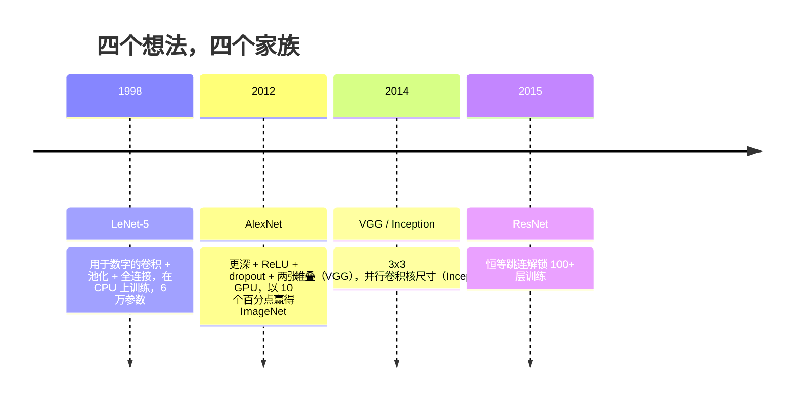
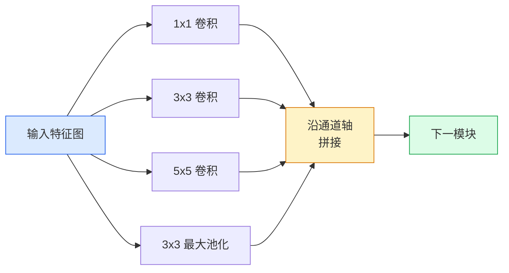
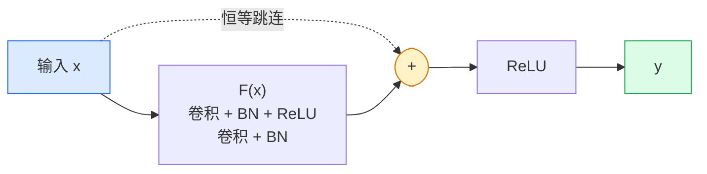

# CNN：从 LeNet 到 ResNet

> 过去三十年的主要 CNN，大多是在“卷积—非线性—下采样”配方上加入新的架构设计。下面按时间顺序梳理这些设计。

**类型：** 学习 + 构建  
**学习实现：** Python  
**前置课程：** Phase 3 第 11 课（PyTorch）、Phase 4 第 01 课（图像基础）、Phase 4 第 02 课（从零实现卷积）  
**预计时间：** 约 75 分钟

## 学习目标

- 追踪 LeNet-5 -> AlexNet -> VGG -> Inception -> ResNet 的架构谱系，并说明每个家族贡献的唯一新思想。
- 分别用不到 40 行 PyTorch 实现 LeNet-5、VGG 风格模块和 ResNet BasicBlock。
- 解释残差连接为何能将不可训练的千层网络变成最先进模型。
- 阅读现代骨干网络（ResNet-18、ResNet-50），并在查看源代码前预测它的输出形状、感受野与参数量。

## 问题

2011 年，最佳 ImageNet 分类器的 top-5 准确率约为 74%；2012 年 AlexNet 为 85%；2015 年 ResNet 达到 96%。没有新数据，也没有新一代 GPU，提升来自架构思想。理解每个想法的论文来源，有助于识别 2026 年生产骨干网络对这些组件的重新组合；这些思想还会持续迁移：分组卷积从 CNN 进入 transformer，残差连接从 ResNet 进入许多 LLM，批归一化则存在于扩散模型中。

按顺序学习这些网络还可避免一个常见错误：LeNet 尺寸的网络足以解决问题时，却去拿最大的可用模型。MNIST 不需要 ResNet；知道每个家族的缩放曲线，才能知道自己该处在哪个位置。

## 概念

### 改变视觉的四个想法



在经典视觉中，没有其他事情比这四次跃迁更重要。

### LeNet-5（1998）

Yann LeCun 的数字识别器，6 万参数、两个卷积—池化模块、两个全连接层、tanh 激活。它定义了所有 CNN 继承的模板：

```
输入（1, 32, 32）
  卷积 5x5 -> （6, 28, 28）
  平均池化 2x2 -> （6, 14, 14）
  卷积 5x5 -> （16, 10, 10）
  平均池化 2x2 -> （16, 5, 5）
  展平 -> 400
  全连接 -> 120
  全连接 -> 84
  全连接 -> 10
```

现代世界称为 CNN 的一切——交替的卷积和下采样，后接小型分类器头——都是层数更多、通道更宽、激活更好的 LeNet。

### AlexNet（2012）

三项改变共同击穿 ImageNet：

1. 用 **ReLU** 替代 tanh，梯度不再消失，训练速度提升六倍。
2. 在全连接头中加入 **dropout**，正则化成为一层而非技巧。
3. 增加**深度和宽度**：五个卷积层、三个全连接层、6,000 万参数，在两张 GPU 上训练，并在 GPU 之间拆分模型。

论文的图 2 至今仍展示这两个并行 GPU 流。这种并行是硬件权宜之计而非架构洞见；但上面三项思想仍在你使用的每个模型中。

### VGG（2014）

VGG 提出的问题是：如果只使用 3x3 卷积并不断加深，会怎样？

```
堆叠：     卷积 3x3 -> 卷积 3x3 -> 池化 2x2
重复：     16 或 19 个卷积层
```

两个 3x3 卷积看到的 5x5 输入区域与一个 5x5 卷积相同，但参数更少（`2*9*C^2 = 18C^2`，而不是 `25*C^2`），中间还多一个 ReLU。VGG 将这一观察扩展为完整架构；单一模块重复的简洁性，使它成为后来所有模型的参照点。

代价：1.38 亿参数，训练慢，推理昂贵。

### Inception（2014，同年）

Google 对“该用什么卷积核尺寸？”的回答是：全部并行使用。



每个分支各司其职：1x1 用于通道混合，3x3 用于局部纹理，5x5 用于更大模式，池化用于平移不变特征；拼接让下一层选择有用的分支。Inception v1 在每条分支中使用 1x1 卷积作瓶颈，以控制参数量。

### 退化问题

到 2015 年，VGG-19 有效，VGG-32 却无效。超过约 20 层后，训练和测试损失都变差；训练损失同步升高说明问题来自优化，而非过拟合。梯度在逐层传播时乘法式缩小，优化器因而找不到有用权重。

```
普通深层网络：
  y = f_L( f_{L-1}( ... f_1(x) ... ) )

相对早期层的梯度：
  dL/dW_1 = dL/dy * df_L/df_{L-1} * ... * df_2/df_1 * df_1/dW_1

每个乘法项的大小大致为（权重大小）*（激活增益）。
堆叠 100 个增益小于 1 的项后，梯度接近于零。
```

VGG 能在 19 层工作，是因为同时发表的批归一化（batch norm）保持激活的良好尺度；但批归一化也无法挽救超过约 30 层的深度。

### ResNet（2015）

He、Zhang、Ren、Sun 提出的一项改变解决了全部问题：

```
标准模块：    y = F(x)
残差模块：    y = F(x) + x
```

`+ x` 表示只要让 `F(x)` 变为零，该层总能选择什么也不做。千层 ResNet 因此至多与单层网络一样糟：每个额外模块都有一个简单的逃生出口。有了这一保证，优化器会让每个模块都变得*稍微*有用；100 个稍微有用的模块堆叠起来，就是最先进成果。



两种模块变体无处不在：

- **BasicBlock**（ResNet-18、ResNet-34）：两个 3x3 卷积，跳连跨过二者。
- **Bottleneck**（ResNet-50、-101、-152）：1x1 降维、3x3 中间层、1x1 升维，跳连跨过三者。通道数高时更便宜。

跳连必须跨越下采样（`stride=2`）时，恒等路径以 1x1、步幅 2 的卷积替代，从而匹配形状。

### 残差为何在视觉之外也重要

残差连接把深层网络变成可靠、可扩展的工程工具，其影响远超图像分类。Transformer 在每个模块中都采用同类跳连，延续了 ResNet 的核心设计。

```figure
pooling
```

## 动手实现

### 步骤 1：LeNet-5

一个最小且忠实的 LeNet：tanh 激活、平均池化。唯一向现代性的让步是，我们在后续使用 `nn.CrossEntropyLoss`，而不是原始高斯连接。

```python
import torch
import torch.nn as nn
import torch.nn.functional as F

class LeNet5(nn.Module):
    def __init__(self, num_classes=10):
        super().__init__()
        self.conv1 = nn.Conv2d(1, 6, kernel_size=5)
        self.conv2 = nn.Conv2d(6, 16, kernel_size=5)
        self.pool = nn.AvgPool2d(2)
        self.fc1 = nn.Linear(16 * 5 * 5, 120)
        self.fc2 = nn.Linear(120, 84)
        self.fc3 = nn.Linear(84, num_classes)

    def forward(self, x):
        x = self.pool(torch.tanh(self.conv1(x)))
        x = self.pool(torch.tanh(self.conv2(x)))
        x = torch.flatten(x, 1)
        x = torch.tanh(self.fc1(x))
        x = torch.tanh(self.fc2(x))
        return self.fc3(x)

net = LeNet5()
x = torch.randn(1, 1, 32, 32)
print(f"output: {net(x).shape}")
print(f"params: {sum(p.numel() for p in net.parameters()):,}")
```

预期输出：`output: torch.Size([1, 10])`、`params: 61,706`。这个完整的数字分类器包含了现代视觉网络的基础组件。

### 步骤 2：一个 VGG 模块

一个可复用模块：两个 3x3 卷积、ReLU、批归一化、最大池化。

```python
class VGGBlock(nn.Module):
    def __init__(self, in_c, out_c):
        super().__init__()
        self.conv1 = nn.Conv2d(in_c, out_c, kernel_size=3, padding=1)
        self.bn1 = nn.BatchNorm2d(out_c)
        self.conv2 = nn.Conv2d(out_c, out_c, kernel_size=3, padding=1)
        self.bn2 = nn.BatchNorm2d(out_c)
        self.pool = nn.MaxPool2d(2)

    def forward(self, x):
        x = F.relu(self.bn1(self.conv1(x)))
        x = F.relu(self.bn2(self.conv2(x)))
        return self.pool(x)

class MiniVGG(nn.Module):
    def __init__(self, num_classes=10):
        super().__init__()
        self.stack = nn.Sequential(
            VGGBlock(3, 32),
            VGGBlock(32, 64),
            VGGBlock(64, 128),
        )
        self.head = nn.Sequential(
            nn.AdaptiveAvgPool2d(1),
            nn.Flatten(),
            nn.Linear(128, num_classes),
        )

    def forward(self, x):
        return self.head(self.stack(x))

net = MiniVGG()
x = torch.randn(1, 3, 32, 32)
print(f"output: {net(x).shape}")
print(f"params: {sum(p.numel() for p in net.parameters()):,}")
```

三个 VGG 模块作用于 CIFAR 尺寸输入，配合自适应池化和一个线性层；约 29 万参数，对 CIFAR-10 已经足够。

### 步骤 3：一个 ResNet BasicBlock

ResNet-18 与 ResNet-34 的核心构建模块。

```python
class BasicBlock(nn.Module):
    def __init__(self, in_c, out_c, stride=1):
        super().__init__()
        self.conv1 = nn.Conv2d(in_c, out_c, kernel_size=3, stride=stride, padding=1, bias=False)
        self.bn1 = nn.BatchNorm2d(out_c)
        self.conv2 = nn.Conv2d(out_c, out_c, kernel_size=3, stride=1, padding=1, bias=False)
        self.bn2 = nn.BatchNorm2d(out_c)
        if stride != 1 or in_c != out_c:
            self.shortcut = nn.Sequential(
                nn.Conv2d(in_c, out_c, kernel_size=1, stride=stride, bias=False),
                nn.BatchNorm2d(out_c),
            )
        else:
            self.shortcut = nn.Identity()

    def forward(self, x):
        out = F.relu(self.bn1(self.conv1(x)))
        out = self.bn2(self.conv2(out))
        out = out + self.shortcut(x)
        return F.relu(out)
```

卷积层的 `bias=False` 是批归一化约定：BN 的 beta 参数已经处理偏置，因此同时保留卷积偏置是浪费。仅当步幅或通道数改变时，`shortcut` 才需要真正的卷积；否则它是无操作的恒等映射。

### 步骤 4：一个微型 ResNet

堆叠四组 BasicBlock，得到适用于 CIFAR 尺寸输入的可用 ResNet。

```python
class TinyResNet(nn.Module):
    def __init__(self, num_classes=10):
        super().__init__()
        self.stem = nn.Sequential(
            nn.Conv2d(3, 32, kernel_size=3, stride=1, padding=1, bias=False),
            nn.BatchNorm2d(32),
            nn.ReLU(inplace=True),
        )
        self.layer1 = self._make_group(32, 32, num_blocks=2, stride=1)
        self.layer2 = self._make_group(32, 64, num_blocks=2, stride=2)
        self.layer3 = self._make_group(64, 128, num_blocks=2, stride=2)
        self.layer4 = self._make_group(128, 256, num_blocks=2, stride=2)
        self.head = nn.Sequential(
            nn.AdaptiveAvgPool2d(1),
            nn.Flatten(),
            nn.Linear(256, num_classes),
        )

    def _make_group(self, in_c, out_c, num_blocks, stride):
        blocks = [BasicBlock(in_c, out_c, stride=stride)]
        for _ in range(num_blocks - 1):
            blocks.append(BasicBlock(out_c, out_c, stride=1))
        return nn.Sequential(*blocks)

    def forward(self, x):
        x = self.stem(x)
        x = self.layer1(x)
        x = self.layer2(x)
        x = self.layer3(x)
        x = self.layer4(x)
        return self.head(x)

net = TinyResNet()
x = torch.randn(1, 3, 32, 32)
print(f"output: {net(x).shape}")
print(f"params: {sum(p.numel() for p in net.parameters()):,}")
```

四组、每组两个模块；第 2、3、4 组开头使用步幅 2；每次下采样时通道数加倍。约 280 万参数，这是可以平滑扩展到 ResNet-152 的标准配方。

### 步骤 5：比较参数—特征效率

将相同输入传过三个网络，比较参数量。

```python
def summary(name, net, x):
    y = net(x)
    params = sum(p.numel() for p in net.parameters())
    print(f"{name:12s}  input {tuple(x.shape)} -> output {tuple(y.shape)}  params {params:>10,}")

x = torch.randn(1, 3, 32, 32)
summary("LeNet5",     LeNet5(),       torch.randn(1, 1, 32, 32))
summary("MiniVGG",    MiniVGG(),      x)
summary("TinyResNet", TinyResNet(),   x)
```

三个模型、三个时代、参数量相差三个数量级。若干轮训练后的 CIFAR-10 准确率大致为：LeNet 60%、MiniVGG 89%、TinyResNet 93%。

## 使用现成工具

`torchvision.models` 提供上述全部模型的预训练版本。所有家族的调用签名相同，这正是骨干网络抽象的意义。

```python
from torchvision.models import resnet18, ResNet18_Weights, vgg16, VGG16_Weights

r18 = resnet18(weights=ResNet18_Weights.IMAGENET1K_V1)
r18.eval()

print(f"ResNet-18 params: {sum(p.numel() for p in r18.parameters()):,}")
print(r18.layer1[0])
print()

v16 = vgg16(weights=VGG16_Weights.IMAGENET1K_V1)
v16.eval()
print(f"VGG-16   params: {sum(p.numel() for p in v16.parameters()):,}")
```

ResNet-18 有 1,170 万参数，VGG-16 有 1.38 亿。两者 ImageNet top-1 准确率相近（69.8% 对 71.6%）；残差连接带来 12 倍参数效率优势。这也是 ResNet 变体从 2016 年到 ViT 于 2021 年出现前一直占主导的原因——在计算受限的真实部署中，它们至今仍很常见。

迁移学习的配方始终相同：加载预训练模型、冻结骨干、替换分类器头。

```python
for p in r18.parameters():
    p.requires_grad = False
r18.fc = nn.Linear(r18.fc.in_features, 10)
```

三行代码。现在你有一个 10 类 CIFAR 分类器，并继承了 ImageNet 已经付费得到的表征。

## 交付产物

本课产出：

- `outputs/prompt-backbone-selector.md` —— 根据任务、数据集大小和计算预算选择合适 CNN 家族（LeNet/VGG/ResNet/MobileNet/ConvNeXt）的提示词。
- `outputs/skill-residual-block-reviewer.md` —— 读取 PyTorch 模块并标记跳连错误的技能（步幅改变时遗漏 shortcut、shortcut 激活顺序、BN 相对于相加的位置）。

## 练习

1. **（简单）** 逐层手工计算 `TinyResNet` 的参数量，与 `sum(p.numel() for p in net.parameters())` 比较。参数预算大部分去往哪里——卷积、BN 还是分类器头？
2. **（中等）** 实现 Bottleneck 模块（1x1 -> 3x3 -> 1x1，带跳连），并用它为 CIFAR 构建 ResNet-50 风格网络；比较它与 `TinyResNet` 的参数量。
3. **（困难）** 从 `BasicBlock` 移除跳连，在 CIFAR-10 上分别训练一个 34 模块“普通”网络和一个 34 模块 ResNet 各 10 个 epoch。绘制两者训练损失随 epoch 的变化，复现 He 等人图 1：普通深层网络收敛到比更浅同类网络更高的损失。

## 关键术语

| 术语 | 常见说法 | 实际含义 |
|------|----------|----------|
| 骨干网络（Backbone） | “模型” | 产生供任务头使用的特征图的卷积模块堆叠 |
| 残差连接（Residual connection） | “跳连” | `y = F(x) + x`；通过令 F 为零使优化器能学习恒等映射，从而让任意深度可训练 |
| BasicBlock | “两个 3x3 卷积加跳连” | ResNet-18/34 的模块：conv-BN-ReLU-conv-BN-add-ReLU |
| Bottleneck | “1x1 降维、3x3、1x1 升维” | ResNet-50/101/152 的模块；因 3x3 在缩小的宽度上运行，通道数高时成本低 |
| 退化问题（Degradation problem） | “越深越差” | 超过约 20 层普通卷积层后，训练与测试误差都增大；由残差连接而非更多数据解决 |
| Stem | “第一层” | 将 3 通道输入变换为基础特征宽度的初始卷积；ImageNet 通常为 7x7、步幅 2，CIFAR 为 3x3、步幅 1 |
| Head | “分类器” | 最后一个骨干模块之后的层：自适应池化、展平、线性层 |
| 迁移学习（Transfer learning） | “预训练权重” | 加载 ImageNet 训练的骨干，只在任务上微调头部 |

## 延伸阅读

- [Deep Residual Learning for Image Recognition (He et al., 2015)](https://arxiv.org/abs/1512.03385) —— ResNet 论文，每张图都值得研究。
- [Very Deep Convolutional Networks (Simonyan & Zisserman, 2014)](https://arxiv.org/abs/1409.1556) —— VGG 论文，仍是理解“为什么是 3x3”的最佳参考。
- [ImageNet Classification with Deep CNNs (Krizhevsky et al., 2012)](https://papers.nips.cc/paper_files/paper/2012/hash/c399862d3b9d6b76c8436e924a68c45b-Abstract.html) —— AlexNet，终结手工特征时代的论文。
- [Going Deeper with Convolutions (Szegedy et al., 2014)](https://arxiv.org/abs/1409.4842) —— Inception v1，至今仍出现在视觉 transformer 中的并行滤波器思想。
