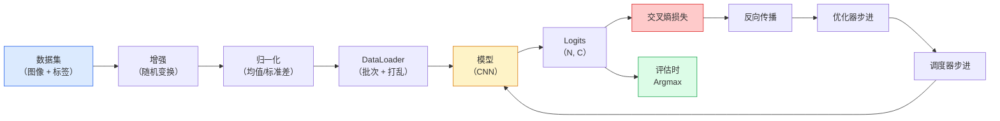

# 图像分类

> 分类器是从像素到类别概率分布的函数；其他一切都只是管线工作。

**类型：** 构建  
**学习实现：** Python  
**前置课程：** Phase 2 第 09 课（模型评估）、Phase 3 第 10 课（迷你框架）、Phase 4 第 03 课（CNN）  
**预计时间：** 约 75 分钟

## 学习目标

- 在 CIFAR-10 上构建端到端图像分类流水线：数据集、增强、模型、训练循环、评估。
- 解释每个组件（dataloader、损失、优化器、调度器、增强）的作用，并预测任一组件损坏时如何出现在损失曲线上。
- 从零实现 mixup、cutout 和标签平滑，并说明各自何时值得加入。
- 阅读混淆矩阵及逐类别精确率/召回率表，在总体准确率之外诊断数据集与模型失败。

## 问题

每个已经交付的视觉任务，在某一层面都会归结为图像分类：检测在分类区域，分割在分类像素，检索按与类别中心的相似度排序。正确完成分类——数据集循环、增强策略、损失和评估——是能迁移到本阶段其他任务的技能。

多数分类 bug 不在模型，而在管线：错误的归一化、未打乱的训练集、会扭曲标签的增强、被训练数据污染的验证集，或第 30 个 epoch 后悄悄发散的学习率。设置正确时 CIFAR-10 能达到 93% 的 CNN，管线损坏后通常只有 70–75%，而损失曲线始终看似合理。

本课手工连接整条管线，使每个部分都可检查；不会使用可能隐藏 bug 的 `torchvision.datasets` 内容。

## 概念

### 分类流水线



这个循环的每一行都可能有 bug。交叉熵接收原始 logits 而非 softmax 输出，因此在损失前调用 `model(x).softmax()` 会悄悄产生错误梯度。增强只应用于输入，不应用于标签——mixup 是例外，它同时混合两者。`optimizer.zero_grad()` 必须每步调用一次；跳过它会累积梯度，看起来像极不稳定的学习率。所有这些 bug 都会压平学习曲线，却不会抛出错误。

### 交叉熵、logits 与 softmax

分类器每张图像输出 `C` 个称为 logits 的数。softmax 将它们变为概率分布：

```
softmax(z)_i = exp(z_i) / sum_j exp(z_j)
```

交叉熵度量正确类别的负对数概率：

```
CE(z, y) = -log( softmax(z)_y )
        = -z_y + log( sum_j exp(z_j) )
```

右式是数值稳定的形式（log-sum-exp）。PyTorch 的 `nn.CrossEntropyLoss` 将 softmax + NLL 融合为一个操作，直接接收原始 logits。先自行应用 softmax 几乎总是 bug——你会计算 `log(softmax(softmax(z)))`，这是没有意义的量。

### 增强为何有效

CNN 因权重共享具有平移归纳偏置，但对裁剪、翻转、颜色抖动或遮挡没有内置不变性。教会它这些不变性的唯一方法，是展示能体现这些变换的像素。训练期间每次随机变换都在说：“两张图的标签相同；请学习忽略差异的特征。”

```
原始裁剪：  “面向左的狗”
翻转：      “面向右的狗”       <- 标签相同，像素不同
旋转（+15）： “略微倾斜的狗”
颜色抖动：  “暖光下的狗”
随机擦除：  “缺了一块的狗”
```

规则是增强必须保持标签。对数字做 cutout 和旋转可将 “6” 翻为 “9”；这类数据集应使用较小旋转范围，并选择符合数字特有不变性的增强。

### Mixup 与 cutmix

普通增强变换像素但保留 one-hot 标签；**mixup** 与 **cutmix** 打破这一点，同时插值二者。

```
Mixup：
  lambda ~ Beta(a, a)
  x = lambda * x_i + (1 - lambda) * x_j
  y = lambda * y_i + (1 - lambda) * y_j

Cutmix：
  将 x_j 的随机矩形粘贴到 x_i
  y = 按面积加权混合 y_i 和 y_j
```

它的作用是使模型不再记忆尖锐 one-hot 目标，而是学习类别间插值。训练损失升高，测试准确率升高；它是任何分类器最便宜的鲁棒性升级。

### 标签平滑

它是 mixup 的近亲。与其针对 `[0, 0, 1, 0, 0]` 训练，不如针对小 `eps`（如 0.1）的 `[eps/C, eps/C, 1-eps, eps/C, eps/C]` 训练。它阻止模型产生任意尖锐的 logits，几乎无成本地改善校准；从 PyTorch 1.10 起内置于 `nn.CrossEntropyLoss(label_smoothing=0.1)`。

### 准确率之外的评估

总体准确率会掩盖不平衡。一个总预测多数类的 90–10 二分类器也有 90% 准确率。真正说明情况的工具包括：

- **逐类别准确率** —— 每类一个数，立即暴露表现差的类别。
- **混淆矩阵** —— C x C 网格，行 i 列 j = 真类 i 被预测为 j 的数目；对角线正确，非对角线是模型真正活跃的地方。
- **Top-1 / Top-5** —— 正确类是否位于前 1 或前 5 个预测中；ImageNet 需 Top-5，因为 “Norwich terrier” 与 “Norfolk terrier” 等类别确实模糊。
- **校准（ECE）** —— 置信度 0.8 的预测是否有 80% 正确？现代网络系统性过度自信，可用温度缩放或标签平滑修复。

```figure
receptive-field
```

## 动手实现

### 步骤 1：确定性的合成数据集

CIFAR-10 位于磁盘中。为使本课可复现且快速，构建一个外观类似 CIFAR 的合成数据集：32x32 RGB 图像具有模型必须学习的类别特异结构；同一管线无需改动即可用于真实 CIFAR-10。

```python
import numpy as np
import torch
from torch.utils.data import Dataset


def synthetic_cifar(num_per_class=1000, num_classes=10, seed=0):
    rng = np.random.default_rng(seed)
    X = []
    Y = []
    for c in range(num_classes):
        centre = rng.uniform(0, 1, (3,))
        freq = 2 + c
        for _ in range(num_per_class):
            yy, xx = np.meshgrid(np.linspace(0, 1, 32), np.linspace(0, 1, 32), indexing="ij")
            r = np.sin(xx * freq) * 0.5 + centre[0]
            g = np.cos(yy * freq) * 0.5 + centre[1]
            b = (xx + yy) * 0.5 * centre[2]
            img = np.stack([r, g, b], axis=-1)
            img += rng.normal(0, 0.08, img.shape)
            img = np.clip(img, 0, 1)
            X.append(img.astype(np.float32))
            Y.append(c)
    X = np.stack(X)
    Y = np.array(Y)
    idx = rng.permutation(len(X))
    return X[idx], Y[idx]


class ArrayDataset(Dataset):
    def __init__(self, X, Y, transform=None):
        self.X = X
        self.Y = Y
        self.transform = transform

    def __len__(self):
        return len(self.X)

    def __getitem__(self, i):
        img = self.X[i]
        if self.transform is not None:
            img = self.transform(img)
        img = torch.from_numpy(img).permute(2, 0, 1)
        return img, int(self.Y[i])
```

每个类别有自己的颜色调色板和频率模式，并加入高斯噪声，迫使模型学习信号而非记忆像素。十个类别，每类一千张图像，随后打乱。

### 步骤 2：归一化与增强

每条视觉管线都有的两种变换。

```python
def standardize(mean, std):
    mean = np.array(mean, dtype=np.float32)
    std = np.array(std, dtype=np.float32)
    def _fn(img):
        return (img - mean) / std
    return _fn


def random_hflip(p=0.5):
    def _fn(img):
        if np.random.random() < p:
            return img[:, ::-1, :].copy()
        return img
    return _fn


def random_crop(pad=4):
    def _fn(img):
        h, w = img.shape[:2]
        padded = np.pad(img, ((pad, pad), (pad, pad), (0, 0)), mode="reflect")
        y = np.random.randint(0, 2 * pad)
        x = np.random.randint(0, 2 * pad)
        return padded[y:y + h, x:x + w, :]
    return _fn


def compose(*fns):
    def _fn(img):
        for fn in fns:
            img = fn(img)
        return img
    return _fn
```

裁剪前使用 reflect 填充而不是零填充，因为黑色边界会成为模型以无用方式学会忽略的信号。

### 步骤 3：Mixup

在训练步骤内部混合两张图及两个标签。它作为批变换实现，因而位于前向传播旁而非数据集内部。

```python
def mixup_batch(x, y, num_classes, alpha=0.2):
    if alpha <= 0:
        return x, torch.nn.functional.one_hot(y, num_classes).float()
    lam = float(np.random.beta(alpha, alpha))
    idx = torch.randperm(x.size(0), device=x.device)
    x_mixed = lam * x + (1 - lam) * x[idx]
    y_onehot = torch.nn.functional.one_hot(y, num_classes).float()
    y_mixed = lam * y_onehot + (1 - lam) * y_onehot[idx]
    return x_mixed, y_mixed


def soft_cross_entropy(logits, soft_targets):
    log_probs = torch.log_softmax(logits, dim=-1)
    return -(soft_targets * log_probs).sum(dim=-1).mean()
```

`soft_cross_entropy` 是针对软标签分布的交叉熵。目标严格为 one-hot 时，它退化为通常的 one-hot 情形。

### 步骤 4：训练循环

完整配方：遍历一次数据，每批一次梯度，每个 epoch 一次调度器步进。

```python
import torch
import torch.nn as nn
from torch.utils.data import DataLoader
from torch.optim import SGD
from torch.optim.lr_scheduler import CosineAnnealingLR

def train_one_epoch(model, loader, optimizer, device, num_classes, use_mixup=True):
    model.train()
    total, correct, loss_sum = 0, 0, 0.0
    for x, y in loader:
        x, y = x.to(device), y.to(device)
        if use_mixup:
            x_m, y_soft = mixup_batch(x, y, num_classes)
            logits = model(x_m)
            loss = soft_cross_entropy(logits, y_soft)
        else:
            logits = model(x)
            loss = nn.functional.cross_entropy(logits, y, label_smoothing=0.1)
        optimizer.zero_grad()
        loss.backward()
        optimizer.step()
        loss_sum += loss.item() * x.size(0)
        total += x.size(0)
        # Training accuracy vs the un-mixed labels `y` is only an approximation
        # when mixup is on (the model saw soft targets, not y). Treat it as a
        # rough progress signal; rely on val accuracy for real performance.
        with torch.no_grad():
            pred = logits.argmax(dim=-1)
            correct += (pred == y).sum().item()
    return loss_sum / total, correct / total


@torch.no_grad()
def evaluate(model, loader, device, num_classes):
    model.eval()
    total, correct = 0, 0
    loss_sum = 0.0
    cm = torch.zeros(num_classes, num_classes, dtype=torch.long)
    for x, y in loader:
        x, y = x.to(device), y.to(device)
        logits = model(x)
        loss = nn.functional.cross_entropy(logits, y)
        pred = logits.argmax(dim=-1)
        for t, p in zip(y.cpu(), pred.cpu()):
            cm[t, p] += 1
        loss_sum += loss.item() * x.size(0)
        total += x.size(0)
        correct += (pred == y).sum().item()
    return loss_sum / total, correct / total, cm
```

每次编写训练循环时检查五个不变量：

1. 训练前 `model.train()`，评估前 `model.eval()`——它们切换 dropout 与 batchnorm 行为。
2. `.backward()` 前调用 `.zero_grad()`。
3. 累积指标时调用 `.item()`，以免计算图持续存活。
4. 评估期间使用 `@torch.no_grad()`——节省内存和时间，避免隐蔽事故。
5. 对原始 logits 而非 softmax 做 argmax——结果相同，少一次操作。

### 步骤 5：将它们组合起来

使用上一课的 `TinyResNet`，训练几个 epoch 后评估。

```python
from main import synthetic_cifar, ArrayDataset
from main import standardize, random_hflip, random_crop, compose
from main import mixup_batch, soft_cross_entropy
from main import train_one_epoch, evaluate
# TinyResNet comes from the previous lesson (03-cnns-lenet-to-resnet).
# Adjust the import path to wherever you stored the previous lesson's code.
from cnns_lenet_to_resnet import TinyResNet  # example placeholder

X, Y = synthetic_cifar(num_per_class=500)
split = int(0.9 * len(X))
X_train, Y_train = X[:split], Y[:split]
X_val, Y_val = X[split:], Y[split:]

mean = [0.5, 0.5, 0.5]
std = [0.25, 0.25, 0.25]
train_tf = compose(random_hflip(), random_crop(pad=4), standardize(mean, std))
eval_tf = standardize(mean, std)

train_ds = ArrayDataset(X_train, Y_train, transform=train_tf)
val_ds = ArrayDataset(X_val, Y_val, transform=eval_tf)

train_loader = DataLoader(train_ds, batch_size=128, shuffle=True, num_workers=0)
val_loader = DataLoader(val_ds, batch_size=256, shuffle=False, num_workers=0)

device = "cuda" if torch.cuda.is_available() else "cpu"
model = TinyResNet(num_classes=10).to(device)
optimizer = SGD(model.parameters(), lr=0.1, momentum=0.9, weight_decay=5e-4, nesterov=True)
scheduler = CosineAnnealingLR(optimizer, T_max=10)

for epoch in range(10):
    tr_loss, tr_acc = train_one_epoch(model, train_loader, optimizer, device, 10, use_mixup=True)
    va_loss, va_acc, _ = evaluate(model, val_loader, device, 10)
    scheduler.step()
    print(f"epoch {epoch:2d}  lr {scheduler.get_last_lr()[0]:.4f}  "
          f"train {tr_loss:.3f}/{tr_acc:.3f}  val {va_loss:.3f}/{va_acc:.3f}")
```

在合成数据集上，五个 epoch 内验证准确率会接近完美，这正是要点：管线正确，模型便能学习可学习内容。换成真实 CIFAR-10 后，同一循环无需改动就能训练到约 90%。

### 步骤 6：阅读混淆矩阵

准确率永远无法告诉你模型具体在哪失败；混淆矩阵可以。

```python
def print_confusion(cm, labels=None):
    c = cm.shape[0]
    labels = labels or [str(i) for i in range(c)]
    print(f"{'':>6}" + "".join(f"{l:>5}" for l in labels))
    for i in range(c):
        row = cm[i].tolist()
        print(f"{labels[i]:>6}" + "".join(f"{v:>5}" for v in row))
    print()
    tp = cm.diag().float()
    fp = cm.sum(dim=0).float() - tp
    fn = cm.sum(dim=1).float() - tp
    prec = tp / (tp + fp).clamp_min(1)
    rec = tp / (tp + fn).clamp_min(1)
    f1 = 2 * prec * rec / (prec + rec).clamp_min(1e-9)
    for i in range(c):
        print(f"{labels[i]:>6}  prec {prec[i]:.3f}  rec {rec[i]:.3f}  f1 {f1[i]:.3f}")

_, _, cm = evaluate(model, val_loader, device, 10)
print_confusion(cm)
```

行是真实类别，列是预测。类别 3 与 5 间一簇非对角计数意味着模型混淆两类，也为定向数据收集或类别特异增强提供起点。

## 使用现成工具

`torchvision` 将上述内容封装为惯用组件。对真实 CIFAR-10，完整管线是四行加训练循环。

```python
from torchvision.datasets import CIFAR10
from torchvision.transforms import Compose, RandomCrop, RandomHorizontalFlip, ToTensor, Normalize

mean = (0.4914, 0.4822, 0.4465)
std = (0.2470, 0.2435, 0.2616)
train_tf = Compose([
    RandomCrop(32, padding=4, padding_mode="reflect"),
    RandomHorizontalFlip(),
    ToTensor(),
    Normalize(mean, std),
])
eval_tf = Compose([ToTensor(), Normalize(mean, std)])

train_ds = CIFAR10(root="./data", train=True,  download=True, transform=train_tf)
val_ds   = CIFAR10(root="./data", train=False, download=True, transform=eval_tf)
```

注意两点：均值/标准差是**数据集特异**的——由 CIFAR-10 训练集而非 ImageNet 计算——reflect 填充则是社区默认裁剪策略。把 ImageNet 统计量复制到这里会泄漏约 1% 准确率，直到有人分析模型前通常无人发现。

## 交付产物

本课产出：

- `outputs/prompt-classifier-pipeline-auditor.md` —— 审核训练脚本是否满足上面五个不变量，并指出首个违反项的提示词。
- `outputs/skill-classification-diagnostics.md` —— 给定混淆矩阵和类别名称，概括逐类失败并提出单个影响最大的修复的技能。

## 练习

1. **（简单）** 在合成数据集上，分别启用与禁用 mixup 训练相同模型五个 epoch；绘制两者训练和验证损失，解释为何 mixup 的训练损失更高，而验证准确率相近或更好。
2. **（中等）** 实现 Cutout：每张训练图像随机置零一个 8x8 方块；运行消融实验，比较无增强、hflip+crop、hflip+crop+cutout、hflip+crop+mixup，并报告每个设置的验证准确率。
3. **（困难）** 构建 CIFAR-100 流水线（100 类、相同输入尺寸），复现 ResNet-34 训练，达到已发表准确率的 1% 以内。扩展：扫三个学习率和两个权重衰减，记录到本地 CSV，生成最终“混淆矩阵中最常混淆类别”的表。

## 关键术语

| 术语 | 常见说法 | 实际含义 |
|------|----------|----------|
| Logits | “原始输出” | 每张图像 softmax 前的 C 维向量；交叉熵期待它而非 softmax 后的值 |
| 交叉熵（Cross-entropy） | “损失” | 正确类的负对数概率；在一个稳定操作中合并 log-softmax 与 NLL |
| DataLoader | “批处理器” | 为数据集封装打乱、批处理和（可选）多 worker 加载；一半训练 bug 都会归咎于它 |
| 增强（Augmentation） | “随机变换” | 训练时保持标签不变的任意像素变换；教授 CNN 本身没有的不变性 |
| Mixup / Cutmix | “混合两张图” | 同时混合输入和标签，使分类器学习平滑插值而非硬边界 |
| 标签平滑（Label smoothing） | “更软的目标” | 以 `(1-eps, eps/(C-1), ...)` 替换 one-hot；改善校准并轻微提升准确率 |
| Top-k 准确率 | “Top-5” | 正确类位于概率最高的 k 个预测中；用于类别确实模糊的数据集 |
| 混淆矩阵（Confusion matrix） | “错误所在” | C x C 表，项 `(i, j)` 计数真类 i 被预测为 j 的图像；对角线正确，非对角线说明应修什么 |

## 延伸阅读

- [CS231n: Training Neural Networks](https://cs231n.github.io/neural-networks-3/) —— 单页中最清晰的训练流水线讲解。
- [Bag of Tricks for Image Classification (He et al., 2019)](https://arxiv.org/abs/1812.01187) —— 合在一起为 ImageNet ResNet 准确率增加 3–4% 的所有小技巧。
- [mixup: Beyond Empirical Risk Minimization (Zhang et al., 2017)](https://arxiv.org/abs/1710.09412) —— 原始 mixup 论文：三页理论和有说服力的实验。
- [Why temperature scaling matters (Guo et al., 2017)](https://arxiv.org/abs/1706.04599) —— 证明现代网络未校准，并用一个标量参数修复它的论文。
