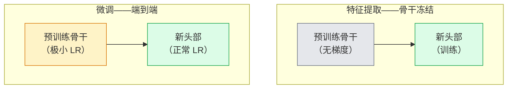

# 迁移学习与微调

> 别人已花一百万 GPU 小时教网络识别边缘、纹理和物体部件。训练自己的模型前，你应先借用这些特征。

**类型：** 构建  
**学习实现：** Python  
**前置课程：** Phase 4 第 03 课（CNN）、Phase 4 第 04 课（图像分类）  
**预计时间：** 约 75 分钟

## 学习目标

- 区分特征提取和微调，并基于数据集规模、领域距离和计算预算选择正确方式。
- 加载预训练骨干、替换分类器头，并在 20 行以内只训练头部得到可用基线。
- 以判别式学习率逐步解冻层，使早期通用特征的更新小于后期任务特异特征。
- 诊断三种常见失败：已解冻模块学习率过高导致特征漂移、微小数据集上的 BN 统计量崩溃，以及灾难性遗忘。

## 问题

在 ImageNet 上训练 ResNet-50 约需 2,000 GPU 小时；极少团队能为交付的每项任务承担这一预算。几乎所有团队真正交付的是预训练骨干，加上一个在几百或几千张任务特异图像上训练的新头部。

这不是捷径。ImageNet CNN 的第一卷积模块学习边缘和类似 Gabor 的滤波器；接下来的模块学习纹理和简单图案；中间模块学习物体部件；最终模块学习开始类似 1,000 个 ImageNet 类别的组合。这个层级的前 90% 几乎不变地迁移到医学影像、工业检测、卫星数据和其他视觉任务，因为自然界的边缘与纹理词汇有限；真正训练的是最后 10%。

正确迁移学习有三个陷阱：高学习率破坏预训练特征、冻结过多使模型信息不足，以及让 BatchNorm 的运行统计量漂向网络未曾学习过的微小数据集。本课会有意逐一处理它们。

## 概念

### 特征提取与微调

两种模式，选择取决于你对预训练特征的信任程度和拥有的数据量。



经验法则：

| 数据集规模 | 领域距离 | 配方 |
|------------|----------|------|
| < 1k 图像 | 接近 ImageNet | 冻结骨干，只训练头部 |
| 1k–10k | 接近 | 冻结前 2–3 个 stage，微调其余部分 |
| 10k–100k | 任意 | 使用判别式 LR 端到端微调 |
| 100k+ | 远 | 微调全部；领域足够远时考虑从头训练 |

“接近 ImageNet”大致是含类似物体的自然 RGB 照片。医学 CT、俯视卫星图像、显微镜图像属于远领域——特征仍有帮助，但需要让更多层适应。

### 冻结为何有效

CNN 学到的 ImageNet 特征并不只适用于 1,000 类；它们适用于自然图像的统计特性：特定方向的边缘、纹理、对比模式和形状原语。这些统计量跨越几乎所有人类可命名的视觉领域保持稳定。因此一个 ImageNet 模型零样本用于 CIFAR-10、仅换一个新线性头（不微调骨干）就能达到 80%+；头部只是在学习本任务该如何加权已有特征。

### 判别式学习率

解冻后，早期层应比后期层训练得慢。早期层编码需保留的通用特征，后期层编码需大幅移动的任务特异结构。

```
典型配方：

  stage 0（stem + 第一组）：lr = base_lr / 100    （几乎固定）
  stage 1：                   lr = base_lr / 10
  stage 2：                   lr = base_lr / 3
  stage 3（最后骨干组）：     lr = base_lr
  head：                      lr = base_lr  （或略高）
```

在 PyTorch 中，这只是传给优化器的参数组列表：一个模型、五种学习率、不增加代码。

### BatchNorm 问题

BN 层保存了在 ImageNet 上计算的 `running_mean` 与 `running_var` 缓冲区。任务像素分布不同（光照、传感器或色彩空间不同）时，它们就是错的。按优先顺序有三种选择：

1. **BN 保持 train 模式微调。** 让 BN 随其他内容一起更新运行统计量；适用于中等规模任务数据集（>= 5k 样本）。
2. **BN 保持 eval 模式冻结。** 保留 ImageNet 统计量，只训练权重；数据集太小、BN 移动平均会有噪声时正确。
3. **以 GroupNorm 替换 BN。** 完全去掉移动平均问题；用于每 GPU 批大小很小的检测与分割骨干。

处理错误会悄悄损失 5–15% 准确率。

### 头部设计

分类器头是 1–3 个线性层加可选 dropout。每个 torchvision 骨干都附有待替换的默认头：

```
backbone.fc = nn.Linear(backbone.fc.in_features, num_classes)          # ResNet
backbone.classifier[1] = nn.Linear(..., num_classes)                    # EfficientNet, MobileNet
backbone.heads.head = nn.Linear(..., num_classes)                       # torchvision ViT
```

小数据集通常一个线性层足够；任务分布与骨干训练分布较远时，增加隐藏层（Linear -> ReLU -> Dropout -> Linear）会有帮助。

### 逐层学习率衰减

现代微调（BEiT、DINOv2、ViT-B）使用的、更平滑的判别式 LR 版本。不再把层分为 stage，而是让每层 LR 比其上一层略小：

```
lr_layer_k = base_lr * decay^(L - k)
```

当 `decay = 0.75`、`L = 12` 个 transformer 模块时，第一模块以头部 LR 的 `0.75^11 ≈ 0.04x` 训练。它对 transformer 微调比对 CNN 更重要，后者通常按 stage 分组 LR 已足够。

### 应评估什么

迁移学习运行需要额外追踪两个数：

- **仅预训练准确率** —— 骨干冻结时头部的准确率，是下限。
- **微调准确率** —— 同一模型端到端训练后的准确率，是上限。

若微调低于仅预训练，则存在学习率或 BN bug；总是打印两者。

```figure
transfer-learning
```

## 动手实现

### 步骤 1：加载预训练骨干并检查

```python
import torch
import torch.nn as nn
from torchvision.models import resnet18, ResNet18_Weights

backbone = resnet18(weights=ResNet18_Weights.IMAGENET1K_V1)
print(backbone)
print()
print("classifier head:", backbone.fc)
print("feature dim:", backbone.fc.in_features)
```

`ResNet18` 有四个 stage（`layer1..layer4`）、stem 和 `fc` 头；每个 torchvision 分类骨干都有相似结构。

### 步骤 2：特征提取——冻结全部，替换头部

```python
def make_feature_extractor(num_classes=10):
    model = resnet18(weights=ResNet18_Weights.IMAGENET1K_V1)
    for p in model.parameters():
        p.requires_grad = False
    model.fc = nn.Linear(model.fc.in_features, num_classes)
    return model

model = make_feature_extractor(num_classes=10)
trainable = sum(p.numel() for p in model.parameters() if p.requires_grad)
frozen = sum(p.numel() for p in model.parameters() if not p.requires_grad)
print(f"trainable: {trainable:>10,}")
print(f"frozen:    {frozen:>10,}")
```

只有 `model.fc` 可训练；骨干是冻结的特征提取器。

### 步骤 3：判别式微调

一个构建 stage 特异学习率参数组的工具。

```python
def discriminative_param_groups(model, base_lr=1e-3, decay=0.3):
    stages = [
        ["conv1", "bn1"],
        ["layer1"],
        ["layer2"],
        ["layer3"],
        ["layer4"],
        ["fc"],
    ]
    groups = []
    for i, names in enumerate(stages):
        lr = base_lr * (decay ** (len(stages) - 1 - i))
        params = [p for n, p in model.named_parameters()
                  if any(n.startswith(k) for k in names)]
        if params:
            groups.append({"params": params, "lr": lr, "name": "_".join(names)})
    return groups

model = resnet18(weights=ResNet18_Weights.IMAGENET1K_V1)
model.fc = nn.Linear(model.fc.in_features, 10)
for p in model.parameters():
    p.requires_grad = True

groups = discriminative_param_groups(model)
for g in groups:
    print(f"{g['name']:>10s}  lr={g['lr']:.2e}  params={sum(p.numel() for p in g['params']):>8,}")
```

`decay=0.3` 表示每个 stage 的训练速率是下一个 stage 的 30%。`fc` 用 `base_lr`，`layer4` 用 `0.3 * base_lr`，`conv1` 用 `0.3^5 * base_lr ≈ 0.00243 * base_lr`。听起来极端，但实证有效。

### 步骤 4：处理 BatchNorm

不冻结 BN 权重、但冻结其运行统计量的辅助函数。

```python
def freeze_bn_stats(model):
    for m in model.modules():
        if isinstance(m, (nn.BatchNorm1d, nn.BatchNorm2d, nn.BatchNorm3d)):
            m.eval()
            for p in m.parameters():
                p.requires_grad = False
    return model
```

每个 epoch 开头设置 `model.train()` 后调用它。`model.train()` 会将所有内容切到训练模式；此函数只对 BN 层反转这一设置。

### 步骤 5：最小端到端微调循环

```python
from torch.optim import SGD
from torch.utils.data import DataLoader
from torch.optim.lr_scheduler import CosineAnnealingLR
import torch.nn.functional as F

def fine_tune(model, train_loader, val_loader, device, epochs=5, base_lr=1e-3, freeze_bn=False):
    model = model.to(device)
    groups = discriminative_param_groups(model, base_lr=base_lr)
    optimizer = SGD(groups, momentum=0.9, weight_decay=1e-4, nesterov=True)
    scheduler = CosineAnnealingLR(optimizer, T_max=epochs)

    for epoch in range(epochs):
        model.train()
        if freeze_bn:
            freeze_bn_stats(model)
        tr_loss, tr_correct, tr_total = 0.0, 0, 0
        for x, y in train_loader:
            x, y = x.to(device), y.to(device)
            logits = model(x)
            loss = F.cross_entropy(logits, y, label_smoothing=0.1)
            optimizer.zero_grad()
            loss.backward()
            optimizer.step()
            tr_loss += loss.item() * x.size(0)
            tr_total += x.size(0)
            tr_correct += (logits.argmax(-1) == y).sum().item()
        scheduler.step()

        model.eval()
        va_total, va_correct = 0, 0
        with torch.no_grad():
            for x, y in val_loader:
                x, y = x.to(device), y.to(device)
                pred = model(x).argmax(-1)
                va_total += x.size(0)
                va_correct += (pred == y).sum().item()
        print(f"epoch {epoch}  train {tr_loss/tr_total:.3f}/{tr_correct/tr_total:.3f}  "
              f"val {va_correct/va_total:.3f}")
    return model
```

在 CIFAR-10 上，上述配方的五个 epoch 可使 `ResNet18-IMAGENET1K_V1` 从约 70% 的零样本线性探测准确率提升至约 93% 微调准确率；只训练头部、完全不碰骨干会在约 86% 停滞。

### 步骤 6：渐进式解冻

从末端向开头每个 epoch 解冻一个 stage 的计划。它以额外 epoch 换取缓解特征漂移。

```python
def progressive_unfreeze_schedule(model):
    stages = ["layer4", "layer3", "layer2", "layer1"]
    yielded = set()

    def start():
        for p in model.parameters():
            p.requires_grad = False
        for p in model.fc.parameters():
            p.requires_grad = True

    def unfreeze(epoch):
        if epoch < len(stages):
            name = stages[epoch]
            yielded.add(name)
            for n, p in model.named_parameters():
                if n.startswith(name):
                    p.requires_grad = True
            return name
        return None

    return start, unfreeze
```

第一个 epoch 前调用一次 `start()`，每个 epoch 开始调用 `unfreeze(epoch)`。每次可训练参数集合改变时重建优化器；否则冻结参数仍持有会干扰优化器的缓存动量。

## 使用现成工具

对多数真实任务，`torchvision.models` 加三行就足够；遇到库默认值无法修复的问题时，上面较重的工具才重要。

```python
from torchvision.models import resnet50, ResNet50_Weights

model = resnet50(weights=ResNet50_Weights.IMAGENET1K_V2)
model.fc = nn.Linear(model.fc.in_features, num_classes)
optimizer = torch.optim.AdamW(model.parameters(), lr=1e-4, weight_decay=1e-4)
```

另外两个生产级默认选项：

- `timm` 提供约 800 个具有一致 API 的预训练视觉骨干（`timm.create_model("resnet50", pretrained=True, num_classes=10)`）；任何超出 torchvision zoo 的微调通常都使用它。
- 对 transformer，`transformers.AutoModelForImageClassification.from_pretrained(name, num_labels=N)` 可用与文本模型相同的加载语义获得 ViT / BEiT / DeiT。

## 交付产物

本课产出：

- `outputs/prompt-fine-tune-planner.md` —— 根据数据集规模、领域距离和计算预算选择特征提取、渐进式或端到端微调的提示词。
- `outputs/skill-freeze-inspector.md` —— 给定 PyTorch 模型，报告哪些参数可训练、哪些 BatchNorm 层为 eval 模式，以及优化器是否真正接收了可训练参数的技能。

## 练习

1. **（简单）** 在同一 synthetic-CIFAR 数据集上，将 `ResNet18` 作为线性探测器（骨干冻结）和完整微调分别训练；并列报告准确率。解释哪个差距表示特征迁移良好，哪个表示迁移不好。
2. **（中等）** 有意引入 bug：对骨干 stage 而非头部设置 `base_lr = 1e-1`。展示训练损失爆炸，再用 `discriminative_param_groups` 恢复；记录每个 stage 开始发散的 LR。
3. **（困难）** 选择医学影像数据集（如 CheXpert-small、PatchCamelyon 或 HAM10000），比较：(a) ImageNet 预训练、骨干冻结 + 线性头；(b) ImageNet 预训练、端到端微调；(c) 从头训练。报告各自准确率和计算成本；数据集达到什么规模时从头训练才有竞争力？

## 关键术语

| 术语 | 常见说法 | 实际含义 |
|------|----------|----------|
| 特征提取（Feature extraction） | “冻结并训练头部” | 骨干参数冻结，只有新分类器头接收梯度 |
| 微调（Fine-tuning） | “端到端重训” | 所有参数可训练，通常使用远小于从头训练的 LR |
| 判别式 LR（Discriminative LR） | “早期层较小 LR” | 优化器参数组中，早期 stage 的 LR 是后期 stage LR 的一部分 |
| 逐层 LR 衰减（Layer-wise LR decay） | “平滑 LR 梯度” | 每层 LR 乘以 `decay^(L - k)`；常用于 transformer 微调 |
| 灾难性遗忘（Catastrophic forgetting） | “模型忘了 ImageNet” | 过高 LR 在学到新任务信号前覆盖预训练特征 |
| BN 统计漂移（BN statistics drift） | “运行均值错误” | BatchNorm 的 running_mean/var 在与当前任务不同的分布上计算，悄悄损害准确率 |
| 线性探测（Linear probe） | “冻结骨干 + 线性头” | 对预训练特征的评估：冻结表征之上最佳线性分类器的准确率 |
| 灾难性崩溃（Catastrophic collapse） | “一切都预测成一类” | 微调 LR 高到在头部梯度稳定前破坏特征时发生 |

## 延伸阅读

- [How transferable are features in deep neural networks? (Yosinski et al., 2014)](https://arxiv.org/abs/1411.1792) —— 量化不同层间特征可迁移性的论文。
- [Universal Language Model Fine-tuning (ULMFiT, Howard & Ruder, 2018)](https://arxiv.org/abs/1801.06146) —— 判别式 LR / 渐进式解冻的原始配方；思想可直接迁移到视觉。
- [timm documentation](https://huggingface.co/docs/timm) —— 现代视觉骨干及其训练所用精确微调默认值的参考。
- [A Simple Framework for Linear-Probe Evaluation (Kornblith et al., 2019)](https://arxiv.org/abs/1805.08974) —— 为什么线性探测准确率重要，以及怎样正确报告它。
