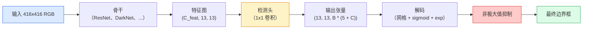

# 目标检测：从零实现 YOLO

> 检测是分类加回归：在特征图每个位置运行，然后用非极大值抑制清理结果。

**类型：** 构建  
**学习实现：** Python  
**前置课程：** Phase 4 第 03 课（CNN）、Phase 4 第 04 课（图像分类）、Phase 4 第 05 课（迁移学习）  
**预计时间：** 约 75 分钟

## 学习目标

- 解释将检测变成稠密预测问题的网格—锚框设计，并说明输出张量中每个数的含义。
- 计算边界框交并比（Intersection-over-Union），并从零实现非极大值抑制。
- 在预训练骨干上构建最小 YOLO 风格头部，包括分类、目标性和边界框回归损失。
- 阅读检测指标行（precision@0.5、recall、mAP@0.5、mAP@0.5:0.95），并选择下一个应调整的旋钮。

## 问题

分类说“这张图是一只狗”；检测说“像素 `(112, 40, 280, 210)` 有一只狗，`(400, 180, 560, 310)` 有一只猫，画面中没有其他物体”。这个结构性改变——预测数量可变的带标签框而不是每图一个标签——是每个自主系统、监控产品、文档版面解析器和工厂视觉产线所依赖的能力。

检测也是视觉中全部工程权衡同时出现的地方。你需要准确框（回归头）、每个框的正确类别（分类头）、模型知道无物可检时保持沉默（目标性分数），以及每个真实物体恰好一个预测（非极大值抑制）。漏掉任一部分，管线就会漏检、报告幻觉框，或对同一物体在略不同位置预测十五次。

YOLO（You Only Look Once，Redmon 等，2016）通过一次卷积网络前向传播使这些内容实时运行；相同结构决策仍是现代检测器（YOLOv8、YOLOv9、YOLO-NAS、RT-DETR）的骨干。理解核心后，每个变体都只是相同部件的重新排列。

## 概念

### 检测即稠密预测

分类器每张图输出 C 个数；YOLO 风格检测器每张图输出 `(S x S x (5 + C))` 个数，其中 S 是空间网格尺寸。



每个 `S * S` 网格单元预测 `B` 个框。每个框包含：

- 描述几何的 4 个数：`tx, ty, tw, th`。
- 1 个目标性分数：“这个单元中心有物体吗？”
- C 个类别概率。

因此每单元为 `B * (5 + C)` 个数。VOC 采用 `S=13, B=2, C=20` 时，每单元为 50 个数。

### 为什么使用网格和锚框

朴素回归会为每个物体预测绝对坐标 `(x, y, w, h)`。这对卷积网络很难，因为平移图像不应使所有预测同量平移——每个物体需要空间锚定。网格通过将每个真值框分配给其中心落入的网格单元来解决；只有该单元负责这个物体。

锚框解决第二个问题：3x3 卷积不能轻易从一个 16 像素感受野的特征单元回归出 500 像素宽的框。因此每单元预定义 `B` 种先验框形状（锚框），并预测每个锚框的小偏移。模型学习选择正确锚框并微调它，而非从无到有回归。

```
锚框先验（416x416 输入示例）：

  小：       (30,  60)
  中：       (75,  170)
  大：       (200, 380)

每个网格单元中，每个锚框输出 (tx, ty, tw, th, obj, c_1, ..., c_C)。
```

现代检测器常以 FPN 在不同分辨率使用不同锚框集合：浅层高分辨率图用小锚框，深层低分辨率图用大锚框。同一思想，更多尺度。

### 解码预测

原始 `tx, ty, tw, th` 不是框坐标；绘制前需变换：

```
中心 x  = (sigmoid(tx) + cell_x) * stride
中心 y  = (sigmoid(ty) + cell_y) * stride
宽度    = anchor_w * exp(tw)
高度    = anchor_h * exp(th)
```

`sigmoid` 将中心偏移限制在单元内，`exp` 允许宽高相对锚框自由缩放且不反号，`stride` 将网格坐标缩回像素。自 YOLO v2 以来，每个 YOLO 版本都有相同解码步骤。

### IoU

两个框之间的通用相似度指标：

```
IoU(A, B) = area(A intersect B) / area(A union B)
```

IoU = 1 表示完全相同，IoU = 0 表示无重叠。预测框与真值框的 IoU 决定预测是否为真阳性（通常 IoU >= 0.5）；两个预测间的 IoU 用于 NMS 去重。

### 非极大值抑制

在相邻锚框训练的卷积网络常对同一物体预测重叠框。NMS 保留置信度最高的预测，删除与它 IoU 超过阈值的其他预测。

```
NMS(boxes, scores, iou_threshold)：
    按分数降序排序框
    keep = []
    当 boxes 非空：
        取最高分框，加入 keep
        删除所有与所取框 IoU > iou_threshold 的框
    返回 keep
```

目标检测典型阈值为 0.45。新检测器以 `soft-NMS`、`DIoU-NMS` 或直接学习抑制（RT-DETR）替代标准 NMS，但结构性目的相同。

### 损失

YOLO 损失是三类损失按权重求和：

```
L = lambda_coord * L_box(pred, target, where obj=1)
  + lambda_obj   * L_obj(pred, 1,     where obj=1)
  + lambda_noobj * L_obj(pred, 0,     where obj=0)
  + lambda_cls   * L_cls(pred, target, where obj=1)
```

只有含物体的单元参与框回归和分类损失；无物体单元只参与目标性损失（教模型保持沉默）。`lambda_noobj` 通常较小（约 0.5），否则绝大多数空单元会支配总损失。

现代变体以 CIoU / DIoU（直接优化 IoU）替换 MSE 框损失，用 focal loss 处理类别不平衡，用 quality focal loss 平衡目标性；三组件结构不变。

### 检测指标

准确率不能迁移到检测。应看四个数：

- **Precision@IoU=0.5** —— 被计为正的预测中，多少确实正确。
- **Recall@IoU=0.5** —— 真实物体中，找到了多少。
- **AP@0.5** —— IoU 阈值 0.5 上的精确率—召回率曲线面积；每类一个数。
- **mAP@0.5:0.95** —— IoU 阈值 0.5、0.55、…、0.95 上 AP 的平均；COCO 指标，最严格且信息最多。

报告全部四项。mAP@0.5 强而 mAP@0.5:0.95 弱，表示定位大致正确但不紧，应改进框回归损失；精确率高、召回率低，表示过于保守，应降低置信度阈值或提高目标性权重。

```figure
object-detection-nms
```

## 动手实现

### 步骤 1：IoU

本课的主力函数，适用于 `(x1, y1, x2, y2)` 格式的两个框数组。

```python
import numpy as np

def box_iou(boxes_a, boxes_b):
    ax1, ay1, ax2, ay2 = boxes_a[:, 0], boxes_a[:, 1], boxes_a[:, 2], boxes_a[:, 3]
    bx1, by1, bx2, by2 = boxes_b[:, 0], boxes_b[:, 1], boxes_b[:, 2], boxes_b[:, 3]

    inter_x1 = np.maximum(ax1[:, None], bx1[None, :])
    inter_y1 = np.maximum(ay1[:, None], by1[None, :])
    inter_x2 = np.minimum(ax2[:, None], bx2[None, :])
    inter_y2 = np.minimum(ay2[:, None], by2[None, :])

    inter_w = np.clip(inter_x2 - inter_x1, 0, None)
    inter_h = np.clip(inter_y2 - inter_y1, 0, None)
    inter = inter_w * inter_h

    area_a = (ax2 - ax1) * (ay2 - ay1)
    area_b = (bx2 - bx1) * (by2 - by1)
    union = area_a[:, None] + area_b[None, :] - inter
    return inter / np.clip(union, 1e-8, None)
```

返回成对 IoU 的 `(N_a, N_b)` 矩阵。一个数组设为 `(1, 4)`，即可对单一真值框使用。

### 步骤 2：非极大值抑制

```python
def nms(boxes, scores, iou_threshold=0.45):
    order = np.argsort(-scores)
    keep = []
    while len(order) > 0:
        i = order[0]
        keep.append(i)
        if len(order) == 1:
            break
        rest = order[1:]
        ious = box_iou(boxes[[i]], boxes[rest])[0]
        order = rest[ious <= iou_threshold]
    return np.array(keep, dtype=np.int64)
```

它是确定性的，排序带来 `O(N log N)`，并在相同输入上匹配 `torchvision.ops.nms` 行为。

### 步骤 3：框编码与解码

在像素坐标和网络实际回归的 `(tx, ty, tw, th)` 目标间转换。

```python
def encode(box_xyxy, cell_x, cell_y, stride, anchor_wh):
    x1, y1, x2, y2 = box_xyxy
    cx = 0.5 * (x1 + x2)
    cy = 0.5 * (y1 + y2)
    w = x2 - x1
    h = y2 - y1
    tx = cx / stride - cell_x
    ty = cy / stride - cell_y
    tw = np.log(w / anchor_wh[0] + 1e-8)
    th = np.log(h / anchor_wh[1] + 1e-8)
    return np.array([tx, ty, tw, th])


def decode(tx_ty_tw_th, cell_x, cell_y, stride, anchor_wh):
    tx, ty, tw, th = tx_ty_tw_th
    cx = (sigmoid(tx) + cell_x) * stride
    cy = (sigmoid(ty) + cell_y) * stride
    w = anchor_wh[0] * np.exp(tw)
    h = anchor_wh[1] * np.exp(th)
    return np.array([cx - w / 2, cy - h / 2, cx + w / 2, cy + h / 2])


def sigmoid(x):
    return 1.0 / (1.0 + np.exp(-x))
```

测试：编码一个框后再解码，应得到非常接近原框的结果（当 `tx` 不在 sigmoid 后范围时，sigmoid 反函数不是完美可逆，存在误差）。

### 步骤 4：最小 YOLO 头

在特征图上做一次 1x1 卷积，重塑为 `(B, S, S, num_anchors, 5 + C)`。

```python
import torch
import torch.nn as nn

class YOLOHead(nn.Module):
    def __init__(self, in_c, num_anchors, num_classes):
        super().__init__()
        self.num_anchors = num_anchors
        self.num_classes = num_classes
        self.conv = nn.Conv2d(in_c, num_anchors * (5 + num_classes), kernel_size=1)

    def forward(self, x):
        n, _, h, w = x.shape
        y = self.conv(x)
        y = y.view(n, self.num_anchors, 5 + self.num_classes, h, w)
        y = y.permute(0, 3, 4, 1, 2).contiguous()
        return y
```

输出形状为 `(N, H, W, num_anchors, 5 + C)`；最后一维为 `[tx, ty, tw, th, obj, cls_0, ..., cls_{C-1}]`。

### 步骤 5：真值分配

对每个真值框，决定哪个 `(cell, anchor)` 负责它。

```python
def assign_targets(boxes_xyxy, classes, anchors, stride, grid_size, num_classes):
    num_anchors = len(anchors)
    target = np.zeros((grid_size, grid_size, num_anchors, 5 + num_classes), dtype=np.float32)
    has_obj = np.zeros((grid_size, grid_size, num_anchors), dtype=bool)

    for box, cls in zip(boxes_xyxy, classes):
        x1, y1, x2, y2 = box
        cx, cy = 0.5 * (x1 + x2), 0.5 * (y1 + y2)
        gx, gy = int(cx / stride), int(cy / stride)
        bw, bh = x2 - x1, y2 - y1

        ious = np.array([
            (min(bw, aw) * min(bh, ah)) / (bw * bh + aw * ah - min(bw, aw) * min(bh, ah))
            for aw, ah in anchors
        ])
        best = int(np.argmax(ious))
        aw, ah = anchors[best]

        target[gy, gx, best, 0] = cx / stride - gx
        target[gy, gx, best, 1] = cy / stride - gy
        target[gy, gx, best, 2] = np.log(bw / aw + 1e-8)
        target[gy, gx, best, 3] = np.log(bh / ah + 1e-8)
        target[gy, gx, best, 4] = 1.0
        target[gy, gx, best, 5 + cls] = 1.0
        has_obj[gy, gx, best] = True
    return target, has_obj
```

锚框选择即“与真值有最佳形状 IoU”——廉价代理，匹配 YOLOv2/v3 分配。v5 之后使用更复杂策略（任务对齐匹配、dynamic k），仍是对同一思想的改进。

### 步骤 6：三种损失

```python
def yolo_loss(pred, target, has_obj, lambda_coord=5.0, lambda_obj=1.0, lambda_noobj=0.5, lambda_cls=1.0):
    has_obj_t = torch.from_numpy(has_obj).bool()
    target_t = torch.from_numpy(target).float()

    # box-regression loss: only on cells with objects
    box_pred = pred[..., :4][has_obj_t]
    box_true = target_t[..., :4][has_obj_t]
    loss_box = torch.nn.functional.mse_loss(box_pred, box_true, reduction="sum")

    # objectness loss
    obj_pred = pred[..., 4]
    obj_true = target_t[..., 4]
    loss_obj_pos = torch.nn.functional.binary_cross_entropy_with_logits(
        obj_pred[has_obj_t], obj_true[has_obj_t], reduction="sum")
    loss_obj_neg = torch.nn.functional.binary_cross_entropy_with_logits(
        obj_pred[~has_obj_t], obj_true[~has_obj_t], reduction="sum")

    # classification loss on cells with objects
    cls_pred = pred[..., 5:][has_obj_t]
    cls_true = target_t[..., 5:][has_obj_t]
    loss_cls = torch.nn.functional.binary_cross_entropy_with_logits(
        cls_pred, cls_true, reduction="sum")

    total = (lambda_coord * loss_box
             + lambda_obj * loss_obj_pos
             + lambda_noobj * loss_obj_neg
             + lambda_cls * loss_cls)
    return total, {"box": loss_box.item(), "obj_pos": loss_obj_pos.item(),
                   "obj_neg": loss_obj_neg.item(), "cls": loss_cls.item()}
```

每个 YOLO 教程都会硬编码或扫描的五个超参数。比例很重要：`lambda_coord=5, lambda_noobj=0.5` 沿用原始 YOLOv1 论文，至今是合理默认值。

### 步骤 7：推理流水线

解码原始头部输出，应用 sigmoid/exp，以目标性阈值筛选，再做 NMS。

```python
def postprocess(pred_tensor, anchors, stride, img_size, conf_threshold=0.25, iou_threshold=0.45):
    pred = pred_tensor.detach().cpu().numpy()
    grid_h, grid_w = pred.shape[1], pred.shape[2]
    num_anchors = len(anchors)

    boxes, scores, classes = [], [], []
    for gy in range(grid_h):
        for gx in range(grid_w):
            for a in range(num_anchors):
                tx, ty, tw, th, obj, *cls = pred[0, gy, gx, a]
                score = sigmoid(obj) * sigmoid(np.array(cls)).max()
                if score < conf_threshold:
                    continue
                cls_idx = int(np.argmax(cls))
                cx = (sigmoid(tx) + gx) * stride
                cy = (sigmoid(ty) + gy) * stride
                w = anchors[a][0] * np.exp(tw)
                h = anchors[a][1] * np.exp(th)
                boxes.append([cx - w / 2, cy - h / 2, cx + w / 2, cy + h / 2])
                scores.append(float(score))
                classes.append(cls_idx)

    if not boxes:
        return np.zeros((0, 4)), np.zeros((0,)), np.zeros((0,), dtype=int)
    boxes = np.array(boxes)
    scores = np.array(scores)
    classes = np.array(classes)
    keep = nms(boxes, scores, iou_threshold)
    return boxes[keep], scores[keep], classes[keep]
```

完整评估路径为：head -> decode -> threshold -> NMS。

## 使用现成工具

`torchvision.models.detection` 提供具有相同概念结构的生产检测器。加载预训练模型只需三行。

```python
import torch
from torchvision.models.detection import fasterrcnn_resnet50_fpn_v2

model = fasterrcnn_resnet50_fpn_v2(weights="DEFAULT")
model.eval()
with torch.no_grad():
    predictions = model([torch.randn(3, 400, 600)])
print(predictions[0].keys())
print(f"boxes:  {predictions[0]['boxes'].shape}")
print(f"scores: {predictions[0]['scores'].shape}")
print(f"labels: {predictions[0]['labels'].shape}")
```

实时推理管线的标准是 `ultralytics`（YOLOv8/v9）：`from ultralytics import YOLO; model = YOLO('yolov8n.pt'); model(img)`。模型在内部处理解码和 NMS，返回与你上面构建相同的 `boxes / scores / labels` 三元组。

## 交付产物

本课产出：

- `outputs/prompt-detection-metric-reader.md` —— 将一行 `precision, recall, AP, mAP@0.5:0.95` 转为单行诊断及唯一最有价值下一实验的提示词。
- `outputs/skill-anchor-designer.md` —— 给定真值框数据集，在 `(w, h)` 上运行 k-means，返回每个 FPN 层的锚框集合和选择锚框数所需覆盖统计量的技能。

## 练习

1. **（简单）** 实现 `box_iou`，并对 1,000 对随机框与 `torchvision.ops.box_iou` 比较；验证最大绝对差低于 `1e-6`。
2. **（中等）** 将 `yolo_loss` 改为使用 `CIoU` 框损失而非 MSE。在 100 张图像的合成数据集上证明：相同 epoch 数内，CIoU 收敛到比 MSE 更好的最终 mAP@0.5:0.95。
3. **（困难）** 实现多尺度推理：以三种分辨率将同一图像输入模型，合并框预测，并在末尾运行一次 NMS；在留出集上测量相对于单尺度推理的 mAP 提升。

## 关键术语

| 术语 | 常见说法 | 实际含义 |
|------|----------|----------|
| 锚框（Anchor） | “框先验” | 每个网格单元处预定义的框形状；网络预测相对它的偏移而非绝对坐标 |
| IoU | “重叠” | 两个框的交并比；检测中的通用相似度度量 |
| NMS | “去重” | 贪心算法：保留最高分预测，删除重叠超过阈值的预测 |
| 目标性（Objectness） | “这里有东西吗” | 每个锚框、每个单元的标量，预测物体是否以该单元为中心 |
| 网格步幅（Grid stride） | “下采样因子” | 每网格单元的像素数；416 像素输入、13 网格头部的步幅为 32 |
| mAP | “平均精确率均值” | 精确率—召回率曲线下面积的平均，跨类别及（COCO 中）IoU 阈值平均 |
| AP@0.5 | “PASCAL VOC AP” | IoU 阈值 0.5 的平均精确率；宽松版本指标 |
| mAP@0.5:0.95 | “COCO AP” | 在 IoU 0.5..0.95、步长 0.05 上平均；严格版本及当前社区标准 |

## 延伸阅读

- [YOLOv1: You Only Look Once (Redmon et al., 2016)](https://arxiv.org/abs/1506.02640) —— 奠基论文；此后每个 YOLO 都是这个结构的改进。
- [YOLOv3 (Redmon & Farhadi, 2018)](https://arxiv.org/abs/1804.02767) —— 引入多尺度 FPN 风格头部的论文，图示至今仍最清晰。
- [Ultralytics YOLOv8 docs](https://docs.ultralytics.com) —— 当前生产参考，涵盖数据集格式、增强和训练配方。
- [The Illustrated Guide to Object Detection (Jonathan Hui)](https://jonathan-hui.medium.com/object-detection-series-24d03a12f904) —— 全部检测器体系最好的浅显导览；理解 DETR、RetinaNet、FCOS 与 YOLO 关系的宝贵资料。
