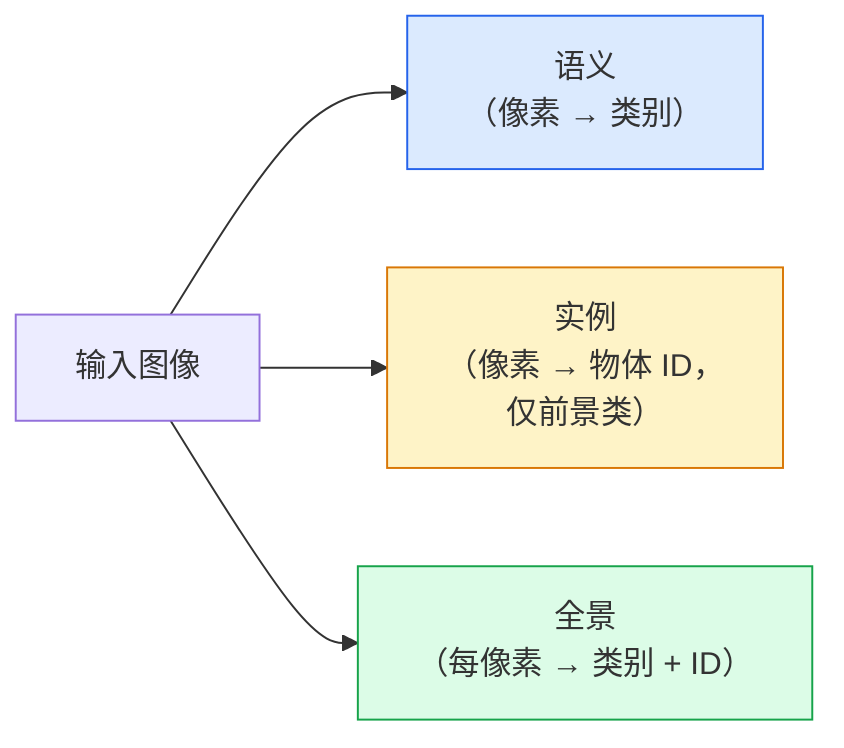
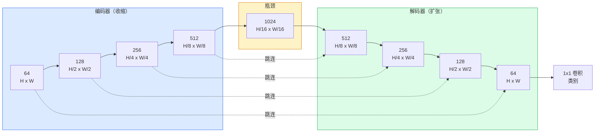

# 语义分割：U-Net

> 分割是对每个像素分类。U-Net 通过配对下采样编码器与上采样解码器，并在两者间连接跳跃连接来实现它。

**类型：** 构建  
**学习实现：** Python  
**前置课程：** Phase 4 第 03 课（CNN）、Phase 4 第 04 课（图像分类）  
**预计时间：** 约 75 分钟

## 学习目标

- 区分语义、实例和全景分割，并为给定问题选择正确任务。
- 在 PyTorch 中从零构建 U-Net：编码器模块、瓶颈、带转置卷积的解码器和跳跃连接。
- 实现逐像素交叉熵、Dice 损失，以及医学与工业分割当前默认的组合损失。
- 阅读逐类别 IoU 和 Dice 指标，诊断差分数来自小物体召回、边界准确性还是类别不平衡。

## 问题

分类每张图输出一个标签，检测每张图输出少量框，分割每个像素输出一个标签。对 `H x W` 输入，输出是形状 `H x W`（语义）或 `H x W x N_instances`（实例）的张量：每张图是数百万个预测，而不是一个。

分割的结构使其驱动几乎所有稠密预测视觉产品：医学影像（肿瘤掩码）、自动驾驶（道路、车道、障碍物）、卫星（建筑轮廓、作物边界）、文档解析（版面区域）、机器人（可抓取区域）。这些任务不能用一个框圈住物体解决，需要精确轮廓。

架构问题描述简单但不易解决：网络需同时看到图像全局上下文（这是什么场景）和局部像素细节（哪一个像素是道路而非人行道）。标准 CNN 通过空间压缩获得上下文，也丢弃细节；U-Net 同时取得两者。

## 概念

### 语义、实例与全景



- **语义**分割说“这个像素是道路，那个像素是汽车”；相邻两辆汽车合并为一个斑块。
- **实例**分割说“这个像素是汽车 #3，那个像素是汽车 #5”；忽略背景物质（stuff = 天空、道路、草地）。
- **全景**分割统一两者：每个像素有类别标签，每个实例有唯一 id，物质和物体都被分割。

本课讲语义；下一课 Mask R-CNN 讲实例。

### U-Net 形状



编码器四次将空间分辨率减半、通道翻倍；解码器反转：四次将空间分辨率翻倍、通道减半。每个分辨率处，跳跃连接将匹配的编码器特征与解码器特征拼接。最终 1x1 卷积在全分辨率将 `64 -> num_classes`。

跳跃连接必不可少：解码器尝试输出逐像素预测时，只看过小特征图；没有跳连，它不能精确定位边缘，因为信息在编码器中被压缩丢失。跳连把编码器下行时计算的高分辨率特征图交给它。

### 转置卷积还是双线性上采样

解码器必须扩展空间维度，有两种选项：

- **转置卷积**（`nn.ConvTranspose2d`）——可学习上采样，历史 U-Net 默认；步幅和核尺寸不能整除时会产生棋盘伪影。
- **双线性上采样 + 3x3 卷积**——先平滑上采样再卷积；伪影更少、参数更少，现为现代默认。

两者都广泛存在；第一个 U-Net 用双线性更安全。

### 像素网格上的交叉熵

C 类语义分割的模型输出为 `(N, C, H, W)`，目标为带整数类别 ID 的 `(N, H, W)`。交叉熵与分类完全相同，只是应用到每个空间位置：

```
Loss = mean over (n, h, w) of -log( softmax(logits[n, :, h, w])[target[n, h, w]] )
```

PyTorch 的 `F.cross_entropy` 原生处理这种形状，不需 reshape。

### Dice 损失及其必要性

交叉熵平等对待每个像素；一个类别支配画面时这不正确（医学影像：99% 背景、1% 肿瘤）。网络把所有像素预测为背景即可得 99% 准确率，却毫无用处。

Dice 损失直接优化预测掩码与真值掩码的重叠：

```
Dice(p, y) = 2 * sum(p * y) / (sum(p) + sum(y) + epsilon)
Dice_loss = 1 - Dice
```

其中 `p` 是某一类别的 sigmoid/softmax 概率图，`y` 是二值真值掩码。仅完全重叠时损失为零；因其基于比值，类别不平衡无关紧要。

实践中使用**组合损失**：

```
L = L_cross_entropy + lambda * L_dice       (lambda ~ 1)
```

交叉熵在训练初期提供稳定梯度，Dice 让训练后期聚焦真正匹配掩码形状。它是医学影像默认组合，对任何类别不平衡数据集都难以击败。

### 评估指标

- **像素准确率** —— 正确预测像素百分比，便宜；在不平衡数据上因与分类准确率相同的原因失效。
- **逐类别 IoU** —— 每个类别掩码的交并比，跨类别平均为 mIoU。
- **Dice（像素 F1）** —— 类似 IoU，`Dice = 2 * IoU / (1 + IoU)`；医学影像偏爱 Dice，驾驶社区偏爱 IoU，两者单调相关。
- **边界 F1** —— 度量预测边界与真值边界的接近程度，即使小位移也会惩罚；半导体检测等高精度任务重要。

报告逐类别 IoU，而不只 mIoU；平均 IoU 会掩盖一个类别为 15%、其他九类为 85% 的情况。

### 输入分辨率权衡

U-Net 编码器四次减半，输入须能被 16 整除。医学图像常为 512x512 或 1024x1024，自动驾驶裁剪为 2048x1024。U-Net 内存成本随 `H * W * C_max` 增长，在 1024x1024、1024 瓶颈通道时一次前向已需数 GB 显存。

两种标准变通方法：

1. 平铺输入——处理有重叠的 256x256 图块，再拼接。
2. 用膨胀卷积替换瓶颈，在保持更高空间分辨率时扩大感受野（DeepLab 家族）。

第一版模型中，256x256 输入、64 通道基底 U-Net 可在 8 GB VRAM 上轻松训练。

```figure
segmentation-flood
```

## 动手实现

### 步骤 1：编码器模块

两个 3x3 卷积、批归一化和 ReLU；第一个改变通道数，第二个保持它。

```python
import torch
import torch.nn as nn
import torch.nn.functional as F

class DoubleConv(nn.Module):
    def __init__(self, in_c, out_c):
        super().__init__()
        self.net = nn.Sequential(
            nn.Conv2d(in_c, out_c, kernel_size=3, padding=1, bias=False),
            nn.BatchNorm2d(out_c),
            nn.ReLU(inplace=True),
            nn.Conv2d(out_c, out_c, kernel_size=3, padding=1, bias=False),
            nn.BatchNorm2d(out_c),
            nn.ReLU(inplace=True),
        )

    def forward(self, x):
        return self.net(x)
```

该模块在各处复用；`bias=False` 因为 BN 的 beta 处理偏置。

### 步骤 2：下采样与上采样模块

```python
class Down(nn.Module):
    def __init__(self, in_c, out_c):
        super().__init__()
        self.net = nn.Sequential(
            nn.MaxPool2d(2),
            DoubleConv(in_c, out_c),
        )

    def forward(self, x):
        return self.net(x)


class Up(nn.Module):
    def __init__(self, in_c, out_c):
        super().__init__()
        self.up = nn.Upsample(scale_factor=2, mode="bilinear", align_corners=False)
        self.conv = DoubleConv(in_c, out_c)

    def forward(self, x, skip):
        x = self.up(x)
        if x.shape[-2:] != skip.shape[-2:]:
            x = F.interpolate(x, size=skip.shape[-2:], mode="bilinear", align_corners=False)
        x = torch.cat([skip, x], dim=1)
        return self.conv(x)
```

仅空间形状检查（`shape[-2:]`）处理不能被 16 整除的输入；安全的 `F.interpolate` 在拼接前对齐张量。比较完整形状会同时在通道数差异时触发，而那应是明显错误，不应被静默插值掩盖。

### 步骤 3：U-Net

```python
class UNet(nn.Module):
    def __init__(self, in_channels=3, num_classes=2, base=64):
        super().__init__()
        self.inc = DoubleConv(in_channels, base)
        self.d1 = Down(base, base * 2)
        self.d2 = Down(base * 2, base * 4)
        self.d3 = Down(base * 4, base * 8)
        self.d4 = Down(base * 8, base * 16)
        self.u1 = Up(base * 16 + base * 8, base * 8)
        self.u2 = Up(base * 8 + base * 4, base * 4)
        self.u3 = Up(base * 4 + base * 2, base * 2)
        self.u4 = Up(base * 2 + base, base)
        self.outc = nn.Conv2d(base, num_classes, kernel_size=1)

    def forward(self, x):
        x1 = self.inc(x)
        x2 = self.d1(x1)
        x3 = self.d2(x2)
        x4 = self.d3(x3)
        x5 = self.d4(x4)
        x = self.u1(x5, x4)
        x = self.u2(x, x3)
        x = self.u3(x, x2)
        x = self.u4(x, x1)
        return self.outc(x)

net = UNet(in_channels=3, num_classes=2, base=32)
x = torch.randn(1, 3, 256, 256)
print(f"output: {net(x).shape}")
print(f"params: {sum(p.numel() for p in net.parameters()):,}")
```

输出 `(1, 2, 256, 256)`：与输入相同空间尺寸、`num_classes` 通道。`base=32` 时约 770 万参数。

### 步骤 4：损失

```python
def dice_loss(logits, targets, num_classes, eps=1e-6):
    probs = F.softmax(logits, dim=1)
    targets_one_hot = F.one_hot(targets, num_classes).permute(0, 3, 1, 2).float()
    dims = (0, 2, 3)
    intersection = (probs * targets_one_hot).sum(dim=dims)
    denom = probs.sum(dim=dims) + targets_one_hot.sum(dim=dims)
    dice = (2 * intersection + eps) / (denom + eps)
    return 1 - dice.mean()


def combined_loss(logits, targets, num_classes, lam=1.0):
    ce = F.cross_entropy(logits, targets)
    dc = dice_loss(logits, targets, num_classes)
    return ce + lam * dc, {"ce": ce.item(), "dice": dc.item()}
```

Dice 按类别计算后平均（macro Dice）。`eps` 防止批次中缺失类别时除零。

### 步骤 5：IoU 指标

```python
@torch.no_grad()
def iou_per_class(logits, targets, num_classes):
    preds = logits.argmax(dim=1)
    ious = torch.zeros(num_classes)
    for c in range(num_classes):
        pred_c = (preds == c)
        true_c = (targets == c)
        inter = (pred_c & true_c).sum().float()
        union = (pred_c | true_c).sum().float()
        ious[c] = (inter / union) if union > 0 else torch.tensor(float("nan"))
    return ious
```

返回长度 C 的向量；`nan` 表示批次中不存在的类别，计算 mIoU 时不要对其平均。

### 步骤 6：端到端验证的合成数据集

生成彩色背景上的形状，使网络学习形状而非像素颜色。

```python
import numpy as np
from torch.utils.data import Dataset, DataLoader

def synthetic_segmentation(num_samples=200, size=64, seed=0):
    rng = np.random.default_rng(seed)
    images = np.zeros((num_samples, size, size, 3), dtype=np.float32)
    masks = np.zeros((num_samples, size, size), dtype=np.int64)
    for i in range(num_samples):
        bg = rng.uniform(0, 1, (3,))
        images[i] = bg
        masks[i] = 0
        num_shapes = rng.integers(1, 4)
        for _ in range(num_shapes):
            cls = int(rng.integers(1, 3))
            color = rng.uniform(0, 1, (3,))
            cx, cy = rng.integers(10, size - 10, size=2)
            r = int(rng.integers(4, 12))
            yy, xx = np.meshgrid(np.arange(size), np.arange(size), indexing="ij")
            if cls == 1:
                mask = (xx - cx) ** 2 + (yy - cy) ** 2 < r ** 2
            else:
                mask = (np.abs(xx - cx) < r) & (np.abs(yy - cy) < r)
            images[i][mask] = color
            masks[i][mask] = cls
        images[i] += rng.normal(0, 0.02, images[i].shape)
        images[i] = np.clip(images[i], 0, 1)
    return images, masks


class SegDataset(Dataset):
    def __init__(self, images, masks):
        self.images = images
        self.masks = masks

    def __len__(self):
        return len(self.images)

    def __getitem__(self, i):
        img = torch.from_numpy(self.images[i]).permute(2, 0, 1).float()
        mask = torch.from_numpy(self.masks[i]).long()
        return img, mask
```

三类：背景（0）、圆形（1）、方形（2）；网络必须学会区分形状。

### 步骤 7：训练循环

```python
def train_one_epoch(model, loader, optimizer, device, num_classes):
    model.train()
    loss_sum, total = 0.0, 0
    iou_sum = torch.zeros(num_classes)
    for x, y in loader:
        x, y = x.to(device), y.to(device)
        logits = model(x)
        loss, _ = combined_loss(logits, y, num_classes)
        optimizer.zero_grad()
        loss.backward()
        optimizer.step()
        loss_sum += loss.item() * x.size(0)
        total += x.size(0)
        iou_sum += iou_per_class(logits, y, num_classes).nan_to_num(0)
    return loss_sum / total, iou_sum / len(loader)
```

在合成数据上运行 10–30 个 epoch，观察形状类别的 mIoU 超过 0.9。注意 `nan_to_num(0)` 将批次中缺失类别视为零；为准确逐类别 IoU，应在评估时按是否出现做掩码，并跨批次用 `torch.nanmean`，而非在此平均。

## 使用现成工具

生产中，`segmentation_models_pytorch`（“smp”）以任意 torchvision 或 timm 骨干封装所有标准分割架构，三行即可：

```python
import segmentation_models_pytorch as smp

model = smp.Unet(
    encoder_name="resnet34",
    encoder_weights="imagenet",
    in_channels=3,
    classes=3,
)
```

实际工作还应了解：

- **DeepLabV3+** 以膨胀卷积替换最大池化式下采样，使瓶颈保留分辨率；卫星与驾驶数据边界更快。
- **SegFormer** 以分层 transformer 替换卷积编码器，是许多基准当前 SOTA。
- **Mask2Former** / **OneFormer** 在单一架构中统一语义、实例和全景分割。

三者都可在 `smp` 或 `transformers` 中以相同 data loader 直接替换。

## 交付产物

本课产出：

- `outputs/prompt-segmentation-task-picker.md` —— 为给定任务选择语义、实例或全景分割并命名架构的提示词。
- `outputs/skill-segmentation-mask-inspector.md` —— 报告类别分布、预测掩码统计量，以及预测不足或边界模糊类别的技能。

## 练习

1. **（简单）** 为二值分割（前景 vs 背景）实现 `bce_dice_loss`。在前景仅占 5% 像素的合成二类数据集上验证：组合损失比单独 BCE 收敛更快。
2. **（中等）** 用 `nn.ConvTranspose2d` 上采样模块替换 `nn.Upsample + conv`；在合成数据上训练两者并比较 mIoU，观察转置卷积版本中棋盘伪影出现的位置。
3. **（困难）** 使用真实分割数据集（Oxford-IIIT Pets、Cityscapes mini split 或医学子集），将 U-Net 训练至距 `smp.Unet` 参考 2 个 IoU 点以内；报告逐类别 IoU，并指出哪些类别从损失中加入 Dice 获益最多。

## 关键术语

| 术语 | 常见说法 | 实际含义 |
|------|----------|----------|
| 语义分割（Semantic segmentation） | “给每个像素加标签” | 每像素分类到 C 类；同类实例合并 |
| 实例分割（Instance segmentation） | “给每个物体加标签” | 分开同一类不同实例；仅处理前景 |
| 全景分割（Panoptic segmentation） | “语义 + 实例” | 每像素有类别；每个 thing 实例也有唯一 id |
| 跳跃连接（Skip connection） | “U-Net 桥” | 将编码器特征拼接进匹配分辨率的解码器特征，保留高频细节 |
| 转置卷积（Transposed conv） | “反卷积” | 可学习上采样，可能产生棋盘伪影 |
| Dice 损失（Dice loss） | “重叠损失” | `1 - 2|A ∩ B| / (|A| + |B|)`；直接优化掩码重叠，对类别不平衡鲁棒 |
| mIoU | “平均交并比” | 跨类别平均的 IoU，分割的社区标准指标 |
| 边界 F1（Boundary F1） | “边界准确率” | 仅在边界像素计算的 F1，对精度关键任务重要 |

## 延伸阅读

- [U-Net: Convolutional Networks for Biomedical Image Segmentation (Ronneberger et al., 2015)](https://arxiv.org/abs/1505.04597) —— 原始论文，人人复用的图在第 2 页。
- [Fully Convolutional Networks (Long et al., 2015)](https://arxiv.org/abs/1411.4038) —— 首次将分割变为端到端卷积问题的论文。
- [segmentation_models_pytorch](https://github.com/qubvel/segmentation_models.pytorch) —— 生产分割参考：全部标准架构和损失。
- [Lessons learned from training SOTA segmentation (kaggle.com competitions)](https://www.kaggle.com/code/iafoss/carvana-unet-pytorch) —— 讲解 TTA、伪标签和类别权重为何在真实数据上重要。
