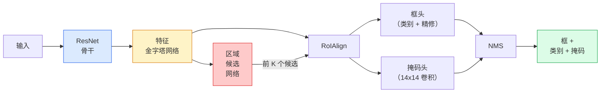

# 实例分割：Mask R-CNN

> 在 Faster R-CNN 检测器上添加一条很小的掩码分支，就得到实例分割。困难部分是 RoIAlign，而且它比看起来更难。

**类型：** 构建 + 学习  
**学习实现：** Python  
**前置课程：** Phase 4 第 06 课（YOLO）、Phase 4 第 07 课（U-Net）  
**预计时间：** 约 75 分钟

## 学习目标

- 端到端追踪 Mask R-CNN 架构：骨干、FPN、RPN、RoIAlign、框头和掩码头。
- 从零实现 RoIAlign，并解释为何不再使用 RoIPool。
- 使用 torchvision 预训练 `maskrcnn_resnet50_fpn_v2` 获得生产质量实例掩码，并正确读取其输出格式。
- 通过替换框头和掩码头、冻结骨干，在小型自定义数据集上微调 Mask R-CNN。

## 问题

语义分割每类别给出一张掩码；实例分割即使两个物体属于同一类别，也为每个物体给出一张掩码。个体计数、跨帧追踪和测量事物（墙中每块砖、显微图中每个细胞的边界框）都需要实例分割。

Mask R-CNN（He 等，2017）通过将实例分割重新表述为“检测加一张掩码”解决问题。设计如此干净，以至于后续五年几乎每篇实例分割论文都是 Mask R-CNN 变体；torchvision 实现仍是小到中型数据集的生产默认。

困难的工程问题是采样：怎样从一个角点不与像素边界对齐的候选框中裁出固定尺寸特征区域？处理错误会在各处损失零点几 mAP；RoIAlign 是答案。

## 概念

### 架构



需理解五部分：

1. **骨干（Backbone）**——在 ImageNet 上训练的 ResNet-50 或 ResNet-101，产生步幅 4、8、16、32 的特征图层级。
2. **FPN（Feature Pyramid Network）**——自顶向下加横向连接，使每层有 C 通道、语义丰富的特征；检测在匹配物体尺寸的 FPN 层查询。
3. **RPN（Region Proposal Network）**——一个小卷积头，在每个锚框位置预测“这里有物体吗？”和“怎样精修框？”，每图产生约 1,000 个候选。
4. **RoIAlign**——从任意 FPN 层的任意框中采样固定尺寸（如 7x7）特征图块；双线性采样，无量化。
5. **头部（Heads）**——两层框头精修框并选择类别，加一个小卷积头为每个候选输出 `28x28` 二值掩码。

### 为什么是 RoIAlign，而不是 RoIPool

原 Fast R-CNN 使用 RoIPool：将候选框划为网格，取每单元最大特征，并将所有坐标取整。这种取整使特征图和输入像素坐标最多错位一个完整特征图像素——在 224x224 图上很小，特征图步幅为 32 时却是灾难。

```
RoIPool：
  框 (34.7, 51.3, 98.2, 142.9)
  取整 -> (34, 51, 98, 142)
  划分网格 -> 每个单元边界取整
  错位在每步累积

RoIAlign：
  框 (34.7, 51.3, 98.2, 142.9)
  用双线性插值在精确浮点坐标采样
  任意位置都不取整
```

RoIAlign 可免费将 COCO mask AP 提高 3–4 点。现在所有在意定位的检测器均使用它，包括 YOLOv7 seg、RT-DETR、Mask2Former。

### 一段话理解 RPN

在特征图每个位置放置 K 个不同尺寸、形状的锚框；对每锚框预测目标性分数和使锚框更贴合的回归偏移；按分数保留约前 1,000 个框，在 IoU 0.7 应用 NMS，将保留项交给头部。RPN 有自己的迷你损失，结构与第 6 课 YOLO 损失相同，只是类别为两种（物体/非物体）。

### 掩码头

对每个候选（RoIAlign 后），掩码头是微型 FCN：四个 3x3 卷积、一个 2x deconv、一个最终 1x1 卷积，为每个候选在 `28x28` 分辨率输出 `num_classes` 个通道。只保留预测类别对应通道，其余忽略；这使掩码预测与分类解耦。

将 28x28 掩码上采样到候选框原始像素尺寸，得到最终二值掩码。

### 损失

Mask R-CNN 将四种损失相加：

```
L = L_rpn_cls + L_rpn_box + L_box_cls + L_box_reg + L_mask
```

- `L_rpn_cls`、`L_rpn_box`——RPN 候选的目标性与框回归。
- `L_box_cls`——头部分类器中含背景的 `(C+1)` 类交叉熵。
- `L_box_reg`——头部框精修的 smooth L1。
- `L_mask`——28x28 掩码输出上的逐像素二值交叉熵。

每种损失有自己的默认权重；torchvision 实现将它们公开为构造函数参数。

### 输出格式

`torchvision.models.detection.maskrcnn_resnet50_fpn_v2` 返回每图一个字典构成的列表：

```
{
    "boxes":  (N, 4)，以 (x1, y1, x2, y2) 像素坐标表示，
    "labels": (N,) 类别 ID，0 = 背景，因此索引从 1 开始，
    "scores": (N,) 置信度分数，
    "masks":  (N, 1, H, W)，[0, 1] 浮点掩码——二值掩码阈值取 0.5，
}
```

掩码已经是完整图像分辨率，28x28 头输出已在内部上采样。

```figure
cv3-roialign-sampling
```

## 动手实现

### 步骤 1：从零实现 RoIAlign

Mask R-CNN 中唯一更适合用代码而非文字理解的组件。

```python
import torch
import torch.nn.functional as F

def roi_align_single(feature, box, output_size=7, spatial_scale=1 / 16.0):
    """
    feature: (C, H, W) single-image feature map
    box: (x1, y1, x2, y2) in original image pixel coordinates
    output_size: side of the output grid (7 for box head, 14 for mask head)
    spatial_scale: reciprocal of the feature map stride
    """
    C, H, W = feature.shape
    x1, y1, x2, y2 = [c * spatial_scale - 0.5 for c in box]
    bin_w = (x2 - x1) / output_size
    bin_h = (y2 - y1) / output_size

    grid_y = torch.linspace(y1 + bin_h / 2, y2 - bin_h / 2, output_size)
    grid_x = torch.linspace(x1 + bin_w / 2, x2 - bin_w / 2, output_size)
    yy, xx = torch.meshgrid(grid_y, grid_x, indexing="ij")

    gx = 2 * (xx + 0.5) / W - 1
    gy = 2 * (yy + 0.5) / H - 1
    grid = torch.stack([gx, gy], dim=-1).unsqueeze(0)
    sampled = F.grid_sample(feature.unsqueeze(0), grid, mode="bilinear",
                            align_corners=False)
    return sampled.squeeze(0)
```

每个数位于双线性采样位置：不取整、不量化、不丢梯度。

### 步骤 2：与 torchvision 的 RoIAlign 比较

```python
from torchvision.ops import roi_align

feature = torch.randn(1, 16, 50, 50)
boxes = torch.tensor([[0, 10, 20, 100, 90]], dtype=torch.float32)  # (batch_idx, x1, y1, x2, y2)

ours = roi_align_single(feature[0], boxes[0, 1:].tolist(), output_size=7, spatial_scale=1/4)
theirs = roi_align(feature, boxes, output_size=(7, 7), spatial_scale=1/4, sampling_ratio=1, aligned=True)[0]

print(f"shape ours:   {tuple(ours.shape)}")
print(f"shape theirs: {tuple(theirs.shape)}")
print(f"max|diff|:    {(ours - theirs).abs().max().item():.3e}")
```

在 `sampling_ratio=1` 和 `aligned=True` 下，两者在 `1e-5` 以内匹配。

### 步骤 3：加载预训练 Mask R-CNN

```python
import torch
from torchvision.models.detection import maskrcnn_resnet50_fpn_v2, MaskRCNN_ResNet50_FPN_V2_Weights

model = maskrcnn_resnet50_fpn_v2(weights=MaskRCNN_ResNet50_FPN_V2_Weights.DEFAULT)
model.eval()
print(f"params: {sum(p.numel() for p in model.parameters()):,}")
print(f"classes (including background): {len(model.roi_heads.box_predictor.cls_score.out_features * [0])}")
```

4,600 万参数、91 类（COCO）；第一个类（id 0）是背景，真正被检测的类别从 id 1 开始。

### 步骤 4：运行推理

```python
with torch.no_grad():
    x = torch.randn(3, 400, 600)
    predictions = model([x])
p = predictions[0]
print(f"boxes:  {tuple(p['boxes'].shape)}")
print(f"labels: {tuple(p['labels'].shape)}")
print(f"scores: {tuple(p['scores'].shape)}")
print(f"masks:  {tuple(p['masks'].shape)}")
```

掩码张量形状为 `(N, 1, H, W)`；在 0.5 阈值处得到每物体二值掩码：

```python
binary_masks = (p['masks'] > 0.5).squeeze(1)  # (N, H, W) boolean
```

### 步骤 5：为自定义类别数替换头部

常见微调配方：复用骨干、FPN、RPN，替换两个分类器头。

```python
from torchvision.models.detection.faster_rcnn import FastRCNNPredictor
from torchvision.models.detection.mask_rcnn import MaskRCNNPredictor

def build_custom_maskrcnn(num_classes):
    model = maskrcnn_resnet50_fpn_v2(weights=MaskRCNN_ResNet50_FPN_V2_Weights.DEFAULT)
    in_features = model.roi_heads.box_predictor.cls_score.in_features
    model.roi_heads.box_predictor = FastRCNNPredictor(in_features, num_classes)
    in_features_mask = model.roi_heads.mask_predictor.conv5_mask.in_channels
    hidden_layer = 256
    model.roi_heads.mask_predictor = MaskRCNNPredictor(in_features_mask, hidden_layer, num_classes)
    return model

custom = build_custom_maskrcnn(num_classes=5)
print(f"custom cls_score.out_features: {custom.roi_heads.box_predictor.cls_score.out_features}")
```

`num_classes` 必须包含背景类，因此 4 个物体类的数据集使用 `num_classes=5`。

### 步骤 6：冻结无需训练的部分

小数据集上冻结骨干与 FPN，只学习 RPN 目标性/回归和两个头部。

```python
def freeze_backbone_and_fpn(model):
    # torchvision Mask R-CNN packs the FPN inside `model.backbone` (as
    # `model.backbone.fpn`), so iterating `model.backbone.parameters()` covers
    # both the ResNet feature layers and the FPN lateral/output convs.
    for p in model.backbone.parameters():
        p.requires_grad = False
    return model

custom = freeze_backbone_and_fpn(custom)
trainable = sum(p.numel() for p in custom.parameters() if p.requires_grad)
print(f"trainable after freeze: {trainable:,}")
```

对 500 张图像的数据集，这决定收敛还是过拟合。

## 使用现成工具

torchvision 中 Mask R-CNN 的完整训练循环仅 40 行，任务之间没有实质变化：替换数据集即可。

```python
def train_step(model, images, targets, optimizer):
    model.train()
    loss_dict = model(images, targets)
    losses = sum(loss for loss in loss_dict.values())
    optimizer.zero_grad()
    losses.backward()
    optimizer.step()
    return {k: v.item() for k, v in loss_dict.items()}
```

`targets` 列表需有逐图字典，其中包含 `boxes`、`labels`、`masks`（形状 `(num_instances, H, W)` 的二值张量）。模型训练时返回四种损失字典，评估时返回预测列表，依据 `model.training` 切换。

`pycocotools` 评估器对框和掩码都产生 mAP@IoU=0.5:0.95；要知道框头还是掩码头是瓶颈，必须同时看两个数。

## 交付产物

本课产出：

- `outputs/prompt-instance-vs-semantic-router.md` —— 提问三个问题，选择实例、语义或全景分割以及准确起始模型的提示词。
- `outputs/skill-mask-rcnn-head-swapper.md` —— 给定新 `num_classes`，为任意 torchvision 检测模型生成 10 行头部替换代码的技能。

## 练习

1. **（简单）** 在 100 个随机框上用 `torchvision.ops.roi_align` 验证你的 RoIAlign，报告最大绝对差；再运行 RoIPool（2017 前行为），展示它在边缘附近框上会偏离约 1–2 个特征图像素。
2. **（中等）** 在 50 图自定义数据集（任意两类：气球、鱼、坑洞、logo）上微调 `maskrcnn_resnet50_fpn_v2`；冻结骨干、训练 20 个 epoch，报告 mask AP@0.5。
3. **（困难）** 将 Mask R-CNN 掩码头替换为预测 56x56 而非 28x28 的版本；测量 mAP@IoU=0.75 前后变化，解释增益（或无增益）为何符合预期边界精度/内存权衡。

## 关键术语

| 术语 | 常见说法 | 实际含义 |
|------|----------|----------|
| Mask R-CNN | “检测加掩码” | Faster R-CNN 加一个小 FCN 头，为每个候选、每类预测 28x28 掩码 |
| FPN | “特征金字塔” | 自顶向下加横向连接，使每个步幅层有 C 通道、语义丰富的特征 |
| RPN | “区域提议器” | 为每图产生约 1,000 个物体/无物体候选的小卷积头 |
| RoIAlign | “不取整裁剪” | 从任意浮点坐标框双线性采样固定尺寸特征网格 |
| RoIPool | “2017 前裁剪” | 目的同 RoIAlign，但将框坐标取整；已过时 |
| Mask AP | “实例 mAP” | 以掩码 IoU 而非框 IoU 计算的平均精确率；COCO 实例分割指标 |
| 二值掩码头（Binary mask head） | “逐类别掩码” | 每个候选为每类预测一张二值掩码；只保留预测类别通道 |
| 背景类（Background class） | “类别 0” | 汇集“无物体”的类；真实类别索引从 1 起 |

## 延伸阅读

- [Mask R-CNN (He et al., 2017)](https://arxiv.org/abs/1703.06870) —— 论文；第 3 节 RoIAlign 是关键阅读。
- [FPN: Feature Pyramid Networks (Lin et al., 2017)](https://arxiv.org/abs/1612.03144) —— FPN 论文，每个现代检测器都在使用。
- [torchvision Mask R-CNN tutorial](https://pytorch.org/tutorials/intermediate/torchvision_tutorial.html) —— 微调循环参考。
- [Detectron2 model zoo](https://github.com/facebookresearch/detectron2/blob/main/MODEL_ZOO.md) —— 几乎每种检测、分割变体的生产实现与训练权重。
