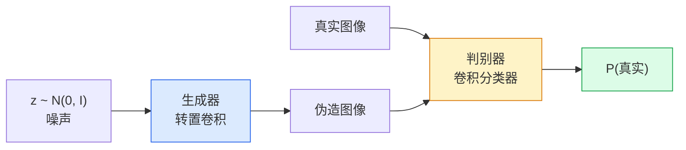
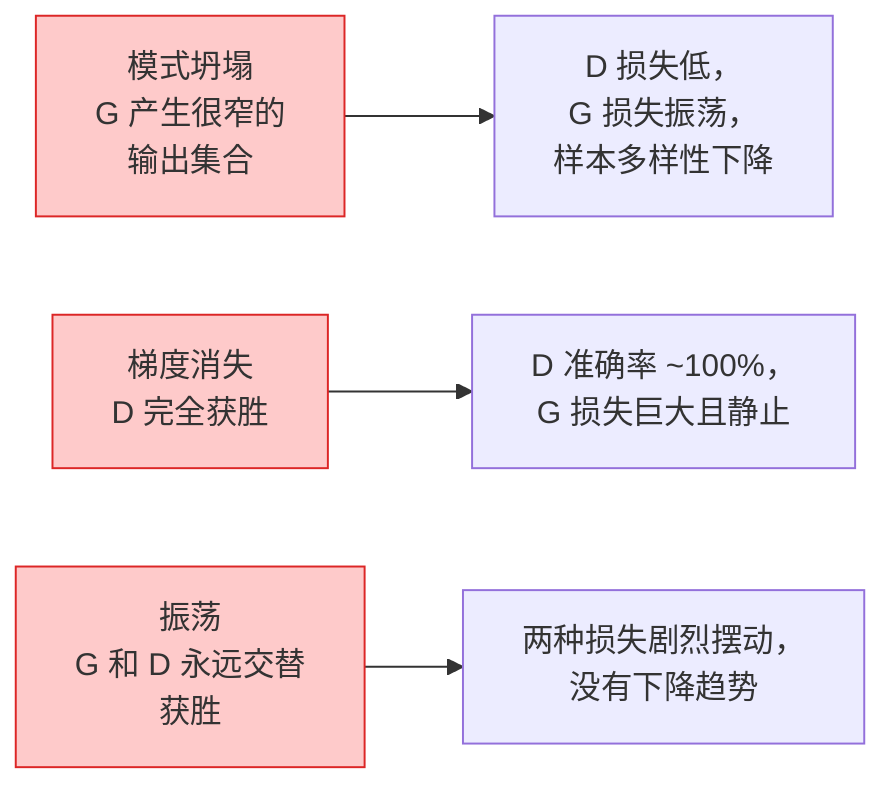

# 图像生成：GAN

> GAN 是固定博弈中的两个神经网络：一个绘制，一个批评；二者共同进步，直至绘制结果骗过批评者。

**类型：** 构建  
**学习实现：** Python  
**前置课程：** Phase 4 第 03 课（CNN）、Phase 3 第 06 课（优化器）、Phase 3 第 07 课（正则化）  
**预计时间：** 约 75 分钟

## 学习目标

- 解释生成器与判别器的极小极大博弈，以及为何均衡对应 `p_model = p_data`。
- 用 PyTorch 实现 DCGAN，并在不足 60 行中生成连贯的 32x32 合成图像。
- 用三种标准技巧稳定 GAN 训练：非饱和损失、谱归一化、TTUR（双时间尺度更新规则）。
- 阅读可区分健康收敛、模式坍塌、振荡与判别器完全获胜的训练曲线。

## 问题

分类教网络将图像映射为标签；生成反转问题：采样看起来来自同一分布的新图像。没有可用于 diff 的“正确”输出，只有想模仿的分布。

标准损失（MSE、交叉熵）无法衡量“此样本是否来自真实分布”。最小化逐像素误差会产生模糊平均，而非真实样本。突破在于学习损失：训练第二个网络区分真实与伪造，并用它的判断推动生成器。

GAN（Goodfellow 等，2014）定义了这一框架。到 2018 年，StyleGAN 已生成与照片难分的 1024x1024 人脸。扩散模型后来在质量与可控性上登顶，但让扩散实用的每种技巧——归一化选择、潜空间、特征损失——都首先在 GAN 上得到理解。

## 概念

### 两个网络



**生成器** G 接收噪声向量 `z`，输出图像；**判别器** D 接收图像，输出单个标量：该图像为真的概率。

### 博弈

G 想让 D 出错，D 想判断正确。形式化为：

```
min_G max_D  E_x[log D(x)] + E_z[log(1 - D(G(z)))]
```

从右向左理解：D 最大化真实（`log D(real)`）和伪造（`log (1 - D(fake))`）图像的准确率；G 最小化 D 对伪造图的准确率——它想让 `D(G(z))` 变高。

Goodfellow 证明该极小极大问题有全局均衡：`p_G = p_data`，D 在各处输出 0.5，生成与真实分布的 Jensen-Shannon 散度为零；难的是到达那里。

### 非饱和损失

上式数值不稳定。训练早期，对每张伪图 `D(G(z))` 近零，因此相对 G 的 `log(1 - D(G(z)))` 梯度消失。修复方式是翻转 G 的损失：

```
L_D = -E_x[log D(x)] - E_z[log(1 - D(G(z)))]
L_G = -E_z[log D(G(z))]                          # 非饱和
```

现在 `D(G(z))` 近零时，G 损失很大且梯度有信息；所有现代 GAN 都训练此变体。

### DCGAN 架构规则

Radford、Metz、Chintala（2015）将多年失败实验提炼为五条稳定 GAN 训练的规则：

1. 用带步幅卷积替代池化（两个网络）。
2. 在生成器和判别器使用 batch norm，G 输出及 D 输入除外。
3. 在更深架构中去掉全连接层。
4. G 除输出层外使用 ReLU，输出用 tanh 映射到 `[-1, 1]`。
5. D 所有层使用 LeakyReLU（`negative_slope=0.2`）。

每个现代卷积 GAN（StyleGAN、BigGAN、GigaGAN）仍从这些规则出发，再逐一替换部件。

### 失败模式及其信号



- **模式坍塌**：G 找到一张能骗过 D 的图，只产生它。修复：加入 minibatch discrimination、谱归一化或标签条件化。
- **判别器获胜**：D 过快变强，G 梯度消失。修复：更小的 D、更低 D 学习率，或对真实标签使用标签平滑。
- **振荡**：两网交替获胜却不接近均衡。修复：TTUR（D 学得比 G 快 2–4 倍），或换 Wasserstein 损失。

### 评估

GAN 没有真值，如何知道是否有效？

- **样本检查** —— 每个 epoch 末看 64 个样本；不可协商。
- **FID（Fréchet Inception Distance）** —— 真实与生成集合的 Inception-v3 特征分布距离，越低越好，社区标准。
- **Inception Score** —— 更早、更脆弱；优先 FID。
- **生成模型 Precision/Recall** —— 分别度量质量（precision）和覆盖度（recall），比 FID 单独更有信息。

小型合成数据运行中，样本检查已足够。

```figure
cv-gan-image
```

## 动手实现

### 步骤 1：生成器

一个小型 DCGAN 生成器，接收 64 维噪声、生成 32x32 图像。

```python
import torch
import torch.nn as nn

class Generator(nn.Module):
    def __init__(self, z_dim=64, img_channels=3, feat=64):
        super().__init__()
        self.net = nn.Sequential(
            nn.ConvTranspose2d(z_dim, feat * 4, kernel_size=4, stride=1, padding=0, bias=False),
            nn.BatchNorm2d(feat * 4),
            nn.ReLU(inplace=True),
            nn.ConvTranspose2d(feat * 4, feat * 2, kernel_size=4, stride=2, padding=1, bias=False),
            nn.BatchNorm2d(feat * 2),
            nn.ReLU(inplace=True),
            nn.ConvTranspose2d(feat * 2, feat, kernel_size=4, stride=2, padding=1, bias=False),
            nn.BatchNorm2d(feat),
            nn.ReLU(inplace=True),
            nn.ConvTranspose2d(feat, img_channels, kernel_size=4, stride=2, padding=1, bias=False),
            nn.Tanh(),
        )

    def forward(self, z):
        return self.net(z.view(z.size(0), -1, 1, 1))
```

四个转置卷积，每个用 `kernel_size=4, stride=2, padding=1` 干净地将空间尺寸翻倍；输出经 tanh 位于 `[-1, 1]`。

### 步骤 2：判别器

生成器的镜像：LeakyReLU、带步幅卷积，最后为标量 logit。

```python
class Discriminator(nn.Module):
    def __init__(self, img_channels=3, feat=64):
        super().__init__()
        self.net = nn.Sequential(
            nn.Conv2d(img_channels, feat, kernel_size=4, stride=2, padding=1),
            nn.LeakyReLU(0.2, inplace=True),
            nn.Conv2d(feat, feat * 2, kernel_size=4, stride=2, padding=1, bias=False),
            nn.BatchNorm2d(feat * 2),
            nn.LeakyReLU(0.2, inplace=True),
            nn.Conv2d(feat * 2, feat * 4, kernel_size=4, stride=2, padding=1, bias=False),
            nn.BatchNorm2d(feat * 4),
            nn.LeakyReLU(0.2, inplace=True),
            nn.Conv2d(feat * 4, 1, kernel_size=4, stride=1, padding=0),
        )

    def forward(self, x):
        return self.net(x).view(-1)
```

最后卷积将 `4x4` 特征图降为 `1x1`，每图输出单标量；只在计算损失时应用 sigmoid。

### 步骤 3：训练步骤

交替进行：每批更新 D 一次，再更新 G 一次。

```python
import torch.nn.functional as F

def train_step(G, D, real, z, opt_g, opt_d, device):
    real = real.to(device)
    bs = real.size(0)

    # D step
    opt_d.zero_grad()
    d_real = D(real)
    d_fake = D(G(z).detach())
    loss_d = (F.binary_cross_entropy_with_logits(d_real, torch.ones_like(d_real))
              + F.binary_cross_entropy_with_logits(d_fake, torch.zeros_like(d_fake)))
    loss_d.backward()
    opt_d.step()

    # G step
    opt_g.zero_grad()
    d_fake = D(G(z))
    loss_g = F.binary_cross_entropy_with_logits(d_fake, torch.ones_like(d_fake))
    loss_g.backward()
    opt_g.step()

    return loss_d.item(), loss_g.item()
```

D 步骤中必须调用 `G(z).detach()`：更新 D 时不能让梯度流入 G；遗漏它是经典新手 bug。

### 步骤 4：合成形状上的完整训练循环

```python
from torch.utils.data import DataLoader, TensorDataset
import numpy as np

def synthetic_images(num=2000, size=32, seed=0):
    rng = np.random.default_rng(seed)
    imgs = np.zeros((num, 3, size, size), dtype=np.float32) - 1.0
    for i in range(num):
        r = rng.uniform(6, 12)
        cx, cy = rng.uniform(r, size - r, size=2)
        yy, xx = np.meshgrid(np.arange(size), np.arange(size), indexing="ij")
        mask = (xx - cx) ** 2 + (yy - cy) ** 2 < r ** 2
        color = rng.uniform(-0.5, 1.0, size=3)
        for c in range(3):
            imgs[i, c][mask] = color[c]
    return torch.from_numpy(imgs)

device = "cuda" if torch.cuda.is_available() else "cpu"
data = synthetic_images()
loader = DataLoader(TensorDataset(data), batch_size=64, shuffle=True)

G = Generator(z_dim=64, img_channels=3, feat=32).to(device)
D = Discriminator(img_channels=3, feat=32).to(device)
opt_g = torch.optim.Adam(G.parameters(), lr=2e-4, betas=(0.5, 0.999))
opt_d = torch.optim.Adam(D.parameters(), lr=2e-4, betas=(0.5, 0.999))

for epoch in range(10):
    for (batch,) in loader:
        z = torch.randn(batch.size(0), 64, device=device)
        ld, lg = train_step(G, D, batch, z, opt_g, opt_d, device)
    print(f"epoch {epoch}  D {ld:.3f}  G {lg:.3f}")
```

`Adam(lr=2e-4, betas=(0.5, 0.999))` 是 DCGAN 默认设置；较低 beta1 防止动量项过度稳定对抗博弈。

### 步骤 5：采样

```python
@torch.no_grad()
def sample(G, n=16, z_dim=64, device="cpu"):
    G.eval()
    z = torch.randn(n, z_dim, device=device)
    imgs = G(z)
    imgs = (imgs + 1) / 2
    return imgs.clamp(0, 1)
```

采样前总是切到 eval 模式。对 DCGAN 而言这很重要，因为会使用 batch norm 的运行统计量而非该批次统计量。

### 步骤 6：谱归一化

它是判别器中 BN 的直接替代，保证网络为 1-Lipschitz，可修复多数“D 获胜太猛烈”的失败。

```python
from torch.nn.utils import spectral_norm

def build_sn_discriminator(img_channels=3, feat=64):
    return nn.Sequential(
        spectral_norm(nn.Conv2d(img_channels, feat, 4, 2, 1)),
        nn.LeakyReLU(0.2, inplace=True),
        spectral_norm(nn.Conv2d(feat, feat * 2, 4, 2, 1)),
        nn.LeakyReLU(0.2, inplace=True),
        spectral_norm(nn.Conv2d(feat * 2, feat * 4, 4, 2, 1)),
        nn.LeakyReLU(0.2, inplace=True),
        spectral_norm(nn.Conv2d(feat * 4, 1, 4, 1, 0)),
    )
```

将 `Discriminator` 换为 `build_sn_discriminator()` 后，通常不再需要 TTUR 技巧。谱归一化是最容易应用的单项鲁棒性升级。

## 使用现成工具

严肃生成任务应使用预训练权重或改用扩散模型；两种标准库：

- `torch_fidelity` 无需自写评估代码即可为生成器计算 FID / IS。
- `pytorch-gan-zoo`（旧版）和 `StudioGAN` 提供经过测试的 DCGAN、WGAN-GP、SN-GAN、StyleGAN、BigGAN 实现。

2026 年 GAN 仍最适合：实时图像生成（延迟 <10 ms）、风格迁移、精确控制的图像到图像转换（Pix2Pix、CycleGAN）。扩散在照片真实感和文本条件化上胜出。

## 交付产物

本课产出：

- `outputs/prompt-gan-training-triage.md` —— 读取训练曲线描述、选择失败模式（模式坍塌、D 获胜、振荡）及单一推荐修复的提示词。
- `outputs/skill-dcgan-scaffold.md` —— 根据 `z_dim`、目标 `image_size`、`num_channels` 编写 DCGAN 脚手架（含训练循环和样本保存器）的技能。

## 练习

1. **（简单）** 在上面的合成圆形数据集训练 DCGAN，每个 epoch 末保存含 16 个样本的网格；从第几个 epoch 起，生成圆明显成为圆形？
2. **（中等）** 用谱归一化替换判别器 batch norm，两个版本并列训练；哪个收敛更快？跨三个随机种子哪个方差更低？
3. **（困难）** 实现条件 DCGAN：将类别标签同时输入 G 和 D（G 中 one-hot 拼接到噪声，D 中拼接类别嵌入通道）。在第 7 课的合成“圆形 vs 方形”数据集上训练，通过以特定标签采样展示类别条件化生效。

## 关键术语

| 术语 | 常见说法 | 实际含义 |
|------|----------|----------|
| 生成器（Generator，G） | “画东西的网络” | 将噪声映射为图像，训练目标是骗过判别器 |
| 判别器（Discriminator，D） | “批评者” | 二值分类器，训练以区分真实与生成图像 |
| 极小极大（Minimax） | “博弈” | 对 G 极小、对 D 极大的对抗损失；均衡为 `p_G = p_data` |
| 非饱和损失（Non-saturating loss） | “数值合理版本” | G 损失为 `-log(D(G(z)))`，而非 `log(1 - D(G(z)))`，以避免训练早期梯度消失 |
| 模式坍塌（Mode collapse） | “生成器只造一种东西” | G 只产生数据分布小子集；用 SN、minibatch discrimination 或更大 batch 修复 |
| TTUR | “两种学习率” | D 学得比 G 快，通常 2–4 倍；稳定训练 |
| 谱归一化（Spectral norm） | “1-Lipschitz 层” | 约束每层 Lipschitz 常数的权重归一化，阻止 D 变得任意陡峭 |
| FID | “Fréchet Inception Distance” | 真实与生成集合 Inception-v3 特征分布距离，标准评估指标 |

## 延伸阅读

- [Generative Adversarial Networks (Goodfellow et al., 2014)](https://arxiv.org/abs/1406.2661) —— 提出 GAN 的原始论文。
- [DCGAN (Radford, Metz, Chintala, 2015)](https://arxiv.org/abs/1511.06434) —— 使 GAN 可训练的架构规则。
- [Spectral Normalization for GANs (Miyato et al., 2018)](https://arxiv.org/abs/1802.05957) —— 最有用的单项稳定技巧。
- [StyleGAN3 (Karras et al., 2021)](https://arxiv.org/abs/2106.12423) —— SOTA GAN，如同过去十年所有技巧的精选集。
