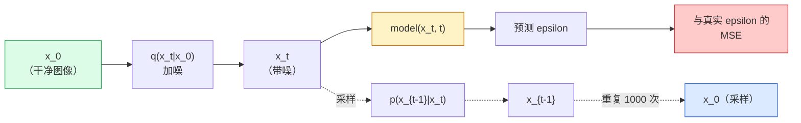

# 图像生成：扩散模型

> 扩散模型学习去噪：训练它从噪声图中移除一点噪声，将过程反向重复一千次，就得到图像生成器。

**类型：** 构建  
**学习实现：** Python  
**前置课程：** Phase 4 第 07 课（U-Net）、Phase 1 第 06 课（概率）、Phase 3 第 06 课（优化器）  
**预计时间：** 约 75 分钟

## 学习目标

- 推导前向加噪过程 `x_0 -> x_1 -> ... -> x_T`，并解释闭式 `q(x_t | x_0)` 为何对任意 t 成立。
- 实现回归每一步所加噪声的 DDPM 风格训练目标，以及从纯噪声回到图像的采样器。
- 构建时间条件 U-Net（小到可在 CPU 训练），预测任意时间步的噪声。
- 解释 DDPM 与 DDIM 采样差异及各自适用情形（第 23 课会深入流匹配和整流流）。

## 问题

GAN 一次生成：噪声输入、图像输出、一次前向；快且难训练。扩散迭代生成：从纯噪声开始，逐小步去噪，图像逐渐显现；慢且易训练。过去五年后者占优：小团队也能训练扩散模型并得到合理样本，GAN 训练则是经多年失败运行学得的手艺。

除稳定训练外，扩散的迭代结构解锁现代图像生成的一切：文本条件、修补、编辑、超分、可控风格。采样循环每一步都是注入新约束的位置；这正是 Stable Diffusion、Imagen、DALL-E 3、Midjourney 和每个可控图像模型都基于扩散的原因。

本课构建最小 DDPM：前向加噪、反向去噪、训练循环。下一课 Stable Diffusion 将它连接到带 VAE、文本编码器和无分类器引导的生产系统。

## 概念

### 前向过程

取图像 `x_0`，加入少量高斯噪声得 `x_1`，再加少量得 `x_2`，持续 T 步，直到 `x_T` 几乎无法与纯高斯噪声区分。

```
q(x_t | x_{t-1}) = N(x_t; sqrt(1 - beta_t) * x_{t-1},  beta_t * I)
```

`beta_t` 是小方差调度，典型为 T=1000 步上从 0.0001 线性到 0.02。每步略缩小信号并注入新噪声。

### 闭式跳转

逐步加噪是马尔可夫链，但数学可折叠：可从 `x_0` 一步直接采样 `x_t`。

```
定义 alpha_t = 1 - beta_t
定义 alpha_bar_t = prod_{s=1..t} alpha_s

则：
  q(x_t | x_0) = N(x_t; sqrt(alpha_bar_t) * x_0,  (1 - alpha_bar_t) * I)

等价地：
  x_t = sqrt(alpha_bar_t) * x_0 + sqrt(1 - alpha_bar_t) * epsilon
  其中 epsilon ~ N(0, I)
```

这个方程使扩散实用：训练中随机选 `t`，从 `x_0` 直接采样 `x_t`，一步训练，无需模拟完整马尔可夫链。

### 反向过程

前向过程固定，网络学习反向 `p(x_{t-1} | x_t)`。扩散模型不直接预测 `x_{t-1}`，而预测 t 步所加噪声 `epsilon`，再由数学推出 `x_{t-1}`。



### 训练损失

每个训练步骤：

1. 采样真实图像 `x_0`。
2. 在 [1, T] 中均匀采样时间步 `t`。
3. 采样噪声 `epsilon ~ N(0, I)`。
4. 计算 `x_t = sqrt(alpha_bar_t) * x_0 + sqrt(1 - alpha_bar_t) * epsilon`。
5. 网络预测 `epsilon_theta(x_t, t)`。
6. 最小化 `|| epsilon - epsilon_theta(x_t, t) ||^2`。

仅此而已：网络学习任意时间步的噪声预测，损失为 MSE；没有对抗博弈、坍塌或振荡。

### 采样器（DDPM）

生成时从 `x_T ~ N(0, I)` 开始，逐步反向：

```
for t = T, T-1, ..., 1:
    eps = model(x_t, t)
    x_{t-1} = (1 / sqrt(alpha_t)) * (x_t - (beta_t / sqrt(1 - alpha_bar_t)) * eps) + sqrt(beta_t) * z
    其中 t > 1 时 z ~ N(0, I)，否则为 0
return x_0
```

虽然一般情形下反向条件没有闭式，这个特定高斯前向过程有；看似难看的系数即贝叶斯规则的结果。

### 为什么是 1000 步

噪声调度使每步加入恰够的噪声，让反向步骤近似高斯。步数太少时反向步骤远离高斯，网络难以建模；太多则采样成本高而收益递减。线性调度 T=1000 是 DDPM 默认。

### DDIM：快 20 倍采样

训练相同，采样改变。DDIM（Song 等，2020）定义确定性反向过程，无需重训即可跳过时间步；用 50 步获得接近 1000 步 DDPM 的质量。每个生产系统都用 DDIM 或更快变体（DPM-Solver、Euler ancestral）。

### 时间条件

网络 `epsilon_theta(x_t, t)` 需知道当前去噪时间步。现代模型通过正弦时间嵌入（与 transformer 位置编码同理）注入 `t`，并在每个 U-Net 层加到特征图：

```
t_embedding = sinusoidal(t)
feature_map += MLP(t_embedding)
```

没有时间条件时，网络必须从图像本身猜噪声水平，虽可行但样本效率低得多。

```figure
cv-diffusion-image
```

## 动手实现

### 步骤 1：噪声调度

```python
import torch

def linear_beta_schedule(T=1000, beta_start=1e-4, beta_end=2e-2):
    return torch.linspace(beta_start, beta_end, T)


def precompute_schedule(betas):
    alphas = 1.0 - betas
    alphas_cumprod = torch.cumprod(alphas, dim=0)
    return {
        "betas": betas,
        "alphas": alphas,
        "alphas_cumprod": alphas_cumprod,
        "sqrt_alphas_cumprod": torch.sqrt(alphas_cumprod),
        "sqrt_one_minus_alphas_cumprod": torch.sqrt(1.0 - alphas_cumprod),
        "sqrt_recip_alphas": torch.sqrt(1.0 / alphas),
    }

schedule = precompute_schedule(linear_beta_schedule(T=1000))
```

仅预计算一次，训练和采样按索引取值。

### 步骤 2：前向扩散（q_sample）

```python
def q_sample(x0, t, noise, schedule):
    sqrt_a = schedule["sqrt_alphas_cumprod"][t].view(-1, 1, 1, 1)
    sqrt_one_minus_a = schedule["sqrt_one_minus_alphas_cumprod"][t].view(-1, 1, 1, 1)
    return sqrt_a * x0 + sqrt_one_minus_a * noise
```

一行闭式；`t` 是时间步批次，每张图一个。

### 步骤 3：微型时间条件 U-Net

```python
import torch.nn as nn
import torch.nn.functional as F
import math

def timestep_embedding(t, dim=64):
    half = dim // 2
    freqs = torch.exp(-math.log(10000) * torch.arange(half, device=t.device) / half)
    args = t[:, None].float() * freqs[None]
    emb = torch.cat([args.sin(), args.cos()], dim=-1)
    return emb


class TinyUNet(nn.Module):
    def __init__(self, img_channels=3, base=32, t_dim=64):
        super().__init__()
        self.t_mlp = nn.Sequential(
            nn.Linear(t_dim, base * 4),
            nn.SiLU(),
            nn.Linear(base * 4, base * 4),
        )
        self.t_dim = t_dim
        self.enc1 = nn.Conv2d(img_channels, base, 3, padding=1)
        self.enc2 = nn.Conv2d(base, base * 2, 4, stride=2, padding=1)
        self.mid = nn.Conv2d(base * 2, base * 2, 3, padding=1)
        self.dec1 = nn.ConvTranspose2d(base * 2, base, 4, stride=2, padding=1)
        self.dec2 = nn.Conv2d(base * 2, img_channels, 3, padding=1)
        self.time_proj = nn.Linear(base * 4, base * 2)

    def forward(self, x, t):
        t_emb = timestep_embedding(t, self.t_dim)
        t_emb = self.t_mlp(t_emb)
        t_proj = self.time_proj(t_emb)[:, :, None, None]

        h1 = F.silu(self.enc1(x))
        h2 = F.silu(self.enc2(h1)) + t_proj
        h3 = F.silu(self.mid(h2))
        d1 = F.silu(self.dec1(h3))
        d2 = torch.cat([d1, h1], dim=1)
        return self.dec2(d2)
```

两层 U-Net，在瓶颈注入时间条件；真实图像需扩大深度与宽度。

### 步骤 4：训练循环

```python
def train_step(model, x0, schedule, optimizer, device, T=1000):
    model.train()
    x0 = x0.to(device)
    bs = x0.size(0)
    t = torch.randint(0, T, (bs,), device=device)
    noise = torch.randn_like(x0)
    x_t = q_sample(x0, t, noise, schedule)
    pred = model(x_t, t)
    loss = F.mse_loss(pred, noise)
    optimizer.zero_grad()
    loss.backward()
    optimizer.step()
    return loss.item()
```

完整训练循环不包含 GAN 博弈或专用损失，只需计算一次 MSE。

### 步骤 5：采样器（DDPM）

```python
@torch.no_grad()
def sample(model, schedule, shape, T=1000, device="cpu"):
    model.eval()
    x = torch.randn(shape, device=device)
    betas = schedule["betas"].to(device)
    sqrt_one_minus_a = schedule["sqrt_one_minus_alphas_cumprod"].to(device)
    sqrt_recip_alphas = schedule["sqrt_recip_alphas"].to(device)

    for t in reversed(range(T)):
        t_batch = torch.full((shape[0],), t, dtype=torch.long, device=device)
        eps = model(x, t_batch)
        coef = betas[t] / sqrt_one_minus_a[t]
        mean = sqrt_recip_alphas[t] * (x - coef * eps)
        if t > 0:
            x = mean + torch.sqrt(betas[t]) * torch.randn_like(x)
        else:
            x = mean
    return x
```

生成一批样本需要 1000 次前向；真实代码会换为 DDIM 50 步采样器。

### 步骤 6：DDIM 采样器（确定性，约快 20 倍）

```python
@torch.no_grad()
def sample_ddim(model, schedule, shape, steps=50, T=1000, device="cpu", eta=0.0):
    model.eval()
    x = torch.randn(shape, device=device)
    alphas_cumprod = schedule["alphas_cumprod"].to(device)

    ts = torch.linspace(T - 1, 0, steps + 1).long()
    for i in range(steps):
        t = ts[i]
        t_prev = ts[i + 1]
        t_batch = torch.full((shape[0],), t, dtype=torch.long, device=device)
        eps = model(x, t_batch)
        a_t = alphas_cumprod[t]
        a_prev = alphas_cumprod[t_prev] if t_prev >= 0 else torch.tensor(1.0, device=device)
        x0_pred = (x - torch.sqrt(1 - a_t) * eps) / torch.sqrt(a_t)
        sigma = eta * torch.sqrt((1 - a_prev) / (1 - a_t) * (1 - a_t / a_prev))
        dir_xt = torch.sqrt(1 - a_prev - sigma ** 2) * eps
        noise = sigma * torch.randn_like(x) if eta > 0 else 0
        x = torch.sqrt(a_prev) * x0_pred + dir_xt + noise
    return x
```

`eta=0` 完全确定（相同噪声输入总有相同输出），`eta=1` 恢复 DDPM。

## 使用现成工具

生产工作使用 `diffusers`：

```python
from diffusers import DDPMScheduler, UNet2DModel

unet = UNet2DModel(sample_size=32, in_channels=3, out_channels=3, layers_per_block=2)
scheduler = DDPMScheduler(num_train_timesteps=1000)
```

库提供现成调度器（DDPM、DDIM、DPM-Solver、Euler、Heun）、可配置 U-Net、文本到图像/图像到图像流水线和 LoRA 微调助手。

研究中，`k-diffusion`（Katherine Crowson）有最忠实的参考实现与最佳采样变体。

## 交付产物

本课产出：

- `outputs/prompt-diffusion-sampler-picker.md` —— 基于质量目标、延迟预算与条件类型选择 DDPM / DDIM / DPM-Solver / Euler 的提示词。
- `outputs/skill-noise-schedule-designer.md` —— 给定 T 和目标损坏程度，产出线性、余弦或 sigmoid beta 调度及信噪比随时间变化诊断图的技能。

## 练习

1. **（简单）** 可视化前向过程：取一张图，绘制 `t in [0, 100, 250, 500, 750, 1000]` 的 `x_t`；验证 `x_1000` 看起来像纯高斯噪声。
2. **（中等）** 在合成圆形数据集训练 TinyUNet 20 个 epoch，采样 16 个圆；比较 DDPM（1000 步）和 DDIM（50 步）——它们是否从相同噪声种子产生相似图像？
3. **（困难）** 实现余弦噪声调度（Nichol & Dhariwal，2021）：`alpha_bar_t = cos^2((t/T + s) / (1 + s) * pi / 2)`。在线性与余弦调度下训练同一模型，证明余弦在低步数时给出更好样本。

## 关键术语

| 术语 | 常见说法 | 实际含义 |
|------|----------|----------|
| 前向过程（Forward process） | “随时间加噪” | 固定马尔可夫链，在 T 步中将图像损坏为高斯噪声 |
| 反向过程（Reverse process） | “逐步去噪” | 从噪声回到图像的已学习分布 |
| Epsilon 预测（Epsilon prediction） | “预测噪声” | 训练目标：`epsilon_theta(x_t, t)` 预测 t 步加入的噪声 |
| Beta 调度（Beta schedule） | “噪声量” | T 个小方差序列，定义每步进入多少噪声 |
| alpha_bar_t | “累计保留因子” | 至 t 时 `(1 - beta_s)` 的乘积；t 越大，残留信号越少 |
| DDPM 采样器 | “祖先式、随机” | 从每个条件高斯采样 `x_{t-1}`；1000 步 |
| DDIM 采样器 | “确定性、快速” | 将采样改写为确定性 ODE；20–100 步、质量相近 |
| 时间条件（Time conditioning） | “告诉模型是哪一个 t” | 注入 U-Net 的 t 正弦嵌入，使其知道噪声水平 |

## 延伸阅读

- [Denoising Diffusion Probabilistic Models (Ho et al., 2020)](https://arxiv.org/abs/2006.11239) —— 使扩散实用、并以 FID 胜过 GAN 的论文。
- [Improved DDPM (Nichol & Dhariwal, 2021)](https://arxiv.org/abs/2102.09672) —— 余弦调度与 v-parameterisation。
- [DDIM (Song, Meng, Ermon, 2020)](https://arxiv.org/abs/2010.02502) —— 使实时推理成为可能的确定性采样器。
- [Elucidating the Design Space of Diffusion (Karras et al., 2022)](https://arxiv.org/abs/2206.00364) —— 统一看待每项扩散设计选择的当前最佳参考。
