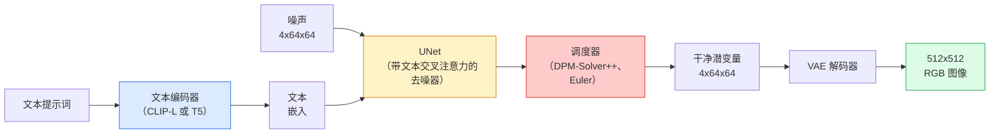

# Stable Diffusion：架构与微调

> Stable Diffusion 是在预训练 VAE 潜空间中运行的 DDPM：经交叉注意力由文本条件化，以快速确定性 ODE 求解器采样，并由无分类器引导操控。

**类型：** 学习 + 使用  
**学习实现：** Python  
**前置课程：** Phase 4 第 10 课（扩散）、Phase 7 第 02 课（自注意力）  
**预计时间：** 约 75 分钟

## 学习目标

- 追踪 Stable Diffusion 流水线的五部分：VAE、文本编码器、U-Net、调度器、安全检查器，以及它们实际做什么。
- 解释潜空间扩散，以及为何在 `4x64x64` 潜空间（而非 `3x512x512` 图像）训练可在不失质量下减少 48 倍计算。
- 用 `diffusers` 生成图像，运行图生图、修补和 ControlNet 引导生成。
- 在小型自定义数据集上用 LoRA 微调 Stable Diffusion，并在推理时加载 LoRA 适配器。

## 问题

直接在 512x512 RGB 图像上训练 DDPM 很昂贵：每个训练步骤都要通过看到 `3x512x512 = 786,432` 输入值的 U-Net 反传，采样还要经过同一 U-Net 50+ 次前向。以 2022 年发布的 Stable Diffusion 1.5 质量计算，像素空间扩散约需 256 GPU 月训练，在消费级 GPU 上每图需 10–30 秒。

**潜空间扩散**（Rombach 等，CVPR 2022）让开放权重文生图模型具备可行的计算成本：训练 VAE 将 `3x512x512` 图映射为 `4x64x64` 潜张量并还原，再在潜空间做扩散。计算下降 `(3*512*512)/(4*64*64) = 48x`，同 GPU 采样从数十秒降至两秒以内。

许多现代图像与视频生成模型——SDXL、SD3、FLUX、HunyuanDiT、Wan-Video——都采用潜空间扩散，只在自编码器、去噪器（U-Net 或 DiT）和文本条件等部分有所变化。Stable Diffusion 展示了这类系统的基本模板。

## 概念

### 流水线



- **VAE**——冻结自编码器。编码器将图转为潜变量（用于图生图和训练），解码器将潜变量还原为图像。
- **文本编码器**——CLIP（SD 1.x/2.x）、CLIP-L + CLIP-G（SDXL）或 T5-XXL（SD3/FLUX），产生词元嵌入序列。
- **U-Net**——去噪器，在每个分辨率级别都以交叉注意力从潜变量关注文本嵌入。
- **调度器**——采样算法（DDIM、Euler、DPM-Solver++），选择 sigma，将预测噪声混回潜变量。
- **安全检查器**——对输出图像的可选 NSFW / 非法内容过滤器。

### 无分类器引导（CFG）

普通文本条件学习每个提示 `c` 的 `epsilon_theta(x_t, t, c)`。CFG 在训练时 10% 概率丢弃 `c`（替为空嵌入），让单一模型同时预测条件与无条件噪声；推理时：

```
eps = eps_uncond + w * (eps_cond - eps_uncond)
```

`w` 是引导尺度：`w=0` 无条件，`w=1` 普通条件，`w>1` 将输出推向“更受提示词约束”，代价是多样性。SD 默认 `w=7.5`。

CFG 是文生图达到生产质量的原因；没有它提示词只弱弱偏置输出，有它提示词主导结果。

### 潜空间几何

VAE 的 4 通道潜变量不仅压缩图像，还形成一个在算术上大致对应语义编辑的流形（提示词工程和插值都在其中），扩散 U-Net 将全部建模预算投入于此。解码随机 `4x64x64` 潜变量不会得到随机样式图像，而会得到无意义结果，因为只有特定潜变量子流形会解码为有效图像。

两项结果：

1. **图生图** = 将图像编码为潜变量，加入部分噪声，运行去噪器，再解码。因编码近似可逆，图像结构保留；内容随提示改变。
2. **修补** = 图生图的同一过程，但去噪器只更新掩码区域，未掩码区域保留编码潜变量。

### U-Net 架构

SD U-Net 是第 10 课 TinyUNet 的大版本，额外有：

- 每个空间分辨率的 **Transformer 模块**，包含自注意力和对文本嵌入的交叉注意力。
- 对正弦编码作 MLP 的**时间嵌入**。
- 匹配分辨率编码器与解码器之间的**跳跃连接**。

SD 1.5 参数约 8.6 亿，SDXL 约 26 亿，FLUX 约 120 亿；参数增长主要在注意力层。

### LoRA 微调

完整微调 Stable Diffusion 需 20+ GB VRAM，并更新 8.6 亿参数。LoRA（Low-Rank Adaptation）冻结基础模型，在注意力层注入小型秩分解矩阵。SD LoRA 适配器通常 10–50 MB，单消费级 GPU 训练 10–60 分钟，推理时作为直接修改加载。

```
原始：W_q : (d_in, d_out)   冻结
LoRA：W_q + alpha * (A @ B)   其中 A : (d_in, r), B : (r, d_out)

r 通常为 4–32。
```

LoRA 是几乎全部社区微调的分发方式；CivitAI 与 Hugging Face 托管数百万个。

### 常见调度器

- **DDIM**——确定性，约 50 步，简单。
- **Euler ancestral**——随机，30–50 步，样本略更有创造性。
- **DPM-Solver++ 2M Karras**——确定性，20–30 步，生产默认。
- **LCM / TCD / Turbo**——一致性模型和蒸馏变体；1–4 步，牺牲部分质量。

在 `diffusers` 中切换调度器只需一行，有时无需重训即可修复样本问题。

```figure
cv3-latent-compression
```

## 动手实现

本课端到端使用 `diffusers`，而不从零重建 Stable Diffusion。要重建的 VAE、文本编码器、U-Net、调度器各自是独立课程主题；此处目标是熟练生产 API。

### 步骤 1：文生图

```python
import torch
from diffusers import StableDiffusionPipeline

pipe = StableDiffusionPipeline.from_pretrained(
    "runwayml/stable-diffusion-v1-5",
    torch_dtype=torch.float16,
).to("cuda")

image = pipe(
    prompt="a dog riding a skateboard in tokyo, studio ghibli style",
    guidance_scale=7.5,
    num_inference_steps=25,
    generator=torch.Generator("cuda").manual_seed(42),
).images[0]
image.save("dog.png")
```

`float16` 在无可见质量损失下将 VRAM 减半。默认 DPM-Solver++ 的 `num_inference_steps=25` 匹配 DDIM 的 50 步。

### 步骤 2：替换调度器

```python
from diffusers import DPMSolverMultistepScheduler, EulerAncestralDiscreteScheduler

pipe.scheduler = DPMSolverMultistepScheduler.from_config(pipe.scheduler.config)
pipe.scheduler = EulerAncestralDiscreteScheduler.from_config(pipe.scheduler.config)
```

调度器状态与 U-Net 权重解耦，可在 DDPM 上训练、用任意调度器采样。

### 步骤 3：图生图

```python
from diffusers import StableDiffusionImg2ImgPipeline
from PIL import Image

img2img = StableDiffusionImg2ImgPipeline.from_pretrained(
    "runwayml/stable-diffusion-v1-5",
    torch_dtype=torch.float16,
).to("cuda")

init_image = Image.open("dog.png").convert("RGB").resize((512, 512))
out = img2img(
    prompt="a dog riding a skateboard, oil painting",
    image=init_image,
    strength=0.6,
    guidance_scale=7.5,
).images[0]
```

`strength` 是去噪前加入多少噪声（0.0 不变，1.0 完全重生成）。风格迁移标准范围为 0.5–0.7。

### 步骤 4：修补

```python
from diffusers import StableDiffusionInpaintPipeline

inpaint = StableDiffusionInpaintPipeline.from_pretrained(
    "runwayml/stable-diffusion-inpainting",
    torch_dtype=torch.float16,
).to("cuda")

image = Image.open("dog.png").convert("RGB").resize((512, 512))
mask = Image.open("dog_mask.png").convert("L").resize((512, 512))

out = inpaint(
    prompt="a cat",
    image=image,
    mask_image=mask,
    guidance_scale=7.5,
).images[0]
```

掩码白色像素为要重生成区域，黑色像素保留。

### 步骤 5：加载 LoRA

```python
pipe.load_lora_weights("sayakpaul/sd-lora-ghibli")
pipe.fuse_lora(lora_scale=0.8)

image = pipe(prompt="a village square in ghibli style").images[0]
```

`lora_scale` 控制强度：0.0 无效，1.0 全效。`fuse_lora` 为加速将适配器原位融合进权重，却阻止替换；加载其他适配器前调用 `pipe.unfuse_lora()`。

### 步骤 6：LoRA 训练（草图）

生产 LoRA 训练通常使用 `peft` 或 `diffusers.training`；轮廓如下：

```python
# Pseudocode
for step, batch in enumerate(dataloader):
    images, prompts = batch
    latents = vae.encode(images).latent_dist.sample() * 0.18215

    t = torch.randint(0, num_train_timesteps, (batch_size,))
    noise = torch.randn_like(latents)
    noisy_latents = scheduler.add_noise(latents, noise, t)

    text_emb = text_encoder(tokenizer(prompts))

    pred_noise = unet(noisy_latents, t, text_emb)  # LoRA weights injected here

    loss = F.mse_loss(pred_noise, noise)
    loss.backward()
    optimizer.step()
```

只有 LoRA 矩阵接收梯度，基础 U-Net、VAE、文本编码器冻结。批大小为 1 并启用梯度检查点时，这可放入 8 GB VRAM。

## 使用现成工具

生产中实际要做的选择：

- **模型家族**：SD 1.5 用于开源社区微调，SDXL 用于更高保真，SD3 / FLUX 用于 SOTA 和严格许可证要求。
- **调度器**：20–30 步选 DPM-Solver++ 2M Karras，延迟低于 1 秒选 LCM-LoRA。
- **精度**：4080/4090 用 `float16`，A100 及更新设备用 `bfloat16`，VRAM 紧张时用 `int8`（经 `bitsandbytes` 或 `compel`）。
- **条件化**：纯文本可用；更强控制时，在基础流水线上加 ControlNet（canny、深度、姿态）。

批量生成使用社区工具 `AUTO1111` / `ComfyUI`；生产 API 使用 `diffusers` + `accelerate`，或带 TensorRT 编译的 `optimum-nvidia`。

## 交付产物

本课产出：

- `outputs/prompt-sd-pipeline-planner.md` —— 按延迟预算、保真目标、许可证约束选择 SD 1.5 / SDXL / SD3 / FLUX 及调度器和精度的提示词。
- `outputs/skill-lora-training-setup.md` —— 为自定义数据集写出完整 LoRA 训练配置（描述文本、rank、批大小、学习率）的技能。

## 练习

1. **（简单）** 用 `[1, 3, 5, 7.5, 10, 15]` 中的 `guidance_scale` 生成相同提示词，描述图像如何变化；哪个引导值出现伪影？
2. **（中等）** 对任意真实照片，在 `strength` 为 `[0.2, 0.4, 0.6, 0.8, 1.0]` 时运行 `StableDiffusionImg2ImgPipeline`；哪个强度保留构图又改变风格？为何 1.0 完全忽略输入？
3. **（困难）** 在单个主题（宠物、logo、角色）的 10–20 张图上训练 LoRA，并生成含该主题的新场景；报告获得最佳身份保留、又不过拟合输入图的 LoRA rank 和训练步数。

## 关键术语

| 术语 | 常见说法 | 实际含义 |
|------|----------|----------|
| 潜空间扩散（Latent diffusion） | “在潜变量中扩散” | 在 VAE 潜空间 `4x64x64` 而非像素空间 `3x512x512` 中运行完整 DDPM；节省 48 倍计算 |
| VAE 缩放因子（VAE scale factor） | “0.18215” | 将 VAE 原始潜变量重新缩放至约单位方差的常数；每个 SD 管线硬编码 |
| 无分类器引导（Classifier-free guidance） | “CFG” | 混合条件与无条件噪声预测；最有影响力的推理旋钮 |
| 调度器（Scheduler） | “采样器” | 将噪声和模型预测变成去噪潜变量轨迹的算法 |
| LoRA | “低秩适配器” | 对注意力层做微调而不触碰基础权重的小型秩分解矩阵 |
| 交叉注意力（Cross-attention） | “文本—图像注意力” | 潜词元对文本词元的注意力，在每个 U-Net 层注入提示信息 |
| ControlNet | “结构条件化” | 用额外输入（canny、深度、姿态、分割）引导 SD 的独立训练适配器 |
| DPM-Solver++ | “默认调度器” | 二阶确定性 ODE 求解器；2026 年低步数（20–30）质量最佳 |

## 延伸阅读

- [High-Resolution Image Synthesis with Latent Diffusion (Rombach et al., 2022)](https://arxiv.org/abs/2112.10752) —— Stable Diffusion 论文，含所有证明设计合理的消融。
- [Classifier-Free Diffusion Guidance (Ho & Salimans, 2022)](https://arxiv.org/abs/2207.12598) —— CFG 论文。
- [LoRA: Low-Rank Adaptation of Large Language Models (Hu et al., 2021)](https://arxiv.org/abs/2106.09685) —— LoRA 最初属于 NLP，几乎不改动便迁移到 SD。
- [diffusers documentation](https://huggingface.co/docs/diffusers) —— 每个 SD / SDXL / SD3 / FLUX 流水线的参考。
