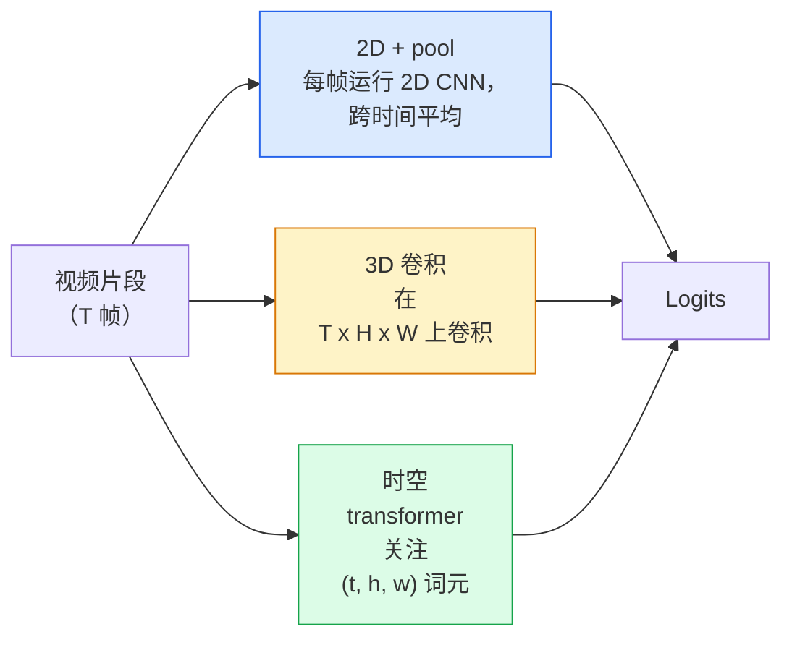

# 视频理解：时序建模

> 视频是一串图像，加上连接它们的物理规律。每个视频模型要么将时间视为额外轴（3D 卷积），要么视为需关注的序列（transformer），要么只提取一次特征再池化（2D+pool）。

**类型：** 学习 + 构建  
**学习实现：** Python  
**前置课程：** Phase 4 第 03 课（CNN）、Phase 4 第 04 课（图像分类）  
**预计时间：** 约 45 分钟

## 学习目标

- 区分三种主要视频建模方法（2D+pool、3D 卷积、时空 transformer），并预测其成本和准确率权衡。
- 在 PyTorch 中实现帧采样、时序池化和 2D+pool 基线分类器。
- 解释 I3D“膨胀”3D 卷积核为何能从 ImageNet 权重良好迁移，以及分解 `(2+1)D` 卷积有何不同。
- 阅读标准动作识别数据集和指标：Kinetics-400/600、UCF101、Something-Something V2；clip 与视频级 top-1 准确率。

## 问题

30 秒、30 fps 视频有 900 张图像。朴素视频分类即运行 900 次图像分类，再以某种方式聚合。动作几乎每帧可见时（体育、烹饪、健身）它有效；当动作由运动本身定义时则严重失败：“从左向右推物体”在每一静帧中看起来都是两个静物。

每种视频架构的核心问题是：何时、如何建模时间结构？答案决定计算成本、预训练策略、能否复用 ImageNet 权重和训练数据集。

本课比静态图像课程短，因为核心图像机制已经具备；视频理解主要讲时间故事：采样、建模、聚合。

## 概念

### 三个架构家族



### 2D + pool

取 2D CNN（ResNet、EfficientNet、ViT），独立运行在每个采样帧；平均（或最大池化、注意力池化）逐帧嵌入，再将池化向量交给分类器。

优点：

- ImageNet 预训练可直接迁移。
- 最易实现。
- 便宜：T 帧乘单图推理成本。

缺点：

- 无法建模运动，动作仅为外观聚合。
- 时序池化与顺序无关，“开门”与“关门”看起来相同。

使用时机：外观占主导的任务、小视频数据集上的迁移学习、初始基线。

### 3D 卷积

将 2D `(H, W)` 卷积核换为 3D `(T, H, W)` 卷积核，网络同时在空间与时间卷积。早期家族：C3D、I3D、SlowFast。

I3D 技巧：取预训练 2D ImageNet 模型，沿新时间轴复制每个 2D 卷积核来“膨胀”它；3x3 2D 卷积变为 3x3x3 3D 卷积，使 3D 模型获得强预训练权重而非从头训练。

优点：

- 直接建模运动。
- I3D 膨胀提供免费的迁移学习。

缺点：

- 比 2D 对应模型多约 `T/8` 倍 FLOPs（时间核为 3 且堆叠三次）。
- 时间核小，长程运动需要金字塔或双流方案。

使用时机：运动就是信号的动作识别（Something-Something V2、含运动重类的 Kinetics）。

### 时空 transformer

将视频词元化为时空图块网格，并关注全部词元：TimeSformer、ViViT、Video Swin、VideoMAE。

重要注意力模式：

- **Joint**——对 `(t, h, w)` 做一次大注意力；相对 `T*H*W` 二次增长，昂贵。
- **Divided**——每模块两次注意力：一次时间、一次空间；近似线性缩放。
- **Factorised**——跨模块交替做时间与空间注意力。

优点：

- 每个主要基准上均为 SOTA 准确率。
- 可通过图块膨胀从图像 transformer（ViT）迁移。
- 稀疏注意力支持长上下文视频。

缺点：

- 计算密集。
- 需谨慎选择注意力模式，否则运行时间膨胀。

使用时机：大型数据集、高保真视频理解、多模态视频+文本任务。

### 帧采样

10 秒、30 fps 片段有 300 帧，全部输入任意模型都浪费。标准策略：

- **均匀采样**——在片段中均匀选 T 帧，2D+pool 默认。
- **稠密采样**——随机连续 T 帧窗口，3D 卷积常用，因为运动需要邻帧。
- **多片段**——从同一视频采多个 T 帧窗口，分别分类，测试时平均预测。

T 通常为 8、16、32、64；更高 T 有更多时序信号，也有更多计算。

### 评估

两个层级：

- **片段级准确率**——模型看到一个 T 帧片段，报告 top-k。
- **视频级准确率**——对每视频多个片段的预测平均；更高、更稳定。

总是报告两者。78% clip / 82% video 的模型严重依赖测试时平均；80% / 81% 的模型每个片段更鲁棒。

### 会遇到的数据集

- **Kinetics-400 / 600 / 700**——通用动作数据集，40 万片段、YouTube URL（许多现已失效）。
- **Something-Something V2**——运动定义的动作（“将 X 从左移到右”），不能由 2D+pool 解决。
- **UCF-101**、**HMDB-51**——更早、更小，仍常报告。
- **AVA**——时空中的动作*定位*，比分类更难。

```figure
v4-video-temporal
```

## 动手实现

### 步骤 1：帧采样器

适用于帧列表（或视频张量）的均匀和稠密采样器。

```python
import numpy as np

def sample_uniform(num_frames_total, T):
    if num_frames_total <= T:
        return list(range(num_frames_total)) + [num_frames_total - 1] * (T - num_frames_total)
    step = num_frames_total / T
    return [int(i * step) for i in range(T)]


def sample_dense(num_frames_total, T, rng=None):
    rng = rng or np.random.default_rng()
    if num_frames_total <= T:
        return list(range(num_frames_total)) + [num_frames_total - 1] * (T - num_frames_total)
    start = int(rng.integers(0, num_frames_total - T + 1))
    return list(range(start, start + T))
```

两者均返回 T 个索引，用它们切片视频张量。

### 步骤 2：2D+pool 基线

让 2D ResNet-18 处理每帧，平均池化特征，再分类。

```python
import torch
import torch.nn as nn
from torchvision.models import resnet18, ResNet18_Weights

class FramePool(nn.Module):
    def __init__(self, num_classes=400, pretrained=True):
        super().__init__()
        weights = ResNet18_Weights.IMAGENET1K_V1 if pretrained else None
        backbone = resnet18(weights=weights)
        self.features = nn.Sequential(*(list(backbone.children())[:-1]))  # global avg pool kept
        self.head = nn.Linear(512, num_classes)

    def forward(self, x):
        # x: (N, T, 3, H, W)
        N, T = x.shape[:2]
        x = x.view(N * T, *x.shape[2:])
        feats = self.features(x).view(N, T, -1)
        pooled = feats.mean(dim=1)
        return self.head(pooled)

model = FramePool(num_classes=10)
x = torch.randn(2, 8, 3, 224, 224)
print(f"output: {model(x).shape}")
print(f"params: {sum(p.numel() for p in model.parameters()):,}")
```

1,100 万参数、ImageNet 预训练、逐帧运行、平均、分类。这个基线在外观主导任务上通常仅比正规 3D 模型低 5–10 点，有时更好，因为复用了更强 ImageNet 骨干。

### 步骤 3：I3D 风格膨胀 3D 卷积

沿新时间轴重复权重，将单个 2D 卷积变为 3D 卷积。

```python
def inflate_2d_to_3d(conv2d, time_kernel=3):
    out_c, in_c, kh, kw = conv2d.weight.shape
    weight_3d = conv2d.weight.data.unsqueeze(2)  # (out, in, 1, kh, kw)
    weight_3d = weight_3d.repeat(1, 1, time_kernel, 1, 1) / time_kernel
    conv3d = nn.Conv3d(in_c, out_c, kernel_size=(time_kernel, kh, kw),
                        padding=(time_kernel // 2, conv2d.padding[0], conv2d.padding[1]),
                        stride=(1, conv2d.stride[0], conv2d.stride[1]),
                        bias=False)
    conv3d.weight.data = weight_3d
    return conv3d

conv2d = nn.Conv2d(3, 64, kernel_size=3, padding=1, bias=False)
conv3d = inflate_2d_to_3d(conv2d, time_kernel=3)
print(f"2D weight shape:  {tuple(conv2d.weight.shape)}")
print(f"3D weight shape:  {tuple(conv3d.weight.shape)}")
x = torch.randn(1, 3, 8, 56, 56)
print(f"3D output shape:  {tuple(conv3d(x).shape)}")
```

除以 `time_kernel` 保持激活值尺度大致不变，避免第一次前向破坏 batch-norm 统计量。

### 步骤 4：分解 `(2+1)D` 卷积

把 3D 卷积分为 2D（空间）和 1D（时间）卷积；相同感受野、更少参数，某些基准准确率更好。

```python
class Conv2Plus1D(nn.Module):
    def __init__(self, in_c, out_c, kernel_size=3):
        super().__init__()
        mid_c = (in_c * out_c * kernel_size * kernel_size * kernel_size) \
                // (in_c * kernel_size * kernel_size + out_c * kernel_size)
        self.spatial = nn.Conv3d(in_c, mid_c, kernel_size=(1, kernel_size, kernel_size),
                                 padding=(0, kernel_size // 2, kernel_size // 2), bias=False)
        self.bn = nn.BatchNorm3d(mid_c)
        self.act = nn.ReLU(inplace=True)
        self.temporal = nn.Conv3d(mid_c, out_c, kernel_size=(kernel_size, 1, 1),
                                  padding=(kernel_size // 2, 0, 0), bias=False)

    def forward(self, x):
        return self.temporal(self.act(self.bn(self.spatial(x))))

c = Conv2Plus1D(3, 64)
x = torch.randn(1, 3, 8, 56, 56)
print(f"(2+1)D output: {tuple(c(x).shape)}")
```

完整 R(2+1)D 网络即 ResNet-18 中每个 3x3 卷积均由 `Conv2Plus1D` 替代。

## 使用现成工具

两种库覆盖生产视频工作：

- `torchvision.models.video`——R(2+1)D、MViT、Swin3D，带预训练 Kinetics 权重；API 与图像模型相同。
- `pytorchvideo`（Meta）——模型库、Kinetics / SSv2 / AVA 的数据加载器、标准变换。

视觉语言视频模型（视频字幕、视频问答）使用 `transformers`（`VideoMAE`、`VideoLLaMA`、`InternVideo`）。

## 交付产物

本课产出：

- `outputs/prompt-video-architecture-picker.md` —— 依据外观 vs 运动、数据集规模、计算预算选择 2D+pool / I3D / (2+1)D / transformer 的提示词。
- `outputs/skill-frame-sampler-auditor.md` —— 检查视频流水线采样器并标记常见 bug（索引差一、`num_frames < T` 时采样不均、缺少保持宽高比裁剪等）的技能。

## 练习

1. **（简单）** 计算 T=8 的 FramePool 与 T=8 的 I3D 风格 3D ResNet 的近似 FLOPs，说明为何 2D+pool 便宜 3–5 倍。
2. **（中等）** 生成合成视频数据集：随机球沿随机方向运动，按运动方向标注（“从左到右”“从右到左”“斜向上”）。在其上训练 FramePool，展示它接近随机准确率，从而证明外观不足以解决运动任务。
3. **（困难）** 以 `Conv2Plus1D` 替换 ResNet-18 中每个 Conv2d，构建 R(2+1)D-18；从 ImageNet 预训练 ResNet-18 膨胀首个卷积权重，在练习 2 运动数据上训练并击败 FramePool。

## 关键术语

| 术语 | 常见说法 | 实际含义 |
|------|----------|----------|
| 2D + pool | “逐帧分类器” | 每个采样帧运行 2D CNN，跨时间平均池化特征，再分类 |
| 3D 卷积 | “时空卷积核” | 在 `(T, H, W)` 上卷积的核，可原生建模运动 |
| 膨胀（Inflation） | “将 2D 权重升至 3D” | 沿新时间轴重复 2D 卷积权重初始化 3D 卷积，再除以 kernel_T 保持激活尺度 |
| `(2+1)D` | “分解卷积” | 将 3D 分为 2D 空间 + 1D 时间，更少参数，中间额外非线性 |
| 分割注意力（Divided attention） | “先时间后空间” | 每层两次注意力：同帧词元的一次、同位置词元的一次 |
| 片段（Clip） | “T 帧窗口” | T 个采样帧构成的子序列，是视频模型的消费单位 |
| Clip vs 视频准确率 | “两套评估” | Clip = 每视频一个样本，视频 = 跨多个采样片段平均 |
| Kinetics | “视频领域的 ImageNet” | 400–700 动作类别、30 万+ YouTube 片段，标准视频预训练语料 |

## 延伸阅读

- [I3D: Quo Vadis, Action Recognition (Carreira & Zisserman, 2017)](https://arxiv.org/abs/1705.07750) —— 引入膨胀和 Kinetics 数据集。
- [R(2+1)D: A Closer Look at Spatiotemporal Convolutions (Tran et al., 2018)](https://arxiv.org/abs/1711.11248) —— 分解卷积，至今仍是强基线。
- [TimeSformer: Is Space-Time Attention All You Need? (Bertasius et al., 2021)](https://arxiv.org/abs/2102.05095) —— 首个强视频 transformer。
- [VideoMAE (Tong et al., 2022)](https://arxiv.org/abs/2203.12602) —— 视频掩码自编码器预训练，当前主导预训练配方。
