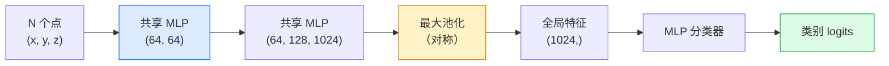

# 3D 视觉：点云与 NeRF

> 3D 视觉有两种主要形态。点云是传感器的原始输出；NeRF 是学习得到的体积场。二者都在回答“空间中的什么位于哪里”。

**类型：** 学习 + 构建  
**学习实现：** Python  
**前置课程：** Phase 4 第 03 课（CNN）、Phase 1 第 12 课（张量运算）  
**预计时间：** 约 45 分钟

## 学习目标

- 区分显式 3D 表示（点云、网格、体素）与隐式 3D 表示（有符号距离场、NeRF），并了解各自的适用场景。
- 理解 PointNet 利用对称函数使神经网络对无序点集保持置换不变的技巧。
- 追踪一次 NeRF 前向过程：射线投射、体渲染、位置编码，以及输出密度和颜色的 MLP 头。
- 使用 `nerfstudio` 或 `instant-ngp`，从少量带位姿图像进行预训练的 3D 重建。

## 问题

相机会生成二维图像。LIDAR 会生成一组没有顺序的三维点。运动恢复结构（structure-from-motion）流水线会生成稀疏的三维关键点云。NeRF 则能从少量带位姿图像重建完整的三维场景。它们都属于“视觉”，却没有任何一种看起来像 CNN 所需的稠密张量。

抓取、避障、导航、AR 遮挡和 3D 内容采集等机器人与视觉任务都在三维空间中运行。理解 3D 表示，才能处理 AR/VR 内容、机器人、自动驾驶技术栈，以及面向房地产或施工的 NeRF 3D 重建。

两类表示的来源不同：点云是传感器直接提供的数据；NeRF 及其后继（3D Gaussian splatting、神经 SDF）则是神经网络学习场景后得到的表示。

## 概念

### 点云

点云是由 N 个 `R^3` 中的点构成的无序集合，每个点还可带有特征（颜色、强度、法线）。

```text
cloud = [
  (x1, y1, z1, r1, g1, b1),
  (x2, y2, z2, r2, g2, b2),
  ...
  (xN, yN, zN, rN, gN, bN),
]
```

没有网格，也没有连通关系。这让神经网络面临两个难点：

- **置换不变性（Permutation invariance）**——输出不能依赖点的排列顺序。
- **可变 N**——同一模型必须处理大小不同的点云。

PointNet（Qi 等，2017）用一个想法同时解决了这两个问题：对每个点应用共享 MLP，再用对称函数（最大池化）聚合。结果是一个不依赖输入顺序的固定大小向量。

```text
f(P) = max_{p in P} MLP(p)
```

共享 MLP 与对称聚合构成 PointNet 的核心。更深的变体（PointNet++、Point Transformer）增加了层级采样和局部聚合，但这个对称函数技巧保持不变。

### PointNet 架构



“共享 MLP”指同一个 MLP 独立地作用于每个点。为提高效率，实现时通常将其写成沿点维度的 1x1 卷积。

### 神经辐射场（NeRF）

NeRF（Mildenhall 等，2020）面对“能否从 N 张照片重建一个三维场景？”这个问题，给出的答案是：用一个神经网络作为场景本身。网络将 `(x, y, z, viewing_direction)` 映射为 `(density, colour)`。渲染新视角时，会沿射线不断查询这个网络。

```text
NeRF MLP:  (x, y, z, theta, phi) -> (sigma, r, g, b)

渲染新视图中一个像素 (u, v) 的过程：
  1. 从相机穿过像素 (u, v) 投射一条射线
  2. 在射线上、距离为 t_1, t_2, ..., t_N 的位置采样点
  3. 在每个点查询 MLP
  4. 按 (1 - exp(-sigma * dt)) 对颜色加权合成
  5. 求和结果就是渲染出的像素颜色
```

训练时，损失函数会比较渲染像素与训练照片中的真实像素。梯度经由渲染步骤反向传播并更新 MLP。不需要 3D 真值，也不需要显式几何；场景储存在 MLP 权重中。

### NeRF 中的位置编码

直接将 `(x, y, z)` 送入普通 MLP，无法表示高频细节，因为 MLP 在频谱上偏向低频。NeRF 在送入 MLP 前，把每个坐标编码为 Fourier 特征向量来解决它：

```text
gamma(p) = (sin(2^0 pi p), cos(2^0 pi p), sin(2^1 pi p), cos(2^1 pi p), ...)
```

通常使用到 `L=10` 个频率层级。这与 transformer 的位置编码是同一种技巧，也会在第 10 课的扩散时间条件中再次出现。没有它，NeRF 会显得模糊。

### 体渲染

```text
C(r) = sum_i T_i * (1 - exp(-sigma_i * delta_i)) * c_i

T_i  = exp(- sum_{j<i} sigma_j * delta_j)
delta_i = t_{i+1} - t_i
```

`T_i` 是透射率（transmittance），即有多少光能存留到第 i 个点。`(1 - exp(-sigma_i * delta_i))` 是第 i 个点的不透明度；`c_i` 是颜色。最终像素是沿射线的加权求和。

### 什么取代了 NeRF

纯 NeRF 训练很慢（数小时），渲染也很慢（每张图数秒）。其后的演进如下：

- **Instant-NGP**（2022）——用哈希网格编码取代 MLP 的位置输入；可在数秒内训练。
- **Mip-NeRF 360**——处理无边界场景并提供抗锯齿。
- **3D Gaussian Splatting**（2023）——用数百万个 3D 高斯取代体积场；数分钟训练、实时渲染，是当前生产默认方案。

到 2026 年，许多生产级新视角合成系统已采用 3D Gaussian splatting，但 NeRF 仍提供理解这类系统的基础模型。

### 数据集与基准

- **ShapeNet**——将 3D CAD 模型视为点云进行分类和分割。
- **ScanNet**——用于分割的真实室内扫描数据。
- **KITTI**——用于自动驾驶的室外 LIDAR 点云。
- **NeRF Synthetic** / **Blended MVS**——用于新视角合成的带位姿图像数据集。
- **Mip-NeRF 360** 数据集——无边界真实场景。

```figure
nerf-rays
```

## 动手实现

### 步骤 1：PointNet 分类器

```python
import torch
import torch.nn as nn

class PointNet(nn.Module):
    def __init__(self, num_classes=10):
        super().__init__()
        self.mlp1 = nn.Sequential(
            nn.Conv1d(3, 64, 1),    nn.BatchNorm1d(64),   nn.ReLU(inplace=True),
            nn.Conv1d(64, 64, 1),   nn.BatchNorm1d(64),   nn.ReLU(inplace=True),
        )
        self.mlp2 = nn.Sequential(
            nn.Conv1d(64, 128, 1),  nn.BatchNorm1d(128),  nn.ReLU(inplace=True),
            nn.Conv1d(128, 1024, 1), nn.BatchNorm1d(1024), nn.ReLU(inplace=True),
        )
        self.head = nn.Sequential(
            nn.Linear(1024, 512),   nn.BatchNorm1d(512),  nn.ReLU(inplace=True),
            nn.Dropout(0.3),
            nn.Linear(512, 256),    nn.BatchNorm1d(256),  nn.ReLU(inplace=True),
            nn.Dropout(0.3),
            nn.Linear(256, num_classes),
        )

    def forward(self, x):
        # x: (N, 3, num_points) — transposed for Conv1d
        x = self.mlp1(x)
        x = self.mlp2(x)
        x = torch.max(x, dim=-1)[0]       # (N, 1024)
        return self.head(x)

pts = torch.randn(4, 3, 1024)
net = PointNet(num_classes=10)
print(f"output: {net(pts).shape}")
print(f"params: {sum(p.numel() for p in net.parameters()):,}")
```

约 160 万参数。每个点云处理 1,024 个点。

### 步骤 2：位置编码

```python
def positional_encoding(x, L=10):
    """
    x: (..., D) -> (..., D * 2 * L)
    """
    freqs = 2.0 ** torch.arange(L, dtype=x.dtype, device=x.device)
    args = x.unsqueeze(-1) * freqs * 3.141592653589793
    sinc = torch.cat([args.sin(), args.cos()], dim=-1)
    return sinc.reshape(*x.shape[:-1], -1)

x = torch.randn(5, 3)
y = positional_encoding(x, L=10)
print(f"input:  {x.shape}")
print(f"encoded: {y.shape}     # (5, 60)")
```

乘以 `2^l * pi` 会产生逐渐升高的频率。

### 步骤 3：微型 NeRF MLP

```python
class TinyNeRF(nn.Module):
    def __init__(self, L_pos=10, L_dir=4, hidden=128):
        super().__init__()
        self.L_pos = L_pos
        self.L_dir = L_dir
        pos_dim = 3 * 2 * L_pos
        dir_dim = 3 * 2 * L_dir
        self.trunk = nn.Sequential(
            nn.Linear(pos_dim, hidden), nn.ReLU(inplace=True),
            nn.Linear(hidden, hidden),  nn.ReLU(inplace=True),
            nn.Linear(hidden, hidden),  nn.ReLU(inplace=True),
            nn.Linear(hidden, hidden),  nn.ReLU(inplace=True),
        )
        self.sigma = nn.Linear(hidden, 1)
        self.color = nn.Sequential(
            nn.Linear(hidden + dir_dim, hidden // 2), nn.ReLU(inplace=True),
            nn.Linear(hidden // 2, 3), nn.Sigmoid(),
        )

    def forward(self, x, d):
        x_enc = positional_encoding(x, self.L_pos)
        d_enc = positional_encoding(d, self.L_dir)
        h = self.trunk(x_enc)
        sigma = torch.relu(self.sigma(h)).squeeze(-1)
        rgb = self.color(torch.cat([h, d_enc], dim=-1))
        return sigma, rgb

nerf = TinyNeRF()
x = torch.randn(128, 3)
d = torch.randn(128, 3)
s, c = nerf(x, d)
print(f"sigma: {s.shape}   rgb: {c.shape}")
```

它与原始 NeRF 相比很小（原始模型有两个深度为 8 的 MLP 主干），但足以演示该架构。

### 步骤 4：沿射线的体渲染

```python
def volumetric_render(sigma, rgb, t_vals):
    """
    sigma: (..., N_samples)
    rgb:   (..., N_samples, 3)
    t_vals: (N_samples,) distances along the ray
    """
    delta = torch.cat([t_vals[1:] - t_vals[:-1], torch.full_like(t_vals[:1], 1e10)])
    alpha = 1.0 - torch.exp(-sigma * delta)
    trans = torch.cumprod(torch.cat([torch.ones_like(alpha[..., :1]), 1.0 - alpha + 1e-10], dim=-1), dim=-1)[..., :-1]
    weights = alpha * trans
    rendered = (weights.unsqueeze(-1) * rgb).sum(dim=-2)
    depth = (weights * t_vals).sum(dim=-1)
    return rendered, depth, weights


N = 64
t_vals = torch.linspace(2.0, 6.0, N)
sigma = torch.rand(N) * 0.5
rgb = torch.rand(N, 3)
rendered, depth, weights = volumetric_render(sigma, rgb, t_vals)
print(f"rendered colour: {rendered.tolist()}")
print(f"depth:           {depth.item():.2f}")
```

一条射线、64 个样本，合成为一个 RGB 像素和一个深度值。

## 使用现成工具

实际工作中可使用：

- `nerfstudio`（Tancik 等）——当前 NeRF / Instant-NGP / Gaussian Splatting 的参考库，提供命令行和网页查看器。
- `pytorch3d`（Meta）——可微渲染、点云工具和网格操作。
- `open3d`——点云处理、配准和可视化。

部署时，3D Gaussian splatting 已在很大程度上取代纯 NeRF，因为其渲染速度快 100 倍，而重建质量相当。

## 交付产物

本课产出：

- `outputs/prompt-3d-task-router.md`——根据任务和输入数据选择合适 3D 表示（点云、网格、体素、NeRF、Gaussian splat）的提示词。
- `outputs/skill-point-cloud-loader.md`——为 `.ply` / `.pcd` / `.xyz` 文件编写 PyTorch `Dataset` 的技能，并确保归一化、居中和点采样正确。

## 练习

1. **（简单）** 证明 PointNet 对置换不变：同一片点云分别以原顺序和打乱点顺序运行，验证输出除浮点噪声外相同。
2. **（中等）** 实现最小射线生成函数：给定相机内参和位姿，为 `H x W` 图像的每个像素生成射线原点和方向。
3. **（困难）** 在合成的彩色立方体渲染视图数据集上训练 TinyNeRF（通过可微渲染或简单光线追踪器生成）。报告 epoch 1、10 和 100 的渲染损失。模型从哪个 epoch 开始产生可辨认的视图？

## 关键术语

| 术语 | 常见说法 | 实际含义 |
|------|----------|----------|
| 点云（Point cloud） | “来自 LIDAR 的 3D 点” | `(x, y, z)` 的无序集合，每点可带有额外特征 |
| PointNet | “首个处理点云的神经网络” | 每点使用共享 MLP，加上对称（最大）池化；结构上保证置换不变 |
| NeRF | “作为场景的 MLP” | 将 `(x, y, z, dir)` 映射为 `(density, colour)` 的网络，通过射线投射渲染 |
| 位置编码（Positional encoding） | “Fourier 特征” | 将每个坐标编码为多个频率的 sin/cos，以克服 MLP 的低频偏置 |
| 体渲染（Volumetric rendering） | “射线积分” | 使用透射率和 alpha，将一条射线上的样本合成为单个像素 |
| Instant-NGP | “哈希网格 NeRF” | 以多分辨率哈希网格取代 NeRF 的坐标 MLP；快 100–1000 倍 |
| 3D Gaussian splatting | “数百万个高斯” | 场景由一组 3D 高斯组成；实时渲染、数分钟训练 |
| SDF | “有符号距离场” | 返回距最近表面的有符号距离的函数；另一种隐式表示 |

## 延伸阅读

- [PointNet（Qi 等，2017）](https://arxiv.org/abs/1612.00593)——置换不变分类器。
- [NeRF（Mildenhall 等，2020）](https://arxiv.org/abs/2003.08934)——将从照片重建 3D 变为神经网络问题的论文。
- [Instant-NGP（Müller 等，2022）](https://arxiv.org/abs/2201.05989)——哈希网格，速度提升 1000 倍。
- [3D Gaussian Splatting（Kerbl 等，2023）](https://arxiv.org/abs/2308.04079)——在生产中取代 NeRF 的架构。
