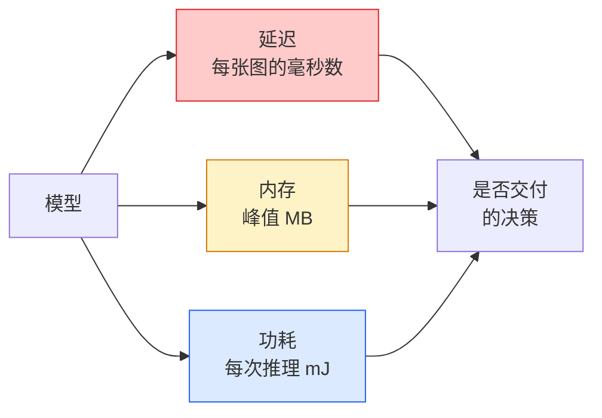

# 实时视觉：边缘部署

> 边缘推理的本质，是让一个准确率 90% 的模型在仅有 2 GB RAM 的设备上以 30 fps 运行。准确率的每一个百分点，都要与延迟的毫秒数交换。

**类型：** 学习 + 构建  
**学习实现：** Python  
**前置课程：** Phase 4 第 04 课（图像分类）、Phase 10 第 11 课（量化）  
**预计时间：** 约 75 分钟

## 学习目标

- 为任意 PyTorch 模型测量推理延迟、峰值内存和吞吐量，并解读 FLOPs / 参数量 / 延迟的权衡。
- 使用 PyTorch 训练后量化将视觉模型量化为 INT8，并验证准确率损失小于 1%。
- 导出为 ONNX 并用 ONNX Runtime 或 TensorRT 编译；说出最常见的三种导出失败及其修复方式。
- 解释在边缘约束下，应在 MobileNetV3、EfficientNet-Lite、ConvNeXt-Tiny 和 MobileViT 中如何选择。

## 问题

训练阶段的视觉模型是浮点怪兽：1 亿参数、每次前向 10 GFLOPs、2 GB VRAM。这些都放不进手机、汽车信息娱乐单元、工业相机或无人机。交付一个视觉系统，意味着要在小 100 倍的预算内给出同样的预测。

三个旋钮完成了大部分工作：模型选择（采用同一训练配方下更小的架构）、量化（使用 INT8 而不是 FP32）和推理运行时（ONNX Runtime、TensorRT、Core ML、TFLite）。正确使用它们，决定了一个只能在工作站跑的演示，还是能运行在 30 美元相机模块上的产品。

本课先建立测量方法，再介绍三个优化旋钮。你需要掌握可用的优化手段，并验证每项改动是否按预期工作，无需逐一学习所有边缘运行时。

## 概念

### 三种预算



- **延迟**：p50、p95、p99。只平均 p50 会掩盖实时系统关注的长尾行为。
- **峰值内存**：设备任一时刻看到的最大值，而不是稳态平均值。嵌入式目标上的 OOM 是致命的。
- **功耗 / 能量**：电池供电设备上每次推理消耗的毫焦耳数。常用 CPU/GPU 利用率 * 时间近似。

边缘决策基于一张（模型、延迟、内存、准确率）表。每个单元格都必须在目标设备上测量，不能在工作站上测量。

### 测量纪律

每个边缘性能分析都应遵循三条规则：

1. 测量前用 5–10 次虚拟前向传播**预热**模型。冷缓存和 JIT 编译得到的第一次数据不具代表性。
2. 在计时块前后使用 `torch.cuda.synchronize()` **同步** GPU 工作负载。不这样做，测得的是内核分发而不是内核执行。
3. 将输入大小**固定**为生产分辨率。224x224 的延迟不是 512x512 的延迟。

### FLOPs 只是代理指标

FLOPs（每次推理的浮点运算数）是廉价、与设备无关的延迟代理。它适合比较架构，却会误导绝对墙钟时间：一个 FLOPs 多 10% 的模型，实践中可能快 2 倍，因为它使用硬件友好的算子（深度卷积易于编译，大型 7x7 卷积则不然）。

规则：用 FLOPs 搜索架构，用设备上延迟做部署决策。

### 一段话理解量化

以 INT8 替换 FP32 权重和激活。模型大小缩小 4 倍、内存带宽缩小 4 倍，在具备 INT8 内核的硬件上（所有现代移动 SoC、带 Tensor Core 的 NVIDIA GPU），计算会快 2–4 倍。视觉任务采用训练后静态量化后，准确率通常只损失 0.1–1 个百分点。

类型：

- **动态量化**——将权重量化为 INT8，激活仍在 FP 中计算。简单，但加速幅度较小。
- **静态（训练后）量化**——量化权重，并在小校准集上校准激活范围。比动态量化快得多。
- **量化感知训练（QAT）**——在训练中模拟量化，让模型学会适应。准确率最佳，但需要带标签数据。

对于视觉，训练后静态量化（PTQ）以 5% 的工作量获得 95% 的收益。只有 PTQ 的准确率损失不可接受时才使用 QAT。

### 剪枝与蒸馏

- **剪枝**——移除不重要的权重（基于幅值）或通道（结构化）。对过参数化模型有效；对已经紧凑的架构帮助较小。
- **蒸馏**——训练小型学生模型模仿大型教师的 logits。它常能恢复因缩小模型而损失的大部分准确率，是生产边缘模型的标准做法。

### 推理运行时

- **PyTorch eager**——慢，不用于部署；仅用于开发。
- **TorchScript**——旧方案，已被 `torch.compile` 和 ONNX 导出取代。
- **ONNX Runtime**——中立运行时。CPU、CUDA、CoreML、TensorRT、OpenVINO 均有 ONNX provider；从这里开始。
- **TensorRT**——NVIDIA 编译器。在 NVIDIA GPU（工作站和 Jetson）上延迟最佳；可与 ONNX Runtime 集成或单独使用。
- **Core ML**——Apple 面向 iOS/macOS 的运行时，需要 `.mlmodel` 或 `.mlpackage`。
- **TFLite**——Google 面向 Android/ARM 的运行时，需要 `.tflite`。
- **OpenVINO**——Intel 面向 CPU/VPU 的运行时，需要 `.xml` + `.bin`。

实践中：导出 PyTorch → ONNX → 为目标选择运行时。ONNX 是通用语。

### 边缘架构选择器

| 预算 | 模型 | 原因 |
|--------|-------|-----|
| < 3M 参数 | MobileNetV3-Small | 到处都能编译，是很好的基线 |
| 3–10M | EfficientNet-Lite-B0 | 在 TFLite 上每参数准确率最佳 |
| 10–20M | ConvNeXt-Tiny | 每参数准确率最佳，对 CPU 友好 |
| 20–30M | MobileViT-S 或 EfficientViT | 具有 ImageNet 准确率的 transformer |
| 30–80M | Swin-V2-Tiny | 若技术栈支持窗口注意力 |

除非有明确理由，否则全部量化为 INT8。

```figure
cnn-param-count
```

## 动手实现

### 步骤 1：正确测量延迟

```python
import time
import torch

def measure_latency(model, input_shape, device="cpu", warmup=10, iters=50):
    model = model.to(device).eval()
    x = torch.randn(input_shape, device=device)
    with torch.no_grad():
        for _ in range(warmup):
            model(x)
        if device == "cuda":
            torch.cuda.synchronize()
        times = []
        for _ in range(iters):
            if device == "cuda":
                torch.cuda.synchronize()
            t0 = time.perf_counter()
            model(x)
            if device == "cuda":
                torch.cuda.synchronize()
            times.append((time.perf_counter() - t0) * 1000)
    times.sort()
    return {
        "p50_ms": times[len(times) // 2],
        "p95_ms": times[int(len(times) * 0.95)],
        "p99_ms": times[int(len(times) * 0.99)],
        "mean_ms": sum(times) / len(times),
    }
```

预热、同步、使用 `time.perf_counter()`。报告分位数，而不只是均值。

### 步骤 2：参数量与 FLOP 计数

```python
def parameter_count(model):
    return sum(p.numel() for p in model.parameters())

def flops_estimate(model, input_shape):
    """
    Rough FLOP count for a conv/linear-only model. For production use `fvcore` or `ptflops`.
    """
    total = 0
    def conv_hook(m, inp, out):
        nonlocal total
        c_out, c_in, kh, kw = m.weight.shape
        h, w = out.shape[-2:]
        total += 2 * c_in * c_out * kh * kw * h * w
    def linear_hook(m, inp, out):
        nonlocal total
        total += 2 * m.in_features * m.out_features
    hooks = []
    for m in model.modules():
        if isinstance(m, torch.nn.Conv2d):
            hooks.append(m.register_forward_hook(conv_hook))
        elif isinstance(m, torch.nn.Linear):
            hooks.append(m.register_forward_hook(linear_hook))
    model.eval()
    with torch.no_grad():
        model(torch.randn(input_shape))
    for h in hooks:
        h.remove()
    return total
```

真实项目请用 `fvcore.nn.FlopCountAnalysis` 或 `ptflops`，它们能正确处理每一种模块类型。

### 步骤 3：训练后静态量化

```python
def quantise_ptq(model, calibration_loader, backend="x86"):
    import torch.ao.quantization as tq
    model = model.eval().cpu()
    model.qconfig = tq.get_default_qconfig(backend)
    tq.prepare(model, inplace=True)
    with torch.no_grad():
        for x, _ in calibration_loader:
            model(x)
    tq.convert(model, inplace=True)
    return model
```

三步：配置、准备（插入 observer）、用真实数据校准、转换（融合 + 量化）。模型需要先融合（`Conv -> BN -> ReLU` → `ConvBnReLU`），可由 `torch.ao.quantization.fuse_modules` 完成。

### 步骤 4：导出 ONNX

```python
def export_onnx(model, sample_input, path="model.onnx"):
    model = model.eval()
    torch.onnx.export(
        model,
        sample_input,
        path,
        input_names=["input"],
        output_names=["output"],
        dynamic_axes={"input": {0: "batch"}, "output": {0: "batch"}},
        opset_version=17,
    )
    return path
```

2026 年 `opset_version=17` 是安全默认值。`dynamic_axes` 允许 ONNX 模型接受任意 batch 大小。

### 步骤 5：基准测试并比较不同方案

```python
import torch.nn as nn
from torchvision.models import mobilenet_v3_small

def compare_regimes():
    model = mobilenet_v3_small(weights=None, num_classes=10)
    params = parameter_count(model)
    flops = flops_estimate(model, (1, 3, 224, 224))
    lat_fp32 = measure_latency(model, (1, 3, 224, 224), device="cpu")
    print(f"FP32 MobileNetV3-Small: {params:,} params  {flops/1e9:.2f} GFLOPs  "
          f"p50={lat_fp32['p50_ms']:.2f}ms  p95={lat_fp32['p95_ms']:.2f}ms")
```

对 `resnet50`、`efficientnet_v2_s` 和 `convnext_tiny` 运行同一函数，就能得到部署决策所需的比较表。

## 使用现成工具

生产技术栈通常归为三条路径之一：

- **网页 / serverless**：PyTorch → ONNX → ONNX Runtime（CPU 或 CUDA provider）。最简单，对大多数场景已足够。
- **NVIDIA 边缘端（Jetson、GPU 服务器）**：PyTorch → ONNX → TensorRT。延迟最佳，工程工作量最大。
- **移动端**：PyTorch → ONNX → Core ML（iOS）或 TFLite（Android）。导出前量化。

测量时，`torch-tb-profiler`、`nvprof` / `nsys` 和 macOS 上的 Instruments 提供逐层分析。`benchmark_app`（OpenVINO）和 `trtexec`（TensorRT）提供独立 CLI 指标。

## 交付产物

本课产出：

- `outputs/prompt-edge-deployment-planner.md`——给定目标设备和延迟 SLA，选择骨干、量化策略和运行时的提示词。
- `outputs/skill-latency-profiler.md`——编写完整延迟基准脚本的技能，含预热、同步、分位数和内存追踪。

## 练习

1. **（简单）** 在 CPU 上测量 `resnet18`、`mobilenet_v3_small`、`efficientnet_v2_s` 和 `convnext_tiny` 在 224x224 下的 p50 延迟。报告表格，并确定哪个架构具有最佳的每毫秒准确率。
2. **（中等）** 对 `mobilenet_v3_small` 应用训练后静态量化。报告 FP32 与 INT8 的延迟，以及在 CIFAR-10 或类似保留子集上的准确率损失。
3. **（困难）** 将 `convnext_tiny` 导出为 ONNX，用 `CPUExecutionProvider` 通过 `onnxruntime` 运行，并与 PyTorch eager 基线比较延迟。找出 ONNX Runtime 首次更快的层，并解释原因。

## 关键术语

| 术语 | 常见说法 | 实际含义 |
|------|----------|----------|
| 延迟（Latency） | “有多快” | 从输入到输出的时间；关注 p50/p95/p99 分位数，而非均值 |
| FLOPs | “模型大小” | 每次前向的浮点运算数；计算成本的粗略代理 |
| INT8 量化 | “8 位” | 用 8 位整数替换 FP32 权重/激活；约小 4 倍、快 2–4 倍 |
| PTQ | “训练后量化” | 不重新训练地量化已训练模型；简单且通常足够 |
| QAT | “量化感知训练” | 训练时模拟量化；准确率最好，但需要带标签数据 |
| ONNX | “中立格式” | 所有主流推理运行时都支持的模型交换格式 |
| TensorRT | “NVIDIA 编译器” | 将 ONNX 编译为 NVIDIA GPU 优化引擎 |
| 蒸馏（Distillation） | “教师 → 学生” | 训练小模型模仿大模型 logits；恢复大部分已损失准确率 |

## 延伸阅读

- [EfficientNet（Tan & Le，2019）](https://arxiv.org/abs/1905.11946)——高效架构的复合缩放。
- [MobileNetV3（Howard 等，2019）](https://arxiv.org/abs/1905.02244)——具有 h-swish 和 squeeze-excite 的移动优先架构。
- [TensorRT 优化实用指南（NVIDIA）](https://developer.nvidia.com/blog/accelerating-model-inference-with-tensorrt-tips-and-best-practices-for-pytorch-users/)——如何真正获得论文中的吞吐指标。
- [ONNX Runtime 文档](https://onnxruntime.ai/docs/)——量化、图优化和 provider 选择。
