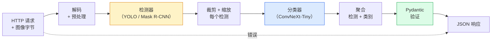

# 构建完整视觉流水线：综合项目

> 生产视觉系统是一串由数据契约缝合的模型和规则。本阶段已经具备零件；综合项目将它们端到端接线。

**类型：** 构建  
**学习实现：** Python  
**前置课程：** Phase 4 第 01–15 课  
**预计时间：** 约 120 分钟

## 学习目标

- 设计一个能检测对象、对其分类并输出结构化 JSON 的生产视觉流水线，处理每一条失败路径。
- 将检测器（Mask R-CNN 或 YOLO）、分类器（ConvNeXt-Tiny）和数据契约（Pydantic）接入同一服务。
- 对端到端流水线做基准测试，并识别第一个瓶颈（通常是预处理，其次是检测器）。
- 交付一个最小 FastAPI 服务：接受图像上传、运行流水线、返回附带分类的检测结果。

## 问题

单个视觉模型很有用；视觉产品则是一串模型。零售货架审计是检测器加商品分类器加价格 OCR 流水线；自动驾驶是 2D 检测器加 3D 检测器加分割器加跟踪器加规划器；医疗预筛查是分割器加区域分类器加临床医生 UI。

把这些链条接起来，是区分 ML 原型与产品的部分。模型间的每个接口都是新 bug 的来源。每次坐标变换、归一化和掩码缩放都可能静默失败。流水线的强度取决于最弱的接口。

本综合项目搭建最小可行流水线：检测 + 分类 + 结构化输出 + 服务层。Phase 4 中的其他内容都能嵌入这副骨架：用 YOLOv8 替换 Mask R-CNN、增加 OCR 头、增加分割分支、增加跟踪器。架构是稳定的，零件可以替换。

## 概念

### 流水线



七个阶段。两个模型阶段很昂贵；另五个阶段才是 bug 出现的地方。

### 使用 Pydantic 的数据契约

每个模型边界都变成一个有类型对象，从而把静默失败转为显式失败。

```text
Detection(
    box: tuple[float, float, float, float],   # (x1, y1, x2, y2), absolute pixels
    score: float,                              # [0, 1]
    class_id: int,                             # from detector's label map
    mask: Optional[list[list[int]]],           # RLE-encoded if present
)

PipelineResult(
    image_id: str,
    detections: list[Detection],
    classifications: list[Classification],
    inference_ms: float,
)
```

当检测器返回 `(cx, cy, w, h)` 盒子而非 `(x1, y1, x2, y2)` 时，Pydantic 验证会在边界处失败。你会立即发现问题，而不是在下游调试静默返回空区域的裁剪。

### 延迟去了哪里

几乎每条视觉流水线都满足三条事实：

1. **预处理经常是最大的单一块。** 解码 JPEG、转换颜色空间、缩放都受 CPU 限制，也很容易被忘记。
2. **检测器主导 GPU 时间。** 70–90% 的 GPU 时间在检测前向传播中。
3. **后处理（NMS、RLE 编码/解码）在 GPU 上便宜、在 CPU 上昂贵。** 始终在实际目标上做性能分析。

了解这个分布，才能把优化转为有优先级的任务清单。

### 失败模式

- **空检测结果**——返回空列表，不能崩溃；记录日志。
- **越界盒子**——裁剪前限制到图像大小。
- **过小裁剪**——小于分类器最小输入的盒子跳过分类。
- **损坏上传**——用具体错误码返回 400，而不是 500。
- **模型加载失败**——在服务启动时失败，而不是在第一个请求时失败。

生产流水线对每一种情况都应有处理，不应写掩盖故障的通用 `try/except`。每种失败都有具名错误码和响应。

### 批处理

生产服务要服务多个客户端。跨请求批量处理检测与分类能提高吞吐量，代价是等待 batch 填满的额外延迟。典型设置是最多收集请求 20ms，然后合批处理并分发响应。`torchserve` 和 `triton` 原生支持；负载可预测的小服务会自行实现微批处理器。

```figure
v4-vision-pipeline
```

## 动手实现

### 步骤 1：数据契约

```python
from pydantic import BaseModel, Field
from typing import List, Optional, Tuple

class Detection(BaseModel):
    box: Tuple[float, float, float, float]
    score: float = Field(ge=0, le=1)
    class_id: int = Field(ge=0)
    mask_rle: Optional[str] = None


class Classification(BaseModel):
    detection_index: int
    class_id: int
    class_name: str
    score: float = Field(ge=0, le=1)


class PipelineResult(BaseModel):
    image_id: str
    detections: List[Detection]
    classifications: List[Classification]
    inference_ms: float
```

五秒钟的代码，可以为任何严肃流水线省下一小时的调试时间。

### 步骤 2：最小 Pipeline 类

```python
import time
import numpy as np
import torch
from PIL import Image

class VisionPipeline:
    def __init__(self, detector, classifier, class_names,
                 device="cpu", min_crop=32):
        self.detector = detector.to(device).eval()
        self.classifier = classifier.to(device).eval()
        self.class_names = class_names
        self.device = device
        self.min_crop = min_crop

    def preprocess(self, image):
        """
        image: PIL.Image or np.ndarray (H, W, 3) uint8
        returns: CHW float tensor on device
        """
        if isinstance(image, Image.Image):
            image = np.asarray(image.convert("RGB"))
        tensor = torch.from_numpy(image).permute(2, 0, 1).float() / 255.0
        return tensor.to(self.device)

    @torch.no_grad()
    def detect(self, image_tensor):
        return self.detector([image_tensor])[0]

    @torch.no_grad()
    def classify(self, crops):
        if len(crops) == 0:
            return []
        batch = torch.stack(crops).to(self.device)
        logits = self.classifier(batch)
        probs = logits.softmax(-1)
        scores, cls = probs.max(-1)
        return list(zip(cls.tolist(), scores.tolist()))

    def run(self, image, image_id="anonymous"):
        t0 = time.perf_counter()
        tensor = self.preprocess(image)
        det = self.detect(tensor)

        crops = []
        detections = []
        valid_indices = []
        for i, (box, score, cls) in enumerate(zip(det["boxes"], det["scores"], det["labels"])):
            x1, y1, x2, y2 = [max(0, int(b)) for b in box.tolist()]
            x2 = min(x2, tensor.shape[-1])
            y2 = min(y2, tensor.shape[-2])
            detections.append(Detection(
                box=(x1, y1, x2, y2),
                score=float(score),
                class_id=int(cls),
            ))
            if (x2 - x1) < self.min_crop or (y2 - y1) < self.min_crop:
                continue
            crop = tensor[:, y1:y2, x1:x2]
            crop = torch.nn.functional.interpolate(
                crop.unsqueeze(0),
                size=(224, 224),
                mode="bilinear",
                align_corners=False,
            )[0]
            crops.append(crop)
            valid_indices.append(i)

        class_preds = self.classify(crops)

        classifications = []
        for valid_idx, (cls_id, cls_score) in zip(valid_indices, class_preds):
            classifications.append(Classification(
                detection_index=valid_idx,
                class_id=int(cls_id),
                class_name=self.class_names[cls_id],
                score=float(cls_score),
            ))

        return PipelineResult(
            image_id=image_id,
            detections=detections,
            classifications=classifications,
            inference_ms=(time.perf_counter() - t0) * 1000,
        )
```

每个接口都带类型；每条失败路径都有特定处理决策。

### 步骤 3：接入检测器和分类器

```python
from torchvision.models.detection import maskrcnn_resnet50_fpn_v2
from torchvision.models import convnext_tiny

# Use ImageNet-pretrained weights for a realistic pipeline without training
detector = maskrcnn_resnet50_fpn_v2(weights="DEFAULT")
classifier = convnext_tiny(weights="DEFAULT")
class_names = [f"imagenet_class_{i}" for i in range(1000)]

pipe = VisionPipeline(detector, classifier, class_names)

# Smoke test with a synthetic image
test_image = (np.random.rand(400, 600, 3) * 255).astype(np.uint8)
result = pipe.run(test_image, image_id="demo")
print(result.model_dump_json(indent=2)[:500])
```

### 步骤 4：FastAPI 服务

```python
from fastapi import FastAPI, UploadFile, HTTPException
from io import BytesIO

app = FastAPI()
pipe = None  # initialised on startup

@app.on_event("startup")
def load():
    global pipe
    detector = maskrcnn_resnet50_fpn_v2(weights="DEFAULT").eval()
    classifier = convnext_tiny(weights="DEFAULT").eval()
    pipe = VisionPipeline(detector, classifier, class_names=[f"c{i}" for i in range(1000)])

@app.post("/detect")
async def detect_endpoint(file: UploadFile):
    if file.content_type not in {"image/jpeg", "image/png", "image/webp"}:
        raise HTTPException(status_code=400, detail="unsupported image type")
    data = await file.read()
    try:
        img = Image.open(BytesIO(data)).convert("RGB")
    except Exception:
        raise HTTPException(status_code=400, detail="cannot decode image")
    result = pipe.run(img, image_id=file.filename or "upload")
    return result.model_dump()
```

用 `uvicorn main:app --host 0.0.0.0 --port 8000` 启动；用 `curl -F 'file=@dog.jpg' http://localhost:8000/detect` 测试。

### 步骤 5：对流水线做基准测试

```python
import time

def benchmark(pipe, num_runs=20, image_size=(400, 600)):
    img = (np.random.rand(*image_size, 3) * 255).astype(np.uint8)
    pipe.run(img)  # warm up

    stages = {"preprocess": [], "detect": [], "classify": [], "total": []}
    for _ in range(num_runs):
        t0 = time.perf_counter()
        tensor = pipe.preprocess(img)
        t1 = time.perf_counter()
        det = pipe.detect(tensor)
        t2 = time.perf_counter()
        crops = []
        for box in det["boxes"]:
            x1, y1, x2, y2 = [max(0, int(b)) for b in box.tolist()]
            x2 = min(x2, tensor.shape[-1])
            y2 = min(y2, tensor.shape[-2])
            if (x2 - x1) >= pipe.min_crop and (y2 - y1) >= pipe.min_crop:
                crop = tensor[:, y1:y2, x1:x2]
                crop = torch.nn.functional.interpolate(
                    crop.unsqueeze(0), size=(224, 224), mode="bilinear", align_corners=False
                )[0]
                crops.append(crop)
        pipe.classify(crops)
        t3 = time.perf_counter()
        stages["preprocess"].append((t1 - t0) * 1000)
        stages["detect"].append((t2 - t1) * 1000)
        stages["classify"].append((t3 - t2) * 1000)
        stages["total"].append((t3 - t0) * 1000)

    for stage, times in stages.items():
        times.sort()
        print(f"{stage:12s}  p50={times[len(times)//2]:7.1f} ms  p95={times[int(len(times)*0.95)]:7.1f} ms")
```

CPU 上的典型输出：预处理约 3 ms、检测 300–500 ms、分类 20–40 ms、总计 350–550 ms。GPU 上检测为 20–40 ms，预处理和分类的相对影响会更大。

## 使用现成工具

生产模板收敛为相同结构，并额外包含：

- **模型版本控制**——始终在响应中记录模型名称和权重哈希。
- **每请求 trace ID**——记录每个请求的每阶段时间，以便把慢响应和阶段关联。
- **回退路径**——分类器超时时，返回没有分类的检测结果，而不是让整个请求失败。
- **安全过滤器**——NSFW / PII 过滤器在分类后、响应离开服务前运行。
- **批量端点**——`/detect_batch` 接受图像 URL 列表，用于批量处理。

生产服务中，`torchserve`、Triton Inference Server 和 BentoML 原生处理批处理、版本控制、指标和健康检查。直接运行 `FastAPI` 适合原型和小规模产品。

## 交付产物

本课产出：

- `outputs/prompt-vision-service-shape-reviewer.md`——审查视觉服务代码中的契约/响应形状违例，并指出第一个破坏性 bug 的提示词。
- `outputs/skill-pipeline-budget-planner.md`——给定目标延迟和吞吐量，为每个流水线阶段分配时间预算并标记最先超预算阶段的技能。

## 练习

1. **（简单）** 在任意开放数据集的 10 张图像上运行流水线。报告每阶段平均时间，以及每图检测数量的分布。
2. **（中等）** 给 `Detection` 添加掩码输出字段，并将其编码为 RLE。验证即使一张图有 10 个对象，JSON 仍小于 1MB。
3. **（困难）** 在分类器前增加微批处理器：最多收集裁剪图 10ms，在一次 GPU 调用中全部分类，再按请求返回结果。测量每秒 5 个并发请求时的吞吐增益和新增延迟。

## 关键术语

| 术语 | 常见说法 | 实际含义 |
|------|----------|----------|
| 流水线（Pipeline） | “系统” | 一串有顺序的预处理、推理和后处理步骤；每一对步骤之间有类型化接口 |
| 数据契约（Data contract） | “模式” | 每个阶段输入输出都必须遵循的 Pydantic / dataclass 定义；在边界处捕获集成 bug |
| 预处理（Preprocessing） | “模型之前” | 解码、颜色转换、缩放、归一化；通常是最大的 CPU 时间消耗 |
| 后处理（Postprocessing） | “模型之后” | NMS、掩码缩放、阈值、RLE 编码；GPU 上便宜、CPU 上昂贵 |
| 微批处理器（Microbatcher） | “收集后前向” | 等待固定窗口内多个请求、运行一次批量前向传播的聚合器 |
| Trace ID | “请求 ID” | 在每个阶段记录的每请求标识，便于端到端追踪慢请求 |
| 失败码（Failure code） | “具名错误” | 每种失败类型使用特定错误码而非通用 500；支持客户端重试逻辑 |
| 健康检查（Health check） | “就绪探针” | 报告服务能否响应的廉价端点；负载均衡器依赖它 |

## 延伸阅读

- [Full Stack Deep Learning：Deploying Models](https://fullstackdeeplearning.com/course/2022/lecture-5-deployment/)——生产 ML 部署的经典概览。
- [BentoML 文档](https://docs.bentoml.com)——带批处理、版本控制和指标的服务框架。
- [torchserve 文档](https://pytorch.org/serve/)——PyTorch 官方服务库。
- [NVIDIA Triton Inference Server](https://developer.nvidia.com/triton-inference-server)——支持批处理和多模型的高吞吐服务。
