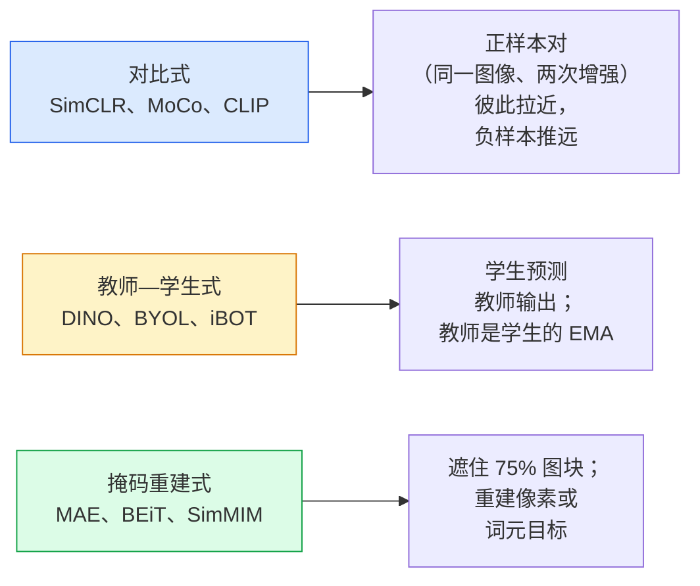

# 自监督视觉：SimCLR、DINO、MAE

> 标签是监督视觉的瓶颈。自监督预训练移除了它：从 1 亿张无标签图像学习视觉特征，再在 1 万张有标签图像上微调。

**类型：** 学习 + 构建  
**学习实现：** Python  
**前置课程：** Phase 4 第 04 课（图像分类）、Phase 4 第 14 课（ViT）  
**预计时间：** 约 75 分钟

## 学习目标

- 追踪三大自监督家族——对比式（SimCLR）、教师—学生式（DINO）、掩码重建式（MAE）——并说明每一种优化什么。
- 从零实现 InfoNCE 损失，并解释为何 batch 为 512 可行而 batch 为 32 会失败。
- 解释 MAE 的 75% 掩码比例并非任意设置，以及它为何与 BERT 面向文本的 15% 不同。
- 使用 DINOv2 或 MAE ImageNet checkpoint 做线性探测和零样本检索。

## 问题

监督式 ImageNet 含有 130 万张带标签图像，估计标注成本为 1000 万美元。医疗和工业数据集更小，标注成本也更高。每个视觉团队都在问：能否先在便宜的无标签数据——YouTube 帧、网络爬取、网络摄像头录像、卫星扫描——上预训练，再在少量有标签集上微调？

自监督学习给出了答案。现代自监督 ViT 在 LAION 或 JFT 上训练后微调，其 ImageNet 准确率可达到或超过监督式方法。它也比监督预训练更容易迁移到下游任务（检测、分割、深度）。DINOv2（Meta，2023）和 MAE（Meta，2022）是当前可迁移视觉特征的生产默认方案。

概念上的变化在于，预文本任务——训练模型做的事——不必是下游任务。重要的是它迫使模型学习有用特征。预测灰度图的颜色、旋转图像并让模型分类旋转角度、遮住图块并重建它们，都曾奏效。能够扩展的三种方法是对比学习、教师—学生蒸馏和掩码重建。

## 概念

### 三个家族



### 对比学习（SimCLR）

取一张图像，施加两次随机增强，得到两个视图。将二者送入同一编码器和投影头。最小化这样一个损失：“这两个嵌入应彼此接近”，而“该嵌入应远离 batch 中其他所有图像的嵌入”。

```text
批次中 2N 个视图内，正样本对 (z_i, z_j) 的损失：

   L_ij = -log( exp(sim(z_i, z_j) / tau) / sum_k in batch \ {i} exp(sim(z_i, z_k) / tau) )

sim = 余弦相似度
tau = 温度（标准值 0.1）
```

这项损失称为 InfoNCE。每个正样本需要许多负样本，因此 batch 大小很重要——SimCLR 需要 512–8192。MoCo 引入过去 batch 的动量队列，使负样本数量与 batch 大小解耦。

### 教师—学生式（DINO）

两个架构相同的网络：学生和教师。教师是学生权重的指数移动平均（EMA）。二者都看到图像的增强视图，学生输出被训练为匹配教师输出——没有显式负样本。

```text
loss = CE( student_output(view_1),  teacher_output(view_2) )
     + CE( student_output(view_2),  teacher_output(view_1) )

teacher_weights = m * teacher_weights + (1 - m) * student_weights   (m ≈ 0.996)
```

它为何不会坍塌为“预测一个常数”？教师输出会先中心化（减去每维均值），再锐化（除以较小温度）。中心化防止一个维度主导；锐化防止输出坍塌为均匀分布。

DINOv2 将 DINO 扩展到 1.42 亿张经过筛选的图像。所得特征是当前零样本视觉检索和稠密预测的 SOTA。

### 掩码重建（MAE）

遮住 ViT 输入图块的 75%，仅将可见的 25% 送入编码器。一个小解码器接收编码器输出和掩码位置上的 mask 词元，并被训练来重建被遮住图块的像素。

```text
编码器：可见的 25% 图块 -> 特征
解码器：特征 + 掩码位置的掩码词元 -> 重建像素
损失：仅在被遮住图块上，重建像素与原始像素之间的 MSE
```

令 MAE 有效的关键设计：

- **75% 掩码比例**——很高。它迫使编码器学习语义特征；重建 25% 几乎是小菜一碟（相邻像素高度相关，CNN 就可轻松完成）。
- **非对称编码器/解码器**——大型 ViT 编码器只看可见图块；小解码器（8 层、512 维）处理重建。预训练速度比朴素 BEiT 快 3 倍。
- **像素空间重建目标**——比 BEiT 的词元化目标更简单，且对 ViT 表现更好。

预训练后丢弃解码器，编码器就是特征提取器。

### 为什么是 75% 而不是 15%

BERT 遮住 15% 词元，MAE 遮住 75%。差异来自信息密度。

- 自然语言的每个词元熵很高。预测 15% 词元仍然困难，因为每个被遮位置都有很多合理补全。
- 图像图块熵较低——未遮住的邻域通常几乎能精确决定被遮图块的像素。为了让预测需要语义理解，必须激进地遮住。

75% 足够高，简单的空间外推无法解决任务；编码器必须表示图像内容。

### 线性探测评估

自监督预训练后，标准评估是**线性探测（linear probe）**：冻结编码器，仅在 ImageNet 标签上训练一个线性分类器，报告 top-1 准确率。

- SimCLR ResNet-50：约 71%（2020）
- DINO ViT-S/16：约 77%（2021）
- MAE ViT-L/16：约 76%（2022）
- DINOv2 ViT-g/14：约 86%（2023）

线性探测是特征质量的纯度量；微调通常增加 2–5 个点，但也混入了分类头再训练的影响。

```figure
data-augmentation
```

## 动手实现

### 步骤 1：双视图增强流水线

```python
import torch
import torchvision.transforms as T

two_view_train = lambda: T.Compose([
    T.RandomResizedCrop(96, scale=(0.2, 1.0)),
    T.RandomHorizontalFlip(),
    T.ColorJitter(0.4, 0.4, 0.4, 0.1),
    T.RandomGrayscale(p=0.2),
    T.ToTensor(),
])


class TwoViewDataset(torch.utils.data.Dataset):
    def __init__(self, base):
        self.base = base
        self.aug = two_view_train()

    def __len__(self):
        return len(self.base)

    def __getitem__(self, i):
        img, _ = self.base[i]
        v1 = self.aug(img)
        v2 = self.aug(img)
        return v1, v2
```

每个 `__getitem__` 返回同一图像的两个增强视图；不需要标签。

### 步骤 2：InfoNCE 损失

```python
import torch.nn.functional as F

def info_nce(z1, z2, tau=0.1):
    """
    z1, z2: (N, D) L2-normalised embeddings of paired views
    """
    N, D = z1.shape
    z = torch.cat([z1, z2], dim=0)  # (2N, D)
    sim = z @ z.T / tau              # (2N, 2N)

    mask = torch.eye(2 * N, dtype=torch.bool, device=z.device)
    sim = sim.masked_fill(mask, float("-inf"))

    targets = torch.cat([torch.arange(N, 2 * N), torch.arange(0, N)]).to(z.device)
    return F.cross_entropy(sim, targets)
```

调用前对嵌入做 L2 归一化。`tau=0.1` 是 SimCLR 默认值；更低温度使损失更尖锐，也需要更多负样本。

### 步骤 3：合理性检查 InfoNCE

```python
z1 = F.normalize(torch.randn(16, 32), dim=-1)
z2 = z1.clone()
loss_same = info_nce(z1, z2, tau=0.1).item()
z2_random = F.normalize(torch.randn(16, 32), dim=-1)
loss_random = info_nce(z1, z2_random, tau=0.1).item()
print(f"InfoNCE with identical pairs:  {loss_same:.3f}")
print(f"InfoNCE with random pairs:     {loss_random:.3f}")
```

相同对应该给出低损失（大 batch、低温度时接近 0）；随机对在 16 对 batch 下应给出 `log(2N-1) = ~log(31) = ~3.4`。

### 步骤 4：MAE 风格掩码

```python
def random_mask_indices(num_patches, mask_ratio=0.75, seed=0):
    g = torch.Generator().manual_seed(seed)
    n_keep = int(num_patches * (1 - mask_ratio))
    perm = torch.randperm(num_patches, generator=g)
    visible = perm[:n_keep]
    masked = perm[n_keep:]
    return visible.sort().values, masked.sort().values


num_patches = 196
visible, masked = random_mask_indices(num_patches, mask_ratio=0.75)
print(f"visible: {len(visible)} / {num_patches}")
print(f"masked:  {len(masked)} / {num_patches}")
```

简单、快速，并且给定种子时是确定性的。真实 MAE 实现会将其批处理，并保留每个样本的掩码。

## 使用现成工具

2026 年，DINOv2 是生产标准：

```python
import torch
from transformers import AutoImageProcessor, AutoModel

processor = AutoImageProcessor.from_pretrained("facebook/dinov2-base")
model = AutoModel.from_pretrained("facebook/dinov2-base")
model.eval()

# Per-image embeddings for zero-shot retrieval
with torch.no_grad():
    inputs = processor(images=[pil_image], return_tensors="pt")
    outputs = model(**inputs)
    embedding = outputs.last_hidden_state[:, 0]  # CLS token
```

所得 768 维嵌入是现代图像检索、稠密对应和零样本迁移流水线的骨干。下游任务的微调很少需要超过一个线性头。

图像—文本嵌入可使用等价的 SigLIP 或 OpenCLIP；MAE 风格微调时，`timm` 仓库提供每种 MAE checkpoint。

## 交付产物

本课产出：

- `outputs/prompt-ssl-pretraining-picker.md`——根据数据集大小、计算资源和下游任务选择 SimCLR / MAE / DINOv2 的提示词。
- `outputs/skill-linear-probe-runner.md`——为任意冻结编码器 + 带标签数据集编写线性探测评估的技能。

## 练习

1. **（简单）** 验证对齐良好的嵌入在降低温度时 InfoNCE 损失下降，而随机嵌入在降低温度时损失上升。绘制 `tau in [0.05, 0.1, 0.2, 0.5]` 与损失的关系图。
2. **（中等）** 实现 DINO 风格的中心缓冲区，展示没有中心化时学生会在数个 epoch 内坍塌为常量向量。
3. **（困难）** 以第 10 课的 TinyUNet 为骨干，在 CIFAR-100 上训练 MAE。报告第 10、50 和 200 个 epoch 的线性探测准确率。证明同一 1000 张图子集上，MAE 预训练的线性探测优于从零开始的监督线性探测。

## 关键术语

| 术语 | 常见说法 | 实际含义 |
|------|----------|----------|
| 自监督（Self-supervised） | “无标签” | 从无标签数据产生有用表示的预文本任务 |
| 预文本任务（Pretext task） | “伪任务” | SSL 中使用的目标（重建图块、匹配视图）；预训练后丢弃 |
| 线性探测（Linear probe） | “冻结编码器 + 线性头” | 标准 SSL 评估：只在冻结特征上训练线性分类器 |
| InfoNCE | “对比损失” | 对余弦相似度做 softmax；正样本对是目标类别，其他全部是负样本 |
| EMA 教师 | “移动平均教师” | 权重是学生指数移动平均的教师；BYOL、MoCo、DINO 均使用 |
| 掩码比例（Mask ratio） | “被隐藏图块的百分比” | MAE 中被遮住的图块比例；视觉为 75%，文本为 15% |
| 表示坍塌（Representation collapse） | “常量输出” | 编码器为所有输入输出同一向量的 SSL 失败；由中心化、锐化或负样本防止 |
| DINOv2 | “生产 SSL 骨干” | Meta 2023 年的自监督 ViT；2026 年最强的通用图像特征之一 |

## 延伸阅读

- [SimCLR（Chen 等，2020）](https://arxiv.org/abs/2002.05709)——对比学习参考。
- [DINO（Caron 等，2021）](https://arxiv.org/abs/2104.14294)——动量、中心化、锐化的教师—学生方法。
- [MAE（He 等，2022）](https://arxiv.org/abs/2111.06377)——面向 ViT 的掩码自编码器预训练。
- [DINOv2（Oquab 等，2023）](https://arxiv.org/abs/2304.07193)——将自监督 ViT 扩展为生产特征。
