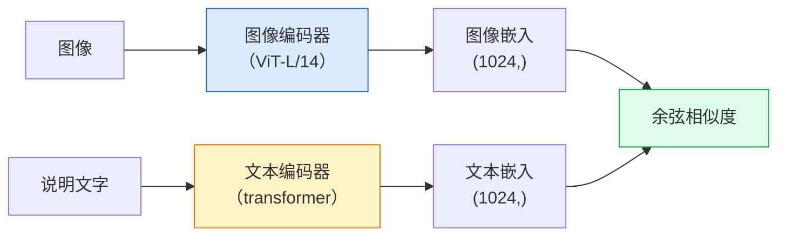

# 开放词汇视觉：CLIP

> 共同训练图像编码器与文本编码器，让匹配的图像和说明文字在共享空间中彼此接近。

**类型：** 构建 + 使用  
**学习实现：** Python  
**前置课程：** Phase 4 第 14 课（ViT）、Phase 4 第 17 课（自监督）  
**预计时间：** 约 45 分钟

## 学习目标

- 解释 CLIP 的双塔架构和对比训练目标。
- 使用预训练 CLIP（或 SigLIP）进行零样本分类，无需任何任务特定训练。
- 从零实现零样本分类：编码类别提示词、计算余弦相似度、取 argmax。
- 区分 CLIP、SigLIP、OpenCLIP 和 LLaVA/LLaMA-vision 模型，并了解它们在 2026 年各自的用途。

## 问题

传统分类器是封闭词汇（closed-vocabulary）的：1000 类 ImageNet 模型只能预测那 1000 个标签。每个新类别都需要带标签数据和重新训练的分类头。

CLIP（Radford 等，OpenAI，2021）表明：在从网络爬取的 4 亿个（图像、说明文字）对上训练，可得到一个能在推理时分类到任意类别集合的模型，类别只需用自然语言描述。写一句话，就能给它一个新类别。

零样本迁移使 CLIP 家族 checkpoint 成为许多现代视觉系统的起点。CLIP 风格的联合嵌入被用于检测（Grounding DINO、OWL-ViT）、分割（CLIPSeg、SAM）、检索、内容审核、VLM 和文生图等任务或系统。

## 概念

### 双塔



两个编码器最后都用线性投影到相同嵌入维度（CLIP-B/32 为 512，CLIP-L/14 为 1024），再做 L2 归一化并计算余弦相似度。

### 目标函数

给定 N 个（图像、说明文字）对的 batch，构建 NxN 相似度矩阵。训练两个编码器，使对角线（匹配对）相似度高、非对角线（不匹配对）相似度低。

```text
sim_matrix = image_embeddings @ text_embeddings.T / tau

loss_i2t = cross_entropy(sim_matrix,       targets=arange(N))
loss_t2i = cross_entropy(sim_matrix.T,     targets=arange(N))
loss = (loss_i2t + loss_t2i) / 2
```

它是对称的，因为图像到文本和文本到图像检索都应有效。`tau`（温度）通常作为标量参数学习，初始化为 0.07。

### SigLIP：更好的损失

SigLIP（Zhai 等，2023）用逐对 sigmoid 取代 softmax：

```text
loss = mean over pairs of log(1 + exp(-y_ij * sim_ij))
y_ij = +1 if matching, -1 otherwise
```

逐对损失移除了 CLIP 所需的 batch 级归一化。SigLIP 在小 batch 上训练更好，在同等数据量下可匹敌或超越 CLIP。

### 零样本分类

给定一个训练好的 CLIP：

1. 对每个类别组成提示词：`"a photo of a {class}"`。
2. 用文本编码器编码所有类别提示词 → `T` 的形状为 `(C, d)`。
3. 编码测试图像 → `I` 的形状为 `(1, d)`。
4. 相似度 = `I @ T.T`，形状为 `(1, C)`。
5. Argmax → 预测类别。

提示词工程很重要。OpenAI 为 ImageNet 发布了 80 个提示词模板（`"a photo of a {}"`、`"a blurry photo of a {}"`、`"a sketch of a {}"` 等）。对每个类别的全部模板嵌入取平均，可额外增加 1–3% top-1 准确率。

### 2026 年 CLIP 风格模型的用途

- **零样本分类**——直接使用。
- **图像检索**——图像只编码一次，推理时嵌入查询。
- **文本条件检测**——Grounding DINO、OWL-ViT 将 CLIP 文本塔包在检测器周围。
- **文本条件分割**——CLIPSeg；SAM 通过 CLIP 使用文本提示输入。
- **VLM**——LLaVA、Qwen-VL、InternVL 将 CLIP 家族视觉编码器接入 LLM。
- **文生图**——Stable Diffusion、DALL-E 3 以 CLIP 文本嵌入作为条件。

一旦拥有共享嵌入空间，每项视觉 + 语言任务都会变成距离计算。

```figure
clip-contrastive
```

## 动手实现

### 步骤 1：微型双塔模型

真实 CLIP 是 ViT + transformer。本课中，这两个塔是在预提取特征上运行的小 MLP，因此可在 CPU 上看清训练信号。

```python
import torch
import torch.nn as nn
import torch.nn.functional as F


class TwoTower(nn.Module):
    def __init__(self, img_in=128, txt_in=64, emb=64):
        super().__init__()
        self.image_proj = nn.Sequential(nn.Linear(img_in, 128), nn.ReLU(), nn.Linear(128, emb))
        self.text_proj = nn.Sequential(nn.Linear(txt_in, 128), nn.ReLU(), nn.Linear(128, emb))
        self.logit_scale = nn.Parameter(torch.ones([]) * 2.6592)  # ln(1/0.07)

    def forward(self, img_feats, txt_feats):
        i = F.normalize(self.image_proj(img_feats), dim=-1)
        t = F.normalize(self.text_proj(txt_feats), dim=-1)
        return i, t, self.logit_scale.exp()
```

两次投影、共享维度输出、可学习温度；形状与真实 CLIP API 一致。

### 步骤 2：对比损失

```python
def clip_loss(image_emb, text_emb, logit_scale):
    N = image_emb.size(0)
    sim = logit_scale * image_emb @ text_emb.T
    targets = torch.arange(N, device=sim.device)
    l_i = F.cross_entropy(sim, targets)
    l_t = F.cross_entropy(sim.T, targets)
    return (l_i + l_t) / 2
```

对称。更大的 logit_scale = 更尖锐的 softmax = 更自信，但也有不稳定风险。

### 步骤 3：零样本分类器

```python
@torch.no_grad()
def zero_shot_classify(model, image_feats, class_text_feats, class_names):
    """
    image_feats:      (N, img_in)
    class_text_feats: (C, txt_in)   one averaged embedding per class
    """
    i = F.normalize(model.image_proj(image_feats), dim=-1)
    t = F.normalize(model.text_proj(class_text_feats), dim=-1)
    sim = i @ t.T
    pred = sim.argmax(dim=-1)
    return [class_names[p] for p in pred.tolist()]
```

每步一行。这正是使用生产 CLIP checkpoint 的零样本过程。

### 步骤 4：合理性检查

```python
torch.manual_seed(0)
model = TwoTower()

img = torch.randn(8, 128)
txt = torch.randn(8, 64)
i, t, scale = model(img, txt)
loss = clip_loss(i, t, scale)
print(f"batch size: {i.size(0)}   loss: {loss.item():.3f}")
```

随机初始化模型的损失应接近 `log(N) = log(8) = 2.08`——尚未学到结构时，对称交叉熵的目标值。

## 使用现成工具

OpenCLIP 是 2026 年社区默认选择：

```python
import open_clip
import torch
from PIL import Image

model, _, preprocess = open_clip.create_model_and_transforms("ViT-B-32", pretrained="laion2b_s34b_b79k")
tokenizer = open_clip.get_tokenizer("ViT-B-32")

image = preprocess(Image.open("dog.jpg")).unsqueeze(0)
text = tokenizer(["a photo of a dog", "a photo of a cat", "a photo of a car"])

with torch.no_grad():
    image_features = model.encode_image(image)
    text_features = model.encode_text(text)
    image_features = image_features / image_features.norm(dim=-1, keepdim=True)
    text_features = text_features / text_features.norm(dim=-1, keepdim=True)
    probs = (100.0 * image_features @ text_features.T).softmax(dim=-1)

print(probs)
```

SigLIP 更新、在小规模训练上更好，适合新项目：`google/siglip-base-patch16-224`。Hugging Face 同时提供二者。

## 交付产物

本课产出：

- `outputs/prompt-zero-shot-class-picker.md`——给定类别列表和领域，为零样本 CLIP 设计类别模板的提示词。
- `outputs/skill-image-text-retriever.md`——使用任意 CLIP checkpoint 构建图像嵌入索引，支持按文本和按图像查询的技能。

## 练习

1. **（简单）** 使用预训练 OpenCLIP ViT-B/32，并用 80 模板提示词集在 CIFAR-10 上做零样本分类。报告 top-1 准确率；应在约 85–90%。
2. **（中等）** 在同一 CIFAR-10 任务上比较单模板（`"a photo of a {}"`）和 80 模板平均嵌入。量化差距并解释模板为何有帮助。
3. **（困难）** 构建零样本图像检索索引：用 CLIP 嵌入 1000 张图像，构建 FAISS 索引，用自然语言描述查询。报告你手写的 20 个保留查询的 recall@5。

## 关键术语

| 术语 | 常见说法 | 实际含义 |
|------|----------|----------|
| 双塔（Two-tower） | “双编码器” | 独立的图像和文本编码器，末端使用共享维度投影头 |
| 零样本（Zero-shot） | “没有任务特定训练” | 在推理时仅通过文本描述的类别分类；不接触标签 |
| 温度 / logit_scale | “tau” | 在 softmax 前缩放相似度矩阵的可学习标量 |
| 提示词模板（Prompt template） | “A photo of a {}” | 围绕类别名称的自然语言外壳；平均多个模板能提高零样本准确率 |
| CLIP | “图像 + 文本模型” | OpenAI 2021 年模型；2026 年本领域的词汇基础 |
| SigLIP | “Sigmoid CLIP” | 用逐对 sigmoid 取代 softmax；小 batch 训练更好 |
| OpenCLIP | “开放复现” | 在 LAION 上社区训练的 CLIP 变体；开源流水线的生产默认选择 |
| VLM | “视觉语言模型” | CLIP 家族编码器加 LLM，训练用于回答有关图像的问题 |

## 延伸阅读

- [CLIP：Learning Transferable Visual Models from Natural Language Supervision（Radford 等，2021）](https://arxiv.org/abs/2103.00020)
- [SigLIP：Sigmoid Loss for Language-Image Pre-Training（Zhai 等，2023）](https://arxiv.org/abs/2303.15343)
- [OpenCLIP](https://github.com/mlfoundations/open_clip)——社区代码库。
- [DINOv2、CLIP 与 MAE：特征比较](https://huggingface.co/blog/dinov2)——HF 的并列用例指南。
