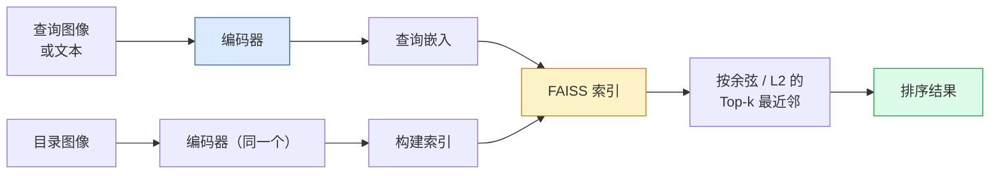

# 图像检索与度量学习

> 检索系统按嵌入空间中的距离对候选项排序。度量学习是一门塑造该空间、让距离表达你所需含义的学问。

**类型：** 构建  
**学习实现：** Python  
**前置课程：** Phase 4 第 14 课（ViT）、Phase 4 第 18 课（CLIP）  
**预计时间：** 约 45 分钟

## 学习目标

- 解释三元组、对比和基于代理的度量学习损失，并为给定数据集选择正确的一种。
- 正确实现 L2 归一化与余弦相似度，并审计“同一物品”和“同一类别”检索的差别。
- 构建 FAISS 索引，按文本和图像查询，并为保留查询集报告 recall@K。
- 使用 DINOv2、CLIP 和 SigLIP 作为现成嵌入骨干，并知道各自适合何时。

## 问题

检索在生产视觉中无处不在：重复检测、以图搜图、视觉搜索（“寻找相似商品”）、人脸重识别、监控中的行人重识别、电商的实例级匹配。产品问题总是相同的：“给定这张查询图像，给我的目录排序。”

两个设计决策塑造整个系统：嵌入，即哪个模型产生向量；索引，即如何大规模寻找最近邻。到 2026 年，二者都是商品化能力（DINOv2 负责嵌入、FAISS 负责索引），因此门槛更高：难点在于定义你的应用中*什么算相似*，再塑造嵌入空间使距离匹配定义。

这种塑造就是度量学习。它很小，却杠杆极高。

## 概念

### 一览检索流程



### 四类损失

| 损失 | 需要 | 优点 | 缺点 |
|------|------|------|------|
| **对比式** | （锚点、正样本）+ 负样本 | 简单，适用于任意成对标签 | 没有许多负样本时收敛慢 |
| **三元组** | （锚点、正样本、负样本） | 直观；直接控制边际 | 难三元组挖掘昂贵 |
| **NT-Xent / InfoNCE** | 成对样本 + batch 挖掘的负样本 | 可扩展至大 batch | 需要大 batch 或动量队列 |
| **基于代理（ProxyNCA）** | 仅类别标签 | 快、稳定、不需挖掘 | 小数据集上可能过拟合代理 |

多数生产用例中，先用预训练骨干；仅当现成嵌入在测试集上表现不足时，才增加度量学习微调。

### 三元组损失的形式

```text
L = max(0, ||f(a) - f(p)||^2 - ||f(a) - f(n)||^2 + margin)
```

将锚点 `a` 拉近正样本 `p`，推远负样本 `n`；`margin` 确保两者间隔。三张图的结构可推广到任意相似度排序。

挖掘很重要：简单三元组（`n` 已经远离 `a`）损失为零；只有困难三元组会教会网络。半困难挖掘（`n` 比 `p` 更远但仍在 margin 内）是 2016 年 FaceNet 配方，至今仍占主导。

### 余弦相似度与 L2

两种度量，两种约定：

- **余弦**：向量间夹角。要求 L2 归一化嵌入。
- **L2**：欧氏距离。可用于原始或归一化嵌入，但通常与 L2 归一化 + 平方 L2 配对。

对多数现代网络，二者等价：当 `||a|| = ||b|| = 1` 时，`||a - b||^2 = 2 - 2 cos(a, b)`。选择与嵌入训练匹配的约定；混用会静默改变“最近”的含义。

### Recall@K

标准检索指标：

```text
recall@K = 至少一个正确匹配位于前 K 个结果中的查询所占比例
```

并列报告 recall@1、@5、@10。recall@10 高于 0.95 而 recall@1 低于 0.5，意味着嵌入空间结构正确、排序却有噪声——尝试更长微调或重排序步骤。

对于重复检测，precision@K 更重要，因为每个假正例都是用户可见的错误；对于视觉搜索，recall@K 才是产品信号。

### 用一段话理解 FAISS

Facebook AI Similarity Search，是最近邻搜索的事实标准库。三种索引选择：

- `IndexFlatIP` / `IndexFlatL2`——暴力精确搜索，不需训练；适用于约 100 万向量以内。
- `IndexIVFFlat`——将空间划分为 K 个单元，只搜索最近几个单元；近似、快速，需要训练数据。
- `IndexHNSW`——图式索引，多查询最快，索引尺寸较大。

10 万向量大概适合在余弦相似度上使用 `IndexFlatIP`；1000 万适合 `IndexIVFFlat`；1 亿以上则结合产品量化（`IndexIVFPQ`）。

### 实例级与类别级检索

同名的两种截然不同的问题：

- **类别级**——“在目录中找猫。”条件于类别的相似性；现成 CLIP / DINOv2 嵌入表现良好。
- **实例级**——“在目录中找*这个确切商品*。”需要在同类的视觉相似物间进行细粒度判别；现成嵌入表现不足，度量学习微调很重要。

选择模型前，始终先问你正在解决哪一个。

```figure
metric-embedding
```

## 动手实现

### 步骤 1：三元组损失

```python
import torch
import torch.nn.functional as F

def triplet_loss(anchor, positive, negative, margin=0.2):
    d_ap = F.pairwise_distance(anchor, positive, p=2)
    d_an = F.pairwise_distance(anchor, negative, p=2)
    return F.relu(d_ap - d_an + margin).mean()
```

一行，适用于 L2 归一化或原始嵌入。

### 步骤 2：半困难挖掘

给定一个嵌入和标签 batch，为每个锚点寻找最困难的半困难负样本。

```python
def semi_hard_negatives(emb, labels, margin=0.2):
    dist = torch.cdist(emb, emb)
    same_class = labels[:, None] == labels[None, :]
    diff_class = ~same_class
    N = emb.size(0)

    positives = dist.clone()
    positives[~same_class] = float("-inf")
    positives.fill_diagonal_(float("-inf"))
    pos_idx = positives.argmax(dim=1)

    semi_hard = dist.clone()
    semi_hard[same_class] = float("inf")
    d_ap = dist[torch.arange(N), pos_idx].unsqueeze(1)
    semi_hard[dist <= d_ap] = float("inf")
    neg_idx = semi_hard.argmin(dim=1)

    fallback_mask = semi_hard[torch.arange(N), neg_idx] == float("inf")
    if fallback_mask.any():
        hardest = dist.clone()
        hardest[same_class] = float("inf")
        neg_idx = torch.where(fallback_mask, hardest.argmin(dim=1), neg_idx)
    return pos_idx, neg_idx
```

每个锚点得到类别内最困难正样本，以及比正样本更远但仍在 margin 内的半困难负样本。

### 步骤 3：Recall@K

```python
def recall_at_k(query_emb, gallery_emb, query_labels, gallery_labels, k=1):
    sim = query_emb @ gallery_emb.T
    _, top_k = sim.topk(k, dim=-1)
    matches = (gallery_labels[top_k] == query_labels[:, None]).any(dim=-1)
    return matches.float().mean().item()
```

在 L2 归一化嵌入上，按内积的 top-k 等于按余弦的 top-k。报告至少有一个正确邻居的查询平均比例。

### 步骤 4：将其组合

```python
import torch
import torch.nn as nn
from torch.optim import Adam

class Encoder(nn.Module):
    def __init__(self, in_dim=128, emb_dim=64):
        super().__init__()
        self.net = nn.Sequential(
            nn.Linear(in_dim, 128), nn.ReLU(),
            nn.Linear(128, emb_dim),
        )

    def forward(self, x):
        return F.normalize(self.net(x), dim=-1)

torch.manual_seed(0)
num_classes = 6
protos = F.normalize(torch.randn(num_classes, 128), dim=-1)

def sample_batch(bs=32):
    labels = torch.randint(0, num_classes, (bs,))
    x = protos[labels] + 0.15 * torch.randn(bs, 128)
    return x, labels

enc = Encoder()
opt = Adam(enc.parameters(), lr=3e-3)

for step in range(200):
    x, y = sample_batch(32)
    emb = enc(x)
    pos_idx, neg_idx = semi_hard_negatives(emb, y)
    loss = triplet_loss(emb, emb[pos_idx], emb[neg_idx])
    opt.zero_grad(); loss.backward(); opt.step()
```

数百步之后，嵌入会为每个类别形成一个簇。

## 使用现成工具

2026 年的生产技术栈：

- **DINOv2 + FAISS**——通用视觉检索，开箱即用。
- **CLIP + FAISS**——查询是文本时使用。
- **微调的 DINOv2 + FAISS**——实例级检索、人脸重识别、时尚、电商。
- **Milvus / Weaviate / Qdrant**——围绕 FAISS 或 HNSW 的托管向量数据库封装。

实例检索 SOTA 配方是：DINOv2 骨干，加嵌入头，在实例标注对上用三元组或 InfoNCE 损失微调，并索引到 FAISS。

## 交付产物

本课产出：

- `outputs/prompt-retrieval-loss-picker.md`——为指定检索问题选择 triplet / InfoNCE / ProxyNCA 的提示词。
- `outputs/skill-recall-at-k-runner.md`——为 recall@K 编写整洁评估工具的技能，含训练/验证/图库划分和正确数据契约。

## 练习

1. **（简单）** 运行上方玩具示例，训练前后用 PCA 绘制嵌入，观察六个簇形成。
2. **（中等）** 实现 ProxyNCA 损失：每类一个可学习“代理”，对余弦相似度做标准交叉熵。在玩具数据上比较它与三元组损失的收敛速度。
3. **（困难）** 取 1000 张 ImageNet 验证图，用 HuggingFace 的 DINOv2 嵌入，构建 FAISS 平面索引；以相同图作为查询报告 recall@`{1, 5, 10}`（应为 1.0），并以 ImageNet 标签为真值对保留划分报告指标。

## 关键术语

| 术语 | 常见说法 | 实际含义 |
|------|----------|----------|
| 度量学习（Metric learning） | “塑造空间” | 训练编码器，使输出空间中的距离反映目标相似性 |
| 三元组损失（Triplet loss） | “拉与推” | `L = max(0, d(a, p) - d(a, n) + margin)`；规范的度量学习损失 |
| 半困难挖掘（Semi-hard mining） | “有用负样本” | 比正样本离锚点更远、但在 margin 内的负样本；经验上信息量最大 |
| 基于代理的损失 | “类别原型” | 每类一个可学习代理；对相似度到代理做交叉熵；不需成对挖掘 |
| Recall@K | “Top-K 命中率” | 前 K 个结果至少有一个正确结果的查询比例 |
| 实例检索（Instance retrieval） | “找到这个确切物体” | 细粒度匹配；现成特征通常表现不足 |
| FAISS | “最近邻库” | Facebook 的最近邻库；支持精确和近似索引 |
| HNSW | “图索引” | 分层可导航小世界；低内存开销下快速近似最近邻 |

## 延伸阅读

- [FaceNet：A Unified Embedding for Face Recognition（Schroff 等，2015）](https://arxiv.org/abs/1503.03832)——三元组损失 / 半困难挖掘论文。
- [In Defense of the Triplet Loss for Person Re-Identification（Hermans 等，2017）](https://arxiv.org/abs/1703.07737)——三元组微调实用指南。
- [FAISS 文档](https://github.com/facebookresearch/faiss/wiki)——每种索引和权衡。
- [SMoT：Metric Learning Taxonomy（Kim 等，2021）](https://arxiv.org/abs/2010.06927)——现代损失及其联系的综述。
