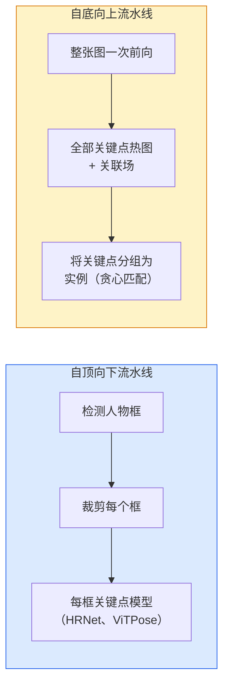

# 关键点检测与姿态估计

> 姿态是一组有序关键点；关键点检测器是热图回归器。其余都是簿记工作。

**类型：** 构建  
**学习实现：** Python  
**前置课程：** Phase 4 第 06 课（检测）、Phase 4 第 07 课（U-Net）  
**预计时间：** 约 45 分钟

## 学习目标

- 区分自顶向下和自底向上的姿态估计，并说明各自适用场景。
- 为 K 个关键点回归热图，以每关键点一个高斯目标，并在推理时提取关键点坐标。
- 解释部分亲和场（PAF）以及自底向上流水线如何将关键点关联为实例。
- 使用 MediaPipe Pose 或 MMPose 进行生产关键点估计，并理解其输出格式。

## 问题

关键点任务有许多名字：人体姿态（17 个身体关节）、人脸标志点（68 或 478 点）、手部（21 点）、动物姿态、机器人对象姿态、医学解剖标志。它们都有相同结构：检测物体上的 K 个离散点，并输出其 `(x, y)` 坐标。

姿态估计是动作捕捉、健身应用、体育分析、手势控制、动画、AR 试穿和机器人抓取的基础。二维情况已经成熟；三维姿态（由单相机估计世界坐标中的关节位置）是当前研究前沿。

工程问题在于规模。单图、单人的姿态是 20ms 问题；以 30 fps 处理拥挤人群中的多人姿态，则是需要不同架构的另一个问题。

## 概念

### 自顶向下与自底向上



- **自顶向下**——先检测人物，再在每个裁剪图上运行单人关键点模型。准确率最高；成本随人数线性增长。
- **自底向上**——一次前向预测所有关键点和关联场，再分组。无论人群大小，时间恒定。

自顶向下（HRNet、ViTPose）是准确率领跑者；自底向上（OpenPose、HigherHRNet）是在拥挤场景中的吞吐量领跑者。

### 热图回归

不直接回归 `(x, y)`，而是为每个关键点预测一张 `H x W` 热图，真值位置中心为高斯斑点。

```text
target[k, y, x] = exp(-((x - cx_k)^2 + (y - cy_k)^2) / (2 sigma^2))
```

推理时，每张热图的 argmax 就是预测关键点位置。

热图优于直接回归的原因：网络空间结构（卷积特征图）天然对齐空间输出。高斯目标也起正则化作用——较小定位误差产生较小损失，而非零。

### 亚像素定位

Argmax 给出整数坐标。为获得亚像素精度，可对 argmax 及其邻居拟合抛物线，或使用常见偏移方向：`(dx, dy) = 0.25 * (heatmap[y, x+1] - heatmap[y, x-1], ...)`。

### 部分亲和场（PAF）

这是 OpenPose 用于自底向上关联的技巧。对每一对连接关键点（如左肩至左肘），预测一个 2 通道场，编码从一点指向另一点的单位向量。要将肩与肘关联起来，沿候选对连线积分 PAF；积分最高的对被匹配。

```text
对每条连接（肢体）：
  PAF 通道：2（单位向量 x、y）
  线积分：在采样点上求和 (PAF . line_direction)
  更高积分 = 更强匹配
```

优雅地适应任意拥挤程度，无需逐人裁剪。

### COCO 关键点

标准人体姿态数据集：每人 17 个关键点，以 PCK（正确关键点百分比）和 OKS（对象关键点相似度）为指标。OKS 是关键点对应的 IoU，也是 COCO mAP@OKS 报告所用指标。

### 2D 与 3D

- **2D 姿态**——图像坐标；已经达到生产质量（MediaPipe、HRNet、ViTPose）。
- **3D 姿态**——世界 / 相机坐标；仍是活跃研究，常见方法：
  - 用小 MLP 将 2D 预测提升至 3D（VideoPose3D）。
  - 从图像直接 3D 回归（PyMAF、MHFormer）。
  - 多视图设置（CMU Panoptic）获取真值。

```figure
cv3-pose-heatmap
```

## 动手实现

### 步骤 1：高斯热图目标

```python
import numpy as np
import torch

def gaussian_heatmap(size, cx, cy, sigma=2.0):
    yy, xx = np.meshgrid(np.arange(size), np.arange(size), indexing="ij")
    return np.exp(-((xx - cx) ** 2 + (yy - cy) ** 2) / (2 * sigma ** 2)).astype(np.float32)

hm = gaussian_heatmap(64, 32, 32, sigma=2.0)
print(f"peak: {hm.max():.3f} at ({hm.argmax() % 64}, {hm.argmax() // 64})")
```

将每关键点热图沿通道轴堆叠，即得到完整目标张量。

### 步骤 2：微型关键点头

输出 K 个热图通道的 U-Net 风格模型。

```python
import torch.nn as nn
import torch.nn.functional as F

class TinyKeypointNet(nn.Module):
    def __init__(self, num_keypoints=4, base=16):
        super().__init__()
        self.down1 = nn.Sequential(nn.Conv2d(3, base, 3, 2, 1), nn.ReLU(inplace=True))
        self.down2 = nn.Sequential(nn.Conv2d(base, base * 2, 3, 2, 1), nn.ReLU(inplace=True))
        self.mid = nn.Sequential(nn.Conv2d(base * 2, base * 2, 3, 1, 1), nn.ReLU(inplace=True))
        self.up1 = nn.ConvTranspose2d(base * 2, base, 2, 2)
        self.up2 = nn.ConvTranspose2d(base, num_keypoints, 2, 2)

    def forward(self, x):
        h1 = self.down1(x)
        h2 = self.down2(h1)
        h3 = self.mid(h2)
        u1 = self.up1(h3)
        return self.up2(u1)
```

输入 `(N, 3, H, W)`，输出 `(N, K, H, W)`。损失是相对高斯目标的逐像素 MSE。

### 步骤 3：推理——提取关键点坐标

```python
def heatmap_to_coords(heatmaps):
    """
    heatmaps: (N, K, H, W)
    returns:  (N, K, 2) float coordinates in image pixels
    """
    N, K, H, W = heatmaps.shape
    hm = heatmaps.reshape(N, K, -1)
    idx = hm.argmax(dim=-1)
    ys = (idx // W).float()
    xs = (idx % W).float()
    return torch.stack([xs, ys], dim=-1)

coords = heatmap_to_coords(torch.randn(2, 4, 32, 32))
print(f"coords: {coords.shape}")  # (2, 4, 2)
```

推理时只需一行；亚像素精修可在 argmax 周围插值。

### 步骤 4：合成关键点数据集

很简单：在白色画布上绘制四个点，并学习预测它们。

```python
def make_synthetic_sample(size=64):
    img = np.ones((3, size, size), dtype=np.float32)
    rng = np.random.default_rng()
    kps = rng.integers(8, size - 8, size=(4, 2))
    for cx, cy in kps:
        img[:, cy - 2:cy + 2, cx - 2:cx + 2] = 0.0
    hms = np.stack([gaussian_heatmap(size, cx, cy) for cx, cy in kps])
    return img, hms, kps
```

微型模型一分钟内就能学会。

### 步骤 5：训练

```python
model = TinyKeypointNet(num_keypoints=4)
opt = torch.optim.Adam(model.parameters(), lr=3e-3)

for step in range(200):
    batch = [make_synthetic_sample() for _ in range(16)]
    imgs = torch.from_numpy(np.stack([b[0] for b in batch]))
    hms = torch.from_numpy(np.stack([b[1] for b in batch]))
    pred = model(imgs)
    # Upsample pred to full resolution
    pred = F.interpolate(pred, size=hms.shape[-2:], mode="bilinear", align_corners=False)
    loss = F.mse_loss(pred, hms)
    opt.zero_grad(); loss.backward(); opt.step()
```

## 使用现成工具

- **MediaPipe Pose**——Google 生产姿态估计器；提供 WebGL 和移动端运行时，延迟低于 10ms。
- **MMPose**（OpenMMLab）——完整研究代码库；所有 SOTA 架构均有预训练权重。
- **YOLOv8-pose**——单次前向中最快的实时多人姿态。
- **transformers HumanDPT / PoseAnything**——更新的视觉语言方法，支持开放词汇姿态（任意对象、任意关键点集合）。

## 交付产物

本课产出：

- `outputs/prompt-pose-stack-picker.md`——根据延迟、人群大小和 2D/3D 需求选择 MediaPipe / YOLOv8-pose / HRNet / ViTPose 的提示词。
- `outputs/skill-heatmap-to-coords.md`——编写每个生产姿态模型所用亚像素热图到坐标例程的技能。

## 练习

1. **（简单）** 在合成四点数据集上训练微型关键点模型，报告 200 步后预测与真实关键点间的平均 L2 误差。
2. **（中等）** 增加亚像素精修：给定 argmax 位置，从相邻像素沿 x、y 拟合一维抛物线。报告相对整数 argmax 的准确率增益。
3. **（困难）** 构建双人合成数据集，每张图显示两个四关键点模式实例。训练带 PAF 的自底向上流水线，预测哪个关键点属于哪个实例，并评估 OKS。

## 关键术语

| 术语 | 常见说法 | 实际含义 |
|------|----------|----------|
| 关键点（Keypoint） | “标志点” | 物体上的特定有序点（关节、角点、特征） |
| 姿态（Pose） | “骨架” | 属于一个实例的一组有序关键点 |
| 自顶向下 | “先检测再姿态” | 两阶段流水线：人物检测器 + 每裁剪关键点模型；准确率最高 |
| 自底向上 | “先姿态，后分组” | 单次前向预测全部关键点 + 分组；对人群大小恒定时间 |
| 热图（Heatmap） | “高斯目标” | 每关键点一张 H x W 张量，峰值位于真值位置；首选回归目标 |
| PAF | “部分亲和场” | 编码肢体方向的二通道单位向量场；用于把关键点分组为实例 |
| OKS | “关键点 IoU” | 对象关键点相似度；COCO 的姿态指标 |
| HRNet | “高分辨率网络” | 主导的自顶向下关键点架构；全程保留高分辨率特征 |

## 延伸阅读

- [OpenPose（Cao 等，2017）](https://arxiv.org/abs/1812.08008)——使用 PAF 的自底向上方法；至今仍是该方法最佳说明。
- [HRNet（Sun 等，2019）](https://arxiv.org/abs/1902.09212)——自顶向下参考架构。
- [ViTPose（Xu 等，2022）](https://arxiv.org/abs/2204.12484)——普通 ViT 作为姿态骨干；许多基准的当前 SOTA。
- [MediaPipe Pose](https://developers.google.com/mediapipe/solutions/vision/pose_landmarker)——生产实时姿态；2026 年部署最快的技术栈。
