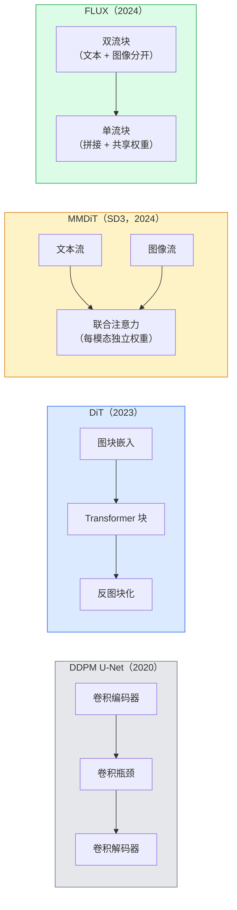

# Diffusion Transformer 与 Rectified Flow

> 现代文生图模型可以用 Transformer 替换 U-Net，并用直线流替换噪声日程；SD3 与 FLUX 都采用这条路线。

**类型：** 学习 + 构建  
**学习实现：** Python  
**前置课程：** Phase 4 第 10 课（扩散 DDPM）、Phase 4 第 14 课（ViT）、Phase 7 第 02 课（自注意力）  
**预计时间：** 约 75 分钟

## 学习目标

- 追踪从 U-Net DDPM（第 10 课）到 Diffusion Transformer（DiT）、MMDiT（SD3）以及单流 + 双流 DiT（FLUX）的演进。
- 解释 rectified flow：为何噪声与数据间的直线轨迹能让模型以 20 步而非 1000 步采样。
- 实现一个微型 DiT 块和 rectified-flow 训练循环，二者均少于 100 行。
- 按架构、参数量和许可证区分模型变体（SD3、FLUX.1-dev、FLUX.1-schnell、Z-Image、Qwen-Image）。

## 问题

第 10 课使用 U-Net 去噪器构建了 DDPM。该配方在 2020–2023 年占主导：U-Net + beta 日程 + 噪声预测损失。它产生了 Stable Diffusion 1.5、2.1 和 DALL-E 2。

到 2026 年，前沿文生图模型已广泛转向 Diffusion Transformer（DiT）。Stable Diffusion 3、FLUX、SD4、Z-Image、Qwen-Image 和 Hunyuan-Image 都不使用 U-Net；SD3 与 FLUX 还以 rectified flow 取代 DDPM 噪声日程，让噪声到数据的路径变直，并通过一致性或蒸馏变体实现 1–4 步推理。

这一转变提高了扩散图像生成的可控性、提示词一致性和推理速度；SD3/SD4 也改善了文字渲染。DiT 与 rectified flow 是理解 2026 年生成图像技术栈的一条关键路线。

## 概念

### 从 U-Net 到 transformer



- **DiT**（Peebles & Xie，2023）——用 latent 图块上的 ViT 类 transformer 替代 U-Net，以自适应层归一化（AdaLN）进行条件控制。
- **MMDiT**（SD3，Esser 等，2024）——文本和图像词元使用独立权重的两条流，共享联合注意力。
- **FLUX**（Black Forest Labs，2024）——前 N 个块像 SD3 一样为双流，后续块拼接并共享权重（单流），从而在更大深度下提高效率。
- **Z-Image**（2025）——6B 参数的高效单流 DiT，挑战“规模不惜一切”的观念。

### 用一段话理解 rectified flow

DDPM 将前向过程定义为逐渐损坏 `x_t` 的噪声 SDE；学习到的反向过程是第二个 SDE，需要 1000 个小步求解。

Rectified flow 定义干净数据与纯噪声间的**直线**插值：

```text
x_t = (1 - t) * x_0 + t * epsilon,     t in [0, 1]
```

训练网络预测速度 `v_theta(x_t, t) = epsilon - x_0`——即从干净数据沿直线路径指向噪声的前向方向（`dx_t/dt`）。采样时反向积分该速度，从噪声走向数据。得到的 ODE 更接近直线，因此采样所需积分步更少。

SD3 将其称为**Rectified Flow Matching**。FLUX、Z-Image 与多数 2026 年模型使用相同目标。典型推理为 20–30 个 Euler 步（确定性），而旧 DDPM 体制中 DDIM 需要 50+ 步。蒸馏 / turbo / schnell / LCM 变体则降至 1–4 步。

### AdaLN 条件控制

DiT 通过**自适应层归一化**根据时间步与类别/文本做条件控制：从条件向量预测 `scale` 和 `shift`，在 LayerNorm 后施加。它比 U-Net 中 FiLM 风格调制更简洁，也是现代 DiT 常用的默认设置。

```text
cond -> MLP -> (scale, shift, gate)
norm(x) * (1 + scale) + shift，然后 residual add * gate
```

### SD3 与 FLUX 的文本编码器

- **SD3** 使用三个文本编码器：两个 CLIP 模型 + T5-XXL；嵌入拼接后作为文本条件送入图像流。
- **FLUX** 使用一个 CLIP-L + T5-XXL。
- **Qwen-Image / Z-Image** 变体使用与其基础 LLM 对齐的自研文本编码器。

文本编码器是 SD3/FLUX 比 SD1.5 更能理解提示词的重要原因。仅 T5-XXL 就有 4.7B 参数。

### Classifier-free guidance 仍然成立

Rectified flow 改变采样器，不改变条件机制。Classifier-free guidance（训练时以 10% 概率丢弃文本，推理时混合有条件与无条件预测）与 rectified flow 的工作方式完全相同。多数 2026 模型使用 3.5–5 的 guidance scale，低于 SD1.5 的 7.5，因为 rectified-flow 模型默认更紧密地遵循提示词。

### Consistency、Turbo、Schnell、LCM

四个名字描述同一想法：将缓慢的多步模型蒸馏为快速少步模型。

- **LCM（Latent Consistency Model）**——训练学生在一步内从任意中间 `x_t` 预测最终 `x_0`。
- **SDXL Turbo / FLUX schnell**——以对抗式扩散蒸馏训练的 1–4 步模型。
- **SD Turbo**——适配到 latent diffusion 的 OpenAI 风格 Consistency Models。

任何新模型的生产服务都会同时提供“完整质量” checkpoint 和 “turbo / schnell”变体。Schnell（德语“快”，Black Forest Labs 的命名约定）以 1–4 步运行，适合实时流水线。

### 2026 年模型版图

| 模型 | 大小 | 架构 | 许可证 |
|-------|------|------|---------|
| Stable Diffusion 3 Medium | 2B | MMDiT | SAI Community |
| Stable Diffusion 3.5 Large | 8B | MMDiT | SAI Community |
| FLUX.1-dev | 12B | 双流 + 单流 DiT | 非商业 |
| FLUX.1-schnell | 12B | 相同，已蒸馏 | Apache 2.0 |
| FLUX.2 | — | 迭代的 FLUX.1 | 混合 |
| Z-Image | 6B | S3-DiT（可扩展单流） | 宽松 |
| Qwen-Image | ~20B | DiT + Qwen 文本塔 | Apache 2.0 |
| Hunyuan-Image-3.0 | ~80B | DiT | 研究用途 |
| SD4 Turbo | 3B | DiT + 蒸馏 | SAI Commercial |

FLUX.1-schnell 是 2026 年开源默认方案，Z-Image 是效率领跑者，FLUX.2 与 SD4 处于当前质量前沿。

### 为什么这个相变重要

DDPM + U-Net 有效；DiT + rectified flow **更好、更快，扩展性更干净**。这一过渡类似 NLP 从 RNN 到 transformer：两种架构解决相同问题，但 transformer 更易扩展并最终占主导。2026 年每篇图像、视频或 3D 生成论文都使用 DiT 形去噪器，通常也使用 rectified flow 目标。U-Net DDPM 主要成为教学内容（第 10 课）。

```figure
cv3-rectified-flow
```

## 动手实现

### 步骤 1：带 AdaLN 的 DiT 块

```python
import torch
import torch.nn as nn


class AdaLNZero(nn.Module):
    """
    Adaptive LayerNorm with a gate. Predicts (scale, shift, gate) from the conditioning.
    Init such that the whole block starts as identity ("zero init").
    """

    def __init__(self, dim, cond_dim):
        super().__init__()
        self.norm = nn.LayerNorm(dim, elementwise_affine=False)
        self.mlp = nn.Linear(cond_dim, dim * 3)
        nn.init.zeros_(self.mlp.weight)
        nn.init.zeros_(self.mlp.bias)

    def forward(self, x, cond):
        scale, shift, gate = self.mlp(cond).chunk(3, dim=-1)
        h = self.norm(x) * (1 + scale.unsqueeze(1)) + shift.unsqueeze(1)
        return h, gate.unsqueeze(1)


class DiTBlock(nn.Module):
    def __init__(self, dim=192, heads=3, mlp_ratio=4, cond_dim=192):
        super().__init__()
        self.adaln1 = AdaLNZero(dim, cond_dim)
        self.attn = nn.MultiheadAttention(dim, heads, batch_first=True)
        self.adaln2 = AdaLNZero(dim, cond_dim)
        self.mlp = nn.Sequential(
            nn.Linear(dim, dim * mlp_ratio),
            nn.GELU(),
            nn.Linear(dim * mlp_ratio, dim),
        )

    def forward(self, x, cond):
        h, gate1 = self.adaln1(x, cond)
        a, _ = self.attn(h, h, h, need_weights=False)
        x = x + gate1 * a
        h, gate2 = self.adaln2(x, cond)
        x = x + gate2 * self.mlp(h)
        return x
```

`AdaLNZero` 的 MLP 权重初始化为零，故开始时是恒等映射。训练会让块逐渐偏离恒等；这极大稳定了深层 transformer 扩散模型。

### 步骤 2：微型 DiT

```python
def timestep_embedding(t, dim):
    import math
    half = dim // 2
    freqs = torch.exp(-math.log(10000) * torch.arange(half, device=t.device) / half)
    args = t[:, None].float() * freqs[None]
    return torch.cat([args.sin(), args.cos()], dim=-1)


class TinyDiT(nn.Module):
    def __init__(self, image_size=16, patch_size=2, in_channels=3, dim=96, depth=4, heads=3):
        super().__init__()
        self.patch_size = patch_size
        self.num_patches = (image_size // patch_size) ** 2
        self.patch = nn.Conv2d(in_channels, dim, kernel_size=patch_size, stride=patch_size)
        self.pos = nn.Parameter(torch.zeros(1, self.num_patches, dim))
        self.time_mlp = nn.Sequential(
            nn.Linear(dim, dim * 2),
            nn.SiLU(),
            nn.Linear(dim * 2, dim),
        )
        self.blocks = nn.ModuleList([DiTBlock(dim, heads, cond_dim=dim) for _ in range(depth)])
        self.norm_out = nn.LayerNorm(dim, elementwise_affine=False)
        self.head = nn.Linear(dim, patch_size * patch_size * in_channels)

    def forward(self, x, t):
        n = x.size(0)
        x = self.patch(x)
        x = x.flatten(2).transpose(1, 2) + self.pos
        t_emb = self.time_mlp(timestep_embedding(t, self.pos.size(-1)))
        for blk in self.blocks:
            x = blk(x, t_emb)
        x = self.norm_out(x)
        x = self.head(x)
        return self._unpatchify(x, n)

    def _unpatchify(self, x, n):
        p = self.patch_size
        h = w = int(self.num_patches ** 0.5)
        x = x.view(n, h, w, p, p, -1).permute(0, 5, 1, 3, 2, 4).reshape(n, -1, h * p, w * p)
        return x
```

### 步骤 3：Rectified flow 训练

```python
import torch.nn.functional as F

def rectified_flow_train_step(model, x0, optimizer, device):
    model.train()
    x0 = x0.to(device)
    n = x0.size(0)
    t = torch.rand(n, device=device)
    epsilon = torch.randn_like(x0)
    x_t = (1 - t[:, None, None, None]) * x0 + t[:, None, None, None] * epsilon

    target_velocity = epsilon - x0
    pred_velocity = model(x_t, t)

    loss = F.mse_loss(pred_velocity, target_velocity)
    optimizer.zero_grad()
    loss.backward()
    optimizer.step()
    return loss.item()
```

与 DDPM 的噪声预测损失（第 10 课）相比，结构相同但目标不同。这里预测**速度** `epsilon - x_0`，它沿直线插值从数据指向噪声，而不是预测噪声 `epsilon`。

### 步骤 4：Euler 采样器

Rectified flow 是 ODE。Euler 法最简单；对于训练良好的 rectified-flow 模型，在 20+ 步时几乎与高阶求解器同样准确。

```python
@torch.no_grad()
def rectified_flow_sample(model, shape, steps=20, device="cpu"):
    model.eval()
    x = torch.randn(shape, device=device)
    dt = 1.0 / steps
    t = torch.ones(shape[0], device=device)
    for _ in range(steps):
        v = model(x, t)
        x = x - dt * v
        t = t - dt
    return x
```

20 步。在训练好的模型上，样本质量可与 1000 步 DDPM 相比。

### 步骤 5：端到端 smoke test

```python
import numpy as np

def synthetic_blobs(num=200, size=16, seed=0):
    rng = np.random.default_rng(seed)
    out = np.zeros((num, 3, size, size), dtype=np.float32)
    yy, xx = np.meshgrid(np.arange(size), np.arange(size), indexing="ij")
    for i in range(num):
        cx, cy = rng.uniform(4, size - 4, size=2)
        r = rng.uniform(2, 4)
        mask = (xx - cx) ** 2 + (yy - cy) ** 2 < r ** 2
        colour = rng.uniform(-1, 1, size=3)
        for c in range(3):
            out[i, c][mask] = colour[c]
    return torch.from_numpy(out)
```

用 rectified flow 在这组数据上训练 `TinyDiT`。500 步后，采样输出应是淡淡的彩色斑团。

## 使用现成工具

实际使用 FLUX / SD3 / Z-Image 生成图像时，`diffusers` 以统一 API 提供全部模型：

```python
from diffusers import FluxPipeline, StableDiffusion3Pipeline
import torch

pipe = FluxPipeline.from_pretrained(
    "black-forest-labs/FLUX.1-schnell",
    torch_dtype=torch.bfloat16,
).to("cuda")

out = pipe(
    prompt="a golden retriever surfing a tsunami, hyperrealistic, studio lighting",
    guidance_scale=0.0,           # schnell was trained without CFG
    num_inference_steps=4,
    max_sequence_length=256,
).images[0]
out.save("surf.png")
```

三行；`FLUX.1-schnell` 使用四步。将模型 ID 换为 `black-forest-labs/FLUX.1-dev`，可用 CFG 在 20–30 步获得更高质量。

对于 SD3：

```python
pipe = StableDiffusion3Pipeline.from_pretrained(
    "stabilityai/stable-diffusion-3.5-large",
    torch_dtype=torch.bfloat16,
).to("cuda")
out = pipe(prompt, guidance_scale=3.5, num_inference_steps=28).images[0]
```

## 交付产物

本课产出：

- `outputs/prompt-dit-model-picker.md`——在质量、延迟和许可证约束下选择 SD3、FLUX.1-dev、FLUX.1-schnell、Z-Image、SD4 Turbo 的提示词。
- `outputs/skill-rectified-flow-trainer.md`——为带 AdaLN DiT 和 Euler 采样编写完整 rectified flow 训练循环的技能。

## 练习

1. **（简单）** 在合成 blob 数据集上训练上方 TinyDiT 500 步。比较用 10、20、50 个 Euler 步生成的样本。
2. **（中等）** 通过将可学习类别嵌入拼接到时间嵌入，添加文本条件（按颜色定义 10 个 blob“类别”）。按类别 0、5、9 采样，验证颜色匹配。
3. **（困难）** 对同样大小、相同数据和训练步数的 rectified-flow 与 DDPM 网络生成样本，计算 Fréchet 距离（FID 代理）。报告哪一种收敛更快。

## 关键术语

| 术语 | 常见说法 | 实际含义 |
|------|----------|----------|
| DiT | “扩散 transformer” | 用 transformer 替代 U-Net 的扩散去噪器；作用于图块化 latent |
| AdaLN | “自适应层归一化” | 经 LayerNorm 后施加可学习 scale、shift、gate 的时间步/文本条件控制；现代 DiT 的常用设置 |
| MMDiT | “多模态 DiT（SD3）” | 文本与图像词元使用独立权重流，且共享联合自注意力 |
| 单流 / 双流 | “FLUX 技巧” | 前 N 块双流（每模态独立权重），后续块单流（拼接 + 共享权重）以提高效率 |
| Rectified flow | “噪声到数据的直线” | 数据与噪声间线性插值；网络预测速度；推理所需 ODE 步数更少 |
| 速度目标（Velocity target） | “epsilon - x_0” | Rectified flow 的回归目标；从干净数据指向噪声 |
| CFG guidance | “classifier-free guidance” | 混合条件与无条件预测；rectified-flow 模型中仍使用 |
| Schnell / turbo / LCM | “1–4 步蒸馏” | 从完整质量模型蒸馏出的少步变体；用于生产实时性 |

## 延伸阅读

- [Scalable Diffusion Models with Transformers（Peebles & Xie，2023）](https://arxiv.org/abs/2212.09748)——DiT 论文。
- [Scaling Rectified Flow Transformers（Esser 等，SD3 论文）](https://arxiv.org/abs/2403.03206)——大规模 MMDiT 与 rectified flow。
- [FLUX.1 模型卡和技术报告（Black Forest Labs）](https://huggingface.co/black-forest-labs/FLUX.1-dev)——双流 + 单流细节。
- [Z-Image：Efficient Image Generation Foundation Model（2025）](https://arxiv.org/html/2511.22699v1)——6B 单流 DiT。
- [Elucidating the Design Space of Diffusion（Karras 等，2022）](https://arxiv.org/abs/2206.00364)——每项扩散设计权衡的参考。
- [Latent Consistency Models（Luo 等，2023）](https://arxiv.org/abs/2310.04378)——LCM-LoRA 如何实现四步推理。
