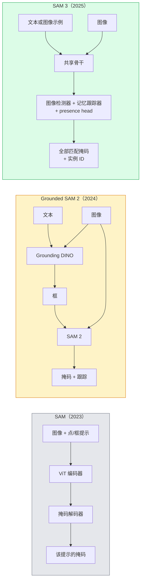

# SAM 3 与开放词汇分割

> 向模型提供文本提示和图像，即可得到每个匹配物体的掩码。SAM 3 让这成为一次前向传播。

**类型：** 使用 + 构建  
**学习实现：** Python  
**前置课程：** Phase 4 第 07 课（U-Net）、Phase 4 第 08 课（Mask R-CNN）、Phase 4 第 18 课（CLIP）  
**预计时间：** 约 60 分钟

## 学习目标

- 区分 SAM（仅视觉提示）、Grounded SAM / SAM 2（检测器 + SAM）和 SAM 3（通过 Promptable Concept Segmentation 原生支持文本提示）。
- 解释 SAM 3 架构：共享骨干 + 图像检测器 + 基于记忆的视频跟踪器 + presence head + 解耦检测器—跟踪器设计。
- 使用 Hugging Face `transformers` 的 SAM 3 集成进行文本提示的检测、分割和视频跟踪。
- 根据延迟、概念复杂度和部署目标，在 SAM 3、Grounded SAM 2、YOLO-World、SAM-MI 间选择。

## 问题

2023 年的 SAM 是仅视觉提示模型：点击一点或画一个框，它就返回掩码。若要“给我照片中所有橙子”，需要检测器（Grounding DINO）先产生框，再让 SAM 分割每个框。Grounded SAM 将其变为流水线，但这是两个冻结模型的级联，必然累积误差。

SAM 3（Meta，2025 年 11 月，ICLR 2026）压缩了该级联。它接受短名词短语或图像示例作为提示，在一次前向中返回所有匹配掩码和实例 ID。这种方法称为**可提示概念分割（Promptable Concept Segmentation，PCS）**。结合 2026 年 3 月的 Object Multiplex 更新（SAM 3.1），它能高效地在视频中跟踪同一概念的多个实例。

本课讨论这一结构转变：二维分割、检测和文本—图像 grounding 已合并为同一个模型。生产问题不再是“串联哪个流水线”，而是“哪个可提示模型可端到端处理我的用例”。

## 概念

### 三代模型



### 可提示概念分割

“概念提示”是短名词短语（`"yellow school bus"`、`"striped red umbrella"`、`"hand holding a mug"`）或图像示例。模型为图中每个匹配概念的实例返回分割掩码，并为每个匹配分配唯一实例 ID。

它与经典的视觉提示 SAM 有三点不同：

1. 不需要逐实例提示——一个文本提示返回全部匹配。
2. 开放词汇——概念可以是自然语言可描述的任何东西。
3. 同时返回多个实例，而不是每提示一个掩码。

### 关键架构组件

- **共享骨干**——单个 ViT 处理图像，检测头与基于记忆的跟踪器均从其读取。
- **Presence head**——预测概念是否出现在图像中，将“是否存在？”与“在哪里？”解耦；减少缺失概念的假正例。
- **解耦检测器—跟踪器**——图像级检测与视频级跟踪有独立 head，避免相互干扰。
- **记忆库**——跨帧存储每实例特征，用于视频跟踪（SAM 2 使用同一机制）。

### 大规模训练

SAM 3 在由数据引擎生成的 **400 万独特概念**上训练，数据引擎通过 AI + 人工审核迭代标注和纠错。新的 **SA-CO 基准**包含 27 万独特概念，比先前基准大 50 倍。SAM 3 在 SA-CO 上达到人类表现的 75–80%，在图像 + 视频 PCS 上胜过现有系统一倍。

### SAM 3.1 Object Multiplex

2026 年 3 月更新：**Object Multiplex** 引入共享记忆机制，可同时跟踪同一概念的许多实例。以前跟踪 N 个实例意味着 N 个独立记忆库；Multiplex 将其压缩为一个带每实例查询的共享记忆。因此，能更快地多对象跟踪且不损失准确率。

### Grounded SAM 在 2026 年仍有意义的场景

- 需要替换特定开放词汇检测器（DINO-X、Florence-2）。
- SAM 3 许可证（Hugging Face 上受限）构成阻碍。
- 需要比 SAM 3 提供的更细粒度检测阈值控制。
- 对检测器组件进行研究 / 消融实验。

模块化流水线仍有位置；对于多数生产工作，SAM 3 是更简单答案。

### YOLO-World 与 SAM 3

- **YOLO-World**——仅开放词汇检测器（没有掩码），实时；需要高 fps 框时最佳。
- **SAM 3**——完整分割 + 跟踪，较慢但输出更丰富。

生产分工：快速仅检测流水线（机器人导航、快速仪表盘）用 YOLO-World；需要掩码或跟踪的任务用 SAM 3。

### SAM-MI 效率

SAM-MI（2025–2026）处理 SAM 的解码器瓶颈，关键思路：

- **稀疏点提示**——使用少数精心选择的点，而非稠密提示，解码器调用减少 96%。
- **浅层掩码聚合**——将粗掩码预测合并为一个更清晰掩码。
- **解耦掩码注入**——解码器接收预计算掩码特征，无需重新运行。

结果：在开放词汇基准上比 Grounded-SAM 快约 1.6 倍。

### 三种模型的输出格式

全部返回相同的一般结构（框 + 标签 + 分数 + 掩码 + ID），这很有帮助：无论运行哪个模型，下游流水线都不必分支。

```figure
cv3-open-vocab
```

## 动手实现

### 步骤 1：提示构造

构建一个辅助函数，将用户句子转为 SAM 3 概念提示列表。这里是“用户输入什么”与“模型消费什么”的边界。

```python
def split_concepts(sentence):
    """
    Heuristic splitter for multi-concept prompts.
    Returns list of short noun phrases.
    """
    for sep in [",", ";", "and", "or", "&"]:
        if sep in sentence:
            parts = [p.strip() for p in sentence.replace("and ", ",").split(",")]
            return [p for p in parts if p]
    return [sentence.strip()]

print(split_concepts("cats, dogs and balloons"))
```

SAM 3 每次前向接受一个概念；多概念查询时可循环或批处理。

### 步骤 2：后处理辅助函数

将 SAM 3 原始输出转为干净检测列表，匹配 Phase 4 第 16 课的流水线契约。

```python
from dataclasses import dataclass
from typing import List

@dataclass
class ConceptDetection:
    concept: str
    instance_id: int
    box: tuple          # (x1, y1, x2, y2)
    score: float
    mask_rle: str       # run-length encoded


def rle_encode(binary_mask):
    flat = binary_mask.flatten().astype("uint8")
    runs = []
    prev, count = flat[0], 0
    for v in flat:
        if v == prev:
            count += 1
        else:
            runs.append((int(prev), count))
            prev, count = v, 1
    runs.append((int(prev), count))
    return ";".join(f"{v}x{c}" for v, c in runs)
```

即使有很多高分辨率掩码，RLE 也使响应载荷保持很小。同一格式适用于 SAM 2、SAM 3、Grounded SAM 2。

### 步骤 3：统一的开放词汇分割接口

用单一方法包装现有后端（SAM 3、Grounded SAM 2、YOLO-World + SAM 2）。后端更换时下游代码不变。

```python
from abc import ABC, abstractmethod
import numpy as np

class OpenVocabSeg(ABC):
    @abstractmethod
    def detect(self, image: np.ndarray, concept: str) -> List[ConceptDetection]:
        ...


class StubOpenVocabSeg(OpenVocabSeg):
    """
    Deterministic stub used for pipeline testing when real models are not loaded.
    """
    def detect(self, image, concept):
        h, w = image.shape[:2]
        return [
            ConceptDetection(
                concept=concept,
                instance_id=0,
                box=(w * 0.2, h * 0.3, w * 0.5, h * 0.8),
                score=0.89,
                mask_rle="0x100;1x50;0x200",
            ),
            ConceptDetection(
                concept=concept,
                instance_id=1,
                box=(w * 0.55, h * 0.25, w * 0.85, h * 0.75),
                score=0.74,
                mask_rle="0x80;1x40;0x220",
            ),
        ]
```

真正的 `SAM3OpenVocabSeg` 子类会包装 `transformers.Sam3Model` 与 `Sam3Processor`。

### 步骤 4：Hugging Face SAM 3 用法（参考）

实际模型的 `transformers` 集成：

```python
from transformers import Sam3Processor, Sam3Model
import torch

processor = Sam3Processor.from_pretrained("facebook/sam3")
model = Sam3Model.from_pretrained("facebook/sam3").eval()

inputs = processor(images=pil_image, return_tensors="pt")
inputs = processor.set_text_prompt(inputs, "yellow school bus")

with torch.no_grad():
    outputs = model(**inputs)

masks = processor.post_process_masks(
    outputs.masks, inputs.original_sizes, inputs.reshaped_input_sizes
)
boxes = outputs.boxes
scores = outputs.scores
```

一个提示，单次调用即返回所有匹配。

### 步骤 5：测量 Grounded SAM 2 免费提供了什么

诚实的基准问题：在真实流水线中，用 SAM 3 替换 Grounded SAM 2 会怎样？

- 延迟：SAM 3 少一次前向（无独立检测器），但模型本身更重；通常持平或略有加速。
- 准确率：SAM 3 对稀有或组合概念（`"striped red umbrella"`）明显更好；对常见单词概念相似。
- 灵活性：Grounded SAM 2 可替换检测器（DINO-X、Florence-2、Grounding DINO 1.5）；SAM 3 是单体模型。

结论：SAM 3 是 2026 年开放词汇分割的默认方案；需要检测器灵活性或不同许可证条款时，Grounded SAM 2 仍是正确答案。

## 使用现成工具

生产部署模式：

- **实时标注**——SAM 3 + CVAT 的“标签即文本提示”功能。标注员选择标签名，SAM 3 预标注每个匹配实例，再审核和纠正。
- **视频分析**——用 SAM 3.1 Object Multiplex 做多对象跟踪；向基于记忆的跟踪器输入帧。
- **机器人**——SAM 3 支持开放词汇操作（“拿起红色杯子”），作为规划原语运行。
- **医学影像**——在医学概念上微调 SAM 3；需要在 HF 申请访问。

Ultralytics 在 Python 包中包装了 SAM 3：

```python
from ultralytics import SAM

model = SAM("sam3.pt")
results = model(image_path, prompts="yellow school bus")
```

接口与 YOLO、SAM 2 相同。

## 交付产物

本课产出：

- `outputs/prompt-open-vocab-stack-picker.md`——根据延迟、概念复杂度和许可证选择 SAM 3 / Grounded SAM 2 / YOLO-World / SAM-MI 的提示词。
- `outputs/skill-concept-prompt-designer.md`——将用户表述转为格式正确 SAM 3 概念提示（拆分、消歧、回退）的技能。

## 练习

1. **（简单）** 在 10 张图上以自行选择的概念提示运行 SAM 3，与同图上的 SAM 2 + Grounding DINO 1.5 比较，报告每个模型漏掉哪些概念。
2. **（中等）** 在 SAM 3 上构建“点击保留 / 点击排除”UI：文本提示返回候选实例，用户点击哪些应计为正例，输出最终概念集 JSON。
3. **（困难）** 在自定义概念集（如 5 类电子元件）上微调 SAM 3，每类 20 张标注图。与同一测试集上的零样本 SAM 3 比较，测量掩码 IoU 改进。

## 关键术语

| 术语 | 常见说法 | 实际含义 |
|------|----------|----------|
| 开放词汇分割 | “按文本分割” | 为自然语言描述的物体产生掩码，而非固定标签集 |
| PCS | “可提示概念分割” | SAM 3 的核心任务：给定名词短语或图像示例，分割全部匹配实例 |
| 概念提示（Concept prompt） | “文本输入” | 短名词短语或图像示例；不是完整句子 |
| Presence head | “它在这里吗？” | 在定位前判定概念是否存在于图像的 SAM 3 模块 |
| SA-CO | “SAM 3 基准” | 27 万概念的开放词汇分割基准，比此前开放词汇基准大 50 倍 |
| Object Multiplex | “SAM 3.1 更新” | 共享记忆多对象跟踪；快速联合跟踪许多实例 |
| Grounded SAM 2 | “模块化流水线” | 检测器 + SAM 2 级联；检测器替换重要时仍相关 |
| SAM-MI | “高效 SAM 变体” | Mask Injection 方案，较 Grounded-SAM 加速 1.6 倍 |

## 延伸阅读

- [SAM 3：Segment Anything with Concepts（arXiv 2511.16719）](https://arxiv.org/abs/2511.16719)
- [SAM 3.1 Object Multiplex（Meta AI，2026 年 3 月）](https://ai.meta.com/blog/segment-anything-model-3/)
- [Hugging Face 上的 SAM 3 模型页](https://huggingface.co/facebook/sam3)
- [Grounded SAM 2 教程（PyImageSearch）](https://pyimagesearch.com/2026/01/19/grounded-sam-2-from-open-set-detection-to-segmentation-and-tracking/)
- [Ultralytics SAM 3 文档](https://docs.ultralytics.com/models/sam-3/)
- [SAM3-I：Instruction-aware SAM（arXiv 2512.04585）](https://arxiv.org/abs/2512.04585)
