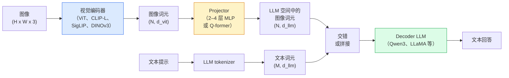

# 视觉语言模型：ViT-MLP-LLM 模式

> 视觉编码器将图像转成词元；MLP projector 将这些词元映射到 LLM 嵌入空间；语言模型完成余下工作。许多 2026 年的生产 VLM 都采用 ViT-MLP-LLM 模式。

**类型：** 学习 + 使用  
**学习实现：** Python  
**前置课程：** Phase 4 第 14 课（ViT）、Phase 4 第 18 课（CLIP）、Phase 7 第 02 课（自注意力）  
**预计时间：** 约 75 分钟

## 学习目标

- 说出 ViT-MLP-LLM 架构，并解释三个组件各自的贡献。
- 按参数量、上下文长度和基准表现比较 Qwen3-VL、InternVL3.5、LLaVA-Next、GLM-4.6V。
- 解释 DeepStack：为什么多层 ViT 特征比只用最后一层更能紧密对齐视觉与语言。
- 以跨模态错误率（CMER）度量生产 VLM 幻觉，并根据信号采取行动。

## 问题

CLIP（Phase 4 第 18 课）为图像和文本提供共享嵌入空间，足以实现零样本分类和检索；但它不能回答“这张图里有多少辆红车？”，因为 CLIP 不生成文本，只对相似度打分。

视觉语言模型（VLM）——Qwen3-VL、InternVL3.5、LLaVA-Next、GLM-4.6V——将 CLIP 家族图像编码器接到完整语言模型。模型看见图像和问题，生成回答。到 2026 年，开源 VLM 在多模态基准（MMMU、MMBench、DocVQA、ChartQA、MathVista、OSWorld）上可匹敌或超越 GPT-5 与 Gemini-2.5-Pro。

ViT、projector 和 LLM 构成标准的三部分模式。模型差异来自选用何种 ViT、projector、LLM、训练数据和对齐配方；理解各部件接口后，可以按同一模式替换组件。

## 概念

### ViT-MLP-LLM 架构



1. **视觉编码器**——预训练 ViT（CLIP-L/14、SigLIP、DINOv3 或微调变体），产生图块词元。
2. **Projector**——小模块（2–4 层 MLP 或 Q-former），将视觉词元映射到 LLM 的嵌入维度。这里发生大部分微调。
3. **LLM**——仅解码器语言模型（Qwen3、Llama、Mistral、GLM、InternLM），顺序读取视觉 + 文本词元并生成文本。

理论上三者均可训练；实践中通常冻结视觉编码器与 LLM，只训练 projector，以较低成本利用数十亿参数模型的信号。

### DeepStack

普通投影只使用最后一层 ViT。DeepStack（Qwen3-VL）从多个 ViT 深度采样特征并堆叠。深层承载高级语义；浅层承载细粒度空间和纹理信息。二者同时送入 LLM，缩小“图像有什么”（语义）与“精确在哪里”（空间 grounding）之间的差距。

### 三个训练阶段

现代 VLM 分阶段训练：

1. **对齐（Alignment）**——冻结 ViT 和 LLM，只在图像—描述对上训练 projector，教它将视觉空间映射到语言空间。
2. **预训练（Pre-training）**——全部解冻，在大规模交错图文数据（5 亿+ 对）上训练，构建模型视觉知识。
3. **指令微调（Instruction tuning）**——在精心整理的（图像、问题、答案）三元组上微调，教授对话行为和任务格式。这一步将“感知视觉的 LM”变成可用助理。

多数 LoRA 微调以小型带标签集为目标，作用于阶段 3。

### 模型家族比较（2026 年初）

| 模型 | 参数量 | 视觉编码器 | LLM | 上下文 | 优势 |
|-------|--------|------------|-----|---------|------|
| Qwen3-VL-235B-A22B（MoE） | 235B（22B 激活） | 自研 ViT + DeepStack | Qwen3 | 256K | 通用 SOTA、GUI 智能体 |
| Qwen3-VL-30B-A3B（MoE） | 30B（3B 激活） | 自研 ViT + DeepStack | Qwen3 | 256K | 更小的 MoE 备选 |
| Qwen3-VL-8B（dense） | 8B | 自研 ViT | Qwen3 | 128K | 生产 dense 默认值 |
| InternVL3.5-38B | 38B | InternViT-6B | Qwen3 + GPT-OSS | 128K | 强 MMBench / MMVet |
| InternVL3.5-241B-A28B | 241B（28B 激活） | InternViT-6B | Qwen3 | 128K | 与 GPT-4o 有竞争力 |
| LLaVA-Next 72B | 72B | SigLIP | Llama-3 | 32K | 开放、易微调 |
| GLM-4.6V | ~70B | 自研 | GLM | 64K | 开源、强 OCR |
| MiniCPM-V-2.6 | 8B | SigLIP | MiniCPM | 32K | 对边缘端友好 |

### 视觉智能体

Qwen3-VL-235B 在 OSWorld——操作 GUI（桌面、移动、网页）的**视觉智能体**基准——上达到全球最高表现。模型看到截图、理解 UI，并输出动作（点击、输入、滚动）。与工具组合后，它可闭环完成常见桌面任务。这正是多数 2026 年“AI PC”演示的底层机制。

### 智能体能力与 RoPE 变体

VLM 需要知道视频中一帧出现的**时间**。Qwen3-VL 从 T-RoPE（时间旋转位置嵌入）演变为**基于文本的时间对齐**：在视频帧间交错显式时间戳文本词元。模型看见“`<timestamp 00:32>` 帧、提示词”，即可推理时序关系。

### 对齐问题

爬取数据集中有 12% 图文对的描述并未完全立足图像。以此训练的 VLM 会静默学会幻觉：虚构物体、误读数字、捏造关系。在生产中，这正是主导失败模式。

Skywork.ai 提出以**跨模态错误率（CMER）**跟踪它：

```text
CMER = 输出中“文本置信度高、但图文相似度（由 CLIP 家族检查器衡量）低”的比例
```

高 CMER 表示模型自信地生成了图像不支持的内容。将 CMER 作为生产 KPI 并监控它，可以把高 CMER 输出路由至人工审核；相关部署报告称，这种做法把幻觉率降低了约 35%。

### 使用 LoRA / QLoRA 微调

完整微调 70B VLM 对大多数团队遥不可及。在注意力 + projector 层使用 LoRA（rank 16–64），或以 4 位基权重使用 QLoRA，可装入单张 A100 / H100。成本为 5000–50000 样本、100–5000 美元计算费用和 2–10 小时训练。

### 空间推理仍然较弱

当前 VLM 在空间推理基准（上下、左右、计数、距离）上得分 50–60%。若用例依赖“哪个物体在另一个上面”，必须重度验证——通用 VLM 表现低于人类。纯空间任务优于 VLM 的替代方案：专门关键点 / 姿态估计器、深度模型，或经框几何后处理的检测模型。

```figure
v4-vlm-projector
```

## 动手实现

### 步骤 1：Projector

你最常训练的部分：带 GELU 的 2–4 层 MLP。

```python
import torch
import torch.nn as nn


class Projector(nn.Module):
    def __init__(self, vit_dim=768, llm_dim=4096, hidden=4096):
        super().__init__()
        self.net = nn.Sequential(
            nn.Linear(vit_dim, hidden),
            nn.GELU(),
            nn.Linear(hidden, llm_dim),
        )

    def forward(self, x):
        return self.net(x)
```

输入是 `(N_patches, d_vit)` 词元张量，输出是 `(N_patches, d_llm)`。LLM 将每行输出都视为另一个词元。

### 步骤 2：端到端组装 ViT-MLP-LLM

最小 VLM 前向传播骨架。真实代码使用 `transformers`；此处展示概念布局。

```python
class MinimalVLM(nn.Module):
    def __init__(self, vit, projector, llm, image_token_id):
        super().__init__()
        self.vit = vit
        self.projector = projector
        self.llm = llm
        self.image_token_id = image_token_id  # placeholder token in text prompt

    def forward(self, image, input_ids, attention_mask):
        # 1. vision features
        vision_tokens = self.vit(image)                     # (B, N_patches, d_vit)
        vision_embeds = self.projector(vision_tokens)       # (B, N_patches, d_llm)

        # 2. text embeddings
        text_embeds = self.llm.get_input_embeddings()(input_ids)  # (B, M, d_llm)

        # 3. replace image placeholder tokens with vision embeds
        merged = self._merge(text_embeds, vision_embeds, input_ids)

        # 4. run LLM
        return self.llm(inputs_embeds=merged, attention_mask=attention_mask)

    def _merge(self, text_embeds, vision_embeds, input_ids):
        out = text_embeds.clone()
        expected = vision_embeds.size(1)
        for b in range(input_ids.size(0)):
            positions = (input_ids[b] == self.image_token_id).nonzero(as_tuple=True)[0]
            if len(positions) != expected:
                raise ValueError(
                    f"batch item {b} has {len(positions)} image tokens but vision_embeds has {expected} patches."
                    " Every sample in the batch must be pre-padded to the same number of image placeholder tokens.")
            out[b, positions] = vision_embeds[b]
        return out
```

文本中的 `<image>` 占位词元被真实图像嵌入替换——LLaVA、Qwen-VL、InternVL 都采用此模式。

### 步骤 3：计算 CMER

轻量运行时检查：

```python
import torch.nn.functional as F


def cross_modal_error_rate(image_emb, text_emb, text_confidence, sim_threshold=0.25, conf_threshold=0.8):
    """
    image_emb, text_emb: embeddings of image and generated text (normalised internally)
    text_confidence:     mean per-token probability in [0, 1]
    Returns:             fraction of high-confidence outputs with low image-text alignment
    """
    image_emb = F.normalize(image_emb, dim=-1)
    text_emb = F.normalize(text_emb, dim=-1)
    sim = (image_emb * text_emb).sum(dim=-1)        # cosine similarity
    high_conf_low_sim = (text_confidence > conf_threshold) & (sim < sim_threshold)
    return high_conf_low_sim.float().mean().item()
```

将 CMER 当作生产 KPI，按 endpoint、提示类型、客户监控。CMER 上升表示模型开始在某些输入分布上产生幻觉。

### 步骤 4：玩具 VLM 分类器（可运行）

展示 projector 可以训练：输入伪“ViT 特征”，微型 LLM 风格词元预测类别。

```python
class ToyVLM(nn.Module):
    def __init__(self, vit_dim=32, llm_dim=64, num_classes=5):
        super().__init__()
        self.projector = Projector(vit_dim, llm_dim, hidden=64)
        self.head = nn.Linear(llm_dim, num_classes)

    def forward(self, vision_tokens):
        projected = self.projector(vision_tokens)
        pooled = projected.mean(dim=1)
        return self.head(pooled)
```

在合成（特征、类别）对上 200 步内可拟合，足以说明 projector 模式有效。

## 使用现成工具

2026 年生产团队使用 VLM 的三种方式：

- **托管 API**——OpenAI Vision、Anthropic Claude Vision、Google Gemini Vision。零基础设施，存在供应商风险。
- **开源自托管**——经 `transformers` 与 `vllm` 使用 Qwen3-VL 或 InternVL3.5。完全控制，前期投入更高。
- **领域微调**——加载 Qwen2.5-VL-7B 或 LLaVA-1.6-7B，在 5k–50k 定制样本上 LoRA，用 `vllm` 或 `TGI` 服务。

```python
from transformers import AutoProcessor, AutoModelForVision2Seq
import torch
from PIL import Image

model_id = "Qwen/Qwen3-VL-8B-Instruct"
processor = AutoProcessor.from_pretrained(model_id)
model = AutoModelForVision2Seq.from_pretrained(model_id, torch_dtype=torch.bfloat16, device_map="auto")

messages = [{
    "role": "user",
    "content": [
        {"type": "image", "image": Image.open("plot.png")},
        {"type": "text", "text": "What does this chart show?"},
    ],
}]
inputs = processor.apply_chat_template(messages, add_generation_prompt=True, tokenize=True, return_dict=True, return_tensors="pt").to("cuda")
generated = model.generate(**inputs, max_new_tokens=256)
answer = processor.decode(generated[0][inputs["input_ids"].shape[1]:], skip_special_tokens=True)
```

`apply_chat_template` 隐藏了 `<image>` 占位词元的分词；模型在内部处理合并。

## 交付产物

本课产出：

- `outputs/prompt-vlm-selector.md`——按准确率、延迟、上下文长度和预算选择 Qwen3-VL / InternVL3.5 / LLaVA-Next / API 的提示词。
- `outputs/skill-cmer-monitor.md`——为生产 VLM endpoint 实现 CMER、每 endpoint 仪表盘和告警阈值的代码技能。

## 练习

1. **（简单）** 在五张图上通过任一开放 VLM 运行三个提示（“这是什么？”、“数一数物体”、“描述场景”）。手工给答案评分为正确 / 部分正确 / 幻觉，计算初版 CMER 类指标。
2. **（中等）** 在目标领域的 500 张带描述图像上，以 LoRA（rank 16）微调 Qwen2.5-VL-3B 或 LLaVA-1.6-7B。比较零样本与微调后的 MMBench 风格准确率。
3. **（困难）** 用 DINOv3 替换 VLM 默认 SigLIP/CLIP 图像编码器，只重训 projector（冻结 LLM + 冻结 DINOv3）。测量稠密预测任务（计数、空间推理）是否改善。

## 关键术语

| 术语 | 常见说法 | 实际含义 |
|------|----------|----------|
| ViT-MLP-LLM | “VLM 模式” | 视觉编码器 + projector + 语言模型；2026 年许多 VLM 采用的结构 |
| Projector | “桥梁” | 将视觉词元映射至 LLM 嵌入空间的 2–4 层 MLP（或 Q-former） |
| DeepStack | “Qwen3-VL 特征技巧” | 堆叠多层 ViT 特征，而非仅使用最后一层 |
| 图像词元 | “`<image>` 占位符” | 文本流中特殊词元，由投影后的视觉嵌入替换 |
| CMER | “幻觉 KPI” | 文本置信度高、图文相似度低时升高的跨模态错误率 |
| 视觉智能体 | “会点击的 VLM” | 通过工具调用操作 GUI（OSWorld、移动端、网页）的 VLM |
| Q-former | “固定数目词元桥梁” | BLIP-2 风格 projector，产生固定数目的视觉查询词元 |
| 对齐 / 预训练 / 指令微调 | “三个阶段” | 标准 VLM 训练流水线 |

## 延伸阅读

- [Qwen3-VL 技术报告（arXiv 2511.21631）](https://arxiv.org/abs/2511.21631)
- [InternVL3.5：推进开源多模态模型（arXiv 2508.18265）](https://arxiv.org/html/2508.18265v1)
- [LLaVA-Next 系列](https://llava-vl.github.io/blog/2024-05-10-llava-next-stronger-llms/)
- [BentoML：2026 年最佳开源 VLM](https://www.bentoml.com/blog/multimodal-ai-a-guide-to-open-source-vision-language-models)
- [MMMU：多学科多模态理解基准](https://mmmu-benchmark.github.io/)
- [制造业中的 VLM（Robotics Tomorrow，2026 年 3 月）](https://www.roboticstomorrow.com/story/2026/03/when-machines-learn-to-see-like-experts-the-rise-of-vision-language-models-in-manufacturing/26335/)
