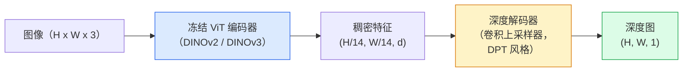

# 单目深度与几何估计

> 深度图是一张单通道图像，其中每个像素是距相机的距离。过去从一张 RGB 帧预测它，不依靠双目或 LiDAR 几乎不可能；2026 年，冻结 ViT 编码器加轻量头即可达到与真值只差几个百分点。

**类型：** 构建 + 使用  
**学习实现：** Python  
**前置课程：** Phase 4 第 14 课（ViT）、Phase 4 第 17 课（自监督视觉）、Phase 4 第 07 课（U-Net）  
**预计时间：** 约 60 分钟

## 学习目标

- 区分相对深度和度量深度，并说明每个生产模型（MiDaS、Marigold、Depth Anything V3、ZoeDepth）解决哪一种。
- 使用 Depth Anything V3（DINOv2 骨干）在没有标定的情况下预测任意单图的深度。
- 解释单图单目深度为何可行（透视线索、纹理梯度、学习到的先验）及无法恢复什么（绝对尺度、遮挡几何）。
- 使用深度图与针孔相机内参，将 2D 检测提升为 3D 点。

## 问题

深度是二维计算机视觉缺失的轴。给定 RGB，你知道物体在图像平面何处出现，却不知道有多远。深度传感器（双目装置、LiDAR、飞行时间）能直接解决它，但昂贵、脆弱且量程有限。

单目深度估计——由单张 RGB 帧预测深度——过去产生模糊且不可靠的输出。到 2026 年，大型预训练编码器改变了局面：Depth Anything V3 使用冻结的 DINOv2 骨干，产生可泛化到室内、室外、医疗和卫星领域的深度图；Marigold 将深度重构为条件扩散问题；ZoeDepth 回归真实度量距离。

深度也是 2D 检测与 3D 理解间的桥梁：将检测框像素乘以深度，就能把 2D 物体提升为 3D 点云。这是每个 AR 遮挡系统、避障流水线和“拿起杯子”机器人的核心。

## 概念

### 相对深度与度量深度

- **相对深度**——有序 `z` 值，没有真实世界单位。“像素 A 比像素 B 近，但距离比例未锚定到米。”
- **度量深度**——相对于相机、以米为单位的绝对距离；要求模型学会图像线索与真实距离的统计关系。

MiDaS 和 Depth Anything V3 产生相对深度，Marigold 也产生相对深度。ZoeDepth、UniDepth 与 Metric3D 产生度量深度。度量模型对相机内参敏感，相对模型则不敏感。

### 编码器—解码器模式



Depth Anything V3 冻结编码器，只训练 DPT 风格解码器。编码器提供丰富特征；解码器将其插值回图像分辨率并回归深度。

### 为什么单张图能产生深度

二维图像含有许多与深度相关的单目线索：

- **透视**——3D 中平行线在 2D 中汇聚。
- **纹理梯度**——远处表面的纹理更小、更密。
- **遮挡顺序**——近物体遮挡远物体。
- **大小恒常性**——已知物体（汽车、人）提供近似尺度。
- **大气透视**——室外远物体显得更朦胧、更蓝。

在数十亿图像上训练的 ViT 内化了这些线索。足够数据和强骨干下，单目深度无须显式 3D 监督即可获得合理准确度。

### 单目深度做不到什么

- 没有内参或场景中已知物体时，无法获得**绝对度量尺度**。网络可预测“杯子比勺子远两倍”，却不知道杯子离相机 1 米还是 10 米。
- **遮挡几何**——椅背不可见，无法可靠推断。
- **无纹理或反射表面**——镜子、玻璃、均匀墙面；网络会给出看似合理却错误的深度。

### 2026 年的 Depth Anything V3

- 使用 vanilla DINOv2 ViT-L/14 作为冻结编码器。
- DPT 解码器。
- 在来自多样来源的带位姿图像对上训练（只需光度一致性，无需显式深度监督）。
- 从**任意数量视觉输入、已知或未知相机位姿**预测空间一致几何。
- 在单目深度、任意视角几何、视觉渲染、相机姿态估计上 SOTA。

2026 年需要深度时，这是可直接调用的模型。

### Marigold：用于深度的扩散

Marigold（Ke 等，CVPR 2024）将深度估计重构为条件图像到图像扩散：条件是 RGB，目标是深度图，使用预训练 Stable Diffusion 2 U-Net 为骨干。它在物体边缘处输出异常锐利的深度图；权衡是比前馈模型慢（10–50 个去噪步）。

### 内参与针孔相机

要将深度为 `d` 的像素 `(u, v)` 提升为相机坐标系 3D 点 `(X, Y, Z)`：

```text
fx, fy, cx, cy = 相机内参
X = (u - cx) * d / fx
Y = (v - cy) * d / fy
Z = d
```

内参来自 EXIF 元数据、标定图案，或单目内参估计器（Perspective Fields、UniDepth）。没有内参时，仍可假设 60–70° FOV 和中等分辨率主点来渲染点云——适合可视化，不适合测量。

### 评估

两个标准指标：

- **AbsRel**（绝对相对误差）：`mean(|d_pred - d_gt| / d_gt)`，越低越好；生产模型为 0.05–0.1。
- **delta < 1.25**（阈值准确率）：`max(d_pred/d_gt, d_gt/d_pred) < 1.25` 的像素比例，越高越好；SOTA 为 0.9+。

对于相对深度（Depth Anything V3、MiDaS），评估使用两个指标的尺度—平移不变版本。

```figure
depth-sweep
```

## 动手实现

### 步骤 1：深度指标

```python
import torch

def abs_rel_error(pred, target, mask=None):
    if mask is not None:
        pred = pred[mask]
        target = target[mask]
    return (torch.abs(pred - target) / target.clamp(min=1e-6)).mean().item()


def delta_accuracy(pred, target, threshold=1.25, mask=None):
    if mask is not None:
        pred = pred[mask]
        target = target[mask]
    ratio = torch.maximum(pred / target.clamp(min=1e-6), target / pred.clamp(min=1e-6))
    return (ratio < threshold).float().mean().item()
```

评估前始终掩蔽无效深度像素（零、NaN、饱和）。

### 步骤 2：尺度—平移对齐

对于相对深度模型，计算指标前将预测与真值对齐。对 `a * pred + b = target` 做最小二乘拟合：

```python
def align_scale_shift(pred, target, mask=None):
    if mask is not None:
        p = pred[mask]
        t = target[mask]
    else:
        p = pred.flatten()
        t = target.flatten()
    A = torch.stack([p, torch.ones_like(p)], dim=1)
    coeffs, *_ = torch.linalg.lstsq(A, t.unsqueeze(-1))
    a, b = coeffs[:2, 0]
    return a * pred + b
```

评估 MiDaS / Depth Anything 时，在 `abs_rel_error` 前运行 `align_scale_shift`。

### 步骤 3：将深度提升为点云

```python
import numpy as np

def depth_to_point_cloud(depth, intrinsics):
    H, W = depth.shape
    fx, fy, cx, cy = intrinsics
    v, u = np.meshgrid(np.arange(H), np.arange(W), indexing="ij")
    z = depth
    x = (u - cx) * z / fx
    y = (v - cy) * z / fy
    return np.stack([x, y, z], axis=-1)


depth = np.random.uniform(0.5, 4.0, (240, 320))
intr = (320.0, 320.0, 160.0, 120.0)
pc = depth_to_point_cloud(depth, intr)
print(f"point cloud shape: {pc.shape}  (H, W, 3)")
```

一个函数，服务于每个 3D 提升应用。将点云导出到 `.ply`，即可在 MeshLab 或 CloudCompare 打开。

### 步骤 4：合成深度场景的 smoke test

```python
def synthetic_depth(size=96):
    yy, xx = np.meshgrid(np.arange(size), np.arange(size), indexing="ij")
    # Floor: linear gradient from near (top) to far (bottom)
    depth = 1.0 + (yy / size) * 4.0
    # Box in the middle: closer
    mask = (np.abs(xx - size / 2) < size / 6) & (np.abs(yy - size * 0.6) < size / 6)
    depth[mask] = 2.0
    return depth.astype(np.float32)


gt = torch.from_numpy(synthetic_depth(96))
pred = gt + 0.3 * torch.randn_like(gt)  # simulated prediction
aligned = align_scale_shift(pred, gt)
print(f"before align  absRel = {abs_rel_error(pred, gt):.3f}")
print(f"after align   absRel = {abs_rel_error(aligned, gt):.3f}")
```

### 步骤 5：Depth Anything V3 用法（参考）

```python
import torch
from transformers import pipeline
from PIL import Image

pipe = pipeline(task="depth-estimation", model="LiheYoung/depth-anything-v2-large")

image = Image.open("street.jpg").convert("RGB")
out = pipe(image)
depth_np = np.array(out["depth"])
```

三行。`out["depth"]` 是 PIL 灰度图，转换为 numpy 后即可计算。Depth Anything V3 发布后替换模型 ID；API 不变。

## 使用现成工具

- **Depth Anything V3**（Meta AI / ByteDance，2024–2026）——相对深度默认选择，生产中最快的 ViT-large 骨干模型。
- **Marigold**（ETH，2024）——视觉质量最高，推理慢。
- **UniDepth**（ETH，2024）——带相机内参估计的度量深度。
- **ZoeDepth**（Intel，2023）——度量深度；较旧但仍可靠。
- **MiDaS v3.1**——遗留但稳定，是比较的良好基线。

典型集成模式：

1. RGB 帧到达。
2. 深度模型产生深度图。
3. 检测器产生框。
4. 经深度将框中心提升到 3D；若有点云则合并。
5. 下游：AR 遮挡、路径规划、物体尺寸估计、替换双目。

实时使用时，INT8 量化的 Depth Anything V2 Small 在消费级 GPU 的 518x518 分辨率可达约 30 fps。

## 交付产物

本课产出：

- `outputs/prompt-depth-model-picker.md`——按延迟、度量/相对需求和场景类型选择 Depth Anything V3、Marigold、UniDepth、MiDaS 的提示词。
- `outputs/skill-depth-to-pointcloud.md`——用正确内参处理从深度图构建点云并导出 `.ply` 的技能。

## 练习

1. **（简单）** 在任意 10 张桌面图像上运行 Depth Anything V2。将深度保存为灰度 PNG 并检查；找出一个预测深度看起来错误的物体，并解释单目线索为何失效。
2. **（中等）** 给定来自 Depth Anything V2 的 RGB + 深度，将其提升为点云并用 `open3d` 渲染。比较两种场景（室内 / 室外），指出哪一个看起来更可信。
3. **（困难）** 获取五对仅已知物体位置不同的图像（如瓶子移动近 30 cm）。用 UniDepth 对两张图预测度量深度，报告预测距离差与真实 30 cm 的比较。

## 关键术语

| 术语 | 常见说法 | 实际含义 |
|------|----------|----------|
| 单目深度（Monocular depth） | “单图深度” | 从一张 RGB 帧估计深度，无双目或 LiDAR |
| 相对深度（Relative depth） | “有序深度” | 不带真实世界单位的有序 z 值 |
| 度量深度（Metric depth） | “绝对距离” | 以米计的深度；需要标定或经过度量监督训练的模型 |
| AbsRel | “绝对相对误差” | `|d_pred - d_gt| / d_gt` 的均值；标准深度指标 |
| Delta accuracy | “delta < 1.25” | 预测与真值差距在 25% 内的像素比例 |
| 针孔相机（Pinhole camera） | “fx、fy、cx、cy” | 将 `(u, v, d)` 提升为 `(X, Y, Z)` 的相机模型 |
| DPT | “Dense Prediction Transformer” | 冻结 ViT 编码器上用于深度的卷积解码器 |
| DINOv2 骨干 | “成功原因” | 无深度标签也可跨域泛化的自监督特征 |

## 延伸阅读

- [Depth Anything V3 论文页](https://depth-anything.github.io/)——采用 DINOv2 编码器的 SOTA 单目深度。
- [Marigold（Ke 等，CVPR 2024）](https://marigoldmonodepth.github.io/)——基于扩散的深度估计。
- [UniDepth（Piccinelli 等，2024）](https://arxiv.org/abs/2403.18913)——带内参的度量深度。
- [MiDaS v3.1（Intel ISL）](https://github.com/isl-org/MiDaS)——规范的相对深度基线。
- [DINOv3 博客文章（Meta）](https://ai.meta.com/blog/dinov3-self-supervised-vision-model/)——提升深度准确率的编码器家族。
