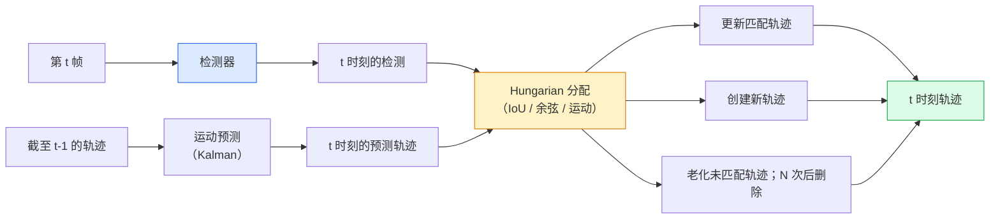

# 多目标跟踪与视频记忆

> 跟踪就是检测加关联：每帧检测，再按 ID 将本帧检测与上一帧轨迹匹配。

**类型：** 构建  
**学习实现：** Python  
**前置课程：** Phase 4 第 06 课（YOLO 检测）、Phase 4 第 08 课（Mask R-CNN）、Phase 4 第 24 课（SAM 3）  
**预计时间：** 约 60 分钟

## 学习目标

- 区分检测式跟踪与基于查询的跟踪，并说出算法家族（SORT、DeepSORT、ByteTrack、BoT-SORT、SAM 2 memory tracker、SAM 3.1 Object Multiplex）。
- 从零实现 IoU + Hungarian 分配，用于经典检测式跟踪。
- 解释 SAM 2 的记忆库，以及为何其比基于 IoU 的关联更能处理遮挡。
- 解读三种跟踪指标（MOTA、IDF1、HOTA），并为不同用例选择重要指标。

## 问题

检测器告诉你物体在单帧中的位置。跟踪器告诉你第 `t` 帧的哪个检测，与第 `t-1` 帧的哪个检测是同一物体。没有它，就无法统计穿线物体、在遮挡后追随球，或知道“4 号车已在车道中 8 秒”。

跟踪对每个面向视频的产品都必不可少：体育分析、监控、自动驾驶、医学视频分析、野生动物监测、文字标志计数。核心模块是共享的：逐帧检测器、运动模型（Kalman filter 或更丰富模型）、关联步骤（在 IoU / 余弦 / 学习特征上运行 Hungarian algorithm）和轨迹生命周期（出生、更新、死亡）。

2026 年出现两种新模式：**SAM 2 基于记忆的跟踪**（特征记忆而非运动模型关联）与 **SAM 3.1 Object Multiplex**（为同一概念的许多实例共享记忆）。本课先讲经典技术栈，再讲基于记忆的方法。

## 概念

### 检测式跟踪



2026 年遇到的每个跟踪器都是此循环的变体。差异如下：

- **SORT**（2016）：Kalman filter + IoU Hungarian，简单、快速、无外观模型。
- **DeepSORT**（2017）：SORT + 每轨 CNN 外观特征（ReID 嵌入），更好处理交叉。
- **ByteTrack**（2021）：第二阶段关联低置信度检测；不需要外观特征，却在 MOT17 上表现突出。
- **BoT-SORT**（2022）：ByteTrack + 相机运动补偿 + ReID。
- **StrongSORT / OC-SORT**：拥有更好运动和外观的 ByteTrack 后代。

### 用一段话理解 Kalman filter

Kalman filter 为每个轨迹维护带协方差的状态 `(x, y, w, h, dx, dy, dw, dh)`。每帧先以恒定速度模型**预测**状态，再以匹配检测**更新**。预测不确定性高时，更新更信任检测。这使轨迹平滑，并能在短遮挡（1–5 帧）中延续。

每个经典跟踪器均在运动预测步骤使用 Kalman filter。

### Hungarian algorithm

给定 `M x N` 成本矩阵（轨迹 x 检测），寻找使总成本最小的一对一分配。成本通常为 `1 - IoU(track_bbox, detection_bbox)`，或外观特征负余弦相似度。运行时间为 `O((M+N)^3)`；当 M、N 不超过约 1000 时，用 `scipy.optimize.linear_sum_assignment` 在 Python 中足够快。

### ByteTrack 的关键想法

标准跟踪器丢弃低置信检测（< 0.5）。ByteTrack 将其保留为**第二阶段候选**：先将轨迹与高置信检测匹配，未匹配轨迹再以稍宽松 IoU 阈值匹配低置信检测。这样可恢复短遮挡以及人群附近的 ID 切换。

### SAM 2 基于记忆的跟踪

SAM 2 为每个实例的时空特征保留**记忆库**。在一帧给定提示（点击、框、文本）后，它将实例编码进记忆。后续帧中，记忆与新帧特征进行交叉注意力，解码器为新帧中的同一实例产生掩码。

没有 Kalman filter，也没有 Hungarian 分配；关联隐含在记忆注意力操作中。

优点：

- 对大遮挡鲁棒（记忆可跨许多帧携带实例身份）。
- 与 SAM 3 文本提示结合时支持开放词汇。
- 不需独立运动模型。

缺点：

- 大量对象时比 ByteTrack 更慢。
- 记忆库会增长，限制上下文窗口。

### SAM 3.1 Object Multiplex

先前 SAM 2 / SAM 3 跟踪为每实例保留独立记忆库。50 个对象即 50 个记忆库。Object Multiplex（2026 年 3 月）将它们压缩为一个带**每实例 query 词元**的共享记忆，成本随实例数次线性增长。

Multiplex 是 2026 年人群跟踪的新默认选择：演唱会人群、仓库工人、交通路口。

### 必须知道的三种指标

- **MOTA（Multi-Object Tracking Accuracy）**——`1 - (FN + FP + ID switches) / GT`。按错误类型加权，将检测和关联失败混为单一指标。
- **IDF1（ID F1）**——ID 精确率与召回率的调和平均。专门关注每条真值轨迹能否随时间保持其 ID；对 ID 切换敏感任务优于 MOTA。
- **HOTA（Higher Order Tracking Accuracy）**——分解为检测准确度（DetA）和关联准确度（AssA）。2020 年以来的社区标准，最全面。

监控（谁是谁）报告 IDF1；体育分析（传球计数）用 HOTA；通用学术比较也用 HOTA。

```figure
cv3-track-assoc
```

## 动手实现

### 步骤 1：基于 IoU 的成本矩阵

```python
import numpy as np


def bbox_iou(a, b):
    """
    a, b: (N, 4) arrays of [x1, y1, x2, y2].
    Returns (N_a, N_b) IoU matrix.
    """
    ax1, ay1, ax2, ay2 = a[:, 0], a[:, 1], a[:, 2], a[:, 3]
    bx1, by1, bx2, by2 = b[:, 0], b[:, 1], b[:, 2], b[:, 3]
    inter_x1 = np.maximum(ax1[:, None], bx1[None, :])
    inter_y1 = np.maximum(ay1[:, None], by1[None, :])
    inter_x2 = np.minimum(ax2[:, None], bx2[None, :])
    inter_y2 = np.minimum(ay2[:, None], by2[None, :])
    inter = np.clip(inter_x2 - inter_x1, 0, None) * np.clip(inter_y2 - inter_y1, 0, None)
    area_a = (ax2 - ax1) * (ay2 - ay1)
    area_b = (bx2 - bx1) * (by2 - by1)
    union = area_a[:, None] + area_b[None, :] - inter
    return inter / np.clip(union, 1e-8, None)
```

### 步骤 2：最小 SORT 风格跟踪器

为简洁省略固定恒速 Kalman——这里只使用简单 IoU 关联；生产中 Kalman 预测必不可少。`sort` Python 包提供完整版本。

```python
from scipy.optimize import linear_sum_assignment


class Track:
    def __init__(self, tid, bbox, frame):
        self.id = tid
        self.bbox = bbox
        self.last_frame = frame
        self.hits = 1

    def update(self, bbox, frame):
        self.bbox = bbox
        self.last_frame = frame
        self.hits += 1


class SimpleTracker:
    def __init__(self, iou_threshold=0.3, max_age=5):
        self.tracks = []
        self.next_id = 1
        self.iou_threshold = iou_threshold
        self.max_age = max_age

    def step(self, detections, frame):
        if not self.tracks:
            for d in detections:
                self.tracks.append(Track(self.next_id, d, frame))
                self.next_id += 1
            return [(t.id, t.bbox) for t in self.tracks]

        track_boxes = np.array([t.bbox for t in self.tracks])
        det_boxes = np.array(detections) if len(detections) else np.empty((0, 4))

        iou = bbox_iou(track_boxes, det_boxes) if len(det_boxes) else np.zeros((len(track_boxes), 0))
        cost = 1 - iou
        cost[iou < self.iou_threshold] = 1e6

        matched_track = set()
        matched_det = set()
        if cost.size > 0:
            row, col = linear_sum_assignment(cost)
            for r, c in zip(row, col):
                if cost[r, c] < 1.0:
                    self.tracks[r].update(det_boxes[c], frame)
                    matched_track.add(r); matched_det.add(c)

        for i, d in enumerate(det_boxes):
            if i not in matched_det:
                self.tracks.append(Track(self.next_id, d, frame))
                self.next_id += 1

        self.tracks = [t for t in self.tracks if frame - t.last_frame <= self.max_age]
        return [(t.id, t.bbox) for t in self.tracks]
```

60 行：输入逐帧检测，返回逐帧轨迹 ID。真实系统还增加 Kalman 预测、ByteTrack 第二阶段重匹配和外观特征。

### 步骤 3：合成轨迹测试

```python
def synthetic_frames(num_frames=20, num_objects=3, H=240, W=320, seed=0):
    rng = np.random.default_rng(seed)
    starts = rng.uniform(20, 200, size=(num_objects, 2))
    velocities = rng.uniform(-5, 5, size=(num_objects, 2))
    frames = []
    for f in range(num_frames):
        dets = []
        for i in range(num_objects):
            cx, cy = starts[i] + f * velocities[i]
            dets.append([cx - 10, cy - 10, cx + 10, cy + 10])
        frames.append(dets)
    return frames


tracker = SimpleTracker()
for f, dets in enumerate(synthetic_frames()):
    tracks = tracker.step(dets, f)
```

三条直线运动物体应在全部 20 帧中保持 ID。

### 步骤 4：ID 切换指标

```python
def count_id_switches(tracks_per_frame, gt_per_frame):
    """
    tracks_per_frame:  list of list of (track_id, bbox)
    gt_per_frame:      list of list of (gt_id, bbox)
    Returns number of ID switches.
    """
    prev_assignment = {}
    switches = 0
    for tracks, gts in zip(tracks_per_frame, gt_per_frame):
        if not tracks or not gts:
            continue
        t_boxes = np.array([b for _, b in tracks])
        g_boxes = np.array([b for _, b in gts])
        iou = bbox_iou(g_boxes, t_boxes)
        for g_idx, (gt_id, _) in enumerate(gts):
            j = iou[g_idx].argmax()
            if iou[g_idx, j] > 0.5:
                t_id = tracks[j][0]
                if gt_id in prev_assignment and prev_assignment[gt_id] != t_id:
                    switches += 1
                prev_assignment[gt_id] = t_id
    return switches
```

这是简化的 IDF1 相邻指标：统计一个真值物体更改已分配预测轨迹 ID 的次数。完整的 MOTA / IDF1 / HOTA 实现可使用 `py-motmetrics` 与 `TrackEval`。

## 使用现成工具

2026 年生产跟踪器：

- `ultralytics`——内置 YOLOv8 + ByteTrack / BoT-SORT：`results = model.track(source, tracker="bytetrack.yaml")`，默认选择。
- `supervision`（Roboflow）——ByteTrack 封装和标注工具。
- SAM 2 / SAM 3.1——通过 `processor.track()` 的记忆式跟踪。
- 定制技术栈：检测器（YOLOv8 / RT-DETR）+ `sort-tracker` / `OC-SORT` / `StrongSORT`。

选择方式：

- 30+ fps 的行人 / 汽车 / 框：**ultralytics 的 ByteTrack**。
- 人群中同一类别的许多实例：**SAM 3.1 Object Multiplex**。
- 带可识别外观的重遮挡：**DeepSORT / StrongSORT**（ReID 特征）。
- 体育 / 复杂互动：**BoT-SORT** 或学习式跟踪器（MOTRv3）。

## 交付产物

本课产出：

- `outputs/prompt-tracker-picker.md`——根据场景类型、遮挡模式、延迟预算选择 SORT / ByteTrack / BoT-SORT / SAM 2 / SAM 3.1 的提示词。
- `outputs/skill-mot-evaluator.md`——针对真值轨迹编写完整 MOTA / IDF1 / HOTA 评估工具的技能。

## 练习

1. **（简单）** 用 3、10、30 个物体运行上方合成跟踪器，报告各自 ID 切换数；确定简单 IoU-only 关联从哪里开始失败。
2. **（中等）** 在关联前加入固定恒速 Kalman 预测，展示短遮挡（2–3 帧）不再导致 ID 切换。
3. **（困难）** 以 SAM 2 记忆式跟踪器（经 `transformers`）作为备用后端。在一段 30 秒人群视频上运行 SimpleTracker 与 SAM 2，手动标注 5 位显著人物的真值 ID，比较 ID 切换数。

## 关键术语

| 术语 | 常见说法 | 实际含义 |
|------|----------|----------|
| 检测式跟踪 | “先检测再关联” | 逐帧检测器 + 在 IoU / 外观上的 Hungarian 分配 |
| Kalman filter | “运动预测” | 用于平滑轨迹预测和处理遮挡的线性动力学 + 协方差 |
| Hungarian algorithm | “最优分配” | 求解最小成本二分图匹配；`scipy.optimize.linear_sum_assignment` |
| ByteTrack | “低置信度第二次匹配” | 将未匹配轨迹与低置信度检测重匹配，恢复短遮挡 |
| DeepSORT | “SORT + 外观” | 增加 ReID 特征进行跨帧匹配，更好保存 ID |
| 记忆库（Memory bank） | “SAM 2 技巧” | 跨帧储存每实例时空特征；交叉注意力取代显式关联 |
| Object Multiplex | “SAM 3.1 共享记忆” | 用每实例查询的单一共享记忆，实现快速多对象跟踪 |
| HOTA | “现代跟踪指标” | 分解检测与关联准确度的社区标准 |

## 延伸阅读

- [SORT（Bewley 等，2016）](https://arxiv.org/abs/1602.00763)——最小检测式跟踪论文。
- [DeepSORT（Wojke 等，2017）](https://arxiv.org/abs/1703.07402)——加入外观特征。
- [ByteTrack（Zhang 等，2022）](https://arxiv.org/abs/2110.06864)——低置信度第二阶段。
- [BoT-SORT（Aharon 等，2022）](https://arxiv.org/abs/2206.14651)——相机运动补偿。
- [HOTA（Luiten 等，2020）](https://arxiv.org/abs/2009.07736)——可分解的跟踪指标。
- [SAM 2 视频分割（Meta，2024）](https://ai.meta.com/sam2/)——基于记忆的跟踪器。
- [SAM 3.1 Object Multiplex（Meta，2026 年 3 月）](https://ai.meta.com/blog/segment-anything-model-3/)
