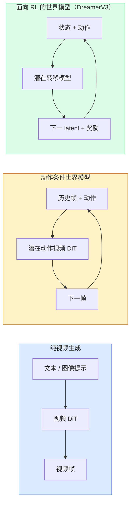

# 世界模型与视频扩散

> 能预测场景未来数秒的视频模型可以作为世界模拟器；再以动作作为预测条件，便可构成学习得到的交互环境。

**类型：** 学习 + 构建  
**学习实现：** Python  
**前置课程：** Phase 4 第 10 课（扩散）、Phase 4 第 12 课（视频理解）、Phase 4 第 23 课（DiT + Rectified Flow）  
**预计时间：** 约 75 分钟

## 学习目标

- 解释纯视频生成模型（Sora 2）与动作条件世界模型（Genie 3、DreamerV3）之间的差异。
- 描述视频 DiT：时空图块、3D 位置编码，以及跨 `(T, H, W)` 词元的联合注意力。
- 追踪世界模型如何接入机器人：VLM 规划 → 视频模型模拟 → 逆动力学输出动作。
- 为指定用例（创意视频、交互式模拟、自动驾驶合成），在 Sora 2、Genie 3、Runway GWM-1 Worlds、Wan-Video、HunyuanVideo 间选择。

## 问题

视频生成与世界建模在 2026 年逐渐汇合。能生成连贯长视频的模型，会学习物体恒常性、重力、因果和风格等运动规律。若以动作（向左走、开门）作为预测条件，视频模型可用作学习得到的模拟器，并在部分场景中替代游戏引擎、驾驶模拟器或机器人环境。

具体例子包括：Genie 3 可由单图生成可游玩的环境；Runway GWM-1 Worlds 合成可探索场景；Sora 2 生成带同步音频和建模物理的一分钟视频。NVIDIA Cosmos-Drive、Wayve Gaia-2 和 Tesla DrivingWorld 则为自动驾驶训练数据生成真实驾驶视频。世界模型正越来越多地用于机器人的 sim-to-real 流程。

本课将图像生成、视频理解与智能体推理连接起来，介绍当前研究中的一种架构模式。

## 概念

### 三类世界建模



- **Sora 2** 是由提示词条件控制的纯视频生成，没有动作接口；不能在 rollout 中途“操控”它。
- **Genie 3**、**GWM-1 Worlds**、**Mirage / Magica** 是动作条件世界模型：由观察视频推断潜在动作，再让未来帧预测以动作为条件。它们可交互——按键或移动相机时，场景会响应。
- **DreamerV3** 与经典 RL 世界模型家族在带显式动作条件的 latent 空间中预测，并以奖励信号训练；视觉性较弱，却更适合样本高效 RL。

### 视频 DiT 架构

```text
视频 latent：          (C, T, H, W)
图块化（空间）：       每帧 P_h x P_w 图块网格
图块化（时间）：       将 P_t 帧分为一个时间图块
所得词元：             (T / P_t) * (H / P_h) * (W / P_w) 个词元
```

位置编码是 3D 的：每个 `(t, h, w)` 坐标拥有 rotary 或可学习嵌入。注意力可以是：

- **完整联合**——所有词元关注所有词元，对 N 个词元为 `O(N^2)`；长视频难以承受。
- **分割式**——交替进行时间注意力（相同空间位置跨时间：`(H*W) * T^2`）和空间注意力（相同时间步跨空间：`T * (H*W)^2`）；TimeSformer 与多数视频 DiT 使用。
- **窗口式**——在 `(t, h, w)` 中采用局部窗口；Video Swin 使用。

2026 年的视频扩散模型通常会选择上述注意力形式之一，并结合 AdaLN 条件（第 23 课）和 rectified flow。

### 以动作为条件：潜在动作模型

Genie 通过判别式预测相邻帧间动作，为每帧学习一个**潜在动作**。模型解码器随后以推断的潜在动作作为条件，而非显式键盘按键。推理时，用户可指定潜在动作（或从新先验采样），模型生成与该动作一致的下一帧。

Sora 完全跳过动作接口。其解码器由过去时空词元预测下一时空词元；提示词条件化起始，但不能在生成中途操控。

### 物理合理性

Sora 2 的 2026 发布明确宣传**物理合理性**：重量、平衡、物体恒常性、因果。团队通过人工评分的合理性分数衡量；相较 Sora 1，在落体、角色碰撞、故意失败（跳跃失误）上有明显改进。

合理性仍是主导失败模式。2024–2025 年人吃意大利面或从玻璃杯喝水的视频，暴露出模型缺乏持久物体表示。2026 年模型（Sora 2、Runway Gen-5、HunyuanVideo）降低但未消除此问题。

### 自动驾驶世界模型

驾驶世界模型以轨迹、边界框或导航图为条件生成真实道路场景：

- **Cosmos-Drive-Dreams**（NVIDIA）——为 RL 训练生成数分钟驾驶视频。
- **Gaia-2**（Wayve）——为策略评估生成轨迹条件场景。
- **DrivingWorld**（Tesla）——模拟多种天气、时间、交通条件。
- **Vista**（ByteDance）——反应式驾驶场景合成。

它们替代昂贵的真实世界长尾数据采集：夜间行人横穿、结冰路口、罕见车型等，否则需要数百万英里驾驶才能收集。

### 机器人技术栈：VLM + 视频模型 + 逆动力学

新兴三组件机器人循环：

1. **VLM** 解析目标（“拿起红色杯子”），规划高层动作序列。
2. **视频生成模型** 模拟执行每个动作会呈现什么——预测 N 帧之后的观察。
3. **逆动力学模型** 提取产生这些观察的具体电机命令。

它取代奖励塑形和高样本消耗的 RL。世界模型负责想象，逆动力学闭环执行器。Genie Envisioner 是一种实现；许多研究组都在收敛到这一结构。

### 评估

- **视觉质量**——FVD（Fréchet Video Distance）、用户研究。
- **提示词对齐**——逐帧 CLIPScore、VQA 风格评估。
- **物理合理性**——在基准集上人工评分（Sora 2 内部基准、VBench）。
- **可控性**（交互世界模型）——动作 → 观察的一致性；能否回到先前状态？

### 2026 年模型版图

| 模型 | 用途 | 参数量 | 输出 | 许可证 |
|-------|------|--------|------|---------|
| Sora 2 | 文生视频、音频 | — | 1 分钟 1080p + 音频 | 仅 API |
| Runway Gen-5 | 文本/图像生视频 | — | 10 秒片段 | API |
| Runway GWM-1 Worlds | 交互世界 | — | 无限 3D rollout | API |
| Genie 3 | 由图像生成交互世界 | 11B+ | 可游玩帧 | 研究预览 |
| Wan-Video 2.1 | 开放文生视频 | 14B | 高质量片段 | 非商业 |
| HunyuanVideo | 开放文生视频 | 13B | 10 秒片段 | 宽松 |
| Cosmos / Cosmos-Drive | 自动驾驶模拟 | 7–14B | 驾驶场景 | NVIDIA 开放 |
| Magica / Mirage 2 | AI 原生游戏引擎 | — | 可修改世界 | 产品 |

```figure
v4-world-rollout
```

## 动手实现

### 步骤 1：视频的 3D patchify

```python
import torch
import torch.nn as nn


class VideoPatch3D(nn.Module):
    def __init__(self, in_channels=4, dim=64, patch_t=2, patch_h=2, patch_w=2):
        super().__init__()
        self.proj = nn.Conv3d(
            in_channels, dim,
            kernel_size=(patch_t, patch_h, patch_w),
            stride=(patch_t, patch_h, patch_w),
        )
        self.patch_t = patch_t
        self.patch_h = patch_h
        self.patch_w = patch_w

    def forward(self, x):
        # x: (N, C, T, H, W)
        x = self.proj(x)
        n, c, t, h, w = x.shape
        tokens = x.reshape(n, c, t * h * w).transpose(1, 2)
        return tokens, (t, h, w)
```

步长等于 kernel 的 3D 卷积充当时空图块器，`(T, H, W)` 变为 `(T/2, H/2, W/2)` 的词元网格。

### 步骤 2：3D rotary 位置编码

沿 `t`、`h`、`w` 轴分别应用旋转位置嵌入（Rotary Position Embeddings，RoPE）：

```python
def rope_3d(tokens, t_dim, h_dim, w_dim, grid):
    """
    tokens: (N, T*H*W, D)
    grid: (T, H, W) sizes
    t_dim + h_dim + w_dim == D
    """
    T, H, W = grid
    n, seq, d = tokens.shape
    if t_dim + h_dim + w_dim != d:
        raise ValueError(f"t_dim+h_dim+w_dim ({t_dim}+{h_dim}+{w_dim}) must equal D={d}")
    assert seq == T * H * W
    t_idx = torch.arange(T, device=tokens.device).repeat_interleave(H * W)
    h_idx = torch.arange(H, device=tokens.device).repeat_interleave(W).repeat(T)
    w_idx = torch.arange(W, device=tokens.device).repeat(T * H)
    # Simplified: just scale channels by frequencies. Real RoPE rotates pairs.
    freqs_t = torch.exp(-torch.log(torch.tensor(10000.0)) * torch.arange(t_dim // 2, device=tokens.device) / (t_dim // 2))
    freqs_h = torch.exp(-torch.log(torch.tensor(10000.0)) * torch.arange(h_dim // 2, device=tokens.device) / (h_dim // 2))
    freqs_w = torch.exp(-torch.log(torch.tensor(10000.0)) * torch.arange(w_dim // 2, device=tokens.device) / (w_dim // 2))
    emb_t = torch.cat([torch.sin(t_idx[:, None] * freqs_t), torch.cos(t_idx[:, None] * freqs_t)], dim=-1)
    emb_h = torch.cat([torch.sin(h_idx[:, None] * freqs_h), torch.cos(h_idx[:, None] * freqs_h)], dim=-1)
    emb_w = torch.cat([torch.sin(w_idx[:, None] * freqs_w), torch.cos(w_idx[:, None] * freqs_w)], dim=-1)
    return tokens + torch.cat([emb_t, emb_h, emb_w], dim=-1)
```

这是简化的加法形式。真实 RoPE 按频率旋转成对通道；位置所携带的信息相同。

### 步骤 3：分割注意力块

```python
class DividedAttentionBlock(nn.Module):
    def __init__(self, dim=64, heads=2):
        super().__init__()
        self.time_attn = nn.MultiheadAttention(dim, heads, batch_first=True)
        self.space_attn = nn.MultiheadAttention(dim, heads, batch_first=True)
        self.ln1 = nn.LayerNorm(dim)
        self.ln2 = nn.LayerNorm(dim)
        self.ln3 = nn.LayerNorm(dim)
        self.mlp = nn.Sequential(nn.Linear(dim, 4 * dim), nn.GELU(), nn.Linear(4 * dim, dim))

    def forward(self, x, grid):
        T, H, W = grid
        n, seq, d = x.shape
        # time attention: same (h, w), across t
        xt = x.view(n, T, H * W, d).permute(0, 2, 1, 3).reshape(n * H * W, T, d)
        a, _ = self.time_attn(self.ln1(xt), self.ln1(xt), self.ln1(xt), need_weights=False)
        xt = (xt + a).reshape(n, H * W, T, d).permute(0, 2, 1, 3).reshape(n, seq, d)
        # space attention: same t, across (h, w)
        xs = xt.view(n, T, H * W, d).reshape(n * T, H * W, d)
        a, _ = self.space_attn(self.ln2(xs), self.ln2(xs), self.ln2(xs), need_weights=False)
        xs = (xs + a).reshape(n, T, H * W, d).reshape(n, seq, d)
        xs = xs + self.mlp(self.ln3(xs))
        return xs
```

时间注意力在每个空间位置跨时间关注；空间注意力在每帧跨位置关注。两个 `O(T^2 + (HW)^2)` 操作替代一个 `O((THW)^2)` 操作。这是 TimeSformer 与许多现代视频 DiT 的核心设计。

### 步骤 4：组合微型视频 DiT

```python
class TinyVideoDiT(nn.Module):
    def __init__(self, in_channels=4, dim=64, depth=2, heads=2):
        super().__init__()
        self.patch = VideoPatch3D(in_channels=in_channels, dim=dim, patch_t=2, patch_h=2, patch_w=2)
        self.blocks = nn.ModuleList([DividedAttentionBlock(dim, heads) for _ in range(depth)])
        self.out = nn.Linear(dim, in_channels * 2 * 2 * 2)

    def forward(self, x):
        tokens, grid = self.patch(x)
        for blk in self.blocks:
            tokens = blk(tokens, grid)
        return self.out(tokens), grid
```

这段代码只演示结构并检查各部件的形状，不能作为生成器使用。

### 步骤 5：检查形状

```python
vid = torch.randn(1, 4, 8, 16, 16)  # (N, C, T, H, W)
model = TinyVideoDiT()
out, grid = model(vid)
print(f"input  {tuple(vid.shape)}")
print(f"tokens grid {grid}")
print(f"output {tuple(out.shape)}")
```

图块化后预期 `grid = (4, 8, 8)`、`out = (1, 256, 32)`；随后 head 投影到每词元的时空图块，准备反图块化回视频。

## 使用现成工具

2026 年生产访问方式：

- **Sora 2 API**（OpenAI）——文生视频、同步音频，价格高。
- **Runway Gen-5 / GWM-1**（Runway）——图生视频、交互世界。
- **Wan-Video 2.1 / HunyuanVideo**——开源自托管。
- **Cosmos / Cosmos-Drive**（NVIDIA）——开放权重的驾驶模拟。
- **Genie 3**——研究预览，需申请访问。

构建交互世界模型演示时，先以 Wan-Video 获得质量，再叠加潜在动作 adapter 获得交互性。自动驾驶模拟中，Cosmos-Drive 是 2026 年开放参考。

现实机器人的技术栈：

1. 语言目标 → VLM（Qwen3-VL）→ 高层计划。
2. 计划 → 潜在动作视频模型 → 想象 rollout。
3. Rollout → 逆动力学模型 → 低层动作。
4. 执行动作 → 观察反馈至步骤 1。

## 交付产物

本课产出：

- `outputs/prompt-video-model-picker.md`——根据任务、许可证与延迟选择 Sora 2 / Runway / Wan / HunyuanVideo / Cosmos 的提示词。
- `outputs/skill-physical-plausibility-checks.md`——定义任意生成视频交付前应运行的自动检查（物体恒常性、重力、连续性）的技能。

## 练习

1. **（简单）** 对 5 秒、360p 视频，以 patch-t=2、patch-h=8、patch-w=8 计算词元数，推理此规模注意力的内存。
2. **（中等）** 用完整联合注意力块替换上方分割注意力块，测量形状和参数量。解释为何真实视频模型必须使用分割注意力。
3. **（困难）** 构建最小潜在动作视频模型：取任意简单 2D 游戏的 `(frame_t, action_t, frame_{t+1})` 三元组数据集，训练以动作嵌入为条件的微型视频 DiT，展示不同动作产生不同下一帧。

## 关键术语

| 术语 | 常见说法 | 实际含义 |
|------|----------|----------|
| 世界模型（World model） | “学习得到的模拟器” | 给定状态和动作预测未来观察的模型 |
| 视频 DiT | “时空 transformer” | 使用 3D 图块化和分割注意力的 diffusion transformer |
| 潜在动作（Latent action） | “推断控制” | 从帧对推断出的离散或连续动作 latent；用于条件化下一帧生成 |
| 分割注意力（Divided attention） | “先时间后空间” | 每块两个注意力操作——跨时间、再跨空间——以使 `O(N^2)` 可控 |
| 物体恒常性 | “物体持续存在” | 视频模型必须学习的场景属性；食物、玻璃器皿上的经典失败模式 |
| FVD | “Fréchet Video Distance” | FID 的视频版本；主要视觉质量指标 |
| 逆动力学模型 | “由观察得到动作” | 给定（状态、下一状态）输出连接它们的动作；闭合机器人循环 |
| Cosmos-Drive | “NVIDIA 驾驶模拟” | 面向 RL 与评估的开放权重自动驾驶世界模型 |

## 延伸阅读

- [Sora 技术报告（OpenAI）](https://openai.com/index/video-generation-models-as-world-simulators/)
- [Genie：Generative Interactive Environments（Bruce 等，2024）](https://arxiv.org/abs/2402.15391)——潜在动作世界模型。
- [TimeSformer（Bertasius 等，2021）](https://arxiv.org/abs/2102.05095)——视频 transformer 的分割注意力。
- [DreamerV3（Hafner 等，2023）](https://arxiv.org/abs/2301.04104)——用于 RL 的世界模型。
- [Cosmos-Drive-Dreams（NVIDIA，2025）](https://research.nvidia.com/labs/toronto-ai/cosmos-drive-dreams/)——驾驶世界模型。
- [Top 10 Video Generation Models 2026（DataCamp）](https://www.datacamp.com/blog/top-video-generation-models)
- [From Video Generation to World Model：survey repo](https://github.com/ziqihuangg/Awesome-From-Video-Generation-to-World-Model/)
