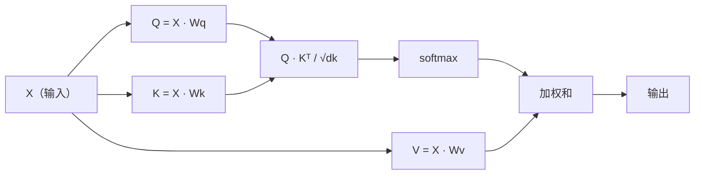

# 从头实现自注意力

> 注意力就像一张查询表，每个单词都在问：“谁对我重要？”——并学习答案。

**类型：** 构建  
**学习实现：** Python  
**前置课程：** Phase 3（深度学习核心）、Phase 5 第 10 课（序列到序列）  
**预计时间：** 约 90 分钟

## 学习目标

- 只使用 NumPy 从头实现缩放点积自注意力，包括查询/键/值投影和 softmax 加权和
- 构建一个多头注意力层：拆分各头、并行计算注意力并拼接结果
- 追踪注意力矩阵如何捕获词元关系，并解释为什么除以 sqrt(d_k) 能防止 softmax 饱和
- 应用因果遮蔽，把双向注意力转换为自回归（解码器风格）注意力

## 问题

RNN 一次处理一个词元。到达词元 50 时，词元 1 的信息已经经历 50 次压缩。长距离依赖被挤进固定大小的隐藏状态——无论加入多少 LSTM 门控，都无法完全解决这一瓶颈。

2014 年 Bahdanau 注意力论文给出了解法：让解码器回看每个编码器位置，并决定哪些位置对当前步骤重要。但当时注意力仍附着在 RNN 上。2017 年论文《Attention Is All You Need》提出了更尖锐的问题：如果注意力是*唯一*机制呢？没有循环，没有卷积，只有注意力。

自注意力让序列中的每个位置在一个并行步骤中关注其他每个位置。这正是 Transformer 快速、可扩展并占据主导地位的原因。

## 概念 <!-- learning-atlas: the-concept -->

### 数据库查询类比

把注意力想成一种软数据库查询：

```text
传统数据库：
  查询：“法国的首都”  -->  精确匹配  -->  “巴黎”

注意力：
  查询：“法国的首都”  -->  与所有键计算相似度  -->  所有值的加权混合
```

每个词元生成三个向量：

- **查询（Query，Q）**：“我在寻找什么？”
- **键（Key，K）**：“我包含什么？”
- **值（Value，V）**：“如果选中我，我能提供什么信息？”

查询与所有键之间的点积产生注意力分数。分数越高，表示“这个键与我的查询越匹配”。这些分数为值加权，输出就是值的加权和。

### Q、K、V 计算

每个词元嵌入都通过三个学习得到的权重矩阵投影：

```text
输入嵌入（包含 n 个词元的序列，每个词元为 d 维）：

  X = [x1, x2, x3, ..., xn]       形状：(n, d)

三个权重矩阵：

  Wq  形状：(d, dk)
  Wk  形状：(d, dk)
  Wv  形状：(d, dv)

投影：

  Q = X @ Wq    形状：(n, dk)      每个词元的查询
  K = X @ Wk    形状：(n, dk)      每个词元的键
  V = X @ Wv    形状：(n, dv)      每个词元的值
```

以一个词元为例，可视化如下：

```text
             Wq
  x_i ------[*]------> q_i    “我在寻找什么？”
       |
       |     Wk
       +----[*]------> k_i    “我包含什么？”
       |
       |     Wv
       +----[*]------> v_i    “我能提供什么？”
```

### 注意力矩阵

得到所有词元的 Q、K、V 后，注意力分数会组成矩阵：

```text
Scores = Q @ K^T    形状：(n, n)

              k1    k2    k3    k4    k5
        +-----+-----+-----+-----+-----+
   q1   | 2.1 | 0.3 | 0.1 | 0.8 | 0.2 |   <- q1 对每个键的关注程度
        +-----+-----+-----+-----+-----+
   q2   | 0.4 | 1.9 | 0.7 | 0.1 | 0.3 |
        +-----+-----+-----+-----+-----+
   q3   | 0.2 | 0.6 | 2.3 | 0.5 | 0.1 |
        +-----+-----+-----+-----+-----+
   q4   | 0.9 | 0.1 | 0.4 | 1.7 | 0.6 |
        +-----+-----+-----+-----+-----+
   q5   | 0.1 | 0.3 | 0.2 | 0.5 | 2.0 |
        +-----+-----+-----+-----+-----+

每一行：一个词元在整个序列上的注意力
```

逐个观察查询如何扫过各个键：每一行为所有词元评分，softmax 把分数变成权重，上下文向量则是所有值的加权混合。

```figure
attention-matrix
```

### 为什么要缩放？

点积会随维度 dk 增长。若 dk = 64，点积可能达到几十，把 softmax 推到梯度消失的区域。修复方法是除以 sqrt(dk)。

```text
缩放分数 = (Q @ K^T) / sqrt(dk)
```

这样可以把数值保持在 softmax 能产生有效梯度的范围内。

### Softmax 把分数转换为权重

Softmax 把原始分数转换为每行上的概率分布：

```text
q1 的原始分数：     [2.1, 0.3, 0.1, 0.8, 0.2]
                            |
                         softmax
                            |
注意力权重：         [0.52, 0.09, 0.07, 0.14, 0.08]   （总和约为 1.0）
```

现在，每个词元都有一组权重，表示它对其他各词元的关注程度。

### 值的加权和

每个词元的最终输出是所有值向量的加权和：

```text
output_i = sum( attention_weight[i][j] * v_j  for all j )

对于词元 1：
  output_1 = 0.52 * v1 + 0.09 * v2 + 0.07 * v3 + 0.14 * v4 + 0.08 * v5
```

### 完整流水线



用一行公式表示：

```text
Attention(Q, K, V) = softmax( Q @ K^T / sqrt(dk) ) @ V
```

```figure
softmax-attention-scaling
```

## 动手实现

### 步骤 1：从头实现 Softmax

Softmax 把原始 logits 转换为概率。为保证数值稳定性，先减去最大值。

```python
import numpy as np

def softmax(x):
    shifted = x - np.max(x, axis=-1, keepdims=True)
    exp_x = np.exp(shifted)
    return exp_x / np.sum(exp_x, axis=-1, keepdims=True)

logits = np.array([2.0, 1.0, 0.1])
print(f"logits:  {logits}")
print(f"softmax: {softmax(logits)}")
print(f"sum:     {softmax(logits).sum():.4f}")
```

### 步骤 2：缩放点积注意力

核心函数。接收 Q、K、V 矩阵，返回注意力输出和权重矩阵。

```python
def scaled_dot_product_attention(Q, K, V):
    dk = Q.shape[-1]
    scores = Q @ K.T / np.sqrt(dk)
    weights = softmax(scores)
    output = weights @ V
    return output, weights
```

### 步骤 3：带学习投影的自注意力类

一个完整的自注意力模块，包含 Wq、Wk、Wv 权重矩阵，并使用类似 Xavier 的缩放初始化。

```python
class SelfAttention:
    def __init__(self, d_model, dk, dv, seed=42):
        rng = np.random.default_rng(seed)
        scale = np.sqrt(2.0 / (d_model + dk))
        self.Wq = rng.normal(0, scale, (d_model, dk))
        self.Wk = rng.normal(0, scale, (d_model, dk))
        scale_v = np.sqrt(2.0 / (d_model + dv))
        self.Wv = rng.normal(0, scale_v, (d_model, dv))
        self.dk = dk

    def forward(self, X):
        Q = X @ self.Wq
        K = X @ self.Wk
        V = X @ self.Wv
        output, weights = scaled_dot_product_attention(Q, K, V)
        return output, weights
```

### 步骤 4：在一句话上运行

为一句话创建假嵌入，并观察注意力权重。

```python
sentence = ["The", "cat", "sat", "on", "the", "mat"]
n_tokens = len(sentence)
d_model = 8
dk = 4
dv = 4

rng = np.random.default_rng(42)
X = rng.normal(0, 1, (n_tokens, d_model))

attn = SelfAttention(d_model, dk, dv, seed=42)
output, weights = attn.forward(X)

print("Attention weights (each row: where that token looks):\n")
print(f"{'':>6}", end="")
for token in sentence:
    print(f"{token:>6}", end="")
print()

for i, token in enumerate(sentence):
    print(f"{token:>6}", end="")
    for j in range(n_tokens):
        w = weights[i][j]
        print(f"{w:6.3f}", end="")
    print()
```

### 步骤 5：用 ASCII 热力图可视化注意力

把注意力权重映射到字符，进行快速可视化。

```python
def ascii_heatmap(weights, tokens, chars=" ░▒▓█"):
    n = len(tokens)
    print(f"\n{'':>6}", end="")
    for t in tokens:
        print(f"{t:>6}", end="")
    print()

    for i in range(n):
        print(f"{tokens[i]:>6}", end="")
        for j in range(n):
            level = int(weights[i][j] * (len(chars) - 1) / weights.max())
            level = min(level, len(chars) - 1)
            print(f"{'  ' + chars[level] + '   '}", end="")
        print()

ascii_heatmap(weights, sentence)
```

## 用于实践

PyTorch 的 `nn.MultiheadAttention` 所做的正是我们刚构建的操作，外加多头拆分与输出投影：

```python
import torch
import torch.nn as nn

d_model = 8
n_heads = 2
seq_len = 6

mha = nn.MultiheadAttention(embed_dim=d_model, num_heads=n_heads, batch_first=True)

X_torch = torch.randn(1, seq_len, d_model)

output, attn_weights = mha(X_torch, X_torch, X_torch)

print(f"Input shape:            {X_torch.shape}")
print(f"Output shape:           {output.shape}")
print(f"Attention weight shape: {attn_weights.shape}")
print(f"\nAttn weights (averaged over heads):")
print(attn_weights[0].detach().numpy().round(3))
```

关键区别是：多头注意力会并行运行多个注意力函数，每个函数都有自己的 Q、K、V 投影，大小为 dk = d_model / n_heads，然后拼接结果。这让模型能同时关注不同类型的关系。

## 交付成果

本课会产出：

- `outputs/prompt-attention-explainer.md`——一个通过数据库查询类比解释注意力的提示

## 练习

1. 修改 `scaled_dot_product_attention`，使其接收可选遮蔽矩阵，并在 softmax 前把特定位置设为负无穷（因果 / 解码器遮蔽采用这种方式）
2. 从头实现多头注意力：把 Q、K、V 拆分成 `n_heads` 个块，分别运行注意力，拼接结果，再通过最终权重矩阵 Wo 投影
3. 取两个长度相同、内容不同的句子，将它们送入同一个 SelfAttention 实例并比较注意力模式。什么发生了变化？什么保持不变？

## 关键术语

| 术语 | 人们通常怎么说 | 实际含义 |
|------|----------------|----------|
| 查询（Query，Q） | “问题向量” | 输入的学习投影，表示这个词元正在寻找什么信息 |
| 键（Key，K） | “标签向量” | 表示这个词元包含什么信息的学习投影，用于与查询匹配 |
| 值（Value，V） | “内容向量” | 携带实际信息的学习投影，根据注意力分数进行聚合 |
| 缩放点积注意力 | “注意力公式” | softmax(QK^T / sqrt(dk)) @ V——缩放可防止 softmax 在高维空间中饱和 |
| 自注意力 | “词元查看自己和其他词元” | Q、K、V 都来自同一序列的注意力，让每个位置关注其他所有位置 |
| 注意力权重 | “关注多少” | 对缩放点积执行 softmax 后产生的位置概率分布 |
| 多头注意力 | “并行注意力” | 使用不同投影运行多个注意力函数，再拼接结果以获得更丰富的表示 |

## 延伸阅读

- [Attention Is All You Need（Vaswani 等，2017）](https://arxiv.org/abs/1706.03762)——最初的 Transformer 论文
- [The Illustrated Transformer（Jay Alammar）](https://jalammar.github.io/illustrated-transformer/)——完整架构最出色的图解导览
- [The Annotated Transformer（Harvard NLP）](https://nlp.seas.harvard.edu/annotated-transformer/)——带逐行解释的 PyTorch 实现
