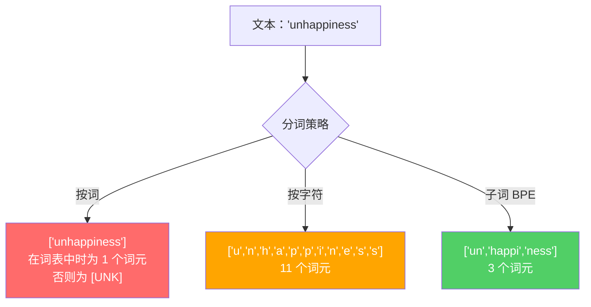
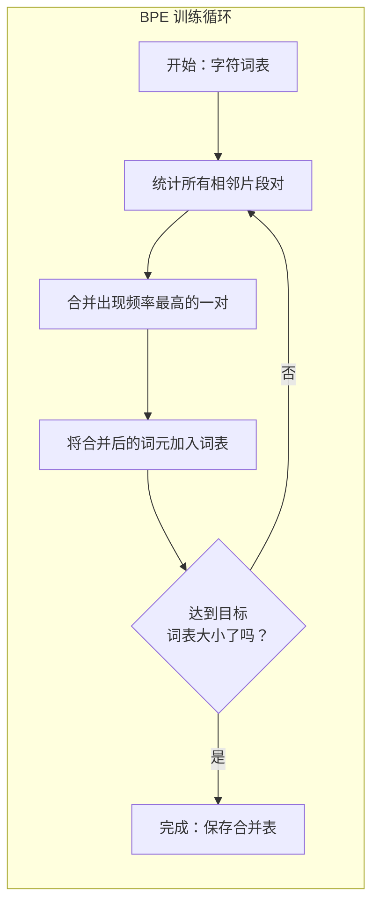
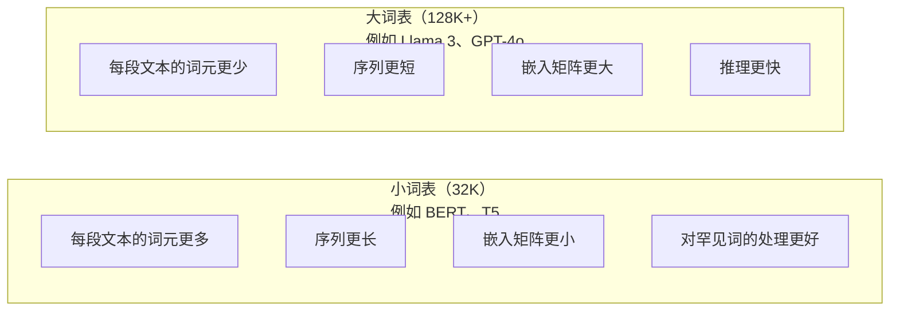

# 分词器：BPE、WordPiece、SentencePiece

> 你的 LLM 不读取英语。它读取的是整数。分词器决定这些整数承载的是意义，还是仅仅浪费了它。

**类型：** 构建
**语言：** Python
**前置要求：** 第 05 阶段（NLP 基础）
**用时：** 约 90 分钟

## 学习目标

- 从零实现 BPE、WordPiece 和 Unigram 分词算法，并比较它们的合并策略
- 解释词表大小如何影响模型效率：过小会产生很长的序列，过大会浪费嵌入参数
- 分析不同语言和代码中的分词伪影，找出特定分词器失效的位置
- 使用 tiktoken 和 sentencepiece 库对文本分词，并检查得到的词元 ID

## 问题所在

你的 LLM 不读取英语，也不读取任何自然语言；它读取的是数字。

从 "Hello, world!" 到 [15496, 11, 995, 0] 之间的鸿沟，就是分词器。模型能够处理文本之前，每个单词、每个空格、每个标点都必须转换为一个整数。这种转换并不中立：它会把一些之后无法撤销的假设写入模型。

如果分词做错，模型就会用多个词元编码常见单词，白白浪费容量。比如，"unfortunately" 会变成四个词元，而不是一个。对于多音节词很多的文本，你的 128K 上下文窗口会直接缩短 75%。如果分词做对，同一个上下文窗口就能容纳两倍的意义。一个模型是“擅长处理代码”，还是“遇到 Python 就卡住”，往往取决于分词器是如何训练的。

你对 GPT-4 或 Claude 发出的每次 API 调用都按词元计价。模型生成的每个词元都要消耗计算资源。表示一个输出所需的词元越少，端到端推理就越快。分词不是预处理；它属于架构。

## 核心概念 <!-- learning-atlas: the-concept -->

### 三种失败的方法（一种成功的方法）

把文本转换为数字，有三种显而易见的方法。其中两种无法在大规模场景下工作。

**按词分词**会按空格和标点切分。"The cat sat" 会变成 ["The", "cat", "sat"]。很简单。但 "tokenization" 怎么办？"GPT-4o" 呢？像 "Geschwindigkeitsbegrenzung" 这样的德语复合词呢？按词分词需要一个巨大的词表，才能覆盖每种语言中的每个单词。漏掉一个词，就会得到令人头疼的 `[UNK]` 词元——这是模型说“我不知道这是什么”的方式。仅英语就有超过一百万种词形；再加上代码、URL、科学计数法和另外 100 种语言，你需要的将是一个无限大的词表。

**按字符分词**则走向另一个极端。"hello" 会变成 ["h", "e", "l", "l", "o"]。词表很小（只有几百个字符），永远不会出现未知词元。但序列会变得极长。一句按词分词只需 10 个词元的话，按字符分词可能需要 50 个词元。模型必须自己学会 "t"、"h"、"e" 合在一起表示 "the"——把注意力容量消耗在一个人类三岁时就学会的事情上。

**子词分词**找到了平衡点。常见单词保持完整："the" 是一个词元。罕见单词则拆成有意义的片段："unhappiness" 会变成 ["un", "happi", "ness"]。词表大小保持在可控范围内（3 万到 12.8 万个词元），序列也保持较短。由于任何单词都可以由子词片段构成，未知词元基本上消失了。

每个现代 LLM 都使用子词分词：GPT-2、GPT-4、BERT、Llama 3、Claude——无一例外。问题在于，应该选择哪种算法。



### BPE：字节对编码

BPE 是一种被重新用于分词的贪心压缩算法。它的思路简单到足以写在一张索引卡片上。

从单个字符开始，统计训练语料中的每一对相邻片段，把出现频率最高的一对合并成一个新词元；重复这个过程，直到达到目标词表大小。

```figure
tokenizer-bpe
```

下面展示 BPE 如何在一个包含 "lower"、"lowest" 和 "newest" 的小型语料上运行：

```
语料（按词频计）：
  "lower"  x5
  "lowest" x2
  "newest" x6

第 0 步 -- 从字符开始：
  l o w e r       (x5)
  l o w e s t     (x2)
  n e w e s t     (x6)

第 1 步 -- 统计相邻片段对：
  (e,s): 8    (s,t): 8    (l,o): 7    (o,w): 7
  (w,e): 13   (e,r): 5    (n,e): 6    ...

第 2 步 -- 合并出现频率最高的一对 (w,e) -> "we"：
  l o we r        (x5)
  l o we s t      (x2)
  n e we s t      (x6)

第 3 步 -- 重新统计并合并 (e,s) -> "es"：
  l o we r        (x5)
  l o we s t      (x2)    <- 'es' 只会由 'e'+'s' 形成，而不是 'we'+'s'
  n e we s t      (x6)    <- 等等，'we' 前的 'e' 和 'we' 后的 's'

下面精确跟踪这个过程：
  合并 "we" 后，剩余片段对：
  (l,o): 7   (o,we): 7   (we,r): 5   (we,s): 8
  (s,t): 8   (n,e): 6    (e,we): 6

第 3 步 -- 合并 (we,s) -> "wes" 或 (s,t) -> "st"（两者都是 8，选择前者）：
  合并 (we,s) -> "wes"：
  l o we r        (x5)
  l o wes t       (x2)
  n e wes t       (x6)

第 4 步 -- 合并 (wes,t) -> "west"：
  l o we r        (x5)
  l o west        (x2)
  n e west        (x6)

……继续，直到达到目标词表大小。
```

合并表就是分词器。要编码新文本，需要按照学习到的顺序应用合并规则。训练语料决定哪些合并规则会存在，而这个选择会永久塑造模型所看到的内容。



### 字节级 BPE（GPT-2、GPT-3、GPT-4）

标准 BPE 处理的是 Unicode 字符。字节级 BPE 处理原始字节（0–255）。这样，基础词表恰好有 256 个条目，可以处理任何语言或编码，也永远不会产生未知词元。

GPT-2 引入了这种方法。基础词表覆盖每一个可能的字节，BPE 合并在此基础上继续构建。OpenAI 的 tiktoken 库实现了字节级 BPE，并使用以下词表大小：

- GPT-2：50,257 个词元
- GPT-3.5/GPT-4：约 100,256 个词元（cl100k_base 编码）
- GPT-4o：200,019 个词元（o200k_base 编码）

### WordPiece（BERT）

WordPiece 看起来与 BPE 相似，但选择合并对的方式不同。它根据训练数据的似然而非原始频率选择合并对：

```
BPE merge criterion:      count(A, B)
WordPiece merge criterion: count(AB) / (count(A) * count(B))
```

BPE 问的是：“哪一对出现得最多？”WordPiece 问的是：“哪一对共同出现的频率比随机情况下预期的更高？”这个细微差异会产生不同的词表。WordPiece 偏好共同出现得出人意料的合并，而不仅仅是出现频率高的合并。

WordPiece 还会使用 "##" 前缀表示延续性的子词：

```
"unhappiness" -> ["un", "##happi", "##ness"]
"embedding"   -> ["em", "##bed", "##ding"]
```

"##" 前缀表示这个片段接在前一个词元后面。BERT 使用 WordPiece，词表包含 30,522 个词元。BERT 的各个变体都沿用这一体系——不过 DistilBERT、RoBERTa 的分词器情况需要区分：RoBERTa 实际使用的是 BPE，而 BERT 本身使用的是 WordPiece。

### SentencePiece（Llama、T5）

SentencePiece 把输入视为 Unicode 字符的原始流，包括空白字符。不需要预分词步骤，也不需要针对特定语言制定词边界规则。这使它真正与语言无关：它适用于中文、日语、泰语，以及其他不使用空格分隔单词的语言。

SentencePiece 支持两种算法：
- **BPE 模式**：与标准 BPE 使用相同的合并逻辑，但作用于原始字符序列
- **Unigram 模式**：从一个大词表开始，迭代移除对整体似然影响最小的词元。它相当于 BPE 的反向过程，从合并改为剪枝。

Llama 2 使用词表大小为 32,000 的 SentencePiece BPE。T5 使用词表大小为 32,000 的 SentencePiece Unigram。注意：Llama 3 改用了基于 tiktoken 的字节级 BPE 分词器，词表大小为 128,256。

### 词表大小的权衡

这是一个会产生可测量后果的真实工程决策。



看几个具体数字。对于一个包含 128K 个条目、嵌入维度为 4,096 的词表，仅嵌入矩阵就有 128,000 x 4,096 = 5.24 亿个参数。对于 32K 词表，这个数字是 1.31 亿个参数。仅仅选择不同的分词器，就会带来 4 亿个参数的差异。

但更大的词表会更激进地压缩文本。同一段英文，用 32K 词表可能需要 100 个词元，而用 128K 词表可能只需要 70 个词元。这意味着生成时前向传播次数减少 30%。对于服务数百万次请求的模型，这会直接降低计算成本。

趋势很明确：词表正在变大。GPT-2 使用 50,257；GPT-4 使用约 100K；Llama 3 使用 128K；GPT-4o 使用 200K。

| 模型 | 词表大小 | 分词器类型 | 每个英文单词的平均词元数 |
|-------|-----------|----------------|---------------------------|
| BERT | 30,522 | WordPiece | ~1.4 |
| GPT-2 | 50,257 | 字节级 BPE | ~1.3 |
| Llama 2 | 32,000 | SentencePiece BPE | ~1.4 |
| GPT-4 | ~100,256 | 字节级 BPE | ~1.2 |
| Llama 3 | 128,256 | 字节级 BPE（tiktoken） | ~1.1 |
| GPT-4o | 200,019 | 字节级 BPE | ~1.0 |

### 多语言税

主要用英语训练的分词器对其他语言非常不友好。在 GPT-2 的分词器中，韩语文本平均每个词需要 2–3 个词元，中文的情况可能更糟。这意味着，韩国用户实际拥有的上下文窗口只有英语用户的一半，却要为更低的信息密度支付同样的价格。

这解释了 Llama 3 将词表从 32K 扩大到 128K、提升四倍的原因。为非英语文字分配更多词元，意味着不同语言之间可以获得更公平的压缩效果。

```figure
tokenizer-tradeoff
```

## 动手实现

### 第 1 步：字符级分词器

先从基础开始。字符级分词器把每个字符映射到它的 Unicode 码点。不需要训练，也不会有未知词元，只是一次直接映射。

```python
class CharTokenizer:
    def encode(self, text):
        return [ord(c) for c in text]

    def decode(self, tokens):
        return "".join(chr(t) for t in tokens)
```

"hello" 会变成 [104, 101, 108, 108, 111]。每个字符都是自己的词元，这构成了我们要改进的基线。

### 第 2 步：从零实现 BPE 分词器

现在进入真正的实现。我们在原始字节上训练（类似 GPT-2），统计片段对，合并出现频率最高的一对，并按顺序记录每次合并。合并表就是分词器。

```python
from collections import Counter

class BPETokenizer:
    def __init__(self):
        self.merges = {}
        self.vocab = {}

    def _get_pairs(self, tokens):
        pairs = Counter()
        for i in range(len(tokens) - 1):
            pairs[(tokens[i], tokens[i + 1])] += 1
        return pairs

    def _merge_pair(self, tokens, pair, new_token):
        merged = []
        i = 0
        while i < len(tokens):
            if i < len(tokens) - 1 and tokens[i] == pair[0] and tokens[i + 1] == pair[1]:
                merged.append(new_token)
                i += 2
            else:
                merged.append(tokens[i])
                i += 1
        return merged

    def train(self, text, num_merges):
        tokens = list(text.encode("utf-8"))
        self.vocab = {i: bytes([i]) for i in range(256)}

        for i in range(num_merges):
            pairs = self._get_pairs(tokens)
            if not pairs:
                break
            best_pair = max(pairs, key=pairs.get)
            new_token = 256 + i
            tokens = self._merge_pair(tokens, best_pair, new_token)
            self.merges[best_pair] = new_token
            self.vocab[new_token] = self.vocab[best_pair[0]] + self.vocab[best_pair[1]]

        return self

    def encode(self, text):
        tokens = list(text.encode("utf-8"))
        for pair, new_token in self.merges.items():
            tokens = self._merge_pair(tokens, pair, new_token)
        return tokens

    def decode(self, tokens):
        byte_sequence = b"".join(self.vocab[t] for t in tokens)
        return byte_sequence.decode("utf-8", errors="replace")
```

训练循环是 BPE 的核心：统计片段对、合并胜出者，然后重复。每次合并都会减少词元总数。经过 `num_merges` 轮后，词表会从 256 个（基础字节）增长到 256 + num_merges 个。

编码会严格按照学习到的顺序应用合并规则。这一点很重要。如果第 1 次合并创建了 "th"，第 5 次合并创建了 "the"，编码时就必须先应用第 1 次合并，这样在第 5 次合并时才能由 "th" + "e" 形成 "the"。

解码是它的逆过程：在词表中查找每个词元 ID，拼接对应的字节，再解码为 UTF-8。

### 第 3 步：编码与解码往返

```python
corpus = (
    "The cat sat on the mat. The cat ate the rat. "
    "The dog sat on the log. The dog ate the frog. "
    "Natural language processing is the study of how computers "
    "understand and generate human language. "
    "Tokenization is the first step in any NLP pipeline."
)

tokenizer = BPETokenizer()
tokenizer.train(corpus, num_merges=40)

test_sentences = [
    "The cat sat on the mat.",
    "Natural language processing",
    "tokenization pipeline",
    "unhappiness",
]

for sentence in test_sentences:
    encoded = tokenizer.encode(sentence)
    decoded = tokenizer.decode(encoded)
    raw_bytes = len(sentence.encode("utf-8"))
    ratio = len(encoded) / raw_bytes
    print(f"'{sentence}'")
    print(f"  Tokens: {len(encoded)} (from {raw_bytes} bytes) -- ratio: {ratio:.2f}")
    print(f"  Roundtrip: {'PASS' if decoded == sentence else 'FAIL'}")
```

压缩比可以告诉你分词器的效果。一项压缩比为 0.50，意味着文本被压缩到了原始字节词元数的一半。越低越好。在训练语料上，压缩比会比较理想；而对于 "unhappiness" 这类分布外文本（它没有出现在语料中），压缩比会变差——分词器会对未见过的模式退回到字符级编码。

### 第 4 步：与 tiktoken 比较

```python
import tiktoken

enc = tiktoken.get_encoding("cl100k_base")

texts = [
    "The cat sat on the mat.",
    "unhappiness",
    "Hello, world!",
    "def fibonacci(n): return n if n < 2 else fibonacci(n-1) + fibonacci(n-2)",
    "Geschwindigkeitsbegrenzung",
]

for text in texts:
    our_tokens = tokenizer.encode(text)
    tiktoken_tokens = enc.encode(text)
    tiktoken_pieces = [enc.decode([t]) for t in tiktoken_tokens]
    print(f"'{text}'")
    print(f"  Our BPE:   {len(our_tokens)} tokens")
    print(f"  tiktoken:  {len(tiktoken_tokens)} tokens -> {tiktoken_pieces}")
```

tiktoken 使用完全相同的算法，但它在数百 GB 文本上训练，并进行了 100,000 次合并。算法本身没有区别，差别在于训练数据和合并次数。你的分词器只在一段文本上进行 40 次合并，自然无法与 tiktoken 在海量语料上进行的 100K 次合并竞争。但底层机制是一样的。

### 第 5 步：词表分析

```python
def analyze_vocabulary(tokenizer, test_texts):
    total_tokens = 0
    total_chars = 0
    token_usage = Counter()

    for text in test_texts:
        encoded = tokenizer.encode(text)
        total_tokens += len(encoded)
        total_chars += len(text)
        for t in encoded:
            token_usage[t] += 1

    print(f"Vocabulary size: {len(tokenizer.vocab)}")
    print(f"Total tokens across all texts: {total_tokens}")
    print(f"Total characters: {total_chars}")
    print(f"Avg tokens per character: {total_tokens / total_chars:.2f}")

    print(f"\nMost used tokens:")
    for token_id, count in token_usage.most_common(10):
        token_bytes = tokenizer.vocab[token_id]
        display = token_bytes.decode("utf-8", errors="replace")
        print(f"  Token {token_id:4d}: '{display}' (used {count} times)")

    unused = [t for t in tokenizer.vocab if t not in token_usage]
    print(f"\nUnused tokens: {len(unused)} out of {len(tokenizer.vocab)}")
```

这会揭示词表中的 Zipf 分布。少数词元占据主导地位（例如空格、"the"、"e"），大多数词元很少被使用。生产级分词器会针对这种分布进行优化——常见模式得到较短的词元表示，罕见模式则得到更长的表示。

## 使用它

你从零实现的 BPE 已经可以工作了。现在看看生产级工具是什么样的。

### tiktoken（OpenAI）

```python
import tiktoken

enc = tiktoken.get_encoding("cl100k_base")

text = "Tokenizers convert text to integers"
tokens = enc.encode(text)
print(f"Tokens: {tokens}")
print(f"Pieces: {[enc.decode([t]) for t in tokens]}")
print(f"Roundtrip: {enc.decode(tokens)}")
```

tiktoken 使用 Rust 编写，并提供 Python 绑定。它每秒可以编码数百万个词元。算法仍然是同一个 BPE，但实现达到了工业级强度。

### Hugging Face 分词器库

```python
from tokenizers import Tokenizer
from tokenizers.models import BPE
from tokenizers.trainers import BpeTrainer
from tokenizers.pre_tokenizers import ByteLevel

tokenizer = Tokenizer(BPE())
tokenizer.pre_tokenizer = ByteLevel()

trainer = BpeTrainer(vocab_size=1000, special_tokens=["<pad>", "<eos>", "<unk>"])
tokenizer.train(["corpus.txt"], trainer)

output = tokenizer.encode("The cat sat on the mat.")
print(f"Tokens: {output.tokens}")
print(f"IDs: {output.ids}")
```

Hugging Face tokenizers 库的底层同样是 Rust。它可以在数 GB 规模的语料上于几秒内训练 BPE。训练自己的模型时，就会使用这样的工具。

### 加载 Llama 的分词器

```python
from transformers import AutoTokenizer

tokenizer = AutoTokenizer.from_pretrained("meta-llama/Llama-3.1-8B")

text = "Tokenizers are the unsung heroes of LLMs"
tokens = tokenizer.encode(text)
print(f"Token IDs: {tokens}")
print(f"Tokens: {tokenizer.convert_ids_to_tokens(tokens)}")
print(f"Vocab size: {tokenizer.vocab_size}")

multilingual = ["Hello world", "Hola mundo", "Bonjour le monde"]
for text in multilingual:
    ids = tokenizer.encode(text)
    print(f"'{text}' -> {len(ids)} tokens")
```

Llama 3 的 128K 词表对非英语文本的压缩效果显著优于 GPT-2 的 50K 词表。你可以亲自验证这一点：用多种语言编码同一个句子，然后统计词元数量。

## 交付产物

本节会产出 `outputs/prompt-tokenizer-analyzer.md`——一个可复用的提示词，用于分析任意文本与模型组合的分词效率。输入一段文本样本后，它会告诉你哪种模型的分词器处理得最好。

## 练习

1. 修改 BPE 分词器，使其在每次合并后打印词表。观察 "t" + "h" 如何变成 "th"，再观察 "th" + "e" 如何变成 "the"。跟踪常见英文单词如何逐片段组装起来。

2. 给 BPE 分词器加入特殊词元（`<pad>`、`<eos>`、`<unk>`）。为它们分配 ID 0、1、2，并相应地调整其他词元。实现一个预分词步骤，在运行 BPE 之前按空白切分。

3. 实现 WordPiece 的合并标准（使用似然比，而不是频率）。在同一个语料上、以相同的合并次数分别训练 BPE 和 WordPiece。比较得到的词表：哪一种产生的子词更有语言学意义？

4. 构建一个多语言分词器效率基准。分别选取英语、西班牙语、中文、韩语和阿拉伯语的 10 个句子。用 tiktoken（cl100k_base）对每种语言分词，并测量平均每字符词元数。量化每种语言承担的“多语言税”。

5. 在更大的语料上训练你的 BPE 分词器（下载一篇 Wikipedia 文章）。调整合并次数，使同一文本上的压缩比与 tiktoken 的差距控制在 10% 以内。这会迫使你理解语料规模、合并次数与压缩质量之间的关系。

## 关键术语

| 术语 | 常见说法 | 实际含义 |
|------|----------------|----------------------|
| 词元（词元） | “一个单词” | 模型词表中的一个单元，可以是字符、子词、单词，也可以是多个单词组成的片段 |
| BPE | “某种压缩方法” | 字节对编码：不断合并出现频率最高的相邻词元对，直到达到目标词表大小 |
| WordPiece | “BERT 的分词器” | 类似 BPE，但合并时最大化似然比 `count(AB)/(count(A)*count(B))`，而不是使用原始频率 |
| SentencePiece | “一个分词器库” | 与语言无关的分词器，直接处理原始 Unicode，不需要预分词，并支持 BPE 与 Unigram 算法 |
| 词表大小（Vocabulary size） | “它认识多少个单词” | 不同词元的总数：GPT-2 有 50,257 个，BERT 有 30,522 个，Llama 3 有 128,256 个 |
| 词元丰度（Fertility） | “不是分词器术语” | 每个单词平均对应的词元数，用于衡量分词器在不同语言上的效率（1.0 是理想值，3.0 表示模型需要多做三倍工作） |
| 字节级 BPE（Byte-level BPE） | “GPT 的分词器” | 在原始字节（0–255）而不是 Unicode 字符上运行的 BPE，保证任何输入都不会产生未知词元 |
| 合并表（Merge table） | “分词器文件” | 训练过程中学习到的、按顺序排列的片段对合并列表；它构成分词器，顺序很重要 |
| 预分词（Pre-tokenization） | “按空格切分” | 在子词分词之前应用的规则，包括按空白切分、分离数字和处理标点 |
| 压缩比（Compression ratio） | “分词器有多高效” | 生成的词元数除以输入字节数——数值越低，压缩越好、推理越快 |

## 延伸阅读

- [Sennrich 等，2016——《稀有词的神经机器翻译：使用子词单元》](https://arxiv.org/abs/1508.07909)——将一种 1994 年的压缩算法转变为现代分词基础、最早将 BPE 引入 NLP 的论文
- [Kudo 与 Richardson，2018——《SentencePiece：一种简单且与语言无关的子词分词器》](https://arxiv.org/abs/1808.06226)——让多语言模型变得实用的语言无关分词方法
- [OpenAI tiktoken 仓库](https://github.com/openai/tiktoken)——使用 Rust 编写并提供 Python 绑定的生产级 BPE 实现，用于 GPT-3.5/4/4o
- [Hugging Face Tokenizers 文档](https://huggingface.co/docs/tokenizers)——具备 Rust 性能的生产级分词器训练文档
