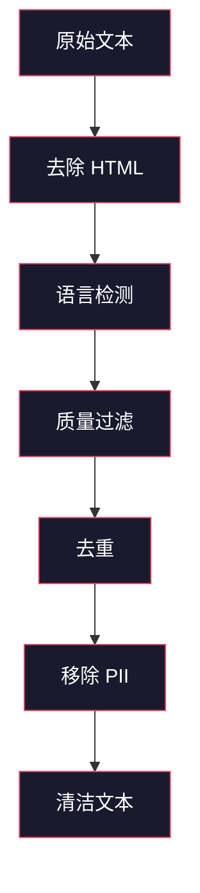
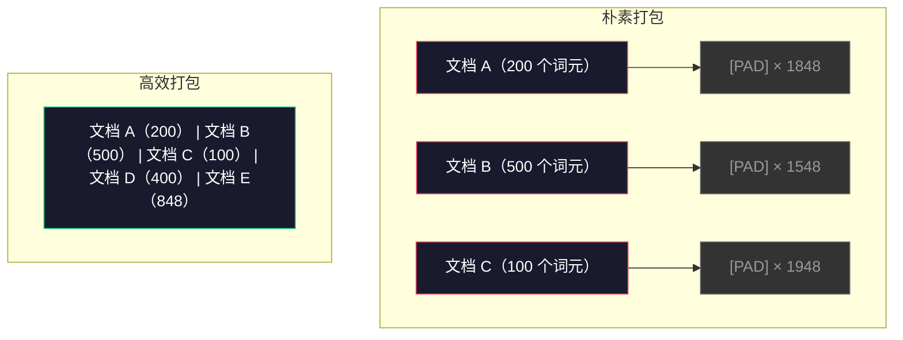

# 预训练数据管道

> 模型是一面镜子：你喂给它什么数据，它就反射什么。喂给它垃圾，它会用无可挑剔的流畅度反射出垃圾。

**类型：** 构建
**语言：** Python
**前置要求：** 第 10 阶段，第 01–02 课（分词器、构建分词器）
**用时：** 约 90 分钟

## 学习目标

- 构建流式数据管道，在不将全部数据载入内存的情况下，对数 TB 文本进行分词、分块、打乱和批处理
- 实现真实预训练管道所使用的数据质量过滤器（去重、语言检测、内容过滤）
- 创建固定长度的训练序列，并正确处理注意力掩码与文档边界
- 分析管道吞吐量，确保数据加载器跟得上 GPU 训练速度

## 问题

你已经有分词器了。现在需要数据。

不是一个数据集，也不是一个 CSV 文件。是数 TB 的文本——经过清洗、去重、质量过滤、分词并切成固定长度序列，然后以随机批次的形式快速提供，快到让你的 8-GPU 集群永远不用等待下一批数据。

训练 LLM 的核心在数据。Llama 3 使用了 15.6 万亿个词元，GPT-3 使用了 3000 亿个，DeepSeek-V2 使用了 8.1 万亿个。三者的架构大致相同：由注意力层和前馈层堆叠而成的 Transformer 块。输出质量的差异，压倒性地来自数据。

DeepMind 的 Chinchilla 论文把这一点说得很清楚：对于给定的计算预算，模型参数量与训练词元数之间存在一个最优比例。Chinchilla 证明，2022 年的大多数模型都严重训练不足——相对于它们见过的数据量，参数太多了。一个使用 1.4 万亿个词元训练的 700 亿参数模型（符合 Chinchilla 最优配置），超过了一个使用 3000 亿个词元训练的 2800 亿参数模型（Gopher）。

你的数据管道决定了模型学到的是语言，还是噪声。

## 概念

### 数据从哪里来

每个大型语言模型都使用混合来源的数据进行训练。对大多数实验室来说，具体配比都是严守的秘密，但我们已经知道足够多的类别信息。

| 来源 | 规模 | 质量 | 使用者 |
|--------|------|---------|---------|
| Common Crawl | 约 250 TB 原始数据 | 低（需要大量过滤） | GPT-3、Llama 以及大多数开源模型 |
| Wikipedia | 约 20 GB | 高 | 所有主流 LLM |
| GitHub 代码 | 约 1 TB 以上 | 中（重复内容多，也有大量废弃代码） | StarCoder、CodeLlama、DeepSeek-Coder |
| 书籍（BookCorpus、Pile） | 约 100 GB | 高 | GPT-2、GPT-3、早期模型 |
| 学术论文（arXiv、S2ORC） | 约 100 GB | 对 STEM 领域较高 | Llama、Galactica |
| StackOverflow、Reddit | 约 100 GB | 中 | Llama、Falcon |
| 精选网页（C4、RefinedWeb） | 约 5 TB | 中高（已预先过滤） | T5、Falcon |

Llama 3 公布了它的数据配比：约 50% 网页数据、25% 代码、13% 书籍和学术论文、8% 数学数据，以及 4% 多语言网页数据。总量为 15.6 万亿个词元，原始文本来源超过 5 TB。

这个配比和总量同样重要。网页数据过多，模型会变成 Reddit 复读机；代码太少，它就不会编程；数学太少，它就无法进行推理。找到正确的数据混合方式是训练 LLM 最困难的部分之一，而且没有现成公式——需要不断实验和评估。

### 数据清洗

原始网页数据非常脏。典型的 Common Crawl 抓取转储包含：

- HTML 标签与 JavaScript
- 模板化的页眉、页脚和导航菜单
- 重复页面（完全重复和近似重复）
- 机器生成的垃圾信息
- 个人身份信息（PII）
- 低质量文本（关键词列表、SEO 垃圾信息）
- 被编码成文本的非文本内容

清洗不是可选项。这决定了模型生成的是连贯段落，还是夹杂商品列表的 HTML 标签。



每一步都会消除一类噪声：

**去除 HTML：** 移除所有标记，只保留可见文本内容。`trafilatura` 或 `readability` 等库可以提取文章内容，同时丢弃导航、广告和模板化内容。

**语言检测：** 使用 fastText 的语言识别模型（lid.176.bin）为每份文档分类，只保留目标语言。被判定为英语但置信度低于 0.8 的文档，很可能不是干净的英语文本。

**质量过滤：** 有意思的地方就在这里。RefinedWeb（Falcon 背后的数据集）采用基于困惑度的过滤器：先在 Wikipedia 上训练一个小型语言模型，再给每份文档评分。困惑度高意味着文档不像 Wikipedia，很可能是垃圾信息、关键词列表或机器生成内容。困惑度高于阈值的文档会被移除。

**去重：** 影响最大的一步清洗。Common Crawl 中有海量重复页面——法律免责声明、Cookie 提示、服务条款等。在重复数据上训练会浪费计算资源，还可能导致模型记住并逐字复述特定段落。

**移除 PII：** 包括姓名、电子邮件地址、电话号码和社会保障号码。对结构化 PII 使用基于正则表达式的检测，对上下文中的姓名使用 NER 模型。

### 使用 MinHash 去重

精确去重很容易：对每份文档进行哈希，移除重复项。但近似重复才是真正的问题。同一篇新闻文章的两份副本，周围广告略有不同，属于近似重复。内容有 95% 相同，但逐字节比较并不相同。

MinHash + 局部敏感哈希（Locality-Sensitive Hashing，LSH）可以高效解决这个问题。


其思路如下：

1. **Shingling（分片）：** 将每份文档转换为 n-gram 集合（例如，以单词或字符为单位的 5-gram）。`"the quick brown fox"` 经 3-gram 分片后变为 `{ "the quick brown", "quick brown fox" }`。

2. **MinHash：** 为每份文档的分片集合计算 k 个哈希值。每个哈希值都是在不同哈希函数下，所有分片哈希值中的最小值。这样会生成一个固定大小的“签名”，用来近似任意两份文档之间的 Jaccard 相似度。

3. **LSH：** 根据 MinHash 签名的 band 将文档分组到不同桶中。处于同一桶的文档是近似重复候选项。这样无需比较所有文档对，只需比较候选项。

4. **验证：** 对每个候选文档对计算精确的 Jaccard 相似度。如果相似度超过阈值（通常为 0.8），就移除其中一个副本。

Llama 团队报告称，他们通过去重移除了约 38% 的网页数据。这不是一个小数字：Common Crawl 中超过三分之一的内容都是重复或近似重复的。

### 序列打包

模型期望固定长度的输入序列，而文档长度各不相同：有些只有 50 个词元，有些则长达 50,000 个词元。

朴素做法是将每份文档都填充到最大序列长度。这会在对学习毫无贡献的填充词元上浪费大量计算资源。

更好的做法是将多份文档打包到一个序列中，并用序列结束词元分隔。一条 2048-词元序列可能包含三份短文档，文档之间用 [EOS] 词元连接。



必须正确设置注意力掩码。在同一打包序列中，文档 A 的词元不应关注文档 B 的词元。这需要使用块对角注意力掩码。

长文档会在序列边界处被截断或拆分成多个块。拆分位置很重要：在句子中间拆分会迫使模型看到不完整的语义。一些管道会在可能的情况下，将拆分点对齐到段落或句子边界。

### Chinchilla 缩放定律

对于固定的计算预算 C（以 FLOPs 衡量），最优模型规模 N 和数据集规模 D 满足：

```
N_opt ~ C^0.5
D_opt ~ C^0.5
```

在实践中，这意味着模型规模和数据集规模应大致等比例扩展。参数量多 10 倍的模型，大约需要 10 倍的训练词元才能达到相同的损失。

| 模型 | 参数量 | 训练词元数 | 符合 Chinchilla 最优配置？ |
|-------|-----------|----------------|-------------------|
| GPT-3 | 175B | 300B | 否（训练不足 3–4 倍） |
| Chinchilla | 70B | 1.4T | 是（专门如此设计） |
| Llama 2 | 70B | 2T | 过度训练（有意为之） |
| Llama 3 | 70B | 15T | 严重过度训练 |

Llama 3 有意违背了 Chinchilla 定律。Meta 发现，使用远超计算最优配比的数据进行过度训练，能得到更适合推理的模型。额外的训练成本只需支付一次，但更小的模型在之后的长期服务中都更便宜。这种方法有时被称为“推理最优”缩放，自 2024 年以来已经成为行业标准。

```figure
l5-data-pipeline
```

## 动手构建

### 第 1 步：文本清洗

去除 HTML、规范化空白字符，并移除非文本内容。我们将使用一份公版文本（Project Gutenberg）作为小型语料库。

```python
import re

def clean_text(text):
    text = re.sub(r"<[^>]+>", "", text)
    text = re.sub(r"http\S+", "", text)
    text = re.sub(r"[^\x20-\x7E\n]", "", text)
    text = re.sub(r"\n{3,}", "\n\n", text)
    text = re.sub(r" {2,}", " ", text)
    return text.strip()

def quality_filter(text, min_words=50, max_ratio_caps=0.3, max_ratio_special=0.1):
    words = text.split()
    if len(words) < min_words:
        return False
    caps_ratio = sum(1 for w in words if w.isupper()) / len(words)
    if caps_ratio > max_ratio_caps:
        return False
    special_chars = sum(1 for c in text if not c.isalnum() and not c.isspace())
    if special_chars / max(len(text), 1) > max_ratio_special:
        return False
    return True
```

质量过滤器可以捕获 SEO 垃圾信息（全大写文本）、机器生成噪声（特殊字符占比高）和存根页面（过短）。仅这三项检查，就能从网页抓取结果中去掉数量惊人的垃圾。

### 第 2 步：MinHash 去重

从头实现 MinHash。不需要外部库——只用 `hashlib`。

```python
import hashlib
from collections import defaultdict

def get_shingles(text, k=5):
    words = text.lower().split()
    if len(words) < k:
        return set()
    return {" ".join(words[i:i+k]) for i in range(len(words) - k + 1)}

def minhash_signature(shingles, num_hashes=128):
    signature = []
    for i in range(num_hashes):
        min_hash = float("inf")
        for shingle in shingles:
            h = int(hashlib.sha256(f"{i}:{shingle}".encode()).hexdigest(), 16)
            min_hash = min(min_hash, h)
        signature.append(min_hash)
    return signature

def lsh_buckets(signature, bands=16):
    rows_per_band = len(signature) // bands
    buckets = []
    for b in range(bands):
        start = b * rows_per_band
        band_data = tuple(signature[start:start + rows_per_band])
        bucket_hash = hashlib.md5(str(band_data).encode()).hexdigest()
        buckets.append((b, bucket_hash))
    return buckets

def deduplicate(documents, threshold=0.8, num_hashes=128, bands=16):
    signatures = []
    shingle_sets = []
    for doc in documents:
        shingles = get_shingles(doc)
        shingle_sets.append(shingles)
        signatures.append(minhash_signature(shingles, num_hashes))

    bucket_map = defaultdict(list)
    for doc_idx, sig in enumerate(signatures):
        for band_id, bucket_hash in lsh_buckets(sig, bands):
            bucket_map[(band_id, bucket_hash)].append(doc_idx)

    duplicate_pairs = set()
    for bucket_docs in bucket_map.values():
        if len(bucket_docs) < 2:
            continue
        for i in range(len(bucket_docs)):
            for j in range(i + 1, len(bucket_docs)):
                duplicate_pairs.add((bucket_docs[i], bucket_docs[j]))

    removed = set()
    for i, j in duplicate_pairs:
        if i in removed or j in removed:
            continue
        s1, s2 = shingle_sets[i], shingle_sets[j]
        if not s1 or not s2:
            continue
        jaccard = len(s1 & s2) / len(s1 | s2)
        if jaccard >= threshold:
            removed.add(j)

    return [doc for idx, doc in enumerate(documents) if idx not in removed], len(removed)
```

`num_hashes=128` 和 `bands=16` 参数控制精确率与召回率之间的权衡。哈希函数越多，相似度估计越准确。band 越多，召回率越高（能捕获更多重复项），但误报也会增加。对于典型网页文本，这些取值效果良好。

### 第 3 步：分词并打包序列

对清洗并去重后的文本进行分词，再将其打包成用于训练的固定长度序列。

```python
def tokenize_corpus(documents, tokenizer):
    all_tokens = []
    for doc in documents:
        tokens = tokenizer.encode(doc)
        all_tokens.extend(tokens)
        all_tokens.append(tokenizer.eos_id)
    return all_tokens

def pack_sequences(token_ids, seq_length, pad_id=0):
    sequences = []
    attention_masks = []
    for i in range(0, len(token_ids), seq_length):
        seq = token_ids[i:i + seq_length]
        mask = [1] * len(seq)
        if len(seq) < seq_length:
            pad_count = seq_length - len(seq)
            seq = seq + [pad_id] * pad_count
            mask = mask + [0] * pad_count
        sequences.append(seq)
        attention_masks.append(mask)
    return sequences, attention_masks
```

### 第 4 步：用于训练的 DataLoader

生成随机排列的打包序列批次，作为训练循环要读取的数据。

```python
import random

class PreTrainingDataLoader:
    def __init__(self, sequences, attention_masks, batch_size, shuffle=True):
        self.sequences = sequences
        self.attention_masks = attention_masks
        self.batch_size = batch_size
        self.shuffle = shuffle

    def __len__(self):
        return (len(self.sequences) + self.batch_size - 1) // self.batch_size

    def __iter__(self):
        indices = list(range(len(self.sequences)))
        if self.shuffle:
            random.shuffle(indices)
        for start in range(0, len(indices), self.batch_size):
            batch_idx = indices[start:start + self.batch_size]
            batch_seqs = [self.sequences[i] for i in batch_idx]
            batch_masks = [self.attention_masks[i] for i in batch_idx]
            yield batch_seqs, batch_masks
```

### 第 5 步：数据集统计

计算重要指标：词元总数、唯一词元数、压缩比和文档长度分布。

```python
from collections import Counter

def compute_statistics(documents, token_ids, sequences, tokenizer_vocab_size):
    total_chars = sum(len(d) for d in documents)
    total_tokens = len(token_ids)
    unique_tokens = len(set(token_ids))
    compression_ratio = total_chars / total_tokens

    doc_lengths = [len(d.split()) for d in documents]
    avg_doc_length = sum(doc_lengths) / max(len(doc_lengths), 1)
    max_doc_length = max(doc_lengths) if doc_lengths else 0
    min_doc_length = min(doc_lengths) if doc_lengths else 0

    token_counts = Counter(token_ids)
    top_tokens = token_counts.most_common(10)

    non_pad_tokens = sum(sum(1 for t in seq if t != 0) for seq in sequences)
    total_positions = sum(len(seq) for seq in sequences)
    utilization = non_pad_tokens / max(total_positions, 1)

    stats = {
        "total_documents": len(documents),
        "total_characters": total_chars,
        "total_tokens": total_tokens,
        "unique_tokens": unique_tokens,
        "vocab_utilization": unique_tokens / tokenizer_vocab_size,
        "compression_ratio": compression_ratio,
        "avg_doc_length_words": avg_doc_length,
        "max_doc_length_words": max_doc_length,
        "min_doc_length_words": min_doc_length,
        "num_sequences": len(sequences),
        "sequence_utilization": utilization,
        "top_10_tokens": top_tokens,
    }
    return stats
```

压缩比反映分词器在此语料库上的效率。英文文本通常约为每个词元 3–4 个字符。如果看到每个词元只有 1.5 个字符，说明分词器切分得过于激进；如果达到 8 个字符以上，说明它学到了非常特定于某一领域的合并规则。

序列利用率反映打包序列中真实数据与填充数据的比例。低于 90% 意味着打包效率不高——你正在把计算资源浪费在填充词元上。

## 使用它

### 与 HuggingFace 数据集比较

通过 HuggingFace 的 datasets 库加载同一语料库，并比较管道速度。

```python
from datasets import load_dataset
from transformers import AutoTokenizer

ds = load_dataset("wikitext", "wikitext-2-raw-v1", split="train")
tokenizer = AutoTokenizer.from_pretrained("meta-llama/Meta-Llama-3-8B")

import time

start = time.time()
tokenized = ds.map(
    lambda x: tokenizer(x["text"], truncation=True, max_length=2048),
    batched=True,
    num_proc=4,
)
hf_time = time.time() - start
total_tokens = sum(len(t) for t in tokenized["input_ids"])
print(f"HuggingFace: {total_tokens:,} tokens in {hf_time:.2f}s ({total_tokens/hf_time:,.0f} tokens/sec)")
```

HuggingFace 管道在底层使用 Rust 分词器，并在 4 个核心上进行并行处理。纯 Python 管道会慢 10–50 倍。这种差距正是生产团队使用编译型分词器的原因。算法是相同的，区别在于实现语言。

## 交付

本课会产出一个用于验证和调试 LLM 训练管道数据质量的提示词。请参阅 `outputs/prompt-data-quality-checker.md`。

## 练习

1. **简单：** 使用简单的启发式方法（字符集分析）为清洗管道加入语言检测。只保留英文文档，并测量移除了多少文档。
2. **中等：** 在 MinHash 近似去重的基础上，使用 SHA-256 哈希实现精确去重。在网页抓取语料库上比较两种方法各自捕获的重复项数量。
3. **困难：** 构建基于困惑度的质量过滤器。在 Wikipedia 文本上训练一个小型二元语言模型，按困惑度为每份文档评分，并移除得分最差的 20%。比较使用过滤后数据与未过滤数据训练时的模型输出质量。

## 关键术语

| 术语 | 常见说法 | 实际含义 |
|------|----------------|----------------------|
| Common Crawl | “互联网” | 每月抓取网页的非营利组织——原始数据约 250 TB，是大多数 LLM 训练数据的起点 |
| MinHash | “某种哈希技巧” | 使用固定大小的签名估计集合间 Jaccard 相似度的技术，可在大规模场景下检测近似重复 |
| LSH | “局部敏感哈希” | 将相似项目归入同一桶的方法——将两两比较从 O(n^2) 降至近线性 |
| Sequence packing | “拼接文档” | 在正确设置注意力掩码的前提下，将多份文档装入固定长度序列——消除填充浪费 |
| Chinchilla scaling | “用更多数据训练” | 在固定计算预算下，要达到最优性能，需要大致等比例扩展模型规模和训练词元数 |
| Fertility | “每个单词对应的词元数” | 每个单词平均对应的词元数——GPT-4 的英文约为 1.3，非拉丁文字脚本通常更高 |
| Data mixing | “选择训练数据” | 代码、文本、数学和多语言数据之间的配比——没有公式，需要实验 |
| Perplexity filter | “质量评分” | 使用小型语言模型为文档评分——困惑度高表示文本不像干净的参考数据 |
| Deduplication | “移除副本” | 消除完全重复和近似重复的文档——通常会移除原始网页数据的 30–40% |
| Attention mask | “要关注哪些词元” | 阻止注意力跨越打包序列中文档边界的二值掩码 |

## 延伸阅读

- [Hoffmann 等，2022——训练计算最优的大型语言模型（Chinchilla）](https://arxiv.org/abs/2203.15556) —— 这篇论文改变了我们对数据规模的认识
- [Penedo 等，2023——Falcon 的 RefinedWeb 数据集](https://arxiv.org/abs/2306.01116) —— 如何将 Common Crawl 过滤为高质量数据
- [Touvron 等，2023——Llama 2：开放基础模型与微调聊天模型](https://arxiv.org/abs/2307.09288) —— Llama 2 的数据管道细节
- [Lee 等，2022——去重训练数据能让语言模型变得更好](https://arxiv.org/abs/2107.06499) —— 为什么去重的重要性超出你的想象
- [Broder，1997——关于文档的相似性与包含关系](https://ieeexplore.ieee.org/document/666900) —— MinHash 的原始论文
- [Meta，2024——Llama 3 技术报告](https://arxiv.org/abs/2407.21783) —— 15.6 万亿词元、数据混合比例和过滤管道
