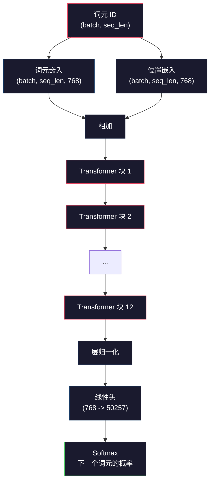
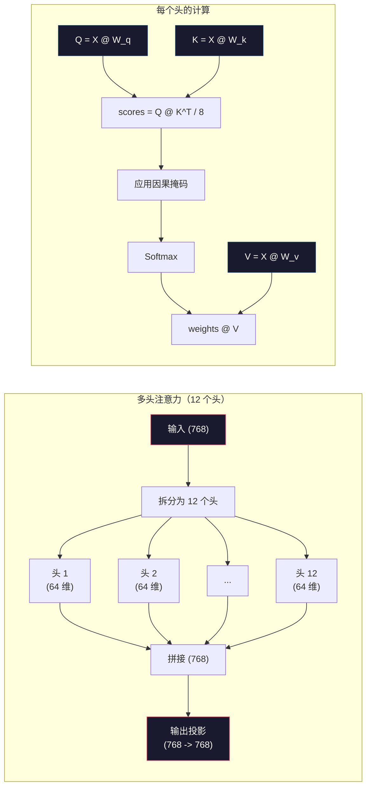
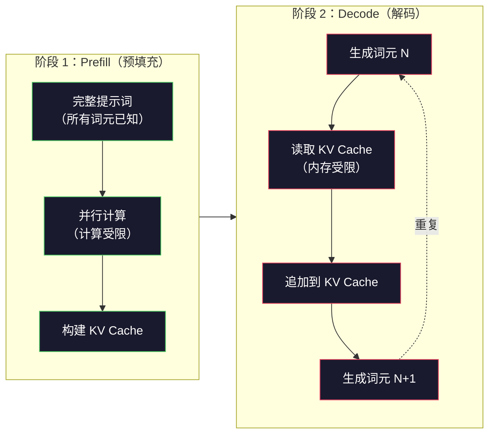

# 预训练 Mini GPT（1.24 亿参数）

> GPT-2 Small 拥有 1.24 亿个参数：12 个 Transformer 层、12 个注意力头，以及 768 维的嵌入。你可以在一块 GPU 上用几小时从零训练出它。大多数人从未这样做过，而是直接使用预训练检查点。但如果你没有亲手训练过一个模型，就并没有真正理解你正在用来构建产品的模型内部究竟发生了什么。

**类型：** 构建
**语言：** Python（使用 numpy）
**前置要求：** 第 10 阶段，第 01–03 课（分词器、构建分词器、数据管道）
**用时：** 约 120 分钟

## 学习目标

- 从零实现完整的 GPT-2 架构（1.24 亿参数）：词元嵌入、位置嵌入、Transformer 块和语言模型头
- 使用交叉熵损失，以预测下一个词元的方式在文本语料上训练 GPT 模型
- 使用温度采样和 top-k/top-p 过滤实现自回归文本生成
- 监控训练损失曲线，验证模型是否学会连贯的语言模式

## 问题

你知道 Transformer 是什么。你读过那些图示，可以背出“注意力就是一切所需”，也能在白板上画出标着“多头注意力”的方框。

这些都不意味着你理解模型生成文本时究竟发生了什么。

GPT-2 Small（使用权重绑定）共有 124,438,272 个参数。它们中的每一个，都是通过运行训练循环设定的：前向传播、计算损失、反向传播、更新权重。12 个 Transformer 块。每个块有 12 个注意力头。一个 768 维的嵌入空间。一个包含 50,257 个词元的词表。模型每生成一个词元，这 1.24 亿个参数就会全部参与一条矩阵乘法链：它接收一串词元 ID，输出下一个词元的概率分布。

如果你从未亲手构建过它，那么你面对的就是一个黑箱。你可以调用 API，也可以微调模型。但当事情出错时——模型产生幻觉、不断重复自己，或拒绝遵循指令——你没有一个心智模型来解释其中的*原因*。

本课将从零构建 GPT-2 Small，使用 numpy 而非 PyTorch。每一次矩阵乘法都清晰可见，每一个梯度都由你的代码计算。你将确切看到 1.24 亿个数字如何共同参与下一个词的预测。

## 概念

### GPT 架构

GPT 是一种自回归语言模型。“自回归”意味着模型每次生成一个词元，并以之前的所有词元为条件。它的架构是由多个 Transformer 解码器块堆叠而成的。

下面是从词元 ID 到下一个词元概率的完整计算图：

1. 输入词元 ID。形状为：(batch_size, seq_len)。
2. 查找词元嵌入。每个 ID 映射到一个 768 维向量。形状为：(batch_size, seq_len, 768)。
3. 查找位置嵌入。每个位置（0、1、2、……）映射到一个 768 维向量。形状相同。
4. 将词元嵌入与位置嵌入相加。
5. 依次通过 12 个 Transformer 块。
6. 执行最终的层归一化。
7. 线性投影到词表大小。形状为：(batch_size, seq_len, vocab_size)。
8. 通过 Softmax 得到概率。

完整模型由嵌入、注意力、前馈网络和层归一化组成，堆叠 12 次；其中没有卷积和循环。



### Transformer 块

12 个块都遵循同一种模式。这是 Pre-Norm 架构（GPT-2 使用 Pre-Norm，而不是原始 Transformer 所用的 Post-Norm）：

1. LayerNorm
2. 多头自注意力
3. 残差连接（加回输入）
4. LayerNorm
5. 前馈网络（MLP）
6. 残差连接（加回输入）

残差连接至关重要。没有它们，梯度在反向传播到达第 1 个块时就会消失。有了它们，梯度可以通过“跳跃”路径从损失直接流向任意层，因此可以堆叠 12、32 甚至 96 个块（据传 GPT-4 使用了 120 个块）。

### 注意力：核心机制

自注意力让每个词元都能查看之前的每个词元，并决定应该关注其中每一个的程度。下面是对应的数学表达。

对于每个词元位置，都要根据输入计算三个向量：
- **Query（Q）**：“我在寻找什么？”
- **Key（K）**：“我包含什么？”
- **Value（V）**：“我携带什么信息？”

```
Q = input @ W_q    (768 -> 768)
K = input @ W_k    (768 -> 768)
V = input @ W_v    (768 -> 768)

attention_scores = Q @ K^T / sqrt(d_k)
attention_scores = mask(attention_scores)   # causal mask: -inf for future positions
attention_weights = softmax(attention_scores)
output = attention_weights @ V
```

因果掩码正是让 GPT 成为自回归模型的关键。位置 5 可以关注位置 0–5，但不能关注 6、7、8 等后续位置。这能防止模型在训练时通过查看未来词元来“作弊”。

**多头注意力（Multi-Head Attention）**将 768 维空间拆分为 12 个头，每个头有 64 维。每个头都会学习不同的注意力模式：一个头可能追踪句法关系（主谓一致），另一个可能追踪语义相似性（同义词），还有一个可能追踪位置邻近性（相邻词语）。12 个头的输出会被拼接起来，再投影回 768 维。



除以 `sqrt(d_k)`（`sqrt(64) = 8`）就是缩放。如果没有这一步，高维向量的点积会变得很大，把 softmax 推入梯度几乎为零的区域。原始《Attention Is All You Need》论文将这个缩放因子用于稳定注意力计算。

### KV Cache：为什么推理很快

训练时，你一次处理整个序列；推理时，则一次生成一个词元。没有优化时，生成第 N 个词元需要为之前的 N-1 个词元重新计算注意力。这样每生成一个词元的代价是 O(N²)，长度为 N 的序列总成本则是 O(N³)。

KV cache 解决了这个问题。为每个词元计算出 K 和 V 后将其保存；生成第 N+1 个词元时，只需为新词元计算 Q，并读取之前所有词元的缓存 K、V。对于 K、V 的计算，每个词元的成本由 O(N) 降为 O(1)。注意力分数的计算仍为 O(N)，因为新词元仍要关注所有之前的位置，但不再需要对输入重复进行矩阵乘法。

对于 12 层、12 个头的 GPT-2，KV cache 为每个词元保存 `2 (K + V) x 12 layers x 12 heads x 64 dims = 18,432` 个值。长度为 1024 的序列在 FP32 下约占 75 MB。对于拥有 128 层的 Llama 3 405B，单个序列的 KV cache 可能超过 10 GB。因此，长上下文推理会受到显存限制。

### Prefill 与 Decode：推理的两个阶段

向 LLM 发送提示词后，推理会经历两个截然不同的阶段。

**Prefill** 会并行处理完整提示词。因为所有词元都已知，模型可以同时为所有位置计算注意力。这一阶段受计算能力限制——GPU 以满吞吐进行矩阵乘法。对于 A100 上长度为 1000 的提示词，prefill 大约需要 20–50 ms。

**Decode** 一次生成一个词元。每个新词元都依赖此前的全部词元。这一阶段受内存限制——瓶颈在于从 GPU 显存读取模型权重和 KV cache，而不是矩阵运算本身。GPU 的计算核心大多在等待内存读取。对于 GPT-2，无论矩阵乘法需要多少 FLOPs，每个 decode 步骤耗时都大致相同，因为真正的约束是内存带宽。

这一差别对生产系统很重要。Prefill 吞吐量随 GPU 计算能力扩展（更多 FLOPS = 更快的 prefill）；Decode 吞吐量随内存带宽扩展（更快的内存 = 更快的 decode）。这也是 NVIDIA H100 相比 A100 着重提升内存带宽的原因：它能直接加速词元生成。



### 训练循环

训练 LLM 就是进行下一个词元预测。给定词元 `[0, 1, 2, ..., N-1]`，预测 `[1, 2, 3, ..., N]`。损失函数是模型预测概率分布与真实下一个词元之间的交叉熵。

一个训练步骤包括：

1. **前向传播（Forward pass）**：让批次通过全部 12 个块，得到每个位置的 logits（softmax 前的分数）。
2. **计算损失（Compute loss）**：计算 logits 与目标词元（输入向右错位一位）之间的交叉熵。
3. **反向传播（Backward pass）**：通过反向传播计算全部 124M 个参数的梯度。
4. **优化器更新（Optimizer step）**：更新权重。GPT-2 使用 Adam，并采用学习率 warmup 与余弦衰减。

学习率调度的重要性可能超出你的预期。GPT-2 在前 2,000 步中将学习率从 0 逐渐升至峰值，然后沿余弦曲线衰减。一开始就使用高学习率会使模型发散；后期保持恒定高学习率会造成振荡。“先 warmup、再衰减”的模式被所有主流 LLM 使用。

### GPT-2 Small：具体数字

| 组件 | 形状 | 参数量 |
|-----------|-------|------------|
| 词元嵌入 | (50257, 768) | 38,597,376 |
| 位置嵌入 | (1024, 768) | 786,432 |
| Per-block attention (W_q, W_k, W_v, W_out) | 4 x (768, 768) | 2,359,296 |
| Per-block FFN (up + down) | (768, 3072) + (3072, 768) | 4,718,592 |
| Per-block LayerNorms (2x) | 2 x 768 x 2 | 3,072 |
| Final LayerNorm | 768 x 2 | 1,536 |
| **Total per block** | | **7,080,960** |
| **Total (12 blocks)** | | **85,054,464 + 39,383,808 = 124,438,272** |

输出投影（logits 头）与词元嵌入矩阵共享权重，这称为权重绑定。它能减少 3,800 万个参数，并迫使模型对输入和输出使用同一个表示空间，从而提升性能。

## 动手构建

### 第 1 步：嵌入层

词元嵌入将 50,257 个可能的词元分别映射为 768 维向量；位置嵌入补充每个词元在序列中的位置信息。两者相加得到层的输入。

```python
import numpy as np

class Embedding:
    def __init__(self, vocab_size, embed_dim, max_seq_len):
        self.token_embed = np.random.randn(vocab_size, embed_dim) * 0.02
        self.pos_embed = np.random.randn(max_seq_len, embed_dim) * 0.02

    def forward(self, token_ids):
        seq_len = token_ids.shape[-1]
        tok_emb = self.token_embed[token_ids]
        pos_emb = self.pos_embed[:seq_len]
        return tok_emb + pos_emb
```

初始化时使用 0.02 的标准差来自 GPT-2 论文。太大会让初始前向传播产生极端值，使训练不稳定；太小则会让所有输入的初始输出几乎相同，早期梯度信号失去作用。

### 第 2 步：带因果掩码的自注意力

先实现单头注意力。因果掩码在 softmax 之前将未来位置设为负无穷，保证每个位置只能关注自己和更早的位置。

```python
def attention(Q, K, V, mask=None):
    d_k = Q.shape[-1]
    scores = Q @ K.transpose(0, -1, -2 if Q.ndim == 4 else 1) / np.sqrt(d_k)
    if mask is not None:
        scores = scores + mask
    weights = np.exp(scores - scores.max(axis=-1, keepdims=True))
    weights = weights / weights.sum(axis=-1, keepdims=True)
    return weights @ V
```

softmax 的实现会在求指数前减去最大值。否则 `exp(large_number)` 会溢出为无穷大。这是一项不改变输出的数值稳定性技巧，因为对任意常数 `c` 都有 `softmax(x - c) = softmax(x)`。

### 第 3 步：多头注意力

将 768 维输入拆分为 12 个、每个 64 维的头。每个头独立计算注意力，再拼接结果并投影回 768 维。

```python
class MultiHeadAttention:
    def __init__(self, embed_dim, num_heads):
        self.num_heads = num_heads
        self.head_dim = embed_dim // num_heads
        self.W_q = np.random.randn(embed_dim, embed_dim) * 0.02
        self.W_k = np.random.randn(embed_dim, embed_dim) * 0.02
        self.W_v = np.random.randn(embed_dim, embed_dim) * 0.02
        self.W_out = np.random.randn(embed_dim, embed_dim) * 0.02

    def forward(self, x, mask=None):
        batch, seq_len, d = x.shape
        Q = (x @ self.W_q).reshape(batch, seq_len, self.num_heads, self.head_dim).transpose(0, 2, 1, 3)
        K = (x @ self.W_k).reshape(batch, seq_len, self.num_heads, self.head_dim).transpose(0, 2, 1, 3)
        V = (x @ self.W_v).reshape(batch, seq_len, self.num_heads, self.head_dim).transpose(0, 2, 1, 3)

        scores = Q @ K.transpose(0, 1, 3, 2) / np.sqrt(self.head_dim)
        if mask is not None:
            scores = scores + mask
        weights = np.exp(scores - scores.max(axis=-1, keepdims=True))
        weights = weights / weights.sum(axis=-1, keepdims=True)
        attn_out = weights @ V

        attn_out = attn_out.transpose(0, 2, 1, 3).reshape(batch, seq_len, d)
        return attn_out @ self.W_out
```

reshape—transpose—reshape 是多头注意力中最容易让人困惑的部分。具体来说，`(batch, seq_len, 768)` 张量先变成 `(batch, seq_len, 12, 64)`，再变成 `(batch, 12, seq_len, 64)`。此时 12 个头各自拥有一个 `(seq_len, 64)` 矩阵来运行注意力。注意力计算结束后反向执行这一过程：`(batch, 12, seq_len, 64)` 变为 `(batch, seq_len, 12, 64)`，再变为 `(batch, seq_len, 768)`。

### 第 4 步：Transformer 块

一个完整的 Transformer 块由 LayerNorm、带残差的多头注意力、LayerNorm 和带残差的前馈网络组成。

```python
class LayerNorm:
    def __init__(self, dim, eps=1e-5):
        self.gamma = np.ones(dim)
        self.beta = np.zeros(dim)
        self.eps = eps

    def forward(self, x):
        mean = x.mean(axis=-1, keepdims=True)
        var = x.var(axis=-1, keepdims=True)
        return self.gamma * (x - mean) / np.sqrt(var + self.eps) + self.beta


class FeedForward:
    def __init__(self, embed_dim, ff_dim):
        self.W1 = np.random.randn(embed_dim, ff_dim) * 0.02
        self.b1 = np.zeros(ff_dim)
        self.W2 = np.random.randn(ff_dim, embed_dim) * 0.02
        self.b2 = np.zeros(embed_dim)

    def forward(self, x):
        h = x @ self.W1 + self.b1
        h = np.maximum(0, h)  # GELU approximation: ReLU for simplicity
        return h @ self.W2 + self.b2


class TransformerBlock:
    def __init__(self, embed_dim, num_heads, ff_dim):
        self.ln1 = LayerNorm(embed_dim)
        self.attn = MultiHeadAttention(embed_dim, num_heads)
        self.ln2 = LayerNorm(embed_dim)
        self.ffn = FeedForward(embed_dim, ff_dim)

    def forward(self, x, mask=None):
        x = x + self.attn.forward(self.ln1.forward(x), mask)
        x = x + self.ffn.forward(self.ln2.forward(x))
        return x
```

前馈网络将 768 维输入扩展到 3,072 维（4 倍），应用非线性函数，再投影回 768 维。这种“扩展—收缩”结构让模型在每个位置都能使用更“宽”的内部表示。GPT-2 使用 GELU 激活，但为了简单起见这里使用 ReLU；就理解架构而言，二者差异不大。

### 第 5 步：完整 GPT 模型

堆叠 12 个 Transformer 块，在前面加入嵌入层，在后面加入输出投影。

```python
class MiniGPT:
    def __init__(self, vocab_size=50257, embed_dim=768, num_heads=12,
                 num_layers=12, max_seq_len=1024, ff_dim=3072):
        self.embedding = Embedding(vocab_size, embed_dim, max_seq_len)
        self.blocks = [
            TransformerBlock(embed_dim, num_heads, ff_dim)
            for _ in range(num_layers)
        ]
        self.ln_f = LayerNorm(embed_dim)
        self.vocab_size = vocab_size
        self.embed_dim = embed_dim

    def forward(self, token_ids):
        seq_len = token_ids.shape[-1]
        mask = np.triu(np.full((seq_len, seq_len), -1e9), k=1)

        x = self.embedding.forward(token_ids)
        for block in self.blocks:
            x = block.forward(x, mask)
        x = self.ln_f.forward(x)

        logits = x @ self.embedding.token_embed.T
        return logits

    def count_parameters(self):
        total = 0
        total += self.embedding.token_embed.size
        total += self.embedding.pos_embed.size
        for block in self.blocks:
            total += block.attn.W_q.size + block.attn.W_k.size
            total += block.attn.W_v.size + block.attn.W_out.size
            total += block.ffn.W1.size + block.ffn.b1.size
            total += block.ffn.W2.size + block.ffn.b2.size
            total += block.ln1.gamma.size + block.ln1.beta.size
            total += block.ln2.gamma.size + block.ln2.beta.size
        total += self.ln_f.gamma.size + self.ln_f.beta.size
        return total
```

注意这里的权重绑定：`logits = x @ self.embedding.token_embed.T`。输出投影复用了转置后的词元嵌入矩阵。这不只是节省参数的技巧，也意味着模型用同一个向量空间来理解词元（嵌入）并预测词元（输出）。

### 第 6 步：训练循环

若要真正训练 1.24 亿参数的模型，需要 GPU 和 PyTorch。这里用一个可以纯 numpy 运行的小模型演示机制。为了让实验可执行，使用 4 层、4 个头、128 维的微型模型。

```python
def cross_entropy_loss(logits, targets):
    batch, seq_len, vocab_size = logits.shape
    logits_flat = logits.reshape(-1, vocab_size)
    targets_flat = targets.reshape(-1)

    max_logits = logits_flat.max(axis=-1, keepdims=True)
    log_softmax = logits_flat - max_logits - np.log(
        np.exp(logits_flat - max_logits).sum(axis=-1, keepdims=True)
    )

    loss = -log_softmax[np.arange(len(targets_flat)), targets_flat].mean()
    return loss


def train_mini_gpt(text, vocab_size=256, embed_dim=128, num_heads=4,
                   num_layers=4, seq_len=64, num_steps=200, lr=3e-4):
    tokens = np.array(list(text.encode("utf-8")[:2048]))
    model = MiniGPT(
        vocab_size=vocab_size, embed_dim=embed_dim, num_heads=num_heads,
        num_layers=num_layers, max_seq_len=seq_len, ff_dim=embed_dim * 4
    )

    print(f"Model parameters: {model.count_parameters():,}")
    print(f"Training tokens: {len(tokens):,}")
    print(f"Config: {num_layers} layers, {num_heads} heads, {embed_dim} dims")
    print()

    for step in range(num_steps):
        start_idx = np.random.randint(0, max(1, len(tokens) - seq_len - 1))
        batch_tokens = tokens[start_idx:start_idx + seq_len + 1]

        input_ids = batch_tokens[:-1].reshape(1, -1)
        target_ids = batch_tokens[1:].reshape(1, -1)

        logits = model.forward(input_ids)
        loss = cross_entropy_loss(logits, target_ids)

        if step % 20 == 0:
            print(f"Step {step:4d} | Loss: {loss:.4f}")

    return model
```

损失一开始接近 `ln(vocab_size)`；对于含 256 个词元的字节级词表，就是 `ln(256) = 5.55`。随机模型为每个词元分配相同概率。随着训练进行，模型学会预测常见模式，损失随之下降，例如在 `t` 后预测 `h`、在句号后预测空格等。

在生产环境中，你会使用带梯度累积、学习率 warmup 和梯度裁剪的 Adam 优化器。前向传播—损失—反向传播—更新这一循环完全相同，只是优化器更加复杂。

### 第 7 步：文本生成

生成阶段使用训练后的模型一次预测一个词元。每次预测都从输出分布中采样，或者直接贪心地取 argmax。

```python
def generate(model, prompt_tokens, max_new_tokens=100, temperature=0.8):
    tokens = list(prompt_tokens)
    seq_len = model.embedding.pos_embed.shape[0]

    for _ in range(max_new_tokens):
        context = np.array(tokens[-seq_len:]).reshape(1, -1)
        logits = model.forward(context)
        next_logits = logits[0, -1, :]

        next_logits = next_logits / temperature
        probs = np.exp(next_logits - next_logits.max())
        probs = probs / probs.sum()

        next_token = np.random.choice(len(probs), p=probs)
        tokens.append(next_token)

    return tokens
```

温度控制随机性。温度 1.0 使用原始分布；温度 0.5 会使分布更尖锐（更确定，模型更常选择高概率项）；温度 1.5 会使分布更平坦（更随机，低概率词元获得更大机会）；温度 0.0 表示贪心解码（始终选择概率最高的词元）。

`tokens[-seq_len:]` 这个窗口是必要的，因为模型有最大上下文长度（GPT-2 为 1024）。一旦超过这个长度，就必须丢弃最早的词元。这种限制形成了大家常说的“上下文窗口”。

```figure
sampling-decoder
```

## 使用方法

### Full Training and Generation Demo

```python
corpus = """The transformer architecture has revolutionized natural language processing.
Attention mechanisms allow the model to focus on relevant parts of the input.
Self-attention computes relationships between all pairs of positions in a sequence.
Multi-head attention splits the representation into multiple subspaces.
Each attention head can learn different types of relationships.
The feedforward network provides nonlinear transformations at each position.
Residual connections enable gradient flow through deep networks.
Layer normalization stabilizes training by normalizing activations.
Position embeddings give the model information about token ordering.
The causal mask ensures autoregressive generation during training.
Pre-training on large text corpora teaches the model general language understanding.
Fine-tuning adapts the pre-trained model to specific downstream tasks."""

model = train_mini_gpt(corpus, num_steps=200)

prompt = list("The transformer".encode("utf-8"))
output_tokens = generate(model, prompt, max_new_tokens=100, temperature=0.8)
generated_text = bytes(output_tokens).decode("utf-8", errors="replace")
print(f"\nGenerated: {generated_text}")
```

在小语料和小模型上，生成文本最多只能做到部分连贯。它会从训练文本中学到一些字节级模式，却无法像使用 40 GB 训练数据和完整 1.24 亿参数架构的 GPT-2 那样泛化。重点不在输出质量，而在于你可以追踪每一步：嵌入查找、注意力计算、前馈变换、logit 投影、softmax 和采样。每个操作都清晰可见。

## 交付成果

本课会产出 `outputs/prompt-gpt-architecture-analyzer.md`：一个分析任意 GPT 风格模型架构选择的提示词。输入模型卡片或技术报告后，它会拆解参数分配、注意力设计和规模化决策。

## 练习

1. 将模型从 12 层、12 个头改为 24 层、16 个头，并统计参数量。把深度翻倍与宽度（嵌入维度）翻倍相比，结果有什么不同？

2. 实现 GELU 激活函数（`GELU(x) = x * 0.5 * (1 + erf(x / sqrt(2)))`），并替换前馈网络中的 ReLU。分别使用两种激活训练 500 步，比较最终损失。

3. 为生成函数加入 KV cache。第一次前向传播后保存每层的 K、V 张量，并在后续词元中复用。分别使用和不使用缓存生成 200 个词元，比较实际耗时并测量加速比。

4. 实现 top-k 采样（只考虑概率最高的 k 个词元）和 top-p 采样（核采样：考虑累计概率超过 p 的最小词元集合）。在温度为 0.8 时比较 `top-k=50` 与 `top-p=0.95` 的输出质量。

5. 构建训练损失曲线绘制器。训练模型 1,000 步并绘制损失随步数变化的曲线，识别三个阶段：初期快速下降（学习常见字节）、中期较慢下降（学习字节模式）和平台期（在小语料上过拟合）。无论训练 128 维模型还是 GPT-4，这条曲线的形状都具有相同的基本含义。

## 关键术语

| 术语 | 人们常说 | 实际含义 |
|------|----------------|----------------------|
| 自回归 | “一次生成一个词” | 每个输出词元都以之前所有词元为条件，模型预测 `P(token_n \| token_0, ..., token_{n-1})` |
| 因果掩码 | “看不到未来” | 由负无穷组成的上三角矩阵，在训练时阻止注意力访问未来位置 |
| 多头注意力 | “多种注意力模式” | 将 Q、K、V 拆分为并行的多个头（例如 GPT-2 的 12 个 64 维头），使每个头学习不同类型的关系 |
| KV Cache | “用于加速的缓存” | 保存之前词元已计算的 Key、Value 张量，避免自回归生成中的重复计算 |
| Prefill | “处理提示词” | 推理的第一阶段，并行处理所有提示词词元，受 GPU FLOPS 的计算能力限制 |
| Decode | “生成词元” | 推理的第二阶段，一次生成一个词元，受 GPU 内存带宽限制 |
| 权重绑定 | “共享嵌入” | 输入词元嵌入和输出投影头使用同一个矩阵，GPT-2 因此节省 3,800 万个参数 |
| 残差连接 | “跳跃连接” | 将输入直接加到子层输出上（`x + sublayer(x)`），让深层网络中的梯度能够流动 |
| 层归一化 | “归一化激活” | 沿特征维度归一化，使均值为 0、方差为 1，并使用可学习的缩放与偏置参数 |
| 交叉熵损失 | “预测有多错” | 对正确下一个词元的概率取负对数，再在所有位置上求平均，是 LLM 的标准训练目标 |

## 延伸阅读

- [Radford 等，2019——《Language Models are Unsupervised Multitask Learners》（GPT-2）](https://cdn.openai.com/better-language-models/language_models_are_unsupervised_multitask_learners.pdf) —— 介绍 1.24 亿至 15 亿参数模型系列的 GPT-2 论文
- [Vaswani 等，2017——《Attention Is All You Need》](https://arxiv.org/abs/1706.03762) —— 提出缩放点积注意力与多头注意力的原始 Transformer 论文
- [《Llama 3 技术报告》](https://arxiv.org/abs/2407.21783) —— Meta 如何使用 16,000 块 GPU 将 GPT 架构扩展到 4050 亿参数
- [Pope 等，2022——《Efficiently Scaling Transformer Inference》](https://arxiv.org/abs/2211.05102) —— 形式化 prefill、decode 与 KV cache 分析的论文
