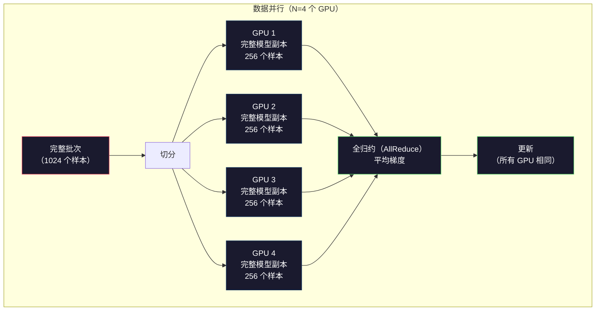
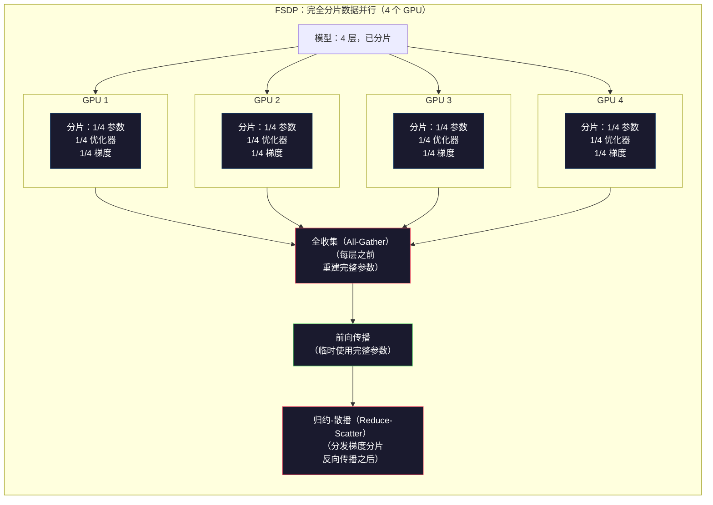
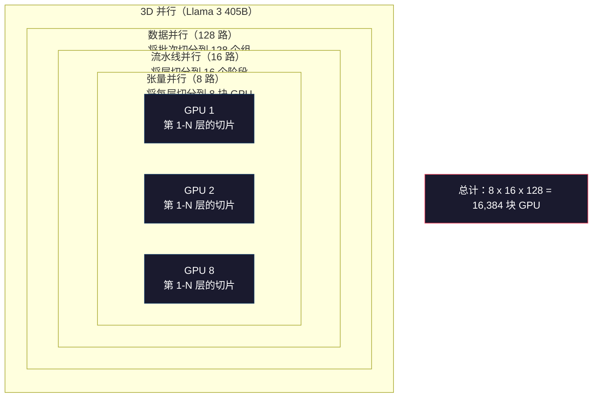

# 规模化：分布式训练、FSDP 与 DeepSpeed

> 你的 1.24 亿参数模型已经在一块 GPU 上训练完成。现在试试 70 亿参数。模型塞不进显存，单机处理数据要花上几周。在这种规模下，分布式训练是运行模型的必要条件。

**类型：** 构建
**语言：** Python
**前置课程：** Phase 10，第 04 课（预训练 Mini GPT）
**预计时间：** 约 120 分钟

## 学习目标

- 解释三类并行（数据并行、张量并行、流水线并行），并根据模型规模和集群规模判断何时需要使用每一类并行
- 使用 PyTorch DDP 实现数据并行训练，让多个 GPU 之间同步梯度
- 计算给定模型规模的显存预算（权重 + 优化器状态 + 梯度 + 激活），确定所需的最低硬件配置
- 配置 FSDP 或 DeepSpeed ZeRO 的各个阶段，在 GPU 之间分片模型状态，使超过单卡显存容量的模型也能装下

## 问题

一个 70 亿参数的 FP16 模型，仅权重就需要 14GB。Adam 优化器会为每个参数额外保存两份副本（分别是一阶和二阶矩估计），又要占用 28GB。反向传播产生的梯度还要增加 14GB。还没存下任何一个激活，你的显存占用就已经达到 56GB。

一块 NVIDIA A100 有 80GB 显存。

80GB 中已经用掉 56GB，只剩 24GB 给激活使用——激活是前向传播计算出的中间值，反向传播时必须保留。对于长度为 2048、模型维度为 4096 的序列，单层激活大约占 64MB。32 层每个样本就需要 2GB，批大小为 8 时需要 16GB；你还有 24GB。但批大小一旦提高到 12，就会爆显存。

现在试试 700 亿参数。仅 FP16 权重就要 140GB，一块 GPU 根本放不下。光是存储权重，至少需要 2 块 A100（2 x 80GB = 160GB）。再加上优化器状态和梯度，需求会高得多：最低需要 3 块以上 GPU，实际数量则取决于分片策略，通常要 8–16 块。

Llama 3 405B 使用 16,384 块 NVIDIA H100 训练完成，这次训练的计算成本估计为 1 亿美元。DeepSeek V3 则通过更聪明的架构设计和训练效率，将一个规模相当的模型训练成本压到了约 560 万美元；其中，混合专家（Mixture of Experts）意味着每个词元只激活一部分参数。

本课介绍让大规模训练成为可能的四种策略：数据并行、张量并行、流水线并行和完全分片数据并行。你会先用纯 Python 模拟每一种策略，理解其工作机制，再接触任何分布式训练框架。

## 概念 <!-- learning-atlas: the-concept -->

### 为什么必须使用分布式训练

下面是实际模型的显存计算。每个数字都经过计算，而不是估算。

| 模型 | 参数量 | 权重（FP16） | Adam 状态 | 梯度（FP16） | 总计（不含激活） |
|-------|--------|----------------|-------------|------------------|----------------------|
| GPT-2 Small | 124M | 248 MB | 992 MB | 248 MB | 1.5 GB |
| Llama 3 8B | 8B | 16 GB | 64 GB | 16 GB | 96 GB |
| Llama 3 70B | 70B | 140 GB | 560 GB | 140 GB | 840 GB |
| Llama 3 405B | 405B | 810 GB | 3,240 GB | 810 GB | 4,860 GB |

真正棘手的是“Adam 状态”这一列。Adam 会为每个参数保存运行均值（m）和运行方差（v），二者都是 FP32。对于 700 亿参数模型，这相当于 `70B x 4 bytes x 2 = 560GB`。仅优化器状态就需要 7 块 A100。

一块 H100 有 80GB。Llama 3 405B 至少需要 61 块 H100 才能容纳权重、优化器状态和梯度；加上激活后，数量还会继续增加。Meta 因此使用了 16,384 块 GPU。

### 数据并行

这是最简单的分布式策略：把完整模型复制到 N 块 GPU 上，把每个训练批次等分成 N 份。每块 GPU 都在自己的数据分片上执行前向和反向传播。反向传播结束后，在所有 GPU 之间平均梯度。每块 GPU 都用同一份平均梯度更新自己的权重副本，从而保持所有副本同步。

**优点：** 吞吐量可以线性扩展。N 块 GPU 每一步处理 N 倍的数据；通信只涉及梯度平均，而且可以与计算重叠。

**缺点：** 每块 GPU 都要保存完整的模型、优化器状态和梯度副本。对于 700 亿参数模型，每块 GPU 都需要 840GB。数据并行不会减少单卡显存，只会缩短训练时间。

**计算：** 有效批大小 = per_gpu_batch_size x N。当 N=64、每块 GPU 的批大小为 16 时，有效批大小就是 1,024。Llama 3 每一步使用的有效批大小是 1,600 万个词元。



### 张量并行

把单个层切分到多块 GPU 上。一次矩阵乘法由多块 GPU 分担，每块 GPU 只计算结果的一部分。

考虑前馈层中形状为 (8192, 8192) 的权重矩阵。采用 4 路张量并行时，每块 GPU 保存一个 (8192, 2048) 的分片。每块 GPU 将输入与自己的分片相乘，得到部分结果；再通过 all-reduce 或 all-gather 合并这些部分结果，得到完整输出。

**优点：** 减少每块 GPU 上的模型权重显存。把 700 亿参数模型切分到 8 块 GPU 后，每块 GPU 只保存约 87.5 亿参数对应的权重。

**缺点：** 每一层之后都需要 GPU 之间进行高速通信，每次 matmul 后的 all-reduce 都会增加延迟。它在 NVLink 上表现良好（同一节点内 GPU 之间为 900 GB/s），但跨由 InfiniBand 连接的节点时表现较差（400 Gb/s，约 50 GB/s）。因此，张量并行几乎总是限制在单个节点内部（8 块 GPU）。

**实际应用：** Megatron-LM 首先推广了张量并行。Llama 3 405B 在每个节点内使用 8 路张量并行。

### 流水线并行

按层切分模型。GPU 1 运行第 1–8 层，GPU 2 运行第 9–16 层，GPU 3 运行第 17–24 层，GPU 4 运行第 25–32 层。数据沿流水线流动：GPU 1 计算自己的层并把激活发送给 GPU 2，GPU 2 计算自己的层后发送给 GPU 3，以此类推。

**优点：** GPU 之间的通信很少——只需传输层边界处的激活，与梯度或权重相比要小得多。由于带宽要求低，它可以跨节点工作。

**缺点：** 流水线气泡。当 GPU 4 正在对微批次 1 执行前向传播时，GPU 1、2、3 都处于空闲状态（它们已经完成了各自部分的前向计算）。反向传播时，情况会反过来。采用朴素流水线时，如果有 N 个流水线阶段，GPU 利用率只有 1/N。

**GPipe 和 PipeDream** 通过把批次切成微批次来解决气泡问题。GPU 1 一完成微批次 1 的前向计算，就立即开始处理微批次 2，使各流水线阶段的计算重叠起来。对于 M 个微批次和 N 个阶段，气泡比例会降到 (N-1)/M。若 M=16、N=4，则气泡为 3/16，也就是 18.75% 的空闲时间。

### FSDP：完全分片数据并行

FSDP 将数据并行的可扩展性与分片的显存效率结合起来。每块 GPU 不再保存完整的模型副本，而只保存 1/N 的参数、梯度和优化器状态。

在某层前向传播之前，FSDP 执行一次 **all-gather**，把所有 GPU 上的完整参数收集到每块 GPU 的显存中。前向传播结束后，每块 GPU 丢弃不属于本地的参数。反向传播时，再次执行 all-gather，以重建计算梯度所需的参数。反向传播结束后，**reduce-scatter** 分发梯度分片，使每块 GPU 只保存 1/N 的梯度。

**700 亿参数模型运行在 8 块 GPU 上时的计算：**

| 组件 | 不使用 FSDP | 使用 FSDP |
|-----------|-------------|-----------|
| 权重（FP16） | 每块 GPU 140 GB | 每块 GPU 17.5 GB |
| Adam 状态（FP32） | 每块 GPU 560 GB | 每块 GPU 70 GB |
| 梯度（FP16） | 每块 GPU 140 GB | 每块 GPU 17.5 GB |
| **总计** | **每块 GPU 840 GB** | **每块 GPU 105 GB** |

不使用 FSDP 时，700 亿参数模型无法装进一块 80GB GPU。使用 8 块 GPU 的 FSDP 后，每块 GPU 仍要使用 105GB——等等，还是放不下。你至少需要 16 块 GPU，才能让每块 GPU 的占用低于 80GB；或者把 FSDP 与激活检查点结合起来，在反向传播时重新计算激活，而不是把它们存下来。

由于每层之前都要 all-gather，FSDP 的通信成本高于原始数据并行。但它节省的显存让原本不可能完成的训练任务变得可行。



### DeepSpeed ZeRO

DeepSpeed 的 ZeRO（Zero Redundancy Optimizer，零冗余优化器）在概念上与 FSDP 完全相同，但由微软独立开发。它定义了三个阶段，每个阶段都进一步加大分片力度：

| 阶段 | 分片对象 | 显存节省 | 通信 |
|-------|--------|---------------|---------------|
| ZeRO-1 | 仅优化器状态 | 约减少 4 倍 | 与数据并行相同 |
| ZeRO-2 | + 梯度 | 约减少 8 倍 | 略多 |
| ZeRO-3 | + 参数 | 约减少 Nx（N 块 GPU） | 每层 all-gather |

ZeRO-3 等价于 FSDP。名称不同，机制相同。在 DeepSpeed 验证了这一概念之后，PyTorch 将 FSDP 作为原生实现加入了框架。

DeepSpeed 还引入了 ZeRO-Offload（把优化器状态卸载到更廉价、容量更大的 CPU 内存）和 ZeRO-Infinity（卸载到 NVMe SSD）。它们用计算速度换取存储容量：卸载操作更慢，但能释放 GPU 显存。

### 混合精度训练

现代训练会同时使用多种浮点格式：

- **前向传播**：FP16 或 BF16（16 位），显存占用是 FP32 的一半；矩阵乘法在张量核心上运行速度快 2 倍。
- **主权重**：FP32（32 位），由优化器维护，以确保更新权重时的数值精度。
- **损失缩放**：在反向传播前将损失乘以一个较大的常数，防止 FP16 梯度下溢为零；在优化器更新前再除以同一个常数。

BF16（Brain Float 16）与 FP32 具有相同的指数范围（8 个指数位），但精度更低（7 个尾数位，而 FP32 为 23 个）。它通常不需要损失缩放，因为能表示相同范围的数值。FP16 有 5 个指数位和 10 个尾数位，可以表示更细粒度的数值，但在极大或极小的数值上会溢出或下溢。

Google 的 TPU 原生使用 BF16。NVIDIA 的 A100 和 H100 同时支持 FP16 与 BF16。业界大体转向 BF16，是因为它省去了损失缩放带来的麻烦。

**700 亿参数模型的显存对比：**

| 精度 | 权重 | 优化器 | 梯度 | 总计 |
|-----------|---------|-----------|-----------|-------|
| 全部 FP32 | 28 GB | 56 GB | 28 GB | 112 GB |
| 混合（BF16 + FP32 主权重） | 14 GB | 56 GB | 14 GB | 84 GB |

在这个模型上，混合精度可以节省 28GB。无论采用哪种精度，优化器状态都保持为 FP32——显存主要消耗在这里。

### Megatron-LM 与 3D 并行

真实的大规模训练会组合三种并行方式：

- **数据并行**：跨节点组进行（扩大批大小）
- **张量并行**：在节点内部进行（将层切分到 8 块 GPU）
- **流水线并行**：跨节点进行（将层组切分到多台机器）

Llama 3 405B 使用 16,384 块 H100：
- 每个节点内部使用 8 路张量并行（每节点 8 块 GPU）
- 跨节点使用 16 路流水线并行（16 个流水线阶段）
- 在剩余维度上使用 128 路数据并行（16,384 / 8 / 16 = 128）

这种 3D 分解（8 x 16 x 128 = 16,384）就是扩展到数千块 GPU 的方法。每块 GPU 都处理不同的数据分片（数据并行），保存每一层的一片权重（张量并行），并计算不同的一组层（流水线并行）。

DeepSeek V3 采用了不同的方法。他们的混合专家架构每个词元只激活 671B 参数中的 37B。这意味着每块 GPU 只需计算活跃参数，并为这些参数保存激活。他们使用 2,048 块 H800 训练，GPU 数量不到 Meta 的 1/8，成本为 560 万美元，而 Meta 的估计成本为 1 亿美元。



```figure
paged-kv-cache
```

## 动手构建

### 步骤 1：模拟数据并行

把一个批次切分到模拟的 GPU 上。每块 GPU 在自己的分片上执行前向传播，再平均“梯度”（这里用损失值来模拟梯度）。

```python
import numpy as np

def simulate_data_parallelism(data, num_gpus, model_fn):
    batch_size = len(data)
    shard_size = batch_size // num_gpus
    remainder = batch_size % num_gpus

    gpu_losses = []
    gpu_gradients = []

    offset = 0
    for gpu_id in range(num_gpus):
        extra = 1 if gpu_id < remainder else 0
        shard = data[offset:offset + shard_size + extra]
        offset += shard_size + extra

        loss, grad = model_fn(shard)
        gpu_losses.append(loss)
        gpu_gradients.append(grad)

    avg_loss = np.mean(gpu_losses)
    avg_gradient = np.mean(gpu_gradients, axis=0)

    return avg_loss, avg_gradient
```

all-reduce 操作（平均梯度）是数据并行中唯一的通信。实践中，NVIDIA GPU 会使用 NCCL 库；它实现了环形 all-reduce：每块 GPU 将自己 1/N 的梯度发送给邻居，并从另一个邻居接收 1/N 的梯度；经过 N-1 步后，每块 GPU 都拥有完整的平均结果。通信总量为 2 x gradient_size x (N-1)/N；当 N 很大时，它趋近于梯度大小的 2 倍。

### 步骤 2：模拟张量并行

把一个权重矩阵切分到多块 GPU 上。每块 GPU 计算部分矩阵乘法，再合并结果。

```python
def simulate_tensor_parallelism(input_data, weight_matrix, num_gpus):
    d_in, d_out = weight_matrix.shape
    assert d_out % num_gpus == 0, f"d_out {d_out} not divisible by num_gpus {num_gpus}"
    shard_size = d_out // num_gpus

    partial_results = []
    for gpu_id in range(num_gpus):
        start = gpu_id * shard_size
        end = start + shard_size
        weight_shard = weight_matrix[:, start:end]

        partial = input_data @ weight_shard
        partial_results.append(partial)

    full_output = np.concatenate(partial_results, axis=-1)

    direct_output = input_data @ weight_matrix
    error = np.abs(full_output - direct_output).max()

    return full_output, error
```

误差应该恰好为零（或处于机器精度范围内）。张量并行在数学上是精确的——它与在一块 GPU 上计算完整 matmul 得到的结果相同。这里沿输出维度切分，因此每块 GPU 产生不同的一段列，拼接后即可重建完整结果。

对于列并行线性层（切分输出维度），需要拼接；对于行并行线性层（切分输入维度），需要求和。在 Transformer FFN 中，第一个线性层（扩展）使用列并行，第二个线性层（收缩）使用行并行，因此可以避免在两个层之间进行 all-reduce。

### 步骤 3：模拟流水线并行

把模型的层切分到虚拟 GPU 上，展示后面的阶段计算时前面的阶段处于空闲状态的流水线气泡问题。

```python
def simulate_pipeline_parallelism(num_layers, num_stages, num_microbatches):
    layers_per_stage = num_layers // num_stages

    timeline = {}
    clock = 0

    for mb in range(num_microbatches):
        for stage in range(num_stages):
            start_time = max(
                timeline.get((stage, mb - 1, "fwd"), (0, 0))[1] if mb > 0 else 0,
                timeline.get((stage - 1, mb, "fwd"), (0, 0))[1] if stage > 0 else 0,
            )
            end_time = start_time + layers_per_stage
            timeline[(stage, mb, "fwd")] = (start_time, end_time)

    last_fwd_end = max(v[1] for v in timeline.values())

    for mb in range(num_microbatches - 1, -1, -1):
        for stage in range(num_stages - 1, -1, -1):
            deps = [last_fwd_end]
            if mb < num_microbatches - 1 and (stage, mb + 1, "bwd") in timeline:
                deps.append(timeline[(stage, mb + 1, "bwd")][1])
            if stage < num_stages - 1 and (stage + 1, mb, "bwd") in timeline:
                deps.append(timeline[(stage + 1, mb, "bwd")][1])
            start_time = max(deps)
            end_time = start_time + layers_per_stage
            timeline[(stage, mb, "bwd")] = (start_time, end_time)

    total_time = max(v[1] for v in timeline.values())
    compute_time = num_microbatches * num_stages * layers_per_stage * 2
    bubble_fraction = 1.0 - compute_time / (total_time * num_stages)

    return timeline, total_time, bubble_fraction
```

当有 4 个阶段和 1 个微批次时，气泡比例为 75%——任意时刻都有四块 GPU 中的三块空闲。使用 16 个微批次时，气泡比例会降到约 19%。消除气泡的代价是显存：你必须同时保存所有正在流水线中处理的微批次的激活。

### 步骤 4：显存计算器

计算训练任意规模模型所需的精确显存。

```python
def memory_calculator(
    params_billions,
    precision_bytes=2,
    optimizer="adam",
    num_gpus=1,
    sharding="none",
    sequence_length=2048,
    batch_size_per_gpu=1,
    hidden_dim=None,
    num_layers=None,
):
    params = params_billions * 1e9

    weight_memory = params * precision_bytes

    if optimizer == "adam":
        optimizer_memory = params * 4 * 2
    elif optimizer == "sgd":
        optimizer_memory = params * 4
    else:
        optimizer_memory = 0

    gradient_memory = params * precision_bytes

    total_no_activation = weight_memory + optimizer_memory + gradient_memory

    if hidden_dim and num_layers:
        activation_per_layer = (
            sequence_length * batch_size_per_gpu * hidden_dim * precision_bytes * 4
        )
        activation_memory = activation_per_layer * num_layers
    else:
        activation_memory = params * precision_bytes * 0.5

    if sharding == "fsdp" or sharding == "zero3":
        weight_memory /= num_gpus
        optimizer_memory /= num_gpus
        gradient_memory /= num_gpus
    elif sharding == "zero2":
        optimizer_memory /= num_gpus
        gradient_memory /= num_gpus
    elif sharding == "zero1":
        optimizer_memory /= num_gpus

    per_gpu_total = weight_memory + optimizer_memory + gradient_memory + activation_memory

    return {
        "params_billions": params_billions,
        "weights_gb": weight_memory / 1e9,
        "optimizer_gb": optimizer_memory / 1e9,
        "gradients_gb": gradient_memory / 1e9,
        "activations_gb": activation_memory / 1e9,
        "per_gpu_total_gb": per_gpu_total / 1e9,
        "total_across_gpus_gb": per_gpu_total * num_gpus / 1e9,
        "fits_on_80gb": per_gpu_total / 1e9 <= 80,
        "num_gpus": num_gpus,
        "sharding": sharding,
    }
```

这个计算器回答每位 ML 工程师都会问的问题：“我需要多少块 GPU？”输入模型规模，检查它是否能装下；不断调整分片策略，直到单卡总占用降到 80GB 以下。

### 步骤 5：模拟混合精度

比较 FP32、FP16 和混合精度训练的显存占用。

```python
def mixed_precision_comparison(params_billions):
    params = params_billions * 1e9

    fp32_weights = params * 4
    fp32_optimizer = params * 4 * 2
    fp32_gradients = params * 4
    fp32_total = fp32_weights + fp32_optimizer + fp32_gradients

    fp16_weights = params * 2
    fp16_master = params * 4
    fp16_optimizer = params * 4 * 2
    fp16_gradients = params * 2
    fp16_total = fp16_weights + fp16_master + fp16_optimizer + fp16_gradients

    mixed_weights = params * 2
    mixed_optimizer = params * 4 * 2
    mixed_gradients = params * 2
    mixed_total = mixed_weights + mixed_optimizer + mixed_gradients

    return {
        "fp32_total_gb": fp32_total / 1e9,
        "fp16_with_master_gb": fp16_total / 1e9,
        "mixed_bf16_gb": mixed_total / 1e9,
        "savings_vs_fp32": 1 - mixed_total / fp32_total,
    }
```

大多数人最意外的一点是：混合精度不会让显存减半。无论采用哪种精度，优化器状态（Adam 的 m 和 v）都保持为 FP32。对于 70 亿参数模型，FP32 训练需要 112GB，混合精度需要 84GB，节省的是 25% 而不是 50%。显存主要由优化器状态占用。

## 使用它

### 运行全部模拟

```python
def run_all_demos():
    print("=" * 70)
    print("DATA PARALLELISM SIMULATION")
    print("=" * 70)

    np.random.seed(42)
    data = np.random.randn(64, 32)
    weight = np.random.randn(32, 16)

    def model_fn(batch):
        output = batch @ weight
        loss = np.mean(output ** 2)
        grad = 2 * batch.T @ (batch @ weight) / len(batch)
        return loss, grad

    for n_gpus in [1, 2, 4, 8]:
        loss, grad = simulate_data_parallelism(data, n_gpus, model_fn)
        print(f"  {n_gpus} GPUs: loss={loss:.4f}, grad_norm={np.linalg.norm(grad):.4f}")

    print()
    print("=" * 70)
    print("TENSOR PARALLELISM SIMULATION")
    print("=" * 70)

    x = np.random.randn(4, 8192)
    W = np.random.randn(8192, 8192)

    for n_gpus in [1, 2, 4, 8]:
        output, error = simulate_tensor_parallelism(x, W, n_gpus)
        print(f"  {n_gpus} GPUs: output_shape={output.shape}, max_error={error:.2e}")

    print()
    print("=" * 70)
    print("PIPELINE PARALLELISM SIMULATION")
    print("=" * 70)

    for n_mb in [1, 4, 8, 16, 32]:
        _, total_t, bubble = simulate_pipeline_parallelism(32, 4, n_mb)
        print(f"  {n_mb:2d} micro-batches: total_time={total_t:4d}, bubble={bubble:.1%}")

    print()
    print("=" * 70)
    print("MEMORY CALCULATOR")
    print("=" * 70)

    configs = [
        (7, "none", 1),
        (7, "fsdp", 8),
        (70, "none", 1),
        (70, "fsdp", 8),
        (70, "fsdp", 16),
        (405, "fsdp", 64),
        (405, "fsdp", 128),
    ]

    print(f"  {'Model':>8} {'Sharding':>8} {'GPUs':>5} {'Per-GPU':>10} {'Fits 80GB':>10}")
    print("  " + "-" * 50)
    for params, shard, gpus in configs:
        result = memory_calculator(params, num_gpus=gpus, sharding=shard)
        fits = "Yes" if result["fits_on_80gb"] else "No"
        print(f"  {params:>6}B {shard:>8} {gpus:>5} {result['per_gpu_total_gb']:>8.1f}GB {fits:>10}")

    print()
    print("=" * 70)
    print("MIXED PRECISION COMPARISON")
    print("=" * 70)

    for params_b in [7, 13, 70, 405]:
        result = mixed_precision_comparison(params_b)
        print(f"  {params_b}B: FP32={result['fp32_total_gb']:.0f}GB, "
              f"Mixed BF16={result['mixed_bf16_gb']:.0f}GB, "
              f"Savings={result['savings_vs_fp32']:.0%}")
```

## 交付成果

本课会产出 `outputs/prompt-distributed-training-planner.md`：一个接收模型规模和可用硬件，并生成完整分布式训练方案的提示词，内容包括并行策略、显存预算、通信开销和预期吞吐量。

## 练习

1. 修改显存计算器，加入激活检查点。使用检查点时，只保存每隔 K 层的激活（通常 K=1，表示全部重新计算）。展示显存与计算之间的权衡：检查点能节省多少显存，又会让训练变慢多少（完全检查点大约需要多 33% 的计算量）？

2. 扩展流水线并行模拟，实现 PipeDream 使用的 1F1B（一次前向、一次反向）调度。对于 4 个阶段和 8 个微批次，将其气泡比例与朴素调度进行比较。1F1B 调度会更早开始反向传播，因此峰值显存应该更小。

3. 实现梯度累积模拟器。不要在每个微批次之后都进行 all-reduce，而是在本地累积 K 步梯度，再执行 all-reduce。展示这种方法如何将通信量减少 K 倍，同时产生相同的最终梯度（因此训练结果也相同）。

4. 构建成本估算器。给定模型规模、目标词元数量、GPU 类型（A100 为 $2/hr，H100 为 $3.50/hr）和并行策略，估算总训练成本（美元）。用已知成本进行验证：据报道，Llama 3 405B 成本约为 ~$100M，DeepSeek V3 成本约为 ~$5.6M。

5. 将 ZeRO-Offload 加入显存计算器。假设每个节点有 512GB CPU 内存和 2TB NVMe。展示把优化器状态卸载到 CPU 后，如何让 700 亿参数模型从使用 16 块 GPU 降到使用 4 块 GPU，同时付出优化器步骤变慢 30–50% 的代价。

## 关键术语

| 术语 | 常见说法 | 实际含义 |
|------|----------------|----------------------|
| 数据并行 | “把模型复制到每块 GPU” | 每块 GPU 处理不同的数据分片；每一步之后通过 all-reduce 平均梯度 |
| 张量并行 | “把一层切分到多块 GPU” | 对权重矩阵进行分区，让每块 GPU 计算 matmul 的一部分；需要高速 NVLink 互连 |
| 流水线并行 | “把各层切分到多块 GPU” | 每块 GPU 运行不同的一组层；数据通过带微批次的流水线流动，以减少气泡 |
| FSDP | “把所有东西都分片” | 完全分片数据并行——每块 GPU 保存 1/N 的权重、梯度和优化器状态；计算前执行 all-gather |
| ZeRO | “DeepSpeed 版本的 FSDP” | 零冗余优化器，共 3 个阶段：分片优化器（阶段 1）、再分片梯度（阶段 2）、再分片参数（阶段 3） |
| All-reduce | “在 GPU 之间求平均” | 一种集合通信操作，使每块 GPU 最终都得到所有 GPU 输入的和（或平均值）；通常实现为环形 all-reduce |
| All-gather | “从所有 GPU 收集” | 一种集合通信操作，使每块 GPU 最终都得到所有 GPU 数据的拼接结果；FSDP 用它重建完整参数 |
| Reduce-scatter | “求和并分发” | 一种集合通信操作，对数据进行归约（求和），再把不同分块散发到不同 GPU；FSDP 用它分片梯度 |
| 混合精度 | “用半精度训练” | 前向/反向使用 FP16/BF16，优化器状态使用 FP32；节省约 25% 而不是 50% 的显存，因为优化器占主导 |
| 流水线气泡 | “流水线中的空闲时间” | GPU 等待前一阶段数据时处于空闲的时间比例；增加微批次数量可以减少它 |

## 延伸阅读

- [Rajbhandari 等，2020——《ZeRO：面向万亿参数模型训练的内存优化》](https://arxiv.org/abs/1910.02054) —— 定义三种分片阶段的 DeepSpeed ZeRO 论文
- [Shoeybi 等，2020——《Megatron-LM：使用模型并行训练数十亿参数语言模型》](https://arxiv.org/abs/1909.08053) —— NVIDIA 面向 Transformer 的张量并行论文
- [Narayanan 等，2021——《使用 Megatron-LM 在 GPU 集群上进行高效的大规模语言模型训练》](https://arxiv.org/abs/2104.04473) —— 组合数据、张量和流水线并行的 3D 并行
- [Zhao 等，2023——《PyTorch FSDP：扩展完全分片数据并行的经验》](https://arxiv.org/abs/2304.11277) —— PyTorch 的原生 FSDP 实现
- [《Llama 3 技术报告》](https://arxiv.org/abs/2407.21783) —— 16,384 块 GPU 训练及 3D 并行细节
- [《DeepSeek-V3 技术报告》](https://arxiv.org/abs/2412.19437) —— MoE 架构如何将训练成本降低一个数量级
