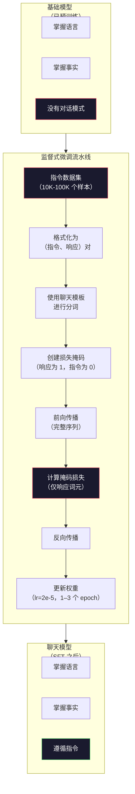

# 指令微调（SFT）

> 基础模型只会预测下一个词元，如此而已。它不会遵循指令、回答问题，也不会拒绝有害请求。SFT 是从词元预测器走向实用助手的桥梁。你接触过的每个模型——Claude、GPT、Llama Chat——都经历过这一步。

**类型：** 构建
**语言：** Python（使用 numpy）
**前置课程：** Phase 10，第 04 课（预训练 Mini GPT）
**预计时间：** 约 90 分钟

## 学习目标

- 实现监督式微调（SFT），将基础语言模型转变为能够遵循指令的助手
- 使用包含 system、user 和 assistant 角色的聊天模板格式化训练数据，并屏蔽非 assistant 词元上的损失
- 解释为什么需要 SFT：基础模型会续写文本，而不是回答问题
- 在留出的指令数据集上比较基础模型与微调模型的响应，评估 SFT 的质量

## 问题

你在第 04 课训练了一个模型。给定一个序列，它可以预测下一个词元。把“Transformer 架构”输入给它，它可能会续写“已经彻底改变了自然语言处理”。对一个下一个词元预测器来说，这已经很了不起。

现在试试把“法国的首都是什么？”输入给它。基础模型不会回答“巴黎”，而是继续已有模式。它可能输出“德国的首都是什么？西班牙的首都是什么？”，因为它从包含问题列表的文档中学到了这种模式；也可能输出“这是许多人都会提出的问题”，因为这可能是合理的下一个词元续写。模型没有*回答*的概念，它只知道*续写*。

这体现了 GPT-3（基础模型，2020 年 6 月发布）与 ChatGPT（经过指令微调，2022 年 11 月发布）之间的差距。二者架构相同，预训练也相同。差别在于后者使用了 20,000 到 100,000 组精心构造的（指令、响应）对，教会模型遵循对话模式。

斯坦福 Alpaca 证明了并不需要数百万个样本。2023 年 3 月，他们只用 GPT-3.5 生成的 52,000 组指令-响应对微调了 Llama 7B，总成本为 $600。结果是一个能够遵循指令、回答问题并进行对话的聊天机器人。它不如 ChatGPT，但只花 $600 和几个小时训练就能达到如此接近的效果，仍然令人震惊。

Meta 的 Llama 2 Chat 在最初的 SFT 阶段只使用了约 27,000 个高质量样本。这个对比说明，样本质量比数量更重要：由熟练标注员编写的 27,000 个样本，胜过从互联网抓取的 100 万个嘈杂样本。

## 概念

### SFT 实际做了什么

监督式微调延续了预训练中的同一套训练循环——前向传播、计算损失、反向传播、更新权重——但使用的是另一种数据。你不再用原始文本训练，而是使用结构化对话：

```json
{
  "system": "你是一个乐于助人的助手。",
  "user": "法国的首都是什么？",
  "assistant": "法国的首都是巴黎。"
}
```

模型已经知道巴黎是法国的首都，这是它在 Wikipedia、教材和网页上预训练时学到的。SFT 不会教给模型新的事实，而是教给模型一种新的*行为*：看到问题时给出答案，看到指令时给出完成内容，看到有害请求时给出拒答。

可以这样理解：预训练赋予模型知识，SFT 赋予模型“礼貌”。

### 数据格式

业界主要使用三种格式。它们都编码同一类信息——谁说了什么——只是使用了不同的分隔符。

**Alpaca 格式**（斯坦福，2023 年 3 月）：

```json
{
  "instruction": "用 3 句话总结下面的文章。",
  "input": "欧洲中央银行提高了利率……",
  "output": "欧洲央行将利率提高了 25 个基点……"
}
```

它简单且使用广泛。`input` 字段是可选的，因为许多指令不需要额外上下文。斯坦福发布了 52,000 个这种格式的样本，这些样本由 GPT-3.5 生成，成本为 $600。这项工作开启了开源指令微调运动。

**ShareGPT 格式**（社区，2023 年）：

```json
{
  "conversations": [
    {"from": "system", "value": "你是一个乐于助人的助手。"},
    {"from": "human", "value": "潮汐是由什么引起的？"},
    {"from": "gpt", "value": "潮汐是由月球的引力造成的……"},
    {"from": "human", "value": "它们多久发生一次？"},
    {"from": "gpt", "value": "大多数沿海地区每天会经历两次高潮和两次低潮……"}
  ]
}
```

它支持多轮对话。按照惯例，无论实际使用的模型是什么，`from` 字段都使用 `human` 和 `gpt`。Vicuna 使用从用户分享的 ChatGPT 对话记录中抓取的 70,000 段 ShareGPT 对话进行训练。

**ChatML 格式**（OpenAI，许多开源模型使用）：

```
<|im_start|>system
你是一个乐于助人的助手。<|im_end|>
<|im_start|>user
法国的首都是什么？<|im_end|>
<|im_start|>assistant
法国的首都是巴黎。<|im_end|>
```

它使用特殊词元（`<|im_start|>`、`<|im_end|>`）分隔不同角色。这些词元会在微调期间加入 tokenizer 的词表。Qwen、Yi 和许多其他模型都使用 ChatML。

三种格式完成的是同一件事：告诉模型“这是指令，这是响应，请学习这种模式”。

### 为什么有效

模型在预训练阶段已经学会了语言。它见过数十亿个问题后跟答案、指令后跟完成内容，以及人与人之间对话的样本。这些模式已经编码在权重中。

SFT 将这种潜在能力集中起来。模型不必再根据上下文猜测自己应该回答问题还是续写文档，而是直接在对话模式上接受明确训练。几千个样本之后，模型就会学到：看到 assistant 角色标记时，生成有帮助的响应。

27,000 个样本就可能足够，因为 SFT 教给模型的是响应指令这一行为，而非英语或世界知识；这些知识已经存在于模型中。

### 掩码损失

这是 SFT 中最重要的技术细节，但大多数教程都会跳过它。

预训练时，你会对每个词元计算损失，模型学习预测序列中的每个下一个词元。SFT 时，你只对*响应* 词元计算损失。指令词元只是作为上下文存在，模型不会因为“预测”它们不准确而受到惩罚。

为什么？因为你不希望模型学会*生成*指令，而是希望它学会*响应*指令。如果对指令词元计算损失，就等于训练模型把“法国的首都是什么？”当成自己要提出的问题来预测。这会浪费梯度信号，还可能让模型混淆自己的角色。

实践中，你会创建一个损失掩码：响应词元为 1，指令词元为 0。在求平均之前，将每个词元的损失乘以这个掩码。

```
Token:     [SYS] 你很有帮助 [USER] 首都是什么？ [ASST] 巴黎是首都 [EOS]
损失掩码:   0    0    0     0      0     0   0  0     0       1     1    1   1     1      1
```

只有 `[ASST]` 之后的词元会参与损失计算。前向传播时，模型会看到完整对话（它需要指令才能生成正确响应），但只根据响应预测得有多好来更新权重。

### 训练超参数

SFT 使用的超参数与预训练大不相同。此时是在调整一个已经能够工作的模型，而非从零开始训练。

| 参数 | 预训练（Llama 2 7B） | SFT（Llama 2 Chat） |
|-----------|---------------------------|---------------------|
| 学习率 | 3e-4（峰值） | 2e-5 |
| 训练轮数 | 1（遍历数据一次） | 2 |
| 批大小 | 4M 词元 | 64 个样本 |
| 预热步数 | 2,000 | 0-100 |
| 权重衰减 | 0.1 | 0.0-0.1 |
| 数据规模 | 2T 词元 | 27,000 个样本 |

SFT 的学习率低 15 倍，这一点至关重要。微调时使用过高的学习率会破坏预训练知识。模型会“忘记”自己学过的内容，并在规模很小的微调数据集上过拟合，这种现象称为灾难性遗忘。

两个 epoch 意味着模型会看到每个训练样本两次。在小数据集上训练超过 3 个 epoch 会导致记忆化：模型开始逐字复现训练样本，而不是进行泛化。

### 灾难性遗忘

微调可能破坏模型的通用能力。如果在指令遵循数据上训练过久，模型会失去编写代码、进行数学推理或生成创意文本的能力。它会非常擅长训练数据的特定格式，却在其他方面变得糟糕。

有三种缓解方法：

1. **较低的学习率。** 取 1e-5 到 5e-5。更新幅度越小，对预训练特征的破坏越少。

2. **较短的训练。** 训练 1–3 个 epoch，在模型过拟合之前停止。

3. **混入预训练数据。** Llama 2 Chat 将少量（2–5%）原始预训练数据混入 SFT 数据集。这会在模型学习新指令遵循行为的同时，“提醒”它保留通用能力。

### 实际数字

在单块 NVIDIA A100 80GB GPU 上，用 10,000 组高质量指令对微调一个 70 亿参数模型，大约需要 1 小时。计算如下：

- 10,000 个样本 x 平均 512 个词元 = 5.12M 个词元
- 2 个 epoch = 总计 10.24M 个词元
- A100 微调 70 亿参数模型的吞吐量：约 3,000 词元/秒
- 10.24M / 3,000 = 约 3,400 秒 = 约 57 分钟

对于我们的 Mini GPT（4 层、128 维），训练几乎是瞬间完成的。重点是理解机制，而不是追求规模。



```figure
loss-masking
```

## 动手构建

### 第 1 步：指令数据集

创建一个合成指令数据集。在生产环境中，Scale AI 和 Anthropic 等公司会聘请人工标注员编写这类数据。这里用程序生成样本，以展示数据格式。

```python
import numpy as np

INSTRUCTION_DATA = [
    {
        "instruction": "What is the capital of France?",
        "response": "The capital of France is Paris."
    },
    {
        "instruction": "Explain gravity in one sentence.",
        "response": "Gravity is the force that attracts objects with mass toward each other."
    },
    {
        "instruction": "Write a haiku about the ocean.",
        "response": "Waves crash on the shore, salt and foam beneath the sun, endless blue expanse."
    },
    {
        "instruction": "What is 15 multiplied by 7?",
        "response": "15 multiplied by 7 is 105."
    },
    {
        "instruction": "Name three programming languages.",
        "response": "Three programming languages are Python, Rust, and TypeScript."
    },
    {
        "instruction": "Summarize photosynthesis.",
        "response": "Photosynthesis converts sunlight, water, and carbon dioxide into glucose and oxygen."
    },
    {
        "instruction": "What year did World War II end?",
        "response": "World War II ended in 1945."
    },
    {
        "instruction": "Define machine learning.",
        "response": "Machine learning is a field where algorithms learn patterns from data to make predictions."
    },
]
```

八个样本非常少。Stanford Alpaca 使用了 52,000 个样本。但无论是 8 个还是 52,000 个，机制都完全相同：词元化、构造掩码，并且只在回答上计算损失。

### 第 2 步：使用聊天模板进行词元化

使用特殊的角色标记，将指令—回答对转换为词元序列。这些标记告诉模型指令在哪里结束、回答从哪里开始。

```python
SPECIAL_TOKENS = {
    "INST_START": 253,
    "INST_END": 254,
    "RESP_START": 255,
}


def tokenize_instruction_pair(instruction, response, vocab_size=256):
    inst_tokens = list(instruction.encode("utf-8"))
    resp_tokens = list(response.encode("utf-8"))

    inst_tokens = [min(t, vocab_size - 4) for t in inst_tokens]
    resp_tokens = [min(t, vocab_size - 4) for t in resp_tokens]

    tokens = (
        [SPECIAL_TOKENS["INST_START"]]
        + inst_tokens
        + [SPECIAL_TOKENS["INST_END"]]
        + [SPECIAL_TOKENS["RESP_START"]]
        + resp_tokens
    )

    return tokens


def create_loss_mask(tokens):
    mask = np.zeros(len(tokens), dtype=np.float32)
    in_response = False

    for i, token in enumerate(tokens):
        if token == SPECIAL_TOKENS["RESP_START"]:
            in_response = True
            continue
        if in_response:
            mask[i] = 1.0

    return mask
```

指令词元的损失掩码全部为 0，回答词元的掩码全部为 1。`RESP_START` 词元本身的掩码为 0，因为它是分隔符，不属于回答内容。

### 第 3 步：掩码交叉熵损失

这是标准交叉熵，但要乘以损失掩码。只有回答词元会对梯度产生贡献。

```python
def masked_cross_entropy_loss(logits, targets, loss_mask):
    batch, seq_len, vocab_size = logits.shape
    logits_flat = logits.reshape(-1, vocab_size)
    targets_flat = targets.reshape(-1)
    mask_flat = loss_mask.reshape(-1)

    max_logits = logits_flat.max(axis=-1, keepdims=True)
    log_softmax = logits_flat - max_logits - np.log(
        np.exp(logits_flat - max_logits).sum(axis=-1, keepdims=True)
    )

    per_token_loss = -log_softmax[np.arange(len(targets_flat)), targets_flat]

    masked_loss = per_token_loss * mask_flat
    num_response_tokens = mask_flat.sum()
    if num_response_tokens == 0:
        return 0.0
    loss = masked_loss.sum() / num_response_tokens

    return loss
```

分母是 `num_response_tokens`，而不是 `seq_len`。如果除以完整序列长度，较长的指令会稀释梯度信号。除以回答词元数，才能保证不论指令长度如何，每个回答词元都获得相同权重。

### 第 4 步：SFT 训练循环

复用第 04 课中的 MiniGPT。训练循环与预训练几乎相同，但要加入指令格式化和掩码损失。

```python
import sys
import os
sys.path.insert(0, os.path.join(os.path.dirname(__file__), "..", "..", "04-pre-training-mini-gpt", "code"))
from main import MiniGPT, LayerNorm, FeedForward, MultiHeadAttention, TransformerBlock, Embedding


def sft_train(model, dataset, num_epochs=2, lr=2e-5, seq_len=64):
    formatted_data = []
    for example in dataset:
        tokens = tokenize_instruction_pair(example["instruction"], example["response"])
        mask = create_loss_mask(tokens)
        formatted_data.append((tokens, mask))

    print(f"SFT Training: {len(formatted_data)} examples, {num_epochs} epochs, lr={lr}")
    print(f"Total tokens: {sum(len(t) for t, _ in formatted_data):,}")
    print()

    losses = []

    for epoch in range(num_epochs):
        epoch_loss = 0.0
        num_batches = 0

        indices = np.random.permutation(len(formatted_data))

        for idx in indices:
            tokens, mask = formatted_data[idx]

            if len(tokens) < 3:
                continue
            if len(tokens) > seq_len:
                tokens = tokens[:seq_len]
                mask = mask[:seq_len]

            input_ids = np.array(tokens[:-1]).reshape(1, -1)
            target_ids = np.array(tokens[1:]).reshape(1, -1)
            loss_mask = np.array(mask[1:]).reshape(1, -1)

            logits = model.forward(input_ids)
            loss = masked_cross_entropy_loss(logits, target_ids, loss_mask)

            batch_size, s_len, v_size = logits.shape
            probs = np.exp(logits - logits.max(axis=-1, keepdims=True))
            probs = probs / probs.sum(axis=-1, keepdims=True)
            dlogits = probs.copy()
            dlogits[np.arange(batch_size)[:, None], np.arange(s_len), target_ids] -= 1.0

            mask_expanded = loss_mask[:, :, np.newaxis]
            num_resp = loss_mask.sum()
            if num_resp > 0:
                dlogits = dlogits * mask_expanded / num_resp

            for block in model.blocks:
                block.ffn.W1 -= lr * np.random.randn(*block.ffn.W1.shape) * 0.01
                block.ffn.W2 -= lr * np.random.randn(*block.ffn.W2.shape) * 0.01
                block.ffn.b1 -= lr * np.random.randn(*block.ffn.b1.shape) * 0.01
                block.ffn.b2 -= lr * np.random.randn(*block.ffn.b2.shape) * 0.01

            epoch_loss += loss
            num_batches += 1
            losses.append(loss)

        avg_loss = epoch_loss / max(num_batches, 1)
        print(f"Epoch {epoch + 1}/{num_epochs} | Avg Loss: {avg_loss:.4f}")

    return model, losses
```

学习率为 `2e-5`，与 Llama 2 Chat 的设置一致。与预训练使用的 `3e-4` 相比，它小了 15 倍。梯度经过掩码：指令词元产生零梯度，只有回答词元推动权重更新。

### 第 5 步：比较基础模型与 SFT 模型

SFT 的核心目标是改变行为。我们分别检查模型对指令格式输入和原始文本续写的响应，以此进行测量。

```python
def generate_response(model, prompt_tokens, max_new_tokens=50, temperature=0.8):
    tokens = list(prompt_tokens)
    seq_len = model.embedding.pos_embed.shape[0]

    for _ in range(max_new_tokens):
        context = np.array(tokens[-seq_len:]).reshape(1, -1)
        logits = model.forward(context)
        next_logits = logits[0, -1, :]

        next_logits = next_logits / max(temperature, 1e-8)
        probs = np.exp(next_logits - next_logits.max())
        probs = probs / probs.sum()
        probs = np.clip(probs, 1e-10, 1.0)
        probs = probs / probs.sum()

        next_token = np.random.choice(len(probs), p=probs)
        tokens.append(int(next_token))

    return tokens


def evaluate_instruction_following(model, instructions):
    print("Evaluating instruction following:")
    print("-" * 50)

    for instruction in instructions:
        tokens = (
            [SPECIAL_TOKENS["INST_START"]]
            + [min(t, 252) for t in list(instruction.encode("utf-8"))]
            + [SPECIAL_TOKENS["INST_END"]]
            + [SPECIAL_TOKENS["RESP_START"]]
        )

        output = generate_response(model, tokens, max_new_tokens=30, temperature=0.6)
        response_start = len(tokens)
        response_tokens = output[response_start:]
        response_bytes = bytes([t for t in response_tokens if t < 128])
        response_text = response_bytes.decode("utf-8", errors="replace")

        print(f"  Q: {instruction}")
        print(f"  A: {response_text[:80]}")
        print()
```

对于只有 8 个样本的微型模型，响应没有实际意义是正常的。重要的是*结构*：模型学会在回答标记之后生成输出，而不是继续生成更多指令。

### 第 6 步：测量灾难性遗忘

比较 SFT 前后模型的下一个词元预测能力。如果 SFT 损害了通用能力，模型在原始文本上的损失就会升高。

```python
def measure_forgetting(model, test_text, seq_len=64):
    tokens = np.array(list(test_text.encode("utf-8")[:512]))

    total_loss = 0.0
    num_windows = 0

    for start in range(0, len(tokens) - seq_len - 1, seq_len):
        input_ids = tokens[start:start + seq_len].reshape(1, -1)
        target_ids = tokens[start + 1:start + seq_len + 1].reshape(1, -1)

        logits = model.forward(input_ids)

        batch, s_len, vocab_size = logits.shape
        logits_flat = logits.reshape(-1, vocab_size)
        targets_flat = target_ids.reshape(-1)

        max_logits = logits_flat.max(axis=-1, keepdims=True)
        log_softmax = logits_flat - max_logits - np.log(
            np.exp(logits_flat - max_logits).sum(axis=-1, keepdims=True)
        )

        loss = -log_softmax[np.arange(len(targets_flat)), targets_flat].mean()
        total_loss += loss
        num_windows += 1

    return total_loss / max(num_windows, 1)
```

在真实微调中，应在整个训练过程中跟踪这一指标。如果原始文本损失上升超过 10%–15%，说明 SFT 过于激进，应降低学习率或减少 epoch 数。

## 使用方法

### 完整 SFT 流水线演示

```python
if __name__ == "__main__":
    np.random.seed(42)

    test_text = """The transformer architecture processes sequences through self-attention.
Each layer applies multi-head attention followed by a feedforward network.
Residual connections and layer normalization stabilize deep networks.
The model learns to predict the next token given all previous tokens."""

    print("=" * 70)
    print("INSTRUCTION TUNING (SFT) DEMO")
    print("=" * 70)
    print()

    model = MiniGPT(
        vocab_size=256, embed_dim=128, num_heads=4,
        num_layers=4, max_seq_len=128, ff_dim=512
    )
    print(f"Model: {model.count_parameters():,} parameters")
    print(f"Config: 4 layers, 4 heads, 128 dims (mini GPT from Lesson 04)")
    print()

    print("PRE-SFT: Measuring base model loss on raw text")
    base_loss = measure_forgetting(model, test_text)
    print(f"  Base model loss: {base_loss:.4f}")
    print()

    print("=" * 70)
    print("SFT TRAINING")
    print("=" * 70)

    model, losses = sft_train(
        model, INSTRUCTION_DATA, num_epochs=3, lr=2e-5, seq_len=128
    )

    print()
    print("POST-SFT: Measuring fine-tuned model loss on raw text")
    sft_loss = measure_forgetting(model, test_text)
    print(f"  SFT model loss: {sft_loss:.4f}")
    print(f"  Change: {((sft_loss - base_loss) / base_loss * 100):+.1f}%")
    if abs(sft_loss - base_loss) / base_loss < 0.15:
        print("  Minimal forgetting (< 15% change)")
    else:
        print("  Significant forgetting detected")
    print()

    print("=" * 70)
    print("INSTRUCTION FOLLOWING EVALUATION")
    print("=" * 70)
    print()

    test_instructions = [
        "What is the capital of France?",
        "Name a programming language.",
        "Define gravity.",
    ]
    evaluate_instruction_following(model, test_instructions)

    print("=" * 70)
    print("DATA FORMAT EXAMPLES")
    print("=" * 70)
    print()

    for i, example in enumerate(INSTRUCTION_DATA[:3]):
        tokens = tokenize_instruction_pair(example["instruction"], example["response"])
        mask = create_loss_mask(tokens)
        resp_count = int(mask.sum())
        total_count = len(tokens)
        print(f"  Example {i + 1}: {total_count} tokens, {resp_count} response tokens ({resp_count/total_count:.0%} of sequence)")
        print(f"    Instruction: {example['instruction']}")
        print(f"    Response: {example['response']}")
        print()

    print("=" * 70)
    print("TRAINING LOSS CURVE")
    print("=" * 70)
    print()

    if losses:
        window = max(1, len(losses) // 5)
        for i in range(0, len(losses), window):
            chunk = losses[i:i + window]
            avg = sum(chunk) / len(chunk)
            print(f"  Steps {i:3d}-{i + len(chunk) - 1:3d}: avg loss = {avg:.4f}")
```

## 交付成果

本课会产出 `outputs/prompt-sft-data-curator.md`：一个帮助你设计和整理 SFT 指令数据集的提示词。给定目标能力（代码生成、数学或对话），它会生成包含格式规范、质量标准和多样性要求的数据采集方案。

## 练习

1. **加入系统提示词支持。** 修改 `tokenize_instruction_pair` 使其接受系统消息，并将系统消息置于指令之前。创建 5 个使用不同系统提示词（“你是一名诗人”“你是一名数学辅导老师”）的样本，验证训练时模型确实看到了不同的系统提示词。

2. **实现数据混合。** 创建一个函数，接收 SFT 数据集和原始文本语料，生成训练批次：其中 5% 的样本是原始文本（不加掩码），95% 是指令对（加掩码）。运行 3 个 epoch，并将遗忘指标与纯 SFT 训练进行比较。

3. **构建数据质量评分器。** 对每个指令—回答对计算：(a) 回答词元长度；(b) 指令—回答长度比；(c) 词汇多样性（不同词元数 / 总词元数）。过滤回答长度小于 10 个词元或多样性小于 0.3 的样本，展示过滤如何影响最终损失。

4. **实现多轮对话训练。** 扩展词元化逻辑以处理 3 轮对话（user-assistant-user-assistant-user-assistant）。损失掩码应覆盖三次 assistant 发言。打印一个样本的词元—掩码对应关系，验证掩码正确。

5. **比较学习率。** 分别使用 `lr=1e-4`、`lr=2e-5` 和 `lr=1e-6` 训练同一个模型三次，绘制损失曲线。`1e-4` 应表现为初期下降很快但最终损失更高（过拟合）；`1e-6` 几乎不会变化；`2e-5` 应处于最合适的折中点。

## 关键术语

| 术语 | 人们常说 | 实际含义 |
|------|----------------|----------------------|
| SFT | “在对话上微调” | 监督式微调：继续在（指令、回答）对上训练，并且只在回答词元上计算损失 |
| 指令微调 | “教模型遵循指令” | 在显式指令—回答对上训练，让基础模型学会对话模式，而不是学习新知识 |
| 损失掩码 | “忽略提示词” | 将指令词元的损失设为 0，使梯度只来自回答词元预测 |
| ChatML | “聊天标记语言” | 使用 `<\|im_start\|>` 和 `<\|im_end\|>` 分隔符标记对话中说话者角色的词元格式 |
| Alpaca 格式 | “Stanford 的格式” | 包含 instruction/input/output 字段的 JSON 格式，用于 52K 个 GPT-3.5 生成、成本为 600 美元的样本 |
| 灾难性遗忘 | “模型变笨了” | 微调中的梯度更新以任务特定模式覆盖通用知识，从而破坏预训练能力 |
| 权重绑定 | “共享嵌入” | 输入词元嵌入与输出预测头使用同一个矩阵，以节省参数并提升一致性 |
| 聊天模板 | “提示词的格式” | 用角色标记和分隔符组织对话的具体词元序列 |

## 延伸阅读

- [Ouyang 等，2022——《Training language models to follow instructions with human feedback》（InstructGPT）](https://arxiv.org/abs/2203.02155) —— OpenAI 提出指令微调与 RLHF 的论文
- [Taori 等，2023——《Stanford Alpaca: An Instruction-following LLaMA Model》](https://github.com/tatsu-lab/stanford_alpaca) —— 5.2 万个、成本 600 美元的指令样本，证明小数据集也能进行有效 SFT
- [Touvron 等，2023——《Llama 2: Open Foundation and Fine-Tuned Chat Models》](https://arxiv.org/abs/2307.09288) —— Meta 使用 2.7 万个高质量样本构建 SFT + RLHF 流水线
- [Chiang 等，2023——《Vicuna: An Open-Source Chatbot Impressing GPT-4》](https://lmsys.org/blog/2023-03-30-vicuna/) —— 使用 7 万条 ShareGPT 对话进行训练
- [Zhou 等，2023——《LIMA: Less Is More for Alignment》](https://arxiv.org/abs/2305.11206) —— 证明精心整理的 1,000 个样本可以匹配更大数据集上的 SFT 效果
