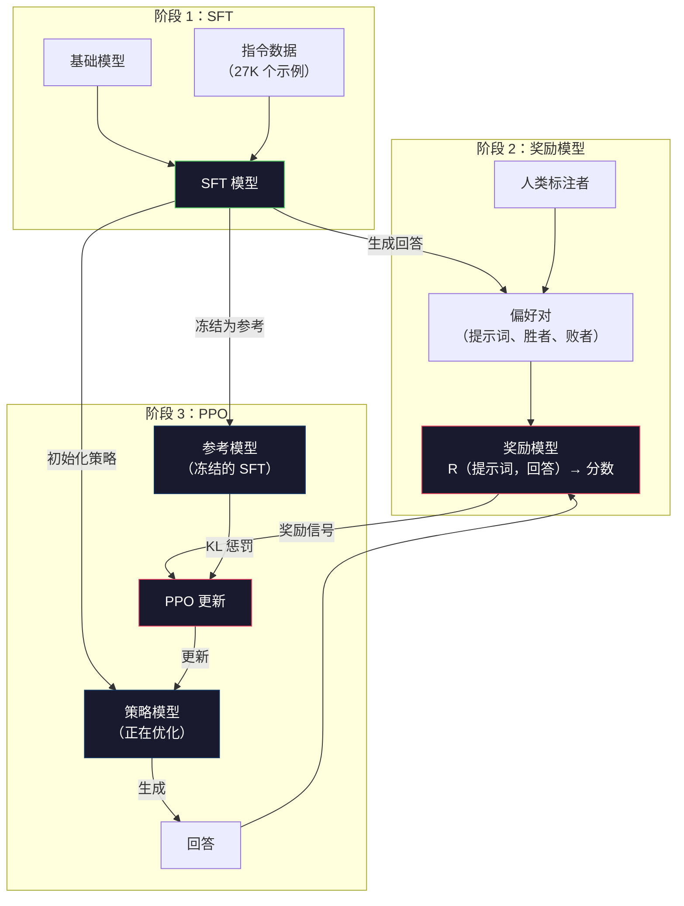
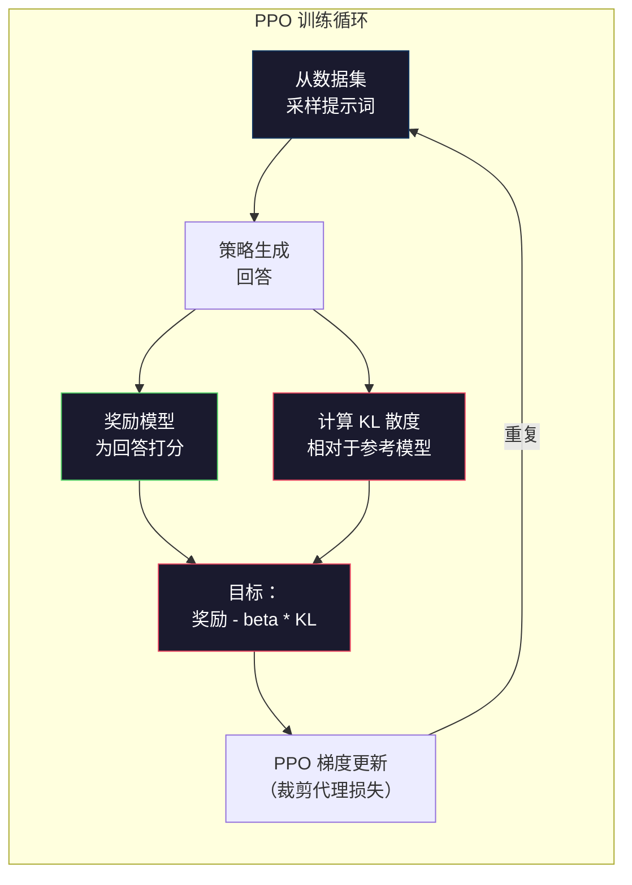

# RLHF：奖励模型 + PPO

> SFT 教会模型遵循指令，却没有教会模型哪个回答更好。两个语法正确、事实准确的回答，在有用程度上可能相差悬殊。RLHF 将人类判断编码进模型行为，这正是 Claude 变得有帮助、GPT 显得礼貌的原因。

**类型：** 构建
**语言：** Python（使用 numpy）
**前置课程：** 第 10 阶段，第 06 课（指令微调 / SFT）
**预计时间：** 约 90 分钟

## 学习目标

- 构建一个奖励模型，根据人类偏好对（选中回答 vs 拒绝回答）为回答质量打分
- 实现 PPO 训练循环，在 KL 惩罚下让语言模型策略针对奖励模型进行优化
- 解释 RLHF 为何需要三个模型（SFT、奖励模型、策略模型），以及 KL 约束如何防止奖励劫持
- 通过比较偏好优化前后的回答质量，评估 RLHF 的效果

## 问题

让模型回答“解释量子计算”，它可能会生成：

**回答 A：**“量子计算使用可以处于叠加态的量子比特，这意味着量子比特可以是 0、1，或同时是二者。这使量子计算机能够以指数级更快的速度处理某些计算。关键算法包括用于大数分解的 Shor 算法，以及用于搜索无序数据库的 Grover 算法。”

**回答 B：**“量子计算是一种利用量子力学现象的计算方式。它最早在 20 世纪 80 年代被提出。Richard Feynman 认为可以用量子计算机模拟量子系统。此后，这一领域取得了显著发展。如今许多公司都在研发量子计算机。IBM、Google 等公司已经取得进展。Google 曾在 2019 年宣称实现了量子霸权。”

两个回答在事实上都正确，语法也都通顺，并且都遵循了指令。但回答 A 明显更好：它更简洁、信息量更高，结构也更清晰。人类每次都会选择 A。

SFT 无法捕捉这种差异。它用“正确”的回答训练模型，却没有机制表达“这个回答比那个更好”。它把每个训练样本都视为同样优秀。如果 A 和 B 同时出现在 SFT 数据集中，模型会同等地从二者学习。

RLHF 解决了这个问题。它训练一个奖励模型来预测人类会偏好哪个回答，再利用这个奖励信号推动语言模型生成质量更高的输出。InstructGPT（ChatGPT 的前身）使用 RLHF，显著提升了 GPT-3 的有用性、真实性和无害性。尽管 InstructGPT 的规模小了 135 倍（13 亿参数 vs 1750 亿参数），OpenAI 的内部评估者仍有 85% 的时间更偏好 InstructGPT 而非 GPT-3 的输出。

## 概念

### 三个阶段

RLHF 是由三个依次进行的阶段组成的流水线，每个阶段都建立在前一个阶段之上，而非一次性的训练运行。

**阶段 1：SFT。** 使用指令—回答对（第 06 课）训练基础模型。这样得到的模型能够遵循指令，但不知道哪些回答优于其他回答。

**阶段 2：奖励模型。** 收集人类偏好数据：向标注者展示同一提示词对应的两个回答，并询问“哪个更好？”。训练一个模型预测这些偏好。奖励模型以（提示词、回答）为输入，输出一个标量分数。

**阶段 3：PPO。** 使用奖励模型为语言模型生成训练信号。语言模型生成回答，奖励模型为回答打分，PPO 再更新语言模型，使其生成得分更高的回答。KL 散度惩罚会防止语言模型偏离 SFT 检查点太远。



### 奖励模型

奖励模型是改造成评分器的语言模型。取 SFT 模型，将语言建模头（输出词表上的分布）替换为标量头（输出一个数）。直到最后一层为止，两者的架构完全相同。

输入：拼接后的提示词和回答。输出：单个标量奖励分数。

训练数据是人类偏好对。对于每个提示词，标注者查看两个回答并选出更好的一个，由此形成训练三元组：（提示词、偏好回答、拒绝回答）。

损失函数使用 Bradley-Terry 成对偏好模型：

```
loss = -log(sigmoid(reward(preferred) - reward(rejected)))
```

这是关键公式。`sigmoid(reward(A) - reward(B))` 给出回答 A 比回答 B 更受偏好的概率。损失会推动奖励模型为偏好回答分配更高的分数。

为什么使用成对比较，而不是绝对分数？因为人类不擅长分配绝对质量分数（“这个回答是 10 分中的 7.3 分还是 7.5 分？”），却很擅长相对比较（“A 比 B 更好吗？”）。Bradley-Terry 模型将相对比较转换为一致的绝对评分体系。

**InstructGPT 数据：** OpenAI 从 40 名合同工处收集了 33,000 个比较对。每次比较约需 5 分钟，也就是为奖励模型训练数据投入了 2,750 小时的人力。

### PPO：近端策略优化

PPO 是一种强化学习算法。在 RLHF 中，“环境”是奖励模型，“智能体”是语言模型，而“动作”是生成一个词元。

目标函数：

```
maximize: E[R(prompt, response)] - beta * KL(policy || reference)
```

第一项推动模型生成高奖励回答。第二项（KL 散度惩罚）防止模型偏离 SFT 检查点太远。

为什么需要 KL 惩罚？没有它，模型会找到退化解。奖励模型是在有限的人类偏好数据集上训练的，必然存在盲点。语言模型会利用这些盲点，找到在奖励模型上得分很高、却毫无意义的输出。典型例子包括：

- 反复说“我非常有帮助且无害！”在有用性/无害性奖励模型上会得到高分
- 生成冗长、听起来正式却空洞的回答，通过模式匹配伪装成“高质量”
- 利用训练数据中恰好与高奖励相关的特定短语

KL 惩罚表达的是：你可以改进，但不能变成一个完全不同的模型。要保持接近已经相当合理的 SFT 版本；偏离太远时，KL 成本就会压过奖励。

**InstructGPT 数据：** PPO 训练使用 `lr=1.5e-5`、KL 系数 `beta=0.02`、256K 个回合（提示词—回答对），每个批次训练 4 个 PPO epoch。整个 RLHF 流水线在 GPU 集群上耗时数天。



### PPO 目标函数详解

PPO 使用“裁剪代理目标”来防止更新幅度过大。新旧策略概率之比会被裁剪到 [1 - epsilon, 1 + epsilon] 范围内，其中 epsilon 通常为 0.2。

```
ratio = pi_new(action | state) / pi_old(action | state)
clipped_ratio = clip(ratio, 1 - epsilon, 1 + epsilon)
loss = -min(ratio * advantage, clipped_ratio * advantage)
```

优势函数估计当前回答相对于预期质量好多少。在 RLHF 中：

```
advantage = reward(prompt, response) - baseline
```

基线通常是最近回答的平均奖励。优势为正表示该回答优于平均水平；优势为负则表示它低于平均水平。PPO 会提高高于平均水平的回答的概率，并降低低于平均水平的回答的概率。

裁剪可以防止灾难性更新。如果某个回答获得异常高的奖励，未裁剪的概率比可能非常大，导致模型大幅转向该回答。裁剪会限制更新幅度，从而保持训练稳定。

### 奖励劫持

这是 RLHF 的阴暗面。语言模型是在针对奖励模型进行优化，而奖励模型只是人类偏好的不完美代理。语言模型越来越擅长最大化奖励后，就会开始利用奖励模型的弱点。

常见失败模式：

| 失败模式 | 现象 | 原因 |
|---------|-------------|-----|
| 冗长 | 模型生成越来越长的回答 | 人类标注者往往偏好更长、更详细的回答，因此奖励模型会给长度更高的分数 |
| 迎合 | 模型同意用户所说的一切 | 标注者偏好认同问题前提的回答 |
| 模棱两可 | 模型拒绝明确回答 | 模棱两可的回答（“这是一个有许多观点的复杂话题……”）很少会被标记为错误 |
| 格式投机 | 模型过度使用项目符号和标题 | 带格式的回答在标注者看来更“精致” |

缓解策略包括：加强 KL 惩罚（防止模型偏离到足以利用弱点的程度）、用对抗样本训练奖励模型（修补已知失败模式），以及使用架构不同的多个奖励模型（更难同时劫持所有模型）。

### 真实的 RLHF 流水线

| 模型 | 比较对 | 标注者 | 奖励模型规模 | PPO 步数 | KL 系数 |
|-------|-----------------|------------|---------|-----------|----------|
| InstructGPT | 33K | 40 | 6B | 256K | 0.02 |
| Llama 2 Chat | ~1M | 未披露 | 70B | 未披露 | 0.01 |
| Claude | 未披露 | 未披露 | 未披露 | 未披露 | 未披露 |
| Anthropic RLHF 论文 | 22K | 20 | 52B | 50K | 0.001 |

Anthropic 的 2022 年论文使用 22,000 个比较对训练了一个 52B 的奖励模型。更大的奖励模型能产生更可靠的信号，使 PPO 训练更稳定。用小型奖励模型训练大型语言模型存在风险：奖励模型的容量不足以捕捉优质回答与糟糕回答之间的细微差异。

```figure
rlhf-pipeline
```

## 动手构建

### 步骤 1：合成偏好数据

在生产环境中，偏好数据由人类标注者创建。这里我们构造合成数据对，其中“偏好”回答在客观上更好（更简洁、更准确、更有帮助）。

```python
import numpy as np

PREFERENCE_DATA = [
    {
        "prompt": "What is the capital of France?",
        "preferred": "The capital of France is Paris.",
        "rejected": "France is a country in Europe. It has many cities. The capital is Paris. Paris is known for the Eiffel Tower.",
    },
    {
        "prompt": "Explain gravity in one sentence.",
        "preferred": "Gravity is the force that attracts objects with mass toward each other.",
        "rejected": "Gravity is something that makes things fall down when you drop them.",
    },
    {
        "prompt": "What is 15 times 7?",
        "preferred": "15 times 7 is 105.",
        "rejected": "Let me think about this. 15 times 7. Well, 10 times 7 is 70, and 5 times 7 is 35, so the answer might be around 105.",
    },
    {
        "prompt": "Name three programming languages.",
        "preferred": "Python, Rust, and TypeScript.",
        "rejected": "There are many programming languages. Some popular ones include various languages like Python and others.",
    },
    {
        "prompt": "What year did World War II end?",
        "preferred": "World War II ended in 1945.",
        "rejected": "World War II was a major global conflict. It involved many countries. The war ended in the mid-1940s, specifically in 1945.",
    },
    {
        "prompt": "Define machine learning.",
        "preferred": "Machine learning is a field where algorithms learn patterns from data to make predictions without being explicitly programmed.",
        "rejected": "Machine learning is a type of AI. AI stands for artificial intelligence. Machine learning uses data to learn.",
    },
]
```

偏好回答简洁直接。拒绝回答则呈现出常见失败模式：不必要的铺垫、模棱两可、重复解释和表述不精确。这正是 SFT 无法捕捉、而 RLHF 能够捕捉的差异。

### 步骤 2：奖励模型架构

奖励模型复用 mini GPT 的 Transformer 架构，但将大小与词表相同的输出头替换为单个标量投影。

```python
import sys
import os
sys.path.insert(0, os.path.join(os.path.dirname(__file__), "..", "..", "04-pre-training-mini-gpt", "code"))
from main import MiniGPT, LayerNorm, Embedding, TransformerBlock


class RewardModel:
    def __init__(self, vocab_size=256, embed_dim=128, num_heads=4,
                 num_layers=4, max_seq_len=128, ff_dim=512):
        self.embedding = Embedding(vocab_size, embed_dim, max_seq_len)
        self.blocks = [
            TransformerBlock(embed_dim, num_heads, ff_dim)
            for _ in range(num_layers)
        ]
        self.ln_f = LayerNorm(embed_dim)
        self.reward_head = np.random.randn(embed_dim) * 0.02

    def forward(self, token_ids):
        seq_len = token_ids.shape[-1]
        mask = np.triu(np.full((seq_len, seq_len), -1e9), k=1)

        x = self.embedding.forward(token_ids)
        for block in self.blocks:
            x = block.forward(x, mask)
        x = self.ln_f.forward(x)

        last_hidden = x[:, -1, :]
        reward = last_hidden @ self.reward_head

        return reward
```

奖励模型取*最后*一个词元位置的隐藏状态，并将其投影为标量。为什么是最后一个词元？因为因果注意力掩码意味着最后一个位置已经关注了所有之前的词元，因此它对整个（提示词、回答）序列拥有最完整的表示。

### 步骤 3：Bradley-Terry 损失

使用 Bradley-Terry 成对损失，在偏好对上训练奖励模型。

```python
def tokenize_for_reward(prompt, response, vocab_size=256):
    prompt_tokens = [min(t, vocab_size - 1) for t in list(prompt.encode("utf-8"))]
    response_tokens = [min(t, vocab_size - 1) for t in list(response.encode("utf-8"))]
    return prompt_tokens + [0] + response_tokens


def sigmoid(x):
    return np.where(
        x >= 0,
        1.0 / (1.0 + np.exp(-x)),
        np.exp(x) / (1.0 + np.exp(x))
    )


def bradley_terry_loss(reward_preferred, reward_rejected):
    diff = reward_preferred - reward_rejected
    loss = -np.log(sigmoid(diff) + 1e-8)
    return loss


def train_reward_model(rm, preference_data, num_epochs=10, lr=1e-4, max_seq_len=128):
    print(f"Training Reward Model: {len(preference_data)} preference pairs, {num_epochs} epochs")
    print()

    losses = []
    accuracies = []

    for epoch in range(num_epochs):
        epoch_loss = 0.0
        epoch_correct = 0
        num_pairs = 0

        indices = np.random.permutation(len(preference_data))

        for idx in indices:
            pair = preference_data[idx]

            preferred_tokens = tokenize_for_reward(pair["prompt"], pair["preferred"])
            rejected_tokens = tokenize_for_reward(pair["prompt"], pair["rejected"])

            preferred_tokens = preferred_tokens[:max_seq_len]
            rejected_tokens = rejected_tokens[:max_seq_len]

            preferred_ids = np.array(preferred_tokens).reshape(1, -1)
            rejected_ids = np.array(rejected_tokens).reshape(1, -1)

            r_preferred = rm.forward(preferred_ids)[0]
            r_rejected = rm.forward(rejected_ids)[0]

            loss = bradley_terry_loss(r_preferred, r_rejected)

            if r_preferred > r_rejected:
                epoch_correct += 1

            diff = r_preferred - r_rejected
            grad = sigmoid(diff) - 1.0

            rm.reward_head -= lr * grad * rm.ln_f.forward(
                rm.embedding.forward(preferred_ids)
            )[:, -1, :].flatten()

            epoch_loss += loss
            num_pairs += 1

        avg_loss = epoch_loss / max(num_pairs, 1)
        accuracy = epoch_correct / max(num_pairs, 1)
        losses.append(avg_loss)
        accuracies.append(accuracy)

        if epoch % 2 == 0:
            print(f"  Epoch {epoch + 1:3d} | Loss: {avg_loss:.4f} | Accuracy: {accuracy:.1%}")

    return rm, losses, accuracies
```

准确率指标很直接：奖励模型正确排序的偏好对占多少比例？随机模型的得分是 50%。在干净数据上训练良好的奖励模型应超过 70%。InstructGPT 的奖励模型在留出比较集上达到了约 72% 的准确率，这听起来不高，但已经不错了——许多偏好对即使对人类而言也含糊不清（标注者间一致性约为 73%）。

### 步骤 4：简化的 PPO 循环

完整的 PPO 很复杂。这个实现抓住了核心机制：生成回答、为回答打分、计算优势，并在 KL 惩罚下更新策略。

```python
def compute_kl_divergence(policy_logits, reference_logits):
    policy_probs = np.exp(policy_logits - policy_logits.max(axis=-1, keepdims=True))
    policy_probs = policy_probs / policy_probs.sum(axis=-1, keepdims=True)
    policy_probs = np.clip(policy_probs, 1e-10, 1.0)

    ref_probs = np.exp(reference_logits - reference_logits.max(axis=-1, keepdims=True))
    ref_probs = ref_probs / ref_probs.sum(axis=-1, keepdims=True)
    ref_probs = np.clip(ref_probs, 1e-10, 1.0)

    kl = np.sum(policy_probs * np.log(policy_probs / ref_probs), axis=-1)
    return kl.mean()


def generate_response(model, prompt_tokens, max_new_tokens=30, temperature=0.8, max_seq_len=128):
    tokens = list(prompt_tokens)

    for _ in range(max_new_tokens):
        context = np.array(tokens[-max_seq_len:]).reshape(1, -1)
        logits = model.forward(context)
        next_logits = logits[0, -1, :]

        next_logits = next_logits / max(temperature, 1e-8)
        probs = np.exp(next_logits - next_logits.max())
        probs = probs / probs.sum()
        probs = np.clip(probs, 1e-10, 1.0)
        probs = probs / probs.sum()

        next_token = np.random.choice(len(probs), p=probs)
        tokens.append(int(next_token))

    return tokens


def copy_model_weights(source, target):
    target.embedding.token_embed = source.embedding.token_embed.copy()
    target.embedding.pos_embed = source.embedding.pos_embed.copy()
    target.ln_f.gamma = source.ln_f.gamma.copy()
    target.ln_f.beta = source.ln_f.beta.copy()
    for s_block, t_block in zip(source.blocks, target.blocks):
        t_block.attn.W_q = s_block.attn.W_q.copy()
        t_block.attn.W_k = s_block.attn.W_k.copy()
        t_block.attn.W_v = s_block.attn.W_v.copy()
        t_block.attn.W_out = s_block.attn.W_out.copy()
        t_block.ffn.W1 = s_block.ffn.W1.copy()
        t_block.ffn.W2 = s_block.ffn.W2.copy()
        t_block.ffn.b1 = s_block.ffn.b1.copy()
        t_block.ffn.b2 = s_block.ffn.b2.copy()
        t_block.ln1.gamma = s_block.ln1.gamma.copy()
        t_block.ln1.beta = s_block.ln1.beta.copy()
        t_block.ln2.gamma = s_block.ln2.gamma.copy()
        t_block.ln2.beta = s_block.ln2.beta.copy()


def ppo_training(policy_model, reference_model, reward_model, prompts,
                 num_episodes=20, lr=1.5e-5, kl_coeff=0.02, max_seq_len=128):
    print(f"PPO Training: {num_episodes} episodes, lr={lr}, KL coeff={kl_coeff}")
    print()

    rewards_history = []
    kl_history = []

    for episode in range(num_episodes):
        prompt_text = prompts[episode % len(prompts)]
        prompt_tokens = [min(t, 252) for t in list(prompt_text.encode("utf-8"))]

        response_tokens = generate_response(
            policy_model, prompt_tokens,
            max_new_tokens=20, temperature=0.8, max_seq_len=max_seq_len
        )

        response_ids = np.array(response_tokens[:max_seq_len]).reshape(1, -1)
        reward = reward_model.forward(response_ids)[0]

        policy_logits = policy_model.forward(response_ids)
        ref_logits = reference_model.forward(response_ids)
        kl = compute_kl_divergence(policy_logits, ref_logits)

        total_reward = reward - kl_coeff * kl

        rewards_history.append(float(reward))
        kl_history.append(float(kl))

        for block in policy_model.blocks:
            update_scale = lr * total_reward
            block.ffn.W1 += update_scale * np.random.randn(*block.ffn.W1.shape) * 0.01
            block.ffn.W2 += update_scale * np.random.randn(*block.ffn.W2.shape) * 0.01

        if episode % 5 == 0:
            avg_reward = np.mean(rewards_history[-5:]) if rewards_history else 0
            avg_kl = np.mean(kl_history[-5:]) if kl_history else 0
            print(f"  Episode {episode:3d} | Reward: {reward:.4f} | KL: {kl:.4f} | "
                  f"Avg Reward: {avg_reward:.4f}")

    return policy_model, rewards_history, kl_history
```

核心循环是：（1）采样提示词；（2）生成回答；（3）用奖励模型为回答打分；（4）计算相对于冻结参考模型的 KL 散度；（5）计算调整后的奖励（奖励减去 KL 惩罚）；（6）更新策略。策略偏离参考模型越远，KL 惩罚就越大，从而自动防止奖励劫持。

### 步骤 5：奖励分数比较

经过 RLHF 后，策略模型的回答在奖励模型上的得分应高于原始 SFT 模型的回答。

```python
def compare_models(sft_model, rlhf_model, reward_model, prompts, max_seq_len=128):
    print("Model Comparison (reward scores)")
    print("-" * 60)
    print(f"  {'Prompt':<35} {'SFT':>10} {'RLHF':>10}")
    print("  " + "-" * 55)

    sft_total = 0.0
    rlhf_total = 0.0

    for prompt in prompts:
        prompt_tokens = [min(t, 252) for t in list(prompt.encode("utf-8"))]

        sft_response = generate_response(
            sft_model, prompt_tokens,
            max_new_tokens=20, temperature=0.6, max_seq_len=max_seq_len
        )
        rlhf_response = generate_response(
            rlhf_model, prompt_tokens,
            max_new_tokens=20, temperature=0.6, max_seq_len=max_seq_len
        )

        sft_ids = np.array(sft_response[:max_seq_len]).reshape(1, -1)
        rlhf_ids = np.array(rlhf_response[:max_seq_len]).reshape(1, -1)

        sft_reward = reward_model.forward(sft_ids)[0]
        rlhf_reward = reward_model.forward(rlhf_ids)[0]

        sft_total += sft_reward
        rlhf_total += rlhf_reward

        truncated_prompt = prompt[:33] + ".." if len(prompt) > 35 else prompt
        print(f"  {truncated_prompt:<35} {sft_reward:>10.4f} {rlhf_reward:>10.4f}")

    n = len(prompts)
    print("  " + "-" * 55)
    print(f"  {'Average':<35} {sft_total/n:>10.4f} {rlhf_total/n:>10.4f}")

    return sft_total / n, rlhf_total / n
```

## 使用它

### 完整 RLHF 流水线演示

```python
if __name__ == "__main__":
    np.random.seed(42)

    print("=" * 70)
    print("RLHF PIPELINE: REWARD MODEL + PPO")
    print("=" * 70)
    print()

    print("STAGE 1: SFT Model (from Lesson 06)")
    print("-" * 40)
    sft_model = MiniGPT(
        vocab_size=256, embed_dim=128, num_heads=4,
        num_layers=4, max_seq_len=128, ff_dim=512
    )
    print(f"  Parameters: {sft_model.count_parameters():,}")
    print()

    print("STAGE 2: Train Reward Model")
    print("-" * 40)
    rm = RewardModel(
        vocab_size=256, embed_dim=128, num_heads=4,
        num_layers=4, max_seq_len=128, ff_dim=512
    )

    rm, rm_losses, rm_accuracies = train_reward_model(rm, PREFERENCE_DATA, num_epochs=10, lr=1e-4)
    print()

    print("Reward Model Evaluation:")
    print("-" * 40)
    correct = 0
    for pair in PREFERENCE_DATA:
        pref_tokens = tokenize_for_reward(pair["prompt"], pair["preferred"])[:128]
        rej_tokens = tokenize_for_reward(pair["prompt"], pair["rejected"])[:128]

        r_pref = rm.forward(np.array(pref_tokens).reshape(1, -1))[0]
        r_rej = rm.forward(np.array(rej_tokens).reshape(1, -1))[0]

        if r_pref > r_rej:
            correct += 1
        print(f"  Preferred: {r_pref:+.4f} | Rejected: {r_rej:+.4f} | {'Correct' if r_pref > r_rej else 'Wrong'}")

    print(f"\n  Accuracy: {correct}/{len(PREFERENCE_DATA)} = {correct/len(PREFERENCE_DATA):.1%}")
    print()

    print("STAGE 3: PPO Training")
    print("-" * 40)

    policy_model = MiniGPT(
        vocab_size=256, embed_dim=128, num_heads=4,
        num_layers=4, max_seq_len=128, ff_dim=512
    )
    reference_model = MiniGPT(
        vocab_size=256, embed_dim=128, num_heads=4,
        num_layers=4, max_seq_len=128, ff_dim=512
    )

    copy_model_weights(sft_model, policy_model)
    copy_model_weights(sft_model, reference_model)

    train_prompts = [pair["prompt"] for pair in PREFERENCE_DATA]

    policy_model, rewards, kls = ppo_training(
        policy_model, reference_model, rm,
        train_prompts, num_episodes=20, lr=1.5e-5, kl_coeff=0.02
    )
    print()

    print("=" * 70)
    print("COMPARISON: SFT vs RLHF")
    print("=" * 70)
    print()

    eval_prompts = [
        "What is the capital of France?",
        "Explain gravity.",
        "Name three programming languages.",
    ]

    sft_avg, rlhf_avg = compare_models(sft_model, policy_model, rm, eval_prompts)
    print()

    print("=" * 70)
    print("KL DIVERGENCE ANALYSIS")
    print("=" * 70)
    print()

    if kls:
        print(f"  Initial KL: {kls[0]:.4f}")
        print(f"  Final KL:   {kls[-1]:.4f}")
        print(f"  Max KL:     {max(kls):.4f}")
        kl_threshold = 0.1
        print(f"  KL > {kl_threshold}: {'Yes (model drifted significantly)' if max(kls) > kl_threshold else 'No (model stayed close to reference)'}")
```

## 交付它

本课会产出 `outputs/prompt-reward-model-designer.md`——一个用于设计奖励模型训练流水线的提示词。给定目标行为（有用性、编程能力、安全性）后，它会生成数据收集协议、标注者指南和奖励模型评估标准。

## 练习

1. 修改奖励模型，使用所有隐藏状态的均值，而不只是最后一个位置。比较准确率。均值池化让每个词元拥有相同权重，而最后位置的方法依赖因果注意力聚合信息。在 6 个偏好对上测试，并报告哪种方法的准确率更高。

2. 实现奖励模型校准。训练后，将所有偏好对输入奖励模型并计算：（a）偏好回答的平均奖励；（b）拒绝回答的平均奖励；（c）间隔（偏好奖励减去拒绝奖励）。校准良好的模型应有清晰的间隔。然后新增 4 个偏好对，检查这一间隔在未见数据上是否仍然成立。

3. 模拟奖励劫持。创建一个会给长回答高分的奖励模型（reward = len(response) / 100）。使用这个有缺陷的奖励模型运行 PPO，观察策略模型生成越来越长、越来越重复的输出。然后加入 0.1 的 KL 惩罚，展示它如何阻止这种退化行为。

4. 实现多目标奖励。训练两个奖励模型——一个用于有用性，一个用于简洁性。将它们组合为 R = 0.7 * R_helpful + 0.3 * R_concise。展示组合目标如何生成既有帮助又简洁的回答，避免单一有用性奖励造成的冗长陷阱。

5. 比较不同的 KL 系数。分别使用 beta=0.001（过低，会奖励劫持）、beta=0.02（标准值）和 beta=0.5（过高，无法学习）运行 PPO。为每种设置绘制奖励曲线和 KL 曲线。beta=0.02 的运行应表现为奖励稳定提升，同时 KL 保持在有界范围内。

## 关键术语

| 术语 | 常见说法 | 实际含义 |
|------|----------------|----------------------|
| RLHF | “用人类反馈训练” | Reinforcement Learning from Human Feedback（基于人类反馈的强化学习）：由 SFT、奖励模型和 PPO 组成的三阶段流水线，利用人类偏好信号优化语言模型输出 |
| 奖励模型 | “为回答打分的模型” | 带有标量输出头的 Transformer，使用 Bradley-Terry 损失在成对人类偏好数据上训练 |
| Bradley-Terry | “比较模型” | 概率模型，其中 P(A > B) = sigmoid(score(A) - score(B))，将成对偏好转换为一致的评分函数 |
| PPO | “RL 算法” | Proximal Policy Optimization（近端策略优化）：通过裁剪更新幅度来防止不稳定，同时更新策略以最大化奖励 |
| KL 散度 | “两个分布有多不同” | 衡量策略模型词元分布与参考模型词元分布差异的指标，用作惩罚以防止奖励劫持 |
| KL 惩罚 | “拴住模型的缰绳” | 从奖励信号中减去 Beta * KL(policy \|\| reference)，防止策略偏离 SFT 检查点太远 |
| 奖励劫持 | “钻奖励的空子” | 策略利用奖励模型的弱点找到退化的高奖励输出，而不是真正改进的现象 |
| 偏好对 | “A 和 B 哪个更好？” | 由（提示词、偏好回答、拒绝回答）组成的训练样本，是 RLHF 训练数据的基本单元 |
| 参考模型 | “冻结的 SFT 检查点” | SFT 模型的一个副本，其权重永不改变，用作计算 KL 散度的锚点 |

## 延伸阅读

- [Ouyang 等，2022——《用人类反馈训练语言模型遵循指令》（InstructGPT）](https://arxiv.org/abs/2203.02155) ——让 RLHF 在大型语言模型上变得实用的论文
- [Schulman 等，2017——《近端策略优化算法》](https://arxiv.org/abs/1707.06347) ——OpenAI 最初的 PPO 论文
- [Bai 等，2022——《使用基于人类反馈的强化学习训练有帮助且无害的助手》](https://arxiv.org/abs/2204.05862) ——Anthropic 的 RLHF 论文，详细分析了奖励劫持和 KL 惩罚
- [Stiennon 等，2020——《利用人类反馈学习摘要》](https://arxiv.org/abs/2009.01325) ——将 RLHF 应用于摘要任务，展示奖励模型可以捕捉细致的质量判断
- [Christiano 等，2017——《从人类偏好中进行深度强化学习》](https://arxiv.org/abs/1706.03741) ——从人类比较中学习奖励函数的奠基性工作
