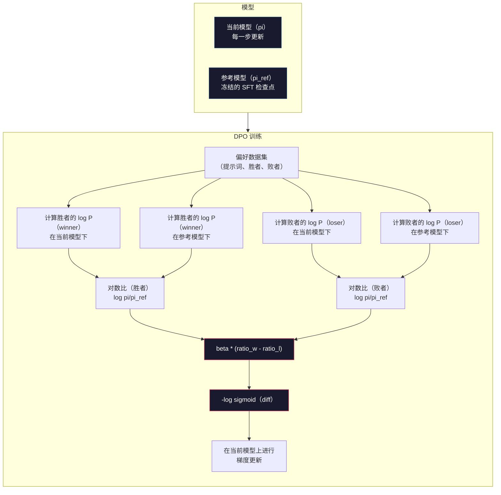

# DPO：直接偏好优化

> RLHF 有效，但它还需要训练三个模型（SFT、奖励模型、策略模型），处理 PPO 的不稳定性，并调节 KL 惩罚。DPO 问的是：如果这些都可以跳过呢？DPO 直接在偏好对上优化语言模型。不需要奖励模型，不需要 PPO，只需一个训练循环，却能得到相同的结果。

**类型：** 构建
**语言：** Python（使用 numpy）
**前置课程：** 第 10 阶段，第 07 课（RLHF）
**预计时间：** 约 90 分钟

## 学习目标

- 实现 DPO 训练，在不使用独立奖励模型的情况下直接根据偏好对优化语言模型
- 推导 DPO 损失函数，并解释它如何通过策略的对数概率隐式表示奖励模型
- 从训练稳定性、计算成本和所需模型数量等方面比较 DPO 与 RLHF
- 调节 beta 参数，控制训练后的策略偏离参考模型的程度

## 问题

你在第 07 课中构建了一个 RLHF 流水线：三个阶段，三个模型——SFT 模型、奖励模型，以及用 PPO 优化的策略模型。仅奖励模型就需要成千上万个人类偏好对和一个独立的训练循环。PPO 还需要仔细调节 KL 系数、学习率、裁剪比和 epoch 数。

在实践中，PPO 训练以不稳定著称。超参数的微小变化就可能导致训练发散。奖励模型是人类偏好的不完美代理，策略会设法利用它的弱点。KL 惩罚虽然有帮助，却也需要单独调节：过低会导致奖励劫持，过高则会让模型几乎学不到东西。

正因为复杂，大多数开源模型在 InstructGPT 发布后的数年里都难以驾驭 RLHF。三阶段流水线很脆弱，每个阶段都有自己的失败模式，而且错误会层层累积。

2023 年 5 月，Rafael Rafailov、Archit Sharma 及其斯坦福同事发表了《直接偏好优化：你的语言模型其实是一个奖励模型》。DPO 的核心是：最优奖励函数可以由语言模型自身的词元概率在数学上确定，因此无需独立的奖励模型，可以直接在偏好对上优化语言模型。

DPO 将 RLHF 简化为一个监督学习步骤：一个模型、一个损失函数、一个训练循环，不需要强化学习。Zephyr-7B 是最早大规模使用 DPO 的模型之一，在多个基准上达到了或超过完整 RLHF 训练模型的水平。Meta 将 DPO 用作 Llama 3 对齐流水线的一部分，Anthropic 也在其对齐研究中引用过 DPO 风格的方法。

## 概念

### DPO 的核心

RLHF 优化以下目标：

```
maximize: E[R(x, y)] - beta * KL(pi || pi_ref)
```

其中 R 是奖励模型，pi 是策略，pi_ref 是参考模型，beta 是 KL 系数。

DPO 论文表明，这个目标存在闭式最优解。对于任意奖励函数 R，最优策略为：

```
pi*(y | x) = pi_ref(y | x) * exp(R(x, y) / beta) / Z(x)
```

其中 Z(x) 是归一化常数。移项可得：

```
R(x, y) = beta * log(pi*(y | x) / pi_ref(y | x)) + beta * log Z(x)
```

DPO 的突破在于，奖励完全可以用策略模型的概率和参考模型的概率表示。你不需要训练独立的奖励模型；奖励已经*隐式地*存在于概率比中。

将它代入 Bradley-Terry 偏好模型：

```
P(y_w > y_l | x) = sigmoid(R(x, y_w) - R(x, y_l))
                  = sigmoid(beta * (log pi(y_w|x)/pi_ref(y_w|x) - log pi(y_l|x)/pi_ref(y_l|x)))
```

由于两个回答都以同一个提示词 x 为条件，Z(x) 项会相互抵消。剩下的只是一个关于策略模型和参考模型在偏好回答、拒绝回答上的对数概率的函数。

### DPO 损失

```
L_DPO = -log(sigmoid(beta * (log pi(y_w|x)/pi_ref(y_w|x) - log pi(y_l|x)/pi_ref(y_l|x))))
```

逐项拆解如下：

- **y_w** = 偏好（获胜）回答
- **y_l** = 拒绝（落败）回答
- **x** = 提示词
- **pi** = 当前模型（正在训练）
- **pi_ref** = 参考模型（冻结的 SFT 检查点）
- **beta** = 控制偏离参考模型程度的温度参数（通常为 0.1 到 0.5）

比值 `log pi(y|x) / pi_ref(y|x)` 就是对数概率比。当这个比值为正时，当前模型给回答 y 分配的概率高于参考模型；当它为负时，当前模型分配的概率更低。

DPO 损失推动模型提高偏好回答的对数概率比，并降低拒绝回答的对数概率比。beta 参数控制模型偏离参考模型的激进程度：较小的 beta 允许更大偏离，较大的 beta 则让模型保持接近参考模型。



### 为什么 DPO 更简单

| 方面 | RLHF（PPO） | DPO |
|--------|-----------|-----|
| 需要训练的模型 | 3（SFT + 奖励模型 + 策略模型） | 1（仅策略模型） |
| 训练循环 | 3（SFT、奖励模型训练、PPO） | 2（SFT、DPO） |
| 超参数 | lr、KL 系数、裁剪比、奖励模型 lr、epoch ×3 | lr、beta、epoch |
| 奖励模型 | 需要（独立训练） | 隐含在模型概率中 |
| RL 算法 | PPO（复杂、不稳定） | 监督学习（稳定） |
| GPU 显存 | PPO 期间显存中有 3–4 个模型 | 2 个模型（当前模型 + 参考模型） |
| 训练稳定性 | 对超参数敏感 | 稳健，类似 SFT |

DPO 训练期间需要将两个模型放在显存中：当前模型和冻结的参考模型。RLHF 则需要三个或四个：策略模型、参考模型、奖励模型，以及可选的价值函数基线。对于 70B 模型，每个副本以 FP16 存储都需要 140GB。省去奖励模型后，节省的显存非常可观。

### DPO 何时优于 RLHF

**小数据集。** 使用 5,000–20,000 个偏好对时，DPO 往往能达到或超过 RLHF。RLHF 中的奖励模型需要足够数据才能泛化；数据有限时，它会过拟合并产生不可靠的奖励信号。DPO 完全不需要奖励模型，因此绕开了这个问题。

**计算资源有限。** DPO 所需的计算量大约是完整 RLHF 的三分之一（一个训练循环而非三个）。对于没有大型 GPU 集群的团队，这是更实际的选择。

**快速迭代。** 想尝试 10 个不同的偏好数据集，看看哪个能产生最好的模型？DPO 让你可以在几小时内完成每个实验；RLHF 则要求针对每个数据集重新训练奖励模型。

### RLHF 何时优于 DPO

**大规模训练。** 在 GPT-4 或 Claude 的规模上，RLHF 的独立奖励模型可以捕捉更细腻的偏好信号。奖励模型就像一个学习得到的损失函数，能够适应复杂的质量标准。

**复杂奖励信号。** 当“更好”涉及多个维度（有用性、无害性、诚实性）时，奖励模型可以学习这种多目标权衡。DPO 将每个偏好对视为二元信号——一个更好，一个更差——却不建模“为什么”。

**迭代式对齐。** RLHF 流水线可以用当前策略生成新回答，让人类为其评分，再在线循环训练奖励模型。DPO 处理的是固定的偏好对数据集。Constitutional AI（Anthropic 的方法）大量利用了 RLHF 的这一迭代特性。

### 超越 DPO：KTO、ORPO、SimPO

DPO 催生了一系列简化的对齐方法。

**KTO（Kahneman-Tversky Optimization，2024）：** 甚至不需要偏好对。KTO 使用非成对反馈：无需与另一个回答比较，只要将每个回答标记为“好”或“坏”即可。这大幅简化了数据收集。你不再向标注者展示两个回答并询问“哪个更好？”，而是展示一个回答并询问“这个好吗？”。损失函数应用了前景理论中的损失厌恶：对糟糕回答的惩罚大于对优质回答的奖励。

**ORPO（Odds Ratio Preference Optimization，2024）：** 在一个训练步骤中结合 SFT 和对齐。ORPO 不先做 SFT 再做 DPO，而是修改 SFT 损失以加入偏好信号。损失包含两项：偏好回答上的标准下一词元预测损失，加上一个扩大偏好回答与拒绝回答概率差距的优势比项。一个训练循环，而不是两个。

**SimPO（Simple Preference Optimization，2024）：** 完全移除参考模型。SimPO 不再计算相对于冻结参考模型的对数概率比，而是使用回答的平均对数概率（按长度归一化）作为隐式奖励。这既节省显存（不需要参考模型），又简化训练。按长度归一化可以防止模型偏好更短的回答。

| 方法 | 年份 | 显存中的模型数 | 需要偏好对？ | 需要参考模型？ | 训练循环 |
|--------|------|-----------------|-------------|-----------------|----------------|
| RLHF | 2022 | 3–4 | 是（用于奖励模型） | 是 | 3 |
| DPO | 2023 | 2 | 是 | 是 | 2 |
| KTO | 2024 | 2 | 否（非成对） | 是 | 2 |
| ORPO | 2024 | 1 | 是 | 否 | 1 |
| SimPO | 2024 | 1 | 是 | 否 | 1 |

趋势很清晰：每种方法都进一步消除了一个复杂环节。RLHF 需要奖励模型和 PPO，DPO 将二者都去掉，KTO 去掉成对数据，ORPO 去掉独立的 SFT 阶段，SimPO 则去掉参考模型。“对齐税”——从基础模型变为对齐模型所需付出的计算与复杂度成本——持续下降。

### 真实的 DPO 部署

**Zephyr-7B（HuggingFace，2023 年 10 月）：** 以 Mistral 7B 为基础，在 UltraChat（200K 个示例）上进行 SFT，再在 UltraFeedback（60K 个偏好对）上进行 DPO。在 MT-Bench 上得分 6.47，是当时得分最高的 7B 模型。相比之下，Llama 2 Chat 70B 得分为 6.86，这意味着仅靠 DPO 对齐，Zephyr 就达到了一个规模为其 10 倍模型的 6% 以内。

**Llama 3（Meta，2024 年 4 月）：** 在初始 RLHF 阶段之后使用 DPO。这种组合表明 DPO 和 RLHF 可以互补：RLHF 用于广泛对齐，DPO 用于有针对性的细化。

**Neural Magic / nm-chat（2024）：** 将 DPO 应用于多个开源模型，在对齐基准上相较仅使用 SFT 的基线持续取得 5–15% 的提升。

```figure
dpo-loss
```

## 动手构建

### 步骤 1：偏好数据集

格式与 RLHF 相同——（提示词、偏好回答、拒绝回答）三元组。DPO 无需中间奖励模型，可以直接使用这些数据。

```python
import numpy as np
import sys
import os
sys.path.insert(0, os.path.join(os.path.dirname(__file__), "..", "..", "04-pre-training-mini-gpt", "code"))
from main import MiniGPT, LayerNorm, Embedding, TransformerBlock

PREFERENCE_DATA = [
    {
        "prompt": "What is the capital of France?",
        "preferred": "The capital of France is Paris.",
        "rejected": "France is a country in Europe. It has many cities. The capital is Paris. Paris is known for the Eiffel Tower.",
    },
    {
        "prompt": "Explain gravity in one sentence.",
        "preferred": "Gravity is the force that attracts objects with mass toward each other.",
        "rejected": "Gravity is something that makes things fall down when you drop them.",
    },
    {
        "prompt": "What is 15 times 7?",
        "preferred": "15 times 7 is 105.",
        "rejected": "Let me think about this. 15 times 7. Well, 10 times 7 is 70, and 5 times 7 is 35, so the answer might be around 105.",
    },
    {
        "prompt": "Name three programming languages.",
        "preferred": "Python, Rust, and TypeScript.",
        "rejected": "There are many programming languages. Some popular ones include various languages like Python and others.",
    },
    {
        "prompt": "What year did World War II end?",
        "preferred": "World War II ended in 1945.",
        "rejected": "World War II was a major global conflict. It involved many countries. The war ended in the mid-1940s, specifically in 1945.",
    },
    {
        "prompt": "Define machine learning.",
        "preferred": "Machine learning is a field where algorithms learn patterns from data to make predictions without being explicitly programmed.",
        "rejected": "Machine learning is a type of AI. AI stands for artificial intelligence. Machine learning uses data to learn.",
    },
]
```

### 步骤 2：序列对数概率

DPO 损失需要计算给定提示词时一个回答的总对数概率。也就是说，要让模型处理完整的（提示词 + 回答）序列，并将每个回答词元的对数概率相加。

```python
def tokenize_sequence(text, vocab_size=256):
    return [min(t, vocab_size - 1) for t in list(text.encode("utf-8"))]


def compute_sequence_log_prob(model, prompt_tokens, response_tokens, max_seq_len=128):
    full_sequence = prompt_tokens + response_tokens
    if len(full_sequence) > max_seq_len:
        full_sequence = full_sequence[:max_seq_len]

    if len(full_sequence) < 2:
        return 0.0

    input_ids = np.array(full_sequence[:-1]).reshape(1, -1)
    target_ids = np.array(full_sequence[1:])

    logits = model.forward(input_ids)
    logits = logits[0]

    max_logits = logits.max(axis=-1, keepdims=True)
    log_probs = logits - max_logits - np.log(
        np.exp(logits - max_logits).sum(axis=-1, keepdims=True)
    )

    prompt_len = len(prompt_tokens)
    response_start = max(0, prompt_len - 1)
    response_end = len(target_ids)

    if response_start >= response_end:
        return 0.0

    response_log_probs = log_probs[response_start:response_end, :]
    response_targets = target_ids[response_start:response_end]

    total_log_prob = 0.0
    for i, target in enumerate(response_targets):
        total_log_prob += response_log_probs[i, target]

    return total_log_prob
```

这个函数是 DPO 的核心。对于每个偏好对，它会运行四次：当前模型处理偏好回答、当前模型处理拒绝回答、参考模型处理偏好回答、参考模型处理拒绝回答。每个训练样本需要 4 次前向传播，而 RLHF 需要生成 + 奖励打分 + 价值估计 + PPO 更新。DPO 更简单、更快，也更稳定。

### 步骤 3：DPO 损失

论文核心的代码实现：一个函数，一个损失，不需要奖励模型。

```python
def sigmoid(x):
    return np.where(
        x >= 0,
        1.0 / (1.0 + np.exp(-x)),
        np.exp(x) / (1.0 + np.exp(x))
    )


def dpo_loss(policy_logprob_preferred, policy_logprob_rejected,
             ref_logprob_preferred, ref_logprob_rejected, beta=0.1):
    preferred_ratio = policy_logprob_preferred - ref_logprob_preferred
    rejected_ratio = policy_logprob_rejected - ref_logprob_rejected

    logit = beta * (preferred_ratio - rejected_ratio)

    loss = -np.log(sigmoid(logit) + 1e-8)

    preferred_reward = beta * preferred_ratio
    rejected_reward = beta * rejected_ratio

    return loss, {
        "preferred_ratio": float(preferred_ratio),
        "rejected_ratio": float(rejected_ratio),
        "logit": float(logit),
        "implicit_preferred_reward": float(preferred_reward),
        "implicit_rejected_reward": float(rejected_reward),
        "reward_margin": float(preferred_reward - rejected_reward),
    }
```

`preferred_ratio` 和 `rejected_ratio` 是 DPO 推导中的对数概率比。当当前模型相对于参考模型给偏好回答分配更高概率、给拒绝回答分配更低概率时，logit 为正且损失较低。训练信号正是将模型推向这个方向。

`implicit_preferred_reward` 和 `implicit_rejected_reward` 是 DPO 损失隐式分配的奖励。你可以将它们提取出来，验证训练是否有效：训练过程中，偏好奖励与拒绝奖励之间的间隔应当逐渐增大。

### 步骤 4：DPO 训练循环

这是一个标准的监督训练循环。不需要 PPO，不需要奖励模型，只有前向传播和梯度更新。

```python
def copy_model_weights(source, target):
    target.embedding.token_embed = source.embedding.token_embed.copy()
    target.embedding.pos_embed = source.embedding.pos_embed.copy()
    target.ln_f.gamma = source.ln_f.gamma.copy()
    target.ln_f.beta = source.ln_f.beta.copy()
    for s_block, t_block in zip(source.blocks, target.blocks):
        t_block.attn.W_q = s_block.attn.W_q.copy()
        t_block.attn.W_k = s_block.attn.W_k.copy()
        t_block.attn.W_v = s_block.attn.W_v.copy()
        t_block.attn.W_out = s_block.attn.W_out.copy()
        t_block.ffn.W1 = s_block.ffn.W1.copy()
        t_block.ffn.W2 = s_block.ffn.W2.copy()
        t_block.ffn.b1 = s_block.ffn.b1.copy()
        t_block.ffn.b2 = s_block.ffn.b2.copy()
        t_block.ln1.gamma = s_block.ln1.gamma.copy()
        t_block.ln1.beta = s_block.ln1.beta.copy()
        t_block.ln2.gamma = s_block.ln2.gamma.copy()
        t_block.ln2.beta = s_block.ln2.beta.copy()


def dpo_train(policy_model, reference_model, preference_data,
              num_epochs=5, lr=5e-6, beta=0.1, max_seq_len=128):
    print(f"DPO Training: {len(preference_data)} pairs, {num_epochs} epochs, "
          f"lr={lr}, beta={beta}")
    print()

    losses = []
    margins = []

    for epoch in range(num_epochs):
        epoch_loss = 0.0
        epoch_margin = 0.0
        num_examples = 0

        indices = np.random.permutation(len(preference_data))

        for idx in indices:
            pair = preference_data[idx]

            prompt_tokens = tokenize_sequence(pair["prompt"])
            preferred_tokens = tokenize_sequence(pair["preferred"])
            rejected_tokens = tokenize_sequence(pair["rejected"])

            pi_logprob_w = compute_sequence_log_prob(
                policy_model, prompt_tokens, preferred_tokens, max_seq_len
            )
            pi_logprob_l = compute_sequence_log_prob(
                policy_model, prompt_tokens, rejected_tokens, max_seq_len
            )
            ref_logprob_w = compute_sequence_log_prob(
                reference_model, prompt_tokens, preferred_tokens, max_seq_len
            )
            ref_logprob_l = compute_sequence_log_prob(
                reference_model, prompt_tokens, rejected_tokens, max_seq_len
            )

            loss, metrics = dpo_loss(
                pi_logprob_w, pi_logprob_l,
                ref_logprob_w, ref_logprob_l, beta
            )

            update_direction = 1.0 if metrics["logit"] < 0 else -0.1
            for block in policy_model.blocks:
                block.ffn.W1 += lr * update_direction * np.random.randn(*block.ffn.W1.shape) * 0.01
                block.ffn.W2 += lr * update_direction * np.random.randn(*block.ffn.W2.shape) * 0.01

            epoch_loss += loss
            epoch_margin += metrics["reward_margin"]
            num_examples += 1
            losses.append(float(loss))
            margins.append(metrics["reward_margin"])

        avg_loss = epoch_loss / max(num_examples, 1)
        avg_margin = epoch_margin / max(num_examples, 1)

        print(f"  Epoch {epoch + 1}/{num_epochs} | Loss: {avg_loss:.4f} | "
              f"Avg Margin: {avg_margin:.4f}")

    return policy_model, losses, margins
```

与 RLHF 相比，这个训练循环非常简单。对于每个偏好对：计算四个对数概率（两个模型、两个回答），将它们代入 DPO 损失，计算梯度并更新策略。不需要生成步骤，不需要奖励模型推理，不需要优势估计，也不需要裁剪。

### 步骤 5：比较 DPO 与 RLHF

测量隐式奖励间隔和对数概率变化，将 DPO 与第 07 课中的 RLHF 模型进行比较。

```python
def evaluate_preference_accuracy(model, reference_model, preference_data, beta=0.1, max_seq_len=128):
    correct = 0
    total = 0

    for pair in preference_data:
        prompt_tokens = tokenize_sequence(pair["prompt"])
        preferred_tokens = tokenize_sequence(pair["preferred"])
        rejected_tokens = tokenize_sequence(pair["rejected"])

        pi_w = compute_sequence_log_prob(model, prompt_tokens, preferred_tokens, max_seq_len)
        pi_l = compute_sequence_log_prob(model, prompt_tokens, rejected_tokens, max_seq_len)
        ref_w = compute_sequence_log_prob(reference_model, prompt_tokens, preferred_tokens, max_seq_len)
        ref_l = compute_sequence_log_prob(reference_model, prompt_tokens, rejected_tokens, max_seq_len)

        preferred_reward = beta * (pi_w - ref_w)
        rejected_reward = beta * (pi_l - ref_l)

        if preferred_reward > rejected_reward:
            correct += 1
        total += 1

    return correct / max(total, 1)


def analyze_implicit_rewards(model, reference_model, preference_data, beta=0.1, max_seq_len=128):
    print("Implicit Reward Analysis:")
    print("-" * 65)
    print(f"  {'Prompt':<30} {'Pref Reward':>12} {'Rej Reward':>12} {'Margin':>10}")
    print("  " + "-" * 60)

    for pair in preference_data:
        prompt_tokens = tokenize_sequence(pair["prompt"])
        preferred_tokens = tokenize_sequence(pair["preferred"])
        rejected_tokens = tokenize_sequence(pair["rejected"])

        pi_w = compute_sequence_log_prob(model, prompt_tokens, preferred_tokens, max_seq_len)
        pi_l = compute_sequence_log_prob(model, prompt_tokens, rejected_tokens, max_seq_len)
        ref_w = compute_sequence_log_prob(reference_model, prompt_tokens, preferred_tokens, max_seq_len)
        ref_l = compute_sequence_log_prob(reference_model, prompt_tokens, rejected_tokens, max_seq_len)

        pref_reward = beta * (pi_w - ref_w)
        rej_reward = beta * (pi_l - ref_l)
        margin = pref_reward - rej_reward

        truncated = pair["prompt"][:28] + ".." if len(pair["prompt"]) > 30 else pair["prompt"]
        print(f"  {truncated:<30} {pref_reward:>12.4f} {rej_reward:>12.4f} {margin:>10.4f}")

    print()
```

### 步骤 6：Beta 敏感性分析

beta 参数相当于 DPO 中的 RLHF KL 系数，用于控制模型可以偏离参考模型多少。这个实验展示它的影响。

```python
def beta_sensitivity_analysis(sft_model, preference_data, betas, max_seq_len=128):
    print("Beta Sensitivity Analysis")
    print("-" * 60)
    print(f"  {'Beta':>8} {'Final Loss':>12} {'Final Margin':>14} {'Accuracy':>10}")
    print("  " + "-" * 55)

    results = []

    for beta in betas:
        policy = MiniGPT(
            vocab_size=256, embed_dim=128, num_heads=4,
            num_layers=4, max_seq_len=max_seq_len, ff_dim=512
        )
        reference = MiniGPT(
            vocab_size=256, embed_dim=128, num_heads=4,
            num_layers=4, max_seq_len=max_seq_len, ff_dim=512
        )
        copy_model_weights(sft_model, policy)
        copy_model_weights(sft_model, reference)

        policy, losses, margins_list = dpo_train(
            policy, reference, preference_data,
            num_epochs=3, lr=5e-6, beta=beta, max_seq_len=max_seq_len
        )

        accuracy = evaluate_preference_accuracy(
            policy, reference, preference_data, beta, max_seq_len
        )

        final_loss = losses[-1] if losses else 0
        final_margin = margins_list[-1] if margins_list else 0

        print(f"  {beta:>8.3f} {final_loss:>12.4f} {final_margin:>14.4f} {accuracy:>10.1%}")
        results.append({
            "beta": beta,
            "final_loss": final_loss,
            "final_margin": final_margin,
            "accuracy": accuracy,
        })

        print()

    return results
```

较小的 beta（0.01）让模型可以自由偏离参考模型——学习快，但有产生退化解的风险。较大的 beta（1.0）让模型保持接近参考模型——稳定，但学习慢。对于大多数应用，甜蜜点在 0.1 到 0.3 之间。

## 使用它

### 完整 DPO 流水线演示

```python
if __name__ == "__main__":
    np.random.seed(42)

    print("=" * 70)
    print("DPO: DIRECT PREFERENCE OPTIMIZATION")
    print("=" * 70)
    print()

    print("STEP 1: Initialize SFT Model (from Lesson 06)")
    print("-" * 50)
    sft_model = MiniGPT(
        vocab_size=256, embed_dim=128, num_heads=4,
        num_layers=4, max_seq_len=128, ff_dim=512
    )
    print(f"  Parameters: {sft_model.count_parameters():,}")
    print()

    print("STEP 2: DPO Training")
    print("-" * 50)

    policy_model = MiniGPT(
        vocab_size=256, embed_dim=128, num_heads=4,
        num_layers=4, max_seq_len=128, ff_dim=512
    )
    reference_model = MiniGPT(
        vocab_size=256, embed_dim=128, num_heads=4,
        num_layers=4, max_seq_len=128, ff_dim=512
    )
    copy_model_weights(sft_model, policy_model)
    copy_model_weights(sft_model, reference_model)

    policy_model, losses, margins = dpo_train(
        policy_model, reference_model, PREFERENCE_DATA,
        num_epochs=5, lr=5e-6, beta=0.1
    )
    print()

    print("=" * 70)
    print("STEP 3: Evaluate")
    print("=" * 70)
    print()

    pre_accuracy = evaluate_preference_accuracy(
        sft_model, reference_model, PREFERENCE_DATA, beta=0.1
    )
    post_accuracy = evaluate_preference_accuracy(
        policy_model, reference_model, PREFERENCE_DATA, beta=0.1
    )

    print(f"  Preference accuracy (pre-DPO):  {pre_accuracy:.1%}")
    print(f"  Preference accuracy (post-DPO): {post_accuracy:.1%}")
    print()

    analyze_implicit_rewards(policy_model, reference_model, PREFERENCE_DATA, beta=0.1)

    print("=" * 70)
    print("STEP 4: Training Dynamics")
    print("=" * 70)
    print()

    if losses:
        print("  Loss curve:")
        window = max(1, len(losses) // 5)
        for i in range(0, len(losses), window):
            chunk = losses[i:i + window]
            avg = sum(chunk) / len(chunk)
            print(f"    Steps {i:3d}-{i + len(chunk) - 1:3d}: loss = {avg:.4f}")
        print()

    if margins:
        print("  Reward margin curve:")
        window = max(1, len(margins) // 5)
        for i in range(0, len(margins), window):
            chunk = margins[i:i + window]
            avg = sum(chunk) / len(chunk)
            print(f"    Steps {i:3d}-{i + len(chunk) - 1:3d}: margin = {avg:.4f}")
        print()

    print("=" * 70)
    print("STEP 5: Beta Sensitivity")
    print("=" * 70)
    print()

    beta_results = beta_sensitivity_analysis(
        sft_model, PREFERENCE_DATA, betas=[0.01, 0.1, 0.3, 1.0]
    )

    print("=" * 70)
    print("DPO vs RLHF COMPARISON")
    print("=" * 70)
    print()
    print("  DPO advantages:")
    print("    - 1 training loop (vs 3 for RLHF)")
    print("    - 2 models in memory (vs 3-4 for RLHF)")
    print("    - Supervised learning (vs RL, more stable)")
    print("    - No reward model to train or maintain")
    print()
    print("  RLHF advantages:")
    print("    - Separate reward model captures complex preferences")
    print("    - Online learning: generate, rate, retrain")
    print("    - Better for multi-objective alignment")
    print("    - Proven at largest scales (GPT-4, Claude)")
    print()
    print("  Practical guidance:")
    print("    - Start with DPO. It's simpler and often sufficient.")
    print("    - Switch to RLHF if DPO plateaus on your eval metrics.")
    print("    - Many production systems use both: RLHF first, DPO to refine.")
```

## 交付它

本课会产出 `outputs/prompt-alignment-method-selector.md`——一个帮助你为具体用例选择合适对齐方法（SFT、RLHF、DPO、KTO、ORPO、SimPO）的提示词。根据你拥有的数据、计算预算和对齐目标，它会推荐一种方法和训练计划。

## 练习

1. 实现 KTO（Kahneman-Tversky Optimization）。KTO 不需要偏好对，只要将每个回答标记为“好”或“坏”。好回答的损失是 `-log(sigmoid(beta * log_ratio))`，坏回答的损失是 `-log(1 - sigmoid(beta * log_ratio))`，并对坏回答损失使用损失厌恶乘数（通常为 1.5 倍）。在同一数据上训练（分别将偏好回答视为“好”、拒绝回答视为“坏”），并与 DPO 比较准确率。

2. 实现长度归一化的 DPO。不使用原始对数概率，而是除以回答词元数量：`normalized_logprob = total_logprob / num_tokens`。这样可以防止模型偏好更短的回答（更短回答的总对数概率更高）。比较归一化前后的隐式奖励间隔。

3. 构建 ORPO 风格的组合损失。在 DPO 损失上加入偏好回答的标准下一词元预测损失：`L = L_sft(preferred) + alpha * L_dpo`。尝试 alpha = 0.1、0.5 和 1.0。组合损失应生成一个既能遵循指令（来自 SFT 项）又偏好优质回答（来自 DPO 项）的模型，从而不再需要独立的 SFT 阶段。

4. 实现迭代式 DPO。运行 3 个 epoch 的 DPO，然后让训练后的模型生成新回答，将它们与原始偏好回答配成新的偏好对，再次运行 DPO。完成两轮这样的“自博弈”过程。比较第 1 轮和第 2 轮后的偏好准确率，观察迭代细化是否有帮助。

5. 使用不同参考模型比较 DPO。不要使用 SFT 检查点作为参考，而是尝试：（a）基础模型（SFT 之前）；（b）DPO 第 1 个 epoch 的检查点；（c）策略模型的指数移动平均。报告哪种参考模型产生最高的偏好准确率和最稳定的训练曲线。

## 关键术语

| 术语 | 常见说法 | 实际含义 |
|------|----------------|----------------------|
| DPO | “没有 RL 的 RLHF” | Direct Preference Optimization（直接偏好优化）：直接在偏好对上优化语言模型的监督学习算法，绕过奖励模型和 PPO |
| 隐式奖励 | “奖励就在模型里” | 奖励函数由策略模型与参考模型之间的对数概率比确定，不需要独立的奖励模型 |
| Beta（DPO） | “温度” | 控制策略可以偏离参考模型多远：较小的 beta 允许大幅偏离，较大的 beta 让模型保持接近 |
| 对数概率比 | “模型改变了多少” | log pi(y\|x) - log pi_ref(y\|x)：为正表示当前模型分配的概率高于参考模型 |
| 参考模型 | “冻结的检查点” | SFT 模型的副本，其权重永不改变，用作计算概率比的锚点 |
| KTO | “没有偏好对的 DPO” | Kahneman-Tversky Optimization：使用非成对的“好”或“坏”标签，而不要求偏好对 |
| ORPO | “一步对齐” | Odds Ratio Preference Optimization：向 SFT 损失中加入偏好项，在一个训练循环中结合 SFT 与对齐 |
| SimPO | “不需要参考模型” | Simple Preference Optimization：使用长度归一化的平均对数概率作为隐式奖励，从而移除参考模型 |
| 对齐税 | “让模型安全的成本” | 从基础模型变为对齐模型所需的额外计算、数据和复杂度成本；DPO 可以显著降低这项成本 |

## 延伸阅读

- [Rafailov 等，2023——《直接偏好优化：你的语言模型其实是一个奖励模型》](https://arxiv.org/abs/2305.18290) ——将对齐从 RLHF 简化为监督学习的 DPO 论文
- [Tunstall 等，2023——《Zephyr：语言模型对齐的直接蒸馏》](https://arxiv.org/abs/2310.16944) ——展示 Zephyr-7B 在 UltraFeedback 上使用 DPO 达到 RLHF 基准水平的论文
- [Ethayarajh 等，2024——《KTO：作为前景理论优化的模型对齐》](https://arxiv.org/abs/2402.01306) ——消除对成对偏好的需求
- [Hong 等，2024——《ORPO：无参考模型的单体偏好优化》](https://arxiv.org/abs/2403.07691) ——在一步中结合 SFT 与对齐
- [Meng 等，2024——《SimPO：基于无参考奖励的简单偏好优化》](https://arxiv.org/abs/2405.14734) ——完全移除参考模型
- [《Llama 3 技术报告》](https://arxiv.org/abs/2407.21783) ——结合 RLHF 与 DPO 的 Meta 对齐流水线
