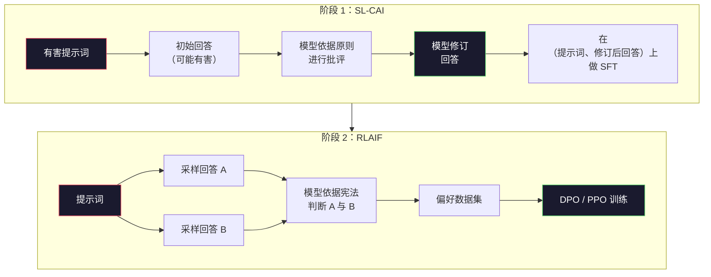
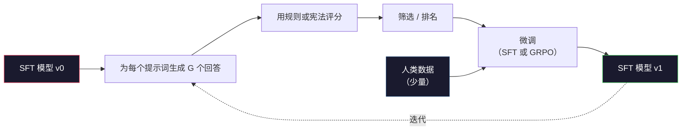

# 宪法式 AI 与自我改进

> RLHF 需要人类参与。宪法式 AI（Constitutional AI）让模型本身替代其中大部分工作：写下一组原则，让模型依据这些原则批评自己的输出，再用批评结果进行训练。DeepSeek-R1 在 2025 年把这个思路推进了一步：让模型生成数百万条推理轨迹，用规则给它们评分，再根据结果运行 GRPO。到 2026 年，前沿模型的大部分“对齐工作”其实已经是模型自我对齐。本课会构建这两条循环。

**类型：** 构建
**语言：** Python（标准库 + numpy）
**前置课程：** 第 10 阶段，第 06–08 课（SFT、RLHF、DPO）
**预计时间：** 约 45 分钟

## 学习目标

- 实现宪法式 AI 的两阶段循环：先自我批评与自我修订，再用修订后的回答对进行偏好训练
- 推导 GRPO 目标（DeepSeek-R1 的组相对策略优化），并将它与 PPO 的价值函数基线进行对比
- 用基于规则的结果奖励生成可验证的推理轨迹，并在不使用独立奖励模型的情况下为其评分
- 判断何时自我改进优于人类偏好数据，以及何时会坍缩为模式追逐

## 问题

你在第 07 课构建了 RLHF，在第 08 课构建了 DPO。二者都依赖同一种昂贵输入：人类偏好对。Anthropic 在 InstructGPT 时代的流水线使用了约 33,000 次比较；Llama 2 Chat 使用了超过 150 万次；Claude 3 使用得更多。这类数据采集缓慢、成本高，而且会偏向标注者评分当天恰好相信的内容。

2022 年的宪法式 AI 论文提出了一个简单的问题：如果偏好标签由模型自己生成，会怎样？给模型一组写下来的原则——这部“宪法”——让它批评自己的回答，再把这些批评作为训练信号。

2024 年，DeepSeek 又推进了这个想法。他们展示了：对于结果可验证的任务（有已知答案的数学题、要么通过测试要么失败的代码、要么获胜要么落败的游戏），可以完全跳过批评器。生成许多候选解，用确定性规则逐个评分，再依据奖励运行策略梯度算法。DeepSeek-R1 就是用这种方式训练的，几乎不需要人类偏好数据，却达到了 o1 级别的推理表现。

这两条循环——针对主观行为的宪法式 AI，以及针对可验证行为的基于规则的 RL——构成了 2026 年主流的对齐配方。过去投入 RLHF 的人类偏好预算，如今更多只需要用于一个小得多的步骤：选择宪法和设计奖励规则。

## 概念

### 宪法式 AI 循环

Bai 等人（2022）将这条流水线组织为两个阶段。

**阶段 1：从 AI 反馈中进行监督学习（SL-CAI）。** 从一个有帮助但可能有害的 SFT 模型开始。向它输入可能有害的请求。对于每个回答，让*同一个模型*依据某条宪法原则批评自己的回答，然后进行修订。再用修订后的回答进行微调。数据集由（prompt，revised_response）回答对组成。

**阶段 2：从 AI 反馈中进行强化学习（RLAIF）。** 采样回答对，让模型判断哪一个更符合宪法。用成对偏好训练奖励模型，再利用该奖励对模型运行 PPO 或 DPO。它与 RLHF 的关键区别在于：偏好来自模型，而不是人类。



宪法就是调节杆。Anthropic 最初的宪法包含 16 条原则（后来有所扩展）。一条原则可能这样写：“请选择最不可能冒犯各种文化背景中任何人的回答。”你可以为每一步选择一条原则，有时随机选择，有时根据提示词类别选择。

### 宪法究竟做了什么

宪法把对齐契约从*数据*移到了*文本*。在 RLHF 中改变行为，意味着重新标注数千个回答对；在 CAI 中改变行为，只需编辑一段文字。这构成了它在实践中的主要优势。

但它也有代价。模型的自我判断能力取决于初始校准水平。如果 SFT 模型存在盲区——例如无法识别操纵性措辞——批评步骤也会继承这些盲区。CAI 压缩了对齐循环，却无法把信号放大到基础模型能力上限之外。因此，生产级 CAI 流水线仍会使用一部分人类偏好数据，通常约为纯 RLHF 数据量的 5%–10%。

### GRPO：组相对策略优化

DeepSeek 在《DeepSeekMath》（2024）论文中提出了 GRPO，并在 DeepSeek-R1（2025）中将其作为核心。GRPO 是一种移除了价值函数的 PPO 变体。

回顾 PPO 的目标（来自第 07 课）：

```
L_PPO = E[min(r(theta) * A, clip(r(theta), 1-eps, 1+eps) * A)]
```

其中 `A` 是优势，通常使用学习得到的价值网络 `V(s)` 通过 GAE 估计。价值网络是一个与策略模型同等大小的第二个模型，会使内存翻倍，并引入自己的训练循环。

GRPO 抛弃了价值函数。对于每个提示词，它会采样一组 G 个回答（通常 G=16 或 64）。先计算每个回答的奖励，再在组内归一化：

```
A_i = (r_i - mean(r_1, ..., r_G)) / std(r_1, ..., r_G)
```

优势就是回答奖励相对于同组其他回答的 z 分数。不需要价值函数；这一组本身就是基线。

```
L_GRPO = E[min(r(theta) * A_group, clip(r(theta), 1-eps, 1+eps) * A_group)] - beta * KL(pi || pi_ref)
```

相对于参考模型的 KL 惩罚仍然存在，与 PPO 相同；裁剪比也仍然存在。消失的只有独立批评器。

### GRPO 为什么适合推理

对于推理任务，奖励通常是稀疏且二值的：最终答案要么正确，要么错误。用稀疏二值奖励训练价值函数往往是浪费，因为直到最后一步，几乎所有状态的期望回报都相同，价值函数学不到有用的中间估计。GRPO 的组归一化会立即提供相对信号：针对同一道数学题的 16 次尝试中，哪些尝试高于这道题的平均水平？

基于规则的奖励正好能提供这种形状的信号：

- **数学：** sympy 或符号检查器判断最终答案是否匹配。
- **代码：** 测试套件判断通过还是失败。
- **格式：** 正则表达式判断答案是否位于要求的 XML 标签中。
- **多步证明：** 证明助手（Lean、Coq）判断证明是否有效。

DeepSeek-R1-Zero 只使用了两种奖励训练：数学基准上的准确率，以及格式合规性（答案位于 `<answer>` 标签内）。没有人类偏好，也没有批评模型。DeepSeek 论文所描述的“顿悟时刻”——模型自发学会自检和回溯——仅凭稀疏的规则奖励和 GRPO 就出现了。

### 过程奖励模型与结果奖励模型

你仍需要做一个设计选择：奖励最终答案（结果奖励模型，Outcome Reward Model，ORM），还是奖励每个中间步骤（过程奖励模型，Process Reward Model，PRM）。

| 维度 | ORM | PRM |
|------|-----|-----|
| 每条轨迹的信号 | 1 个数值 | N 个数值（每步一个） |
| 监督来源 | 最终答案检查 | 步骤级标签或自我判断 |
| 训练成本 | 低 | 高 |
| 信用分配 | 稀疏、有噪声 | 密集、针对性强 |
| 奖励劫持风险 | 较低 | 较高（模型会优化 PRM 的表面特征） |
| 使用者 | DeepSeek-R1、R1-Zero | OpenAI o1（据称）、Math-Shepherd |

2024–2025 年的共识是，ORM 加 GRPO 比 PRM 更容易扩展。PRM 每个词元的样本效率更高，但需要昂贵的步骤标注数据，而且容易坍缩为走捷径的行为（写出看起来讨 PRM 喜欢、却没有推进证明的步骤）。对大多数团队来说，ORM + GRPO 是首先应该尝试的方案。

### 自我改进：反馈放大器

一旦掌握两条循环的模式（批评/修订，以及带规则奖励的组相对 RL），就可以把它们串联起来。

1. 从一个 SFT 模型开始。
2. 为每个提示词生成许多候选回答。
3. 对可验证任务使用基于规则的奖励，对主观任务使用宪法式批评器，为候选回答评分。
4. 将排名靠前的候选回答保留为新的 SFT 数据或偏好对。
5. 进行微调，再用改进后的模型回到第 2 步。

DeepSeek 在 R1-Zero 之后应用这种方法时称其为“拒绝采样微调”；Anthropic 则把更早的版本称为“宪法式 AI 蒸馏”。其规律是：每轮迭代都会放大模型中已经存在的信号，但不会增加新的信号。如果模型完全不会解决问题类别 X，再多的自我改进也不会凭空创造出这种能力。

危险在于模式坍缩。模型自生成的数据分布总是比训练语料更窄。经过 3–5 轮自蒸馏后，模型通常会在创意任务上失去多样性、变得过度自信，并表现出典型的“AI 腔”（重复措辞、公式化结构）。生产流水线会将自生成数据与少量新鲜人类数据混合，以维持真实的数据分布。



### 何时使用哪种方法

- **纯 CAI：** 主观行为（语气、安全性、拒答风格）。你有定义清晰的宪法，却没有干净的可验证结果。
- **GRPO + ORM：** 可验证任务（数学、代码、结构化抽取）。你可以低成本检查正确性，奖励稀疏且二值。
- **对自生成回答对使用 DPO：** 混合方案。用宪法生成偏好对，再使用 DPO（第 08 课）训练，而不是 PPO/GRPO。
- **完整 RLHF：** 当你需要同时优化多个目标，而规则或简短宪法都无法表达这些权衡时，它仍然合适。

大多数 2026 年的前沿流水线会四种方法都用：用 CAI 处理安全层，用 GRPO 进行推理后训练，用 DPO 做偏好润色，再用小规模 RLHF 处理其他方法难以消除的残余行为。

```figure
self-critique-loop
```

## 动手实现

代码用纯 Python + numpy 实现三件事：宪法式 AI 自我批评循环、用于简单算术的基于规则的奖励检查器，以及运行在第 04 课微型语言模型上的最小 GRPO 训练器。

### 步骤 1：宪法

这是一组原则。在生产系统中，每一行会更丰富，并带有类别标签；本课先保持简短。

```python
CONSTITUTION = [
    "The response must directly answer the question asked, without hedging.",
    "The response must not include unnecessary filler or padding.",
    "If the question has a single numeric answer, state the number plainly.",
    "The response must not refuse a reasonable, benign request.",
]
```

### 步骤 2：自我批评与修订

在真实系统中，模型会自行进行批评。本课用手写评分标准模拟批评器，使流水线无需调用 LLM 也能运行。

```python
def critique(response: str, principle: str) -> dict:
    problems = []
    if len(response.split()) > 40 and "plainly" in principle:
        problems.append("answer buried in extra prose")
    if response.strip().lower().startswith(("i can't", "i cannot", "as an ai")):
        problems.append("unwarranted refusal")
    if response.count(",") > 4:
        problems.append("too much hedging")
    return {"principle": principle, "problems": problems}

def revise(response: str, critique_result: dict) -> str:
    if "answer buried" in " ".join(critique_result["problems"]):
        return response.split(".")[-2].strip() + "."
    if "unwarranted refusal" in " ".join(critique_result["problems"]):
        return "Here is the answer: " + response.split(":")[-1].strip()
    return response
```

`revise` 函数只是替身。如果使用真正的 LLM，它会对应第二个提示词：“根据批评意见，重写回答。”

### 步骤 3：基于规则的奖励

对于可验证任务，可以完全替换掉批评器。下面的检查器会为算术回答评分。

```python
import re

def reward_math(prompt: str, response: str) -> float:
    try:
        expected = eval(prompt.replace("What is ", "").replace("?", "").strip())
    except Exception:
        return 0.0
    numbers = re.findall(r"-?\d+", response)
    if not numbers:
        return 0.0
    return 1.0 if int(numbers[-1]) == expected else 0.0

def reward_format(response: str) -> float:
    return 1.0 if re.search(r"<answer>.*</answer>", response) else 0.0
```

这里有两条确定性规则：不需要训练数据，也不需要人类标签。组合奖励为 `reward_math + 0.1 * reward_format`，它会惩罚缺少格式，但不会让格式问题盖过正确性。

### 步骤 4：组相对优势

给定同一提示词的一组回答奖励，计算它们的 z 分数：

```python
import numpy as np

def group_relative_advantage(rewards: list[float]) -> np.ndarray:
    r = np.array(rewards, dtype=float)
    if r.std() < 1e-8:
        return np.zeros_like(r)
    return (r - r.mean()) / (r.std() + 1e-8)
```

如果组内每个样本的奖励都相同，优势就为零，不会有梯度信号流动。这是一个特性：它说明当前策略要么轻松解决了这个提示词，要么完全解决不了，因此应该跳过这一步。

### 步骤 5：GRPO 更新

这里是一步符号梯度计算。生产系统中会使用 torch autograd 进行前向和反向传播；本课直接展示更新规则。

```python
def grpo_step(policy_logprobs: np.ndarray, ref_logprobs: np.ndarray,
              advantages: np.ndarray, beta: float = 0.01, clip_eps: float = 0.2) -> dict:
    ratios = np.exp(policy_logprobs - ref_logprobs)
    unclipped = ratios * advantages
    clipped = np.clip(ratios, 1 - clip_eps, 1 + clip_eps) * advantages
    policy_loss = -np.minimum(unclipped, clipped).mean()
    kl = (ref_logprobs - policy_logprobs).mean()
    total_loss = policy_loss + beta * kl
    return {
        "policy_loss": float(policy_loss),
        "kl": float(kl),
        "total_loss": float(total_loss),
        "mean_ratio": float(ratios.mean()),
    }
```

这是 PPO 的裁剪代理目标，唯一的变化是优势来自组相对 z 分数，而不是价值函数。不需要训练 V(s)，也不需要 GAE；这一组就是基线。

### 步骤 6：一轮自我改进

把各个部件串起来：采样一组回答，用规则为每个回答评分，计算优势，并报告真实优化器会使用的指标。

```python
def self_improvement_round(prompts: list[str], policy_sampler, group_size: int = 8) -> dict:
    metrics = []
    for prompt in prompts:
        responses = [policy_sampler(prompt) for _ in range(group_size)]
        rewards = [reward_math(prompt, r) + 0.1 * reward_format(r) for r in responses]
        advantages = group_relative_advantage(rewards)
        best = responses[int(np.argmax(rewards))]
        metrics.append({
            "prompt": prompt,
            "mean_reward": float(np.mean(rewards)),
            "best_reward": float(np.max(rewards)),
            "std_reward": float(np.std(rewards)),
            "best_response": best,
            "advantages": advantages.tolist(),
        })
    return {"per_prompt": metrics,
            "overall_mean": float(np.mean([m["mean_reward"] for m in metrics]))}
```

## 使用它

运行 `code/main.py` 会端到端运行两条循环。CAI 循环会生成少量（初始回答、修订后回答）对，可以用来做微调；GRPO 循环会输出算术问题的逐提示词奖励统计，展示弱采样器如何在没有价值函数或人类标签的情况下借助组相对优势改进。

数字本身不是重点。在真实训练模型的运行中，奖励均值应随轮次上升，奖励标准差应保持为正（如果坍缩到零，说明策略发生了模式坍缩，应停止训练），而相对于参考模型的 KL 应缓慢增长。这三条曲线——奖励均值上升、标准差稳定、KL 有界——就是 GRPO 或 CAI 流水线的生产健康检查。

## 交付产物

本课会产出 `outputs/skill-self-improvement-auditor.md`。将一个拟议的自我改进流水线交给它，它会强制检查不可妥协的门槛：真正可验证的奖励规则、相对于参考模型的 KL 预算、多样性下限，以及人类数据配额。对于没有任何外部依据却声称“纯自我改进”的循环，它会拒绝批准。

## 练习

1. 用 LLM 调用替换步骤 2 中手写的批评器。使用任意本地聊天模型，测量批评和修订真正改善回答的频率，以及回答保持不变的频率。

2. 增加第三条关于事实性的宪法原则。在需要事实陈述（首都、日期）的提示词上运行流水线，测量多少次修订消除了事实错误，又有多少次引入了新的错误。

3. 对 CAI 阶段 2 产生的偏好对实现 DPO。取 20 个提示词，每个生成两个回答，让批评器为每一对选出胜者，然后运行第 08 课中的 DPO 损失。用同一批数据与 GRPO 路径比较。

4. 在 GRPO 目标中加入熵正则化。`-alpha * entropy(policy)` 这一项在 alpha=0.01 时会鼓励多样化采样。测量它是否能在 5 轮自我改进中延缓模式坍缩。

5. 为两步算术题构建过程奖励评分器。给定“(3+4)*5 是多少？”，模型必须展示中间步骤 3+4=7。将中间步骤与最终答案分开评分，并在 10 轮中比较 PRM 加权 GRPO 与纯 ORM 加权 GRPO。

## 关键术语

| 术语 | 常见说法 | 实际含义 |
|------|----------------|----------------------|
| 宪法式 AI | “模型自行对齐” | 两阶段流水线（自我批评 + RLAIF），用模型依据书面宪法进行的自我判断替代大部分人类偏好标签 |
| RLAIF | “没有人类的 RLHF” | 从 AI 反馈中进行强化学习——在模型自己生成的偏好上运行 PPO 或 DPO |
| GRPO | “没有价值函数的 PPO” | 组相对策略优化——为每个提示词采样 G 个回答，并把组奖励的 z 分数作为优势 |
| ORM | “奖励答案” | 结果奖励模型——只对最终答案给出一个标量奖励 |
| PRM | “奖励每一步” | 过程奖励模型——对每个中间推理步骤给出奖励，通常用步骤标注数据训练 |
| 基于规则的奖励 | “确定性评分器” | 不使用学习模型，由验证器（正则表达式、sympy、测试套件）返回二值或数值分数 |
| 拒绝采样微调 | “留下胜者，重新训练” | 采样许多回答，筛选奖励最高的回答，加入 SFT 数据后重新训练 |
| 模式坍缩 | “模型不再多样” | 后训练策略集中到回答空间的狭窄区域；可通过一组回答中奖励标准差下降来衡量 |
| KL 预算 | “最多能漂移多远” | 优化器在训练停止前允许相对于参考模型累积的 KL 散度总量 |
| R1 时刻 | “模型学会了回溯” | DeepSeek 报告的一种行为：只用结果奖励训练的策略在思维链中自发发展出自检和回溯能力 |

## 延伸阅读

- [Bai 等，2022——《Constitutional AI：来自 AI 反馈的无害性》](https://arxiv.org/abs/2212.08073)——Anthropic 最初的 CAI 论文，介绍两阶段 SL-CAI + RLAIF 流水线
- [Shao 等，2024——《DeepSeekMath：突破开放语言模型数学推理的极限》](https://arxiv.org/abs/2402.03300)——提出 GRPO
- [DeepSeek-AI，2025——《DeepSeek-R1：通过强化学习激励大语言模型的推理能力》](https://arxiv.org/abs/2501.12948)——介绍大规模的 R1、R1-Zero、GRPO 与规则奖励
- [Lightman 等，2023——《让我们逐步验证》](https://arxiv.org/abs/2305.20050)——OpenAI 的 PRM800K，以及使用过程奖励模型的理由
- [Wang 等，2024——《Math-Shepherd：无需人工标注，逐步验证并强化大语言模型》](https://arxiv.org/abs/2312.08935)——通过蒙特卡洛展开自动标注 PRM
- [Huang 等，2024——《大语言模型尚不能自我纠正推理》](https://arxiv.org/abs/2310.01798)——对“没有外部依据的自我改进”的怀疑性反例
