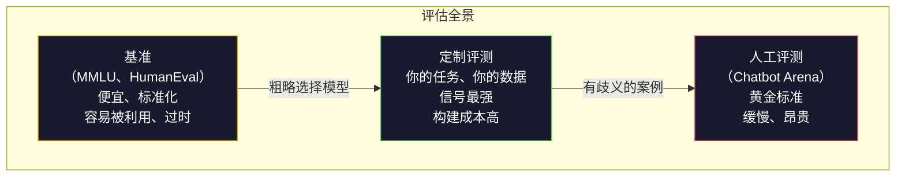
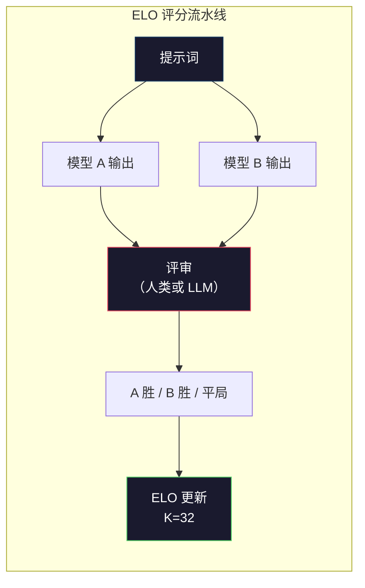

# 评估：基准、评测与 LM Harness

> 古德哈特定律：当一个指标变成目标，它就不再是一个好的指标。每家前沿实验室都会“刷”基准。MMLU 分数不断上升，但模型仍然无法可靠地数出“strawberry”中有几个字母 R。唯一重要的评测是你自己的评测——针对你的任务，使用你的数据。

**类型：** 构建
**语言：** Python
**前置课程：** 第 10 阶段，第 01–05 课（从零实现大语言模型）
**预计时间：** 约 90 分钟

## 学习目标

- 构建一个定制评估工具，对语言模型运行选择题和开放式基准
- 解释标准基准（MMLU、HumanEval）为何会饱和，以及为何无法区分前沿模型
- 使用合适的指标实现面向任务的评测：精确匹配、F1、BLEU 和 LLM 评审评分
- 设计针对具体使用场景的定制评测套件，而不是只依赖公开排行榜

## 问题

MMLU 于 2020 年发布，涵盖 57 个学科的 15,908 道题。不到三年，前沿模型就让它趋于饱和。GPT-4 得分 86.4%，Claude 3 Opus 得分 86.8%，Llama 3 405B 得分 88.6%。排行榜被压缩到 3 个百分点的范围内，差异更像统计噪声，而不是真实的能力差距。

与此同时，这些模型却会在十岁孩子不假思索就能完成的任务上失败。Claude 3.5 Sonnet 在 MMLU 上得分 88.7%，却一度数不清“strawberry”中的字母——这项任务不需要世界知识，也不需要推理，只需逐个检查字符。HumanEval 用 164 道题测试代码生成，模型得分超过 90%，却仍会生成在任何初级开发者都能发现的边界条件上崩溃的代码。

基准表现与现实可靠性之间的差距，是大语言模型评估的核心问题。基准只能告诉你模型在该基准上表现如何，却几乎无法告诉你它在你的具体任务、你的具体数据和你的具体失败模式下会怎样。如果你正在构建客服机器人，MMLU 就无关紧要；如果你正在构建代码助手，HumanEval 只覆盖函数级生成，对跨文件调试、重构或解释代码只字未提。

你需要定制评测。基准适合粗略选择模型，最终评估仍必须匹配你的部署条件。

## 概念 <!-- learning-atlas: the-concept -->

### 评测全景

评估有三类，每一类的成本和信号质量都不同。

**基准**是标准化测试套件，例如 MMLU、HumanEval、SWE-bench、MATH、ARC、HellaSwag。让模型运行基准就能得到一个分数。优点是所有人使用同一套测试，因此可以比较模型；缺点是模型和训练数据越来越容易污染这些基准。实验室使用包含基准题目的数据训练，分数上升了，能力却未必提升。

**定制评测**是为具体使用场景构建的测试套件。你定义输入、期望输出和评分函数。法律文档摘要器要用法律文档评估，SQL 生成器要用你的数据库模式评估。它们创建成本高，却是唯一能够预测生产表现的评估方式。

**人工评测**聘请付费标注者，根据有帮助程度、正确性、流畅度和安全性等标准判断模型输出。在自动评分失效的开放式任务中，它是黄金标准。Chatbot Arena 已经收集了针对 100 多个模型的超过 200 万次人类偏好投票。缺点是成本（每次判断 $0.10–$2.00）和速度（数小时到数天）。



### 基准为何会失效

三种机制会让基准分数不再反映真实能力。

**数据污染。** 训练语料会抓取互联网，而基准题目也存在于互联网上，模型可能在训练时看到答案。这并不完全是传统意义上的作弊——实验室并非有意加入基准数据——但网络规模的抓取几乎不可能将其排除。

**应试训练。** 实验室会为基准表现优化训练配比。如果训练混合数据中有 5% 是 MMLU 风格的选择题，模型就会学会题型和答案分布。MMLU 是四选一，模型会学到答案大致均匀分布在 A/B/C/D 之间，即使不知道答案也能因此受益。

**饱和。** 当每个前沿模型在某个基准上都能得到 85%–90% 的分数时，基准就失去了区分度。剩下的 10%–15% 题目可能有歧义、标签错误，或要求罕见的领域知识。MMLU 从 87% 提升到 89%，可能只意味着模型多记住了两道偏僻题，而不是变得更聪明。

### 困惑度：快速健康检查

困惑度衡量模型对一串词元感到多么意外。形式上，它是平均负对数似然的指数：

```
PPL = exp(-1/N * sum(log P(token_i | context)))
```

困惑度为 10，意味着模型在平均意义上相当于在每个词元位置从 10 个选项中均匀选择。越低越好。GPT-2 在 WikiText-103 上的困惑度约为 30，GPT-3 约为 20，Llama 3 8B 约为 7。

困惑度适合在同一测试集上比较模型，但存在盲区。模型可能很擅长预测常见模式、却很不擅长预测罕见但重要的模式，因此困惑度仍然很低。它也无法说明模型的指令遵循、推理或事实准确性。把它当作合理性检查，而不是最终结论。

### LLM 评审

用强模型评估弱模型的输出。想法很简单：让 GPT-4o 或 Claude Sonnet 按 1–5 分评价回答的正确性、有帮助程度和安全性。使用 GPT-4o-mini 时，每次判断成本约为 $0.01，而且与人类判断的相关性出人意料地高——在大多数任务上约有 80% 的一致率。

评分提示词比模型本身更重要。模糊的提示词（“评价这个回答”）会产生噪声很大的分数；带有评分标准的结构化提示词（“如果答案事实正确且引用了来源，得 5 分；正确但未引用来源，得 4 分；部分正确，得 3 分……”）则能产生一致且可复现的分数。

失败模式包括：评审模型存在位置偏差（成对比较时偏好第一个回答）、冗长偏差（偏好更长的回答）和自偏好（GPT-4 会给 GPT-4 输出的评分高于同等质量的 Claude 输出）。缓解方法包括随机化顺序、按长度归一化，以及使用不同于被评模型的评审模型。

### 从成对比较得到 ELO 评分

Chatbot Arena 采用这种方法：展示不同模型针对同一提示词的两个回答，让人类（或 LLM 评审）选出更好的一个，再根据数千次比较为每个模型计算 ELO 评分——这与国际象棋使用的体系相同。

ELO 的优势在于：相对排名比绝对评分更可靠，能自然处理平局，而且比独立给每个输出打分需要更少的比较就能收敛。截至 2026 年初，Chatbot Arena 排名显示 GPT-4o、Claude 3.5 Sonnet 和 Gemini 1.5 Pro 位居榜首，彼此相差不超过 20 个 ELO 分。



### 评测框架

**lm-evaluation-harness**（EleutherAI）：标准的开源评测框架，支持 200 多个基准。只需一条命令，就能让任意 Hugging Face 模型运行 MMLU、HellaSwag、ARC 等基准。Open LLM Leaderboard 也使用它。

**RAGAS**：专门用于 RAG 流水线的评估框架。它衡量忠实度（答案是否符合检索到的上下文）、相关性（检索到的上下文是否与问题相关）和答案正确性。

**promptfoo**：由配置驱动的提示词工程评测工具。在 YAML 中定义测试案例，针对多个模型运行并得到通过/失败报告。它适合做提示词回归测试，确保提示词修改不会破坏已有测试案例。

### 构建定制评测

这是对生产最重要的评测。流程如下：

1. **定义任务。** 模型究竟应该做什么？要明确。“回答问题”过于模糊。“给定一封客户投诉邮件，抽取产品名称、问题类别和情绪”就是一个可以评估的任务。

2. **创建测试案例。** 原型评测至少需要 50 个，生产评测需要 200 个以上。每个测试案例都是一个（input，expected_output）对。要包含边界情况：空输入、对抗性输入、有歧义的输入，以及其他语言的输入。

3. **定义评分。** 结构化输出使用精确匹配，文本相似度使用 BLEU/ROUGE，开放式质量使用 LLM 评审，抽取任务使用 F1。用权重组合多个指标。

4. **自动化。** 每次评测都应通过一条命令运行，不需要手动步骤。以便于长期比较的格式保存结果。

5. **持续跟踪。** 单独看一个评测分数没有意义，你需要趋势线。上次修改提示词后分数提升了吗？切换模型后退化了吗？让评测与提示词一起进行版本管理。

| 评测类型 | 每次判断成本 | 与人类一致率 | 最适合 |
|-----------|------------------|----------------------|----------|
| 精确匹配 | ~$0 | 100%（适用时） | 结构化输出、分类 |
| BLEU/ROUGE | ~$0 | ~60% | 翻译、摘要 |
| LLM 评审 | ~$0.01 | ~80% | 开放式生成 |
| 人工评测 | $0.10–$2.00 | 不适用（它就是事实标准） | 有歧义、高风险任务 |

```figure
perplexity-loss
```

## 动手实现

### 步骤 1：最小评测框架

先定义核心抽象。一个评测案例包含输入、期望输出和可选的 metadata 字典。评分器接收预测和参考答案，返回 0 到 1 之间的分数。

```python
import json
from collections import Counter

class EvalCase:
    def __init__(self, input_text, expected, metadata=None):
        self.input_text = input_text
        self.expected = expected
        self.metadata = metadata or {}

class EvalSuite:
    def __init__(self, name, cases, scorers):
        self.name = name
        self.cases = cases
        self.scorers = scorers

    def run(self, model_fn):
        results = []
        for case in self.cases:
            prediction = model_fn(case.input_text)
            scores = {}
            for scorer_name, scorer_fn in self.scorers.items():
                scores[scorer_name] = scorer_fn(prediction, case.expected)
            results.append({
                "input": case.input_text,
                "expected": case.expected,
                "prediction": prediction,
                "scores": scores,
            })
        return results
```

### 步骤 2：评分函数

构建精确匹配、词元 F1，以及模拟的 LLM 评审评分器。

```python
def exact_match(prediction, expected):
    return 1.0 if prediction.strip().lower() == expected.strip().lower() else 0.0

def token_f1(prediction, expected):
    pred_tokens = set(prediction.lower().split())
    exp_tokens = set(expected.lower().split())
    if not pred_tokens or not exp_tokens:
        return 0.0
    common = pred_tokens & exp_tokens
    precision = len(common) / len(pred_tokens)
    recall = len(common) / len(exp_tokens)
    if precision + recall == 0:
        return 0.0
    return 2 * (precision * recall) / (precision + recall)

def llm_judge_simulated(prediction, expected):
    pred_words = set(prediction.lower().split())
    exp_words = set(expected.lower().split())
    if not exp_words:
        return 0.0
    overlap = len(pred_words & exp_words) / len(exp_words)
    length_penalty = min(1.0, len(prediction) / max(len(expected), 1))
    return round(overlap * 0.7 + length_penalty * 0.3, 3)
```

### 步骤 3：ELO 评分系统

实现带 ELO 更新的成对比较。这正是 Chatbot Arena 用来给模型排名的系统。

```python
class ELOTracker:
    def __init__(self, k=32, initial_rating=1500):
        self.ratings = {}
        self.k = k
        self.initial_rating = initial_rating
        self.history = []

    def _ensure_player(self, name):
        if name not in self.ratings:
            self.ratings[name] = self.initial_rating

    def expected_score(self, rating_a, rating_b):
        return 1 / (1 + 10 ** ((rating_b - rating_a) / 400))

    def record_match(self, player_a, player_b, outcome):
        self._ensure_player(player_a)
        self._ensure_player(player_b)

        ea = self.expected_score(self.ratings[player_a], self.ratings[player_b])
        eb = 1 - ea

        if outcome == "a":
            sa, sb = 1.0, 0.0
        elif outcome == "b":
            sa, sb = 0.0, 1.0
        else:
            sa, sb = 0.5, 0.5

        self.ratings[player_a] += self.k * (sa - ea)
        self.ratings[player_b] += self.k * (sb - eb)

        self.history.append({
            "a": player_a, "b": player_b,
            "outcome": outcome,
            "rating_a": round(self.ratings[player_a], 1),
            "rating_b": round(self.ratings[player_b], 1),
        })

    def leaderboard(self):
        return sorted(self.ratings.items(), key=lambda x: -x[1])
```

### 步骤 4：困惑度计算

使用词元概率计算困惑度。实践中，这些概率会来自模型的 logits；这里用一个概率分布进行模拟。

```python
import numpy as np

def perplexity(log_probs):
    if not log_probs:
        return float("inf")
    avg_neg_log_prob = -np.mean(log_probs)
    return float(np.exp(avg_neg_log_prob))

def token_log_probs_simulated(text, model_quality=0.8):
    np.random.seed(hash(text) % 2**31)
    tokens = text.split()
    log_probs = []
    for i, token in enumerate(tokens):
        base_prob = model_quality
        if len(token) > 8:
            base_prob *= 0.6
        if i == 0:
            base_prob *= 0.7
        prob = np.clip(base_prob + np.random.normal(0, 0.1), 0.01, 0.99)
        log_probs.append(float(np.log(prob)))
    return log_probs
```

### 步骤 5：聚合结果

计算一次评测运行的汇总统计：均值、中位数、某一阈值下的通过率，以及各指标的细分结果。

```python
def summarize_results(results, threshold=0.8):
    all_scores = {}
    for r in results:
        for metric, score in r["scores"].items():
            all_scores.setdefault(metric, []).append(score)

    summary = {}
    for metric, scores in all_scores.items():
        arr = np.array(scores)
        summary[metric] = {
            "mean": round(float(np.mean(arr)), 3),
            "median": round(float(np.median(arr)), 3),
            "std": round(float(np.std(arr)), 3),
            "min": round(float(np.min(arr)), 3),
            "max": round(float(np.max(arr)), 3),
            "pass_rate": round(float(np.mean(arr >= threshold)), 3),
            "n": len(scores),
        }
    return summary

def print_summary(summary, suite_name="Eval"):
    print(f"\n{'=' * 60}")
    print(f"  {suite_name} Summary")
    print(f"{'=' * 60}")
    for metric, stats in summary.items():
        print(f"\n  {metric}:")
        print(f"    Mean:      {stats['mean']:.3f}")
        print(f"    Median:    {stats['median']:.3f}")
        print(f"    Std:       {stats['std']:.3f}")
        print(f"    Range:     [{stats['min']:.3f}, {stats['max']:.3f}]")
        print(f"    Pass rate: {stats['pass_rate']:.1%} (threshold >= 0.8)")
        print(f"    N:         {stats['n']}")
```

### 步骤 6：运行完整流水线

把所有部分串联起来：定义任务，创建测试案例，模拟两个模型，运行评测，根据成对比较计算 ELO，并打印排行榜。

```python
def demo_model_good(prompt):
    responses = {
        "What is the capital of France?": "Paris",
        "What is 2 + 2?": "4",
        "Who wrote Hamlet?": "William Shakespeare",
        "What language is PyTorch written in?": "Python and C++",
        "What is the boiling point of water?": "100 degrees Celsius",
    }
    return responses.get(prompt, "I don't know")

def demo_model_bad(prompt):
    responses = {
        "What is the capital of France?": "Paris is the capital city of France",
        "What is 2 + 2?": "The answer is four",
        "Who wrote Hamlet?": "Shakespeare",
        "What language is PyTorch written in?": "Python",
        "What is the boiling point of water?": "212 Fahrenheit",
    }
    return responses.get(prompt, "Unknown")

cases = [
    EvalCase("What is the capital of France?", "Paris"),
    EvalCase("What is 2 + 2?", "4"),
    EvalCase("Who wrote Hamlet?", "William Shakespeare"),
    EvalCase("What language is PyTorch written in?", "Python and C++"),
    EvalCase("What is the boiling point of water?", "100 degrees Celsius"),
]

suite = EvalSuite(
    name="General Knowledge",
    cases=cases,
    scorers={
        "exact_match": exact_match,
        "token_f1": token_f1,
        "llm_judge": llm_judge_simulated,
    },
)

results_good = suite.run(demo_model_good)
results_bad = suite.run(demo_model_bad)

print_summary(summarize_results(results_good), "Model A (concise)")
print_summary(summarize_results(results_bad), "Model B (verbose)")
```

“好”模型给出精确答案，“差”模型给出冗长的释义。精确匹配会严厉惩罚冗长模型，而词元 F1 和 LLM 评审更宽容。这说明指标选择很重要：同一个模型采用不同评分方式，可能看起来非常优秀，也可能非常糟糕。

### 步骤 7：ELO 锦标赛

在多轮中运行模型之间的成对比较。

```python
elo = ELOTracker(k=32)

for case in cases:
    pred_a = demo_model_good(case.input_text)
    pred_b = demo_model_bad(case.input_text)

    score_a = token_f1(pred_a, case.expected)
    score_b = token_f1(pred_b, case.expected)

    if score_a > score_b:
        outcome = "a"
    elif score_b > score_a:
        outcome = "b"
    else:
        outcome = "tie"

    elo.record_match("model_a_concise", "model_b_verbose", outcome)

print("\nELO Leaderboard:")
for name, rating in elo.leaderboard():
    print(f"  {name}: {rating:.0f}")
```

### 步骤 8：困惑度比较

比较不同质量水平“模型”的困惑度。

```python
test_text = "The quick brown fox jumps over the lazy dog in the garden"

for quality, label in [(0.9, "Strong model"), (0.7, "Medium model"), (0.4, "Weak model")]:
    log_probs = token_log_probs_simulated(test_text, model_quality=quality)
    ppl = perplexity(log_probs)
    print(f"  {label} (quality={quality}): perplexity = {ppl:.2f}")
```

## 使用它

### lm-evaluation-harness（EleutherAI）

在任意模型上运行基准的标准工具。

```python
# pip install lm-eval
# Command line:
# lm_eval --model hf --model_args pretrained=meta-llama/Llama-3.1-8B --tasks mmlu --batch_size 8

# Python API:
# import lm_eval
# results = lm_eval.simple_evaluate(
#     model="hf",
#     model_args="pretrained=meta-llama/Llama-3.1-8B",
#     tasks=["mmlu", "hellaswag", "arc_easy"],
#     batch_size=8,
# )
# print(results["results"])
```

### promptfoo

面向提示词工程的配置驱动评测。用 YAML 定义测试，并针对多个提供商运行。

```yaml
# promptfoo.yaml
providers:
  - openai:gpt-4o-mini
  - anthropic:claude-3-haiku

prompts:
  - "Answer in one word: {{question}}"

tests:
  - vars:
      question: "What is the capital of France?"
    assert:
      - type: contains
        value: "Paris"
  - vars:
      question: "What is 2 + 2?"
    assert:
      - type: equals
        value: "4"
```

### 用 RAGAS 评估 RAG

```python
# pip install ragas
# from ragas import evaluate
# from ragas.metrics import faithfulness, answer_relevancy, context_precision
#
# result = evaluate(
#     dataset,
#     metrics=[faithfulness, answer_relevancy, context_precision],
# )
# print(result)
```

RAGAS 衡量通用评测容易遗漏的内容：模型答案是否扎根于检索到的上下文，而不只是答案抽象地看起来是否“正确”。

## 交付产物

本课会产出 `outputs/prompt-eval-designer.md`——一个可复用的提示词，用于为任意任务设计定制评测套件。给它一份任务描述，它会生成测试案例、评分函数和通过/失败阈值建议。

本课还会产出 `outputs/skill-llm-evaluation.md`——一个决策框架，根据任务类型、预算和延迟要求选择合适的评估策略。

## 练习

1. 增加一个“一致性”评分器，让同一输入通过模型 5 次，并测量输出相互匹配的频率。在确定性输入上出现不一致答案，说明提示词脆弱或 temperature 设置过高。

2. 扩展 ELO 跟踪器，使其支持多个评审函数（精确匹配、F1、LLM 评审）并为它们加权。比较重度加权精确匹配与重度加权 F1 时排行榜如何变化。

3. 为具体任务构建评测套件：将邮件分为 5 类。创建 100 个多样化测试案例，包含边界情况（可能属于多个类别的邮件、空邮件、其他语言的邮件）。测量不同“模型”（基于规则、关键词匹配、模拟 LLM）的表现。

4. 实现污染检测：给定一组评测问题和训练语料，检查有多少比例的评测问题（或近似释义）出现在训练数据中。研究人员正是用这种方法审计基准的有效性。

5. 构建“模型差异”工具。给定两个模型版本的评测结果，标出哪些具体测试案例有所改进、哪些退化、哪些保持不变。这相当于评测领域的代码差异，是理解一次改动究竟有益还是有害的关键工具。

## 关键术语

| 术语 | 常见说法 | 实际含义 |
|------|----------------|----------------------|
| MMLU | “那个基准” | Massive Multitask Language Understanding——涵盖 57 个学科的 15,908 道选择题，到 2025 年已在 88% 以上趋于饱和 |
| HumanEval | “代码评测” | OpenAI 提出的 164 道 Python 函数补全题，只测试孤立的函数生成 |
| SWE-bench | “真实代码评测” | 来自 12 个 Python 仓库的 2,294 个 GitHub issue，衡量包括测试生成在内的端到端修复能力 |
| 困惑度 | “模型有多困惑” | exp(-avg(log P(token_i given context)))——越低表示模型给实际词元分配的概率越高 |
| ELO 评分 | “模型的象棋排名” | 根据成对胜负记录计算的相对技能评分，Chatbot Arena 用它为 100 多个模型排名 |
| LLM 评审 | “用 AI 给 AI 打分” | 强模型依据评分标准为弱模型输出打分；每次约 $0.01，与人类评审约有 80% 的一致率 |
| 数据污染 | “模型看过测试题” | 训练数据包含基准题目，导致分数虚高，却没有提升真实能力 |
| 评测套件 | “一堆测试” | 经过版本管理的（input、expected_output、scorer）三元组集合，用于衡量某项具体能力 |
| 通过率 | “答对的百分比” | 得分高于阈值的评测案例比例；因为衡量可靠性，所以比平均分更可操作 |
| Chatbot Arena | “模型排名网站” | LMSYS 平台，拥有 200 多万个类人偏好投票，通过 ELO 评分产生最值得信赖的 LLM 排行榜 |

## 延伸阅读

- [Hendrycks 等，2021——《衡量大规模多任务语言理解》](https://arxiv.org/abs/2009.03300)——MMLU 论文；尽管已经饱和，仍是引用最多的大语言模型基准
- [Chen 等，2021——《评估基于代码训练的大语言模型》](https://arxiv.org/abs/2107.03374)——OpenAI 的 HumanEval 论文，奠定代码生成评估方法
- [Zheng 等，2023——《评审 LLM 评审》](https://arxiv.org/abs/2306.05685)——系统分析用 LLM 评估 LLM，包括位置偏差和冗长偏差
- [LMSYS Chatbot Arena](https://chat.lmsys.org/)——拥有超过 200 万次投票的众包模型比较平台，也是最值得信赖的现实 LLM 排名
