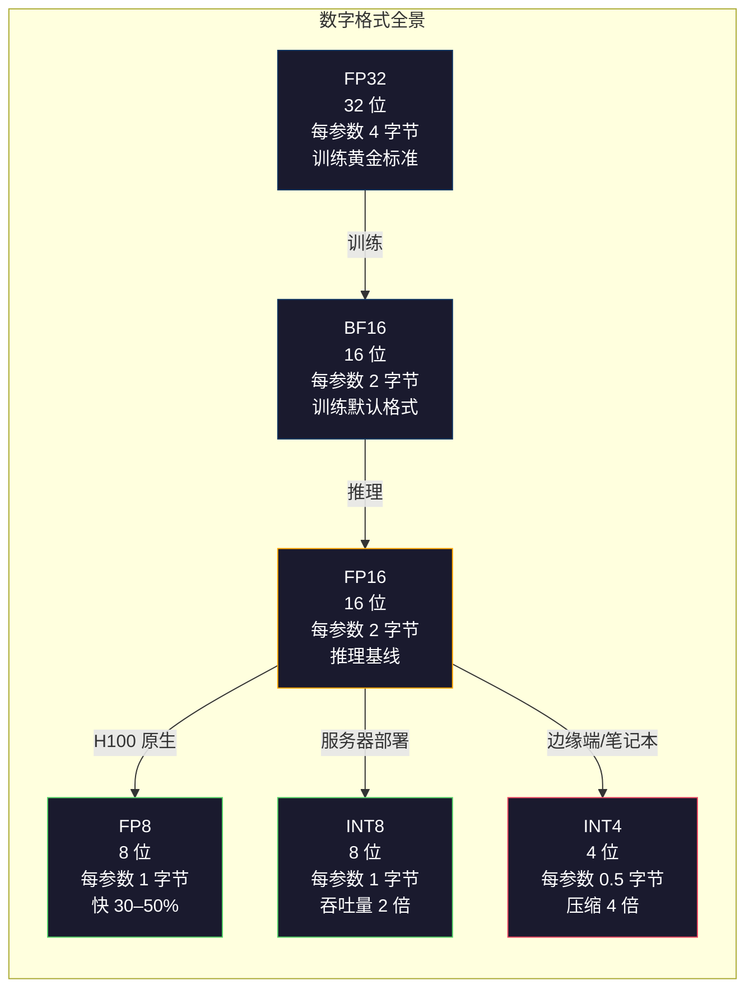
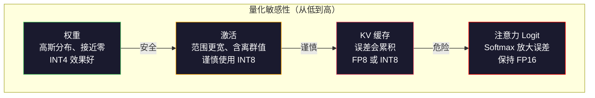
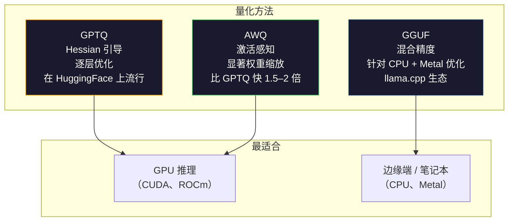

# 量化：让模型装得下

> 一个 70B 模型使用 FP16 需要 140GB，仅权重就要两张 A100。量化到 FP8：一张 80GB GPU；量化到 INT4：一台 MacBook 就够了。

**类型：** 构建
**语言：** Python（使用 numpy）
**前置课程：** 第 10 阶段，第 01–10 课（从零实现大语言模型）
**预计时间：** 约 120 分钟

## 学习目标

- 实现从 FP16 到 INT8 和 INT4 的对称、非对称量化，包括逐张量和逐通道缩放
- 计算量化带来的内存节省，并判断给定 GPU 的显存能容纳哪种精度
- 解释训练后量化（PTQ）与量化感知训练（QAT）的区别
- 使用 GPTQ 或 AWQ 量化一个真实模型，并在基准上测量准确率与内存之间的权衡

## 问题

Llama 3 70B 有 700 亿个参数。每个参数是一个 16 位浮点数，也就是 1,400 亿字节，即 140GB。一张 A100 只有 80GB 显存，单张 GPU 连权重都装不下，更不用说运行推理。仅仅为了提供一个模型的服务，你就需要两张每小时各 $2 的 A100。

但每个参数使用 16 位很浪费。神经网络中的大多数权重都聚集在零附近。FP16 的完整动态范围（从 0.000000059 到 65,504）几乎没有被用到。如果测量 Llama 3 70B 的实际权重分布，会发现其中 95% 落在 -0.1 到 +0.1 之间。你正在浪费 16 位来表示本来 4 位就能容纳的数值。

量化用低精度数值替代高精度数值。FP16 量化到 FP8 会把内存减半，FP16 量化到 INT4 会把内存降到四分之一。那个 140GB 的模型会变成 35GB，可以装进一张消费级 GPU。再进一步使用 2 位量化（激进、有损，但对某些任务仍可用），同一个模型就能在 16GB 笔记本上运行。

代价是准确率。每去掉一位都会损失信息。关键问题是会损失多少准确率，以及损失发生在哪里。量化得当的 INT4 模型在大多数基准上能保留原模型 95%–99% 的质量；直接粗暴地量化到 INT4 则可能彻底毁掉模型。差别就在技术。

社区使用 GPTQ 将 Llama 3 量化到 INT4，在 WikiText 上的困惑度大约损失 1–2 个点。Mistral 发布的 Mixtral 8x22B FP8 检查点在 MMLU 上没有可测量的质量损失。GGUF 格式驱动着 llama.cpp，让 70B 模型可以在搭载 M 系列芯片的 MacBook 上运行。量化已经成为所有大于 7B 的模型的标准部署路径。

## 概念

### 数字格式：每一位做什么

每个浮点数都有三部分：符号位、指数和尾数（也叫有效数）。符号位占一位；指数决定范围（数值可以有多大或多小）；尾数决定精度（能保留多少位小数）。

```
FP32:  [1 sign] [8 exponent] [23 mantissa]  = 32 bits
FP16:  [1 sign] [5 exponent] [10 mantissa]  = 16 bits
BF16:  [1 sign] [8 exponent] [7  mantissa]  = 16 bits
FP8:   [1 sign] [4 exponent] [3  mantissa]  = 8  bits (E4M3)
FP8:   [1 sign] [5 exponent] [2  mantissa]  = 8  bits (E5M2)
INT8:  [1 sign] [7 value]                   = 8  bits (uniform steps)
INT4:  [1 sign] [3 value]                   = 4  bits (16 levels total)
```

**FP32** 是全精度格式。23 个尾数位提供约 7 位十进制精度，范围约为 1.2 x 10^-38 到 3.4 x 10^38。过去训练完全使用 FP32；现在累加仍然如此（例如矩阵乘法中的运行求和）。

**FP16** 将位数减半。10 个尾数位提供约 3.3 位十进制精度，指数缩小到 5 位，范围大幅缩小（最大值约 65,504）。对于聚集在零附近的权重，这通常没问题；但训练期间可能突然变大的激活和梯度就很危险。FP16 训练需要损失缩放来防止下溢。

**BF16**（Brain Float 16）保留 FP32 的 8 位指数，但把尾数缩小到 7 位。它的范围与 FP32 相同，精度低于 FP16。Google 专门为深度学习设计了它。直觉是：对神经网络来说，范围比精度更重要。一个在 FP16 中下溢为零的 10^-20 梯度，在 BF16 中仍能保留下来；一个 0.07342 的权重在 BF16 中四舍五入为 0.0734 也足够接近。现代训练运行都会使用 BF16，或使用 BF16/FP32 混合格式。

**FP8** 有两种形式。E4M3（4 位指数、3 位尾数）用于推理时的权重和激活；E5M2（5 位指数、2 位尾数）用于训练时的梯度，因为此时范围比精度更重要。H100 GPU 上的 FP8 推理相比 FP16 可提速 30%–50%，质量损失几乎可以忽略。

**INT8** 是整数格式，没有指数，也没有尾数，只有从 -128 到 127 均匀分布的 256 个值。你需要一个缩放因子，将浮点权重映射到这个范围。优势在于，整数运算比浮点运算更快，也更节能。A100 上的 INT8 矩阵乘法可达到 624 TOPS，而 FP16 为 312 TFLOPS。

**INT4** 更进一步，只有 16 个可能的值。缩放因子承担了大量工作。质量完全取决于如何选择缩放因子，以及量化哪些权重。当前最先进的 INT4 方法（GPTQ、AWQ）可以保留原模型 95% 以上的质量。



### 量化如何工作 <!-- learning-atlas: how-quantization-works -->

核心操作很简单：取一个浮点数张量，找到缩放因子，进行缩放，舍入到最近的整数，并将整数和缩放因子一起保存。

**量化：**
```
scale = max(abs(tensor)) / max_int_value
quantized = round(tensor / scale)
```

**反量化：**
```
reconstructed = quantized * scale
```

对于对称范围为（-127 到 127）的 INT8：
```
scale = max(abs(tensor)) / 127
quantized = clamp(round(tensor / scale), -128, 127)
```

误差就是舍入误差。每个值最多会偏离 `scale / 2`。一层的总误差取决于权重数量，以及模型对这些权重扰动的敏感程度。

**逐张量与逐通道量化。** 逐张量量化为整个权重矩阵使用一个缩放因子，简单但有损：如果一列数值很大、另一列数值很小，小数值会损失大部分精度。逐通道量化为每个输出通道使用一个缩放因子（即权重矩阵的每行或每列一个）。它的额外开销更高（保存 N 个缩放因子，而不是 1 个），但质量会显著更好。所有生产级量化方法都会使用逐通道或更细的粒度。

**非对称量化**增加一个零点偏移：`quantized = round(tensor / scale) + zero_point`。它可以处理不以零为中心的分布。例如，ReLU 激活总是非负的；对从未出现的负值，对称量化会浪费一半整数范围。非对称量化会把实际范围 [min, max] 映射到完整整数范围。

### 敏感性层级

模型中的各个部分对量化的耐受度并不相同，存在清晰的层级。

**权重（最稳健）。** 模型权重在训练期间变化缓慢，大致服从以零为中心的高斯分布，因此很适合量化。使用逐通道缩放的 INT8 权重几乎无损；INT4 需要更复杂的方法，但也能工作。

**激活（中等敏感）。** 激活是推理期间流经网络的中间值。它们的动态范围比权重更宽，并且包含离群值。单个注意力头可能产生比均值大 100 倍的激活值，这些离群值对模型质量至关重要。直接量化它们会破坏信息。解决方案包括：让离群通道保持高精度（LLM.int8()），或使用逐词元、逐通道的激活缩放。

**KV 缓存（高敏感）。** 键值缓存保存所有历史词元的注意力状态。在长上下文下，KV 缓存会占据主要内存。对于 32K 上下文的 70B 模型，单是 FP16 的 KV 缓存就有 40GB。将 KV 缓存量化到 FP8 或 INT8 可以节省大量内存，但任何误差都会在后续所有注意力计算中累积。质量影响会随序列长度增长。

**注意力 logits（最敏感）。** 注意力中的 softmax 对输入的微小变化高度敏感。softmax 前的 logit 若产生 0.01 的量化误差，就可能显著改变注意力分布。即使其他部分都已量化，大多数量化方案仍会让注意力计算保持较高精度（FP16 或 BF16）。



### PTQ 与 QAT

**训练后量化（Post-Training Quantization，PTQ）**量化一个已经训练好的模型，不需要重新训练。取出 FP16 权重，计算缩放因子，舍入后部署。它快速（几分钟到几小时）且便宜，适合 INT8 和 FP8。对于 INT4，朴素 PTQ 常常会严重失败，因为舍入误差会累积。先进的 PTQ 方法（GPTQ、AWQ）利用校准数据最小化量化误差。

**量化感知训练（Quantization-Aware Training，QAT）**在训练期间把伪量化操作插入前向传播。模型会学着把权重放在舍入误差较小的位置。梯度通过直通估计器（straight-through estimator，STE）穿过伪量化：假装舍入操作的梯度为 1。QAT 生成的 INT4 和 INT2 模型比 PTQ 更好，但需要完整的训练运行。Google 曾将 QAT 用于 Gemini 的高效服务，Meta 也为部分 Llama 部署目标使用过 QAT。

| 方面 | PTQ | QAT |
|--------|-----|-----|
| 成本 | 几分钟到几小时 | 完整训练运行 |
| INT8 质量 | 优秀（损失 < 0.1%） | 优秀 |
| INT4 质量 | 使用 GPTQ/AWQ 时良好（损失 1%–3%） | 更好（损失 < 1%） |
| INT2 质量 | 较差 | 某些任务可用 |
| 校准数据 | 128–1024 个样本 | 完整训练数据集 |
| 适用时机 | 部署、迭代 | 低位宽下追求最高质量 |

### GPTQ、AWQ 与 GGUF

**GPTQ（GPT Quantization）**是一种一次性 PTQ 方法。它逐层量化权重，并使用小型校准数据集（通常为 128 个样本）测量 Hessian 矩阵（描述输出对每个权重敏感程度的二阶信息）。Hessian 判断为重要的权重会被更谨慎地量化。GPTQ 是第一个让 LLM 的 INT4 量化变得实用的方法。Hugging Face 上的 TheBloke 发布数百个模型的量化版本，使 GPTQ 流行起来。

**AWQ（Activation-Aware Weight Quantization）**发现，少量权重（约 1%）格外重要，因为它们会与很大的激活值相乘。AWQ 使用校准数据识别这些显著权重，在量化前放大它们（再将对应激活缩小），从而让重要权重处于 INT4 量化仍然准确的范围内。AWQ 的质量通常与 GPTQ 持平或略胜，同时应用速度快 1.5–2 倍。

**GGUF（GPT-Generated Unified Format）**是 llama.cpp 及其生态使用的文件格式。它支持混合量化：不同层使用不同位宽。第一层和最后一层（嵌入层与输出头）通常保持较高精度，中间层使用 INT4 或 INT3。GGUF 文件自包含：权重、分词器和元数据都在同一个文件中。这种格式面向 CPU 推理和 Apple Silicon 设计；在这些设备上，将整个模型加载到内存，并在 CPU 或 Metal GPU 上运行矩阵乘法是标准路径。Q4_K_M 是最流行的 GGUF 量化变体，在质量和大小之间取得平衡。



### 质量测量

如何知道量化后的模型仍然足够好？

**困惑度。** 最常见的指标，越低越好。在留出数据集（WikiText-2 是标准选择）上分别计算原模型和量化模型的困惑度。二者的差值告诉你量化破坏了多少信息。经验规则是：差值 < 0.5 为优秀，0.5–1.0 为良好，1.0–2.0 对大多数任务可接受，> 2.0 则说明出了问题。

**面向任务的基准。** 让量化模型运行 MMLU、HumanEval、GSM8K 或你的定制评测套件，并与原模型比较。量化对不同能力的影响并不均匀。数学和代码任务通常比常识任务更敏感，更容易受到精度损失影响。

**输出比较。** 对同一批提示词分别用两个模型生成回答并进行比较。LLM 评审（第 10 课）在这里很有用。计算胜率：在多少比例的提示词上，量化模型能追平或胜过原模型？

**延迟和吞吐量。** 量化的目的就是让模型更快、更便宜。测量每秒词元数、首词元时间和内存用量。一个比原模型更慢的量化模型不只是没用，反而更糟。

| 模型 | 格式 | 大小 | 困惑度（WikiText-2） | MMLU | 每秒词元数（A100） |
|-------|--------|------|------------------------|------|-------------------|
| Llama 3 70B | FP16 | 140GB | 3.12 | 79.5% | 38 |
| Llama 3 70B | FP8 | 70GB | 3.14 | 79.3% | 55 |
| Llama 3 70B | GPTQ INT4 | 35GB | 4.32 | 77.8% | 72 |
| Llama 3 70B | AWQ INT4 | 35GB | 4.18 | 78.1% | 75 |
| Llama 3 70B | GGUF Q4_K_M | 40GB | 4.25 | 77.9% | 28（CPU） |

规律是：FP8 几乎没有代价；INT4 会损失 1–2 个 MMLU 百分点，但能让吞吐量翻倍、内存降到四分之一。对几乎所有部署来说，这种权衡都值得。

### 实际数字

H100 上从 FP16 到 FP8：推理提速 30%–50%，质量损失 < 0.1%。这是无需犹豫的量化方式，每个 H100 部署都应该使用它。

FP16 到 INT8（LLM.int8()）：内存减少 2 倍，质量损失 < 0.5%。这种混合精度方法让离群特征保持 FP16，同时将其他部分量化到 INT8。

FP16 到 INT4（GPTQ/AWQ）：内存减少 4 倍，质量损失取决于模型和方法，约为 1%–3%。它让 70B 模型可以运行在单张 48GB GPU 上。

FP16 到 INT4（GGUF Q4_K_M）：内存减少 3.5 倍，质量损失 1%–2%，针对 CPU 推理优化。一个使用 Q4_K_M 的 70B 模型约为 40GB，在配备 64GB 内存的 M3 Max 上能以每秒 10–15 个词元运行。

FP16 到 INT2：内存减少 8 倍，质量损失 5%–15%。只有在能够容忍退化的特定窄任务上才可行，属于研究前沿，尚未准备好用于通用生产场景。

```figure
quantization
```

## 动手实现

### 步骤 1：数字格式表示

构建每种格式的位级表示，直观看到符号位、指数和尾数究竟发挥什么作用。

```python
import numpy as np


def float_to_fp32_bits(value):
    bits = np.float32(value).view(np.uint32)
    sign = (bits >> 31) & 1
    exponent = (bits >> 23) & 0xFF
    mantissa = bits & 0x7FFFFF
    return {"sign": int(sign), "exponent": int(exponent), "mantissa": int(mantissa),
            "exponent_bits": format(int(exponent), '08b'),
            "mantissa_bits": format(int(mantissa), '023b'),
            "value": float(value),
            "actual_exponent": int(exponent) - 127}


def float_to_fp16_bits(value):
    fp16 = np.float16(value)
    bits = fp16.view(np.uint16)
    sign = (bits >> 15) & 1
    exponent = (bits >> 10) & 0x1F
    mantissa = bits & 0x3FF
    return {"sign": int(sign), "exponent": int(exponent), "mantissa": int(mantissa),
            "exponent_bits": format(int(exponent), '05b'),
            "mantissa_bits": format(int(mantissa), '010b'),
            "value": float(fp16),
            "actual_exponent": int(exponent) - 15}


def float_to_bf16_bits(value):
    fp32_bits = np.float32(value).view(np.uint32)
    bf16_bits = (fp32_bits >> 16).astype(np.uint16)
    sign = (bf16_bits >> 15) & 1
    exponent = (bf16_bits >> 7) & 0xFF
    mantissa = bf16_bits & 0x7F
    reconstructed = np.uint32(bf16_bits.astype(np.uint32) << 16).view(np.float32)
    return {"sign": int(sign), "exponent": int(exponent), "mantissa": int(mantissa),
            "exponent_bits": format(int(exponent), '08b'),
            "mantissa_bits": format(int(mantissa), '07b'),
            "value": float(reconstructed),
            "actual_exponent": int(exponent) - 127}


def simulate_fp8_e4m3(value):
    sign = 1 if value < 0 else 0
    abs_val = abs(value)
    max_val = 448.0
    abs_val = min(abs_val, max_val)
    if abs_val == 0:
        return {"sign": sign, "exponent": 0, "mantissa": 0, "value": 0.0,
                "exponent_bits": "0000", "mantissa_bits": "000"}
    exp = int(np.floor(np.log2(abs_val)))
    exp = max(-6, min(8, exp))
    mantissa_val = abs_val / (2.0 ** exp) - 1.0
    mantissa_quant = round(mantissa_val * 8) / 8
    mantissa_quant = max(0, min(0.875, mantissa_quant))
    reconstructed = (1.0 + mantissa_quant) * (2.0 ** exp)
    if sign:
        reconstructed = -reconstructed
    mantissa_int = int(round(mantissa_quant * 8))
    return {"sign": sign, "exponent": exp + 7, "mantissa": mantissa_int,
            "exponent_bits": format(exp + 7, '04b'),
            "mantissa_bits": format(mantissa_int, '03b'),
            "value": float(reconstructed),
            "actual_exponent": exp}


def display_format_comparison(value):
    fp32 = float_to_fp32_bits(value)
    fp16 = float_to_fp16_bits(value)
    bf16 = float_to_bf16_bits(value)
    fp8 = simulate_fp8_e4m3(value)

    print(f"\n  Value: {value}")
    print(f"  {'Format':<8} {'Stored Value':>14} {'Error':>12} {'Sign':>5} {'Exp Bits':>10} {'Man Bits':>25}")
    print(f"  {'-'*76}")
    print(f"  {'FP32':<8} {fp32['value']:>14.6f} {abs(fp32['value'] - value):>12.8f} {fp32['sign']:>5} {fp32['exponent_bits']:>10} {fp32['mantissa_bits']:>25}")
    print(f"  {'FP16':<8} {fp16['value']:>14.6f} {abs(fp16['value'] - value):>12.8f} {fp16['sign']:>5} {fp16['exponent_bits']:>10} {fp16['mantissa_bits']:>25}")
    print(f"  {'BF16':<8} {bf16['value']:>14.6f} {abs(bf16['value'] - value):>12.8f} {bf16['sign']:>5} {bf16['exponent_bits']:>10} {bf16['mantissa_bits']:>25}")
    print(f"  {'FP8e4m3':<8} {fp8['value']:>14.6f} {abs(fp8['value'] - value):>12.8f} {fp8['sign']:>5} {fp8['exponent_bits']:>10} {fp8['mantissa_bits']:>25}")
```

### 步骤 2：对称量化（逐张量与逐通道）

量化的基本操作。逐张量量化为整个矩阵使用一个缩放因子；逐通道量化为每一行或每一列使用一个缩放因子。

```python
def quantize_symmetric(tensor, num_bits=8):
    qmin = -(2 ** (num_bits - 1))
    qmax = 2 ** (num_bits - 1) - 1
    abs_max = np.max(np.abs(tensor))
    if abs_max == 0:
        return np.zeros_like(tensor, dtype=np.int32), 1.0
    scale = abs_max / qmax
    quantized = np.clip(np.round(tensor / scale), qmin, qmax).astype(np.int32)
    return quantized, float(scale)


def dequantize_symmetric(quantized, scale):
    return quantized.astype(np.float64) * scale


def quantize_per_channel(tensor, num_bits=8, axis=0):
    qmin = -(2 ** (num_bits - 1))
    qmax = 2 ** (num_bits - 1) - 1

    if axis == 0:
        abs_max = np.max(np.abs(tensor), axis=1, keepdims=True)
    else:
        abs_max = np.max(np.abs(tensor), axis=0, keepdims=True)

    abs_max = np.where(abs_max == 0, 1.0, abs_max)
    scales = abs_max / qmax
    quantized = np.clip(np.round(tensor / scales), qmin, qmax).astype(np.int32)
    return quantized, scales.squeeze()


def dequantize_per_channel(quantized, scales, axis=0):
    if axis == 0:
        return quantized.astype(np.float64) * scales.reshape(-1, 1)
    else:
        return quantized.astype(np.float64) * scales.reshape(1, -1)


def quantize_asymmetric(tensor, num_bits=8):
    qmin = 0
    qmax = 2 ** num_bits - 1
    t_min = np.min(tensor)
    t_max = np.max(tensor)
    if t_max == t_min:
        return np.zeros_like(tensor, dtype=np.int32), 1.0, 0
    scale = (t_max - t_min) / (qmax - qmin)
    zero_point = int(np.round(qmin - t_min / scale))
    zero_point = max(qmin, min(qmax, zero_point))
    quantized = np.clip(np.round(tensor / scale + zero_point), qmin, qmax).astype(np.int32)
    return quantized, float(scale), int(zero_point)


def dequantize_asymmetric(quantized, scale, zero_point):
    return (quantized.astype(np.float64) - zero_point) * scale
```

### 步骤 3：质量测量

测量量化破坏了多少信息：均方误差、信噪比，以及原始张量与重构张量之间的余弦相似度。

```python
def quantization_error(original, reconstructed):
    diff = original - reconstructed
    mse = float(np.mean(diff ** 2))
    rmse = float(np.sqrt(mse))
    max_error = float(np.max(np.abs(diff)))
    signal_power = float(np.mean(original ** 2))
    snr_db = 10 * np.log10(signal_power / max(mse, 1e-20))

    orig_flat = original.flatten()
    recon_flat = reconstructed.flatten()
    norm_orig = np.linalg.norm(orig_flat)
    norm_recon = np.linalg.norm(recon_flat)
    if norm_orig == 0 or norm_recon == 0:
        cosine_sim = 0.0
    else:
        cosine_sim = float(np.dot(orig_flat, recon_flat) / (norm_orig * norm_recon))

    return {"mse": mse, "rmse": rmse, "max_error": max_error,
            "snr_db": float(snr_db), "cosine_similarity": cosine_sim}


def compare_quantization_methods(tensor, num_bits=8):
    q_pt, s_pt = quantize_symmetric(tensor, num_bits)
    recon_pt = dequantize_symmetric(q_pt, s_pt)
    err_pt = quantization_error(tensor, recon_pt)

    q_pc, s_pc = quantize_per_channel(tensor, num_bits, axis=0)
    recon_pc = dequantize_per_channel(q_pc, s_pc, axis=0)
    err_pc = quantization_error(tensor, recon_pc)

    q_asym, s_asym, zp = quantize_asymmetric(tensor, num_bits)
    recon_asym = dequantize_asymmetric(q_asym, s_asym, zp)
    err_asym = quantization_error(tensor, recon_asym)

    print(f"\n  Quantization Comparison ({num_bits}-bit, tensor shape {tensor.shape}):")
    print(f"  {'Method':<20} {'MSE':>12} {'SNR (dB)':>10} {'Cosine Sim':>12} {'Max Error':>12}")
    print(f"  {'-'*68}")
    print(f"  {'Per-tensor sym':<20} {err_pt['mse']:>12.8f} {err_pt['snr_db']:>10.2f} {err_pt['cosine_similarity']:>12.8f} {err_pt['max_error']:>12.8f}")
    print(f"  {'Per-channel sym':<20} {err_pc['mse']:>12.8f} {err_pc['snr_db']:>10.2f} {err_pc['cosine_similarity']:>12.8f} {err_pc['max_error']:>12.8f}")
    print(f"  {'Asymmetric':<20} {err_asym['mse']:>12.8f} {err_asym['snr_db']:>10.2f} {err_asym['cosine_similarity']:>12.8f} {err_asym['max_error']:>12.8f}")

    return {"per_tensor": err_pt, "per_channel": err_pc, "asymmetric": err_asym}
```

### 步骤 4：位宽扫描

用不同位宽（2、3、4、8、16）量化同一个张量，并测量每个级别的质量。这会准确显示质量断崖出现在哪里。

```python
def bit_width_sweep(tensor):
    print(f"\n  Bit-Width Sweep (tensor shape {tensor.shape}):")
    print(f"  {'Bits':>6} {'Levels':>8} {'MSE':>14} {'SNR (dB)':>10} {'Cosine Sim':>12} {'Compression':>12}")
    print(f"  {'-'*64}")

    results = []
    for bits in [2, 3, 4, 8, 16]:
        q, s = quantize_per_channel(tensor, bits, axis=0)
        recon = dequantize_per_channel(q, s, axis=0)
        err = quantization_error(tensor, recon)
        levels = 2 ** bits
        compression = 32.0 / bits

        print(f"  {bits:>6} {levels:>8} {err['mse']:>14.8f} {err['snr_db']:>10.2f} {err['cosine_similarity']:>12.8f} {compression:>11.1f}x")
        results.append({"bits": bits, "levels": levels, "error": err, "compression": compression})

    return results
```

### 步骤 5：敏感性实验

模拟量化 Transformer 的不同部分，测量哪些组件最敏感。这会展示敏感性层级：权重 < 激活 < KV 缓存 < 注意力。

```python
def simulate_transformer_layer(input_data, weights, kv_scale=1.0):
    hidden = input_data @ weights["qkv"]
    seq_len = hidden.shape[1]
    d_model = weights["qkv"].shape[1] // 3
    q, k, v = hidden[:, :, :d_model], hidden[:, :, d_model:2*d_model], hidden[:, :, 2*d_model:]

    attn_scores = (q @ k.transpose(0, 2, 1)) / np.sqrt(d_model) * kv_scale
    attn_max = np.max(attn_scores, axis=-1, keepdims=True)
    attn_exp = np.exp(attn_scores - attn_max)
    attn_weights = attn_exp / np.sum(attn_exp, axis=-1, keepdims=True)

    attn_output = attn_weights @ v
    output = attn_output @ weights["out"]
    return output, {"q": q, "k": k, "v": v, "attn_scores": attn_scores,
                    "attn_weights": attn_weights, "attn_output": attn_output}


def sensitivity_experiment(batch_size=2, seq_len=16, d_model=64, num_bits=8):
    np.random.seed(42)
    input_data = np.random.randn(batch_size, seq_len, d_model) * 0.1

    weights = {
        "qkv": np.random.randn(d_model, 3 * d_model) * (2.0 / d_model) ** 0.5,
        "out": np.random.randn(d_model, d_model) * (2.0 / d_model) ** 0.5,
    }

    baseline_output, baseline_internals = simulate_transformer_layer(input_data, weights)

    experiments = {}

    q_qkv, s_qkv = quantize_per_channel(weights["qkv"], num_bits, axis=0)
    q_out, s_out = quantize_per_channel(weights["out"], num_bits, axis=0)
    quantized_weights = {
        "qkv": dequantize_per_channel(q_qkv, s_qkv, axis=0),
        "out": dequantize_per_channel(q_out, s_out, axis=0),
    }
    weight_quant_output, _ = simulate_transformer_layer(input_data, quantized_weights)
    experiments["Weights only"] = quantization_error(baseline_output, weight_quant_output)

    _, fresh_internals = simulate_transformer_layer(input_data, weights)
    q_act, s_act = quantize_per_channel(
        fresh_internals["attn_output"].reshape(-1, d_model), num_bits, axis=0
    )
    quant_attn_out = dequantize_per_channel(q_act, s_act, axis=0).reshape(batch_size, seq_len, d_model)
    act_quant_output = quant_attn_out @ weights["out"]
    experiments["Activations only"] = quantization_error(baseline_output, act_quant_output)

    q_k, s_k = quantize_per_channel(fresh_internals["k"].reshape(-1, d_model), num_bits, axis=0)
    q_v, s_v = quantize_per_channel(fresh_internals["v"].reshape(-1, d_model), num_bits, axis=0)
    quant_k = dequantize_per_channel(q_k, s_k, axis=0).reshape(batch_size, seq_len, d_model)
    quant_v = dequantize_per_channel(q_v, s_v, axis=0).reshape(batch_size, seq_len, d_model)
    attn_scores_kv = (fresh_internals["q"] @ quant_k.transpose(0, 2, 1)) / np.sqrt(d_model)
    attn_max_kv = np.max(attn_scores_kv, axis=-1, keepdims=True)
    attn_exp_kv = np.exp(attn_scores_kv - attn_max_kv)
    attn_weights_kv = attn_exp_kv / np.sum(attn_exp_kv, axis=-1, keepdims=True)
    kv_quant_output = (attn_weights_kv @ quant_v) @ weights["out"]
    experiments["KV cache only"] = quantization_error(baseline_output, kv_quant_output)

    noise_scale = np.std(fresh_internals["attn_scores"]) * 0.05
    noisy_scores = fresh_internals["attn_scores"] + np.random.randn(*fresh_internals["attn_scores"].shape) * noise_scale
    noisy_max = np.max(noisy_scores, axis=-1, keepdims=True)
    noisy_exp = np.exp(noisy_scores - noisy_max)
    noisy_weights = noisy_exp / np.sum(noisy_exp, axis=-1, keepdims=True)
    attn_quant_output = (noisy_weights @ fresh_internals["v"]) @ weights["out"]
    experiments["Attention logits (5% noise)"] = quantization_error(baseline_output, attn_quant_output)

    print(f"\n  Sensitivity Experiment ({num_bits}-bit quantization):")
    print(f"  {'Component':<30} {'MSE':>14} {'SNR (dB)':>10} {'Cosine Sim':>12}")
    print(f"  {'-'*68}")
    for name, err in sorted(experiments.items(), key=lambda x: x[1]["mse"]):
        print(f"  {name:<30} {err['mse']:>14.8f} {err['snr_db']:>10.2f} {err['cosine_similarity']:>12.8f}")

    return experiments
```

### 步骤 6：模拟 GPTQ

GPTQ 一次量化一列，并使用 Hessian 决定如何分配舍入误差。这是一个简化版本，但抓住了核心思想：用校准数据衡量权重重要性，再更激进地量化不太重要的权重。

```python
def simulated_gptq(weight_matrix, calibration_inputs, num_bits=4):
    n_in, n_out = weight_matrix.shape
    qmin = -(2 ** (num_bits - 1))
    qmax = 2 ** (num_bits - 1) - 1

    H = np.zeros((n_in, n_in))
    for x in calibration_inputs:
        x = x.reshape(-1, 1) if x.ndim == 1 else x
        for row in range(x.shape[0]):
            xi = x[row].reshape(-1, 1)
            H += xi @ xi.T
    H /= len(calibration_inputs)
    H += np.eye(n_in) * 1e-4

    weight_importance = np.diag(H)

    quantized = np.zeros_like(weight_matrix, dtype=np.int32)
    scales = np.zeros(n_out)
    errors = np.zeros(n_out)

    W = weight_matrix.copy()

    for col in range(n_out):
        w_col = W[:, col]
        abs_max = np.max(np.abs(w_col))
        if abs_max == 0:
            scales[col] = 1.0
            continue
        scale = abs_max / qmax
        scales[col] = scale

        q_col = np.clip(np.round(w_col / scale), qmin, qmax).astype(np.int32)
        quantized[:, col] = q_col

        quant_error = w_col - q_col * scale
        errors[col] = np.sqrt(np.mean(quant_error ** 2))

        if col < n_out - 1:
            importance_weights = weight_importance / (np.max(weight_importance) + 1e-10)
            for next_col in range(col + 1, min(col + 4, n_out)):
                compensation = quant_error * importance_weights * 0.1
                W[:, next_col] += compensation

    return quantized, scales, {"column_errors": errors,
                               "mean_error": float(np.mean(errors)),
                               "max_error": float(np.max(errors))}


def dequantize_gptq(quantized, scales):
    result = np.zeros_like(quantized, dtype=np.float64)
    for col in range(quantized.shape[1]):
        result[:, col] = quantized[:, col] * scales[col]
    return result
```

### 步骤 7：AWQ 模拟

AWQ 会识别显著权重（即与较大激活相乘的权重），并在量化前通过缩放保护它们。

```python
def simulated_awq(weight_matrix, calibration_inputs, num_bits=4, salient_fraction=0.01):
    n_in, n_out = weight_matrix.shape
    qmin = -(2 ** (num_bits - 1))
    qmax = 2 ** (num_bits - 1) - 1

    activation_magnitudes = np.zeros(n_in)
    for x in calibration_inputs:
        if x.ndim == 1:
            activation_magnitudes += np.abs(x)
        else:
            activation_magnitudes += np.mean(np.abs(x), axis=0)
    activation_magnitudes /= len(calibration_inputs)

    n_salient = max(1, int(n_in * salient_fraction))
    salient_indices = np.argsort(activation_magnitudes)[-n_salient:]

    scale_factors = np.ones(n_in)
    for idx in salient_indices:
        col_max = np.max(np.abs(weight_matrix[idx, :]))
        if col_max > 0:
            scale_factors[idx] = min(4.0, 1.0 / (col_max + 1e-8) * np.mean(np.abs(weight_matrix)))

    scaled_weights = weight_matrix * scale_factors.reshape(-1, 1)

    quantized, scales = quantize_per_channel(scaled_weights, num_bits, axis=0)
    dequantized = dequantize_per_channel(quantized, scales, axis=0)

    result = dequantized / scale_factors.reshape(-1, 1)

    err = quantization_error(weight_matrix, result)

    return result, {"salient_indices": salient_indices,
                    "scale_factors": scale_factors[salient_indices],
                    "error": err,
                    "n_salient": n_salient}
```

### 步骤 8：完整流水线

把所有部分串联起来，在同一个权重矩阵上比较朴素量化、逐通道量化、GPTQ 和 AWQ。

```python
def full_quantization_comparison(d_in=256, d_out=512, num_bits=4, n_calibration=32):
    np.random.seed(42)

    weight = np.random.randn(d_in, d_out) * 0.02
    outlier_rows = np.random.choice(d_in, size=5, replace=False)
    weight[outlier_rows] *= 10

    calibration = [np.random.randn(8, d_in) * 0.1 for _ in range(n_calibration)]

    q_naive, s_naive = quantize_symmetric(weight, num_bits)
    recon_naive = dequantize_symmetric(q_naive, s_naive)
    err_naive = quantization_error(weight, recon_naive)

    q_pc, s_pc = quantize_per_channel(weight, num_bits, axis=0)
    recon_pc = dequantize_per_channel(q_pc, s_pc, axis=0)
    err_pc = quantization_error(weight, recon_pc)

    q_gptq, s_gptq, gptq_info = simulated_gptq(weight, calibration, num_bits)
    recon_gptq = dequantize_gptq(q_gptq, s_gptq)
    err_gptq = quantization_error(weight, recon_gptq)

    recon_awq, awq_info = simulated_awq(weight, calibration, num_bits)
    err_awq = awq_info["error"]

    print(f"\n  Full Quantization Comparison ({num_bits}-bit, {d_in}x{d_out} matrix)")
    print(f"  Matrix has {len(outlier_rows)} outlier rows (10x scale)")
    print()
    print(f"  {'Method':<20} {'MSE':>14} {'SNR (dB)':>10} {'Cosine Sim':>12}")
    print(f"  {'-'*58}")
    print(f"  {'Naive per-tensor':<20} {err_naive['mse']:>14.8f} {err_naive['snr_db']:>10.2f} {err_naive['cosine_similarity']:>12.8f}")
    print(f"  {'Per-channel':<20} {err_pc['mse']:>14.8f} {err_pc['snr_db']:>10.2f} {err_pc['cosine_similarity']:>12.8f}")
    print(f"  {'Simulated GPTQ':<20} {err_gptq['mse']:>14.8f} {err_gptq['snr_db']:>10.2f} {err_gptq['cosine_similarity']:>12.8f}")
    print(f"  {'Simulated AWQ':<20} {err_awq['mse']:>14.8f} {err_awq['snr_db']:>10.2f} {err_awq['cosine_similarity']:>12.8f}")

    test_input = np.random.randn(4, d_in) * 0.1
    baseline = test_input @ weight
    output_naive = test_input @ recon_naive
    output_pc = test_input @ recon_pc
    output_gptq = test_input @ recon_gptq
    output_awq = test_input @ recon_awq

    print(f"\n  End-to-End Output Error (matmul with test input):")
    print(f"  {'Method':<20} {'Output MSE':>14} {'Output Cosine':>14}")
    print(f"  {'-'*50}")
    for name, output in [("Naive", output_naive), ("Per-channel", output_pc),
                          ("GPTQ", output_gptq), ("AWQ", output_awq)]:
        out_err = quantization_error(baseline, output)
        print(f"  {name:<20} {out_err['mse']:>14.8f} {out_err['cosine_similarity']:>14.8f}")

    return {"naive": err_naive, "per_channel": err_pc, "gptq": err_gptq, "awq": err_awq}


def memory_calculator(num_params_billions, bits_per_param):
    bytes_per_param = bits_per_param / 8
    total_bytes = num_params_billions * 1e9 * bytes_per_param
    total_gb = total_bytes / (1024 ** 3)
    return total_gb


def print_memory_table():
    print("\n  Memory Requirements by Model and Precision:")
    print(f"  {'Model':<15} {'FP32':>8} {'FP16':>8} {'FP8':>8} {'INT8':>8} {'INT4':>8} {'INT2':>8}")
    print(f"  {'-'*64}")
    for name, params in [("7B", 7), ("13B", 13), ("34B", 34), ("70B", 70), ("405B", 405)]:
        fp32 = memory_calculator(params, 32)
        fp16 = memory_calculator(params, 16)
        fp8 = memory_calculator(params, 8)
        int8 = memory_calculator(params, 8)
        int4 = memory_calculator(params, 4)
        int2 = memory_calculator(params, 2)
        print(f"  {name:<15} {fp32:>7.1f}G {fp16:>7.1f}G {fp8:>7.1f}G {int8:>7.1f}G {int4:>7.1f}G {int2:>7.1f}G")


if __name__ == "__main__":
    np.random.seed(42)

    print("=" * 70)
    print("QUANTIZATION: MAKING MODELS FIT")
    print("=" * 70)

    print("\nSTEP 1: Number Format Comparison")
    print("-" * 50)
    for val in [0.1, 3.14159, -0.00073, 42.5, 0.0000012]:
        display_format_comparison(val)

    print("\n\nSTEP 2: Memory Requirements")
    print("-" * 50)
    print_memory_table()

    print("\n\nSTEP 3: Quantization Methods Comparison")
    print("-" * 50)
    weight_matrix = np.random.randn(128, 256) * 0.02
    weight_matrix[0] *= 15
    weight_matrix[42] *= 8
    compare_quantization_methods(weight_matrix, num_bits=8)
    compare_quantization_methods(weight_matrix, num_bits=4)

    print("\n\nSTEP 4: Bit-Width Sweep")
    print("-" * 50)
    sweep_tensor = np.random.randn(64, 128) * 0.05
    bit_width_sweep(sweep_tensor)

    print("\n\nSTEP 5: Sensitivity Experiment")
    print("-" * 50)
    print("\n  INT8:")
    sensitivity_experiment(num_bits=8)
    print("\n  INT4:")
    sensitivity_experiment(num_bits=4)

    print("\n\nSTEP 6: GPTQ vs AWQ vs Naive (INT4)")
    print("-" * 50)
    full_quantization_comparison(d_in=256, d_out=512, num_bits=4)

    print("\n\nSTEP 7: Distribution Analysis")
    print("-" * 50)
    np.random.seed(0)
    simulated_weights = np.random.randn(1000) * 0.02
    abs_vals = np.abs(simulated_weights)
    pct_in_range = np.mean(abs_vals < 0.1) * 100
    print(f"\n  Simulated weight distribution (1000 params, std=0.02):")
    print(f"  Weights in [-0.1, 0.1]: {pct_in_range:.1f}%")
    print(f"  Weights in [-0.05, 0.05]: {np.mean(abs_vals < 0.05) * 100:.1f}%")
    print(f"  Weights in [-0.01, 0.01]: {np.mean(abs_vals < 0.01) * 100:.1f}%")
    print(f"  Max absolute value: {np.max(abs_vals):.6f}")
    print(f"  Mean absolute value: {np.mean(abs_vals):.6f}")

    histogram = np.histogram(simulated_weights, bins=20)
    print(f"\n  Weight histogram:")
    max_count = max(histogram[0])
    for i in range(len(histogram[0])):
        bar_len = int(histogram[0][i] / max_count * 40)
        lo = histogram[1][i]
        hi = histogram[1][i + 1]
        print(f"  [{lo:>7.4f}, {hi:>7.4f}] {'#' * bar_len} ({histogram[0][i]})")

    print("\n\n" + "=" * 70)
    print("DONE")
    print("=" * 70)
```

## 使用它

### 使用 AutoGPTQ 进行量化

```python
# pip install auto-gptq transformers
# from auto_gptq import AutoGPTQForCausalLM, BaseQuantizeConfig
# from transformers import AutoTokenizer
#
# model_id = "meta-llama/Llama-3.1-8B"
# quantize_config = BaseQuantizeConfig(
#     bits=4,
#     group_size=128,
#     desc_act=False,
# )
#
# tokenizer = AutoTokenizer.from_pretrained(model_id)
# model = AutoGPTQForCausalLM.from_pretrained(model_id, quantize_config)
#
# calibration = [tokenizer(t, return_tensors="pt") for t in calibration_texts[:128]]
# model.quantize(calibration)
# model.save_quantized("llama-8b-gptq-int4")
```

### 使用 AutoAWQ 进行量化

```python
# pip install autoawq
# from awq import AutoAWQForCausalLM
# from transformers import AutoTokenizer
#
# model_id = "meta-llama/Llama-3.1-8B"
# model = AutoAWQForCausalLM.from_pretrained(model_id)
# tokenizer = AutoTokenizer.from_pretrained(model_id)
#
# model.quantize(tokenizer, quant_config={"zero_point": True, "q_group_size": 128, "w_bit": 4})
# model.save_quantized("llama-8b-awq-int4")
```

### 转换为 GGUF

```bash
# pip install llama-cpp-python
# python convert_hf_to_gguf.py meta-llama/Llama-3.1-8B --outtype q4_k_m --outfile llama-8b-q4km.gguf
# llama-server -m llama-8b-q4km.gguf -c 4096 -ngl 99
```

### 服务量化模型

```python
# pip install vllm
# vllm serve model-awq --quantization awq --dtype half --max-model-len 8192
```

vLLM 原生支持 AWQ 和 GPTQ 模型。它会在矩阵乘法期间处理反量化，并为 KV 缓存使用分页注意力。在 H100 上使用 FP8 时，加入 `--dtype float8_e4m3fn`。

## 交付产物

本课会产出 `outputs/skill-quantization.md`，这是一个用于选择合适量化策略的决策框架。给定模型大小、目标硬件和质量要求，它会告诉你应该使用哪种格式、方法和验证步骤，其中包括内存预算计算、逐组件精度建议，以及 vLLM、llama.cpp 和 TensorRT-LLM 的部署配方。

## 练习

1. 实现分组量化。不要为每个通道使用一个缩放因子，而是在一个通道内每 128 个权重组成一组、每组使用一个缩放因子。这正是 GPTQ 和 AWQ 实际使用的方式。在同一个权重矩阵上比较组大小为 32、64、128 和 256 的结果。组越小质量越好，但保存缩放因子的存储开销越大。

2. 构建混合精度量化器。将多层网络的第一层和最后一层量化到 INT8，中间层量化到 INT4。将端到端输出质量与统一 INT4、统一 INT8 进行比较，并测量相对于全 INT8 的内存节省。

3. 为量化感知训练实现直通估计器（STE）。在一个用于回归任务的简单两层网络前向传播中插入伪量化/反量化操作。比较正常训练后再 PTQ 到 INT4 的模型，与从一开始就使用 QAT 训练的模型的最终损失。

4. 构建受 LLM.int8() 启发的离群值感知量化器。检测激活幅度超过均值 6 倍的通道，让这些通道保持 FP16，其余部分量化到 INT8。在步骤 5 的 Transformer 层上使用不同离群值阈值（3 倍、6 倍、10 倍）测量端到端质量。

5. 实现量化质量仪表板。给定一个权重矩阵，计算并显示：权重分布直方图、量化误差分布、逐通道缩放因子、量化最差的通道（重构误差最高），以及在 100 个随机输入上原始输出与量化输出之间的余弦相似度。确定哪些通道应该保持更高精度。

## 关键术语

| 术语 | 常见说法 | 实际含义 |
|------|----------------|----------------------|
| FP16 | “半精度” | 16 位浮点数，含 5 个指数位和 10 个尾数位，最大值 65,504，是标准推理格式 |
| BF16 | “脑浮点” | 16 位浮点数，含 8 个指数位（范围与 FP32 相同）和 7 个尾数位，由 Google 为训练设计 |
| FP8 | “八位浮点” | 两种变体：E4M3（推理，精度更高）和 E5M2（训练，范围更大），H100 原生支持 |
| INT8 | “八位整数” | 从 -128 到 127 均匀分布的 256 个值，需要缩放因子将浮点数映射过来 |
| INT4 | “四位整数” | 总共 16 个级别，需要 GPTQ、AWQ 等复杂方法才能维持质量 |
| 逐通道量化 | “每行一个缩放因子” | 为每个输出通道使用独立缩放因子，而不是整个张量共用一个，能显著降低误差 |
| GPTQ | “Hessian 方法” | 使用二阶信息最小化输出误差的训练后量化方法，一次处理一层 |
| AWQ | “激活感知” | 在量化前缩放显著权重（与较大激活相乘的权重）以保护它们 |
| GGUF | “llama.cpp 格式” | 包含混合精度层的自包含模型文件，针对 CPU 和 Apple Silicon 推理优化 |
| PTQ | “训练后量化” | 不重新训练，将已训练模型的权重转换为低精度；速度快，但极限压缩能力有限 |
| QAT | “训练中量化” | 将伪量化插入前向传播，让模型学会容忍舍入；在 INT4/INT2 上效果更好 |
| 校准数据 | “那 128 个样本” | 通过模型运行的一小批数据，用于计算激活统计量并设置缩放因子 |
| 缩放因子 | “那个乘数” | 在浮点范围和整数范围之间转换：`float_val = int_val * scale` |
| 困惑度差值 | “变差了多少” | 原模型与量化模型困惑度之差；< 0.5 为优秀，> 2.0 表示有问题 |

## 延伸阅读

- [Frantar 等，2022——《GPTQ：生成式预训练 Transformer 的准确训练后量化》](https://arxiv.org/abs/2210.17323)——使用 Hessian 引导的权重舍入，让 LLM 的 INT4 量化变得实用的论文
- [Lin 等，2023——《AWQ：面向 LLM 压缩与加速的激活感知权重量化》](https://arxiv.org/abs/2306.00978)——通过量化前缩放保护显著权重，质量达到或超过 GPTQ
- [Dettmers 等，2022——《LLM.int8()：大规模 Transformer 的 8 位矩阵乘法》](https://arxiv.org/abs/2208.07339)——让离群特征保持 FP16 的混合精度 INT8，实现无质量损失的 INT8 推理
- [Xiao 等，2023——《SmoothQuant：大语言模型的准确高效训练后量化》](https://arxiv.org/abs/2211.10438)——将量化难度从激活迁移到权重，以支持 W8A8 部署
- [Micikevicius 等，2022——《深度学习的 FP8 格式》](https://arxiv.org/abs/2209.05433)——定义 E4M3 和 E5M2 格式、现已由 H100 原生支持的 NVIDIA/ARM/Intel 论文
