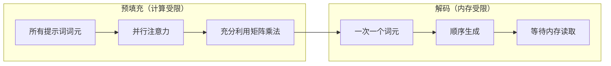
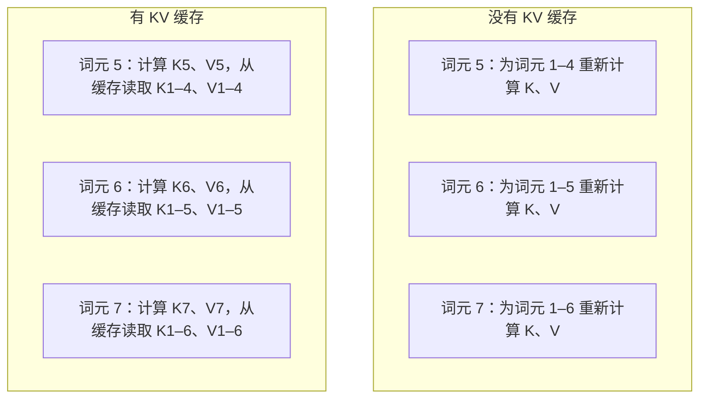
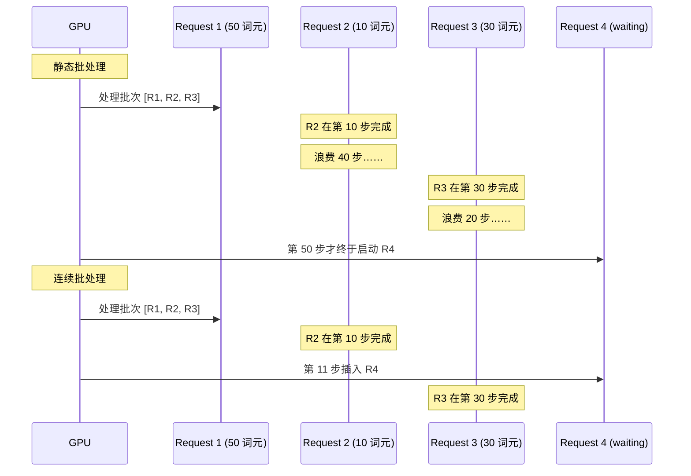
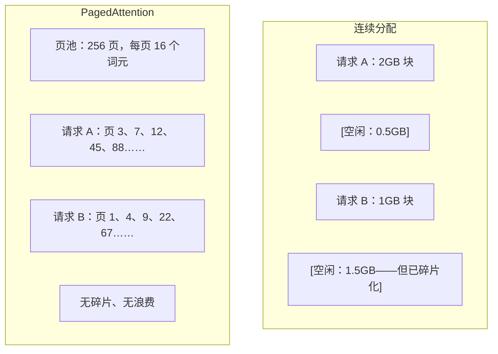
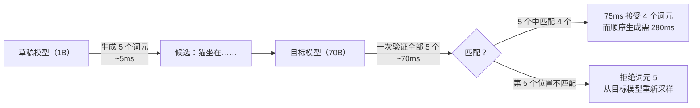

# 推理优化

> LLM 推理由两个阶段构成。预填充并行处理提示词——受计算限制；解码一次生成一个词元——受内存限制。每种优化都针对其中一个阶段，或同时针对两个阶段。

**类型：** 构建
**语言：** Python
**前置课程：** 第 10 阶段，第 01–08 课（Transformer 架构、注意力）
**预计时间：** 约 120 分钟

## 学习目标

- 实现 KV 缓存，消除自回归词元生成期间的重复计算
- 解释 LLM 推理的预填充与解码阶段，以及二者为何有不同的瓶颈（计算受限与内存受限）
- 实现连续批处理和 PagedAttention 的核心概念，在并发请求下最大化 GPU 利用率
- 比较推理优化技术（KV 缓存、推测解码、FlashAttention）及其吞吐量/延迟权衡

## 问题

你将 Llama 3 70B 部署在 4 张 A100 GPU 上。单个用户能得到约每秒 50 个词元，感觉很快。然后 100 个用户同时访问端点，吞吐量降到每个用户每秒 3 个词元。你的 GPU 账单每月 $25,000，服务响应却比人打字还慢。

从 1 个用户到 100 个用户，模型本身没有变化：权重相同、架构相同、数学运算相同。改变的是任务调度方式。朴素推理会浪费 90% 以上的可用 GPU 计算能力。一个用户等待第 47 个词元时，会占住整个批次槽位，而 GPU 内存总线在两次矩阵乘法之间空闲。与此同时，新用户的 2,000 词元提示词本可以用有用计算填补这段空档。

本课讨论调度问题。KV 缓存、连续批处理、PagedAttention、推测解码和前缀缓存决定了同样的流量究竟需要每月 $25k 还是每月 $5k 的推理账单。

vLLM 在 4xA100-80GB 上服务 Llama 3 70B 时，低并发下可达到每用户约每秒 50 个词元；借助连续批处理和 PagedAttention，在 100 个并发请求下仍能维持每用户每秒 15–25 个词元。没有这些优化，同样的硬件在该并发量下只能提供每用户每秒 5 个词元。同样的 GPU、同样的模型，吞吐量却相差 4 倍。

## 概念

### 预填充与解码

每个 LLM 推理请求都有两个不同阶段。

**预填充**处理完整的输入提示词。所有词元都已知，因此可以在整个序列上并行计算注意力。这是一次大型矩阵乘法，GPU 核心会持续忙碌。瓶颈在计算：硬件每秒能提供多少 FLOPS。A100 可达到 312 TFLOPS（BF16）；在单张 A100 上，为 70B 模型预填充一个 4,096 词元的提示词约需 400ms。

**解码**一次生成一个输出词元。每个新词元都会关注所有历史词元，但每次前向传播只产生一个词元。权重矩阵与预填充时一样大，但此时是用一个向量而不是一个矩阵与它相乘。GPU 核心几微秒就完成计算，随后等待下一批权重从内存到达。瓶颈在内存带宽：能多快地将模型权重从 HBM 流式传输到计算单元。A100 的带宽为 2 TB/s，FP16 格式的 70B 模型有 140GB；读取一遍完整模型需要 70ms，这构成单次解码步骤的下限。



**ops:byte 比率**（也叫算术强度）刻画了这种权衡。它衡量每从内存加载一个字节，执行多少次运算。

```
ops:byte ratio = FLOPs per token / bytes read from memory
```

预填充时，若批次包含 4,096 个词元，每加载一个权重就会执行约 4,096 次乘加运算，比率很高，因此受计算限制。解码时批次大小为 1，每加载一个权重只执行约 1 次运算，比率很低，因此受内存限制。

解码受内存限制，因为生成一个词元就要读取整个模型。下面的每一种优化都会减少读取量、增加每次读取所处理的词元批次，或完全避免读取。

### KV 缓存

在注意力计算中，每个词元的查询都会关注所有历史词元的键、值向量。没有缓存时，生成第 N 个词元需要重新计算前 N-1 个词元的键和值投影。生成词元 2 时会投影词元 1，生成词元 3 时再次投影，生成词元 4 时又一次投影。到第 1,000 个词元时，词元 1 总共已经被投影 999 次。

KV 缓存保存所有历史词元的键和值投影。生成第 N 个词元时，只需计算词元 N 的键和值，再将它们与词元 1 到 N-1 的缓存 K/V 拼接起来。



**KV 缓存的内存公式：**

```
KV cache size = 2 * num_layers * num_kv_heads * head_dim * seq_len * bytes_per_param
```

对于 Llama 3 70B（80 层、使用 GQA 的 8 个 KV 头、head_dim=128、BF16）：

```
per token: 2 * 80 * 8 * 128 * 2 bytes = 327,680 bytes = 320 KB
at 4,096 tokens: 320 KB * 4,096 = 1.28 GB
at 128K tokens: 320 KB * 131,072 = 40 GB
```

Llama 3 70B 的一次 128K 上下文对话会消耗 40GB KV 缓存，相当于半张 A100 的内存。若有 100 个并发用户、每人 4K 词元，仅 KV 缓存就需要 128GB。因此，KV 缓存管理成为推理优化的核心挑战。

### 连续批处理

静态批处理会等到 N 个请求到达后一起处理，并等待*全部*请求完成才接收新请求。如果一个请求需要 500 个词元、另一个只需要 10 个，短请求完成后，整个批次仍会在 490 个解码步骤中空转。

连续批处理（也叫迭代级批处理）会在任一请求完成后立即将新请求插入批次。每个解码步骤都会重新评估批次。一个在生成 10 个词元后完成的请求，会立刻由等待中的请求替换。



吞吐量提升取决于输出长度的差异程度。长度一致时，连续批处理与静态批处理相当；长度不一（更常见）时，连续批处理能达到 2–5 倍更高的吞吐量，因为 GPU 槽位不会空置。

### PagedAttention

每个请求的 KV 缓存都是一块连续内存。随着请求到达和离开，内存会碎片化——就像操作系统中的 RAM 碎片化一样。一个 4K 词元的请求需要 1.28GB 连续空间；即使总共有 2GB 空闲空间，也可能没有 1.28GB *连续*空间。你只能浪费内存，或拒绝请求。

PagedAttention（来自 vLLM）将操作系统式虚拟内存应用于 KV 缓存。它不为每个请求分配一块连续空间，而是分配固定大小的“页”（通常每页 16 个词元）。页可以位于 GPU 物理内存的任意位置。页表将每个请求的逻辑序列位置映射到物理页位置。



PagedAttention 还为共享前缀实现了**写时复制**。如果 50 个请求共享同一个系统提示词，该系统提示词对应的 KV 缓存页只保存一次，由 50 个请求共同引用。只有当某个请求发生分歧（用户消息不同）时，它才会获得自己的页。对于共享系统提示词的应用，这会大幅降低内存用量。

vLLM 报告称，通过 PagedAttention，内存浪费接近于零（约 4%，而朴素分配约为 60%–80%）。

### 推测解码

解码很慢，因为它是顺序进行的：生成一个词元，将它送回模型，再生成下一个。但如果可以低成本猜出接下来的 5 个词元，再一次性验证它们呢？

推测解码使用小而快的**草稿模型**生成 K 个候选词元。然后，大型**目标模型**在一次前向传播中处理全部 K 个候选（这看起来像预填充：并行、受计算限制且高效）。如果目标模型同意草稿模型的预测，就能在一次目标模型前向传播的时间内接受全部 K 个词元；如果它在位置 j 处不一致，就接受词元 1 到 j-1，丢弃其余词元。



加速取决于**接受率**，即草稿模型的预测与目标模型匹配的频率。对于用 Llama 3 8B 为 Llama 3 70B 起草，自然语言上的典型接受率为 70%–85%，相当于解码速度提升 2–3 倍。

推测解码有三种方法：

| 方法 | 草稿来源 | 接受率 | 开销 |
|--------|-------------|-----------------|----------|
| 草稿–目标（Leviathan 等） | 独立的小模型 | 70%–85% | 草稿模型内存 |
| EAGLE（Li 等） | 目标模型上的轻量头 | 75%–90% | 约 1% 额外参数 |
| N-gram 查找 | 词元 n-gram 表 | 40%–60% | 可忽略 |

**EAGLE** 在目标模型的隐藏状态之上训练一个小型自回归头。它使用目标模型倒数第二层的特征预测下一个词元的嵌入。由于它操作的是目标模型自己的表示（而不是独立模型的表示），因此只需极少额外内存就能达到更高接受率。EAGLE-2 加入动态草稿树，会根据上下文调整候选数量。

**N-gram 推测解码**维护一个 n-gram 延续表，来源可以是当前上下文或预先构建的语料。如果草稿匹配同一对话中曾经出现的内容（重复模式、代码、结构化输出），就能在没有任何神经网络开销的情况下触发。它的平均接受率较低，但每次推测的成本几乎为零。

推测解码在*数学上是精确的*——输出分布与目标模型的分布完全相同。它不是近似方法。验证步骤保证每个被接受的词元都具有目标模型本来会赋予它的准确概率。

### 前缀缓存

许多请求共享同一个前缀：聊天机器人的系统提示词、RAG 上下文块，或一组 few-shot 示例。没有前缀缓存，每个请求都要从头重新计算这些共享词元的 KV 缓存。

前缀缓存保存常见前缀的 KV 缓存，并在请求之间复用。当带有已知前缀的新请求到达时，系统会复制（或引用）缓存的 KV 条目，只为独有的后缀计算 KV。

如果所有请求共享一个 2,000 词元的系统提示词，前缀缓存会为每个请求省去约 400ms 的预填充。在每秒 100 个请求时，每秒可节省 40 秒的 GPU 计算，相当于超过一张 GPU 的工作量。

SGLang 的 RadixAttention 使用基数树（trie）实现前缀缓存，根据词元内容索引前缀。任何匹配已存储前缀的请求都能免费获得对应 KV 缓存。树结构支持部分前缀匹配——如果 2,000 个前缀词元中有 1,500 个与缓存条目共享，就复用这 1,500 个，只重新计算 500 个。

### 推理引擎

三种引擎主导着生产级 LLM 服务：

| 引擎 | 关键创新 | 最适合 |
|--------|---------------|----------|
| vLLM | PagedAttention、连续批处理 | 通用服务，兼容性最高 |
| SGLang | RadixAttention（前缀缓存）、结构化生成 | 多轮聊天机器人、约束解码 |
| TensorRT-LLM | NVIDIA 内核融合、FP8 量化 | NVIDIA 硬件上的单 GPU 最大吞吐量 |

**vLLM** 是默认起点。它支持最广泛的模型，可以运行在任意 GPU 厂商（NVIDIA、AMD、Intel）的硬件上，并通过 PagedAttention + 连续批处理实现很高的吞吐量。兼容 OpenAI 的 API 意味着可以直接将它替换到任何 OpenAI API 调用的位置。

**SGLang** 建立在与 vLLM 相同的基础之上，但增加了用于前缀缓存的 RadixAttention，以及用于结构化 LLM 程序的领域专用语言。如果你的工作负载涉及多轮对话、工具使用或约束解码（JSON 输出、正则引导生成），SGLang 往往能通过复用前缀达到 vLLM 2–5 倍的性能。

**TensorRT-LLM** 将模型编译成优化后的 NVIDIA GPU 内核。它会融合操作（在一个内核中完成注意力 + 线性层 + 激活），在 H100 GPU 上使用 FP8，并与 NVIDIA Triton Inference Server 集成用于生产部署。它在 NVIDIA 硬件上实现最高的单 GPU 吞吐量，但需要更多配置，而且只能运行在 NVIDIA GPU 上。

Llama 3 70B 在真实场景中的数字（4xA100-80GB，BF16）：

| 指标 | vLLM | SGLang | TensorRT-LLM |
|--------|------|--------|---------------|
| 吞吐量（1 个用户） | ~50 TPS | ~55 TPS | ~65 TPS |
| 吞吐量（100 个用户） | 总计 ~2,500 TPS | 总计 ~3,200 TPS | 总计 ~3,000 TPS |
| 首词元时间 | ~400ms | ~300ms（命中前缀） | ~350ms |
| 最大上下文 | 128K | 128K | 128K |

### Ops:Byte 框架

不测量就无法优化。ops:byte 比率告诉你工作负载受计算限制还是受内存限制，而这决定了哪些优化真正重要。

```
Compute roof: peak FLOPS of the GPU
Memory roof:  peak bandwidth * ops:byte ratio
```

当 ops:byte 较低（解码、小批次）时，你会撞上内存带宽屋顶。增加计算能力（更高频率、更多核心）没有帮助；你需要减少内存读取（量化、KV 缓存压缩），或增大批次，让读取成本摊薄到更多有用工作上。

当 ops:byte 较高（预填充、大批次）时，你会撞上计算屋顶。优化内存带宽于事无补；你需要更快的 GPU、内核融合或降低精度，以挤出更多 FLOPS。

| 场景 | ops:byte | 瓶颈 | 优化方式 |
|----------|----------|-------|---------------|
| 预填充，batch=1 | ~4,096 | 计算 | 内核融合、FP8 |
| 解码，batch=1 | ~1 | 内存 | 量化、KV 压缩 |
| 解码，batch=32 | ~32 | 内存 | 更大批次、连续批处理 |
| 解码，batch=256 | ~256 | 过渡 | 两者都重要 |
| 解码，batch=1024 | ~1,024 | 计算 | 内核融合、张量并行 |

在 A100 上，交叉点约为 ops:byte = 156（312 TFLOPS / 2 TB/s）。低于 156 时受内存限制，高于 156 时受计算限制。连续批处理通过每次迭代打包更多词元，将解码推向这个交叉点。

```figure
context-window-slide
```

## 动手实现

### 步骤 1：从零实现 KV 缓存

我们构建一个多头 KV 缓存，按层、按头保存键和值投影，并展示内存的增长模式。

```python
import numpy as np

class KVCache:
    def __init__(self, num_layers, num_heads, head_dim, max_seq_len, dtype=np.float16):
        self.num_layers = num_layers
        self.num_heads = num_heads
        self.head_dim = head_dim
        self.max_seq_len = max_seq_len
        self.dtype = dtype

        self.k_cache = np.zeros(
            (num_layers, num_heads, max_seq_len, head_dim), dtype=dtype
        )
        self.v_cache = np.zeros(
            (num_layers, num_heads, max_seq_len, head_dim), dtype=dtype
        )
        self.seq_len = 0

    def update(self, layer_idx, new_keys, new_values):
        num_new = new_keys.shape[1]
        end = self.seq_len + num_new
        self.k_cache[layer_idx, :, self.seq_len:end, :] = new_keys
        self.v_cache[layer_idx, :, self.seq_len:end, :] = new_values
        return (
            self.k_cache[layer_idx, :, :end, :],
            self.v_cache[layer_idx, :, :end, :]
        )

    def advance(self, num_tokens):
        self.seq_len += num_tokens

    def memory_bytes(self):
        return self.k_cache.nbytes + self.v_cache.nbytes

    def used_bytes(self):
        per_token = 2 * self.num_layers * self.num_heads * self.head_dim * np.dtype(self.dtype).itemsize
        return per_token * self.seq_len
```

### 步骤 2：使用 KV 缓存的注意力

一个简化的多头注意力，在解码步骤中使用 KV 缓存。

```python
def scaled_dot_product_attention(query, keys, values):
    head_dim = query.shape[-1]
    scores = np.matmul(query, keys.transpose(0, 1, 3, 2)) / np.sqrt(head_dim)
    seq_len_q = scores.shape[-2]
    seq_len_k = scores.shape[-1]
    if seq_len_q > 1:
        mask = np.triu(np.ones((seq_len_q, seq_len_k), dtype=np.float32), k=seq_len_k - seq_len_q + 1)
        scores = scores + mask * (-1e9)
    max_scores = np.max(scores, axis=-1, keepdims=True)
    exp_scores = np.exp(scores - max_scores)
    attn_weights = exp_scores / np.sum(exp_scores, axis=-1, keepdims=True)
    return np.matmul(attn_weights, values)


class MultiHeadAttention:
    def __init__(self, d_model, num_heads):
        self.num_heads = num_heads
        self.head_dim = d_model // num_heads
        scale = np.sqrt(2.0 / d_model)
        self.W_q = np.random.randn(d_model, d_model).astype(np.float32) * scale
        self.W_k = np.random.randn(d_model, d_model).astype(np.float32) * scale
        self.W_v = np.random.randn(d_model, d_model).astype(np.float32) * scale
        self.W_o = np.random.randn(d_model, d_model).astype(np.float32) * scale

    def forward(self, x, kv_cache=None, layer_idx=0):
        batch, seq_len, d_model = x.shape
        Q = np.matmul(x, self.W_q).reshape(batch, seq_len, self.num_heads, self.head_dim).transpose(0, 2, 1, 3)
        K = np.matmul(x, self.W_k).reshape(batch, seq_len, self.num_heads, self.head_dim).transpose(0, 2, 1, 3)
        V = np.matmul(x, self.W_v).reshape(batch, seq_len, self.num_heads, self.head_dim).transpose(0, 2, 1, 3)

        if kv_cache is not None:
            K_full, V_full = kv_cache.update(layer_idx, K[0], V[0])
            K = K_full[np.newaxis, :, :, :]
            V = V_full[np.newaxis, :, :, :]
            if seq_len == 1:
                kv_cache.advance(1)

        attn_out = scaled_dot_product_attention(Q, K, V)
        attn_out = attn_out.transpose(0, 2, 1, 3).reshape(batch, -1, d_model)
        return np.matmul(attn_out, self.W_o)
```

### 步骤 3：连续批处理模拟器

这里模拟静态批处理和连续批处理之间的调度差异。

```python
import heapq

class Request:
    def __init__(self, request_id, prompt_tokens, output_tokens, arrival_step):
        self.request_id = request_id
        self.prompt_tokens = prompt_tokens
        self.output_tokens = output_tokens
        self.arrival_step = arrival_step
        self.tokens_generated = 0
        self.start_step = None
        self.end_step = None

    def is_done(self):
        return self.tokens_generated >= self.output_tokens


def simulate_static_batching(requests, batch_size):
    step = 0
    completed = []
    queue = list(requests)
    queue.sort(key=lambda r: r.arrival_step)

    while queue:
        batch = []
        while queue and len(batch) < batch_size:
            r = queue.pop(0)
            r.start_step = max(step, r.arrival_step)
            batch.append(r)

        if batch:
            step = max(step, max(r.start_step for r in batch))
            max_output = max(r.output_tokens for r in batch)
            for r in batch:
                r.tokens_generated = r.output_tokens
                r.end_step = step + max_output
            step += max_output
            completed.extend(batch)

    return completed


def simulate_continuous_batching(requests, batch_size):
    step = 0
    completed = []
    queue = sorted(requests, key=lambda r: r.arrival_step)
    queue_idx = 0
    active = []
    waiting = []

    while queue_idx < len(queue) or active or waiting:
        while queue_idx < len(queue) and queue[queue_idx].arrival_step <= step:
            waiting.append(queue[queue_idx])
            queue_idx += 1

        while waiting and len(active) < batch_size:
            r = waiting.pop(0)
            r.start_step = step
            active.append(r)

        if not active:
            if waiting:
                step += 1
                continue
            elif queue_idx < len(queue):
                step = queue[queue_idx].arrival_step
                continue
            else:
                break

        for r in active:
            r.tokens_generated += 1

        done = [r for r in active if r.is_done()]
        for r in done:
            r.end_step = step + 1
            completed.append(r)
        active = [r for r in active if not r.is_done()]

        step += 1

    return completed


def batching_stats(completed):
    latencies = [r.end_step - r.arrival_step for r in completed]
    total_time = max(r.end_step for r in completed) - min(r.arrival_step for r in completed)
    total_tokens = sum(r.output_tokens for r in completed)
    return {
        "avg_latency": np.mean(latencies),
        "p50_latency": np.median(latencies),
        "p99_latency": np.percentile(latencies, 99),
        "total_time": total_time,
        "throughput": total_tokens / total_time if total_time > 0 else 0,
    }
```

### 步骤 4：前缀缓存

一个基于 trie 的前缀缓存，用于保存共享前缀的 KV 条目。

```python
class TrieNode:
    def __init__(self):
        self.children = {}
        self.kv_data = None
        self.hit_count = 0


class PrefixCache:
    def __init__(self, max_entries=1000):
        self.root = TrieNode()
        self.max_entries = max_entries
        self.total_entries = 0
        self.hits = 0
        self.misses = 0

    def _walk(self, token_ids):
        node = self.root
        depth = 0
        for tid in token_ids:
            if tid not in node.children:
                break
            node = node.children[tid]
            depth += 1
        return node, depth

    def lookup(self, token_ids):
        node, depth = self._walk(token_ids)
        if depth > 0:
            self.hits += 1
            current = self.root
            for tid in token_ids[:depth]:
                current = current.children[tid]
                current.hit_count += 1
            kv_entries = []
            current = self.root
            for tid in token_ids[:depth]:
                current = current.children[tid]
                if current.kv_data is not None:
                    kv_entries.append(current.kv_data)
            return depth, kv_entries
        self.misses += 1
        return 0, []

    def insert(self, token_ids, kv_per_token):
        node = self.root
        for i, tid in enumerate(token_ids):
            if tid not in node.children:
                if self.total_entries >= self.max_entries:
                    return i
                node.children[tid] = TrieNode()
                self.total_entries += 1
            node = node.children[tid]
            if i < len(kv_per_token):
                node.kv_data = kv_per_token[i]
        return len(token_ids)

    def hit_rate(self):
        total = self.hits + self.misses
        return self.hits / total if total > 0 else 0.0
```

### 步骤 5：推测解码模拟器

我们模拟草稿–目标式推测解码，并允许配置接受率。

```python
class DraftModel:
    def __init__(self, vocab_size, acceptance_rate=0.8):
        self.vocab_size = vocab_size
        self.acceptance_rate = acceptance_rate

    def generate(self, context, num_tokens):
        tokens = np.random.randint(0, self.vocab_size, size=num_tokens)
        return tokens

    def get_probs(self, context, token):
        probs = np.random.dirichlet(np.ones(self.vocab_size))
        return probs


class TargetModel:
    def __init__(self, vocab_size):
        self.vocab_size = vocab_size

    def get_probs(self, context, tokens=None):
        if tokens is not None:
            return [np.random.dirichlet(np.ones(self.vocab_size)) for _ in tokens]
        return np.random.dirichlet(np.ones(self.vocab_size))


def speculative_decode(draft_model, target_model, context, num_speculative=5,
                       draft_cost=1.0, target_cost=10.0, verify_cost=12.0):
    total_tokens = 0
    total_cost = 0.0
    accepted_counts = []
    context = list(context)

    max_tokens = 100

    while total_tokens < max_tokens:
        draft_tokens = draft_model.generate(context, num_speculative)
        total_cost += draft_cost * num_speculative

        target_probs = target_model.get_probs(context, draft_tokens)
        total_cost += verify_cost

        accepted = 0
        for i, token in enumerate(draft_tokens):
            draft_p = draft_model.get_probs(context + list(draft_tokens[:i]), token)
            target_p = target_probs[i]

            r = np.random.random()
            acceptance_prob = min(1.0, target_p[token] / (draft_p[token] + 1e-10))

            if r < draft_model.acceptance_rate:
                accepted += 1
                context.append(token)
                total_tokens += 1
            else:
                new_token = np.random.choice(draft_model.vocab_size, p=target_p)
                context.append(new_token)
                total_tokens += 1
                break

        accepted_counts.append(accepted)

        if accepted == num_speculative:
            bonus_probs = target_model.get_probs(context)
            bonus_token = np.random.choice(draft_model.vocab_size, p=bonus_probs)
            context.append(bonus_token)
            total_tokens += 1

    sequential_cost = total_tokens * target_cost
    return {
        "total_tokens": total_tokens,
        "speculative_cost": total_cost,
        "sequential_cost": sequential_cost,
        "speedup": sequential_cost / total_cost if total_cost > 0 else 1.0,
        "avg_accepted": np.mean(accepted_counts),
        "acceptance_rate": np.mean(accepted_counts) / num_speculative,
    }


def compare_speculation_strategies(vocab_size=1000, num_trials=20):
    results = {}

    for name, acceptance_rate, spec_tokens in [
        ("Draft-target (8B->70B)", 0.78, 5),
        ("EAGLE", 0.85, 6),
        ("N-gram", 0.50, 4),
        ("No speculation", 0.0, 0),
    ]:
        if spec_tokens == 0:
            results[name] = {
                "speedup": 1.0,
                "acceptance_rate": 0.0,
                "avg_accepted": 0.0,
            }
            continue

        trial_results = []
        for _ in range(num_trials):
            draft = DraftModel(vocab_size, acceptance_rate=acceptance_rate)
            target = TargetModel(vocab_size)
            context = list(np.random.randint(0, vocab_size, size=10))
            result = speculative_decode(draft, target, context, num_speculative=spec_tokens)
            trial_results.append(result)

        results[name] = {
            "speedup": np.mean([r["speedup"] for r in trial_results]),
            "acceptance_rate": np.mean([r["acceptance_rate"] for r in trial_results]),
            "avg_accepted": np.mean([r["avg_accepted"] for r in trial_results]),
        }

    return results
```

### 步骤 6：KV 缓存内存分析器

计算真实模型配置所需的 KV 缓存内存。

```python
MODEL_CONFIGS = {
    "Llama-3-8B": {
        "num_layers": 32, "num_kv_heads": 8, "head_dim": 128,
        "model_params_b": 8, "gqa": True,
    },
    "Llama-3-70B": {
        "num_layers": 80, "num_kv_heads": 8, "head_dim": 128,
        "model_params_b": 70, "gqa": True,
    },
    "Llama-3-405B": {
        "num_layers": 126, "num_kv_heads": 8, "head_dim": 128,
        "model_params_b": 405, "gqa": True,
    },
    "Mistral-7B": {
        "num_layers": 32, "num_kv_heads": 8, "head_dim": 128,
        "model_params_b": 7, "gqa": True,
    },
    "GPT-4-est": {
        "num_layers": 120, "num_kv_heads": 96, "head_dim": 128,
        "model_params_b": 1800, "gqa": False,
    },
}


def kv_cache_memory(config, seq_len, dtype_bytes=2):
    per_token = 2 * config["num_layers"] * config["num_kv_heads"] * config["head_dim"] * dtype_bytes
    total = per_token * seq_len
    return {
        "per_token_bytes": per_token,
        "per_token_kb": per_token / 1024,
        "total_bytes": total,
        "total_mb": total / (1024 ** 2),
        "total_gb": total / (1024 ** 3),
    }


def memory_budget(config, gpu_memory_gb, model_dtype_bytes=2, kv_dtype_bytes=2):
    model_memory_gb = config["model_params_b"] * 1e9 * model_dtype_bytes / (1024 ** 3)
    overhead_gb = gpu_memory_gb * 0.1
    available_for_kv = gpu_memory_gb - model_memory_gb - overhead_gb

    if available_for_kv <= 0:
        return {"error": "Model does not fit in GPU memory", "model_memory_gb": model_memory_gb}

    per_token = 2 * config["num_layers"] * config["num_kv_heads"] * config["head_dim"] * kv_dtype_bytes
    max_tokens = int(available_for_kv * (1024 ** 3) / per_token)

    return {
        "gpu_memory_gb": gpu_memory_gb,
        "model_memory_gb": round(model_memory_gb, 1),
        "overhead_gb": round(overhead_gb, 1),
        "available_for_kv_gb": round(available_for_kv, 1),
        "max_total_tokens": max_tokens,
        "max_users_at_2k": max_tokens // 2048,
        "max_users_at_4k": max_tokens // 4096,
        "max_users_at_32k": max_tokens // 32768,
    }
```

## 使用它

使用 vLLM：

```python
from vllm import LLM, SamplingParams

llm = LLM(
    model="meta-llama/Llama-3-70B-Instruct",
    tensor_parallel_size=4,
    enable_prefix_caching=True,
    max_model_len=8192,
    gpu_memory_utilization=0.9,
)

params = SamplingParams(temperature=0.7, max_tokens=256)
outputs = llm.generate(["Explain inference optimization in one paragraph."], params)
```

使用 SGLang 实现前缀缓存 + 结构化输出：

```python
import sglang as sgl

@sgl.function
def classify(s, text):
    s += sgl.system("You are a classifier. Output JSON only.")
    s += sgl.user(f"Classify this text: {text}")
    s += sgl.assistant(sgl.gen("result", regex=r'\{"label": "(positive|negative|neutral)"\}'))

runtime = sgl.Runtime(model_path="meta-llama/Llama-3-70B-Instruct", tp_size=4)
sgl.set_default_backend(runtime)

results = classify.run_batch([
    {"text": "This product is amazing!"},
    {"text": "Terrible experience."},
    {"text": "It was okay I guess."},
])
```

使用 TensorRT-LLM：

```python
import tensorrt_llm
from tensorrt_llm.runtime import ModelRunner

runner = ModelRunner.from_dir("./llama-70b-trt-engine/", rank=0)

outputs = runner.generate(
    batch_input_ids=[tokenizer.encode("Explain KV caching.")],
    max_new_tokens=256,
    temperature=0.7,
)
```

## 交付产物

本课会产出：
- `outputs/skill-inference-optimization.md`——用于诊断和优化 LLM 推理服务的技能

## 练习

1. 修改 KV 缓存分析器，比较 FP16、FP8 和 INT4 KV 缓存量化。对于 4K 上下文的 Llama 3 70B，计算每种方案在 4xA100-80GB 上支持的最大并发用户数。将 KV 量化到 INT4 后，用户容量应大约提升 4 倍。

2. 扩展连续批处理模拟器，跟踪 GPU 利用率（每一步已填充的批次槽位占比）。构造 50 个请求，使输出长度服从 Pareto 分布（shape=1.5、scale=20），绘制静态批处理和连续批处理的利用率随时间变化曲线。连续批处理应保持 >80% 的利用率。

3. 实现使用分组查询注意力（GQA）的 KV 缓存版本，使 `num_kv_heads < num_query_heads`。Llama 3 70B 使用 64 个查询头，却只有 8 个 KV 头。计算它相对于完整多头注意力的内存节省（KV 缓存大小减少 8 倍）。

4. 构建使用 LRU 淘汰的前缀缓存。将 max_entries 设为 500，生成 1,000 个请求，其中 60% 共享 5 个常见前缀之一。测量命中率并与无限缓存比较。淘汰策略良好时，命中率应保持在 55% 以上。

5. 扩展推测解码模拟器，实现基于树的推测（EAGLE-2 风格）。不要生成单条包含 K 个草稿词元的链，而是生成候选树（例如 3 个层级各有 2 个分支，即 8 个叶候选）。比较每轮验证接受的词元总数与线性推测的差异。

## 关键术语

| 术语 | 常见说法 | 实际含义 |
|------|----------------|----------------------|
| 预填充 | “处理提示词” | 并行计算所有输入词元的注意力——完整矩阵乘法让 GPU 核心保持繁忙，因此受计算限制 |
| 解码 | “生成词元” | 每次前向传播生成一个词元，每次都读取完整模型权重——计算会在下一批权重到达前完成，因此受内存限制 |
| KV 缓存 | “缓存注意力状态” | 保存所有历史词元的键和值投影，使其无需在每个解码步骤重新计算——用内存换计算 |
| 连续批处理 | “动态批处理” | 任一请求完成后立即将新请求插入正在运行的批次，每次解码迭代重新评估，而不是等待整个批次完成 |
| PagedAttention | “KV 缓存的虚拟内存” | 将 KV 缓存分配到固定大小的页，而不是连续块，从而消除内存碎片，并支持共享前缀的写时复制 |
| 推测解码 | “草稿与验证” | 用快速草稿模型提出多个词元，再由目标模型一次前向传播全部验证——数学上精确，可提速 2–3 倍 |
| EAGLE | “自推测解码” | 一种推测解码变体，在目标模型自己的隐藏状态上训练轻量头，比独立草稿模型达到更高接受率 |
| 前缀缓存 | “复用系统提示词 KV” | 保存常见前缀（系统提示词、few-shot 示例）已计算的 KV 缓存条目，并在请求之间复用，以跳过重复预填充 |
| Ops:byte 比率 | “算术强度” | 计算运算量与读取内存字节数之比——决定工作负载是计算受限（比率高）还是内存受限（比率低） |
| 首词元时间 | “TTFT” | 从收到请求到生成第一个输出词元的延迟——长提示词时主要由预填充时间决定 |

## 延伸阅读

- Kwon 等，《使用 PagedAttention 高效管理大语言模型服务内存》（2023）——介绍分页 KV 缓存管理的 vLLM 论文，如今已成为推理服务的行业标准
- Leviathan 等，《通过推测解码实现 Transformer 快速推理》（2023）——奠基性论文，证明草稿–验证推测在实现 2–3 倍加速的同时，产生与目标模型完全相同的分布
- Li 等，《EAGLE：推测采样需要重新思考特征不确定性》（2024）——在目标模型自身特征上训练头，而不是使用独立草稿模型，从而获得更高接受率
- Zheng 等，《SGLang：结构化语言模型程序的高效执行》（2024）——为前缀缓存引入 RadixAttention，以及支持多次调用 LLM 程序的编程模型
- Williams 等，《Roofline：多核架构的深刻可视化性能模型》（2009）——最初的 Roofline 论文，将 ops:byte 框架形式化，用于分析计算与内存瓶颈
