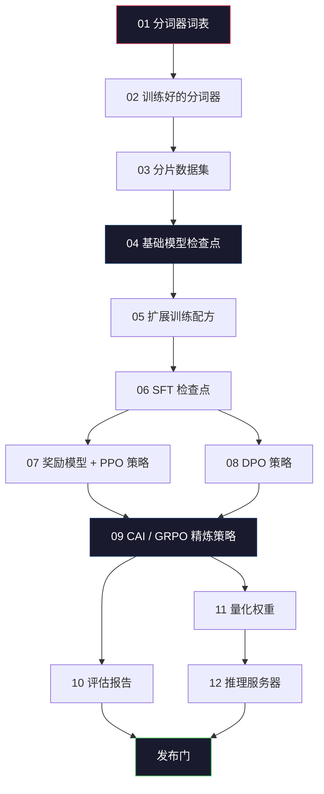
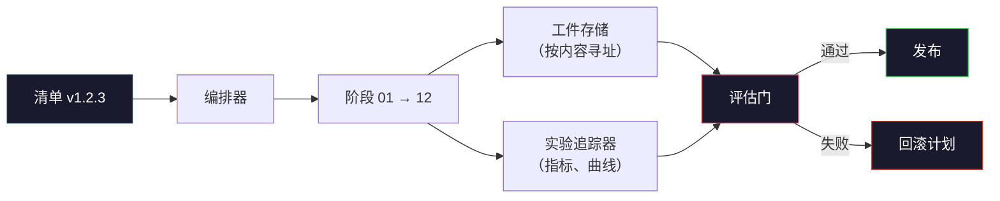

# 构建完整的 LLM 流水线

> 第 01–12 课的内容其实都是同一条流水线中的一个阶段。本课将这些阶段搭成一次端到端运行：分词、预训练、扩展、SFT、对齐、评估、量化、服务。你不会在笔记本电脑上训练 70B 模型，但会产出 2026 年前沿团队用来决定发布内容的编排层、清单、评估门和回滚计划。这是本阶段的综合课。

**类型：** 构建
**语言：** Python（标准库）
**前置课程：** 第 10 阶段第 01–12 课
**预计时间：** 约 120 分钟

## 学习目标

- 将此前的 11 课（分词器、数据、预训练、扩展、SFT、RLHF、DPO、CAI、评估、量化、推理）组合为一份可复现的流水线规范
- 定义阶段之间的工件契约：每个阶段消费什么、产出什么，以及下一阶段如何验证输入
- 构建一个能追踪实验、为工件计算哈希，并依据评估阈值决定是否发布的编排器
- 设计回滚计划：哪些工件可以低成本重跑，哪些代价昂贵，以及检查点损坏需要付出什么成本

## 问题

前面的课程各自都能运行。分词器训练完成了。微型 GPT 预训练完成了。SFT 数据集组装好了。奖励模型训练好了。DPO 跑完了。评估测完了。量化权重导出了。推理服务器启动了。但每一项都是一个笔记本，每一项都有自己的约定、输出路径和随机种子。

前沿训练运行不是笔记本。Llama 3 405B 大约用了 3000 万个 H100 小时，持续约 54 天；DeepSeek-V3 使用了约 280 万个 H800 小时。在这段时间里，一个损坏的检查点、一次数据污染或一次评估回归，都可能让团队损失一周的挂钟时间和一个月的 GPU 预算。团队依靠流水线卫生来扛过这些风险：每个阶段都有确定性的输入、确定性的输出、一份清单、一个哈希和一道门。

这是综合课。你不会在笔记本电脑上端到端运行整条流水线，而是要编写协调各阶段的编排器、描述运行的清单、决定是否发布的验证器，以及让第三方能够从单个文件重放你工作的重放计划。代码很小；纪律要求很高。

这个模式从 1 亿参数扩展到 1 万亿参数时不变。同样的四个组件——清单、编排器、评估门、工件存储——既能运行 Llama 3，也能运行你的业余 GPT。变化的是各阶段配置中的数字规模，而不是流水线的形状。

## 概念

### 十二个阶段

第 10 阶段的每一课都是一个阶段。下面是完整的依赖图。



第 07 和 08 阶段可以并行运行，其他阶段都是硬依赖。第 02 阶段（分词器）发生变化，会使所有下游工件失效；第 10 阶段（评估）发生变化，则只会使发布决定失效。

### 清单

清单（manifest）是一个足够完整地描述一次运行、让它可以被重放的单一文件。流水线产出的任何内容都不应依赖清单之外的状态。字段看起来乏味，但都是必需的。

```
pipeline_version: 1.2.3
seed: 42
git_commit: a1b2c3d4
stages:
  01_tokenizer:
    recipe: bpe_32k
    input_hash: sha256:...
    output_hash: sha256:...
    wall_clock_sec: 3600
    cost_usd: 12
```

第 N 阶段的输出哈希就是第 N+1 阶段的输入哈希。只要出现任何偏差，流水线就会停止。这能让你尽早捕获数据损坏；也是身处另一片大陆的队友验证其重放是否产出了与你相同工件的方式。

实践中，团队会使用一个小型 YAML schema，以及一个与上一次成功运行进行差异比较的清单检查器。除了预期字段（成本、挂钟时间）之外的任何差异，都是危险信号。

### 工件类型

每个阶段的输出都是一种有类型的工件，带有已知 schema 的命名类型，而不是目录 blob 或 pickle。

| 阶段 | 工件类型 | 关键字段 |
|-------|--------------|-----------|
| 01-02 | 分词器 | vocab.json、merges.txt、config.json、哈希 |
| 03 | 数据集 | shards[]、行数、词元数、去重统计 |
| 04-05 | 检查点 | weights.safetensors、config.json、优化器状态、步数 |
| 06 | SFT 模型 | 检查点 + SFT 配方 + 数据混合 |
| 07 | 奖励模型 | RM 检查点 + 偏好数据哈希 |
| 08-09 | 策略 | 检查点 + 参考哈希 + beta + 已消耗的 KL 预算 |
| 10 | 评估报告 | 基准分数 + 回归差异 + 评估数据哈希 |
| 11 | 量化模型 | 量化权重 + 校准数据 + 相对 FP16 的准确率差值 |
| 12 | 服务器规格 | 端点 + 模型哈希 + 配置 + 可观测性钩子 |

类型系统可以阻止最常见的失败模式：把第 08 阶段的输出当作第 06 阶段的输入，让一个经过 DPO 训练的模型走 SFT 路径。有类型的工件和有类型的阶段签名，会让这类错误在编译期暴露，而不是到第五天才暴露。

### 评估门

发布条件是训练完成且通过评估门。评估门必须在运行开始之前定义。

```
gates:
  mmlu:      >= baseline + 0.5   # no regression
  humaneval: >= baseline + 1.0
  truthfulqa: >= baseline         # no drop
  safety_refusal_rate: <= 0.05
  kl_from_reference: <= 25.0
  cost_total_usd: <= 50000
```

每一道门都是数值阈值，没有“看起来不错”的门，也没有主观签字。如果所有门都通过，工件就会被标记为可发布；如果任意一门失败，运行就会被挂起，等待指定审阅者明确覆盖这一决定，而覆盖本身也会记录在清单中。

两道门可以捕获大多数灾难。*回归门*（新模型在核心基准上的表现至少要与之前一样好）能捕获训练 bug；*KL 预算门*（对齐后的策略不能偏离参考策略超过 X）能捕获对齐过度烹煮。每条生产流水线都应有这两道门。

### 编排器

编排器是一小段读取清单、分发阶段、追踪工件并在任何契约违反时停止的代码。它不是 Airflow，也不是 Kubeflow。为了保证流水线卫生，你需要的是一个自己写的、朴素的工具。

编排器的职责很窄：

1. 从清单解析 DAG。
2. 对每个阶段检查具有正确哈希的预期输出是否已经存在（如果存在就跳过）。
3. 运行阶段，捕获 stdout/stderr，并测量挂钟时间和成本。
4. 根据下游阶段预期的输入哈希验证输出哈希。
5. 失败时，写入一份包含确切失败阶段的部分清单，并以非零状态退出。

200 行 Python 就能完成这项编排工作。它会像本课 `code/main.py` 中的文件一样。在底层，真实流水线使用 `torchrun` 或 `ray` 在集群上执行单个阶段，但编排器本身运行在一台机器上。

### 实验追踪与工件存储

两个外部系统锚定着这条流水线。

**实验追踪器（wandb、neptune、mlflow）。** 按阶段记录损失曲线、评估指标和系统遥测数据。三周后需要比较运行 A 与运行 B 时，你会去看追踪器。团队几乎总是使用托管式追踪器——自己编写会浪费本应投入训练的时间。

**工件存储（S3、R2、GCS）。** 用于保存检查点、数据集、分词器和评估报告的不可变对象存储。工件按哈希而不是文件名寻址。`latest.pt` 这样的文件名是一个埋雷；`ckpt-7b-step-20000-sha256:abc123.safetensors` 才是一份契约。

编排器会同时写入两者。追踪器服务于查看图表的人；工件存储服务于查找输入的下一阶段。

### 成本计算

一次前沿运行都有一个与之绑定的美元数额。预算纪律发生在两个位置。

**运行前估算。** 从清单计算预期 FLOPs（预训练使用 `6 x params x tokens`）、预期 GPU 小时（FLOPs / 峰值吞吐量 / 利用率），以及按当前租赁价格计算的美元成本。如果估算超过预算门，流水线就拒绝启动。

**运行中追踪。** 每个阶段的挂钟时间和成本都会记录到清单中。每完成一个阶段，就检查剩余预算。如果某阶段超支，就用新的剩余预算评估下一阶段的门。你不会等到风投方打来电话时才发现自己没钱了。

Llama 3 报告的成本是 6100 万美元。DeepSeek-V3 报告的主预训练运行成本是 560 万美元。这个比例主要来自硬件效率和混合专家；但具体成本之所以可见，是因为两支团队按阶段而不是按整次运行进行了追踪。

### 可复现性与确定性

二者并不相同。*可复现*意味着相同的清单、代码和基础设施可以产出下游指标等价的检查点。*确定性*意味着产出逐比特完全相同。

现代 LLM 训练是可复现的，但不是确定性的。分布式训练中的归约顺序、GPU kernel 的非确定性（cuBLAS、flash-attn）以及混合精度舍入，会共同导致不同运行之间的浮点数在 `1e-5` 量级上产生差异。对于不变的最终指标，这没有问题；但如果你试图用逐比特差异调试，就会致命。解决方法是记录每个阶段的输入哈希、输出哈希和核心指标——如果它们一致，即使权重不是逐比特相同，这次运行也算“复现”了。



### 回滚计划

在运行开始之前，写下每个阶段失败时要做什么。分为三类。

- **便宜、可重跑**（数小时）：分词器、评估、量化、推理服务器。直接重跑。
- **中等成本**（数天）：SFT、DPO、CAI。保留基础模型；只重跑对齐阶段。
- **昂贵**（数周和数百万美元）：预训练。这里的回滚计划是使用上一个正常检查点，配合修订后的数据重跑成本更低的下游阶段。

由于阶段依赖关系有类型且带哈希，编排器可以自动计算回滚集合：让失败阶段及其所有后代失效。第 06 阶段（SFT）失败，会使 06、07、08、09、10、11、12 失效；第 11 阶段（量化）失败，则只会使 11 和 12 失效。提前写清这些内容，可以避免团队凌晨 4 点筋疲力尽时临时发挥。

### 2026 年观察到的生产配方

大多数前沿团队已经收敛到同一个骨架。

- 分词器：128k BPE，带字节回退。在一个小而均衡的多语言切片上训练。
- 预训练：10–20T 词元，主要是网页、代码和合成数据。Muon 或 AdamW 优化器。FSDP2 或 DeepSpeed ZeRO-3。梯度检查点。BF16 权重，FP32 主权重。
- SFT：50 万–200 万条指令对，混合人工和合成数据，并严格与评估集去重。
- 对齐：DPO 或 CAI + GRPO。只有在偏好信号对 DPO 来说维度过多时才使用 RLHF。
- 评估：MMLU-Pro、MATH、HumanEval+、GPQA、SWE-Bench Verified、LiveBench，以及一份公众永远看不到的私有留出集。
- 量化：服务使用 4-bit GPTQ 或 AWQ；当准确率差值重要时，安全评估使用 8-bit。
- 服务：vLLM、TensorRT-LLM 或内部系统。连续批处理、推测解码、KV 缓存驱逐。

数字每六个月都会变化，骨架不会。

```figure
beam-search
```

## 动手实现

本课的代码是一个编排器和清单检查器，而不是十二个训练脚本。每个阶段都用一个占位实现模拟，产出形状和哈希都正确的输出工件。在真正烧 GPU 预算运行阶段之前，端到端运行编排器可以先证明流水线的管道连接没有问题。

完整实现见 `code/main.py`。关键部分包括：

- `Manifest` dataclass：流水线版本、随机种子、Git commit、阶段和门。
- `Stage` dataclass：名称、类型、输入（哈希）、输出（哈希）、挂钟时间和成本。
- `Orchestrator.run()`：解析 DAG、分发阶段、验证哈希并更新清单。
- `EvalGate.check()`：读取阈值，与最新评估报告比较并返回通过/失败。
- `ArtifactStore`（内存 stub）：按哈希 put/get，模拟 S3。
- `CostTracker`：按阶段和累计追踪，超过上限时停止。

`main.py` 中的流水线运行十二个占位阶段，生成一份清单，并执行一次失败的评估门，以展示被挂起的运行是什么样子。将每个占位实现替换为对应课程中的真实训练脚本，你就得到了真实前沿流水线所使用的骨架。

## 使用它

标准工作流包含三个命令。

```
python code/main.py plan    # validate manifest, compute cost estimate, print DAG
python code/main.py run     # execute stages, writing to manifest.out.yaml
python code/main.py gate    # read manifest.out.yaml, apply eval gates, ship-or-hold
```

每次都先运行 `plan`。大多数流水线 bug 会在计划阶段暴露——缺失门阈值、过期哈希、预算超支。运行 `plan` 不花钱，运行 `run` 很昂贵。在便宜的一侧捕获 bug，可以节省成本。

`gate` 的输出只有两种：`SHIP` 或 `HOLD: <reason>`。被挂起的运行表示一个决策点，不代表失败。指定的审阅者可以覆盖决定（并记录覆盖），也可以批准回滚。

## 交付它

本课产出 `outputs/skill-llm-pipeline-reviewer.md`。将一份待审的流水线清单交给它，它会检查所有契约：阶段类型、哈希链、门、回滚计划和成本估算。缺少评估门、KL 预算无上限，或混用了评估数据和训练数据的清单，它都会拒绝批准。

## 练习

1. 扩展编排器，让第 07 和 08 阶段支持并行执行。使用标准库 `concurrent.futures` 模块。确认最终清单记录了两个阶段的输出，并且第 09 阶段的输入哈希是二者的确定性组合。

2. 增加一道“污染检查”门。给定评估数据集哈希和训练数据集分片，计算二者的重叠（精确字符串匹配或 13-gram 匹配）。如果重叠超过 0.1%，评估门就失败。向它输入一个被污染的训练集，确认门会挂起运行。

3. 从第一性原理实现一个成本估算器。对于第 04 阶段（预训练），将 FLOPs 估算为 `6 x params x tokens`；假设 H100 上 MFU（模型 FLOPs 利用率）为 40%，BF16 为 989 TFLOPs，价格为每 GPU 小时 $2.50。报告一个在 2T 词元上训练的 7B 模型的估算值，并与已发布的 Llama 2 数字比较。

4. 构建部分回滚。模拟第 09 阶段（CAI）失败，然后只重跑第 09–12 阶段，同时保留第 01–08 阶段的缓存。编排器应按哈希检测缓存工件并跳过它们。测量相对于完整重跑节省的挂钟时间。

5. 增加可观测性。为每个阶段发出 OpenTelemetry span，带有 params、已处理词元数、loss 和 cost 属性。将 span 发送到本地 collector。仪表盘只是结果，关键是让每个阶段的健康状况都能从单个 trace ID 追溯。

## 关键术语

| 术语 | 人们怎么说 | 实际含义 |
|------|------------|----------|
| Manifest | “配方文件” | 描述流水线版本、随机种子、各阶段配置和门阈值的 YAML 或 JSON，足以重放一次运行 |
| Content-addressed | “按哈希而不是名称” | 按内容的 SHA-256 存储工件，因此永远不会把版本 A 与版本 B 混淆 |
| Eval gate | “发布标准” | 基准指标和安全分数的数值阈值，工件必须通过这些阈值才会被标记为可发布 |
| KL budget | “对齐偏了多远” | 对齐阶段累计 KL(policy || reference) 的上限，由一道门强制执行 |
| MFU | “用了多少 GPU” | Model FLOPs Utilization，即已达到的 FLOPs 除以理论峰值；70B 规模通常为 40%，7B 规模为 55% |
| Rollback plan | “坏了怎么办” | 针对每个阶段失败时预先写好的动作集合：重跑、回退，或用修订后的输入重新训练 |
| Orchestrator | “指挥” | 读取清单、分发阶段、验证哈希并在任何契约违反时停止的进程 |
| Artifact store | “用于权重的版本化 S3” | 不可变、按内容寻址的对象存储，是检查点、数据集和评估报告的唯一事实来源 |
| Reproducible | “重放时指标相同” | 逐比特权重不同但下游指标等价；这是分布式 LLM 训练的现实目标 |
| Cost gate | “不能超过 X” | 运行前成本估算加运行中追踪；估算超过预算时流水线拒绝启动 |

## 延伸阅读

- [Dubey et al., 2024 -- "The Llama 3 Herd of Models"](https://arxiv.org/abs/2407.21783) -- 关于前沿流水线（包括数据、训练、对齐和评估）最详细的公开描述
- [DeepSeek-AI, 2024 -- "DeepSeek-V3 Technical Report"](https://arxiv.org/abs/2412.19437) -- 成本约为 Llama 3 同级训练十分之一、以效率优先的流水线
- [Kaplan et al., 2020 -- "Scaling Laws for Neural Language Models"](https://arxiv.org/abs/2001.08361) -- 最初的计算量–数据量–参数量缩放关系
- [Hoffmann et al., 2022 -- "Training Compute-Optimal Large Language Models (Chinchilla)"](https://arxiv.org/abs/2203.15556) -- 修正 Kaplan、重新校准现代数据预算的方法
- [PyTorch FSDP2 documentation](https://pytorch.org/docs/stable/fsdp.html) -- PyTorch 2.4+ 中取代 FSDP1 的分布式训练原语
- [Weights & Biases LLM Reports](https://wandb.ai/site/llms) -- 开源 LLM 运行的真实清单和实验追踪器输出，可作为可复用模板
