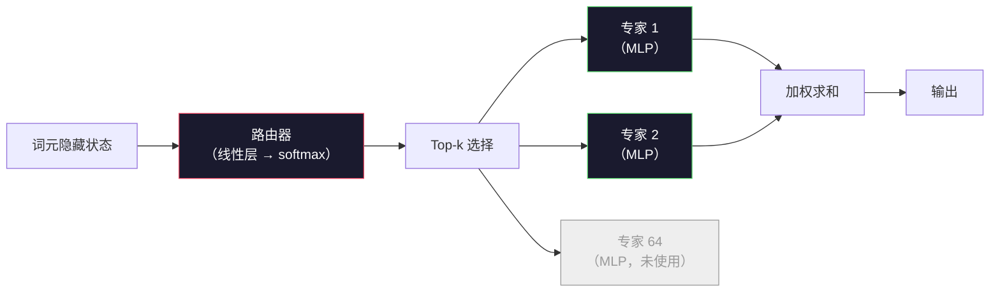

# 开放模型：架构漫游

> 你已经在第 04 课从零构建了 GPT-2 Small。2026 年的前沿开放模型仍属于同一个家族，只是做了五六项具体改动：用 RMSNorm 替代 LayerNorm，用 SwiGLU 替代 GELU，用 RoPE 替代学习型位置编码，用 GQA 或 MLA 替代完整 MHA，并在大规模下使用混合专家。你已经掌握的数学足以覆盖其中 95%。本课将 Llama 3、DeepSeek-V3、Mixtral、Qwen 和 Gemma 并排阅读，指出每种架构偏离基线的确切位置。

**类型：** 学习
**语言：** Python（标准库）
**前置课程：** 第 10 阶段第 04、05、12 课（预训练、扩展、推理）
**预计时间：** 约 45 分钟

## 学习目标

- 读取 Llama 3、Mistral、Mixtral、Gemma 2、Qwen 2.5 和 DeepSeek-V3 的 `config.json`，并解释每个字段
- 说出每个模型相对于 GPT-2 Small 做了哪项具体架构改动，并从第一性原理解释原因
- 仅依据配置计算任意开放模型的参数量、KV 缓存大小和激活内存
- 在给定延迟、内存和能力约束的部署目标下，选择合适的开放模型

## 问题

在第 04 课中，你用 350 行 numpy 写出了一个 GPT-2 形状的模型。Llama 3 405B 有一份 200 页的技术报告。你的直觉可能会认为它们是完全不同的东西，但并不是。那 200 页描述的仍是同一个对象，只是加入了五六项有充分动机的改动，以及关于规模化的一千个实现细节。骨架——嵌入、Transformer 块、注意力、MLP、归一化、输出头——没有变化。

本课是一份差异说明。对于每个主要开放模型家族，我们会准确列出相对于 GPT-2 改了什么、为什么改，以及付出了什么代价。学完之后，看到一张新的模型卡，你就能在脑中把它翻译回 GPT-2 基线。

实际收益在于：当 Meta 发布 Llama 5，或 DeepSeek 发布 V4 时，你不需要建立新的心智模型。你只需查看配置，找出哪些熟悉的旋钮发生了移动，就能知道下游影响。2026 年的架构是一套有限的工具箱，每个新模型只是选择了其中不同的子集。

## 概念

### 不变的核心

所有自回归开放模型都共享以下结构：

- 词元嵌入矩阵（vocab_size x hidden_dim）。
- 由 N 个解码器块组成的堆栈：归一化、自注意力、残差、归一化、MLP、残差。
- 最终归一化层和将结果投影到 vocab_size 的线性头（通常与嵌入权重绑定）。
- 因果掩码、下一词元交叉熵损失。

形状决定结构，其余都是旋钮。

### 真正会移动的六个旋钮

在 2024–2026 年的所有前沿开放模型中，反复被选择的是同样六项设计：

1. **归一化。** LayerNorm → RMSNorm。
2. **位置编码。** 学习型绝对位置 → RoPE（以及 YaRN、NTK 等变体）。
3. **激活函数。** GELU → SwiGLU（或 GeGLU）。
4. **注意力头共享。** MHA → GQA → MQA → MLA。
5. **稠密还是稀疏 MLP。** 稠密 → 混合专家。
6. **Pre-norm 位置。** Pre-norm 保留，Post-norm 消失。

其余内容（学习率调度、数据混合、批次大小、上下文长度）属于训练配置，而不是架构。只有六个旋钮。

### 旋钮 1：RMSNorm

LayerNorm 会减去均值、除以标准差，再进行缩放和偏移。RMSNorm 只保留缩放：

```
RMSNorm(x) = x / sqrt(mean(x^2) + eps) * gamma
```

不再减均值，也没有 bias。每个词元少做一次矩阵乘法。Zhang 和 Sennrich（2019）认为，在机器翻译上它与 LayerNorm 的效果相当，同时快 10%。如今每个现代开放模型都使用它。

代价：没有。收益：吞吐量小幅提升，代码更简单。

### 旋钮 2：RoPE

学习型位置嵌入在 GPT-2 中是一个 1024 槽的查找表。上下文长度 1025 就超出了表的范围，模型无法外推到训练长度之外。

旋转位置嵌入（RoPE，Su 等，2021）会在注意力点积之前，将每一对 Q 和 K 向量旋转，从而注入位置信息。旋转角度是位置的确定性函数，因此不需要学习，也不会耗尽。借助缩放技巧（NTK 感知插值、YaRN），在 8k 上下文上训练的模型可以在推理时扩展到 128k，并只损失适度的准确率。

```
q_rotated = rotate(q, angle(pos))
k_rotated = rotate(k, angle(pos))
score = q_rotated . k_rotated
```

Llama、Mistral、Qwen、DeepSeek 和 Gemma 都使用 RoPE。Gemma 2 使用混合方案（大多数层使用 RoPE，其他层使用局部滑动窗口注意力）。

### 旋钮 3：SwiGLU

GPT-2 的 MLP 是 `x -> gelu(xW1 + b1) -> (...)W2 + b2`。SwiGLU（Shazeer，2020）用门控乘积替换激活函数：

```
SwiGLU(x) = (xW1) * sigmoid(xW1) * xV
```

两个投影并行运行，再由 Swish 激活进行门控。经验上，在每个参数的困惑度上表现更强。Llama 2 采用它之后，所有人都跟进了。MLP 的隐藏大小通常会设置为让总参数量与原始稠密 MLP 相当：如果 GPT-2 使用 `ff_dim = 4 * hidden`，SwiGLU 使用 `ff_dim = (2/3) * 4 * hidden = 8/3 * hidden`。

### 旋钮 4：注意力头共享

GPT-2 使用**多头注意力（MHA）**：每个头都有自己的 Q、K、V 投影。

**多查询注意力（MQA，Shazeer，2019）**让所有头共享一个 K 和一个 V。它将 KV 缓存按头数缩小，在典型模型上可以缩小 12 倍到 32 倍。困难基准上的准确率会略有下降。

**分组查询注意力（GQA，Ainslie 等，2023）**是中间方案：G 组 Q 头共享一个 K 和一个 V。Llama 3 8B 使用 32 个 Q 头和 8 个 KV 头的 GQA（G=8），因此相较完整 MHA，KV 缓存缩小了 4 倍。

**多头潜在注意力（MLA，DeepSeek，2024）**将 K 和 V 压缩到一个共享的低秩潜变量中，再按头投影回来。它在保留每个头表达能力的同时进一步减少 KV 缓存。DeepSeek-V2 和 V3 依靠它实现长上下文性能。

| 方案 | KV 头数 | KV 缓存 | 准确率 |
|--------|----------|----------|----------|
| MHA    | num_heads | 完整 | 最好 |
| GQA    | num_groups（G < num_heads） | num_heads / G 的缩减 | 接近 MHA |
| MQA    | 1 | 缩减 num_heads 倍 | 小幅下降 |
| MLA    | 潜变量，按头解压 | 小于 MQA | 接近 MHA |

对于参数量超过约 13B 的模型，GQA 或 MLA 基本是必需的。在大规模下使用完整 MHA 会造成 KV 缓存灾难。

### 旋钮 5：混合专家

稠密 MLP 会为每个词元激活它的全部参数。MoE MLP 在每个块中拥有 K 个专家，以及一个为每个词元选择 top-k 专家的路由器（通常是 top-2）。对于某个词元，只有被选中专家的权重参与前向传播。

```
router_logits = xW_r
indices, weights = top_k(router_logits, k=2)
output = sum_i weights[i] * expert[indices[i]](x)
```

它的吸引力在于：你可以拥有 64 个、每个大小为 7B 的专家（总参数量非常庞大），同时每个词元只运行其中 2 个（因此每词元的计算量相当于一个稠密 7B 模型）。Mixtral 8x7B 总参数量为 47B，但每个词元只激活 13B。DeepSeek-V3 总参数量为 671B，但每个词元只激活 37B。



优点：相同计算量、更多参数、更强容量。缺点：专家内存仍必须存放在某处（因此服务所需 VRAM 多于等价的稠密模型），路由器的负载均衡很难，而且对齐期间微调路由器本身也是一个研究领域。

### 旋钮 6：Pre-norm 保留

原始 Transformer 在每个子层之后应用 layer norm。自 GPT-2 以来，每个开放模型都把它放在每个子层*之前*。Pre-norm 在深层网络中严格更容易训练。没有什么可争论的。

### 逐模型差异

下面这张表把所有内容具体化。

| 模型 | 年份 | 总参数量 | 激活参数量 | 归一化 | 激活函数 | 位置 | 注意力 | MoE | 上下文 |
|-------|------|-------------|---------------|------|-----------|----------|-----------|-----|---------|
| GPT-2 Small | 2019 | 124M | 124M | LayerNorm | GELU | 学习型 | MHA（12 头） | 否 | 1k |
| Llama 3 8B | 2024 | 8B | 8B | RMSNorm | SwiGLU | RoPE | GQA（32/8） | 否 | 128k |
| Llama 3 70B | 2024 | 70B | 70B | RMSNorm | SwiGLU | RoPE | GQA（64/8） | 否 | 128k |
| Llama 3 405B | 2024 | 405B | 405B | RMSNorm | SwiGLU | RoPE | GQA（128/16） | 否 | 128k |
| Mistral 7B | 2023 | 7.2B | 7.2B | RMSNorm | SwiGLU | RoPE | GQA | 否 | 32k |
| Mixtral 8x7B | 2023 | 47B | 13B | RMSNorm | SwiGLU | RoPE | GQA | 是（8 个专家，top-2） | 32k |
| Gemma 2 9B | 2024 | 9B | 9B | RMSNorm（前置 + 后置） | GeGLU | RoPE + 滑动窗口 | GQA | 否 | 8k |
| Qwen 2.5 72B | 2024 | 72B | 72B | RMSNorm | SwiGLU | RoPE（YaRN） | GQA（64/8） | 否 | 128k |
| DeepSeek V2 236B | 2024 | 236B | 21B | RMSNorm | SwiGLU | RoPE | MLA | 是（160 个专家，top-6） | 128k |
| DeepSeek V3 | 2024 | 671B | 37B | RMSNorm | SwiGLU | RoPE | MLA | 是（256 个专家，top-8） | 128k |

扫一遍各列：RMSNorm 无处不在；SwiGLU 或它的 GeGLU 近亲无处不在；RoPE 无处不在；除了被 MLA 替代的情况，7B 以上模型普遍使用 GQA；MoE 是顶级模型的分水岭。

### 读取 config.json

Llama 3 8B 配置：

```
{
  "hidden_size": 4096,
  "intermediate_size": 14336,
  "num_hidden_layers": 32,
  "num_attention_heads": 32,
  "num_key_value_heads": 8,
  "max_position_embeddings": 131072,
  "rope_theta": 500000.0,
  "rms_norm_eps": 1e-5,
  "vocab_size": 128256
}
```

每个字段都对应你已经实现过的某个东西。

- `hidden_size`：嵌入维度。
- `intermediate_size`：MLP 隐藏大小（是 hidden 的 3.5 倍，这是 SwiGLU 的数学结果）。
- `num_hidden_layers`：堆栈深度。
- `num_attention_heads`：Q 头数。
- `num_key_value_heads`：KV 头数（GQA）。
- `max_position_embeddings`：训练上下文长度。
- `rope_theta`：RoPE 基频。Meta 将它从默认的 10k 缩放到 500k，以进行长上下文外推。
- `rms_norm_eps`：数值稳定性。
- `vocab_size`：词元数。

只靠这些字段，你就能计算总参数量、KV 缓存和峰值激活内存。精确公式见 `code/main.py`。

### 激活内存预算

在几亿参数以上的训练中，激活会占据主要训练内存（使用梯度检查点时也是如此）。预训练的经验公式是：

```
activation_mem ~ batch_size * seq_len * hidden_size * num_layers * bytes_per_element
```

对于 batch 1、seq 8192、BF16、32 层、hidden 4096 的 Llama 3 8B，仅使用检查点时激活大约需要 8 GB，不使用时需要 40 GB。因此 flash-attention 和 ring-attention 很重要：它们重写注意力计算，使激活能够装下。

### KV 缓存预算

在最大上下文进行推理时：

```
kv_cache = 2 * num_layers * num_kv_heads * head_dim * max_seq_len * bytes_per_element
```

Llama 3 8B 在 128k 上下文、BF16、`head_dim = hidden / num_heads = 128` 时：
`2 * 32 * 8 * 128 * 131072 * 2 = 17.2 GB`，这是每个序列的大小。

Llama 3 8B 的 BF16 权重为 16 GB。单个 128k 序列的 KV 缓存比权重还大。这正是推动 GQA、MLA 和 KV 缓存量化研究的内存压力。

### 每种模型何时胜出

- **单张 80GB GPU、不使用 MoE：** Llama 3 8B、Mistral 7B、Gemma 2 9B。易于服务，工具链广泛。
- **单节点（8x80GB）、需要更大容量：** Llama 3 70B、Qwen 2.5 72B。稠密开放模型中能力最高。
- **最大开放模型能力、接受 MoE 的复杂性：** DeepSeek V3、Mixtral 8x22B。每个激活 FLOP 的能力最佳。
- **长上下文需求：** Llama 3（通过 RoPE 缩放支持 128k）、DeepSeek（MLA 有优势）。
- **低延迟服务：** Gemma 2 9B（滑动窗口降低长上下文计算量）。

```figure
rmsnorm-vs-layernorm
```

## 动手实现

本课的代码是一个计算器。给定任意 `config.json`，它会按组件打印参数量、最大上下文下的 KV 缓存、SwiGLU MLP 比例，以及关于架构（稠密 / GQA / MLA / MoE）的简短判断。

```python
config = {
    "hidden_size": 4096, "intermediate_size": 14336,
    "num_hidden_layers": 32, "num_attention_heads": 32,
    "num_key_value_heads": 8, "vocab_size": 128256,
    "max_position_embeddings": 131072,
}
```

脚本会逐字段遍历架构，计算嵌入、注意力（含 GQA 缩减）、MLP（含 SwiGLU 扩展）、layernorm 和输出头的参数量。随后它会根据配置的上下文长度计算 KV 缓存，并打印摘要。

实现见 `code/main.py`。

## 使用它

在脚本内置的 Llama 3 8B、Mistral 7B、Mixtral 8x7B 和 DeepSeek V3 配置上运行计算器。比较参数分解。注意，MoE 模型的总参数量远超稠密模型，但激活参数量往往更小。还要注意，尽管 DeepSeek V3 的总参数更多，其 KV 缓存却小于 Llama 3 405B，这体现了 MLA 的作用。

然后填入你本地任意模型的配置，阅读摘要，并判断它是否能装进你的 GPU。

## 交付它

本课产出 `outputs/skill-open-model-picker.md`。给定部署目标（GPU 类型、VRAM、上下文长度、延迟预算）和任务画像（聊天、代码、推理、长上下文），它会推荐一个开放模型、第 11 课中的量化方案，以及第 12 课中的推理栈，并明确解释六个架构旋钮的取舍。

## 练习

1. 从 HuggingFace 读取 Qwen 2.5 72B 的配置。从零计算总参数量。将结果与 HuggingFace 报告的数值比较，并找出差值来源（head dim 舍入、KV 共享因子等）。

2. DeepSeek V3 使用 256 个专家和 top-8 路由。计算激活专家与总专家的比例，并与 Mixtral 8x7B 的 8 个专家取 top-2 比较。从稀疏（25%）到更密的稀疏（3%）意味着每个 FLOP 的容量发生了什么变化？

3. 计算 Llama 3 405B 在 128k 上下文下使用 FP8 和 BF16 时的 KV 缓存。FP8 是 BF16 数值的一半。单个 8xH100 节点（每张 80GB，共 640GB，扣除权重内存）能服务多少个并行序列？

4. Gemma 2 交替使用完整注意力层和滑动窗口注意力层。写出一半层使用 4096 词元滑动窗口、总上下文为 8k 时的 KV 缓存公式。这能节省多少内存？

5. 找一个在本课编写之后发布的最新前沿开放模型。指出它选择了六个旋钮中的哪些，以及是否引入了第七个旋钮。新架构一发布，课程就会感觉过时；目标是在不重建心智模型的情况下更新表格。

## 关键术语

| 术语 | 人们怎么说 | 实际含义 |
|------|------------|----------|
| RMSNorm | “没有均值的 LayerNorm” | 只按均方根归一化，并使用学习型缩放；成本低，效果与 LayerNorm 相当 |
| RoPE | “旋转位置” | 按二维成对向量旋转每个 Q 和 K，旋转角度取决于位置；配合缩放技巧可外推到训练长度之外 |
| SwiGLU | “新的 MLP 激活函数” | 带 Swish 的门控线性单元：`(xW1) * sigmoid(xW1) * xV`；每个 2024 年之后的开放模型都采用 |
| GQA | “中间方案注意力” | 分组查询注意力：G 组 Q 头共享一个 K 头和一个 V 头；在不承受 MQA 准确率损失的情况下缩小 KV 缓存 |
| MLA | “DeepSeek 的注意力” | 多头潜在注意力：将 K/V 压缩到共享的低秩潜变量，再按头解压；大模型中 KV 缓存最小 |
| MoE | “稀疏专家” | 混合专家：每个块有 N 个 MLP，路由器按词元选择 top-k；总参数量巨大，激活参数量很小 |
| Top-k routing | “每个词元选择 k 个专家” | 路由器为每个专家计算分数，并激活其中最高的 k 个；典型 k 从 2（Mixtral）到 8（DeepSeek） |
| YaRN | “拉伸 RoPE” | Yet another RoPE extension；在推理时插值旋转角度，将上下文从 8k 扩展到 128k+ |
| Sliding-window attention | “不看全部内容” | 每个词元只关注最近的 W 个词元，将每词元注意力成本限制在 O(W)，Gemma 2 和早期 Mistral 都使用 |
| Active params | “每个词元真正运行的参数” | 对 MoE 模型而言，是每个词元前向传播时实际参与的参数量（远小于总参数量）；决定每词元 FLOPs |

## 延伸阅读

- [Dubey et al., 2024 -- "The Llama 3 Herd of Models"](https://arxiv.org/abs/2407.21783) -- 稠密 Llama 3 家族的架构与训练参考
- [DeepSeek-AI, 2024 -- "DeepSeek-V3 Technical Report"](https://arxiv.org/abs/2412.19437) -- MLA、无辅助损失负载均衡和 671B MoE
- [Jiang et al., 2024 -- "Mixtral of Experts"](https://arxiv.org/abs/2401.04088) -- 经典的 MoE 开放模型论文
- [Su et al., 2021 -- "RoFormer: Enhanced Transformer with Rotary Position Embedding"](https://arxiv.org/abs/2104.09864) -- RoPE 论文
- [Shazeer, 2020 -- "GLU Variants Improve Transformer"](https://arxiv.org/abs/2002.05202) -- SwiGLU、GeGLU 及其变体
- [Ainslie et al., 2023 -- "GQA: Training Generalized Multi-Query Transformer Models"](https://arxiv.org/abs/2305.13245) -- GQA 论文
- [Gemma 2 Team, 2024 -- "Gemma 2: Improving Open Language Models at a Practical Size"](https://arxiv.org/abs/2408.00118) -- 完整注意力与滑动注意力混合、前置 + 后置归一化
- [Qwen Team, 2024 -- "Qwen 2.5 Technical Report"](https://arxiv.org/abs/2412.15115) -- YaRN 上下文扩展和长上下文训练配方
