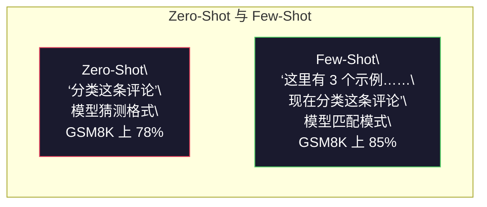
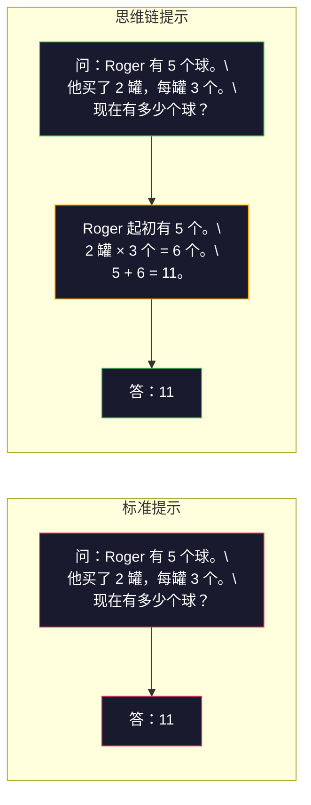
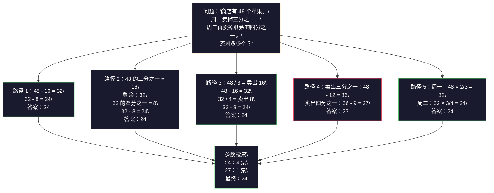
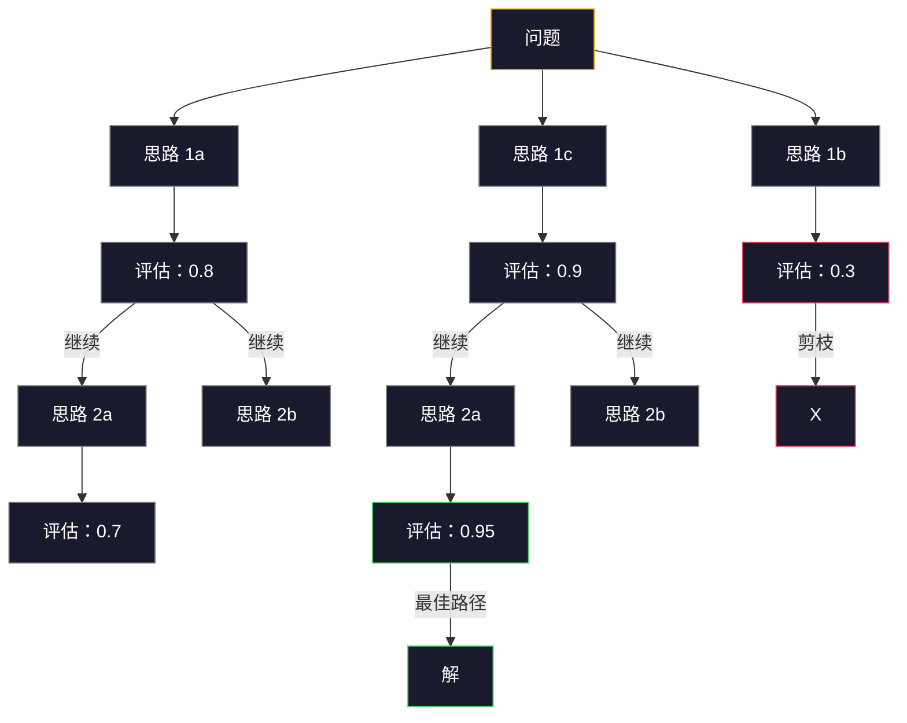

# Few-shot、思维链与思维树

> 告诉模型该做什么是提示；展示它如何思考才是工程。同一个模型、同一个任务、同一份数据，准确率从 78% 提高到 91%，原因在于推理策略发生了变化。

**类型：** 构建
**语言：** Python
**前置要求：** 第 11 阶段第 01 课（提示词工程）
**用时：** 约 45 分钟

## 学习目标

- 通过选择并格式化示例演示，实现能最大化任务准确率的 few-shot 提示
- 应用思维链（CoT）推理，提高数学应用题等多步问题的准确率
- 构建能够探索多条推理路径并选出最佳路径的思维树提示
- 在标准基准上测量 zero-shot、few-shot 与 CoT 带来的准确率提升

## 问题所在

你正在构建一个数学辅导应用。提示词写着：“解答这道应用题。”GPT-5 在标准小学数学基准 GSM8K 上有 94% 的正确率。你以为已经到顶了，其实没有——思维链仍然可以再增加 3–4 个百分点。

加上五个单词——“Let's think step by step”（请逐步思考）——准确率就会达到 91%。再加几个完整的演算示例，就能达到 95%。同一个模型、同样的温度、同样的 API 成本，差别只在于你给了模型一张草稿纸。

这反映了推理的工作方式。人类不会用一次心理跃迁解决多步问题，Transformer 也不会。当你迫使模型生成中间词元时，这些词元会成为下一个词元的上下文。每个推理步骤都会喂给下一步。模型确实是在一步步计算答案。

但“逐步思考”只是起点。还可以采样五条推理路径，再对最终答案投票；让模型探索一棵可能性树，评估并剪掉分支；或把推理与工具调用交错起来。这些方法已有测量结果，本课会逐一实现。

## 核心概念

### Zero-shot 与 Few-shot：示例何时胜过指令

Zero-shot 提示只给模型一个任务，不提供其他信息；few-shot 提示则先给它示例。

Wei 等人（2022）在 8 个基准上测量了这种差异。对于情感分类等简单任务，zero-shot 与 few-shot 的差距在 2% 以内；对于多步算术和符号推理等复杂任务，few-shot 能提高 10–25% 的准确率。

直觉上，示例是压缩后的指令。与其描述输出格式，不如直接展示格式；与其解释推理过程，不如演示推理过程。模型从示例中进行模式匹配，通常比解释抽象指令更可靠。



**Few-shot 占优的场景：** 对格式敏感的任务、分类、结构化抽取、领域专用术语，以及模型需要匹配特定模式的任何任务。

**Zero-shot 占优的场景：** 简单事实问答；示例会限制创造力的创意任务；以及寻找好示例比写清楚指令更困难的任务。

### 示例选择：相似胜过随机

并非所有示例都一样。在分类任务中，选择与目标输入相似的示例，比随机选择高出 5–15%（Liu 等，2022）。有三个原则：

1. **语义相似度**：选择嵌入空间中离输入最近的示例
2. **标签多样性**：让示例覆盖所有输出类别
3. **难度匹配**：让示例的复杂程度与目标问题相当

对大多数任务而言，最优示例数量是 3–5 个。少于 3 个，模型没有足够信号提取模式；多于 5 个，收益递减，还会浪费上下文窗口词元。对于标签很多的分类任务，每个标签使用一个示例。

### 思维链：给模型一张草稿纸

思维链（Chain-of-Thought，CoT）提示由 Google Brain 的 Wei 等人（2022）提出。思想很简单：不要只问模型答案，而是先让它展示推理步骤。



它为什么在机制上有效？Transformer 生成的每个词元都会成为下一个词元的上下文。没有 CoT，模型必须把所有推理压缩进一次前向传播的隐藏状态；有了 CoT，模型把中间计算外显为词元。每个推理词元都会延长有效计算深度。

**GSM8K 基准（小学数学，8500 道题）：**

| 模型 | Zero-Shot | Zero-Shot CoT | Few-Shot CoT |
|-------|-----------|---------------|--------------|
| GPT-4o | 78% | 91% | 95% |
| GPT-5 | 94% | 97% | 98% |
| o4-mini（推理模型） | 97% | — | — |
| Claude Opus 4.7 | 93% | 97% | 98% |
| Gemini 3 Pro | 92% | 96% | 98% |
| Llama 4 70B | 80% | 89% | 94% |
| DeepSeek-V3.1 | 89% | 94% | 96% |

**关于推理模型的说明。** OpenAI 的 o 系列（o3、o4-mini）和 DeepSeek-R1 会在输出答案前内部运行思维链。对推理模型再加“让我们一步一步思考”是多余的，有时还会适得其反——它们已经完成了这一步。

CoT 有两种形式：

**Zero-shot CoT**：在提示词末尾追加“Let's think step by step”。不需要示例。Kojima 等人（2022）证明，单独这一句话就能提高算术、常识和符号推理任务的准确率。

**Few-shot CoT**：提供包含推理步骤的示例。它比 zero-shot CoT 更有效，因为模型看到了你期望的确切推理格式。

**CoT 可能有害的场景：** 简单事实回忆（“法国首都是什么？”）、单步分类、以及速度比准确率更重要的任务。CoT 每次查询增加 50–200 个词元的推理开销。对于高吞吐、低复杂度任务，这是浪费的成本。

### 自洽性：多次采样，一次投票

Wang 等人（2023）提出了自洽性（self-consistency）。洞见是：单条 CoT 路径可能包含推理错误，但如果使用 temperature > 0 采样 N 条相互独立的推理路径，并对最终答案进行多数投票，错误就会相互抵消。



在原始 PaLM 540B 实验中，自洽性把 GSM8K 准确率从单条 CoT 的 56.5% 提高到 N=40 时的 74.4%。GPT-5 上的提升很小（97% 到 98%），因为基础准确率已经接近饱和。这项技术在基础 CoT 准确率为 60–85% 的模型上最有价值：此时单路径错误频繁，但还不是系统性错误。对于推理模型（o 系列、R1），自洽性已经包含在内部采样中。

代价是：N 条采样意味着 N 倍 API 成本和延迟。实践中 N=5 能获得大部分收益，N=3 是有意义投票的最低数量。对多数任务，N > 10 的收益开始递减。

### 思维树：分支探索

Yao 等人（2023）提出了思维树（Tree-of-Thought，ToT）。CoT 沿一条线性推理路径前进，而 ToT 会探索多个分支，在继续扩展之前评估哪些分支最有希望。



ToT 有三个组成部分：

1. **思路生成**：生成多个候选的下一步
2. **状态评估**：给每个候选打分（可以让 LLM 自己充当评估器）
3. **搜索算法**：在树中使用 BFS 或 DFS，剪掉低分支

在“24 点”任务（用 4 个数字进行算术运算得到 24）上，GPT-4 用标准提示解决率为 7.3%，用 CoT 反而降到 4.0%（因为搜索空间很宽），用 ToT 则达到 74%。

ToT 成本很高。树中的每个节点都需要一次 LLM 调用。分支因子为 3、深度为 3 的树，最多需要 39 次 LLM 调用。只在搜索空间大但可以评估的问题上使用它，例如规划、谜题求解，以及带约束的创意问题。

### ReAct：思考与行动

Yao 等人（2022）把推理轨迹与动作结合起来。模型在思考（生成推理）与行动（调用工具、搜索、计算）之间交替。


在知识密集型任务上，ReAct 胜过纯 CoT，因为它能用真实数据为推理提供依据。在 HotpotQA（多跳问答）上，GPT-4 的 ReAct 精确匹配率为 35.1%，而单独使用 CoT 为 29.4%。它真正强大的地方在于：观察会纠正推理错误，模型可以在执行过程中更新计划。

ReAct 是现代 AI 智能体的基础。每个智能体框架（LangChain、CrewAI、AutoGen）都实现了某种 Thought-Action-Observation 循环。第 14 阶段会构建完整智能体，本课聚焦提示模式。

### 结构化提示：XML 标签、分隔符、标题

提示词变复杂后，结构可以防止模型混淆不同区段。有三种做法：

**XML 标签**（Claude 上效果最好，在其他模型上也稳健）：
```text
<context>
You are reviewing a pull request.
The codebase uses TypeScript and React.
</context>

<task>
Review the following diff for bugs, security issues, and style violations.
</task>

<diff>
{diff_content}
</diff>

<output_format>
List each issue with: file, line, severity (critical/warning/info), description.
</output_format>
```

**Markdown 标题**（通用）：
```text
## Role
Senior security engineer at a fintech company.

## Task
Analyze this API endpoint for vulnerabilities.

## Input
{api_code}

## Rules
- Focus on OWASP Top 10
- Rate each finding: critical, high, medium, low
- Include remediation steps
```

**分隔符**（最小但有效）：
```text
---INPUT---
{user_text}
---END INPUT---

---INSTRUCTIONS---
Summarize the above in 3 bullet points.
---END INSTRUCTIONS---
```

### 提示链：顺序分解

有些任务对于单条提示词来说过于复杂。提示链把它拆成多个步骤，上一条提示词的输出成为下一条的输入。


提示链胜过单提示词有三个原因：

1. **每一步都更简单**：模型一次只处理一个聚焦任务，不必同时兼顾所有事情
2. **中间输出可检查**：你可以在步骤之间验证并纠正
3. **不同步骤可以使用不同模型**：抽取用便宜模型，推理用昂贵模型

### 性能比较

| 技术 | 最适合 | GSM8K 准确率（GPT-5） | API 调用 | 词元开销 | 复杂度 |
|-----------|----------|------------------------|-----------|----------------|------------|
| Zero-Shot | 简单任务 | 94% | 1 | 无 | 极低 |
| Few-Shot | 格式匹配 | 96% | 1 | 200–500 词元 | 低 |
| Zero-Shot CoT | 快速提升推理 | 97% | 1 | 50–200 词元 | 极低 |
| Few-Shot CoT | 单次调用的最高准确率 | 98% | 1 | 300–600 词元 | 低 |
| 自洽性（N=5） | 高风险推理 | 98.5% | 5 | 5 倍词元成本 | 中 |
| 推理模型（o4-mini） | 即插即用的 CoT 替代 | 97% | 1 | 隐藏（内部 2–10 倍） | 极低 |
| 思维树 | 搜索 / 规划问题 | N/A（24 点为 74%） | 10–40+ | 10–40 倍词元成本 | 高 |
| ReAct | 知识 grounding 推理 | N/A（HotpotQA 为 35.1%） | 3–10+ | 可变 | 高 |
| 提示链 | 复杂多步任务 | 96%（流水线） | 2–5 | 2–5 倍词元成本 | 中 |

正确技术取决于三个因素：准确率要求、延迟预算和成本容忍度。对大多数生产系统，带 3 个样本自洽性兜底的 few-shot CoT 可以覆盖 90% 的使用场景。

```figure
few-shot-curve
```

## 动手构建

我们要构建一个数学问题求解器，把 few-shot 提示、思维链推理和自洽性投票组合成一条流水线，然后为困难问题加入思维树。

完整实现见 `code/advanced_prompting.py`。下面是关键组件。

### 第 1 步：Few-shot 示例存储

第一个组件管理 few-shot 示例，并为给定问题选择最相关的示例。

```python
GSM8K_EXAMPLES = [
    {
        "question": "Janet's ducks lay 16 eggs per day. She eats three for breakfast every morning and bakes muffins for her friends every day with four. She sells every egg at the farmers' market for $2. How much does she make every day at the farmers' market?",
        "reasoning": "Janet's ducks lay 16 eggs per day. She eats 3 and bakes 4, using 3 + 4 = 7 eggs. So she has 16 - 7 = 9 eggs left. She sells each for $2, so she makes 9 * 2 = $18 per day.",
        "answer": "18"
    },
    ...
]
```

每个示例包含三个部分：问题、推理链和最终答案。推理链正是把普通 few-shot 示例变成 CoT few-shot 示例的部分。

### 第 2 步：思维链提示构建器

提示构建器把系统消息、带推理链的 few-shot 示例和目标问题组装为一条提示。

```python
def build_cot_prompt(question, examples, num_examples=3):
    system = (
        "You are a math problem solver. "
        "For each problem, show your step-by-step reasoning, "
        "then give the final numerical answer on the last line "
        "in the format: 'The answer is [number]'."
    )

    example_text = ""
    for ex in examples[:num_examples]:
        example_text += f"Q: {ex['question']}\n"
        example_text += f"A: {ex['reasoning']} The answer is {ex['answer']}.\n\n"

    user = f"{example_text}Q: {question}\nA:"
    return system, user
```

格式约束（“The answer is [number]”）至关重要。没有它，自洽性就无法从不同采样中提取并比较答案。

### 第 3 步：自洽性投票

采样 N 条推理路径，并选择多数答案。

```python
def self_consistency_solve(question, examples, client, model, n_samples=5):
    system, user = build_cot_prompt(question, examples)

    answers = []
    reasonings = []
    for _ in range(n_samples):
        response = client.chat.completions.create(
            model=model,
            messages=[
                {"role": "system", "content": system},
                {"role": "user", "content": user}
            ],
            temperature=0.7
        )
        text = response.choices[0].message.content
        reasonings.append(text)
        answer = extract_answer(text)
        if answer is not None:
            answers.append(answer)

    vote_counts = Counter(answers)
    best_answer = vote_counts.most_common(1)[0][0] if vote_counts else None
    confidence = vote_counts[best_answer] / len(answers) if best_answer else 0

    return best_answer, confidence, reasonings, vote_counts
```

temperature=0.7 很重要。若使用 temperature=0.0，N 次采样会完全相同，自洽性也就失去意义。你需要足够的随机性来产生多样化推理路径，但不能大到让模型输出乱码。

### 第 4 步：思维树求解器

对于线性推理无法解决的问题，ToT 会探索多种方法，并评估哪个方向最有希望。

```python
def tree_of_thought_solve(question, client, model, breadth=3, depth=3):
    thoughts = generate_initial_thoughts(question, client, model, breadth)
    scored = [(t, evaluate_thought(t, question, client, model)) for t in thoughts]
    scored.sort(key=lambda x: x[1], reverse=True)

    for current_depth in range(1, depth):
        next_thoughts = []
        for thought, score in scored[:2]:
            extensions = extend_thought(thought, question, client, model, breadth)
            for ext in extensions:
                ext_score = evaluate_thought(ext, question, client, model)
                next_thoughts.append((ext, ext_score))
        scored = sorted(next_thoughts, key=lambda x: x[1], reverse=True)

    best_thought = scored[0][0] if scored else ""
    return extract_answer(best_thought), best_thought
```

评估器本身也是一次 LLM 调用。你可以问模型：“在 0.0 到 1.0 的范围内，这条推理路径对解决问题有多大希望？”ToT 的关键在于让模型评估自己的部分解答。

### 第 5 步：完整流水线

用升级策略组合所有技术。

```python
def solve_with_escalation(question, examples, client, model):
    system, user = build_cot_prompt(question, examples)
    single_response = call_llm(client, model, system, user, temperature=0.0)
    single_answer = extract_answer(single_response)

    sc_answer, confidence, _, _ = self_consistency_solve(
        question, examples, client, model, n_samples=5
    )

    if confidence >= 0.8:
        return sc_answer, "self_consistency", confidence

    tot_answer, _ = tree_of_thought_solve(question, client, model)
    return tot_answer, "tree_of_thought", None
```

升级逻辑是：先尝试便宜的单次 CoT；如果自洽性置信度低于 0.8（5 个样本中少于 4 个一致），再升级到 ToT。这样可以平衡成本和准确率——大多数问题便宜地解决，困难问题得到更多计算量。

## 使用方法

### 模板驱动的 Few-shot 提示

LangChain 内置了提示模板和输出解析支持，可以简化 few-shot 与 CoT 模式：

```python
from langchain_core.prompts import FewShotPromptTemplate, PromptTemplate
from langchain_openai import ChatOpenAI

example_prompt = PromptTemplate(
    input_variables=["question", "reasoning", "answer"],
    template="Q: {question}\nA: {reasoning} The answer is {answer}."
)

few_shot_prompt = FewShotPromptTemplate(
    examples=examples,
    example_prompt=example_prompt,
    suffix="Q: {input}\nA: Let's think step by step.",
    input_variables=["input"]
)

llm = ChatOpenAI(model="gpt-4o", temperature=0.7)
chain = few_shot_prompt | llm
result = chain.invoke({"input": "If a train travels 120 km in 2 hours..."})
```

LangChain 还提供了用于语义相似度选择的 `ExampleSelector` 类：

```python
from langchain_core.example_selectors import SemanticSimilarityExampleSelector
from langchain_openai import OpenAIEmbeddings

selector = SemanticSimilarityExampleSelector.from_examples(
    examples,
    OpenAIEmbeddings(),
    k=3
)
```

### 编译后的提示

DSPy 把提示策略当作可优化模块。你无需手工制作 CoT 提示，而是定义签名，让 DSPy 优化提示：

```python
import dspy

dspy.configure(lm=dspy.LM("openai/gpt-4o", temperature=0.7))

class MathSolver(dspy.Module):
    def __init__(self):
        self.solve = dspy.ChainOfThought("question -> answer")

    def forward(self, question):
        return self.solve(question=question)

solver = MathSolver()
result = solver(question="Janet's ducks lay 16 eggs per day...")
```

DSPy 的 `ChainOfThought` 会自动添加推理轨迹。`dspy.majority` 实现自洽性：

```python
result = dspy.majority(
    [solver(question=q) for _ in range(5)],
    field="answer"
)
```

### 比较：从零实现与框架

| 特性 | 从零实现（本课） | LangChain | DSPy |
|---------|--------------------------|-----------|------|
| 提示格式控制 | 完全控制 | 基于模板 | 自动 |
| 自洽性 | 手工投票 | 手工 | 内置（`dspy.majority`） |
| 示例选择 | 自定义逻辑 | `ExampleSelector` | `dspy.BootstrapFewShot` |
| 思维树 | 自定义树搜索 | 社区链 | 未内置 |
| 提示优化 | 手工迭代 | 手工 | 自动编译 |
| 最适合 | 学习、自定义流水线 | 标准工作流 | 研究、优化 |

## 交付成果

本课产出两个工件。

**1. 推理链提示**（`outputs/prompt-reasoning-chain.md`）：可用于生产的 few-shot CoT + 自洽性提示模板。填入你的示例和问题领域即可使用。

**2. CoT 模式选择 Skill**（`outputs/skill-cot-patterns.md`）：根据任务类型、准确率要求和成本约束选择推理技术的决策框架。

## 练习

1. **测量差距**：取 10 道 GSM8K 题，分别使用 zero-shot、few-shot、zero-shot CoT 和 few-shot CoT 解答。记录每种方法的准确率。对你的模型而言，哪种技术提升最大？

2. **示例选择实验**：对同样的 10 道题，比较随机选择示例与手工挑选相似示例。测量准确率差异。示例质量在什么时候比示例数量更重要？

3. **自洽性成本曲线**：在 20 道 GSM8K 题上运行 N=1、3、5、7、10 的自洽性。绘制准确率与成本（总词元数）的关系。对你的模型而言，曲线的拐点在哪里？

4. **构建 ReAct 循环**：为流水线加入计算器工具。当模型生成数学表达式时，在沙箱中用 Python 的 `eval()` 执行，并把结果反馈给模型。测量工具 grounding 的推理是否胜过纯 CoT。

5. **用于创意任务的 ToT**：把思维树求解器改造成创意写作任务：“写一个既好笑又悲伤的六字故事。”让 LLM 充当评估器。分支探索是否比单次生成产出更好的创意内容？

## 关键术语

| 术语 | 人们常说 | 实际含义 |
|------|----------------|------|
| Few-shot 提示 | “给它几个例子” | 在提示词中加入输入–输出演示，固定模型的输出格式和行为 |
| 思维链 | “让它一步一步想” | 引出中间推理词元，在生成最终答案前扩展模型的有效计算过程 |
| 自洽性 | “多跑几次” | 在 temperature > 0 下采样 N 条多样化推理路径，再通过多数投票选出最常见的最终答案 |
| 思维树 | “让它探索选项” | 对推理分支进行结构化搜索，评估每个部分解，只扩展有希望的路径 |
| ReAct | “思考 + 工具使用” | 在 Thought–Action–Observation 循环中交错推理轨迹与外部动作（搜索、计算、API 调用） |
| 提示链 | “拆成几步” | 把复杂任务分解为顺序提示词，每一步输出都成为下一步输入 |
| Zero-shot CoT | “加一句逐步思考” | 不提供示例，只在提示词后追加推理触发语，依赖模型的潜在推理能力 |

## 延伸阅读

- [Chain-of-Thought Prompting Elicits Reasoning in Large Language Models](https://arxiv.org/abs/2201.11903) —— Wei 等，2022。Google Brain 的原始 CoT 论文；第 2–3 节介绍核心结果。
- [Self-Consistency Improves Chain of Thought Reasoning in Language Models](https://arxiv.org/abs/2203.11171) —— Wang 等，2023。自洽性论文；表 1 列出了需要的全部数字。
- [Tree of Thoughts: Deliberate Problem Solving with Large Language Models](https://arxiv.org/abs/2305.10601) —— Yao 等，2023。ToT 论文；第 4 节的 24 点结果最值得关注。
- [ReAct: Synergizing Reasoning and Acting in Language Models](https://arxiv.org/abs/2210.03629) —— Yao 等，2022。现代 AI 智能体的基础；第 3 节解释 Thought–Action–Observation 循环。
- [Large Language Models are Zero-Shot Reasoners](https://arxiv.org/abs/2205.11916) —— Kojima 等，2022。“Let's think step by step”论文；简单得出奇，却非常有效。
- [DSPy: Compiling Declarative Language Model Calls into Self-Improving Pipelines](https://arxiv.org/abs/2310.03714) —— Khattab 等，2023。把提示视为编译问题；如果想超越手工提示词工程，值得阅读。
- [OpenAI — Reasoning models guide](https://platform.openai.com/docs/guides/reasoning) —— 关于何时 CoT 变成内部、按词元计费的“推理”模式，何时仍只是提示层技巧的厂商指南。
- [Lightman et al., “Let's Verify Step by Step” (2023)](https://arxiv.org/abs/2305.20050) —— 逐步给推理链打分的过程奖励模型（PRM），是成功超越只奖励结果的推理监督信号。
- [Snell et al., “Scaling LLM Test-Time Compute Optimally” (2024)](https://arxiv.org/abs/2408.03314) —— 系统研究 CoT 长度、自洽性采样和 MCTS，说明当准确率比延迟更重要时，“逐步思考”会走向哪里。
