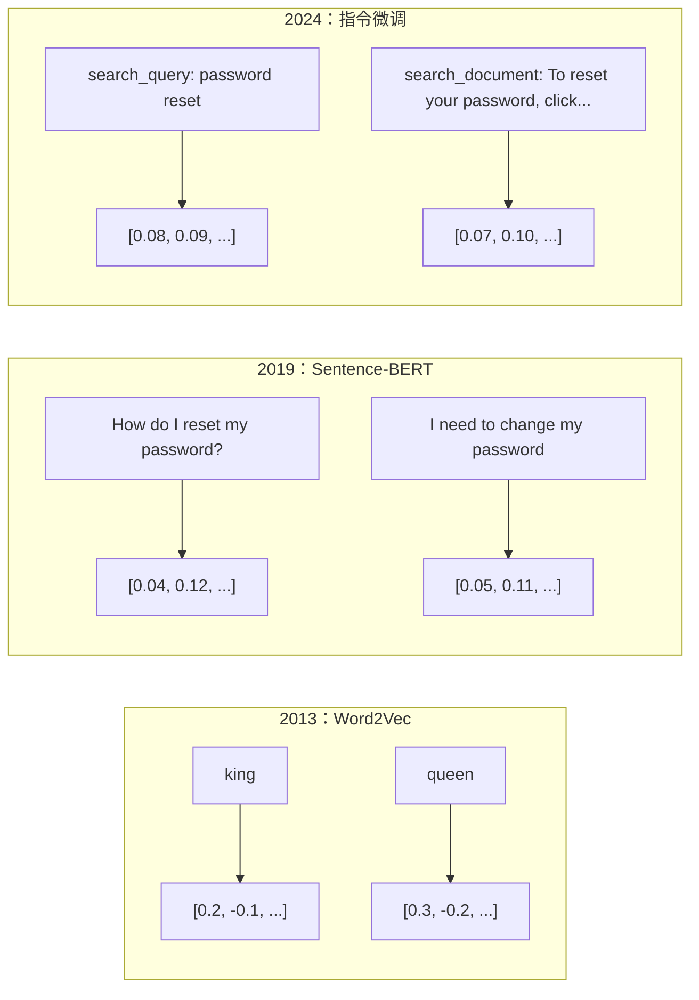
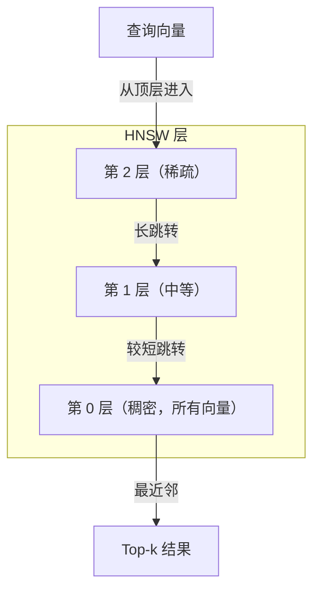

# 嵌入与向量表示

> 文本是离散的，数学是连续的。每当你让 LLM 查找“相似”文档、比较含义，或超越关键词进行搜索，你都在依赖连接这两个世界的桥梁。这座桥就是嵌入。如果你不理解嵌入，就不理解现代 AI，只是在使用它。

**类型：** 构建
**语言：** Python
**前置要求：** 第 11 阶段，第 01 课（提示词工程）
**用时：** 约 75 分钟
**相关课程：** 第 05 阶段 · 第 22 课（嵌入模型深入解析）讨论稠密、稀疏、多向量、Matryoshka 截断和按轴选择模型。本课聚焦生产流水线（向量数据库、HNSW、相似度数学）。选择模型前应先阅读第 05 阶段 · 第 22 课。

## 学习目标

- 使用 API 提供方和开源模型生成文本嵌入，并计算它们之间的余弦相似度
- 解释为什么嵌入能解决关键词搜索无法处理的词汇不匹配问题
- 构建按含义而非精确关键词匹配检索文档的语义搜索索引
- 使用检索基准（precision@k、recall）评估嵌入质量，为任务选择合适的嵌入模型

## 问题所在

你有 10,000 张客服工单。一位客户写道：“我的付款没成功。”你需要找出相似的历史工单。关键词搜索能找到包含“付款”和“没成功”的工单，却会漏掉“交易失败”“扣款被拒”和“账单错误”。这些工单描述的是完全相同的问题，却用了完全不同的词。

这称为词汇不匹配问题。人类语言有几十种表达同一件事的方式。关键词搜索把每个词当作没有含义的独立符号，不知道“被拒”和“没成功”指向同一个概念。

你需要一种文本表示，让含义而不是拼写决定相似度。你需要把“我的付款没成功”和“交易被拒”放在某个数学空间中彼此靠近，同时把“我的付款按时到账”推远，尽管它们共享“付款”这个词。

这种表示就是嵌入。

## 核心概念

### 什么是嵌入？

嵌入是表示文本含义的浮点数稠密向量。“稠密”很重要——每个维度都承载信息；而在词袋、TF-IDF 等稀疏表示中，大多数维度都是零。

“The cat sat on the mat”可能变成 `[0.023, -0.041, 0.087, ..., 0.012]`，具体是 768 到 3072 个数字，取决于模型。这些数字编码了含义。你不会直接检查它们，而是比较它们。

### Word2Vec 的突破

2013 年，Google 的 Tomas Mikolov 及其同事发表了 Word2Vec。Word2Vec 训练神经网络根据邻居预测一个词，或根据一个词预测其邻居；隐藏层权重因此形成有意义的向量表示。

著名结果是：

```text
king - man + woman = queen
```

词嵌入上的向量运算能够捕捉语义关系。“男人”到“女人”的方向，大致与“国王”到“王后”的方向相同。这是领域意识到几何结构可以编码含义的时刻。

Word2Vec 产生 300 维向量。每个词不论上下文都只有一个向量。“river bank”（河岸）里的 bank 和 “bank account”（银行账户）里的 bank 使用同一个嵌入。这个局限推动了之后十年的研究。

### 从词到句子

词嵌入表示单个词元，而生产系统需要嵌入完整的句子、段落或文档。后来出现了四种方法：

**平均**：取句子中所有词向量的均值。便宜、有损，但对短文本出奇地不错。它完全丢失词序，因此“dog bites man”和“man bites dog”会得到完全相同的嵌入。

**CLS 词元**：Transformer 模型（BERT，2018）输出一个特殊的 `[CLS]` 词元嵌入来表示整个输入。它比平均更好，但 `[CLS]` 词元训练目标是下一句预测，而不是相似度。

**对比学习**：明确训练模型把相似对推近，把不相似对推远。Sentence-BERT（Reimers 与 Gurevych，2019）采用这种方法，成为现代嵌入模型的基础。给定“如何重置密码？”和“我需要修改密码”，模型会学到它们应该有几乎相同的向量。

**指令微调嵌入**：最新方法。E5、GTE 等模型接受任务前缀（`search_query:`、`search_document:`），告诉模型要生成哪一类嵌入。这样一个模型就能服务多个任务。



### 现代嵌入模型

市场已经稳定在少数几种生产级选项上（截至 2026 年初，MTEB v2 的分数）：

| 模型 | 提供方 | 维度 | MTEB | 上下文 | 每 100 万词元成本 |
|-------|----------|------------|------|---------|------------------|
| Gemini Embedding 2 | Google | 3072（Matryoshka） | 67.7（检索） | 8192 | $0.15 |
| embed-v4 | Cohere | 1024（Matryoshka） | 65.2 | 128K | $0.12 |
| voyage-4 | Voyage AI | 1024/2048（Matryoshka） | 66.8 | 32K | $0.12 |
| text-embedding-3-large | OpenAI | 3072（Matryoshka） | 64.6 | 8192 | $0.13 |
| text-embedding-3-small | OpenAI | 1536（Matryoshka） | 62.3 | 8192 | $0.02 |
| BGE-M3 | BAAI | 1024（稠密+稀疏+ColBERT） | 63.0（多语言） | 8192 | 开放权重 |
| Qwen3-Embedding | 阿里巴巴 | 4096（Matryoshka） | 66.9 | 32K | 开放权重 |
| Nomic-embed-v2 | Nomic | 768（Matryoshka） | 63.1 | 8192 | 开放权重 |

MTEB（Massive Text Embedding Benchmark）v2 覆盖检索、分类、聚类、重排和摘要等 100 多项任务，分数越高越好。到 2026 年，开放权重模型（Qwen3-Embedding、BGE-M3）在大多数维度上已经能匹敌或超过闭源托管模型。Gemini Embedding 2 在纯检索上领先；Voyage/Cohere 在金融、法律、代码等特定领域领先。在做决定前，始终用自己的查询进行基准测试。

### 相似度指标

给定两个嵌入向量，有三种测量相似度的方法：

**余弦相似度**：两个向量夹角的余弦值，范围从 -1（相反）到 1（方向相同）。它忽略大小，只关心方向；一条 10 词的句子和一篇 500 词的文档，如果方向相同，得分也可以是 1.0。这是 90% 使用场景的默认指标。

```text
cosine_sim(a, b) = dot(a, b) / (||a|| * ||b||)
```

**点积**：两个向量的原始内积。当向量已归一化（单位长度）时，它与余弦相似度相同，计算更快。OpenAI 的嵌入已经归一化，所以点积和余弦会给出相同排名。

```text
dot(a, b) = sum(a_i * b_i)
```

**欧氏（L2）距离**：向量空间中的直线距离。距离越小越相似，对大小差异敏感。当空间中的绝对位置重要，而不只是方向时使用它。

```text
L2(a, b) = sqrt(sum((a_i - b_i)^2))
```

何时使用哪种：

| 指标 | 适用情况 | 应避免的情况 |
|------------|----------|------------|
| 余弦相似度 | 比较长度不同的文本；大多数检索任务 | 大小承载信息 |
| 点积 | 嵌入已经归一化；追求最大速度 | 向量大小各不相同 |
| 欧氏距离 | 聚类；空间最近邻问题 | 比较长度差异很大的文档 |

### 向量数据库与 HNSW

暴力相似度搜索会把查询与每一个存储向量比较。对于 100 万个、每个 1536 维的向量，每次查询需要 15 亿次乘加运算，太慢了。

向量数据库用近似最近邻（ANN）算法解决这个问题。主流算法是 HNSW（Hierarchical Navigable Small World，分层可导航小世界）：

1. 构建一个由向量组成的多层图
2. 顶层稀疏，连接远处簇之间的长距离节点
3. 底层稠密，连接相近向量之间的细粒度节点
4. 搜索从顶层开始，贪心地向下细化
5. 以 O(log n) 而不是 O(n) 的时间返回近似 top-k 结果

HNSW 用少量准确率损失（通常 95–99% 的召回率）换取巨大的速度提升。1000 万个向量的暴力搜索需要几秒，而 HNSW 只需几毫秒。



生产选项：

| 数据库 | 类型 | 最适合 | 最大规模 |
|----------|------|----------|-----------|
| Pinecone | 托管 SaaS | 无运维生产环境 | 数十亿 |
| Weaviate | 开源 | 自托管、混合搜索 | 1 亿以上 |
| Qdrant | 开源 | 高性能、过滤 | 1 亿以上 |
| ChromaDB | 嵌入式 | 原型、本地开发 | 100 万 |
| pgvector | Postgres 扩展 | 已使用 Postgres | 1000 万 |
| FAISS | 库 | 进程内、研究 | 10 亿以上 |

### 分块策略

文档太长，不能作为单一向量嵌入。一份 50 页的 PDF 覆盖几十个主题，其嵌入会变成所有内容的平均，反而与任何具体内容都不相似。因此要把文档切成块，分别嵌入每一块。

**固定大小分块**：每 N 个词元切分一次，并保留 M 个词元的重叠。简单、可预测，适合没有清晰结构的文档。512 词元的块、50 词元的重叠意味着第 1 块是词元 0–511，第 2 块是词元 462–973。

**按句子分块**：在句子边界切分，把句子分组直到达到词元限制。每一块至少包含一个完整句子。它比固定大小更好，因为不会把一个想法从中间切开。

**递归分块**：先尝试在最大边界（章节标题）切分；如果仍然太大，再尝试段落边界，然后是句子边界，最后是字符限制。这是 LangChain 的 `RecursiveCharacterTextSplitter` 方法，对混合格式语料效果很好。

**语义分块**：嵌入每个句子，然后把嵌入相似的连续句子分在一起。当嵌入相似度跌破阈值时，开始新的块。它很昂贵（需要逐句嵌入），但能产生最连贯的分块。

| 策略 | 复杂度 | 质量 | 最适合 |
|----------|------------|----------|-----------|
| 固定大小 | 低 | 尚可 | 非结构化文本、日志 |
| 按句子 | 低 | 好 | 文章、邮件 |
| 递归 | 中 | 好 | Markdown、HTML、混合文档 |
| 语义 | 高 | 最好 | 对检索质量要求极高的场景 |

对大多数系统而言，最佳区间是 256–512 词元的分块，并保留 50 词元的重叠。

### 双编码器与交叉编码器

双编码器分别嵌入查询和文档，再比较向量。它速度快：查询只需嵌入一次，文档嵌入可以预先计算。因此，检索阶段通常采用这种结构。

交叉编码器把查询和文档作为一个输入，输出相关性分数。它速度慢：每个查询–文档对都要通过完整模型处理，但准确率高得多，因为模型可以同时关注查询和文档词元。

生产模式是：双编码器检索 top-100 候选，交叉编码器把它们重排为 top-10，形成 retrieve-then-rerank 流水线。


重排模型包括：Cohere Rerank 3.5（每 1000 次查询 $2）、BGE-reranker-v2（免费、开源）、Jina Reranker v2（免费、开源）。

### Matryoshka 嵌入

传统嵌入是全有或全无的。1536 维向量就要使用 1536 个浮点数，不能不重新训练就截断到 256 维。

Matryoshka 表示学习（Kusupati 等，2022）解决了这个问题。模型经过训练，使前 N 个维度包含最重要的信息，就像俄罗斯套娃。把 1536 维的 Matryoshka 嵌入截断为 256 维会损失一些准确率，但仍然可用。

OpenAI 的 text-embedding-3-small 和 text-embedding-3-large 通过 `dimensions` 参数支持 Matryoshka 截断。请求 256 维而不是 1536 维，存储量减少 6 倍，而 MTEB 基准上的准确率大约只损失 3–5%。

### 二值量化

一个 1536 维、float32 类型的嵌入占用 6144 字节。乘以 1000 万份文档，仅向量就需要 61 GB。

二值量化把每个浮点数转换为一个 bit：正数变成 1，负数变成 0。存储量从 6144 字节降到 192 字节，减少 32 倍。相似度改用汉明距离（统计不同 bit 的数量），CPU 可以用一条指令完成。

检索召回率的准确率损失约为 5–10%。常见模式是：用二值量化在数百万向量上做第一轮搜索，再用全精度向量对 top-1000 重新评分。这样能以少 32 倍的内存获得全精度准确率的 95% 以上。

```figure
cosine-similarity
```

## 动手构建

我们要从零构建一个语义搜索引擎。不使用向量数据库，也不调用外部嵌入 API，只用 Python 和负责数学计算的 numpy。

### 第 1 步：文本分块

```python
def chunk_text(text, chunk_size=200, overlap=50):
    words = text.split()
    chunks = []
    start = 0
    while start < len(words):
        end = start + chunk_size
        chunk = " ".join(words[start:end])
        chunks.append(chunk)
        start += chunk_size - overlap
    return chunks


def chunk_by_sentences(text, max_chunk_tokens=200):
    sentences = text.replace("\n", " ").split(".")
    sentences = [s.strip() + "." for s in sentences if s.strip()]
    chunks = []
    current_chunk = []
    current_length = 0
    for sentence in sentences:
        sentence_length = len(sentence.split())
        if current_length + sentence_length > max_chunk_tokens and current_chunk:
            chunks.append(" ".join(current_chunk))
            current_chunk = []
            current_length = 0
        current_chunk.append(sentence)
        current_length += sentence_length
    if current_chunk:
        chunks.append(" ".join(current_chunk))
    return chunks
```

### 第 2 步：从零构建嵌入

我们用 L2 归一化的 TF-IDF 实现一个简单的稠密嵌入。这不是神经嵌入，但遵守同一个契约：输入文本，输出固定大小的向量，相似文本产生相似向量。

```python
import math
import numpy as np
from collections import Counter

class SimpleEmbedder:
    def __init__(self):
        self.vocab = []
        self.idf = []
        self.word_to_idx = {}

    def fit(self, documents):
        vocab_set = set()
        for doc in documents:
            vocab_set.update(doc.lower().split())
        self.vocab = sorted(vocab_set)
        self.word_to_idx = {w: i for i, w in enumerate(self.vocab)}
        n = len(documents)
        self.idf = np.zeros(len(self.vocab))
        for i, word in enumerate(self.vocab):
            doc_count = sum(1 for doc in documents if word in doc.lower().split())
            self.idf[i] = math.log((n + 1) / (doc_count + 1)) + 1

    def embed(self, text):
        words = text.lower().split()
        count = Counter(words)
        total = len(words) if words else 1
        vec = np.zeros(len(self.vocab))
        for word, freq in count.items():
            if word in self.word_to_idx:
                tf = freq / total
                vec[self.word_to_idx[word]] = tf * self.idf[self.word_to_idx[word]]
        norm = np.linalg.norm(vec)
        if norm > 0:
            vec = vec / norm
        return vec
```

### 第 3 步：相似度函数

```python
def cosine_similarity(a, b):
    dot = np.dot(a, b)
    norm_a = np.linalg.norm(a)
    norm_b = np.linalg.norm(b)
    if norm_a == 0 or norm_b == 0:
        return 0.0
    return float(dot / (norm_a * norm_b))


def dot_product(a, b):
    return float(np.dot(a, b))


def euclidean_distance(a, b):
    return float(np.linalg.norm(a - b))
```

### 第 4 步：使用暴力搜索的向量索引

```python
class VectorIndex:
    def __init__(self):
        self.vectors = []
        self.texts = []
        self.metadata = []

    def add(self, vector, text, meta=None):
        self.vectors.append(vector)
        self.texts.append(text)
        self.metadata.append(meta or {})

    def search(self, query_vector, top_k=5, metric="cosine"):
        scores = []
        for i, vec in enumerate(self.vectors):
            if metric == "cosine":
                score = cosine_similarity(query_vector, vec)
            elif metric == "dot":
                score = dot_product(query_vector, vec)
            elif metric == "euclidean":
                score = -euclidean_distance(query_vector, vec)
            else:
                raise ValueError(f"Unknown metric: {metric}")
            scores.append((i, score))
        scores.sort(key=lambda x: x[1], reverse=True)
        results = []
        for idx, score in scores[:top_k]:
            results.append({
                "text": self.texts[idx],
                "score": score,
                "metadata": self.metadata[idx],
                "index": idx
            })
        return results

    def size(self):
        return len(self.vectors)
```

### 第 5 步：语义搜索引擎

```python
class SemanticSearchEngine:
    def __init__(self, chunk_size=200, overlap=50):
        self.embedder = SimpleEmbedder()
        self.index = VectorIndex()
        self.chunk_size = chunk_size
        self.overlap = overlap

    def index_documents(self, documents, source_names=None):
        all_chunks = []
        all_sources = []
        for i, doc in enumerate(documents):
            chunks = chunk_text(doc, self.chunk_size, self.overlap)
            all_chunks.extend(chunks)
            name = source_names[i] if source_names else f"doc_{i}"
            all_sources.extend([name] * len(chunks))
        self.embedder.fit(all_chunks)
        for chunk, source in zip(all_chunks, all_sources):
            vec = self.embedder.embed(chunk)
            self.index.add(vec, chunk, {"source": source})
        return len(all_chunks)

    def search(self, query, top_k=5, metric="cosine"):
        query_vec = self.embedder.embed(query)
        return self.index.search(query_vec, top_k, metric)

    def search_with_scores(self, query, top_k=5):
        results = self.search(query, top_k)
        return [
            {
                "text": r["text"][:200],
                "source": r["metadata"].get("source", "unknown"),
                "score": round(r["score"], 4)
            }
            for r in results
        ]
```

### 第 6 步：比较相似度指标

```python
def compare_metrics(engine, query, top_k=3):
    results = {}
    for metric in ["cosine", "dot", "euclidean"]:
        hits = engine.search(query, top_k=top_k, metric=metric)
        results[metric] = [
            {"score": round(h["score"], 4), "preview": h["text"][:80]}
            for h in hits
        ]
    return results
```

## 使用方法

使用生产级嵌入 API 时，架构保持不变，只需替换 embedder：

```python
from openai import OpenAI

client = OpenAI()

def openai_embed(texts, model="text-embedding-3-small", dimensions=None):
    kwargs = {"model": model, "input": texts}
    if dimensions:
        kwargs["dimensions"] = dimensions
    response = client.embeddings.create(**kwargs)
    return [item.embedding for item in response.data]
```

使用 OpenAI 的 Matryoshka 截断——同一个模型、更少维度、更低存储：

```python
full = openai_embed(["semantic search query"], dimensions=1536)
compact = openai_embed(["semantic search query"], dimensions=256)
```

256 维向量的存储量少 6 倍。对 1000 万份文档，这意味着 10 GB，而不是 61 GB。在标准基准上，准确率损失约为 3–5%。

使用 Cohere 重排：

```python
import cohere

co = cohere.ClientV2()

results = co.rerank(
    model="rerank-v3.5",
    query="What is the refund policy?",
    documents=["Full refund within 30 days...", "No refunds after 90 days..."],
    top_n=3
)
```

不依赖 API 的本地嵌入：

```python
from sentence_transformers import SentenceTransformer

model = SentenceTransformer("BAAI/bge-small-en-v1.5")
embeddings = model.encode(["semantic search query", "another document"])
```

我们构建的 `VectorIndex` 可以与以上任何方案配合。替换嵌入函数，保留搜索逻辑即可。

## 交付成果

本课产出：

- `outputs/prompt-embedding-advisor.md` —— 为特定用例选择嵌入模型和策略的提示词
- `outputs/skill-embedding-patterns.md` —— 教智能体在生产环境使用嵌入的 Skill

## 练习

1. **指标比较**：使用余弦相似度、点积和欧氏距离，对样本文档运行相同的 5 个查询。记录每个指标的 top-3 结果。哪些查询的指标结果不一致？为什么？

2. **分块大小实验**：使用 50、100、200 和 500 词的分块大小索引样本文档。对每种设置运行 5 个查询，记录 top-1 相似度分数。绘制分块大小与检索质量的关系，找出更大分块开始造成伤害的点。

3. **Matryoshka 模拟**：构建一个生成 500 维向量的 SimpleEmbedder。截断到 50、100、200 和 500 维，测量每个截断点的检索召回率下降。这是在不需要真实训练技巧的情况下模拟 Matryoshka 行为。

4. **二值量化**：把搜索引擎中的嵌入转成二值（正数为 1，负数为 0），实现汉明距离搜索。将 top-10 结果与全精度余弦相似度比较，测量重合率。

5. **按句子分块**：用 `chunk_by_sentences` 替换固定大小分块。运行相同查询并比较检索分数。遵守句子边界是否改善结果？

## 关键术语

| 术语 | 人们常说 | 实际含义 |
|------|----------------|------|
| 嵌入 | “文本变数字” | 用几何邻近关系编码语义相似度的稠密向量 |
| Word2Vec | “元老级嵌入” | 2013 年通过预测上下文词学习词向量的模型，证明向量运算能编码含义 |
| 余弦相似度 | “两个向量有多像” | 向量夹角的余弦；1 = 方向相同，0 = 正交，-1 = 相反 |
| HNSW | “快速向量搜索” | 分层可导航小世界图，多层结构使 O(log n) 的近似最近邻搜索成为可能 |
| 双编码器 | “分别嵌入，快速比较” | 独立编码查询和文档为向量，支持预计算与快速检索 |
| 交叉编码器 | “慢但准确的重排器” | 将查询–文档对共同送入完整模型处理；准确率更高，但不能预计算 |
| Matryoshka 嵌入 | “可截断向量” | 训练模型使前 N 个维度包含最重要信息，从而支持可变大小存储 |
| 二值量化 | “1 bit 嵌入” | 把浮点向量转换为二值（只保留符号位），存储量减少 32 倍并用汉明距离搜索 |
| 分块 | “把文档切开做嵌入” | 把文档切成 256–512 词元的片段，分别嵌入和检索 |
| 向量数据库 | “嵌入的搜索引擎” | 优化存储向量，并在大规模场景执行近似最近邻搜索的数据存储 |
| 对比学习 | “通过比较训练” | 把相似对的嵌入推近、把不相似对的嵌入推远的训练方法 |
| MTEB | “嵌入基准” | Massive Text Embedding Benchmark；覆盖 8 类任务、56 个数据集的标准嵌入模型比较基准 |

## 延伸阅读

- Mikolov 等，“Efficient Estimation of Word Representations in Vector Space”（2013）——以国王–王后类比开启嵌入革命的 Word2Vec 论文
- Reimers 与 Gurevych，“Sentence-BERT: Sentence Embeddings using Siamese BERT-Networks”（2019）——训练句子级相似度双编码器的方法，现代嵌入模型的基础
- Kusupati 等，“Matryoshka Representation Learning”（2022）——可变维度嵌入的技术基础，OpenAI 在 text-embedding-3 中采用了它
- Malkov 与 Yashunin，“Efficient and Robust Approximate Nearest Neighbor using Hierarchical Navigable Small World Graphs”（2018）——HNSW 论文，多数生产向量搜索背后的算法
- OpenAI Embeddings Guide（platform.openai.com/docs/guides/embeddings）——text-embedding-3 模型的实践参考，包括 Matryoshka 降维
- MTEB Leaderboard（huggingface.co/spaces/mteb/leaderboard）——跨任务、跨语言比较嵌入模型的实时基准
- [Muennighoff et al., “MTEB: Massive Text Embedding Benchmark” (EACL 2023)](https://arxiv.org/abs/2210.07316) ——定义 8 类任务（分类、聚类、成对分类、重排、检索、STS、摘要、双语文本挖掘）的基准论文；不要盲信单个 MTEB 分数前应先阅读。
- [Sentence Transformers documentation](https://www.sbert.net/) ——双编码器与交叉编码器、池化策略，以及本课实现的 ingest–split–embed–store RAG 流水线的权威参考。
