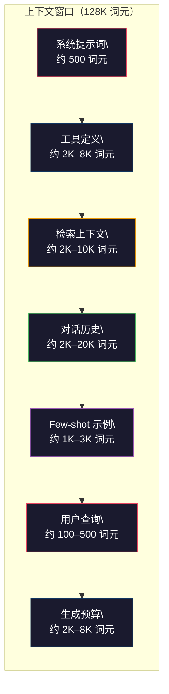
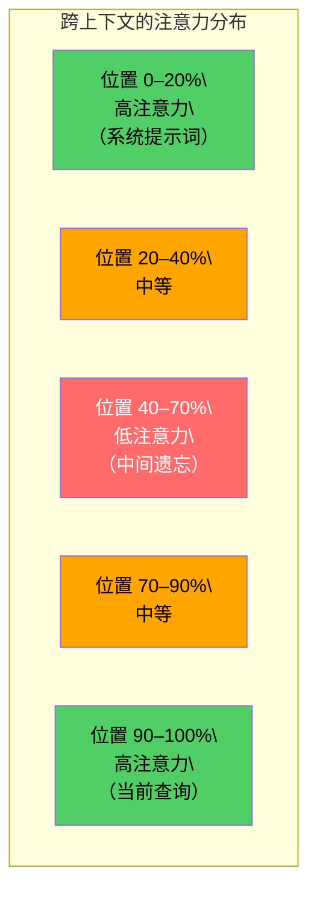
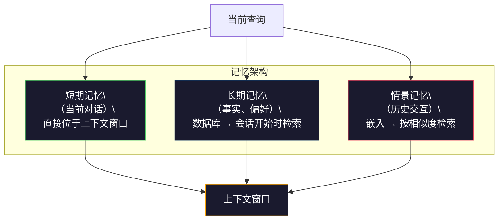

# 上下文工程：窗口、预算、记忆与检索

> 提示词工程只是子集，上下文工程处理进入模型窗口的全部内容。提示词是你输入的一段字符串；上下文还包括系统指令、检索文档、工具定义、对话历史和 few-shot 示例。上下文工程师决定放入哪些内容，以及排列顺序。

**类型：** 构建
**语言：** Python
**前置要求：** 第 10 阶段（从零构建 LLM）、第 11 阶段第 01–02 课
**用时：** 约 90 分钟
**相关课程：** 第 11 阶段 · 第 15 课（提示缓存）——适合缓存的布局是上下文工程的延伸；第 05 阶段 · 第 28 课（长上下文评估）——用 NIAH/RULER 测量“中间遗忘”。

## 学习目标

- 计算上下文窗口各组成部分的词元预算（系统提示词、工具、历史、检索文档、生成余量）
- 实现上下文窗口管理策略：对话历史的截断、摘要和滑动窗口
- 对上下文组件进行排序和优先级分配，让模型把注意力集中在最相关的信息上
- 构建上下文组装器，根据查询类型和可用窗口空间动态分配词元

## 问题所在

Claude Opus 4.7 有 200K 词元的窗口（beta 中为 1M），GPT-5 有 400K，Gemini 3 Pro 有 2M，Llama 4 声称有 10M。这些数字听起来很大，直到你真的把窗口填满。

下面是一个代码助手的真实拆分：系统提示词 500 词元；50 个工具的定义 8000 词元；检索文档 4000 词元；对话历史（10 轮）6000 词元；当前用户查询 200 词元；生成预算（最大输出）4000 词元。总计 22,700 词元，只占 128K 窗口的 18%。

但注意力并不会随着上下文长度线性扩展。一个包含 128K 词元的模型需要付出二次注意力成本（原生 Transformer 为 O(n²)，尽管大多数生产模型使用高效注意力变体）。更重要的是，检索准确率会下降。“大海捞针”测试显示，模型很难找到长上下文中间的信息。Liu 等人（2023）的研究表明，LLM 对长上下文开头和结尾的信息检索准确率接近完美，但位于中间（上下文 40–70% 位置）的信息准确率会下降 10–20%。这种“中间遗忘”因模型而异，但影响当前所有架构。

实际教训是：有 200K 词元可用，不等于使用 200K 词元就有效。精心筛选的 10K 词元上下文，往往胜过直接倾倒 100K 词元的上下文。上下文工程的任务，是最大化上下文窗口内的信噪比。

你放进窗口的每一个词元，都会挤掉一个本可以承载更相关信息的词元。每一个无关的工具定义、每一轮过时的对话、每一个没有回答问题的检索片段，都会让模型完成任务的能力稍微变差。

## 核心概念

### 上下文窗口是稀缺资源

把上下文窗口想成 RAM，而不是磁盘。它快速且可以直接访问，但容量有限。你不可能什么都装进去，必须做选择。



每个组件都在争夺空间。增加工具定义，就会减少对话历史的空间；增加检索上下文，就会减少 few-shot 示例的空间。上下文工程的艺术，是分配预算以最大化任务表现。

### 中间遗忘

上下文工程中最重要的实证发现是：模型对上下文开头和结尾的信息关注得更好，中间信息得到的注意力分数更低，更容易被忽略。

Liu 等人（2023）对它进行了系统测试。他们把一份相关文档放在 20 份无关文档之间的不同位置，并测量回答准确率。相关文档放在最前或最后时，准确率为 85–90%；放在中间（20 份文档中的第 10 份）时，准确率降至 60–70%。

这对工程有直接影响：

- 最重要的信息放在最前面（系统提示词、关键指令）
- 当前查询和最相关上下文放在最后（近因偏差有帮助）
- 把上下文中间视为最低优先级区域
- 如果必须把信息放在中间，就在末尾重复关键点



### 上下文组件

**系统提示词**：设置人设、约束和行为规则。它放在最前面，并在多轮中保持不变。Claude Code 的系统提示词（包括工具定义和行为指令）大约使用 6000 词元。要保持精简，因为系统提示词中的每个词都会在每次 API 调用中重复。

**工具定义**：每个工具增加 50–200 词元（名称、描述、参数模式）。50 个工具、每个 150 词元，在任何对话开始前就要占 7500 词元。动态工具选择——只加入与当前查询相关的工具——可以减少 60–80% 的开销。

**检索上下文**：来自向量数据库、搜索结果和文件内容的文档。回答质量直接由检索质量决定。糟糕的检索比没有检索更糟：它会用噪声填满窗口，主动误导模型。

**对话历史**：每条过去的用户消息和助手回答。随着对话长度线性增长。50 轮对话、每轮 200 词元，就是 10,000 词元的历史，其中大部分与当前查询无关。

**Few-shot 示例**：展示期望行为的输入/输出对。两个或三个精心选择的示例，往往比几千词元的指令更能改善输出质量，但它们也要占空间。

**生成预算**：为模型响应预留的词元。如果把窗口填满，模型就没有回答的空间。至少预留 2000–4000 词元。

### 上下文压缩策略

**历史摘要**：不要逐字保留所有历史对话，而是定期总结。“我们讨论了 X，决定了 Y，用户现在想做 Z”用 100 词元就能替代占用 2000 词元的 10 轮对话。当历史超过阈值（例如 5000 词元）时运行摘要。

**相关性过滤**：根据当前查询为每份检索文档打分，丢弃低于阈值的文档。如果检索了 10 个片段但只有 3 个相关，就丢掉另外 7 个。3 个高度相关的片段优于 10 个平庸片段。

**工具裁剪**：分类用户查询意图，只加入与该意图相关的工具。代码问题不需要日历工具，日程问题不需要文件系统工具。这样可以把工具定义从 8000 词元减到 1000。

**递归摘要**：对于很长的文档分阶段摘要，先摘要每个章节，再摘要这些摘要。一份 50 页文档可以变成保留关键点的 500 词元摘要。

### 记忆系统

上下文工程覆盖三个时间尺度。

**短期记忆**：当前对话，直接存放在上下文窗口中，随着每轮对话增长，通过摘要和截断管理。

**长期记忆**：跨对话持续存在的事实和偏好，例如“用户喜欢 TypeScript”“项目使用 PostgreSQL”。它存储在数据库中，并在会话开始时检索。Claude Code 把它存储在 CLAUDE.md 文件中，ChatGPT 则存储在记忆功能中。

**情景记忆**：可能相关的特定历史交互，例如“上周二，我们调试过 auth 模块中的类似问题”。它以嵌入形式存储，当当前对话与某个历史情景匹配时检索出来。



### 动态上下文组装

不同查询需要不同上下文。静态系统提示词、工具和历史会浪费上下文预算；系统应针对每次查询动态组装上下文。

1. 分类查询意图
2. 选择相关工具（不是所有工具）
3. 检索相关文档（不是固定集合）
4. 加入相关历史轮次（不是全部历史）
5. 加入匹配任务类型的 few-shot 示例
6. 按重要性排序：关键内容放最前，重要内容放最后，可选内容放中间

这正是优秀 AI 应用与卓越 AI 应用的区别。模型相同，上下文才是差异化所在。

```figure
lost-in-the-middle
```

## 动手构建

### 第 1 步：词元计数器

无法测量，就无法做预算。构建一个简单的词元计数器（使用按空白切分的近似值，因为精确数量取决于分词器）。

```python
import json
import numpy as np
from collections import OrderedDict

def count_tokens(text):
    if not text:
        return 0
    return int(len(text.split()) * 1.3)

def count_tokens_json(obj):
    return count_tokens(json.dumps(obj))
```

### 第 2 步：上下文预算管理器

核心抽象。预算管理器追踪每个组件使用的词元数，并强制执行限制。

```python
class ContextBudget:
    def __init__(self, max_tokens=128000, generation_reserve=4000):
        self.max_tokens = max_tokens
        self.generation_reserve = generation_reserve
        self.available = max_tokens - generation_reserve
        self.allocations = OrderedDict()

    def allocate(self, component, content, max_tokens=None):
        tokens = count_tokens(content)
        if max_tokens and tokens > max_tokens:
            words = content.split()
            target_words = int(max_tokens / 1.3)
            content = " ".join(words[:target_words])
            tokens = count_tokens(content)

        used = sum(self.allocations.values())
        if used + tokens > self.available:
            allowed = self.available - used
            if allowed <= 0:
                return None, 0
            words = content.split()
            target_words = int(allowed / 1.3)
            content = " ".join(words[:target_words])
            tokens = count_tokens(content)

        self.allocations[component] = tokens
        return content, tokens

    def remaining(self):
        used = sum(self.allocations.values())
        return self.available - used

    def utilization(self):
        used = sum(self.allocations.values())
        return used / self.max_tokens

    def report(self):
        total_used = sum(self.allocations.values())
        lines = []
        lines.append(f"Context Budget Report ({self.max_tokens:,} token window)")
        lines.append("-" * 50)
        for component, tokens in self.allocations.items():
            pct = tokens / self.max_tokens * 100
            bar = "#" * int(pct / 2)
            lines.append(f"  {component:<25} {tokens:>6} tokens ({pct:>5.1f}%) {bar}")
        lines.append("-" * 50)
        lines.append(f"  {'Used':<25} {total_used:>6} tokens ({total_used/self.max_tokens*100:.1f}%)")
        lines.append(f"  {'Generation reserve':<25} {self.generation_reserve:>6} tokens")
        lines.append(f"  {'Remaining':<25} {self.remaining():>6} tokens")
        return "\n".join(lines)
```

### 第 3 步：中间遗忘重排

实现重排策略：最重要的项目放在开头和结尾，最不重要的放在中间。

```python
def reorder_lost_in_middle(items, scores):
    paired = sorted(zip(scores, items), reverse=True)
    sorted_items = [item for _, item in paired]

    if len(sorted_items) <= 2:
        return sorted_items

    first_half = sorted_items[::2]
    second_half = sorted_items[1::2]
    second_half.reverse()

    return first_half + second_half

def score_relevance(query, documents):
    query_words = set(query.lower().split())
    scores = []
    for doc in documents:
        doc_words = set(doc.lower().split())
        if not query_words:
            scores.append(0.0)
            continue
        overlap = len(query_words & doc_words) / len(query_words)
        scores.append(round(overlap, 3))
    return scores
```

### 第 4 步：对话历史压缩器

总结旧的对话轮次，回收词元预算。

```python
class ConversationManager:
    def __init__(self, max_history_tokens=5000):
        self.turns = []
        self.summaries = []
        self.max_history_tokens = max_history_tokens

    def add_turn(self, role, content):
        self.turns.append({"role": role, "content": content})
        self._compress_if_needed()

    def _compress_if_needed(self):
        total = sum(count_tokens(t["content"]) for t in self.turns)
        if total <= self.max_history_tokens:
            return

        while total > self.max_history_tokens and len(self.turns) > 4:
            old_turns = self.turns[:2]
            summary = self._summarize_turns(old_turns)
            self.summaries.append(summary)
            self.turns = self.turns[2:]
            total = sum(count_tokens(t["content"]) for t in self.turns)

    def _summarize_turns(self, turns):
        parts = []
        for t in turns:
            content = t["content"]
            if len(content) > 100:
                content = content[:100] + "..."
            parts.append(f"{t['role']}: {content}")
        return "Previous: " + " | ".join(parts)

    def get_context(self):
        parts = []
        if self.summaries:
            parts.append("[Conversation Summary]")
            for s in self.summaries:
                parts.append(s)
        parts.append("[Recent Conversation]")
        for t in self.turns:
            parts.append(f"{t['role']}: {t['content']}")
        return "\n".join(parts)

    def token_count(self):
        return count_tokens(self.get_context())
```

### 第 5 步：动态工具选择器

只加入与当前查询相关的工具。先分类意图，再过滤工具。

```python
TOOL_REGISTRY = {
    "read_file": {
        "description": "Read contents of a file",
        "tokens": 120,
        "categories": ["code", "files"],
    },
    "write_file": {
        "description": "Write content to a file",
        "tokens": 150,
        "categories": ["code", "files"],
    },
    "search_code": {
        "description": "Search for patterns in codebase",
        "tokens": 130,
        "categories": ["code"],
    },
    "run_command": {
        "description": "Execute a shell command",
        "tokens": 140,
        "categories": ["code", "system"],
    },
    "create_calendar_event": {
        "description": "Create a new calendar event",
        "tokens": 180,
        "categories": ["calendar"],
    },
    "list_emails": {
        "description": "List recent emails",
        "tokens": 160,
        "categories": ["email"],
    },
    "send_email": {
        "description": "Send an email message",
        "tokens": 200,
        "categories": ["email"],
    },
    "web_search": {
        "description": "Search the web for information",
        "tokens": 140,
        "categories": ["research"],
    },
    "query_database": {
        "description": "Run a SQL query on the database",
        "tokens": 170,
        "categories": ["code", "data"],
    },
    "generate_chart": {
        "description": "Generate a chart from data",
        "tokens": 190,
        "categories": ["data", "visualization"],
    },
}

def classify_intent(query):
    query_lower = query.lower()

    intent_keywords = {
        "code": ["code", "function", "bug", "error", "file", "implement", "refactor", "debug", "test"],
        "calendar": ["meeting", "schedule", "calendar", "appointment", "event"],
        "email": ["email", "mail", "send", "inbox", "message"],
        "research": ["search", "find", "what is", "how does", "explain", "look up"],
        "data": ["data", "query", "database", "chart", "graph", "analytics", "sql"],
    }

    scores = {}
    for intent, keywords in intent_keywords.items():
        score = sum(1 for kw in keywords if kw in query_lower)
        if score > 0:
            scores[intent] = score

    if not scores:
        return ["code"]

    max_score = max(scores.values())
    return [intent for intent, score in scores.items() if score >= max_score * 0.5]

def select_tools(query, token_budget=2000):
    intents = classify_intent(query)
    relevant = {}
    total_tokens = 0

    for name, tool in TOOL_REGISTRY.items():
        if any(cat in intents for cat in tool["categories"]):
            if total_tokens + tool["tokens"] <= token_budget:
                relevant[name] = tool
                total_tokens += tool["tokens"]

    return relevant, total_tokens
```

### 第 6 步：完整上下文组装流水线

把所有部分连接起来。给定查询，动态组装最优上下文。

```python
class ContextEngine:
    def __init__(self, max_tokens=128000, generation_reserve=4000):
        self.budget = ContextBudget(max_tokens, generation_reserve)
        self.conversation = ConversationManager(max_history_tokens=5000)
        self.system_prompt = (
            "You are a helpful AI assistant. You have access to tools for "
            "code editing, file management, web search, and data analysis. "
            "Use the appropriate tools for each task. Be concise and accurate."
        )
        self.knowledge_base = [
            "Python 3.12 introduced type parameter syntax for generic classes using bracket notation.",
            "The project uses PostgreSQL 16 with pgvector for embedding storage.",
            "Authentication is handled by Supabase Auth with JWT tokens.",
            "The frontend is built with Next.js 15 using the App Router.",
            "API rate limits are set to 100 requests per minute per user.",
            "The deployment pipeline uses GitHub Actions with Docker multi-stage builds.",
            "Test coverage must be above 80% for all new modules.",
            "The codebase follows the repository pattern for data access.",
        ]

    def assemble(self, query):
        self.budget = ContextBudget(self.budget.max_tokens, self.budget.generation_reserve)

        system_content, _ = self.budget.allocate("system_prompt", self.system_prompt, max_tokens=1000)

        tools, tool_tokens = select_tools(query, token_budget=2000)
        tool_text = json.dumps(list(tools.keys()))
        tool_content, _ = self.budget.allocate("tools", tool_text, max_tokens=2000)

        relevance = score_relevance(query, self.knowledge_base)
        threshold = 0.1
        relevant_docs = [
            doc for doc, score in zip(self.knowledge_base, relevance)
            if score >= threshold
        ]

        if relevant_docs:
            doc_scores = [s for s in relevance if s >= threshold]
            reordered = reorder_lost_in_middle(relevant_docs, doc_scores)
            doc_text = "\n".join(reordered)
            doc_content, _ = self.budget.allocate("retrieved_context", doc_text, max_tokens=3000)

        history_text = self.conversation.get_context()
        if history_text.strip():
            history_content, _ = self.budget.allocate("conversation_history", history_text, max_tokens=5000)

        query_content, _ = self.budget.allocate("user_query", query, max_tokens=500)

        return self.budget

    def chat(self, query):
        self.conversation.add_turn("user", query)
        budget = self.assemble(query)
        response = f"[Response to: {query[:50]}...]"
        self.conversation.add_turn("assistant", response)
        return budget


def run_demo():
    print("=" * 60)
    print("  Context Engineering Pipeline Demo")
    print("=" * 60)

    engine = ContextEngine(max_tokens=128000, generation_reserve=4000)

    print("\n--- Query 1: Code task ---")
    budget = engine.chat("Fix the bug in the authentication module where JWT tokens expire too early")
    print(budget.report())

    print("\n--- Query 2: Research task ---")
    budget = engine.chat("What is the best approach for implementing vector search in PostgreSQL?")
    print(budget.report())

    print("\n--- Query 3: After conversation history builds up ---")
    for i in range(8):
        engine.conversation.add_turn("user", f"Follow-up question number {i+1} about the implementation details of the system")
        engine.conversation.add_turn("assistant", f"Here is the response to follow-up {i+1} with technical details about the architecture")

    budget = engine.chat("Now implement the changes we discussed")
    print(budget.report())

    print("\n--- Tool Selection Examples ---")
    test_queries = [
        "Fix the bug in auth.py",
        "Schedule a meeting with the team for Tuesday",
        "Show me the database query performance stats",
        "Search for best practices on error handling",
    ]

    for q in test_queries:
        tools, tokens = select_tools(q)
        intents = classify_intent(q)
        print(f"\n  Query: {q}")
        print(f"  Intents: {intents}")
        print(f"  Tools: {list(tools.keys())} ({tokens} tokens)")

    print("\n--- Lost-in-the-Middle Reordering ---")
    docs = ["Doc A (most relevant)", "Doc B (somewhat relevant)", "Doc C (least relevant)",
            "Doc D (relevant)", "Doc E (moderately relevant)"]
    scores = [0.95, 0.60, 0.20, 0.80, 0.50]
    reordered = reorder_lost_in_middle(docs, scores)
    print(f"  Original order: {docs}")
    print(f"  Scores:         {scores}")
    print(f"  Reordered:      {reordered}")
    print(f"  (Most relevant at start and end, least relevant in middle)")
```

## 使用方法

### 由 Harness 管理的上下文

Claude Code 使用分层方式管理上下文。系统提示词包含行为规则和工具定义（约 6000 词元）。打开文件时，文件内容会注入上下文；搜索时，结果会加入上下文；旧对话轮次会被总结；CLAUDE.md 提供跨会话持续的长期记忆。

Claude Code 不会把整个代码库倾倒进上下文，而是在需要时检索相关文件。这体现了上下文工程的实践。

### 动态加载上下文

Cursor 把整个代码库索引为嵌入。当你输入查询时，它通过向量相似度检索最相关的文件和代码块，只有这些片段进入上下文窗口。一个 50 万行的代码库被压缩为最相关的 5–10 个代码块。

模式就是：把所有内容嵌入，按需检索，只加入重要内容。

### 助手长期记忆

ChatGPT 把用户偏好和事实存储为长期记忆。每次对话开始时，相关记忆会被检索并加入系统提示词。“用户偏好 Python”只占 5 个词元，却能避免在不同对话中重复数百词元的指令。

### RAG 作为上下文工程

检索增强生成（RAG）把上下文工程落实为一条查询时流水线。知识可以保留在模型权重和系统提示词之外，查询到来时再检索相关文档并注入上下文窗口。完整的 RAG 流水线——分块、嵌入、检索、重排——都在解决同一个问题：把正确的信息放入上下文窗口。

## 交付成果

本课产出 `outputs/prompt-context-optimizer.md` —— 一个可复用的提示词，审计上下文组装策略并提出优化建议。把系统提示词、工具数量、平均历史长度和检索策略交给它，它会找出词元浪费并提出改进。

同时产出 `outputs/skill-context-engineering.md` —— 根据任务类型、上下文窗口大小和延迟预算设计上下文组装流水线的决策框架。

## 练习

1. 给 `ContextBudget` 增加“词元浪费检测器”。它应标记占预算超过 30% 的组件，并针对组件类型提出压缩策略（总结历史、裁剪工具、重排文档）。

2. 为检索上下文实现语义去重。如果两份检索文档的相似度超过 80%（通过词重叠或嵌入余弦相似度计算），只保留分数更高的那一份。测量这样回收了多少词元预算。

3. 构建“上下文回放”工具。给定一份对话记录，逐轮通过 ContextEngine 回放，并可视化预算分配如何变化。绘制随时间变化的每组件词元使用量，找出上下文开始压缩的轮次。

4. 实现基于优先级的工具选择器。不要二元地包含/排除工具，而是给每个工具分配与当前查询的相关性分数，按相关性降序加入，直到工具预算耗尽。比较纳入 5、10、20 和 50 个工具时的任务表现。

5. 构建多策略上下文压缩器。实现三种压缩策略（截断、摘要、提取关键句），在 20 份文档上做基准。测量压缩率与信息保留之间的权衡：压缩版本是否仍包含查询答案？

## 关键术语

| 术语 | 人们常说 | 实际含义 |
|------|----------------|------|
| 上下文窗口 | “模型能读多少” | 模型一次前向传播处理的最大词元数（输入 + 输出）；GPT-5 为 400K，Claude Opus 4.7 为 200K（beta 1M），Gemini 3 Pro 为 2M |
| 上下文工程 | “高级提示词工程” | 决定什么进入上下文窗口、以什么顺序和优先级进入的学科，涵盖检索、压缩、工具选择和记忆管理 |
| 中间遗忘 | “模型忘了中间内容” | LLM 对上下文开头和结尾关注更好；位于中间的信息准确率会下降 10–20% 的实证发现 |
| 词元预算 | “还剩多少词元” | 在上下文窗口各组件之间显式分配容量（系统提示词、工具、历史、检索、生成），并设定每组件限制 |
| 动态上下文 | “按需加载内容” | 根据意图分类、相关工具选择和检索结果，为每个查询以不同方式组装上下文窗口 |
| 历史摘要 | “压缩对话” | 用简短摘要替换逐字保留的旧对话轮次，减少词元成本同时保留关键信息 |
| 工具裁剪 | “只放相关工具” | 分类查询意图，只加入匹配工具定义，减少 60–80% 的工具词元成本 |
| 长期记忆 | “跨会话记住” | 存储在数据库并在会话开始检索的事实与偏好，如 CLAUDE.md、ChatGPT Memory 等系统 |
| 情景记忆 | “记住特定过去事件” | 以嵌入形式存储历史交互，在当前查询与过去对话相似时检索 |
| 生成预算 | “给答案留空间” | 为模型输出预留的词元；若上下文完全填满，模型就没有回答空间 |

## 延伸阅读

- [Liu et al., 2023 —— “Lost in the Middle: How Language Models Use Long Contexts”](https://arxiv.org/abs/2307.03172) —— 关于位置相关注意力的权威研究，展示模型难以使用长上下文中间的信息
- [Anthropic's Contextual Retrieval blog post](https://www.anthropic.com/news/contextual-retrieval) —— Anthropic 如何处理上下文感知的分块检索，将检索失败减少 49%
- [Simon Willison's “Context Engineering”](https://simonwillison.net/2025/Jun/27/context-engineering/) —— 命名这一学科、区分它与提示词工程的博客文章
- [LangChain documentation on RAG](https://python.langchain.com/docs/tutorials/rag/) —— 把检索增强生成作为上下文工程模式的实践实现
- [Greg Kamradt's Needle in a Haystack test](https://github.com/gkamradt/LLMTest_NeedleInAHaystack) —— 揭示所有主要模型位置相关检索失败的基准
- [Pope et al., “Efficiently Scaling Transformer Inference” (2022)](https://arxiv.org/abs/2211.05102) —— 上下文长度为何驱动内存和延迟，以及 KV cache、MQA、GQA 如何改变预算计算
- [Agrawal et al., “SARATHI: Efficient LLM Inference by Piggybacking Decodes with Chunked Prefills” (2023)](https://arxiv.org/abs/2308.16369) —— 解释让长提示在 TTFT 上昂贵、在 TPOT 上便宜的推理两个阶段，是上下文打包权衡的依据
- [Ainslie et al., “GQA: Training Generalized Multi-Query Transformer Models from Multi-Head Checkpoints” (EMNLP 2023)](https://arxiv.org/abs/2305.13245) —— 在不损失质量的情况下把生产解码器 KV 内存减少 8 倍的分组查询注意力论文
