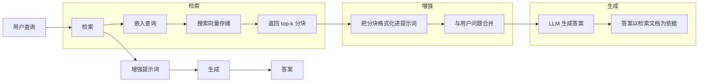
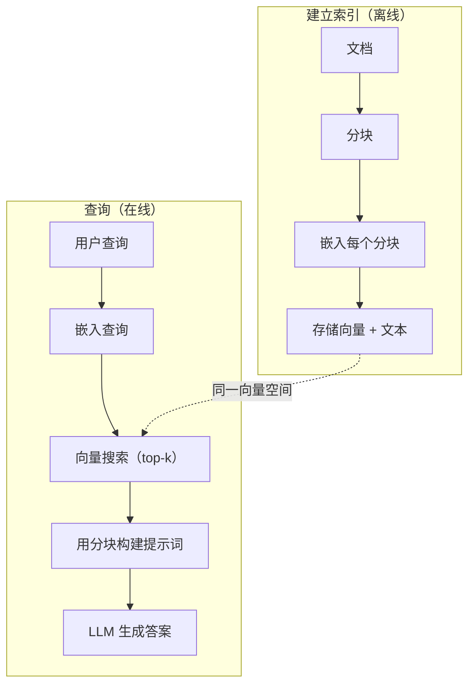

# RAG（检索增强生成）

> 你的 LLM 知道训练截止日期之前的一切，却不知道公司文档、代码库或上周的会议记录。RAG 通过检索相关文档，把它们放进提示词来解决这个问题。它是生产 AI 中部署最广泛的模式。如果要从本课程构建一个东西，就构建 RAG 流水线。

**类型：** 构建
**语言：** Python
**前置要求：** 第 10 阶段（从零构建 LLM）、第 11 阶段第 01–05 课
**用时：** 约 90 分钟
**相关课程：** 第 05 阶段 · 第 23 课（RAG 分块策略）介绍六种分块算法及各自适用场景；第 05 阶段 · 第 22 课（嵌入模型深入解析）讨论如何选择嵌入器；第 11 阶段 · 第 07 课（高级 RAG）讨论混合搜索、重排和查询变换。

## 学习目标

- 构建完整的 RAG 流水线：文档加载、分块、嵌入、向量存储、检索和生成
- 使用向量数据库（ChromaDB、FAISS 或 Pinecone）并正确建立索引，实现语义搜索
- 从成本、新鲜度和可归因性角度解释知识 grounding 应用为什么偏好 RAG 而不是微调
- 使用检索指标（精确率、召回率）和生成指标（忠实度、相关性）评估 RAG 质量

## 问题所在

你为公司构建了一个聊天机器人。一位客户问：“企业版套餐的退款政策是什么？”LLM 给出关于常见 SaaS 退款政策的泛化回答。实际政策埋在一份 200 页的内部 wiki 中：企业客户有 60 天期限，并按比例退款。LLM 从未见过这份文档，不可能知道训练数据之外的内容。

微调是一种解决方案：用内部文档训练 LLM，再部署更新后的模型。它确实有效，但有严重问题。微调的计算成本可能达到数千美元；文档一变化，模型就过时；你没有办法知道模型回答依据了哪个来源；如果公司下个月收购另一条产品线，就要再次微调。

RAG 是另一种解决方案。保持模型不变。问题到来时，在文档存储中搜索相关片段，把它们放到问题前的提示词里，让模型根据这些片段作为上下文作答。文档存储可以在几分钟内更新，也能准确看到检索了哪些文档。模型本身完全不变。因此，RAG 成为生产环境的主流模式：成本更低、内容更新、更容易审计，而且适用于任何 LLM。

## 核心概念

### RAG 模式

完整模式可以归纳为四步：



查询 → 检索 → 增强提示词 → 生成。每个 RAG 系统都遵循这个模式。生产 RAG 之间的差别，在于每一步的细节：如何分块、如何嵌入、如何搜索，以及如何构造提示词。

### 为什么 RAG 胜过微调

| 关注点 | 微调 | RAG |
|---------|------------|-----|
| 成本 | 每次训练运行 $1,000–$100,000 以上 | 每次查询 $0.01–$0.10（嵌入 + LLM） |
| 新鲜度 | 重新训练前都会过时 | 重新索引文档后几分钟内更新 |
| 可审计性 | 无法追溯回答来源 | 可以展示精确检索片段 |
| 幻觉 | 仍然可以自由幻觉 | 以检索文档为依据 |
| 数据隐私 | 训练数据写入权重 | 文档保留在你的向量存储中 |

微调永久改变模型权重，RAG 临时改变模型上下文。对大多数应用而言，你需要的是临时上下文。

微调胜出的唯一场景，是你需要模型采用特定风格、语气或推理模式，而单靠提示词无法实现。对于事实知识检索，RAG 总是更合适。

### 嵌入模型

嵌入模型把文本转换为稠密向量。在高维空间中，相似文本产生彼此接近的向量。“如何重置密码？”和“我需要修改密码”虽然共享的词很少，却会产生几乎相同的向量；“猫坐在垫子上”则会产生完全不同的向量。

常见嵌入模型（2026 年阵容——完整分析见第 05 阶段 · 第 22 课）：

| 模型 | 维度 | 提供方 | 说明 |
|-------|-----------|----------|-------|
| text-embedding-3-small | 1536（Matryoshka） | OpenAI | 大多数用例中性价比最好 |
| text-embedding-3-large | 3072（Matryoshka） | OpenAI | 准确率更高，可截断为 256/512/1024 |
| Gemini Embedding 2 | 3072（Matryoshka） | Google | MTEB 检索领先；8K 上下文 |
| voyage-4 | 1024/2048（Matryoshka） | Voyage AI | 有代码、金融、法律等领域变体 |
| Cohere embed-v4 | 1024（Matryoshka） | Cohere | 多语言能力强，128K 上下文 |
| BGE-M3 | 1024（稠密 + 稀疏 + ColBERT） | BAAI（开放权重） | 一个模型提供三种视图 |
| Qwen3-Embedding | 4096（Matryoshka） | 阿里巴巴（开放权重） | 开放权重检索分数领先 |
| all-MiniLM-L6-v2 | 384 | 开放权重（Sentence Transformers） | 原型基线 |

本课用 TF-IDF 自己构建一个简单嵌入。生产系统通常使用神经嵌入；TF-IDF 便于把概念具体化：文本输入，向量输出，相似文本产生相似向量。

### 向量相似度

给定两个向量，如何测量相似度？有三种选择：

**余弦相似度**：两个向量夹角的余弦值，范围从 -1（相反）到 1（相同）。它忽略大小，只关心方向，是 RAG 的默认指标。

```text
cosine_sim(a, b) = dot(a, b) / (||a|| * ||b||)
```

**点积**：原始内积。更大的向量会得到更高分。当大小承载信息时很有用（更长的文档可能更相关）。

```text
dot(a, b) = sum(a_i * b_i)
```

**L2（欧氏）距离**：向量空间中的直线距离。距离越小越相似，对大小差异敏感。

```text
L2(a, b) = sqrt(sum((a_i - b_i)^2))
```

余弦相似度是标准选择。它通过按大小归一化，能自然处理长度不同的文档。当有人说“向量搜索”时，几乎总是指余弦相似度。

### 分块策略

文档太长，不能作为单一向量嵌入。一份 50 页的 PDF 可能包含几十个主题，得到的嵌入会很糟。应把文档切成块，分别嵌入每个块。

**固定大小分块**：每 N 个词元切一次。简单、可预测。512 词元的分块、50 词元的重叠意味着第 1 块是词元 0–511，第 2 块是词元 462–973，依此类推。重叠可以避免在不恰当的边界切断句子。

**语义分块**：在自然边界切分，例如段落、章节或 Markdown 标题。每个块都是一个连贯的含义单元，实现更复杂，但检索更好。

**递归分块**：先尝试在最大边界（章节标题）切分；若章节仍然太大，就在段落边界切分；若段落仍然太大，再在句子边界切分。这是 LangChain 的 RecursiveCharacterTextSplitter 方法，实践效果很好。

分块大小比很多人想象的更重要：

- 太小（64–128 词元）：每块缺少上下文。“它上季度增长了 15%”如果不知道“它”指什么，就没有意义。
- 太大（2048+ 词元）：每块覆盖多个主题，稀释相关性。搜索收入数据时，得到的块可能 10% 在讲收入，90% 在讲员工人数。
- 最佳区间（256–512 词元）：上下文足以自洽，同时足够聚焦，保持相关性。

大多数生产 RAG 使用 256–512 词元的分块，并保留 50 词元重叠。Anthropic 的 RAG 指南也推荐这个范围。

### 向量数据库

有了嵌入之后，需要一个存储和搜索它们的地方。可选方案如下：

| 数据库 | 类型 | 最适合 |
|----------|------|----------|
| FAISS | 库（进程内） | 原型、中小数据集 |
| Chroma | 轻量数据库 | 本地开发、小型部署 |
| Pinecone | 托管服务 | 不想承担运维的生产环境 |
| Weaviate | 开源数据库 | 自托管生产环境 |
| pgvector | Postgres 扩展 | 已经使用 Postgres |
| Qdrant | 开源数据库 | 高性能自托管 |

本课构建一个简单的内存向量存储。它把向量放在列表中，用暴力余弦相似度搜索。这相当于带 flat index 的 FAISS，在约 100,000 个向量之前还能工作；再大就会变慢。生产系统使用 HNSW 等近似最近邻（ANN）算法，在毫秒级搜索数百万向量。

### 完整流水线



索引阶段每份文档只运行一次（或在文档更新时运行）；查询阶段则在每次用户请求时运行。生产环境的索引可能要花几小时处理数百万份文档，而查询必须在一秒内响应。

### 真实参数

大多数生产 RAG 会使用以下参数：

- **k = 5–10**：每次查询检索的分块数
- **分块大小 = 256–512 词元**，重叠 50 词元
- **上下文预算**：每次查询 2500–5000 词元的检索内容
- **完整提示词**：约 8000–16,000 词元（系统提示词 + 检索分块 + 对话历史 + 用户查询）
- **嵌入维度**：取决于模型，为 384–3072
- **索引吞吐量**：使用 API 嵌入时每秒 100–1000 份文档
- **查询延迟**：检索 50–200 ms，生成 500–3000 ms

```figure
rag-chunking
```

## 动手构建

### 第 1 步：文档分块

```python
def chunk_text(text, chunk_size=200, overlap=50):
    words = text.split()
    chunks = []
    start = 0
    while start < len(words):
        end = start + chunk_size
        chunk = " ".join(words[start:end])
        chunks.append(chunk)
        start += chunk_size - overlap
    return chunks
```

### 第 2 步：TF-IDF 嵌入

我们构建一个简单的嵌入函数。TF-IDF（Term Frequency–Inverse Document Frequency，词频–逆文档频率）不是神经嵌入，但它能把文本转换为捕捉词重要性的向量。文档中的高频词得到更高 TF，语料中稀有的词得到更高 IDF，二者相乘后，重要且有区分度的词就具有更高值。

```python
import math
from collections import Counter

def build_vocabulary(documents):
    vocab = set()
    for doc in documents:
        vocab.update(doc.lower().split())
    return sorted(vocab)

def compute_tf(text, vocab):
    words = text.lower().split()
    count = Counter(words)
    total = len(words)
    return [count.get(word, 0) / total for word in vocab]

def compute_idf(documents, vocab):
    n = len(documents)
    idf = []
    for word in vocab:
        doc_count = sum(1 for doc in documents if word in doc.lower().split())
        idf.append(math.log((n + 1) / (doc_count + 1)) + 1)
    return idf

def tfidf_embed(text, vocab, idf):
    tf = compute_tf(text, vocab)
    return [t * i for t, i in zip(tf, idf)]
```

### 第 3 步：余弦相似度搜索

```python
def cosine_similarity(a, b):
    dot = sum(x * y for x, y in zip(a, b))
    norm_a = math.sqrt(sum(x * x for x in a))
    norm_b = math.sqrt(sum(x * x for x in b))
    if norm_a == 0 or norm_b == 0:
        return 0.0
    return dot / (norm_a * norm_b)

def search(query_embedding, stored_embeddings, top_k=5):
    scores = []
    for i, emb in enumerate(stored_embeddings):
        sim = cosine_similarity(query_embedding, emb)
        scores.append((i, sim))
    scores.sort(key=lambda x: x[1], reverse=True)
    return scores[:top_k]
```

### 第 4 步：构造提示词

RAG 中的“增强”就在这里发生。把检索到的分块格式化为提示词，并要求 LLM 根据提供的上下文回答。

```python
def build_rag_prompt(query, retrieved_chunks):
    context = "\n\n---\n\n".join(
        f"[Source {i+1}]\n{chunk}"
        for i, chunk in enumerate(retrieved_chunks)
    )
    return f"""Answer the question based ONLY on the following context.
If the context doesn't contain enough information, say "I don't have enough information to answer that."

Context:
{context}

Question: {query}

Answer:"""
```

### 第 5 步：完整 RAG 流水线

```python
class RAGPipeline:
    def __init__(self):
        self.chunks = []
        self.embeddings = []
        self.vocab = []
        self.idf = []

    def index(self, documents):
        all_chunks = []
        for doc in documents:
            all_chunks.extend(chunk_text(doc))
        self.chunks = all_chunks
        self.vocab = build_vocabulary(all_chunks)
        self.idf = compute_idf(all_chunks, self.vocab)
        self.embeddings = [
            tfidf_embed(chunk, self.vocab, self.idf)
            for chunk in all_chunks
        ]

    def query(self, question, top_k=5):
        query_emb = tfidf_embed(question, self.vocab, self.idf)
        results = search(query_emb, self.embeddings, top_k)
        retrieved = [(self.chunks[i], score) for i, score in results]
        prompt = build_rag_prompt(
            question, [chunk for chunk, _ in retrieved]
        )
        return prompt, retrieved
```

### 第 6 步：生成（模拟）

生产环境会在这里调用 LLM API。本课通过从检索上下文中抽取最相关的句子来模拟生成。

```python
def simple_generate(prompt, retrieved_chunks):
    query_words = set(prompt.lower().split("question:")[-1].split())
    best_sentence = ""
    best_score = 0
    for chunk in retrieved_chunks:
        for sentence in chunk.split("."):
            sentence = sentence.strip()
            if not sentence:
                continue
            words = set(sentence.lower().split())
            overlap = len(query_words & words)
            if overlap > best_score:
                best_score = overlap
                best_sentence = sentence
    return best_sentence if best_sentence else "I don't have enough information."
```

## 使用方法

使用真实嵌入模型和 LLM 时，代码几乎不变：

```python
from openai import OpenAI

client = OpenAI()

def embed(text):
    response = client.embeddings.create(
        model="text-embedding-3-small",
        input=text
    )
    return response.data[0].embedding

def generate(prompt):
    response = client.chat.completions.create(
        model="gpt-4o-mini",
        messages=[{"role": "user", "content": prompt}],
        temperature=0
    )
    return response.choices[0].message.content
```

也可以使用 Anthropic：

```python
import anthropic

client = anthropic.Anthropic()

def generate(prompt):
    response = client.messages.create(
        model="claude-sonnet-5",
        max_tokens=1024,
        messages=[{"role": "user", "content": prompt}]
    )
    return response.content[0].text
```

流水线不变，只替换嵌入函数和生成函数。无论使用哪种模型，检索逻辑、分块和提示词构造都相同。

要进行大规模向量存储，可以用真正的向量数据库替换暴力搜索：

```python
import chromadb

client = chromadb.Client()
collection = client.create_collection("my_docs")

collection.add(
    documents=chunks,
    ids=[f"chunk_{i}" for i in range(len(chunks))]
)

results = collection.query(
    query_texts=["What is the refund policy?"],
    n_results=5
)
```

Chroma 会在内部处理嵌入（默认使用 all-MiniLM-L6-v2），并把向量存储在本地数据库中。模式相同，只是具体管线不同。

## 交付成果

本课产出：

- `outputs/prompt-rag-architect.md` —— 为特定用例设计 RAG 系统的提示词
- `outputs/skill-rag-pipeline.md` —— 教智能体构建和调试 RAG 流水线的 Skill

## 练习

1. 用简单词袋嵌入替换 TF-IDF 嵌入（二值化：词出现为 1，否则为 0）。在样本文档上比较检索质量。TF-IDF 应该更好，因为它会给稀有词更高权重。

2. 实验分块大小：在同一组文档上尝试 50、100、200 和 500 词。对每种大小运行相同的 5 个查询，统计 top-3 中返回相关分块的次数，找出检索质量达到峰值的最佳区间。

3. 给每个分块增加元数据（来源文档名、分块位置）。修改提示模板加入来源归因，让 LLM 引用来源。

4. 实现简单评估：给定 10 个问答对，让每个问题通过 RAG 流水线，测量检索分块中包含答案的比例。这一比例就是 k 处的检索召回率。

5. 构建具有对话感知能力的 RAG 流水线：保留最近 3 次交互，并把它们与检索分块一起加入提示词。在先询问价格、再追问“企业版呢？”等场景中测试。

## 关键术语

| 术语 | 人们常说 | 实际含义 |
|------|----------------|------|
| RAG | “会读你文档的 AI” | 检索相关文档，把它们放入提示词，并根据文档生成答案 |
| 嵌入 | “把文本变成数字” | 表示文本的稠密向量，相似含义产生相似向量 |
| 向量数据库 | “AI 的搜索引擎” | 优化存储向量，并按相似度寻找最近邻的数据存储 |
| 分块 | “把文档切成几段” | 把文档拆为更小片段（通常 256–512 词元），分别嵌入和检索 |
| 余弦相似度 | “两个向量有多像” | 向量夹角的余弦；1 = 方向相同，0 = 正交，-1 = 相反 |
| Top-k 检索 | “取最匹配的 k 个” | 从向量存储中返回与查询最相似的 k 个分块 |
| 上下文窗口 | “LLM 能看到多少文本” | LLM 单次请求可处理的最大词元数，检索分块必须放得进去 |
| 增强生成 | “使用给定上下文回答” | 使用检索文档作为上下文生成响应，而不只依赖训练知识 |
| TF-IDF | “词重要性评分” | Term Frequency × Inverse Document Frequency；按词在语料中的独特性加权 |
| 建立索引 | “准备文档供搜索” | 在查询时刻之前完成分块、嵌入和文档存储的离线过程 |

## 延伸阅读

- Lewis 等，“Retrieval-Augmented Generation for Knowledge-Intensive NLP Tasks”（2020）——Facebook AI Research 的原始 RAG 论文，正式定义 retrieve-then-generate 模式
- Anthropic 的 RAG 文档（docs.anthropic.com）——关于分块大小、提示词构造和评估的实践指南
- Pinecone Learning Center，“What is RAG?”——带生产考虑的 RAG 流水线清晰可视化解释
- Sentence-BERT：Reimers 与 Gurevych（2019）——all-MiniLM 嵌入模型背后的论文，展示如何训练语义相似度双编码器
- [Karpukhin et al., “Dense Passage Retrieval for Open-Domain Question Answering” (EMNLP 2020)](https://arxiv.org/abs/2004.04906) —— DPR 论文，证明稠密双编码器在开放域问答上胜过 BM25，并奠定现代 RAG 检索器的模式。
- [LlamaIndex High-Level Concepts](https://docs.llamaindex.ai/en/stable/getting_started/concepts.html) —— 构建 RAG 流水线需要掌握的主要概念：数据加载器、节点解析器、索引、检索器和响应合成器。
- [LangChain RAG tutorial](https://python.langchain.com/docs/tutorials/rag/) —— 同一个 retrieve-then-generate 模式的另一种编排器风格，以 runnable 链的方式实现。
