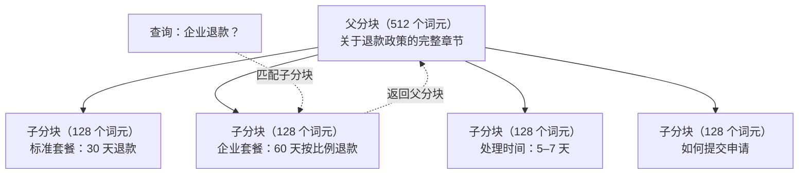
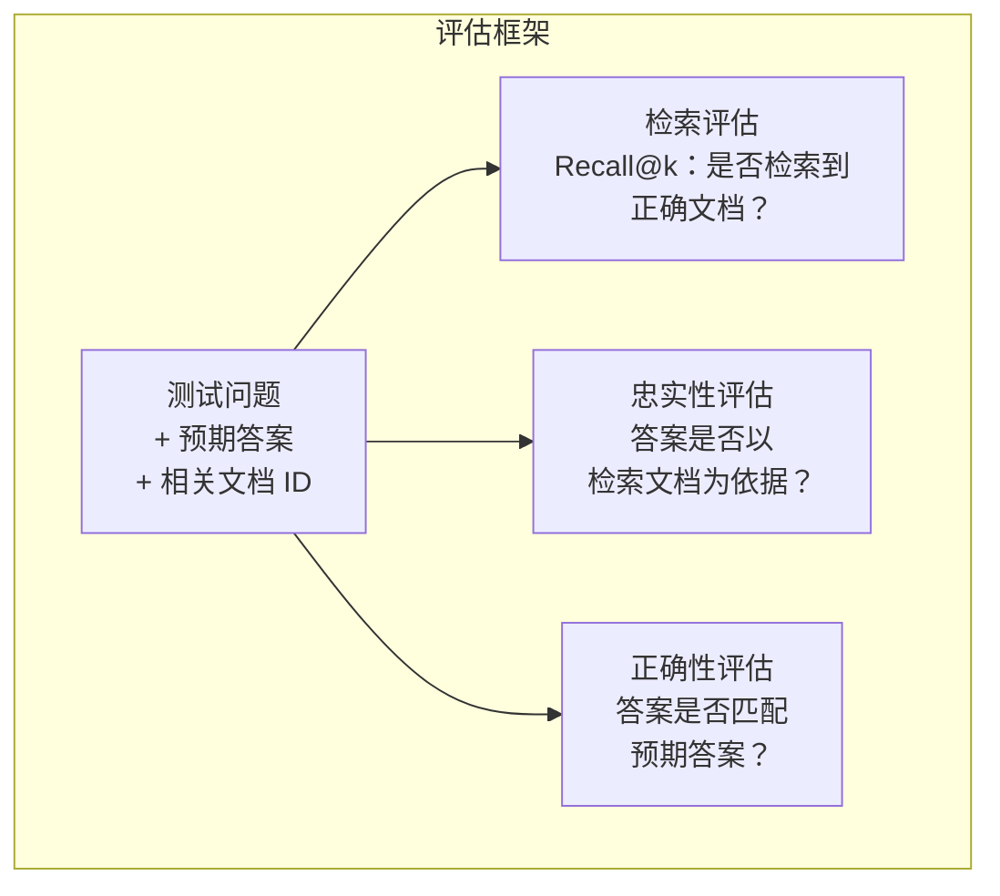

# 高级 RAG（分块、重排与混合检索）

> 基础 RAG 会检索最相似的 top-k 个分块。面对简单问题时它足够好用；但一遇到多跳推理、含义模糊的查询和大规模语料库，就会迅速失效。高级 RAG 的意义在于：把只能在 10 份文档上运行的演示，升级为能在 1000 万份文档上工作的系统。

**类型：** 构建
**语言：** Python
**前置要求：** 第 11 阶段，第 06 课（RAG）
**用时：** 约 90 分钟
**相关课程：** 第 05 阶段 · 第 23 课（RAG 分块策略）使用 Vectara/Anthropic 基准，覆盖递归、语义、句子、父文档、延迟分块和上下文检索六种分块算法。本课在其基础上继续学习：混合检索、重排与查询转换。

## 学习目标

- 实现能够保留文档结构与上下文的高级分块策略（语义分块、递归分块、父子分块）
- 构建混合检索流水线，将 BM25 关键词匹配、语义向量检索和交叉编码器重排器结合起来
- 应用查询转换技术（HyDE、多查询、回退查询），改进含义模糊或复杂问题的检索
- 诊断并修复常见的 RAG 失败：检索到错误分块、上下文中没有答案，以及多跳推理中断

## 问题所在

你在第 06 课构建了一个基础 RAG 流水线。它能在小型语料库上回答直接的问题。现在试试下面这些情况：

**含义模糊的查询**：“上个季度的收入是多少？”语义搜索返回了关于收入策略、收入预测，以及 CFO 对收入增长看法的分块。它们都与“收入”这个词在语义上相似，却没有一个包含实际数字。正确的分块写着“2025 年第三季度收益为 4720 万美元”，但使用的是“收益”（earnings）而不是“收入”（revenue）。嵌入模型认为“收入策略”比“第三季度收益为 4720 万美元”更接近这个查询。

**多跳问题**：“哪个团队的客户满意度提升幅度最高？”你需要先找到每个团队的满意度分数，再进行比较，最后找出最大值。没有单个分块包含答案；信息分散在各个团队报告中。

**大规模语料库问题**：你有 200 万个分块。正确答案在第 1,847,293 个分块中，但 top-5 检索返回了第 14、89,201、1,200,000、44 和 901,333 个分块。它们在嵌入空间中很接近，却没有一个包含答案。在这个规模下，近似最近邻搜索的误差足以把相关结果挤出 top-k。

基础 RAG 失败，是因为向量相似度不等于相关性。一个分块可以在语义上接近查询，却并不适合用来回答问题。高级 RAG 通过四种技术应对这一点：混合检索（加入关键词匹配）、重排（更仔细地给候选打分）、查询转换（搜索前修正查询），以及更好的分块（以合适的粒度检索）。

## 核心概念

### 混合检索：语义 + 关键词

语义搜索（向量相似度）擅长理解含义。“如何取消订阅？”可以匹配“终止套餐的步骤”，即使两者没有共享任何词语。但它会漏掉精确匹配。“错误代码 E-4021”可能无法匹配包含“E-4021”的分块，因为嵌入模型把它当作噪声。

关键词搜索（BM25）正好相反，擅长精确匹配。“E-4021”能完美匹配；但如果文档写的是“终止套餐”，搜索“取消订阅”就会返回零结果。

混合检索同时运行两种搜索，然后合并结果。

**BM25**（Best Matching 25，最佳匹配 25）是标准的关键词搜索算法。从 20 世纪 90 年代起，它一直是搜索引擎的基础。公式如下：

```text
BM25(q, d) = sum over terms t in q:
    IDF(t) * (tf(t,d) * (k1 + 1)) / (tf(t,d) + k1 * (1 - b + b * |d| / avgdl))
```

其中，tf(t,d) 是词语 t 在文档 d 中出现的频率，IDF(t) 是逆文档频率，|d| 是文档长度，avgdl 是平均文档长度，k1 控制词频饱和度（默认 1.2），b 控制长度归一化（默认 0.75）。

直观地说：BM25 会给包含查询词的文档更高分，尤其是包含稀有词的文档；但重复出现同一个词的收益会递减。一个包含“收入”50 次的文档，并不会比只包含一次的文档相关 50 倍。

### 倒数排名融合（RRF）

现在有两个排序列表：一个来自向量搜索，一个来自 BM25。如何把它们合并？倒数排名融合（Reciprocal Rank Fusion）是标准做法。

```text
RRF_score(d) = sum over rankings R:
    1 / (k + rank_R(d))
```

其中，k 是一个常数（通常为 60），用来避免排名最前的结果占据压倒性优势。

一个文档在向量搜索中排第 1、在 BM25 中排第 5，则得分为：1/(60+1) + 1/(60+5) = 0.0164 + 0.0154 = 0.0318

一个文档在向量搜索中排第 3、在 BM25 中排第 2，则得分为：1/(60+3) + 1/(60+2) = 0.0159 + 0.0161 = 0.0320

RRF 会自然地平衡这两个信号。在两个列表中都排名靠前的文档会得到最高分；只在一个列表中排第 1、在另一个列表中缺席的文档，会得到中等分数。它很稳健，因为使用的是排名而不是原始分数，所以两个系统的分数分布不同也不会影响结果。

### 重排

检索（无论是向量、关键词还是混合检索）速度快但不够精确。它使用双编码器：分别对查询和每个文档进行嵌入，再比较两者。嵌入只需计算一次并缓存起来，因此可以扩展到数百万份文档。

重排使用交叉编码器：把查询和候选文档一起输入模型，由模型输出相关性分数。模型能同时看到两段文本，捕捉它们之间的细粒度交互。即使双编码器没能发现联系，交叉编码器也能理解“第三季度的收益是多少？”与包含“第三季度 4720 万美元”的分块高度相关。

代价是：交叉编码器需要联合处理查询—文档对，因此速度比双编码器慢 100–1000 倍。你无法为 100 万份文档预先计算交叉编码器分数。解决方案是先检索更大的候选集（从混合检索取得 top-50），再用交叉编码器重排，得到最终的 top-5。


常见重排模型（2026 年阵容）：
- Cohere Rerank 3.5：托管 API，支持多语言，在混合语料库上的召回率提升最好
- Voyage rerank-2.5：托管 API，在托管方案中延迟最低
- Jina-Reranker-v2 Multilingual：开放权重，支持 100 多种语言
- bge-reranker-v2-m3：开放权重，强力基线
- cross-encoder/ms-marco-MiniLM-L-6-v2：开放权重，可在 CPU 上运行，适合原型开发
- ColBERTv2 / Jina-ColBERT-v2：延迟交互多向量重排器，在评分时复杂度为 O(词元) 而不是 O(docs)

### 查询转换

有时问题不在检索，而在查询本身。“新政策变化那件事是什么来着？”是糟糕的搜索查询，里面没有具体词语，嵌入也很模糊。任何检索系统都无法仅凭它找到正确文档。

**查询改写**：把用户的查询重新表述成更好的搜索查询。LLM 可以这样做：

```text
用户：“新政策变化那件事是什么来着？”
改写后：“近期政策变化与更新”
```

**HyDE（Hypothetical Document Embeddings，假设文档嵌入）**：不直接用查询搜索，而是先生成一个假设答案，对它做嵌入，再搜索相似的真实文档。

```text
查询：“企业客户的退款政策是什么？”
假设答案：“企业客户有资格在购买后 60 天内获得全额退款。退款会根据剩余订阅周期按比例计算，并在 5–7 个工作日内处理。”
within 60 days of purchase. Refunds are pro-rated based on the remaining
subscription period and processed within 5-7 business days."
```

对假设答案做嵌入，再搜索与其相似的真实文档。直觉是：假设答案在嵌入空间中比原始问题更接近真实答案。问题和答案的语言结构不同；生成假设答案可以弥合“问题空间”和“答案空间”之间的差距。

HyDE 会在检索前额外增加一次 LLM 调用，使延迟增加 500–2000 毫秒。当原始查询的检索质量较差时，这个代价通常值得。

### 父子分块

标准分块迫使你在两者之间取舍：小分块便于精确检索，大分块能提供足够上下文。父子分块消除了这个取舍。

用小分块（128 个词元）做检索索引。检索到小分块后，把它所属的父分块（512 个词元）返回到提示词中。小分块能精确匹配查询，父分块则能提供足够上下文，让 LLM 生成高质量答案。



查询“企业退款？”会精确匹配子分块 C2。但进入提示词的是完整的父分块 P，其中还包括处理时间和提交流程等周边上下文。

### 元数据过滤

在运行向量搜索前，先按元数据过滤语料库：日期、来源、类别、作者、语言。这样可以缩小搜索空间，避免返回无关结果。

“上个月安全策略改了什么？”应该只搜索最近 30 天、属于安全类别的文档。如果没有元数据过滤，你会搜索整个语料库，可能检索到一份两年前的安全文档——它只是语义上相似。

生产级 RAG 系统会把元数据与每个分块一起存储：源文档、创建日期、类别、作者和版本。向量数据库支持在相似度搜索前按元数据预过滤，这对大规模场景的性能至关重要。

### 评估

你构建了一个 RAG 系统。如何知道它是否有效？看三个指标：

**检索相关性（Recall@k）**：对于一组已知相关文档的测试问题，有多少相关文档出现在 top-k 结果中？如果问题答案在第 47 个分块中，第 47 个分块是否出现在 top-5 中？

**忠实性（Faithfulness）**：生成的答案是否以检索到的文档为依据？如果检索分块写着“60 天退款窗口”，模型却说“90 天退款窗口”，这属于忠实性失败：即使上下文正确，模型仍然产生了幻觉。

**答案正确性**：生成的答案是否与预期答案一致？这是端到端指标，同时反映检索质量和生成质量。

一个简单的忠实性检查方法是：逐条取出生成答案中的主张，确认它们在检索分块中以实质相同的形式出现。如果答案包含任何检索分块都没有的事实，那么它很可能是幻觉。



```figure
agentic-rag-loop
```

## 动手构建

### 第 1 步：实现 BM25

```python
import math
from collections import Counter

class BM25:
    def __init__(self, k1=1.2, b=0.75):
        self.k1 = k1
        self.b = b
        self.docs = []
        self.doc_lengths = []
        self.avg_dl = 0
        self.doc_freqs = {}
        self.n_docs = 0

    def index(self, documents):
        self.docs = documents
        self.n_docs = len(documents)
        self.doc_lengths = []
        self.doc_freqs = {}

        for doc in documents:
            words = doc.lower().split()
            self.doc_lengths.append(len(words))
            unique_words = set(words)
            for word in unique_words:
                self.doc_freqs[word] = self.doc_freqs.get(word, 0) + 1

        self.avg_dl = sum(self.doc_lengths) / self.n_docs if self.n_docs else 1

    def score(self, query, doc_idx):
        query_words = query.lower().split()
        doc_words = self.docs[doc_idx].lower().split()
        doc_len = self.doc_lengths[doc_idx]
        word_counts = Counter(doc_words)
        score = 0.0

        for term in query_words:
            if term not in word_counts:
                continue
            tf = word_counts[term]
            df = self.doc_freqs.get(term, 0)
            idf = math.log((self.n_docs - df + 0.5) / (df + 0.5) + 1)
            numerator = tf * (self.k1 + 1)
            denominator = tf + self.k1 * (1 - self.b + self.b * doc_len / self.avg_dl)
            score += idf * numerator / denominator

        return score

    def search(self, query, top_k=10):
        scores = [(i, self.score(query, i)) for i in range(self.n_docs)]
        scores.sort(key=lambda x: x[1], reverse=True)
        return scores[:top_k]
```

### 第 2 步：倒数排名融合

```python
def reciprocal_rank_fusion(ranked_lists, k=60):
    scores = {}
    for ranked_list in ranked_lists:
        for rank, (doc_id, _) in enumerate(ranked_list):
            if doc_id not in scores:
                scores[doc_id] = 0.0
            scores[doc_id] += 1.0 / (k + rank + 1)
    fused = sorted(scores.items(), key=lambda x: x[1], reverse=True)
    return fused
```

### 第 3 步：混合检索流水线

```python
def hybrid_search(query, chunks, vector_embeddings, vocab, idf, bm25_index, top_k=5, fusion_k=60):
    query_emb = tfidf_embed(query, vocab, idf)
    vector_results = search(query_emb, vector_embeddings, top_k=top_k * 3)
    bm25_results = bm25_index.search(query, top_k=top_k * 3)
    fused = reciprocal_rank_fusion([vector_results, bm25_results], k=fusion_k)
    return fused[:top_k]
```

### 第 4 步：简单重排器

在生产环境中，你会使用交叉编码器模型。这里我们构建一个重排器，使用词语重叠、词项重要性和短语匹配来计算查询—文档相关性。

```python
def rerank(query, candidates, chunks):
    query_words = set(query.lower().split())
    stop_words = {"the", "a", "an", "is", "are", "was", "were", "what", "how",
                  "why", "when", "where", "do", "does", "for", "of", "in", "to",
                  "and", "or", "on", "at", "by", "it", "its", "this", "that",
                  "with", "from", "be", "has", "have", "had", "not", "but"}
    query_terms = query_words - stop_words

    scored = []
    for doc_id, initial_score in candidates:
        chunk = chunks[doc_id].lower()
        chunk_words = set(chunk.split())

        term_overlap = len(query_terms & chunk_words)

        query_bigrams = set()
        q_list = [w for w in query.lower().split() if w not in stop_words]
        for i in range(len(q_list) - 1):
            query_bigrams.add(q_list[i] + " " + q_list[i + 1])
        bigram_matches = sum(1 for bg in query_bigrams if bg in chunk)

        position_boost = 0
        for term in query_terms:
            pos = chunk.find(term)
            if pos != -1 and pos < len(chunk) // 3:
                position_boost += 0.5

        rerank_score = (
            term_overlap * 1.0
            + bigram_matches * 2.0
            + position_boost
            + initial_score * 5.0
        )
        scored.append((doc_id, rerank_score))

    scored.sort(key=lambda x: x[1], reverse=True)
    return scored
```

### 第 5 步：HyDE（假设文档嵌入）

```python
def hyde_generate_hypothesis(query):
    templates = {
        "what": "The answer to '{query}' is as follows: Based on our documentation, {topic} involves specific policies and procedures that define how the process works.",
        "how": "To address '{query}': The process involves several steps. First, you need to initiate the request. Then, the system processes it according to the defined rules.",
        "default": "Regarding '{query}': Our records indicate specific details and policies related to this topic that provide a comprehensive answer."
    }
    query_lower = query.lower()
    if query_lower.startswith("what"):
        template = templates["what"]
    elif query_lower.startswith("how"):
        template = templates["how"]
    else:
        template = templates["default"]

    topic_words = [w for w in query.lower().split()
                   if w not in {"what", "is", "the", "how", "do", "does", "a", "an",
                                "for", "of", "to", "in", "on", "at", "by", "and", "or"}]
    topic = " ".join(topic_words) if topic_words else "this topic"

    return template.format(query=query, topic=topic)


def hyde_search(query, chunks, vector_embeddings, vocab, idf, top_k=5):
    hypothesis = hyde_generate_hypothesis(query)
    hypothesis_emb = tfidf_embed(hypothesis, vocab, idf)
    results = search(hypothesis_emb, vector_embeddings, top_k)
    return results, hypothesis
```

### 第 6 步：父子分块

```python
def create_parent_child_chunks(text, parent_size=200, child_size=50):
    words = text.split()
    parents = []
    children = []
    child_to_parent = {}

    parent_idx = 0
    start = 0
    while start < len(words):
        parent_end = min(start + parent_size, len(words))
        parent_text = " ".join(words[start:parent_end])
        parents.append(parent_text)

        child_start = start
        while child_start < parent_end:
            child_end = min(child_start + child_size, parent_end)
            child_text = " ".join(words[child_start:child_end])
            child_idx = len(children)
            children.append(child_text)
            child_to_parent[child_idx] = parent_idx
            child_start += child_size

        parent_idx += 1
        start += parent_size

    return parents, children, child_to_parent
```

### 第 7 步：忠实性评估

```python
def evaluate_faithfulness(answer, retrieved_chunks):
    answer_sentences = [s.strip() for s in answer.split(".") if len(s.strip()) > 10]
    if not answer_sentences:
        return 1.0, []

    grounded = 0
    ungrounded = []
    context = " ".join(retrieved_chunks).lower()

    for sentence in answer_sentences:
        words = set(sentence.lower().split())
        stop_words = {"the", "a", "an", "is", "are", "was", "were", "and", "or",
                      "to", "of", "in", "for", "on", "at", "by", "it", "this", "that"}
        content_words = words - stop_words
        if not content_words:
            grounded += 1
            continue

        matched = sum(1 for w in content_words if w in context)
        ratio = matched / len(content_words) if content_words else 0

        if ratio >= 0.5:
            grounded += 1
        else:
            ungrounded.append(sentence)

    score = grounded / len(answer_sentences) if answer_sentences else 1.0
    return score, ungrounded


def evaluate_retrieval_recall(queries_with_relevant, retrieval_fn, k=5):
    total_recall = 0.0
    results = []

    for query, relevant_indices in queries_with_relevant:
        retrieved = retrieval_fn(query, k)
        retrieved_indices = set(idx for idx, _ in retrieved)
        relevant_set = set(relevant_indices)
        hits = len(retrieved_indices & relevant_set)
        recall = hits / len(relevant_set) if relevant_set else 1.0
        total_recall += recall
        results.append({
            "query": query,
            "recall": recall,
            "hits": hits,
            "total_relevant": len(relevant_set)
        })

    avg_recall = total_recall / len(queries_with_relevant) if queries_with_relevant else 0
    return avg_recall, results
```

## 实际使用

使用真正的交叉编码器进行重排：

```python
from sentence_transformers import CrossEncoder

reranker = CrossEncoder("cross-encoder/ms-marco-MiniLM-L-6-v2")

def rerank_with_cross_encoder(query, candidates, chunks, top_k=5):
    pairs = [(query, chunks[doc_id]) for doc_id, _ in candidates]
    scores = reranker.predict(pairs)
    scored = list(zip([doc_id for doc_id, _ in candidates], scores))
    scored.sort(key=lambda x: x[1], reverse=True)
    return scored[:top_k]
```

使用 Cohere 的托管重排器：

```python
import cohere

co = cohere.Client()

def rerank_with_cohere(query, candidates, chunks, top_k=5):
    docs = [chunks[doc_id] for doc_id, _ in candidates]
    response = co.rerank(
        model="rerank-english-v3.0",
        query=query,
        documents=docs,
        top_n=top_k
    )
    return [(candidates[r.index][0], r.relevance_score) for r in response.results]
```

使用真正的 LLM 运行 HyDE：

```python
import anthropic

client = anthropic.Anthropic()

def hyde_with_llm(query):
    response = client.messages.create(
        model="claude-sonnet-5",
        max_tokens=256,
        messages=[{
            "role": "user",
            "content": f"Write a short paragraph that would be a good answer to this question. Do not say you don't know. Just write what the answer would look like.\n\nQuestion: {query}"
        }]
    )
    return response.content[0].text
```

使用 Weaviate 进行生产级混合检索：

```python
import weaviate

client = weaviate.connect_to_local()

collection = client.collections.get("Documents")
response = collection.query.hybrid(
    query="enterprise refund policy",
    alpha=0.5,
    limit=10
)
```

alpha 参数控制平衡：0.0 = 纯关键词（BM25），1.0 = 纯向量，0.5 = 权重相等。大多数生产系统使用 0.3–0.7 的 alpha。

## 交付上线

本课产出：
- `outputs/prompt-advanced-rag-debugger.md` —— 用于诊断和修复 RAG 质量问题的提示词
- `outputs/skill-advanced-rag.md` —— 使用混合检索和重排构建生产级 RAG 的 Skill

## 练习

1. 比较示例文档上的 BM25、向量搜索和混合搜索。对 5 个测试查询分别记录哪种方法把最相关的分块返回在第 1 位。混合搜索应至少在 5 个查询中的 3 个上获胜。

2. 实现元数据过滤。为每份文档添加 `category` 字段（security、billing、api、product）。在运行向量搜索前，只保留相关类别的分块。用“What encryption is used?” 测试，并确认它只搜索 security 类别的分块。

3. 使用第 06 课的简单 generate 函数构建完整的 HyDE 流水线。在全部 5 个测试查询上，比较直接查询搜索和 HyDE 搜索的检索质量（top-3 相关性）。HyDE 应该能改善含义模糊查询的结果。

4. 在示例文档上实现父子分块策略。使用 child_size=30 和 parent_size=100。用子分块搜索，但在提示词中返回父分块。将生成的答案与 chunk_size=50 的标准分块进行比较。

5. 创建一个评估数据集：包含 10 个已知答案分块的问题。分别测量 (a) 仅向量搜索、(b) 仅 BM25、(c) 混合搜索、(d) 混合搜索 + 重排的 Recall@3、Recall@5 和 Recall@10。绘制结果，找出重排最有帮助的场景。

## 关键术语

| 术语 | 人们常说 | 实际含义 |
|------|----------------|----------------------|
| BM25 |“关键词搜索”| 一种概率排序算法，根据词频、逆文档频率和文档长度归一化给文档打分 |
| 混合检索 |“两全其美”| 并行运行语义（向量）搜索和关键词（BM25）搜索，再用排名融合合并结果 |
| 倒数排名融合 |“合并排序列表”| 对每个文档，在所有排序列表中累加 1/(k + rank)，从而合并多个排序列表 |
| 重排 |“第二轮打分”| 使用更昂贵的交叉编码器模型，对初始检索得到的候选集重新打分 |
| 交叉编码器 |“联合查询—文档模型”| 把查询和文档作为一个输入并输出相关性分数的模型；比双编码器更准确，但太慢，无法搜索整个语料库 |
| 双编码器 |“独立嵌入模型”| 独立嵌入查询和文档的模型；由于嵌入可预先计算，速度快，但不如交叉编码器准确 |
| HyDE |“用假答案搜索”| 为查询生成假设答案，对其做嵌入，再搜索与之相似的真实文档 |
| 父子分块 |“小搜索，大上下文”| 为精确检索建立小分块索引，但返回更大的父分块以提供足够上下文 |
| 元数据过滤 |“先缩小再搜索”| 在运行向量搜索前按属性（日期、来源、类别）过滤文档，从而缩小搜索空间 |
| 忠实性 |“是否立足于依据”| 生成的答案是否由检索文档支持，而不是由模型训练数据中的内容幻觉生成 |

## 延伸阅读

- Robertson & Zaragoza, “The Probabilistic Relevance Framework: BM25 and Beyond”（2009）—— BM25 的权威参考，解释公式背后的概率基础
- Cormack 等，“Reciprocal Rank Fusion Outperforms Condorcet and Individual Rank Learning Methods”（2009）—— 原始 RRF 论文，展示它优于更复杂的融合方法
- Gao 等，“Precise Zero-Shot Dense Retrieval without Relevance Labels”（2022）—— HyDE 论文，说明无需训练数据，假设文档嵌入也能改善检索
- Nogueira & Cho, “Passage Re-ranking with BERT”（2019）—— 证明在 BM25 之上使用交叉编码器重排能显著改善检索质量
- [Khattab 等，“DSPy: Compiling Declarative Language Model Calls into Self-Improving Pipelines”（2023）](https://arxiv.org/abs/2310.03714) —— 把提示词构建和权重选择视为检索流水线上的优化问题；如果你想理解“编程 LLM”而不是“提示 LLM”，可以读这篇。
- [Edge 等，“From Local to Global: A Graph RAG Approach to Query-Focused Summarization”（Microsoft Research 2024）](https://arxiv.org/abs/2404.16130) —— GraphRAG 论文：实体—关系抽取 + Leiden 社区发现，用于面向查询的摘要；理解全局检索与局部检索的区别。
- [Asai 等，“Self-RAG: Learning to Retrieve, Generate, and Critique through Self-Reflection”（ICLR 2024）](https://arxiv.org/abs/2310.11511) —— 带反思词元的自评估 RAG；这是静态“检索—生成”之后，将 RAG 改造成智能体式系统的前沿方向。
- [LangChain Query Construction 博客](https://blog.langchain.dev/query-construction/) —— 介绍如何把自然语言查询转换成结构化数据库查询（Text-to-SQL、Cypher），作为检索前步骤。
