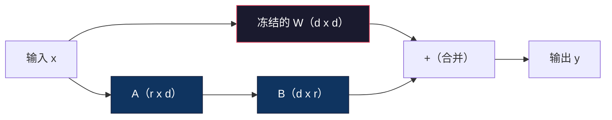
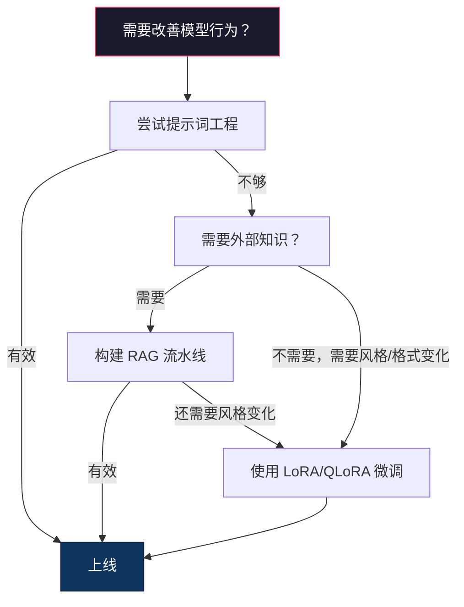

# 使用 LoRA 与 QLoRA 微调

> 完整微调一个 7B 模型需要 56GB 显存，而你没有这么多，大多数公司也没有。LoRA 只训练不到 1% 的参数，就能让你在 6GB 显存中微调同一个模型。这不是妥协——在大多数任务上，它的质量可以匹敌完整微调。整个开源微调生态都建立在这个技巧之上。

**类型：** 构建
**语言：** Python
**前置要求：** 第 10 阶段，第 06 课（指令微调 / SFT）
**用时：** 约 75 分钟
**相关课程：** 第 10 阶段从零实现 SFT/DPO 循环。本课把这些循环接入 2026 年的 PEFT 工具链（PEFT、TRL、Unsloth、Axolotl、LLaMA-Factory）。

## 学习目标

- 通过向预训练模型的注意力层注入低秩适配器矩阵（A 和 B）来实现 LoRA
- 计算 LoRA 相比完整微调节省的参数量：对于维度为 d_model、秩为 r 的适配器，训练 2*r*d 个参数，而不是 d^2 个
- 使用 QLoRA（4 bit 量化基座模型 + LoRA 适配器）微调模型，使其适配消费级 GPU 的显存
- 将 LoRA 权重合并回基座模型用于部署，并比较有无适配器时的推理速度

## 问题所在

你有一个基座模型：Llama 3 8B。你希望它用公司的语气回答客服工单。答案是 SFT，但 SFT 有成本问题。

完整微调会更新模型中的每一个参数。Llama 3 8B 有 80 亿个参数。在 fp16 中，每个参数占 2 字节；光加载权重就需要 16GB。训练期间还需要梯度（16GB）、Adam 优化器状态（动量 + 方差共 32GB）以及激活值。总计：单个 8B 模型大约需要 56GB 显存。

一张 A100 80GB 勉强能装下这些内容。云厂商的两张 A100 每小时要 3–4 美元。用 50,000 个样本训练 3 个 epoch 需要 6–10 小时，也就是每次实验 30–40 美元。为了调好超参数运行 10 次实验，部署前就已经花掉 400 美元。

把规模扩大到 Llama 3 70B，数字就变得离谱：仅权重就需要 140GB。你需要一个集群，每次实验成本超过 100 美元。

还有一个更深层的问题。完整微调会修改模型的全部权重。如果你用客服数据微调，可能会损害模型的通用能力，这叫作灾难性遗忘。模型在你的任务上变强了，在其他所有事情上却变差。

你需要一种训练更少参数、占用更少内存，同时不会摧毁模型已有知识的方法。

## 核心概念

### LoRA：低秩适配

微软的 Edward Hu 及其同事在 2021 年 6 月发表了 LoRA。论文的洞见是：微调期间的权重更新具有较低的内在秩。你不需要更新 4096×4096 权重矩阵中的全部 1677 万个参数；更新中的有效信息可以由秩为 16 或 32 的矩阵表示。

数学表达如下。标准线性层计算：

```text
y = Wx
```

其中 W 是一个 d_out × d_in 矩阵。对于 4096×4096 的注意力投影层，它包含 16,777,216 个参数。

LoRA 冻结 W，并加入一个低秩分解：

```text
y = Wx + BAx
```

其中 B 的形状为（d_out × r），A 的形状为（r × d_in）。秩 r 远小于 d，通常取 8、16 或 32。

对于 4096×4096 层、r=16 的情况：
- 原始参数：4096 × 4096 = 16,777,216
- LoRA 参数：（4096 × 16）+（16 × 4096）= 65,536 + 65,536 = 131,072
- 缩减比例：131,072 / 16,777,216 = 0.78%

你只训练 0.78% 的参数，却能获得 95–100% 的质量。



A 使用随机高斯值初始化，B 初始化为零。这意味着 LoRA 的贡献从零开始：模型从原始行为出发，逐渐学会适配。

### 缩放因子：Alpha

LoRA 引入一个缩放因子 alpha，用来控制低秩更新对输出的影响：

```text
y = Wx + (alpha / r) * BAx
```

当 alpha = r 时，缩放为 1 倍；当 alpha = 2r（常见默认值）时，缩放为 2 倍。这个超参数可以独立于基座学习率，控制 LoRA 路径的学习率。

实践建议：
- alpha = 2 * rank 是社区中常见的约定（原论文在大多数实验中使用 alpha = rank）
- alpha = rank 表示 1 倍缩放，较保守但稳定
- 更高的 alpha 意味着每一步更新更大，可能加速收敛，也可能造成不稳定

### LoRA 应该应用在哪里

Transformer 有许多线性层。你不需要给所有层都加入 LoRA。原论文测试了不同的组合：

| 目标层 | 可训练参数（7B） | 质量 |
|--------------|----------------------|---------|
| 仅 q_proj | 4.7M | 好 |
| q_proj + v_proj | 9.4M | 更好 |
| q_proj + k_proj + v_proj + o_proj | 18.9M | 注意力任务最佳 |
| 所有线性层（注意力 + MLP） | 37.7M | 收益有限，参数量翻倍 |

对大多数任务而言，最佳平衡点是 q_proj + v_proj。它针对自注意力中的 query 和 value 投影，控制模型关注什么以及提取哪些信息。加入 MLP 层有助于代码生成等复杂任务，但对简单任务来说收益递减，参数量却会翻倍。

### 选择秩

秩 r 控制适配的表达能力：

| 秩 | 可训练参数（每层） | 适用场景 |
|------|---------------------------|----------|
| 4 | 32,768 | 简单分类、情感分析 |
| 8 | 65,536 | 单领域问答、摘要 |
| 16 | 131,072 | 多领域任务、指令跟随 |
| 32 | 262,144 | 复杂推理、代码生成 |
| 64 | 524,288 | 对大多数任务收益递减 |
| 128 | 1,048,576 | 很少有充分理由使用 |

Hu 等人证明，r=4 已经能捕获简单任务的大部分适配信息。实践中最常用的是 r=8 和 r=16。超过 r=64 后，质量很少继续提高，还会开始失去 LoRA 的内存优势。

### QLoRA：4 bit 量化 + LoRA

华盛顿大学的 Tim Dettmers 及其同事在 2023 年 5 月发表了 QLoRA。其思路是：把冻结的基座模型量化到 4 bit，然后在其上以 fp16 挂载 LoRA 适配器。

这会彻底改变内存方程：

| 方法 | 权重内存（7B） | 训练内存（7B） | 所需 GPU |
|--------|-------------------|---------------------|-------------|
| 完整微调（fp16） | 14GB | ~56GB | 1× A100 80GB |
| LoRA（fp16 基座） | 14GB | ~18GB | 1× A100 40GB |
| QLoRA（4 bit 基座） | 3.5GB | ~6GB | 1× RTX 3090 24GB |

QLoRA 有三项技术贡献：

**NF4（Normal Float 4 bit）**：专门为神经网络权重设计的新数据类型。神经网络权重大致服从正态分布。NF4 把 16 个量化等级放在标准正态分布的分位点上。对于正态分布数据，这是信息论意义上的最优方案。相比均匀 4 bit 量化（INT4）或标准 Float4，它损失的信息更少。

**双重量化**：量化常数本身也占内存。每 64 个权重组成的块需要一个 fp32 缩放因子（4 字节）。对于 7B 模型，这会额外占用 0.4GB。双重量化把这些常数量化到 fp8，将开销降到 0.1GB。单看很小，但累积起来很可观。

**分页优化器**：长序列训练时，优化器状态（Adam 的动量和方差）可能超过 GPU 显存。分页优化器使用 NVIDIA 统一内存：GPU 显存耗尽时，自动把优化器状态分页到 CPU RAM；需要时再分页回来。它能避免 OOM 崩溃，但会牺牲一部分吞吐量。

### 质量问题

减少参数或量化基座会损害质量吗？下面是多篇论文的结果：

| 方法 | MMLU（5-shot） | MT-Bench | HumanEval |
|--------|--------------|----------|-----------|
| 完整微调（Llama 2 7B） | 48.3 | 6.72 | 14.6 |
| LoRA r=16 | 47.9 | 6.68 | 14.0 |
| QLoRA r=16（NF4） | 47.5 | 6.61 | 13.4 |
| QLoRA r=64（NF4） | 48.1 | 6.70 | 14.2 |

在大多数基准上，r=16 的 LoRA 与完整微调相差不到 1%。r=16 的 QLoRA 只再损失百分之零点几。r=64 的 QLoRA 基本能匹敌完整微调，同时少用 90% 的内存。

### 真实成本

在 50,000 个样本上微调 Llama 3 8B（3 个 epoch）：

| 方法 | GPU | 时间 | 成本 |
|--------|-----|------|------|
| 完整微调 | 2× A100 80GB | 8 小时 | ~32 美元 |
| LoRA r=16 | 1× A100 40GB | 4 小时 | ~8 美元 |
| QLoRA r=16 | 1× RTX 4090 24GB | 6 小时 | ~5 美元 |
| QLoRA r=16（Unsloth） | 1× RTX 4090 24GB | 2.5 小时 | ~2 美元 |
| QLoRA r=16 | 1× T4 16GB | 12 小时 | ~4 美元 |

在单张消费级 GPU 上运行 QLoRA，成本还不到一顿午餐。低成本促成了 2023 年开源权重微调社区的增长，也让下述训练框架在 2026 年默认提供 QLoRA。

### 2026 年 PEFT 工具链

| 框架 | 它是什么 | 适合何时选择 |
|-----------|-----------|-----------|
| **Hugging Face PEFT** | LoRA/QLoRA/DoRA/IA3 的标准库 | 需要底层控制，且训练循环已经基于 `transformers.Trainer` |
| **TRL** | HF 的反馈强化训练器（SFT、DPO、GRPO、PPO、ORPO） | 需要在 SFT 后进行 DPO/GRPO；构建在 PEFT 之上 |
| **Unsloth** | 用 Triton kernel 重写前向/反向传播 | 希望在不损失准确率的情况下提速 2–5 倍、显存减半；使用 Llama/Mistral/Qwen 系列 |
| **Axolotl** | PEFT + TRL + DeepSpeed + Unsloth 的 YAML 配置封装 | 希望训练运行可复现、可版本控制 |
| **LLaMA-Factory** | PEFT + TRL 的 GUI/CLI/API | 希望零代码微调；支持 100 多个模型系列 |
| **torchtune** | 原生 PyTorch 配方，不依赖 `transformers` | 需要最少依赖，且组织已经统一使用 PyTorch |

经验法则：研究用途或一次性实验 → PEFT；可重复的生产流水线 → 启用 Unsloth kernel 的 Axolotl；一次性原型 → LLaMA-Factory。

### 合并适配器

训练完成后，你有两样东西：冻结的基座模型，以及一个很小的 LoRA 适配器（通常为 10–100MB）。你可以：

1. **保持分离**：加载基座模型，再在其上加载适配器。可以针对不同任务切换适配器，从同一基座模型服务多个微调变体。

2. **永久合并**：计算 W′ = W + (alpha/r) * BA，并把结果保存为一个新的完整模型。合并后的模型与原模型大小相同，没有推理开销，也不需要管理适配器。

如果要服务多个任务（客服适配器、代码适配器、翻译适配器），就保持分离；如果要部署一个单一的专用模型，就进行合并。

合并多个适配器的高级技术：

- **TIES-Merging**（Yadav 等，2023）：裁剪小幅度参数，解决符号冲突，然后进行合并，减少适配器之间的干扰。
- **DARE**（Yu 等，2023）：合并前随机丢弃适配器参数，并对剩余参数重新缩放；组合能力时效果出人意料地好。
- **任务算术**：直接加减适配器权重。把“代码”适配器和“数学”适配器相加，往往能得到同时擅长两者的模型。

### 什么时候不该微调

微调是第三种选择，不是第一选择。

**第一：提示词工程。** 写更好的系统提示词，加入 few-shot 示例，使用思维链。这些都不花钱，只需要几分钟。如果提示词工程已经让你完成了 80%，通常就不需要微调。

**第二：RAG。** 如果模型需要了解你的特定数据（文档、知识库、产品目录），检索比把知识写进权重更便宜、更易维护。参见第 06 课。

**第三：微调。** 当你需要模型采用提示词无法实现的特定风格、格式或推理模式时使用它；当你需要稳定的结构化输出时使用它；当你需要把大模型蒸馏到小模型时使用它；当延迟重要、无法承受 few-shot 提示词带来的额外词元时使用它。



```figure
lora-params
```

## 动手构建

我们用纯 PyTorch 从零实现 LoRA。不使用库，不依赖魔法。你将构建 LoRA 层，把它注入模型，训练它，再把权重合并回去。

### 第 1 步：LoRA 层

```python
import torch
import torch.nn as nn
import math

class LoRALayer(nn.Module):
    def __init__(self, in_features, out_features, rank=8, alpha=16):
        super().__init__()
        self.rank = rank
        self.alpha = alpha
        self.scaling = alpha / rank

        self.A = nn.Parameter(torch.randn(in_features, rank) * (1 / math.sqrt(rank)))
        self.B = nn.Parameter(torch.zeros(rank, out_features))

    def forward(self, x):
        return (x @ self.A @ self.B) * self.scaling
```

A 使用缩放后的随机值初始化，B 初始化为零。乘积 BA 从零开始，因此模型从原始行为开始。

### 第 2 步：使用 LoRA 包装线性层

```python
class LinearWithLoRA(nn.Module):
    def __init__(self, linear, rank=8, alpha=16):
        super().__init__()
        self.linear = linear
        self.lora = LoRALayer(
            linear.in_features, linear.out_features, rank, alpha
        )

        for param in self.linear.parameters():
            param.requires_grad = False

    def forward(self, x):
        return self.linear(x) + self.lora(x)
```

原始线性层被冻结，只有 LoRA 参数（A 和 B）可训练。

### 第 3 步：把 LoRA 注入模型

```python
def inject_lora(model, target_modules, rank=8, alpha=16):
    for param in model.parameters():
        param.requires_grad = False

    lora_layers = {}
    for name, module in model.named_modules():
        if isinstance(module, nn.Linear):
            if any(t in name for t in target_modules):
                parent_name = ".".join(name.split(".")[:-1])
                child_name = name.split(".")[-1]
                parent = dict(model.named_modules())[parent_name]
                lora_linear = LinearWithLoRA(module, rank, alpha)
                setattr(parent, child_name, lora_linear)
                lora_layers[name] = lora_linear
    return lora_layers
```

首先冻结模型中的每一个参数。然后遍历模型树，找到名称匹配目标的线性层，并把它们替换为 LoRA 包装版本。整个模型中只有 LoRA 的 A、B 矩阵可训练。

### 第 4 步：统计参数

```python
def count_parameters(model):
    total = sum(p.numel() for p in model.parameters())
    trainable = sum(p.numel() for p in model.parameters() if p.requires_grad)
    frozen = total - trainable
    return {
        "total": total,
        "trainable": trainable,
        "frozen": frozen,
        "trainable_pct": 100 * trainable / total if total > 0 else 0
    }
```

### 第 5 步：合并权重

```python
def merge_lora_weights(model):
    for name, module in model.named_modules():
        if isinstance(module, LinearWithLoRA):
            with torch.no_grad():
                merged = (
                    module.lora.A @ module.lora.B
                ) * module.lora.scaling
                module.linear.weight.data += merged.T
            parent_name = ".".join(name.split(".")[:-1])
            child_name = name.split(".")[-1]
            if parent_name:
                parent = dict(model.named_modules())[parent_name]
            else:
                parent = model
            setattr(parent, child_name, module.linear)
```

合并后，LoRA 层消失。模型大小与原模型相同，适配信息已经写入权重，不再有推理开销。

### 第 6 步：模拟 QLoRA 量化

```python
def quantize_to_nf4(tensor, block_size=64):
    blocks = tensor.reshape(-1, block_size)
    scales = blocks.abs().max(dim=1, keepdim=True).values / 7.0
    scales = torch.clamp(scales, min=1e-8)
    quantized = torch.round(blocks / scales).clamp(-8, 7).to(torch.int8)
    return quantized, scales

def dequantize_from_nf4(quantized, scales, original_shape):
    dequantized = quantized.float() * scales
    return dequantized.reshape(original_shape)
```

这段代码通过把权重映射到每 64 个元素一组、共 16 个离散等级来模拟 4 bit 量化。生产级 QLoRA 会使用 bitsandbytes 库在 GPU 上执行真正的 NF4。

### 第 7 步：训练循环

```python
def train_lora(model, data, epochs=5, lr=1e-3, batch_size=4):
    optimizer = torch.optim.AdamW(
        [p for p in model.parameters() if p.requires_grad], lr=lr
    )
    criterion = nn.MSELoss()

    losses = []
    for epoch in range(epochs):
        epoch_loss = 0.0
        n_batches = 0
        indices = torch.randperm(len(data["inputs"]))

        for i in range(0, len(indices), batch_size):
            batch_idx = indices[i:i + batch_size]
            x = data["inputs"][batch_idx]
            y = data["targets"][batch_idx]

            output = model(x)
            loss = criterion(output, y)

            optimizer.zero_grad()
            loss.backward()
            optimizer.step()

            epoch_loss += loss.item()
            n_batches += 1

        avg_loss = epoch_loss / n_batches
        losses.append(avg_loss)

    return losses
```

### 第 8 步：完整演示

```python
def demo():
    torch.manual_seed(42)
    d_model = 256
    n_classes = 10

    model = nn.Sequential(
        nn.Linear(d_model, 512),
        nn.ReLU(),
        nn.Linear(512, 512),
        nn.ReLU(),
        nn.Linear(512, n_classes),
    )

    n_samples = 500
    x = torch.randn(n_samples, d_model)
    y = torch.randint(0, n_classes, (n_samples,))
    y_onehot = torch.zeros(n_samples, n_classes).scatter_(1, y.unsqueeze(1), 1.0)

    data = {"inputs": x, "targets": y_onehot}

    params_before = count_parameters(model)

    lora_layers = inject_lora(
        model, target_modules=["0", "2"], rank=8, alpha=16
    )

    params_after = count_parameters(model)

    losses = train_lora(model, data, epochs=20, lr=1e-3)

    merge_lora_weights(model)
    params_merged = count_parameters(model)

    return {
        "params_before": params_before,
        "params_after": params_after,
        "params_merged": params_merged,
        "losses": losses,
    }
```

这个演示创建一个小模型，把 LoRA 注入其中两层，训练它，再把权重合并回去。LoRA 训练期间，可训练参数量从全部参数降到约 1%；合并后，参数量回到原始架构的规模。

## 实际使用

在 Hugging Face 生态中，对真实模型使用 LoRA 大约只需要 20 行代码：

```python
from transformers import AutoModelForCausalLM, AutoTokenizer
from peft import LoraConfig, get_peft_model, TaskType

model = AutoModelForCausalLM.from_pretrained("meta-llama/Llama-3.1-8B")
tokenizer = AutoTokenizer.from_pretrained("meta-llama/Llama-3.1-8B")

lora_config = LoraConfig(
    task_type=TaskType.CAUSAL_LM,
    r=16,
    lora_alpha=32,
    lora_dropout=0.05,
    target_modules=["q_proj", "v_proj"],
)

model = get_peft_model(model, lora_config)
model.print_trainable_parameters()
```

对于 QLoRA，加入 bitsandbytes 量化：

```python
from transformers import BitsAndBytesConfig

bnb_config = BitsAndBytesConfig(
    load_in_4bit=True,
    bnb_4bit_quant_type="nf4",
    bnb_4bit_compute_dtype=torch.bfloat16,
    bnb_4bit_use_double_quant=True,
)

model = AutoModelForCausalLM.from_pretrained(
    "meta-llama/Llama-3.1-8B",
    quantization_config=bnb_config,
    device_map="auto",
)

model = get_peft_model(model, lora_config)
```

就是这样。训练循环不变，数据流水线不变。基座模型现在以 4 bit 存储，LoRA 适配器以 fp16 训练，整体只需 6GB 显存。

使用 Hugging Face Trainer 进行训练：

```python
from transformers import TrainingArguments, Trainer
from datasets import load_dataset

dataset = load_dataset("tatsu-lab/alpaca", split="train[:5000]")

training_args = TrainingArguments(
    output_dir="./lora-llama",
    num_train_epochs=3,
    per_device_train_batch_size=4,
    gradient_accumulation_steps=4,
    learning_rate=2e-4,
    fp16=True,
    logging_steps=10,
    save_strategy="epoch",
    optim="paged_adamw_8bit",
)

trainer = Trainer(
    model=model,
    args=training_args,
    train_dataset=dataset,
)

trainer.train()

model.save_pretrained("./lora-adapter")
```

保存下来的适配器只有 10–100MB。基座模型保持不变。你可以在 Hugging Face Hub 上分享适配器，而不必重新分发完整模型。

## 交付上线

本课产出：
- `outputs/prompt-lora-advisor.md` —— 帮助你根据具体任务选择 LoRA 秩、目标模块和超参数的提示词
- `outputs/skill-fine-tuning-guide.md` —— 教会智能体判断何时以及如何微调的 Skill

## 练习

1. **秩消融实验。** 分别用秩 2、4、8、16、32、64 运行演示。绘制最终损失与秩的关系，找出收益递减点：秩翻倍后，损失不再减半。对于 256 维特征上的简单分类任务，这个点应在 r=8–16 左右。

2. **目标模块比较。** 修改 `inject_lora`，分别只针对层“0”、只针对层“2”、只针对层“4”，以及同时针对三层。每个变体训练 20 个 epoch，比较收敛速度和最终损失。这对应真实决策：选择 q_proj、v_proj，还是所有线性层。

3. **量化误差分析。** 取训练模型在 `quantize_to_nf4` / `dequantize_from_nf4` 前后的权重矩阵。计算均方误差、最大绝对误差，以及原始权重与重构权重之间的相关性。尝试 block_size 为 32、64、128、256。

4. **多适配器服务。** 在不同数据子集（偶数索引与奇数索引）上训练两个 LoRA 适配器，分别保存。只加载一次基座模型，然后切换适配器，验证它们对同一输入产生不同输出，说明生产系统如何用一个基座服务多个微调模型。

5. **合并与未合并推理。** 对相同的 100 个输入，比较 LoRA 模型在 `merge_lora_weights` 前后的输出。验证输出在 1e-5 的浮点容差内一致。然后对两者进行推理速度基准测试——合并后应该略快，因为它只需一次矩阵乘法，而不是两次。

## 关键术语

| 术语 | 人们常说 | 实际含义 |
|------|----------------|----------------------|
| LoRA |“高效微调”| 低秩适配：冻结基座权重，训练两个小矩阵 A 和 B，用它们的乘积近似完整的权重更新 |
| QLoRA |“在笔记本上微调”| 量化 LoRA：以 4 bit NF4 加载基座模型，在其上以 fp16 训练 LoRA 适配器，使 7B 模型能在 6GB 显存中微调 |
| 秩（r） |“模型能学多少”| A、B 矩阵的内部维度；控制表达能力与参数量之间的取舍 |
| Alpha |“LoRA 学习率”| 应用于 LoRA 输出的缩放因子；alpha/r 决定适配更新对最终输出的贡献 |
| NF4 |“4 bit 量化”| Normal Float 4：量化等级位于正态分布分位点上的 4 bit 数据类型，对神经网络权重而言是最优方案 |
| 适配器 |“训练出来的小部分”| 单独保存的 LoRA A、B 矩阵文件（10–100MB），可加载到任意一份基座模型之上 |
| 目标模块 |“在哪些层使用 LoRA”| 注入 LoRA 适配器的具体线性层（q_proj、v_proj 等） |
| 合并 |“烘焙进去”| 计算 W + (alpha/r) * BA 并替换原始权重，从而消除推理时的适配器开销 |
| 分页优化器 |“训练时别 OOM”| GPU 显存耗尽时，把优化器状态（Adam 动量、方差）卸载到 CPU |
| 灾难性遗忘 |“微调把其他能力弄坏了”| 更新全部权重导致模型失去原有能力的现象 |

## 延伸阅读

- Hu 等，“LoRA: Low-Rank Adaptation of Large Language Models”（2021）—— 介绍低秩分解方法的原始论文，在 GPT-3 175B 上测试了低至 4 的秩
- Dettmers 等，“QLoRA: Efficient Finetuning of Quantized Language Models”（2023）—— 提出 NF4、双重量化和分页优化器，使 65B 模型能在单张 48GB GPU 上微调
- [PEFT 库文档](https://huggingface.co/docs/peft) —— Hugging Face 生态中 LoRA、QLoRA 和其他参数高效方法的标准库
- Yadav 等，“TIES-Merging: Resolving Interference When Merging Models”（2023）—— 在不损失质量的情况下组合多个 LoRA 适配器的技术
- [Rafailov 等，“Direct Preference Optimization: Your Language Model is Secretly a Reward Model”（NeurIPS 2023）](https://arxiv.org/abs/2305.18290) —— DPO 推导；SFT 之后的偏好微调阶段，不需要奖励模型。
- [TRL 文档](https://huggingface.co/docs/trl/) —— `SFTTrainer`、`DPOTrainer`、`KTOTrainer` 的官方参考，以及与 PEFT/bitsandbytes/Unsloth 的集成接口。
- [Unsloth 文档](https://docs.unsloth.ai/) —— 让微调吞吐翻倍、显存减半的融合 kernel；TRL 下方的性能层。
- [Axolotl 文档](https://axolotl-ai-cloud.github.io/axolotl/) —— 以 YAML 配置多 GPU SFT/DPO/QLoRA 训练器；把配置当作代码的替代方案。
