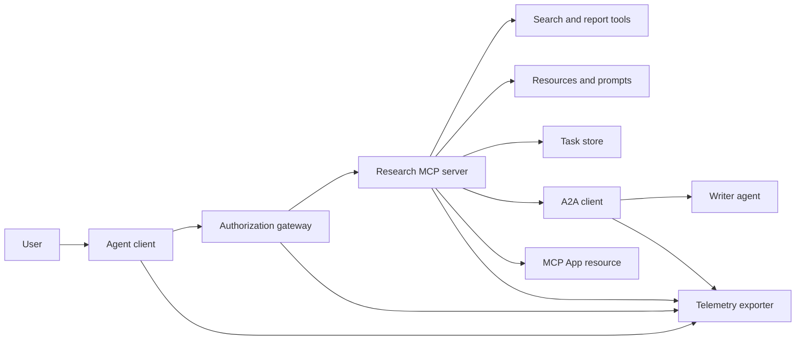
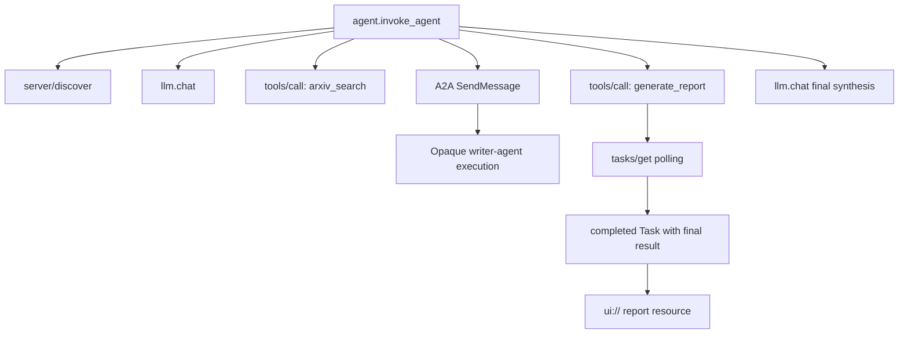
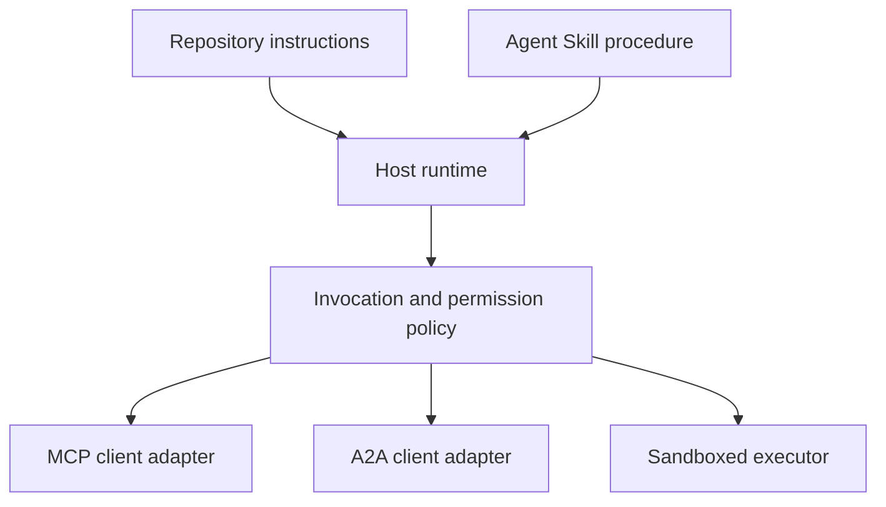

# Capstone：无状态工具生态系统

> 生产级 agent 系统是一组边界，而不是一堆功能。这个 capstone 把易读的进程内模拟与真实部署仍需具备的协议客户端、授权服务器、沙箱和遥测导出器分开。

**类型：** 构建
**语言：** Python（标准库，进程内模拟）
**前置课程：** Phase 13 · 第 01–22 课，使用 MCP `2026-07-28` 版本
**预计时间：** 约 120 分钟

## 学习目标

- 在一个流程中组合工具调用、任务形状结果、委派工作、UI 资源、授权策略和 trace 记录。
- 让每个 MCP 请求携带协议版本、客户端身份和能力，而不依赖连接会话。
- 在使用服务器前先发现它，并通过官方 Tasks 扩展驱动长时工作。
- 区分协议形状的模拟与 MCP、A2A、OAuth 或 OpenTelemetry 实现。
- 把每个模拟边界映射到必须替换它的生产组件。
- 保持 `AGENTS.md`、Agent Skill、运行时适配器、工具和安全策略各司其职。
- 说明哪些断言可以由本地输出验证，哪些必须通过在线集成测试验证。

## 问题所在

设计一个研究与报告系统。用户请求关于 agent 协议的论文。系统搜索论文目录，委派摘要，生成报告，返回 UI 资源，并记录系统中的路径。

这句话隐藏着多个独立契约：

- 面向模型的工具 schema；
- 无状态请求信封和服务器发现契约；
- 针对 actor、范围和工具身份的网关决策；
- 长时操作契约；
- 委派协议；
- 宿主到 App 的桥接；
- trace 传播与导出；
- 可复用的操作流程。

`code/main.py` 用普通 Python 函数和字典让这些边界可见。它不会打开传输、联系 arXiv、执行 OAuth、调用 A2A 服务器、渲染 MCP App 或导出遥测，因此可以检查控制流，又不会把模拟冒充为兼容服务。

## 核心概念 <!-- learning-atlas: the-concept -->

### 目标架构



该架构是公共协议模式的概念组合，不声称任何产品的私有内部结构。

### 目标 trace



真实实现中每一跳都传播 trace context。span 名称和属性必须遵循所选 instrumentation 版本支持的 OpenTelemetry 语义约定。共享 trace ID 本身不能证明父子关系、导出或后端接收正确。

### 当前协议面

使用当前协议定义的方法名，不要使用旧 draft 中记住的名称：

| 边界 | 当前面 | capstone 模拟的内容 |
|---|---|---|
| MCP discovery | 必需的 `server/discover` | 返回版本、能力和服务器身份的直接函数 |
| MCP 请求上下文 | 每个 `params._meta` 中的版本、能力和客户端身份 | 传给每次模拟调用的新请求元数据 |
| MCP 工具调用 | `tools/call` | 直接的 Python 函数分发 |
| MCP 任务轮询 | 带 `tasks/get` 的 `io.modelcontextprotocol/tasks` | working 句柄，随后返回携带最终结果的 completed 任务 |
| A2A 委派 | gRPC 和 JSON-RPC 中的 `SendMessage`；HTTP+JSON 中的 `POST /message:send` | 没有远程调用或人为延迟的一个嵌套 span |
| MCP App 调用服务器工具 | `app.callServerTool({ name, arguments })` | 没有真实桥接的 HTML 字符串 |
| OAuth 授权 | 授权服务器、受保护资源元数据、受众和作用域校验 | 静态令牌查找和作用域成员检查 |
| OpenTelemetry | SDK、propagator、exporter 以及 collector 或后端 | 内存中的 span 字典 |

协议名称只是第一层。生产测试还必须通过真实线上验证序列化、认证失败、取消、超时、重试和版本兼容。

### 无状态 MCP 改变集成边界

版本 `2026-07-28` 移除了协议会话以及 `initialize` / `notifications/initialized` 握手，也移除了 `Mcp-Session-Id`。每个请求都携带以下命名空间的 `_meta` 字段：

```json
{
  "io.modelcontextprotocol/protocolVersion": "2026-07-28",
  "io.modelcontextprotocol/clientCapabilities": {
    "extensions": {
      "io.modelcontextprotocol/tasks": {}
    }
  },
  "io.modelcontextprotocol/clientInfo": {
    "name": "capstone-client",
    "version": "1.0.0"
  }
}
```

服务器必须实现 `server/discover`。普通结果使用 `resultType: "complete"`，任务句柄使用 `resultType: "task"`。每个结果都应在 `_meta.io.modelcontextprotocol/serverInfo` 中标识服务器。

Tasks 扩展提供 `tasks/get`、`tasks/update` 和 `tasks/cancel`。工具可以先返回 `resultType: "task"`；`tasks/get` 自身返回 `resultType: "complete"`，已完成的 Task 中包含最终结果。旧的 `tasks/result` 和 `tasks/list` 不属于当前扩展。可能收到任务句柄的同一个请求必须由客户端声明 `io.modelcontextprotocol/tasks`；如果没有，服务器返回 `-32021`，`requiredCapabilities` 的形状是缺失的客户端能力对象，并包括 `extensions.io.modelcontextprotocol/tasks`。

### 安全姿态

目标部署采用纵深防御：

- 客户端类型需要时用 PKCE 做 OAuth 授权；
- 对签发的访问令牌做资源和受众绑定；
- 网关 RBAC 检查请求工具和作用域；
- 上游凭据放在模型可见上下文之外；
- pin 住或审核过的工具描述 manifest；
- 对不受信任输入、敏感数据和重要动作执行 Rule of Two 审核；
- 使用在 skill 之外执行的沙箱，限制文件系统、进程、网络、凭据和资源。

demo 只实现静态令牌、作用域检查和描述哈希，适合展示策略流，不是安全验证。

### Skill 是流程，不是传输

Agent Skill 可以告诉运行时如何执行研究流程、期待哪些工具契约、保存哪些证据以及何时停止。它不能让 MCP 服务器凭空存在，不能建立 A2A 兼容性，不能授予作用域，也不能创建沙箱。



当流程引用伴随文件时，应交付完整的 skill 目录。这个旧 capstone 中的扁平 artifact 只是课程蓝图，不能证明宿主会保留可移植 bundle。第 24–27 课会构建并测试完整 bundle 生命周期。

### 课程 artifact 元数据是本地适配器

课程 catalog 和安装器识别名为 `skill-*.md` 的扁平文件，但这是仓库约定，不是可移植 Agent Skills 包契约。它们的最小 frontmatter 解析器只读取顶层键。因此本课让可移植身份字段和课程 catalog 字段处于同一层：

```yaml
---
name: ecosystem-blueprint
description: Produce a full Phase 13 ecosystem architecture for a product need.
version: "1.0.0"
phase: "13"
lesson: "23"
tags: [mcp, capstone, ecosystem, architecture, a2a, otel]
---
```

`name` 和 `description` 是可移植身份字段，`version`、`phase`、`lesson` 和 `tags` 是课程专属 catalog 扩展。课程解析器要求 `tags` 使用内联列表，才能匹配 `--tag capstone`。

可移植目录 skill 可以使用可选的 `metadata` 映射携带字符串扩展数据，但这不让 `metadata` 等同于仓库 catalog schema。如果把扁平文件的 `version` 或 `tags` 嵌到 `metadata` 下，最小解析器会跳过这些缩进键，catalog 记录空版本，按标签过滤也找不到 artifact。生产宿主应使用安全 YAML 解析器，并校验自己公开的 schema。

### 模拟与生产

| 层 | `code/main.py` | 生产替代 | 必需证据 |
|---|---|---|---|
| Discovery | `server_discover()` 加静态 `TOOLS` | `server/discover` 后跟带缓存提示的 `tools/list` | 线上 transcript、确定性顺序和 schema 校验 |
| Authentication | 按令牌索引的字典 | OAuth 授权与资源服务器校验 | 发行方、受众、作用域、过期和失败测试 |
| Authorization | 作用域成员检查 | 绑定 actor、工具、目标和租户的网关策略 | 允许和拒绝的审计案例 |
| Search | 静态论文 fixture | 搜索 API 或 MCP 服务器 | 来源、排序和错误测试 |
| Tasks | 本地句柄加立即 `tasks/get` | 带 `tasks/get`、`tasks/update`、`tasks/cancel` 和 TTL 的持久 `io.modelcontextprotocol/tasks` 存储 | 状态转换、输入、取消和恢复测试 |
| Delegation | sleep 加嵌套 span | A2A 客户端和远程 Agent Card | 契约、超时、重试和不透明性测试 |
| App | HTML 字符串和 URI | MCP Apps 资源和 `App` 桥 | CSP、权限、工具调用和浏览器测试 |
| Telemetry | 内存列表 | OTel SDK 和 exporter | collector 接收和 trace-parent 断言 |
| Sandbox | 无 | 宿主执行的隔离 executor | 逃逸、外发、秘密和资源限制测试 |

这张表就是交接边界。一次绿色的本地运行只能验证模拟。

### Phase 13 地图

| 课程 | 贡献 |
|---|---|
| 01–05 | 工具接口、调用、schema、结构化结果和确定性校验 |
| 06–14 | 无状态 MCP 请求信封、发现、传输、资源、提示词、扩展和 Apps |
| 15–18 | 投毒防御、OAuth、网关、注册表和生产认证 |
| 19 | A2A 消息和任务委派 |
| 20 | OpenTelemetry GenAI trace 设计 |
| 21 | 模型提供商路由 |
| 22 | 可移植 skill 契约和运行时边界 |

```figure
t3-capstone-chain
```

## 动手构建

运行进程内 harness：

```bash
cd phases/13-tools-and-protocols/23-capstone-tool-ecosystem
python3 code/main.py
```

检查六点：

1. `server/discover` 公布版本 `2026-07-28` 和 Tasks 扩展；
2. Alice 可以读取并生成报告，而 Bob 的写作用域调用被拒绝；
3. 一次 orchestrator 运行中的每个本地 span 共享一个 trace ID，并记录父 span ID；
4. 报告先以任务句柄出现，`tasks/get` 返回一个 completed task，最终结果含文本和 `ui://` 引用；
5. 委派的 writer 保持不透明，因为 orchestrator 只记录边界 span；
6. 没有输出声称发生了网络连接、OAuth 交换、collector 导出、浏览器渲染或沙箱执行。

脚本运行两次，因此会产生两条根 trace。审计条目只存在于进程内，下一次运行会重置。

## 使用

一次提升一个层次：

1. 用真实 `server/discover` 和 `tools/list` 调用替换 `server_discover()` 与静态工具列表；每个请求都发送版本、身份和能力。
2. 用授权服务器和受保护资源校验替换静态令牌。
3. 实现 `io.modelcontextprotocol/tasks` 扩展，测试 `tasks/get`、`tasks/update`、`tasks/cancel`、超时、TTL 和重启恢复。不要增加 `tasks/result` 或 `tasks/list`。
4. 用解析 Agent Card 并发送消息的 A2A 客户端替换委派 stub。
5. 使用官方 SDK 构建 App，通过 `app.callServerTool` 调用服务器工具。
6. 把 span 导出到测试 collector，并在接收端断言父子关系。
7. 在第 26 课的沙箱契约中运行工具和脚本。
8. 把流程打包为完整目录 bundle，并通过第 27 课发布门禁。

每次提升都需要跨越新边界的集成测试。线上线后也不要删除较低层的策略测试。

## 交付

本课生成 `outputs/skill-ecosystem-blueprint.md`，这是一个旧版单文件课程 artifact。它要求用一页架构覆盖原语、安全、委派、遥测、打包以及最难的运维风险。其顶层 catalog 字段会由仓库真实的 catalog 和安装器解析器使用。

由于它不是目录 bundle，它不能携带 references、scripts、assets 或 eval fixtures。要在课程之外发布可复用 skill，请使用第 22、24–27 课的包格式。

## 练习

1. 运行 `code/main.py`，区分输出证明的事实与仍需集成证据的生产断言。
2. 增加第二个静态后端，为同名工具定义碰撞规则，再用真实 `tools/list` 调用替换两个列表。
3. 用 A2A 测试服务器替换 writer stub，记录 Agent Card、消息请求、超时路径和返回 artifact。
4. 增加能跨进程重启存活的任务存储，证明客户端可以用 `tasks/get` 恢复，遵守 `pollIntervalMs`，并无需 `tasks/result` 读取已完成任务的最终结果。
5. 构建最小 MCP App，在浏览器中用严格 CSP 和显式权限验证 `app.callServerTool`。
6. 通过 OTel SDK 把模拟 span 导出到本地 collector，断言接收、trace ID、父子关系和错误状态。
7. 为仓库维护规则写 `AGENTS.md`，再为可复用研究流程写独立 skill bundle。解释为什么两个文件都不授予工具权限。

## 关键术语

| 术语 | 常见说法 | 实际含义 |
|---|---|---|
| Capstone | “全部接线” | 分阶段集成，同时保持模拟边界和真实边界显式 |
| 协议形状模拟 | “基本就是 MCP” | 形似协议、但没有实现其线上契约的本地数据和调用 |
| Tasks 扩展 | “长工具调用” | 可选的 `io.modelcontextprotocol/tasks` 生命周期，包含持久身份、轮询、客户端输入、最终结果和取消语义 |
| 不透明边界 | “另一个 agent 负责” | 调用者只能看到声明接口和 artifact，看不到私有推理或内部状态 |
| 运行时适配器 | “Skill 集成” | 把可移植流程映射到发现、调用、工具、策略和上下文的宿主代码 |
| 集成证据 | “它通过了” | 证明真实边界被跨越的 transcript、artifact 或接收端观察 |

## 延伸阅读

- [MCP 2026-07-28 规范](https://modelcontextprotocol.io/specification/2026-07-28)：无状态请求、发现、工具、授权和传输行为。
- [MCP 2026-07-28 关键变更](https://modelcontextprotocol.io/specification/2026-07-28/changelog)：会话移除、逐请求元数据、MRTR、扩展和弃用。
- [MCP Tasks 扩展](https://tasks.extensions.modelcontextprotocol.io/specification/draft/tasks)：`tasks/get`、`tasks/update`、`tasks/cancel` 和终态任务携带的最终结果。
- [MCP Apps SDK](https://github.com/modelcontextprotocol/ext-apps/blob/main/docs/overview.md)：`App` 和 `app.callServerTool`。
- [A2A 协议](https://a2a-protocol.org/latest/)：Agent Card、消息投递、任务、artifact 和传输绑定。
- [OpenTelemetry GenAI 语义约定](https://opentelemetry.io/docs/specs/semconv/gen-ai/)：trace 和属性约定。
- [Agent Skills specification](https://agentskills.io/specification)：流程层使用的可移植包契约。
