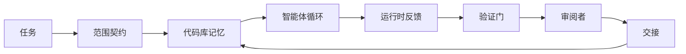

# 智能体工作台工程：为什么能力很强的模型仍会失败

> 有能力的模型还不够。可靠的智能体需要一个工作台：指令、状态、范围、反馈、验证、审阅和交接。把这些都拿掉，即使是前沿模型也会产出不安全、不能交付的工作。

**类型：** 学习 + 构建
**语言：** Python（标准库）
**前置要求：** 第 14 阶段 · 第 01 节（智能体循环）、第 14 阶段 · 第 26 节（失败模式）
**用时：** 约 45 分钟

## 学习目标

- 区分模型能力与执行可靠性。
- 说出决定智能体能否交付的七个工作台面。
- 在一个小型代码库任务上，对比仅使用提示词的运行与工作台引导的运行。
- 产出一份失败模式报告，把每个缺失的工作台面映射到它造成的症状。

## 问题所在

你把一个前沿模型放进真实代码库，让它添加输入验证。它打开四个文件，写出看似合理的代码，宣布成功，然后停下。你运行测试，发现有两个失败。它还改动了第三个与验证毫无关系的文件。没有任何记录说明智能体做了什么假设、先尝试了什么，或还剩下什么工作。

模型并不是不懂 Python。它不懂的是这项工作：不知道什么算完成，不知道被允许写到哪里，不知道哪些测试具有权威性，也不知道下一次会话该如何接续。

问题出在工作台。智能体周围的环境缺少那些把一次性生成转变为可靠、可恢复工程工作的部分。

## 核心概念

工作台是任务期间包裹模型的运行环境。它有七个工作台面：

| 工作台面 | 承载内容 | 缺失时的失败 |
|---------|----------|--------------|
| 指令 | 启动规则、禁止操作、完成定义 | 智能体猜测什么叫交付 |
| 状态 | 当前任务、改动文件、阻塞项、下一步行动 | 每次会话都从零开始 |
| 范围 | 允许的文件、禁止的文件、验收标准 | 编辑泄漏到无关代码 |
| 反馈 | 捕获到循环中的真实命令输出 | 智能体在 400 错误上宣布成功 |
| 验证 | 测试、lint、冒烟运行、范围检查 | “看起来不错”进入主分支 |
| 审阅 | 由不同角色执行的第二遍检查 | 构建者给自己的作业打分 |
| 交接 | 改了什么、为什么改、还剩什么 | 下一次会话重新发现一切 |

工作台独立于模型。你可以替换模型而保留这些工作台面；但不能替换工作台面还指望可靠性不变。



循环闭合在状态文件上，而不是聊天历史上。聊天是易失的；代码库才是事实记录。

### 工作台与提示词工程的区别

提示词告诉模型这一轮你想要什么。工作台告诉模型如何跨轮次、跨会话地完成工作。多数智能体失败故事源于工作台，却常被归因于提示词工程。

### 工作台与框架的区别

框架提供运行时（LangGraph、AutoGen、Agents SDK）。工作台为运行时中的智能体提供工作场所。两者都需要。本 mini-track 讨论的是后者。

### 从基础原语推理，而不是从厂商分类推理

现在关于“harness engineering”的文章很多。Addy Osmani、OpenAI、Anthropic、LangChain、Martin Fowler、MongoDB、HumanLayer、Augment Code、Thoughtworks、walkinglabs 的 awesome 列表，以及 Medium 和 Hacker News 上持续出现的文章都在讨论它。他们对 harness 的边界、包含哪些内容以及使用什么词汇各有分歧。我们不必选边站。七个工作台面是用户体验层；在每个工作台下面，都是支撑可靠后端的同一组分布式系统原语。

暂时去掉“智能体”这个标签。一次智能体运行是跨越时间、进程和机器的计算。要让它可靠，你需要任何生产系统都需要的同一组原语。

| 原语 | 它是什么 | 为智能体承载什么 |
|------|----------|------------------|
| Function（函数） | 类型化处理器；尽可能保持纯函数；拥有自己的输入和输出。 | 工具调用、规则检查、验证步骤、模型调用 |
| Worker（工作者） | 拥有一个或多个函数及其生命周期的长驻进程 | 构建者、审阅者、验证器、MCP 服务器 |
| Trigger（触发器） | 调用函数的事件源 | 智能体循环 tick、HTTP 请求、队列消息、cron、文件变化、hook |
| Runtime（运行时） | 决定在哪里运行什么、使用哪些超时和资源的边界 | Claude Code 进程、LangGraph 运行时、worker 容器 |
| HTTP / RPC | 调用方与 worker 之间的线路 | 工具调用协议、MCP 请求、模型 API |
| Queue（队列） | 触发器与 worker 之间的持久缓冲区，提供背压、重试、幂等性 | 任务板、反馈日志、审阅收件箱 |
| Session persistence（会话持久化） | 能跨越崩溃、重启和模型更换而存活的状态 | `agent_state.json`、检查点、KV 存储、代码库本身 |
| Authorization policy（授权策略） | 规定谁能以什么范围调用哪个函数 | 允许/禁止的文件、审批边界、MCP 能力列表 |

现在把七个工作台面映射到这些原语上。

- **指令**——策略 + 函数元数据。规则就是检查（函数）；路由器（`AGENTS.md`）是附着在运行时启动阶段的策略。
- **状态**——会话持久化。运行时每一步都会读取的键值存储，可以是文件、KV 或数据库；持久化语义比存储后端更重要。
- **范围**——每个任务的授权策略。允许/禁止的 glob 是 ACL；所需审批构成权限格。
- **反馈**——写入队列的调用日志。每次 shell 调用都是一条记录，可持久化、可重放。
- **验证**——一个函数。对输入是确定性的，在任务关闭时触发，失败时默认拒绝。
- **审阅**——拥有构建产物只读授权、拥有审阅报告只写授权的独立 worker。
- **交接**——由会话结束触发器发出的持久记录；下一次会话的启动触发器会读取它。

智能体循环本身就是一个 worker：它消费事件（用户消息、工具结果、定时器 tick），调用函数（模型，再调用模型选择的工具），写入记录（状态、反馈），并发出触发器（验证、审阅、交接）。没有什么神秘之处；它与作业处理器是同一种形状。

### 正在流行的模式，翻译成基础原语

每一种流行的 harness 模式都可以还原为这八种原语。下面是翻译表。

| 厂商或社区模式 | 对应的工作台原语 |
|----------------|----------------|
| Ralph Loop（Claude Code、Codex、agentic_harness 一书）——当智能体试图过早停止时，把原始意图重新注入一个全新的上下文窗口 | 用干净上下文重新排队任务的触发器；会话持久化把目标带到下一次 |
| Plan / Execute / Verify（PEV） | 三个 worker，每个负责一个角色，在阶段之间通过状态和队列通信 |
| Harness-compute separation（OpenAI Agents SDK，2026 年 4 月）——把控制平面与执行平面分开 | 重述控制平面 / 数据平面；这个概念早在“智能体”标签出现数十年前就有了 |
| Open Agent Passport（OAP，2026 年 3 月）——在执行前根据声明式策略签名并审计每次工具调用 | 由行动前 worker 执行的授权策略，以及带签名的审计队列 |
| Guides and Sensors（Birgitta Böckeler / Thoughtworks）——前馈规则 + 反馈可观测性 | 授权策略 + 验证函数 + 可观测性 trace |
| Progressive compaction，五阶段（Claude Code 逆向工程，2026 年 4 月） | 定期作用于会话持久化的状态管理 worker，用来让状态保持在预算之内 |
| Hooks / middleware（LangChain、Claude Code）——拦截模型和工具调用 | 包裹在运行时调用路径周围的触发器 + 函数 |
| 采用 Markdown 并渐进披露的 Skills（Anthropic、Flue） | 函数注册表：函数元数据按需加载到上下文中 |
| Sandbox agents（Codex、Sandcastle、Vercel Sandbox） | 计算平面：拥有隔离文件系统、网络和生命周期的运行时 |
| MCP servers | 通过稳定 RPC 暴露函数的 worker，以能力列表作为授权 |

表中的每一项，都是智能体社区给一个在分布式系统中早已有名字的原语重新命名。对营销来说，这些标签很有用；对工程词汇来说则没有帮助。

### 真实数据说明了什么

“harness 胜过模型”的说法现在已有数字支撑。这些数字也反驳了“只要等更聪明的模型就好”的看法。

- Terminal Bench 2.0——同一个模型，只改 harness，就让一个编码智能体从前 30 名之外跃升到第 5 名（LangChain，《Anatomy of an Agent Harness》）。
- Vercel——删掉智能体 80% 的工具后，成功率从 80% 跳到 100%（MongoDB）。
- Harvey——仅通过 harness 优化，法律智能体的准确率提高了一倍以上（MongoDB）。
- 88% 的企业级 AI 智能体项目无法进入生产环境。失败集中在运行时，而非推理（preprints.org，《Harness Engineering for Language Agents》，2026 年 3 月）。
- 一项覆盖三个流行开源框架的 2025 年基准研究报告称，任务完成率约为 50%；在长上下文条件下，长上下文 WebAgent 从 40–50% 崩到低于 10%，主要原因是无限循环和目标丢失（2026 年初的多篇文章广泛报道）。

模型会逐渐吸收 harness 技巧，但今天承重的工程工作仍在模型周围，而非模型内部。承载这些工作的原语，也是每个生产系统都需要的原语。

### 厂商文章没有走完的地方

这一部分不必客气。

- LangChain 的《Anatomy of an Agent Harness》列举了十一项组件——提示词、工具、hook、沙箱、编排、记忆、skills、子智能体以及一个“笨循环”运行时。它没有命名队列、作为部署单元的 worker、触发器语义、作为独立关注点的会话持久化，或授权策略。它把 harness 当作一个需要配置的对象，而不是一个需要部署的系统。
- Addy Osmani 的《Agent Harness Engineering》提出了 `Agent = Model + Harness` 和棘轮模式，但没有继续说明 harness 由什么构成。它更像一种立场，而不是一份规范。
- Anthropic 和 OpenAI 在工作台面上挖得最深，但仍然停留在各自的运行时内部。2026 年 4 月 Agents SDK 的“harness-compute separation”公告，是第一篇明确支持控制平面 / 数据平面分离的厂商文章。这是一个原语层面的想法，并不新鲜。
- agentic_harness 一书把 harness 当作配置对象（Jaymin West 的《Agentic Engineering》第 6 章）；书中最有力的一句话是“harness 是智能体系统的首要安全边界”。那只是把授权策略换了一种说法。
- Hacker News 的讨论不断回到同一个地方。2026 年 4 月的帖子《The agent harness belongs outside the sandbox》认为 harness 应该“更像一个置于一切之外、根据上下文授权访问的 hypervisor”。这又一次是在说：授权策略应该是独立平面。

你不必反对这些文章，就能看出其中的缺口。它们是在描述一个已经存在的系统的用户体验。我们要写的是这个系统本身。系统构建正确时，七个工作台面会从这些原语中自然出现；系统构建错误时，再怎么润色 `AGENTS.md` 也补不上缺失的队列。

所以，当你在别处听到“harness engineering”时，把它翻译成原语。提示词和规则是策略与函数。脚手架是运行时。防护栏是授权 + 验证。hook 是触发器。记忆是会话持久化。Ralph Loop 是重新入队。子智能体是 worker。沙箱是计算平面。词汇在变化；工程没有变化。工作台是面向智能体的用户体验；而能经受下一次厂商重新包装的 harness，就是把函数、worker、触发器、运行时、队列、持久化和策略正确连接起来。

```figure
wb-seven-surfaces
```

## 动手构建

`code/main.py` 会把一个小型代码库任务运行两遍。第一遍只使用提示词，第二遍接入七个工作台面。模型相同，任务相同。脚本会统计失败运行中缺失了哪些工作台面，并打印失败模式报告。

代码库任务刻意做得很小：给一个单文件、FastAPI 风格的处理器添加输入验证，并写一个通过的测试。

运行：

```text
python3 code/main.py
```

输出包括两次运行的并排日志、总结仅使用提示词运行的 `failure_modes.json`，以及工作台运行的一行结论。

智能体只是一个很小的基于规则的 stub；重点是工作台面，而不是模型。在这个 mini-track 的后续章节中，你会把每个工作台面重新构建为真正可复用的产物。

## 实际使用

即使没人这样称呼，工作台面已经出现在现实中的三个地方：

- **Claude Code、Codex、Cursor。** `AGENTS.md` 和 `CLAUDE.md` 是指令面。斜杠命令是范围面。Hook 是验证面。
- **LangGraph、OpenAI Agents SDK。** 检查点和会话存储是状态面。Handoff 是交接面。
- **真实代码库上的 CI。** 测试、lint 和类型检查是验证。PR 模板是交接。CODEOWNERS 是审阅。

工作台工程的纪律，就是把这些工作台面变得明确且可复用，而不是让每个团队各自重新发现它们。

## 交付

`outputs/skill-workbench-audit.md` 是一个可移植 skill，可以审计现有代码库的七个工作台面，并报告哪些缺失、哪些不完整、哪些健康。把它放在任意智能体配置旁边，它会告诉你先修什么。

## 练习

1. 选择一个你已经运行智能体的代码库。给七个工作台面打分：0（缺失）到 2（健康）。你最弱的工作台面是什么？
2. 扩展 `main.py`，让仅使用提示词的运行也产出一个假的“成功”声明。验证验证门会捕获它。
3. 为自己的产品增加第八个工作台面。说明为什么它不能归入现有七个中的任何一个。
4. 用另一个会虚构额外文件写入的 stub 智能体重新运行脚本。哪个工作台面最先捕获它？
5. 把第 14 阶段 · 第 26 节的五种行业反复出现的失败模式映射到七个工作台面上。每个工作台面被设计来吸收哪种模式？

## 关键术语

| 术语 | 人们常说 | 实际含义 |
|------|----------|----------|
| Workbench（工作台） | “配置” | 围绕模型构建、让工作可靠的各个面 |
| Surface（工作台面） | “一份文档”或“一段脚本” | 智能体每一轮都会读取或写入的、命名且机器可读的输入 |
| System of record（事实记录） | “笔记” | 聊天历史消失时，智能体当作事实依据的文件 |
| Definition of done（完成定义） | “验收” | 智能体无法伪造的、由文件承载的客观检查清单 |
| Workbench audit（工作台审计） | “代码库就绪检查” | 对七个工作台面进行检查，在工作开始前标出缺失部分 |

## 延伸阅读

把下面的材料当作数据点，而不是权威。每一篇都只是部分分类。决定是否采用某个概念前，先把它翻译回基础原语（函数、worker、触发器、运行时、HTTP/RPC、队列、持久化、策略）。

厂商框架：

- [Addy Osmani，Agent Harness Engineering](https://addyosmani.com/blog/agent-harness-engineering/)——`Agent = Model + Harness` 和棘轮模式；基础设施部分较薄
- [LangChain，The Anatomy of an Agent Harness](https://blog.langchain.com/the-anatomy-of-an-agent-harness/)——十一项组件：提示词、工具、hook、编排、沙箱、记忆、skills、子智能体、运行时；遗漏队列、部署和授权
- [OpenAI，Harness engineering: leveraging Codex in an agent-first world](https://openai.com/index/harness-engineering/)——Codex 团队对其运行时周围工作台面的看法
- [OpenAI，Unrolling the Codex agent loop](https://openai.com/index/unrolling-the-codex-agent-loop/)——把智能体循环化简为围绕函数调用的 `while`
- [Anthropic，Effective harnesses for long-running agents](https://www.anthropic.com/engineering/effective-harnesses-for-long-running-agents)——特定运行时中的长时程工作台面
- [Anthropic，Harness design for long-running application development](https://www.anthropic.com/engineering/harness-design-long-running-apps)——应用设计笔记
- [LangChain Deep Agents harness capabilities](https://docs.langchain.com/oss/python/deepagents/harness)——运行时配置面

包含可用细节的实践者文章：

- [Martin Fowler / Birgitta Böckeler，Harness engineering for coding agent users](https://martinfowler.com/articles/harness-engineering.html)——指南（前馈）+ 传感器（反馈）；最清晰的控制论框架
- [HumanLayer，Skill Issue: Harness Engineering for Coding Agents](https://www.humanlayer.dev/blog/skill-issue-harness-engineering-for-coding-agents)——“这不是模型问题，而是配置问题”
- [MongoDB，The Agent Harness: Why the LLM Is the Smallest Part of Your Agent System](https://www.mongodb.com/company/blog/technical/agent-harness-why-llm-is-smallest-part-of-your-agent-system)——数据：Vercel 从 80% 到 100%，Harvey 准确率翻倍，Terminal Bench 从前 30 到前 5
- [Augment Code，Harness Engineering for AI Coding Agents](https://www.augmentcode.com/guides/harness-engineering-ai-coding-agents)——以约束优先的方式逐步说明
- [Sequoia podcast，Harrison Chase on Context Engineering Long-Horizon Agents](https://sequoiacap.com/podcast/context-engineering-our-way-to-long-horizon-agents-langchains-harrison-chase/)——运行时问题重于模型问题

书籍、论文与参考实现：

- [Jaymin West，Agentic Engineering — Chapter 6: Harnesses](https://www.jayminwest.com/agentic-engineering-book/6-harnesses)——书本长度的讨论，把 harness 当作首要安全边界
- [preprints.org，Harness Engineering for Language Agents（2026 年 3 月）](https://www.preprints.org/manuscript/202603.1756)——以控制 / 能动性 / 运行时为框架的学术讨论
- [walkinglabs/awesome-harness-engineering](https://github.com/walkinglabs/awesome-harness-engineering)——覆盖上下文、评估、可观测性和编排的精选阅读清单
- [ai-boost/awesome-harness-engineering](https://github.com/ai-boost/awesome-harness-engineering)——另一份精选清单（工具、评估、记忆、MCP、权限）
- [andrewgarst/agentic_harness](https://github.com/andrewgarst/agentic_harness)——带 Redis 记忆和评估套件的生产级参考实现
- [HKUDS/OpenHarness](https://github.com/HKUDS/OpenHarness)——内置个人智能体的开放 harness

值得读其分歧而非共识的 Hacker News 讨论：

- [HN：Effective harnesses for long-running agents](https://news.ycombinator.com/item?id=46081704)
- [HN：Improving 15 LLMs at Coding in One Afternoon. Only the Harness Changed](https://news.ycombinator.com/item?id=46988596)
- [HN：The agent harness belongs outside the sandbox](https://news.ycombinator.com/item?id=47990675)——主张把授权作为独立平面

本课程内部交叉引用：

- 第 14 阶段 · 第 23 节——OpenTelemetry GenAI 约定：传感器文献所指向的可观测性层
- 第 14 阶段 · 第 26 节——七个工作台面要吸收的失败模式目录
- 第 14 阶段 · 第 27 节——位于授权策略原语上的提示词注入防御
- 第 14 阶段 · 第 29 节——生产运行时（队列、事件、cron）：这些原语在部署中的落点
