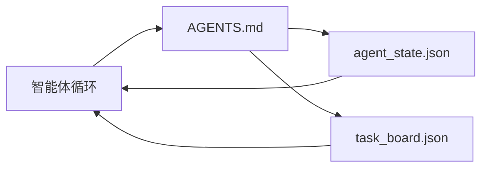

# 最小智能体工作台

> 最小但有用的工作台只有三个文件：根指令路由器、状态文件和任务板。其余一切都建立在它们之上。如果一个代码库连这三个文件都承载不了，任何模型都救不了它。

**类型：** 构建
**语言：** Python（标准库）
**前置要求：** 第 14 阶段 · 第 31 节（为什么能力很强的模型仍会失败）
**用时：** 约 45 分钟

## 学习目标

- 定义构成最小可用工作台的三个文件。
- 解释为什么简短的根路由器胜过冗长的单体 `AGENTS.md`。
- 构建一个智能体每一轮都能读取、在结束时写入的状态文件。
- 构建一个不依赖聊天历史、能够支撑多会话工作的任务板。

## 问题所在

大多数团队通过写一个 3000 行的 `AGENTS.md` 来搭建工作台，然后就认为完成了。模型加载它，忽略无法概括的部分，仍然在那些一贯失败的工作台面上失败。

你需要的是相反的做法：一个很小的根文件，仅在相关时把智能体路由到更深层的文件；智能体行动前读取、行动后写入的持久状态；以及一个任务板，说明哪些任务在进行中、哪些被阻塞、接下来是什么。

三个文件。每个文件都有自己的职责。每个文件都足够机器可读，之后可以演化成真正的系统。

## 核心概念



### AGENTS.md 是路由器，不是手册

好的 `AGENTS.md` 很短。它会把智能体指向：

- 状态文件（你当前在哪里）。
- 任务板（还剩什么）。
- 更深层的规则（位于 `docs/agent-rules.md`）。
- 验证命令（如何知道它有效）。

更长的内容都放进更深层的文档中，仅在需要时加载。冗长手册会被忽略；简短路由器会被遵循。

### agent_state.json 是事实记录

状态承载：活动任务 ID、改动过的文件、作出的假设、阻塞项和下一步行动。智能体每一轮都会读取它。下一次会话读取它，而不是重放聊天。

状态之所以放在文件中，是因为聊天历史不可靠。会话会结束，对话会被裁剪，但文件不会。

### task_board.json 是队列

任务板承载状态为 `todo | in_progress | done | blocked` 的所有任务。当状态为空时，它就是智能体拉取任务的队列；当你想知道智能体是否按计划推进时，它也是你要读取的队列。

任务板上的任务有一个 ID、一个目标、一个所有者（`builder`、`reviewer` 或 `human`）以及验收标准。任务板刻意保持很小：当它超过一屏时，出现的是规划问题，而不是任务板问题。

### 三个文件是底线，不是上限

后续课程会增加范围契约、反馈运行器、验证门、审阅者清单和交接数据包。这里的三个文件是它们共同假定存在的基础。

```figure
wb-three-files
```

## 动手构建

`code/main.py` 会把最小工作台写入一个空代码库，并演示一次智能体回合，该回合会：

1. 读取 `agent_state.json`。
2. 如果状态为空，就从 `task_board.json` 拉取下一个任务。
3. 在范围内只改动一个文件。
4. 写回更新后的状态。

运行：

```text
python3 code/main.py
```

脚本会在自身旁边创建 `workdir/`，铺设三个文件，运行一回合并打印 diff。再次运行它，观察第二回合如何从第一回合停下的地方继续。

## 实际使用

在生产智能体产品内部，同样的三个文件会以不同名称出现：

- **Claude Code：** 用 `AGENTS.md` 或 `CLAUDE.md` 作为路由器，用 `.claude/state.json` 风格的存储保存状态，用 hooks 充当任务板。
- **Codex / Cursor：** 用工作区规则作为路由器，用会话记忆保存状态，用聊天侧栏中排队的任务充当任务板。
- **自定义 Python 智能体：** 就是你刚才写出的同样三个文件。

名称会变，形状不会变。

## 现实中的生产模式

当三个模式叠加在最小工作台之上时，它才能经受真实单体代码库的考验。它们彼此独立；选择你的代码库实际需要的模式。

**带有就近优先规则的嵌套 `AGENTS.md`。** OpenAI 在其主代码库中部署了 88 个 `AGENTS.md` 文件，每个子组件一个。Codex、Cursor、Claude Code 和 Copilot 都会从工作文件向代码库根目录逐级查找，并连接沿途找到的每个 `AGENTS.md`。子目录文件扩展根文件。Codex 增加了 `AGENTS.override.md`，用于替换而不是扩展；这个覆盖机制是 Codex 特有的，跨工具工作时应避免使用。Augment Code 的测量结果才是关键：最好的 `AGENTS.md` 能带来相当于从 Haiku 升级到 Opus 的质量跃升；最差的文件会让输出比完全没有文件更糟。

**即使看起来能覆盖更多内容，也要拒绝这些反模式。** 相互冲突的指令会悄悄把智能体从交互模式降为贪婪模式（ICLR 2026 AMBIG-SWE：解决率从 48.8% 降至 28%）；给优先级编号，而不是把它们平铺堆叠。没有执行命令支撑、无法验证的风格规则（“遵循 Google Python 风格指南”）会让智能体自行臆造合规；每条风格规则都配上精确的 lint 命令。把风格放在命令前面会埋没验证路径；命令在前，风格在后。为人而不是为智能体写作会浪费上下文预算；简洁是一种特性。

**跨工具符号链接。** 用符号链接把一个根文件提供给所有工具（`ln -s AGENTS.md CLAUDE.md`、`ln -s AGENTS.md .github/copilot-instructions.md`、`ln -s AGENTS.md .cursorrules`），让每个编码智能体都遵循同一个事实源。Nx 的 `nx ai-setup` 会从一个配置中自动为 Claude Code、Cursor、Copilot、Gemini、Codex 和 OpenCode 完成这项工作。

## 交付

`outputs/skill-minimal-workbench.md` 会为任何新代码库生成三文件工作台：针对项目调整过的 `AGENTS.md` 路由器、包含正确键的 `agent_state.json`，以及用当前待办事项初始化的 `task_board.json`。

## 练习

1. 给 `agent_state.json` 增加一个 `last_run` 时间戳。如果文件超过 24 小时，除非操作员确认，否则拒绝运行。
2. 给任务板增加一个 `priority` 字段，让拉取器总是选择优先级最高的 `todo` 任务。
3. 把 `task_board.json` 迁移为 JSON Lines，让每个任务独占一行，使版本控制中的 diff 更清晰。
4. 编写一个 `lint_workbench.py`：如果 `AGENTS.md` 超过 80 行，或引用了不存在的文件，就让它失败。
5. 判断三个文件中哪一个丢失的代价最大，并为你的判断辩护。

## 关键术语

| 术语 | 人们常说 | 实际含义 |
|------|----------|----------|
| Router（路由器） | `AGENTS.md` | 把智能体指向更深层文档和文件的简短根文件 |
| State file（状态文件） | “笔记” | 每一轮写入、记录智能体所处位置的机器可读记录 |
| Task board（任务板） | “待办列表” | 记录工作状态、所有者和验收信息的 JSON 队列 |
| System of record（事实记录） | “事实源” | 聊天消失后，工作台仍视为权威的文件 |

## 延伸阅读

- [agents.md — the open spec](https://agents.md/)——Cursor、Codex、Claude Code、Copilot、Gemini、OpenCode 都已采用
- [Augment Code，A good AGENTS.md is a model upgrade. A bad one is worse than no docs at all](https://www.augmentcode.com/blog/how-to-write-good-agents-dot-md-files)——经过测量的质量跃升
- [Blake Crosley，AGENTS.md Patterns: What Actually Changes Agent Behavior](https://blakecrosley.com/blog/agents-md-patterns)——哪些做法经验证有效，哪些无效
- [Datadog Frontend，Steering AI Agents in Monorepos with AGENTS.md](https://dev.to/datadog-frontend-dev/steering-ai-agents-in-monorepos-with-agentsmd-13g0)——实践中的嵌套优先级
- [Nx Blog，Teach Your AI Agent How to Work in a Monorepo](https://nx.dev/blog/nx-ai-agent-skills)——跨六种工具的单一来源生成
- [The Prompt Shelf，AGENTS.md Best Practices: Structure, Scope, and Real Examples](https://thepromptshelf.dev/blog/agents-md-best-practices/)——经得起审阅的章节顺序
- [Anthropic，Claude Code subagents](https://code.claude.com/docs/en/sub-agents)
- 第 14 阶段 · 第 31 节——这个最小工作台所吸收的失败模式
- 第 14 阶段 · 第 34 节——本节预告的持久状态模式
